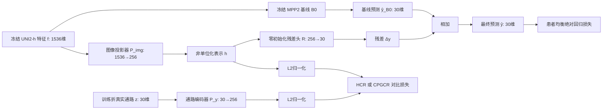

# MPP2 连续通路几何软对比残差实验设计学习指南

> **方法全称**：Continuous Pathway-Geometry Contrastive Residual（连续通路几何软对比残差，CPGCR）  
> **文档版本**：`v0.2`  
> **当前状态**：关联部署方案已批准；本文已同步四臂 XZY 边界  
> **执行授权**：无；本文不是训练许可、工作树绑定许可或服务器操作许可  
> **关联部署方案**：[MPP2连续通路几何软对比残差_初步探索部署方案_20260811.md](../部署方案/MPP2连续通路几何软对比残差_初步探索部署方案_20260811.md)  
> **适用范围**：MPP2 的 Phase 2——由病理图像特征预测 30 维 ssGSEA 通路分数  
> **不在范围**：W004 及 Phase 3 pCR（病理完全缓解）预测；该部分由队友负责  
> **治理边界**：W005 已废弃并永久保留编号，不得复用；如方案经两阶段审核，未来最早候选工作树为 W007  
> **证据边界**：本文解释的是待验证的设计与判读规则，不代表模型已运行，也不代表创新性或性能已经得到证实  
> **副本与跟踪状态**：当前文件是本地待审主副本，所在目录命中现有 `.gitignore`，尚不是 Git 受跟踪的项目权威文件；待用户批准定版后，再按治理流程明确纳入 Git。Google Drive 副本仅供阅读，不构成实验授权或权威事实源  
> **更新日期**：2026-08-11

---

## 0. 先读结论：这套实验真正要回答什么

本项目现有 MPP2 基线已经表现出一个很有代表性的矛盾：**Pearson Correlation Coefficient（皮尔逊相关系数，PCC）尚好，但绝对数值预测不佳**。已验收基线在内部验证上的 pooled PCC（把所有样本和通路摊平后的总体相关）约为 `0.7971`；在外部 XZY 上 pooled PCC 为 `0.6549`，但 raw MAE（原始量纲平均绝对误差）为 `1176.2114`，raw R²（原始量纲决定系数）为 `-0.088`。这意味着模型可能能判断“谁高谁低、哪里一起升降”，却没有把真实分数的幅度和中心预测准确。

可以把它想成一名天气预报员：他经常能正确说出“明天比今天更热”，所以趋势相关性不错；但他把 `30°C` 报成 `18°C`，把 `20°C` 报成 `10°C`，所以绝对误差仍然很大。Phase 3 最近的队友实验又提示，仅用通路分数就能较好预测 pCR。这使“抬高 Phase 2 的绝对通路分数质量”成为值得优先验证的方向，但它并不等于已经证明 Phase 2 每提升一点就一定会提升 Phase 3。

因此，初步实验不是笼统地问“加对比学习会不会更好”，而是依次回答四个更可证伪的问题：

1. 已验收基线能否在同一数据与评估口径下被忠实复放？
2. 加一个小型残差分支并使用新的患者均衡 checkpoint 协议后，整体是否有效？
3. 在同一新协议下，传统“图像—自身标签一一配对”的硬对比学习是否提供增量？
4. 对连续通路分数而言，把“生物学上相近的样本也视作部分正样本”是否比硬配对更合适？

为此，方案只设置四个必要实验臂：

- **Frozen Baseline Replay（冻结基线复放，FBR）**：原样复放已验收 MPP2 基线。
- **Residual Capacity Control（残差容量对照，RCC）**：增加同样的残差预测容量，但不加对比损失；它是 HCR/CPGCR 的直接同协议对照。
- **Hard-Pair Contrastive Residual（硬配对对比残差，HCR）**：在 RCC 上加入 CLIP 风格的一一配对对比损失。
- **Continuous Pathway-Geometry Contrastive Residual（连续通路几何软对比残差，CPGCR）**：在相同架构上，用 30 维通路距离产生连续软目标。

这四臂的核心价值在于**机制归因**。如果没有 RCC，任何提升都可能只是“多加了几层网络或改变了 checkpoint 协议”；如果没有 HCR，就无法判断 CPGCR 的提升来自一般对比正则，还是来自“连续通路几何”本身。`HCR−RCC` 是普通对比的主要增量，`CPGCR−HCR` 是连续软目标的主要增量；`RCC−FBR` 同时包含残差容量与新 checkpoint 协议，不能再强拆成纯容量效应。只有连续软目标相对 HCR/RCC 出现稳定增量，才有理由把它作为后续创新主线。

本文推荐的推进顺序是：先冻结四臂完整合同，再做零训练探针和单随机种子四臂筛选；每臂只用内部验证选择并冻结 checkpoint，随后快速评估一次 XZY；任何逐臂 XZY 结果不得修改后续臂。四臂全部返回后统一分析内部—外部归因，再由用户决定是否追加多随机种子。暂不直接引入复杂空间图网络，因为那会同时改变模型容量、邻域信息、损失函数和数据流，初次实验即使成功也难以知道成功原因。

---

## 1. 阅读地图：从问题到决策的七步链条

方案中的步骤首次出现均给出英文全称、中文全称和缩写编号：

1. **Governance and Asset Freeze（治理与资产冻结，GAF-1）**：确认授权、工作树、数据资产和证据边界。
2. **Baseline Replay and Mechanism Audit（基线复放与机制审计，BRMA-2）**：复放基线并运行零训练机制探针。
3. **Matched Contrastive Screening（匹配对照式对比筛选，MCS-3）**：以同数据、同容量、同预算比较四个实验臂。
4. **Internal-External Batch Return and Unified Analysis（内外批次回传与统一分析，IBUA-4）**：整批返回内部与 XZY 结果后统一计算指标和做机制归因。
5. **Multi-Seed Robustness Confirmation（多随机种子稳健性确认，MSRC-5）**：仅在用户确认后，对候选和 RCC 追加随机种子。
6. **Four-Arm External Benchmark Matrix（四臂外部基准矩阵，FABM-6）**：解释四臂 XZY 与内部结果的方向一致性。
7. **Extension Decision and Handoff（扩展决策与移交，EDH-7）**：决定停止、深化软对比、加入通路查询，还是再探索轻量空间图。

上述七步是便于学习和科研推理的**教学阶段分组**，不是部署方案第 12 节的执行编号。部署方案把同一逻辑进一步拆成 12 个可审计操作步骤；对应关系如下：


| 本指南科研阶段 | 部署方案操作步骤                                                                                                                                                                                                      |
| ------- | ------------------------------------------------------------------------------------------------------------------------------------------------------------------------------------------------------------- |
| GAF-1   | Evidence and Scope Lock（证据与范围锁定，ESL-1）→ Deployment and Experiment Intake Approval（部署与实验受理审批，DEIA-2）→ Frozen Asset Contract Audit（冻结资产合同审计，FACA-3）                                                             |
| BRMA-2  | Baseline Replay and Mechanism Audit（基线复放与机制审计，BRMA-4）                                                                                                                                                         |
| MCS-3   | Matched Contrastive Batch Implementation（匹配对比批次实现，MCBI-5）→ Local Minimal Verification（本地最小验证，LMV-6）→ Gitee Dry-run and Compatibility Audit（Gitee 非证据性试运行与兼容审计，GDCA-7）→ Internal Batch Execution（内部批次执行，IBE-8） |
| IBUA-4  | Unified Internal Analysis（统一内部分析，UIA-9）                                                                                                                                                                       |
| MSRC-5  | Conditional Multi-Seed Confirmation（条件式多随机种子确认，CMSC-10）                                                                                                                                                       |
| FABM-6  | Four-Arm External Benchmark Matrix（四臂外部基准矩阵，FABM-11）                                                                                                                                                          |
| EDH-7   | Result Import and User Decision（结果导入与用户决策，RIUD-12）                                                                                                                                                            |


因此，指南中的 `BRMA-2` 与部署清单中的 `BRMA-4` 是同一科研内容在两种粒度下的编号，不能在实施记录里互换。真正执行时以关联部署方案的 12 步操作编号为准，本指南负责解释“为什么这样做”。

这不是七个必须自动连续执行的流水线。`GAF-1` 完成前不能写实验代码；四臂配置必须在第一次 XZY 前全部冻结；`IBUA-4` 后仍由用户做继续决策。

---

## 2. 必要前置知识

### 2.1 Phase 2 和 Phase 3 分别在做什么

本项目可简化为两级预测：

```text
病理图像 Patch
    ↓ Phase 2
30 维通路 ssGSEA 分数
    ↓ Phase 3
pCR 等临床结局
```

- **Phase 2**：输入是病理图像或其预提取特征，输出是每个 Patch 对应的 30 维连续通路分数。
- **Phase 3**：输入可以是 Phase 2 产生的通路分数，输出是 pCR 等下游临床结局。

两阶段必须保持决策隔离。Phase 3 的标签或性能不能反向用于选择 Phase 2 的 checkpoint（检查点，即某个训练时刻保存的模型），否则会把下游测试信息偷偷带入上游选择。本指南只解决 Phase 2；队友关于“纯通路分数能较好预测 pCR”的发现只作为研究动机，不作为本轮选择信号。

### 2.2 ssGSEA 是什么，为什么它是连续目标

**single-sample Gene Set Enrichment Analysis（单样本基因集富集分析，ssGSEA）**把一个样本内许多基因的表达排序，汇总成某条基因集合或生物通路的活跃程度。项目中每个 Patch 对应 30 条通路，因此标签是：

$$
y_i \in \mathbb{R}^{30}
$$

这里的关键是：不同样本的通路向量不是互斥类别。样本 A 和样本 B 可能在免疫、增殖、缺氧等多条通路上非常接近，也可能只在其中几条不同。把每个样本都当成彼此完全不同的类别，会丢掉这种连续生物学结构。

训练使用的 z-score（标准分数）必须只用训练集统计量拟合：

$$
z_{ik}=\frac{y_{ik}-\mu^{\mathrm{train}}_k}{\sigma^{\mathrm{train}}_k}
$$

其中 $k$ 是通路索引。内部验证集和 XZY 只能套用训练集的 $\mu$ 与 $\sigma$，不得反过来参与拟合。最终交付 Phase 3 的仍应是一次逆变换后的原始 ssGSEA 分数，不能再做患者内 z-score、秩归一化或二次校准。

### 2.3 UNI2-h 冻结特征是什么

**UNI2-h** 是病理图像基础模型。现有 MPP2 流程已为每个 Patch 缓存其 1536 维 CLS 特征向量，可写成：

$$
f_i \in \mathbb{R}^{1536}
$$

“冻结特征”表示本轮不更新 UNI2-h 参数，也不重新从图像提取特征。这样做有三个好处：

1. 最大限度复用现有 MPP2 基线，代码改动和显存需求较小。
2. 把问题聚焦到“预测头和训练目标是否有效”，减少上游编码器变化造成的混杂。
3. 不触碰受保护的特征缓存、ssGSEA、标准划分和 z-score 资产。

代价是：如果真正瓶颈在图像编码器没有捕获到某类细胞形态，本轮轻量头部再聪明也无法创造缺失信息。这是初步筛选应接受的边界。

### 2.4 现有两层 MLP 基线是什么

**Multilayer Perceptron（多层感知机，MLP）**是全连接神经网络。已验收 MPP2 基线大致为：

```text
1536 维 UNI2-h 特征
    → Linear(1536, 1024)
    → GELU 激活
    → Dropout(0.3)
    → Linear(1024, 30)
    → 30 维通路预测
```

训练学习率为 `1e-4`、batch size（批大小）为 `32`、随机种子为 `42`，最大 `50` 个 epoch（训练轮次）并带早停；已验收检查点出现在第 `15` 个 epoch。初步新方案不重写这条基线，而是把它冻结为锚点：

$$
\hat y_i^{B0}=B_0(f_i)
$$

新分支只学习残差 $\Delta y_i$：

$$
\hat y_i=\hat y_i^{B0}+\Delta y_i
$$

### 2.5 为什么 PCC 尚好，不代表绝对预测已经好

#### PCC：看共变趋势

PCC 衡量两个变量是否线性同升同降。若所有预测都被缩小一半，PCC 仍可能很高。

#### R²：看是否比“直接报均值”更好

**Coefficient of Determination（决定系数，R²）**可写为：

$$
R^2=1-\frac{\sum_i(y_i-\hat y_i)^2}{\sum_i(y_i-\bar y)^2}
$$

`R² < 0` 表示模型在该评估口径下甚至不如直接预测真实均值。它对中心偏移和尺度错误很敏感，正好补充 PCC 的盲点。

#### MAE：看平均差了多少原始单位

**Mean Absolute Error（平均绝对误差，MAE）**为：

$$
\mathrm{MAE}=\frac{1}{N}\sum_i|y_i-\hat y_i|
$$

raw MAE 回到原始 ssGSEA 量纲，更接近 Phase 3 实际会接收到的误差。

#### CCC：同时看趋势和校准

**Concordance Correlation Coefficient（一致性相关系数，CCC）**同时惩罚相关性不足、均值偏移和方差不匹配。可以把 PCC 理解为“两条曲线是否一起动”，把 CCC 理解为“两条曲线是否既一起动、又落在接近的数值位置”。

#### pooled 与 per-pathway 必须分开

在评估 $N$ 个样本、$K=30$ 条通路的预测表现时，真实值矩阵为 $Y \in \mathbb{R}^{N \times K}$，预测值矩阵为 $\hat{Y} \in \mathbb{R}^{N \times K}$。

##### 1. 两种 PCC 计算的原始公式

- **pooled PCC（池化/摊平皮尔逊相关系数）**：把 $N \times K$ 个数据点展开为两个一维长向量 $\boldsymbol{y}_{\text{pooled}}$ 与 $\hat{\boldsymbol{y}}_{\text{pooled}}$，统一计算单个 PCC：

$$
\mathrm{PCC}_{\text{pooled}} = \frac{\sum_{k=1}^K \sum_{i=1}^N (y_{i,k} - \mu_{Y, \text{pooled}})(\hat{y}_{i,k} - \mu_{\hat{Y}, \text{pooled}})}{\sqrt{\sum_{k=1}^K \sum_{i=1}^N (y_{i,k} - \mu_{Y, \text{pooled}})^2} \sqrt{\sum_{k=1}^K \sum_{i=1}^N (\hat{y}_{i,k} - \mu_{\hat{Y}, \text{pooled}})^2}}
$$

其中全局均值 $\mu_{Y, \text{pooled}} = \frac{1}{NK} \sum_{k=1}^K \sum_{i=1}^N y_{i,k}$，$\mu_{\hat{Y}, \text{pooled}} = \frac{1}{NK} \sum_{k=1}^K \sum_{i=1}^N \hat{y}_{i,k}$。

- **mean per-pathway PCC（通路平均皮尔逊相关系数）**：先对每条通路 $k$ 单独计算其在 $N$ 个样本上的 PCC（记为 $\mathrm{PCC}_k$），再对 $K$ 条通路的 PCC 取算术平均：

$$
\mathrm{PCC}_k = \frac{\sum_{i=1}^N (y_{i,k} - \bar{y}_k)(\hat{y}_{i,k} - \bar{\hat{y}}_k)}{\sqrt{\sum_{i=1}^N (y_{i,k} - \bar{y}_k)^2} \sqrt{\sum_{i=1}^N (\hat{y}_{i,k} - \bar{\hat{y}}_k)^2}}
$$

$$
\mathrm{PCC}_{\text{mean-per-pathway}} = \frac{1}{K} \sum_{k=1}^K \mathrm{PCC}_k
$$

其中单通路均值 $\bar{y}_k = \frac{1}{N}\sum_{i=1}^N y_{i,k}$，$\bar{\hat{y}}_k = \frac{1}{N}\sum_{i=1}^N \hat{y}_{i,k}$。

- **per-patient 指标**：每位患者分别计算，防止样本多（Patches 数量大）的患者支配整体评估结果。

##### 2. 为什么会产生这两种后果？

1. **为什么 pooled PCC“容易受通路间天然尺度与均值差异影响”？**
  - **组间均值排序掩盖组内预测能力（虚高假象）**：Pooled PCC 采用全体数据的统一全局均值 $\mu_{\text{pooled}}$ 进行中心化。根据全协方差分解定理，Pooled PCC 的分子可拆解为：

$$
\sum_{k=1}^K \sum_{i=1}^N (y_{i,k} - \mu_{Y, \text{pooled}})(\hat{y}_{i,k} - \mu_{\hat{Y}, \text{pooled}}) = \sum_{k=1}^K \sum_{i=1}^N (y_{i,k} - \bar{y}_k)(\hat{y}_{i,k} - \bar{\hat{y}}_k) + N \sum_{k=1}^K (\bar{y}_k - \mu_{Y, \text{pooled}})(\bar{\hat{y}}_k - \mu_{\hat{Y}, \text{pooled}})
$$

```
 - **等式右侧第一项（通路内样本波动协方差）**：$\sum_{k=1}^K \sum_{i=1}^N (y_{i,k} - \bar{y}_k)(\hat{y}_{i,k} - \bar{\hat{y}}_k)$，衡量模型在单条通路内部对不同样本特异性变化的拟合能力。
 - **等式右侧第二项（通路间固有均值排序协方差）**：$N \sum_{k=1}^K (\bar{y}_k - \mu_{Y, \text{pooled}})(\bar{\hat{y}}_k - \mu_{\hat{Y}, \text{pooled}})$，衡量不同通路天然表达基线均值的排序关系。
 
 如果不同通路本身的表达基线差距很大（例如通路 A 均值为 $+10$，通路 B 均值为 $-10$），即使模型对每条通路内部的样本差异完全无法预测（通路内 $\mathrm{PCC}_k = 0$），只要模型仅仅学会了“通路 A 平均值高于通路 B”，第二项（组间均值项）就会贡献极大的正协方差，导致 pooled PCC 计算出虚高的假象（如 0.9+）。
```

- **大方差/大尺度通路主导分母离差和**：天然方差极大、数值尺度大的通路会在总离差平方和中占据主导地位，导致小方差通路的预测误差或优异表现被完全掩盖。

2. **为什么 mean per-pathway PCC“更能回答‘平均一条通路能否被预测’”？**
  - **剥离组间基线偏移（去除均值干扰）**：计算单通路 $\mathrm{PCC}_k$ 时，分子与分母均使用该通路自身的均值 $\bar{y}_k$ 与 $\bar{\hat{y}}_k$ 进行中心化，彻底去除了通路间固有表达基线的差异 $(\bar{y}_k - \mu_{\text{pooled}})$，纯粹衡量模型在该通路内部对不同样本/Patches 间“相对特异性波动”的拟合能力。
  - **等权重无偏评估（Equal Weighting）**：每条通路不论其天然绝对数值范围或方差大小，计算出的 $\mathrm{PCC}_k$ 均归一化至 $[-1, 1]$ 区间，且在取均值时获得完全相等的权重（$1/K$）。这真实反映了模型随机应用到任意一条通路上的期望预测相关性。

本方案不会用一个数字代替全部事实。

### 2.6 什么是对比学习

**Contrastive Learning（对比学习）**的直觉是：让应该相似的对象在嵌入空间靠近，让不相似的对象远离。本项目里每个训练样本有两种“视图”：

- 图像视图：UNI2-h 特征经过图像投影器后的向量。
- 通路视图：真实 30 维通路分数经过通路编码器后的向量。

如果把嵌入空间想成一间宴会厅，普通回归只要求服务员最后把每位客人的 30 道菜端对；对比学习还要求“形态与通路相似的客人站得更近”。这样可能让图像表示更好地围绕生物通路结构组织。

### 2.7 InfoNCE 与 CLIP 式双向对齐

**InfoNCE（噪声对比估计损失）**通过 softmax（归一化指数函数）让正确配对的相似度高于批内其他配对。[CLIP](https://arxiv.org/abs/2103.00020) 将图像到文本、文本到图像两个方向的损失取平均；本项目把“文本”替换成“通路标签表示”。

设图像嵌入为 $u_i$，通路嵌入为 $v_j$，都做 L2 归一化：

$$
\tilde u_i=\frac{u_i}{\|u_i\|_2},\qquad
\tilde v_j=\frac{v_j}{\|v_j\|_2}
$$

相似度为：

$$
s_{ij}=\frac{\tilde u_i^\top \tilde v_j}{\tau_{con}}
$$

$\tau_{con}$ 是 contrastive temperature（对比温度），控制 softmax 的尖锐程度。本方案初筛建议固定为 `0.07`，不在内部验证集或 XZY 上搜索。

传统硬配对把 $i=j$ 视作唯一正样本，其他 $i\ne j$ 全是负样本。对分类或图文检索，这通常自然；对连续通路向量，却可能把两个生物学上几乎相同的 Patch 强行推远。

### 2.8 连续软标签：把“相似程度”放进监督

CPGCR 不再问“是不是同一个样本”，而是问“通路状态有多相似”。对训练批次中的样本 $i,j$，先计算 30 维训练 z-score 标签的平方欧氏距离：

$$
d_{ij}=\frac{1}{30}\|z_i-z_j\|_2^2
$$

再转换为软目标概率：

$$
q_{ij}=\frac{\exp(-d_{ij}/\tau_y)}
{\sum_{k\in\mathcal V_i}\exp(-d_{ik}/\tau_y)}
$$

$\tau_y$ 是标签几何温度；$\mathcal V_i$ 是 batch 中所有非 padding、非缺失的有效样本集合，包括同患者和跨患者样本。$q_{ii}$ 通常最大，但与 $i$ 通路状态接近的其他样本也获得非零权重。

一个直观比喻是考试评分：硬对比只允许“答案完全同一个编号”得分，哪怕两份答案只差一个小数点也被当作完全错误；软对比则按答案接近程度给部分分。对于连续生物分数，后者更符合目标结构。

本方案将 $\tau_y$ 预登记为：使用 `seed=42`，先等概率覆盖 6 名训练患者形成的 15 个无序患者对，再在每个患者对内部抽 spot 对，总计最多 `100,000` 对，取 $d_{ij}$ 的中位数。若某患者对合法样本不足，则使用该对全部合法 pair，并记录实际数量；不能简单从所有 spot pair 混抽，否则大患者会主导温度。这样它会随标签天然尺度调整，又不读取内部验证或 XZY。抽样规则、各患者对实际 pair 数和所得数值必须随结果记录，避免每次运行悄悄变化。

### 2.9 为什么本轮不屏蔽同患者非对角样本对

同一患者的 Patch 往往共享染色风格、切片批次和个体背景，患者身份确实可能成为捷径。但“屏蔽同患者非自身样本”会产生一个反直觉问题：对某个图像锚点而言，候选集中唯一同患者对象只剩自身正样本，其余全是其他患者。模型只要识别患者风格，就可能轻松找到正样本，反而强化患者捷径。

因此本轮 HCR 与 CPGCR 都使用完整批内候选集合，只屏蔽 padding 或缺失项：

- HCR 将自身设为唯一硬正样本，并保留其他同患者样本作为困难负样本。
- CPGCR 不预设同患者必正或必负，而是让同患者和跨患者样本都按真实 30 维通路距离获得连续权重。
- 两臂候选集合完全相同，使 `CPGCR−HCR` 只比较目标形式。

这像考试中不能因为学生来自同一学校就把他们全部从排名中删掉；真正要做的是保留所有答卷、按答案相似度评价，并另行检查模型能否仅凭校服识别学校。对应地，本方案保留患者均衡采样，并报告嵌入的患者可预测性和同患者近邻率。若未来要证明跨患者泛化，需要真正排除该患者训练信息的 fold-specific 基线或冻结后的外部评估，而不是依赖一个看似保守的 mask。

### 2.10 什么是患者均衡

如果某患者有 5000 个 Patch，另一患者只有 500 个，普通随机采样会让大患者的梯度影响约为小患者的十倍。**Patient-Balanced Sampling（患者均衡采样）**先均匀选择患者，再从该患者内选 Patch，使每位患者对训练和指标的贡献更接近。

患者均衡的目标不是复制或删除数据，而是控制“谁的话语权更大”。初筛建议训练损失按患者等权汇总，内部验证主指标也使用患者等权 z-MSE，另外保留普通样本级指标作为描述。

### 2.11 什么是残差学习与零初始化

残差分支不从零预测完整通路，而是对已验收基线做小修正：

$$
\hat y_i=B_0(f_i)+R(h_i)
$$

其中 $R$ 是残差头。将残差头最后一层权重和偏置初始化为零，称为 **Zero Initialization（零初始化）**。训练第 0 步时有：

$$
R(h_i)=0,\qquad \hat y_i=B_0(f_i)
$$

这像在成熟导航系统旁边加一个“纠偏旋钮”：旋钮初始停在零位，新模块必须通过训练逐渐学会何时修正。它并不保证训练后绝不退化，但能防止随机初始化一开始就破坏基线，并让退化原因更容易定位。

### 2.12 为什么要同时保留归一化和非归一化支路

对比相似度适合使用 L2 归一化嵌入，因为它关注方向；连续回归则需要保留幅度信息。若残差头也只读取单位向量，模型可能难以表达“强度更高多少”。

因此同一个图像投影 $h_i$ 分成两路：

```text
h_i ── L2 归一化 ──> 对比相似度（只比较方向）
 │
 └── 保持非单位长度 ──> 残差头（保留幅度）
```

可以把归一化支路比作指南针，只关心朝向；非归一化支路像速度表，还要保留“走得多快”。把两者混成一个读数，会同时损害对齐和回归。

### 2.13 什么是数据泄漏

**Data Leakage（数据泄漏）**是训练或选择阶段使用了本应不可见的验证/测试信息，使结果看起来更好但无法真实泛化。本方案重点防止以下泄漏：

1. 用内部验证或 XZY 拟合 z-score。
2. 用 XZY 选择 $\lambda$、温度、epoch 或模型臂。
3. 在 kNN 探针中把内部验证标签或残差放进 gallery（图库/记忆库）。
4. 同一患者大量 Patch 同时出现在不合规的训练与验证角色中。
5. 用 Phase 3 性能反选 Phase 2 checkpoint。

内部验证标签可以用于**最终评估内部候选**，但不能被写进训练图库、拟合超参数或参与训练梯度。这一区分很重要：考试结束后看答案打分是正常的，把答案提前塞进复习资料才是泄漏。

---

## 3. 两份云端方案与一份论文解读：相同点和不同点

本指南综合的三份云端材料是：

1. [MPP2 Phase2递进式实验方案_v0.1](https://docs.google.com/document/d/16Qs2ZVodQ-F2LUrGDJo3S-Khl2Hc8PtUFOp0K2aHRjg/edit)
2. [Phase2改进路线方案_对比学习与空间图方向_v1.0](https://docs.google.com/document/d/1bCGFBH8aeMoHbxH6atf3VR0iKoDG5m6a6CBkrrsUU-k/edit)
3. [Phase2三篇核心论文学习与方案映射_PEaRL-DeepPathway-Reg2ST_v1.0](https://docs.google.com/document/d/1jv8k7E7Sg3N-aRtCrelxwYIAOl_OSNxOQwU25eOukVA/edit)

为便于讨论，下文将第一份称为“递进方案”，第二份称为“对比—空间图方案”，第三份称为“论文映射解读”。

### 3.1 三份材料的共同点

它们共享四个重要判断：

1. **不应丢弃现有 MPP2 基线**：UNI2-h 已提供可用形态表征，优先在头部和训练机制上改进。
2. **通路是比单基因更稳定的中间表征**：30 维 ssGSEA 既有生物学语义，也降低了输出维度。
3. **实验应逐级增加复杂性**：先回答小问题，再决定是否接入图库、空间图或复杂解码器。
4. **不能只看 PCC**：绝对误差、R²、患者级和通路级稳定性同样关键。

### 3.2 核心不同点


| 维度       | 递进方案                                         | 对比—空间图方案                    | 论文映射解读                                        |
| -------- | -------------------------------------------- | --------------------------- | --------------------------------------------- |
| 起点       | 已验收基线及残差/图库探针                                | 图像—通路双编码器                   | 三篇参考工作的机制抽象                                   |
| 第一优先机制   | 低工程量残差、校准、Training-Gallery（训练图库）             | 对比学习，之后接空间图                 | PEaRL 的图像—通路对齐、DeepPathway 的软/硬目标、Reg2ST 的动态图 |
| 优势       | 能快速验证绝对误差是否可被小修正；与现有代码接近                     | 创新空间较强；直接利用标签几何和空间邻域        | 帮助识别哪些论文机制可借、哪些不可直接照搬                         |
| 主要风险     | gallery 若使用内部验证标签，会形成传导式或泄漏式评估；单纯图库不是真正的对比学习 | 一次引入投影器、标签编码器、对比损失和图网络，归因困难 | 论文任务、数据划分和指标与本项目并不完全一致                        |
| 对本轮最适合借鉴 | 冻结基线、残差小步改动、训练图库探针                           | 图像—通路对比主线                   | 用机制而不是用论文标题做选择                                |
| 本轮不直接采用  | 任何把内部验证标签放进图库的做法                             | 首轮直接上完整 GNN/动态图             | 把论文结果当作本项目必然收益                                |


### 3.3 推荐的综合方式

本方案不是在两份方案中二选一，而是做一个更严格的交集：

- 从递进方案继承“冻结已验收基线、只学小残差、先做低成本探针”。
- 从对比—空间图方案继承“图像与真实通路表示对齐”的创新主轴。
- 从论文映射解读中吸收 PEaRL 的双模态对齐、DeepPathway 的连续相似度线索，以及 Reg2ST 的空间图作为后续条件分支。
- 新增 RCC 和 HCR 两个必要对照，避免把额外容量或一般对比效果误写成连续通路几何的贡献。
- 删除首轮完整 GNN，避免工程复杂度和归因问题。

---

## 4. 三篇参考论文的原始设计与项目适配性

### 4.1 PEaRL：最接近本项目，但仍不能直接照搬

[PEaRL 原文](https://arxiv.org/html/2510.03455)的核心思想是把病理图像和通路表示映射到同一嵌入空间。其设计包含：

- 由 ssGSEA 得到通路层面的分数。
- 使用通路编码器和图像编码器形成双模态嵌入。
- 采用对称 CLIP/InfoNCE 风格的一一配对目标。
- 在对比预训练后冻结表示，再用 MLP 做通路预测。
- 融入坐标信息，强调空间转录组场景。

论文报告的若干 PCC 结果显示 PEaRL 相对对照在乳腺和皮肤数据上有所提升，例如 `0.5055 vs 0.4197`、`0.3523 vs 0.3306`；但在一个淋巴数据设置中为 `0.2247 vs 0.2396`，并非所有数据集都改善。具体任务、对照和指标口径应以原文表格为准。这一点提醒我们：论文证明的是“机制有希望”，不是“迁移到 MPP2 必然有效”。

#### 最适配之处

1. 输出同样是通路层面连续信号，而不是离散病理类别。
2. 图像与通路存在天然配对，可直接构成跨模态对比任务。
3. 其 256 维嵌入为本项目轻量投影器提供了合理起点。

#### 不能直接照搬之处

1. PEaRL 的主要对比目标是样本身份硬配对，没有充分利用 30 维通路的连续邻近关系。
2. “先对比、再冻结回归”的两阶段训练可能把表示对齐与绝对误差优化割裂；本项目当前最痛的是 raw R²/MAE，故应让绝对回归损失从一开始就参与。
3. 原文虽描述交叉验证，但主文对同切片 Patch 是否严格隔离的细节不足以替代本项目自己的 manifest（清单）和患者级治理。
4. 论文中的路径和数据规模与本项目不同，不能直接沿用其阈值或期望增益。

#### 本项目的改动

本项目采用“联合残差回归 + 对比正则”，即基线输出保留，对比学习只帮助残差分支组织表示；同时增加 RCC、HCR 与连续软目标，使机制归因比直接复刻更完整。

### 4.2 DeepPathway：提供软相似度线索，但论文与代码路径需区分

[DeepPathway 预印本](https://www.biorxiv.org/content/10.1101/2025.07.21.665956v1)同样通过病理图像预测通路活性，并采用图像—通路双模态对齐。它使用 UCell（单样本基因集打分方法）和 Hallmark（经典癌症生物学标志通路集合）等构造通路标签。

其[公开代码](https://github.com/aahsan045/DeepPathway/blob/main/models.py)中可以观察到两类有启发性的实现：

- `BLEEPOnly` 路径包含基于相似度分布的软目标思路。
- `BLEEPWithOptimus` 路径使用更接近身份配对的硬目标；代码中的最终组合路径看起来更接近这一实现。

这里应谨慎使用“看起来”一词：仓库代码快照、论文文字和作者实际训练配置可能存在版本差异，若未来要正式复现，需要固定具体 commit 并核验入口。本轮只借鉴其“连续标签可以形成软相似度监督”的方法思想。

#### 最适配之处

1. 直接通路回归，与本项目输出层级一致。
2. 软目标提供了超越身份配对的明确设计线索。
3. 不需要先引入复杂空间图即可测试对比机制。

#### 风险与改动

- DeepPathway 的标签打分体系、数据集和训练入口与 MPP2 不同，不能照搬数值超参数。
- 本项目用现有 30 维 ssGSEA 训练 z-score 距离构造软目标；保留完整批内候选，以避免同患者仅剩唯一正样本的患者身份捷径，并另行报告患者可预测性诊断。
- 本项目明确将软目标与 RCC/HCR 匹配比较，避免只报告单一候选。

### 4.3 Reg2ST：空间建模有价值，但首轮任务错配较大

[Reg2ST 论文](https://academic.oup.com/bib/article/26/4/bbaf425/8237539)及其[公开代码](https://github.com/Holly-Wang/Reg2ST)面向更高维的基因表达预测，组合了对比学习、特征预测、ZINB（Zero-Inflated Negative Binomial，零膨胀负二项分布）计数建模、重建损失和动态空间图。

#### 值得借鉴之处

- 图结构可根据组织局部关系动态更新，而非只依赖固定规则。
- 空间邻域能补充单 Patch 图像难以表达的组织上下文。
- 多任务损失说明“表示对齐 + 目标预测”可以协同，而不必完全分阶段。

#### 为什么不适合作为初筛骨架

1. Reg2ST 主要处理基因计数或高维表达，ZINB 对本项目连续 ssGSEA 分数并不自然。
2. 同时加入动态建图、重建和多损失会使代码和调参规模显著扩大。
3. 若结果改善，无法判断是对比学习、空间邻域、计数建模还是模型容量造成。
4. RTX 4060 8GB 本地硬件虽可完成轻量调试，但不适合把复杂图模型作为首轮低成本验证。

因此，本轮只把 Reg2ST 的空间图思想放到 EDH-7 的条件分支：只有残差呈稳定空间自相关，且软对比已显示有效时，才考虑轻量 kNN 图或动态邻接。

### 4.4 三篇论文对本项目的适配性总表


| 论文          | 原始输出    | 对比目标          | 空间机制    | 对 MPP2 的适配性      | 本轮处理                          |
| ----------- | ------- | ------------- | ------- | ---------------- | ----------------------------- |
| PEaRL       | 通路活性    | 对称硬配对 CLIP    | 坐标/空间信息 | 高：任务层级最接近        | 借双编码器和 256 维投影，改为联合残差回归并增加软目标 |
| DeepPathway | 通路活性    | 代码含软相似度与硬配对路径 | 非首要     | 中高：软标签思路直接相关     | 借连续相似度，不照搬数据与入口               |
| Reg2ST      | 基因表达/计数 | 多任务对比         | 动态图     | 中低：空间思想相关，输出分布错配 | 只作为后续空间扩展参考                   |


### 4.5 对“创新性”的正确表述

“冻结已验收基线 + 双支路嵌入 + 训练折连续通路几何软目标 + 完整批内候选 + 患者捷径诊断 + 残差/硬对比匹配对照”是一个**有项目针对性的候选组合**。它可能比简单复刻 CLIP 更具方法辨识度，但当前不能宣称：

- 全球首次；
- 已显著优于现有方法；
- 已证明能提高 Phase 3；
- 已证明空间生物学机制成立。

若初筛成功，正式论文写作前仍需扩大检索范围、核对近年连续标签监督对比学习、度量学习和空间转录组工作，才可界定创新边界。

---

## 5. 建议模型：一个锚点、两条支路、四个实验臂

### 5.1 统一架构



建议初筛的轻量模块为：

```text
P_img: Linear(1536, 256) → GELU
R:     Linear(256, 30)，最后层权重与偏置均初始化为 0
P_y:   Linear(30, 256) → GELU → Linear(256, 256)
```

这里的 `256` 来自参考论文常见嵌入规模，也是较低工程成本的起点。新投影器首轮不加 Dropout，减少不同训练路径消耗不同随机数导致的匹配误差。RCC、HCR、CPGCR 使用完全相同的预测分支。通路编码器只在有对比损失时获得梯度，推理阶段不需要真实通路标签，也不需要保留该编码器才能产生预测。

冻结 B0 还必须冻结运行行为：B0 参数无梯度、不进入优化器；复合模型执行 `train()` 时仍强制 B0 保持 `eval()`，且 B0 前向放在 `torch.no_grad()` 中。否则 B0 原有的 `Dropout(0.3)` 会在训练态产生随机输出，所谓“零初始化等于 accepted 基线”就不成立。

### 5.2 四臂定义


| 实验臂   | 预测路径           | 对比损失          | 主要回答的问题                       |
| ----- | -------------- | ------------- | ----------------------------- |
| FBR   | 仅冻结 $B_0$      | 无             | 已验收基线能否按原口径复放？                |
| RCC   | $B_0 +$ 零初始化残差 | 无             | 无对比的残差与新 checkpoint 协议整体是否有效？ |
| HCR   | 与 RCC 相同       | 硬身份双向 InfoNCE | 一般跨模态对比正则是否有效？                |
| CPGCR | 与 RCC 相同       | 连续通路几何软对比     | 连续标签结构是否比硬身份更合适？              |


公平比较的原则是：RCC、HCR、CPGCR 的数据、预测架构、初始化规则、优化器、学习率、batch 计划、epoch 预算、早停指标、随机种子和输出格式完全一致；唯一有意变化是对比监督。每个 seed 保存同一份图像分支初始状态供三臂加载，HCR/CPGCR 再共享同一份通路编码器初始状态；batch 计划预生成并回传。FBR 不训练新模块，只复放基线并按新旧两套评估口径报告。

HCR 与 CPGCR 使用完全相同的完整批内候选集合；两臂之间只允许“硬身份目标”与“连续软目标”不同。accepted FBR 的历史 checkpoint 由普通逐 spot `val_loss` 选出，不能重选；新三臂使用 patient-balanced z-MSE，因此 `RCC−FBR` 是残差容量与选择协议的整体差异。`HCR−RCC` 与 `CPGCR−HCR` 才是主要机制比较。

### 5.3 绝对回归损失

设患者集合为 $\mathcal P$，患者 $p$ 的训练样本集合为 $\mathcal I_p$，30 条通路数为 $K=30$。患者等权 z-MSE 可写为：

$$
\mathcal L_{abs}
=\frac{1}{|\mathcal P|}\sum_{p\in\mathcal P}
\frac{1}{|\mathcal I_p|K}
\sum_{i\in\mathcal I_p}\sum_{k=1}^{K}
(\hat z_{ik}-z_{ik})^2
$$

它直接针对当前绝对性能痛点。初筛 checkpoint 的内部选择也以 patient-balanced z-MSE（患者均衡标准分数均方误差）为唯一主选择指标；PCC、R² 等用于完整判读，而不共同参与自动挑选。

### 5.4 HCR 的硬配对损失

对每个锚点 $i$，有效比较集合是 batch 中全部非 padding 样本：

$$
\mathcal V_i=\{j\mid j\ \text{是有效 batch 样本}\}
$$

图像到通路方向：

$$
\mathcal L_{i\to y}^{hard}
=-\frac{1}{B}\sum_i
\log\frac{\exp(s_{ii})}
{\sum_{j\in\mathcal V_i}\exp(s_{ij})}
$$

通路到图像方向同理。最终为：

$$
\mathcal L_{con}^{HCR}
=\frac{1}{2}\left(
\mathcal L_{i\to y}^{hard}+\mathcal L_{y\to i}^{hard}
\right)
$$

实现时必须用最小数值测试确认分子、分母、掩码和两个方向的括号位置，不能只凭视觉抄写公式。

### 5.5 CPGCR 的连续软对比损失

在同一有效集合 $\mathcal V_i$ 上，根据训练标签距离计算软目标。为避免一个常见实现错误，两个方向必须**分别按行归一化**，不能先得到一个已经行归一化的 $Q$，再把它简单转置当作反向目标。

令 $D_{ij}=d_{ij}$。同患者和跨患者样本都保留；只有 padding 或缺失位置在 softmax 前置为负无穷。两个方向的目标分别是：

$$
Q_{I2P}=\operatorname{row\_softmax}
\left(-D/\tau_y\right)
$$

$$
Q_{P2I}=\operatorname{row\_softmax}
\left(-D^\top/\tau_y\right)
$$

其中 `row_softmax` 表示每一行独立归一化。即使 $D$ 在数学上对称，数值归一化也应按方向显式计算；`Q_P2I = Q_I2P.T` 通常不成立，因为“转置一个已按行归一化的矩阵”不会自动变成新的按行归一化分布。

模型预测的图像到通路匹配分布为：

$$
p^{i\to y}_{ij}
=\frac{\exp(s_{ij})}
{\sum_{k\in\mathcal V_i}\exp(s_{ik})}
$$

图像到通路方向使用 $Q_{I2P}$ 的第 $i$ 行作为软目标；软交叉熵为：

$$
\mathcal L_{i\to y}^{soft}
=-\frac{1}{B}\sum_i\sum_{j\in\mathcal V_i}
Q^{I2P}_{ij}\log p^{i\to y}_{ij}
$$

反向的通路到图像分布使用转置相似度，并使用**重新按行归一化**的 $Q_{P2I}$。总对比损失为：

$$
\mathcal L_{con}^{CPGCR}
=\frac{1}{2}\left(
\mathcal L_{i\to y}^{soft}+\mathcal L_{y\to i}^{soft}
\right)
$$

总训练目标统一为：

$$
\mathcal L=\mathcal L_{abs}+\lambda\mathcal L_{con}
$$

初筛预注册建议：

- `lambda_con = 0.1`
- `tau_con = 0.07`
- `tau_y = seed 42、训练折 15 个患者对尽量等额抽取、总计最多 100,000 个跨患者标签 pair 平方距离的中位数`
- 不做网格搜索
- 不读取 XZY 调整任何数值

`lambda_con = 0.1` 只是低强度正则起点，不是经过本项目验证的最优值。选择单一固定值的目的，是先判断机制有没有方向性信号，避免在小规模内部验证集上“试到一个刚好好看”的组合。用户可以在批准实施方案前修改它；一旦批准并登记，初筛期间不得临时改动。

### 5.6 为什么通路编码器在推理阶段可以丢掉

训练时，真实通路向量像一名“生物学教练”，告诉图像投影器哪些样本应该靠近。预测新样本时没有真实通路标签，因此教练不能上场；真正出场的是图像投影器和残差头。对比学习的作用是改变训练方向，而不是在推理时偷看答案。

这也构成一项必要测试：推理函数必须只接收图像特征和基线模型，若还要求输入真实 $y$，则实现发生了标签泄漏。

---

## 6. 七个实验步骤为何这样设计

## 6.1 GAF-1：先锁定“什么能动、什么不能动”

### 为什么需要这一步

这项实验牵涉已验收基线、受保护的 ssGSEA、z-score、manifest、服务器训练和未来工作树。如果直接写代码，最容易发生的不是模型错误，而是版本、数据或证据角色混乱：即便结果好，也无法证明它来自哪个代码和哪套数据。

### 参考设计原来怎么做

- 递进方案强调以已验收 MPP2 为锚点逐级增加机制。
- 三篇论文通常描述算法与实验划分，但不会替本项目处理工作树、受保护资产、Gitee 往返和外部队列封存。

### 本项目做了什么改动

把治理变成实验的第一个显式步骤，而不是附录。当前文档仅为部署讨论稿，状态为 `pending_user_review`，不能直接触发代码和训练。若用户批准定版部署方案，仍需：

1. 创建 `project_state/implementation_plans/W007-<名称>_实施方案.md`。
2. 由用户再次审核并明确批准实施方案。
3. 才能绑定或创建未来最早的 W007 工作树。
4. 用户显式切换到该工作树后，才允许编辑实验代码。
5. 正式服务器训练还需绑定 `job_id`、`source_commit` 和显式批准文件。

W005 已是 `abandoned_reserved`（废弃但永久占号），不得改名或复用；W004 的 Phase 3 探索不进入本方案。本轮不重新生成 UNI2-h 缓存、ssGSEA、标准划分、z-score 参数或 manifest。

### 具体要冻结的对象

- 已验收基线 experiment/result/checkpoint 身份。
- 现有修复后 manifest 及其训练/内部验证角色。
- 训练集拟合的 30 通路 z-score 参数。
- 外部 XZY 的仅最终评估角色。
- 四臂配置、主选择指标和统一输出字段。
- 不新增哈希治理；如未来确需新哈希检查，先向用户说明必要性与影响并取得批准。

### 解决的痛点与优势

- 确保任何提升都能追溯到明确的机制和代码版本。
- 防止废弃 W005 被意外复活。
- 保护 XZY 不被用作调参集。

### 潜在风险

治理步骤会让启动时间略长，但这是可重复科学实验的必要成本。若跳过，后续性能数字可能无法成为 accepted evidence（已验收证据）。

### 用户决策点

用户需要先判断部署方案是否定版。当前并未授权创建 W007、实施方案、代码或训练。

## 6.2 BRMA-2：先确认地基，再判断对比假设有没有数据支撑

### 为什么需要这一步

如果 FBR 无法复现已验收结果，那么后面的差异可能来自数据读取、checkpoint、逆 z-score 或指标实现变化，而不是新机制。另一方面，直接训练对比模型前，可以用现有特征和标签做三个低成本探针，判断“形态距离是否真的包含通路几何”。

### 参考设计原来怎么做

- 递进方案提出冻结基线复放和 Training-Gallery 探针。
- CLIP、PEaRL 与 DeepPathway 直接开始训练对齐表示，通常不会先为本项目做“对比前提是否成立”的零训练审计。

### 本项目做了什么改动

BRMA-2 分成基线复放和零训练机制探针两部分。

#### A. FBR 基线复放

加载已验收 MPP2 checkpoint，不训练新参数，复放内部验证预测，并核对：

- 旧口径 internal val loss 约 `0.374886`，绝对差须不超过 `1e-5`。
- 旧口径 pooled PCC 参考值为 `0.797126`，绝对差须不超过 `1e-5`。
- 预测行数、30 通路顺序、样本 ID、patient ID、坐标和逆变换规则一致。
- 另外按本方案新口径补算患者均衡 z-MSE、raw R²、raw MAE、mean per-pathway PCC 和 CCC。

旧指标核对用于确认“同一个基线”；新指标用于后续四臂公平比较。新旧指标不应混写成一个值。

#### B. 零训练探针一：特征—标签距离一致性

对训练折内的跨患者样本对，分别计算 UNI2-h 特征距离与 30 维标签距离，报告 Spearman rank correlation（斯皮尔曼秩相关）。若图像相近的样本通常也具有相近通路状态，两个距离排序应表现出非随机一致性。

#### C. 零训练探针二：硬负样本误伤率

在模拟患者均衡 batch 中，找出标签距离很小、但不是自身配对的近邻，分别统计同患者与跨患者近邻中有多少会被 HCR 当成普通负样本。若误伤率很高，说明 CPGCR 的软目标有现实必要性；若几乎没有近邻，软目标可能退化成接近硬目标。

#### D. 零训练探针三：训练图库残差与打乱对照

只用训练折建立 gallery：键是训练图像特征，值是训练真值减 FBR 预测的残差。对内部验证样本只用其图像特征检索训练邻居，比较：

- 真实训练 gallery 的 kNN 残差修正。
- 随机打乱训练残差后的 gallery 修正。

内部验证标签只能在预测完成后打分，不能进入 gallery。该探针回答“形态邻居是否携带可泛化的误差信息”，不是本轮最终候选，也不能直接当作正式提升证据。

### 解决的痛点与优势

- 在训练前发现数据流或指标口径错误。
- 用低成本证据判断软几何机制是否有合理前提。
- 把“图库有用”与“对比学习有用”区分开。

### 潜在风险

- 距离一致性弱不一定证明对比学习无效，因为投影器可能学习非线性映射。
- kNN 探针容易被误解为正式模型；必须标为 diagnostic（诊断性）而非 comparable experiment（正式可比较实验）。
- 若本地缓存不完整，实际复放和探针需在后续获批的服务器流程中执行，本轮不能越权补数据。

### 用户决策点

若 FBR 复放不一致，后续 MCS-3 应暂停并先定位基线；若只是零训练探针较弱，属于 WARN（警示）而非自动 NO-GO，是否继续由用户决定。

## 6.3 MCS-3：用四臂回答“残差协议、一般对比、连续几何”各自贡献多少

### 为什么需要这一步

科研中最危险的情况之一是：给模型加了新模块，性能提高，于是把提升归因给一个听起来新颖的损失。但额外参数、不同采样或更长训练都可能是原因。MCS-3 的目标是让除研究变量外的其他条件尽可能相同。

### 参考设计原来怎么做

- PEaRL 使用图像—通路硬配对对比，再训练预测头。
- DeepPathway 提供软相似度目标线索。
- 对比—空间图方案建议逐步从对比扩展到图网络。
- 递进方案强调基线与残差对照，但没有完整隔离硬对比和连续几何的贡献。

### 本项目做了什么改动

一次提交、一次内部批次完整运行 FBR/RCC/HCR/CPGCR。首轮固定：

- 现有标准 manifest 和训练集 z-score。
- 冻结同一个 B0 与 UNI2-h 特征。
- RCC/HCR/CPGCR 同一 256 维预测分支和零初始化残差头；新投影器不使用 Dropout。
- 每批固定包含 6 名患者、每名 5 个 spot，即 `batch_size = 30`。各患者内部无放回遍历，耗尽后按固定 seed 重新洗牌并循环；每个 epoch 的 batch 数按最大患者样本数向上取整。
- 每个 seed 预生成并保存同一份 batch plan CSV，供三臂复用；共享图像分支初始权重，HCR/CPGCR 再共享通路编码器初始权重。
- `optimizer = Adam`，`learning_rate = 1e-4`。
- 最大 `50` epoch，早停只看内部 patient-balanced z-MSE。
- `seed = 42`。
- HCR/CPGCR 的 `tau_con = 0.07`。
- CPGCR 的 `lambda_con = 0.1`，HCR 使用相同权重。
- CPGCR 的 `tau_y` 只用 `seed=42` 在训练折 15 个患者对间尽量等额抽取、总计最多 `100,000` 个跨患者 pair，并取标签平方距离中位数。
- HCR 与 CPGCR 都保留完整批内候选，只屏蔽 padding/缺失项。

FBR 不重新训练；其预测作为锚点。RCC/HCR/CPGCR 的每个 epoch 都必须报告绝对损失和对比损失，避免总损失下降却不知道哪一部分变化。

### 为什么先只用 seed 42

首轮目的是淘汰明显无效路线和验证工程链，而不是直接下最终统计结论。四臂 × 多随机种子会立刻放大运行成本；先固定 seed 42 能在较少改动下获得机制方向。任何单 seed 优势只能称为“初筛信号”，不能称为稳健提升。

### 解决的痛点与优势

- RCC 为 HCR/CPGCR 提供同一新训练与 checkpoint 协议下的无对比对照；它与历史 FBR 的差值不能进一步拆成纯容量效应。
- HCR 隔离一般对比正则效应。
- CPGCR 检验连续通路几何的增量价值。
- 一批跑完再判读，减少看到中间结果后改规则的自由度。

### 潜在风险

- `batch_size=30` 的候选数量有限，可能低估对比学习；但它能让六名患者在每个 batch 中各贡献 5 个 spot，适合作为患者均衡的低成本机制探针。
- 固定 `lambda=0.1` 或 `tau=0.07` 可能不是最优；同一 lambda 也不等于硬/软目标具有同一梯度强度。本轮刻意不追求最优，只判断固定目标合同下有没有信号，并报告 `L_con/L_abs` 与两项损失对共享图像分支的梯度范数比。
- 通路编码器可能记忆标签细节，造成对齐损失很好但回归无改善，因此必须同时看 raw 指标和嵌入诊断。
- 零初始化只保证起点等于基线，不保证最终模型不退化。

### 用户决策点

用户在批准实施方案时需要确认固定超参数与四臂清单。运行开始后不得因某臂早期好看而跳过其他臂。

## 6.4 IBUA-4：先完整回传，再用统一规则判读

### 为什么需要这一步

只回传一个 pooled PCC，会掩盖绝对误差、通路差异和患者差异；只回传汇总 JSON，又无法复核指标。IBUA-4 要求原始预测、元数据、训练历史和诊断一起返回，之后才统一分析。

### 参考设计原来怎么做

参考论文通常报告少量总体相关指标；递进方案更强调原始指标和逐级决策。本项目进一步把输出合同固定下来。

### 本项目的具体输出

每个臂至少返回：

- 每个内部验证 Patch 的 `sample_id / patient_id / slide_id / x / y`。
- 30 维真实 z-score、预测 z-score、真实 raw ssGSEA、预测 raw ssGSEA。
- FBR 基线预测与候选残差，便于直接计算 $\Delta y$。
- checkpoint epoch、训练/验证损失历史。
- 配置快照：模型臂、seed、学习率、batch 计划、$\lambda$、$\tau_{con}$、$\tau_y$、有效候选规则。
- embedding（嵌入）诊断汇总，不必默认返回全部高维向量。
- 代码来源 commit、job 和 attempt 身份；正式结果需走既有 Gitee 回传与 result import（结果导入）治理。

### 统一指标

主选择指标：

- patient-balanced internal validation z-MSE。

必须同时报告：

- raw R²：总体、mean per-pathway、每通路、每患者。
- raw MAE：总体、mean per-pathway、每通路、每患者。
- mean per-pathway PCC 和 pooled PCC，明确分列。
- CCC：总体和 mean per-pathway。
- 相对 FBR 与 RCC 的差值及方向。

机制诊断：

- 图像—通路距离一致性。
- embedding effective rank（嵌入有效秩，用来观察是否只剩少数方向）。
- 平均非对角余弦相似度（过度接近 1 可能表示坍塌）。
- 软目标熵和模型匹配分布熵。
- 每个 batch 的同患者/跨患者 pair 数量与软目标权重占比。
- embedding 患者可预测性与同患者近邻率，用于发现患者身份捷径。
- `L_con/L_abs` 以及两项损失对共享图像分支的梯度范数比，用于解释固定 $\lambda$ 下的有效正则强度。
- 残差 Moran's I（莫兰指数，评估误差是否呈空间聚集）。

### 建议信号阈值

以下只是预注册的“强方向性信号”WARN 参考，不是自动通过或淘汰的 HARD gate（硬门禁）：

- 相对 RCC，mean per-pathway raw R² 提升至少 `0.03`。
- raw MAE 同时下降。
- 6 位患者中至少 4 位的 patient-level raw MAE 相对 RCC 不恶化超过 1%。
- 30 条通路中至少 18 条的 pathway-level raw MAE 相对 RCC 不恶化超过 1%。
- mean per-pathway PCC 不出现超过 `0.005` 的实质性回退。

为什么同时设置这么多条件？因为一个总体均值可能由少数通路或单个大患者拉高。它们像体检的血压、血糖、心率：单项漂亮不能代替整体健康。

### 解决的痛点与优势

- 直接针对“PCC 好但绝对值差”的矛盾。
- 保留足够原始证据，允许复算而非相信日志摘要。
- 可区分性能改善与嵌入坍塌、患者偏置或少数通路获益。

### 潜在风险

- 多指标容易产生选择性解读，所以主选择指标必须提前固定。
- 阈值来自项目决策需要，不是统计显著性证明。
- 若内部验证样本量有限，单 seed 的小幅差异可能是噪声。

### 用户决策点

IBUA-4 完成后，用户决定是否进入 MSRC-5。即使候选未达到建议阈值，性能 WARN 也不替用户自动做 NO-GO；但任何泄漏、数据角色错误或输出证据不完整属于必须先纠正的 HARD 问题。

## 6.5 MSRC-5：判断初筛信号是不是随机偶然

### 为什么需要这一步

神经网络受初始化、batch 顺序和早停波动影响。一个 seed 的 `+0.03 R²` 可能只是好运。多随机种子不是为了让图表更好看，而是检验候选是否方向一致。

### 参考设计原来怎么做

参考论文常用交叉验证或多个重复实验，但本项目受计算预算和治理流程约束，不能把所有候选无限扩展。

### 本项目做了什么改动

只有用户在 IBUA-4 后明确批准，才对：

- 内部初筛胜出的对比候选；
- RCC 匹配容量对照；

追加 `seed = 1` 和 `seed = 61`。连同已有 `seed = 42`，形成三随机种子比较。FBR 是冻结确定性锚点，不重复训练；若 HCR 和 CPGCR 很接近，用户可以选择两者都进入确认，但这会增加预算，不能自动扩展。

### 判读重点

- 三个 seed 的效应方向是否一致。
- 候选相对 RCC 的均值和离散程度。
- 是否只有某一患者或通路在某个 seed 中异常拉高。
- 是否存在 embedding 坍塌或 residual norm（残差范数）爆炸。

不建议只用“3 次中最好的一次”作为最终结果；应该报告均值、标准差和每次完整值。

### 解决的痛点与优势

- 降低偶然初始化造成的假阳性。
- 为后续冻结候选提供更可靠依据。
- 成本集中在最有希望的机制，而不是四臂全部扩张。

### 潜在风险

三随机种子仍不是严格统计显著性证明，只是轻量稳健性确认。若效应大小与随机波动相当，应视为证据不足，而不是通过挑 seed 宣称成功。

### 用户决策点

用户依据四臂内部—外部矩阵决定候选是否值得进入多随机种子，以及是否需要提出新的内部方案；不得依据 XZY 反向修改本轮合同。

这里不自动附带 LOPO（Leave-One-Patient-Out，患者留一法）。accepted B0 已用全部 6 名患者训练；若只让残差分支留出患者，完整模型仍见过该患者，不能称为跨患者泛化验证。未来有效 LOPO 必须另立方案，并在每一折重新训练排除留出患者的 fold-specific B0（分折专用基线），让 FBR、RCC 和候选共享该折基线，同时只用其余 5 名患者拟合 z-score 与 $\tau_y$。

## 6.6 FABM-6：四臂均看 XZY，但不能让 XZY 参与选择

### 为什么需要这一步

外部 XZY 用来检验跨患者/跨域泛化，但它在项目历史上已经被多次评估，不再是完全未见的纯盲队列。越多次查看并据此改模型，它越接近验证集，外部证据价值越低。

### 参考设计原来怎么做

论文通常保留独立测试集；递进方案也强调外部确认。本项目根据既往 MPP1-5 的内外排序不一致现象，改为四臂共享外部基准，同时保留“四臂合同和选择规则先冻结”的明确门槛。

### 本项目的具体做法

第一次进入 XZY 前冻结并记录：

- 四个模型臂、架构、顺序与预算。
- 训练 seed 处理方式和 checkpoint 选择规则。
- `lambda_con / tau_con / tau_y`。
- z-score 与 inverse transform（逆标准化）规则。
- 全部指标代码和输出字段。
- 不得基于 XZY 再调整超参数或挑另一个内部 checkpoint。

每臂只用内部验证冻结 checkpoint 后，立即做一次 XZY 推理并回传完整指标。逐臂结果不得修改尚未执行的实验臂；四臂完成后统一比较 `RCC−FBR`、`HCR−RCC`、`CPGCR−HCR` 的内部—外部方向。若 XZY 表现不足或排序冲突，只报告 WARN，不能在看过 XZY 后调整本轮模型。

### Phase 3 输出合同

FABM-6 交付四臂 raw 30 维 ssGSEA 预测和必要元数据；不运行 W004/Phase 3，不用 pCR 结果选择 Phase 2。队友后续是否接入 Phase 3，应由独立任务和数据角色规则决定。

### 解决的痛点与优势

- 检验内部信号是否跨域存在。
- 防止把外部队列变成隐形调参集。
- 保留 Phase 2 输出对 Phase 3 的可用性。

### 潜在风险

- XZY 历史复用且本轮比较四臂，使其成为共享外部基准而非“完全新鲜”的外部盲证据，最终论文仍可能需要新的外部队列。
- 单一外部患者/队列不能代表所有中心和癌种。
- 内部改善可能因域偏移在 XZY 消失。

### 用户决策点

用户已经批准四臂 XZY 基准，但没有批准根据 XZY 调参、重试或替换 checkpoint。

## 6.7 EDH-7：根据机制证据决定下一条路，而不是自动加复杂度

### 为什么需要这一步

实验价值不仅是“赢或输”，还要根据对照关系定位瓶颈。EDH-7 把不同结果映射到不同后续路线。

### 判读矩阵


| 观察结果                            | 最合理解释                                 | 下一步候选                                     | 当前不应声称              |
| ------------------------------- | ------------------------------------- | ----------------------------------------- | ------------------- |
| `RCC > FBR`，但 HCR/CPGCR 不优于 RCC | 无对比残差新协议整体有效；容量与 checkpoint 协议未被进一步拆开 | 优化轻量残差或通路查询头                              | “对比学习提高了性能”或“纯容量效应” |
| `HCR > RCC`，CPGCR 与 HCR 相近      | 一般跨模态对比正则有效，连续软标签增量不清楚                | 多 seed 确认 HCR；检查 $\tau_y$ 诊断              | “连续通路几何是关键”         |
| `CPGCR > HCR > RCC`             | 连续标签几何有明确增量候选信号                       | 多 seed；再考虑通路查询残差                          | “全球首次且已证明”          |
| 嵌入诊断改善，但 raw R²/MAE 不改善         | 表示对齐成功，绝对解码/校准仍是瓶颈                    | pathway-query residual（通路查询残差）或更直接的绝对损失设计 | “预测性能提高”            |
| raw 指标改善，但残差 Moran's I 仍显著      | 单 Patch 预测变好，仍遗漏空间上下文                 | 轻量固定 kNN 图，再决定动态图                         | “空间问题已解决”           |
| 四臂均无有意义改善                       | 冻结特征或任务噪声可能是主瓶颈                       | 停止该路线；审查标签噪声、局部条件残差或上游表征                  | 通过继续堆模块掩盖阴性结果       |
| 内部改善、XZY 退化                     | 内部过拟合或域偏移                             | 保留阴性外部结论；设计新的内部域稳健探针                      | 在 XZY 上继续调到好看       |


### 后续机制的优先级

1. 若 CPGCR 证据稳定，优先加入 **Pathway-Query Residual（通路查询残差）**：让 30 个通路身份以轻量查询形式分别读取共享图像表示，增强通路特异解码。
2. 只有 residual Moran's I 显示稳定空间结构时，再加入轻量空间 kNN 图。
3. 只有固定图确实有效且邻接需要自适应时，再参考 Reg2ST 探索动态图。
4. 首轮不直接上完整 ZINB、多重重建或大型 GNN。

### 解决的痛点与优势

- 阴性结果也能定位瓶颈，不会变成“再堆一个模型”。
- 后续复杂度由诊断证据触发，而非由论文热度触发。
- 保持 Phase 2 和 Phase 3 责任边界清楚。

### 潜在风险

机制判读仍是基于有限数据的推断。若多个对照差异很小，最诚实的结论应是“证据不足”，而不是强行选一个故事。

### 用户决策点

用户选择停止、继续 CPGCR、转向通路查询、追加空间模块，或将已验收 Phase 2 输出交给队友做独立 Phase 3 评估。任何新方向都需要新的部署/实施审批。

---

## 7. 机制探针与指标：每个数字究竟在防什么

### 7.1 主性能指标层


| 指标                     | 关注点               | 当前痛点中的作用                | 常见误读                         |
| ---------------------- | ----------------- | ----------------------- | ---------------------------- |
| Patient-balanced z-MSE | 每位患者等权的标准化绝对误差    | 作为内部 checkpoint 唯一主选择指标 | 只看总体样本 MSE，忽略大患者支配           |
| Raw MAE                | 原始 ssGSEA 单位的平均误差 | 直接检验 Phase 3 会收到的幅度质量   | 通路尺度差异可能影响总体值，需看 per-pathway |
| Raw R²                 | 是否优于均值预测          | 揭示中心和尺度问题               | 负值不是计算错误，可能是真实的绝对失败          |
| Mean per-pathway PCC   | 平均每条通路的趋势         | 避免 pooled PCC 被通路间尺度主导  | 与 pooled PCC 混写              |
| CCC                    | 趋势 + 均值 + 方差一致    | 补足 PCC 对校准不敏感           | 只把它当另一种 PCC                  |


### 7.2 公平性与稳定性层

- **每患者非劣计数**：至少检查 6 位患者中的改善方向。
- **每通路非劣计数**：检查 30 条通路是否广泛受益。
- **seed 效应分布**：看候选相对 RCC 的差值，而不是只看候选绝对值。
- **残差范数**：若 $\|\Delta y\|$ 远大于 $\|B_0(f)\|$，所谓残差已在重写基线，零初始化的“轻量修正”解释失效。

### 7.3 嵌入健康层

#### Effective rank：表示用了多少独立方向

若 256 维嵌入实际上都挤在一条直线上，名义维数再高也没有信息。effective rank 根据奇异值分布估计有效维度。它过低可能表示 collapse（表示坍塌）。

#### 平均非对角余弦相似度

如果任意两个样本的余弦相似度都接近 `1`，模型把大家映成几乎同一个点，对比损失可能出现退化解。也不能把“相似度越高越好”当成目标；理想状态是相似度结构与通路几何相符。

#### 几何一致性

比较图像嵌入距离与通路距离的 Spearman 相关，回答“宴会厅的站位是否真的按生物状态组织”。若一致性提高但预测不提高，说明需要改解码器，不应把表示改善冒充性能改善。

#### 患者身份捷径

用训练 embedding 的六名患者质心对 internal-val embedding 做最近质心分类，报告患者均衡准确率，并与随机参考 `1/6` 比较；同时报告 k=5 图像近邻中的同患者比例。若对比表示越来越容易识别患者、但通路几何和 raw 指标没有同步改善，应怀疑模型在利用染色或批次身份。该探针只作诊断，不参与 checkpoint 选择。

### 7.4 空间诊断层

**Moran's I（莫兰指数）**检查相邻 Patch 的残差是否相似：

- 接近随机：单 Patch 模型可能已捕获主要可预测结构，空间图优先级低。
- 稳定正自相关：误差成片出现，说明存在未建模空间上下文。
- 只在个别患者显著：可能是患者/切片特定域偏移，不能直接宣称普遍空间机制。

Moran's I 只是后续路线探针，不进入 MCS-3 的 checkpoint 选择。

---

## 8. 为什么这些对照缺一不可

### 8.1 没有 FBR，会发生什么

无法判断新代码是否悄悄改变了数据顺序、逆标准化或指标。所有差异都会失去锚点。

### 8.2 没有 RCC，会发生什么

若 HCR 或 CPGCR 好于基线，无法知道是对比损失有效，还是 1536→256→30 的新残差头本身有效。RCC 是最重要的“额外容量安慰剂”。

### 8.3 没有 HCR，会发生什么

若 CPGCR 好于 RCC，只能说明“某种对比正则”有效，不能证明连续软目标优于标准 CLIP。HCR 是对创新机制的最近邻对照。

### 8.4 没有患者捷径诊断，会发生什么

无论是否做配对屏蔽，模型都可能利用患者特异染色和标签背景。尤其是把同患者非对角全部屏蔽时，自身会成为唯一同患者候选，患者捷径反而更容易。当前方案保留完整候选，并用患者可预测性、同患者近邻率、逐患者指标和冻结后的外部评估显式检查风险。

### 8.5 没有 raw 指标，会发生什么

可能重复出现 PCC 继续提高、但 R²/MAE 没有改善的旧问题。那只能叫排序更一致，不能叫绝对通路分数更准。

### 8.6 没有多 seed，会发生什么

单次随机波动容易被误认成方法优势。MSRC-5 是把“有趣信号”升级为“初步稳健信号”的最低成本步骤。

---

## 9. 风险登记表


| 风险           | 发生机制                                   | 如何发现                   | 当前缓解方式                    | 仍需用户了解的边界                |
| ------------ | -------------------------------------- | ---------------------- | ------------------------- | ------------------------ |
| 硬负样本误伤       | 通路相近样本被 HCR 强行推远                       | 硬负样本误伤率、HCR 与 CPGCR 差值 | 连续软目标                     | $\tau_y$ 不合适时软目标也会过平或过尖  |
| 患者捷径         | 学到染色/批次而非通路                            | 患者级指标、患者可预测性、同患者近邻率    | 六患者均衡 batch + 完整候选 + 捷径诊断 | 同患者/跨患者都保留仍不能自动保证域不变性    |
| 表示坍塌         | 所有嵌入趋同                                 | effective rank、非对角余弦   | 双向损失、健康诊断                 | 小 batch 仍可能不稳定           |
| 绝对性能不改善      | 对齐只改善排序                                | raw R²、raw MAE、CCC     | 联合 $L_{abs}$ + 残差分支       | 可能需通路特异解码器               |
| 容量/选择协议混杂    | 新头与 patient-balanced checkpoint 协议同时变化 | RCC 与 FBR/HCR 的分层差值    | HCR/RCC 共用新协议             | `RCC−FBR` 不能称为纯容量效应      |
| 标签编码器捷径      | 标签侧过强、图像侧不学                            | 检索分布、梯度/嵌入诊断           | 轻量标签编码器、推理无标签测试           | 对比损失下降不等于预测提高            |
| 温度/权重敏感      | 固定超参碰巧不合适                              | 软目标熵、损失比例              | 初筛只用单一预注册值                | 阴性结果不能证明所有 CPGCR 均无效     |
| 数据泄漏         | 验证/XZY 参与拟合或 gallery                   | provenance、角色审计        | 训练折拟合、XZY 只读评估            | 任何泄漏均使结果不可接受             |
| 指标择优叙事       | 从多指标中只挑好看的                             | 统一报告模板                 | 固定主指标与全指标                 | WARN 阈值不是显著性检验           |
| XZY 历史与四臂复用  | 多次查看导致外部集验证化                           | 时间线与使用记录               | 第一次 XZY 前冻结四臂合同，禁止据其调参    | 仍需未来新外部队列                |
| 空间过度建模       | 首轮直接上图网络                               | 工程复杂度与消融缺失             | 本轮不接 GNN                  | 可能暂时错过真实空间收益，但归因更清晰      |
| 创新性过度声明      | 组合看起来新但文献未穷尽                           | 扩展检索和复现                | 只称候选机制                    | 成功后仍需系统新颖性审查             |
| Phase 3 反馈污染 | 用 pCR 结果反选 Phase 2                     | 阶段间 provenance         | 本轮不运行 Phase 3             | Phase 2 提升不保证 Phase 3 提升 |


---

## 10. 最少代码改动如何实现

本节只解释未来实施映射，不授权现在编辑代码。

### 10.1 可直接复用的现有模块

- [`train_mpp_uni2h_mlp.py`](../../train_mpp_uni2h_mlp.py)：现有训练循环、冻结 UNI2-h 特征、MLP 基线和基础输出流程。
- [`dataset_mpp_manifest.py`](../../dataset_mpp_manifest.py)：按受保护 manifest 读取 1536 维 CLS 特征和标签。
- [`scripts/mpp2_pathway_ridge_calibration.py`](../../scripts/mpp2_pathway_ridge_calibration.py)：可复用患者均衡和 raw 指标的通用计算思想，但不得继承已失败/拒绝的 ridge 路线结论。

### 10.2 未来最小新增逻辑

未来代码应只创建在获批并绑定的新 W### 独立 worktree 根目录下的 `phase2_cpgcr/` 包内；不得把工作树误写成主仓库内的 `experiments/workspaces/W###/` 子目录。该独立包的最小新增逻辑为：

1. 一个冻结 B0 的 wrapper（包装模型），输出 `base + residual`。
2. 一个 1536→256 图像投影器、一个 30→256 通路编码器和零初始化 256→30 残差头。
3. 一个患者均衡 batch sampler（批采样器）。
4. HCR 与 CPGCR 两种对比损失，共用完整批内候选规则。
5. 一套统一预测导出和指标汇总。
6. 三个零训练探针与嵌入健康诊断。

不需要：

- 微调 UNI2-h。
- 重新提取图像特征。
- 重算 ssGSEA 或 z-score。
- 修改 W004 Phase 3。
- 首轮实现 GNN、ZINB 或重建解码器。

### 10.3 最简必要测试

未来实施方案应只包含与风险直接对应的最小测试：

- `zero-init-and-frozen-B0`：第 0 步候选输出与 FBR 相等；复合模型在训练模式下连续两次 B0 输出仍相同并等于 accepted eval 输出；B0 无梯度且不在优化器中。
- `no-label-inference`：推理函数不接收真实通路标签。
- `candidate-set`：HCR/CPGCR 均保留所有有效同患者和跨患者 pair，只屏蔽 padding/缺失项。
- `soft-target-row-sum`：`Q_I2P` 与 `Q_P2I` 分别重新 row-softmax，每个有效软目标行和为 1，禁止用 `Q_I2P.T` 代替反向目标。
- `tau_y-train-only`：温度计算只接收训练折索引。
- `patient-balance`：每批 6 名患者各 5 个 spot，batch plan 在三臂间一致，每位患者损失权重相等。
- `inverse-z-once`：raw 输出只逆标准化一次。
- `four-arm-shape`：四臂输出均为 `[batch, 30]`，预测行与 metadata 一一对应。

这组测试不追求覆盖所有代码，只防止最可能让科学结论失效的错误。

---

## 11. 常见疑问与通俗解释

### 11.1 为什么不直接优化 raw R²

R² 是全数据聚合指标，作为 minibatch loss（小批量损失）可能不稳定，且对 batch 的均值和方差敏感。患者均衡 z-MSE 更适合作为平滑训练目标；raw R²、MAE 和 CCC 用于验证其是否真的改善绝对表现。若 z-MSE 降而 raw 指标不动，就说明逆变换尺度或通路差异仍有问题。

### 11.2 为什么对比学习可能改善绝对误差

它并不直接保证。可能的作用路径是：对比约束让图像投影器按真实通路状态组织，残差头更容易在局部连续空间中学习幅度修正。但最终是否改善绝对误差，必须由 $L_{abs}$ 和 raw 指标验证。对比学习更像把书架按主题整理好；整理后能否更快找到准确页码，还取决于检索与解码器。

### 11.3 为什么 CPGCR 不把所有近邻都标成正类

连续标签没有天然阈值。“距离小于 2 就是正类”会在阈值边界造成跳变。软分布让相似程度平滑变化，也避免人为选择一个离散阈值。

### 11.4 为什么 `tau_y` 用中位数

标签距离分布可能有长尾，均值容易被极端样本对拉高。跨患者距离中位数提供稳健尺度：距离约等于中位数的样本得到中等权重，更近者权重更高，更远者更低。它不是理论最优，只是训练折内可重复、无需验证调参的起点。

### 11.5 为什么不把同患者近邻全部屏蔽，它们不会带来患者捷径吗

它们可能包含真实局部生物学，也可能共享切片背景；简单屏蔽无法区分二者。更重要的是，屏蔽后自身正样本会成为唯一同患者候选，模型可能只靠患者风格完成匹配。本轮保留完整候选：HCR 把非自身样本当困难负样本，CPGCR 按真实通路距离赋连续权重；同时报告患者可预测性和同患者近邻率。未来若要证明跨患者泛化，需要分折专用 B0 的有效 LOPO 或冻结后的外部证据。

### 11.6 为什么不立刻做 Reg2ST 式动态图

动态图像一辆带四个新发动机的车：跑得快时，你不知道是哪台发动机起作用；跑不动时，也不知道该修哪台。四臂轻量实验先验证燃料——图像与连续通路几何对齐——是否有效，再决定是否装空间发动机。

### 11.7 既然 zero-init 起点等于基线，为何还会退化

优化器之后会更新残差头；若训练信号噪声大、早停口径不合适或对比损失压过回归损失，模型仍可能离开基线并变差。zero-init 是安全起点，不是永久保险。RCC 和完整验证负责发现训练后的退化。

### 11.8 为什么不马上用 Phase 3 pCR 来挑模型

这会把下游标签变成上游调参工具，既污染 Phase 2 的独立评价，也可能让模型只适合当前 pCR 数据而失去通路预测的一般意义。正确顺序是先按预注册 Phase 2 指标冻结候选，再由独立 Phase 3 任务评估下游价值。

---

## 12. 用户审核清单

在把部署方案定版前，建议用户逐项确认：

- [ ] 同意本轮只研究 Phase 2，不触碰 W004/Phase 3。
- [ ] 同意 W005 永久不复用，未来最早只考虑 W007。
- [ ] 同意四臂 FBR/RCC/HCR/CPGCR，且整批完成后再判读。
- [ ] 同意冻结已验收 B0，不微调 UNI2-h，不重算受保护资产。
- [ ] 同意六患者×每患者5 spot 的患者均衡 batch，HCR/CPGCR 保留完整批内候选，并增加患者捷径诊断。
- [ ] 同意初筛固定 `seed=42`、`lambda_con=0.1`、`tau_con=0.07`；`tau_y` 由训练折 15 个患者对尽量等额抽取至多10万 pair 的距离中位数确定，且不做超参数搜索。
- [ ] 同意主选择指标为 patient-balanced internal validation z-MSE，同时完整报告 raw R²、raw MAE、PCC、CCC、患者级和通路级结果。
- [ ] 同意 IBUA-4 后由用户再决定是否做 `seed=1,61`。
- [x] 同意四臂分别冻结内部 checkpoint 后各查看一次 XZY，且 XZY 不得改变后续臂、超参数或 checkpoint。
- [ ] 理解 XZY 已历史复用，其证据不等于全新外部盲测。
- [ ] 理解当前组合只是创新候选，尚未证明全球新颖性或 Phase 3 收益。
- [ ] 理解批准部署方案后，还必须另建实施方案并再次批准，才可绑定 W007 和写代码。

若以上任一项需要改变，应先修订部署方案和本指南；不要在训练中途口头改变规则。

---

## 13. 来源与进一步学习

### 13.1 项目云端方案

- [MPP2 Phase2递进式实验方案_v0.1](https://docs.google.com/document/d/16Qs2ZVodQ-F2LUrGDJo3S-Khl2Hc8PtUFOp0K2aHRjg/edit)
- [Phase2改进路线方案_对比学习与空间图方向_v1.0](https://docs.google.com/document/d/1bCGFBH8aeMoHbxH6atf3VR0iKoDG5m6a6CBkrrsUU-k/edit)
- [Phase2三篇核心论文学习与方案映射_PEaRL-DeepPathway-Reg2ST_v1.0](https://docs.google.com/document/d/1jv8k7E7Sg3N-aRtCrelxwYIAOl_OSNxOQwU25eOukVA/edit)

### 13.2 论文与代码

- [PEaRL：Pathway-Enhanced Representation Learning](https://arxiv.org/html/2510.03455)
- [DeepPathway 预印本](https://www.biorxiv.org/content/10.1101/2025.07.21.665956v1)
- [DeepPathway 公开模型代码](https://github.com/aahsan045/DeepPathway/blob/main/models.py)
- [Reg2ST 论文](https://academic.oup.com/bib/article/26/4/bbaf425/8237539)
- [Reg2ST 公开代码](https://github.com/Holly-Wang/Reg2ST)
- [CLIP：图像—文本对比预训练](https://arxiv.org/abs/2103.00020)
- [SimCLR：视觉对比学习基础](https://proceedings.mlr.press/v119/chen20j.html)

### 13.3 阅读顺序建议

若是第一次接触本方向，建议按以下顺序阅读：

1. 先读本文第 2 节，理解 ssGSEA、绝对指标和数据泄漏。
2. 再读 [CLIP](https://arxiv.org/abs/2103.00020) 摘要和方法图，理解双向对齐。
3. 阅读 [PEaRL](https://arxiv.org/html/2510.03455)，看通路如何成为第二模态。
4. 对照 [DeepPathway 代码](https://github.com/aahsan045/DeepPathway/blob/main/models.py)，理解硬目标与软目标的实现差异。
5. 最后阅读 [Reg2ST](https://academic.oup.com/bib/article/26/4/bbaf425/8237539)，把动态图视作条件扩展，而不是本轮起点。
6. 回到关联的[部署方案](../部署方案/MPP2连续通路几何软对比残差_初步探索部署方案_20260811.md)，逐项做用户决策。

---

## 14. 本文的最终边界声明

截至 2026-08-11：

- 关联部署方案为 `v0.2 / approved`；本文已同步外部评估边界。
- 没有创建或绑定 W007。
- 已创建 `W007-mpp2_cpgcr_probe_实施方案.md`，状态为 `pending_user_review`。
- 没有编辑实验代码。
- 没有运行本地或服务器训练。
- 没有运行本轮四臂，也没有读取 XZY 生成本轮结果。
- 没有重算受保护数据资产。
- 没有证明 CPGCR 性能有效。
- 没有证明其全球创新性。

本文的作用，是让用户在授权任何实验之前，能够清楚理解：每个步骤为什么存在、它借鉴了什么、改变了什么、如何防止误归因，以及看到不同结果后应该怎样继续。