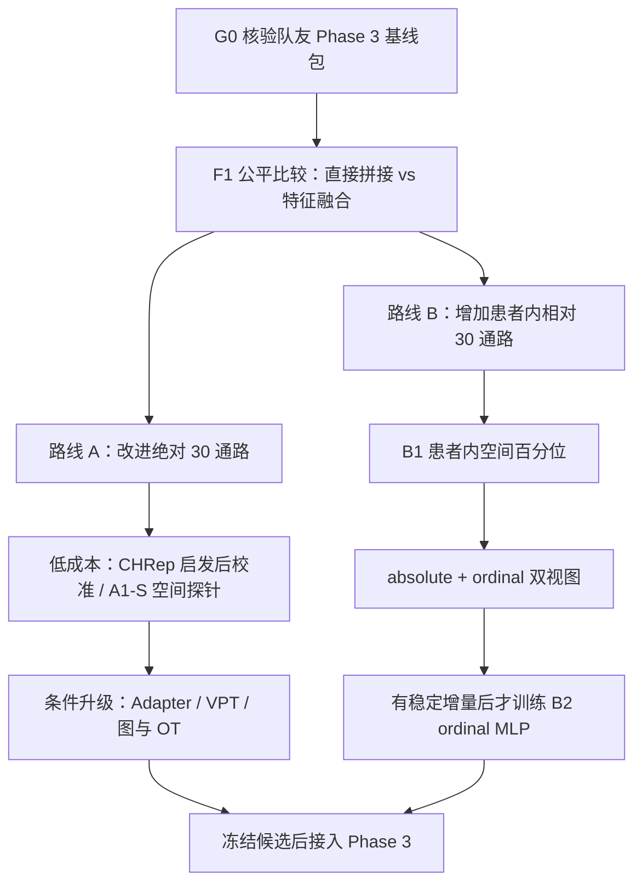

# PFMval MPP2 双线优化方案体系化学习指南

> 日期：2026-08-01  
> 文档角色：面向普通用户的逻辑说明与讨论入口。  
> 证据边界：本文整理“为什么做、先做什么、何时升级”，不是训练授权、正式实验合同或 accepted 性能证据。具体执行必须回到当前状态、实验注册表及后续用户批准。  
> 当前 Phase 3：食管鳞癌新辅助治疗后的 pCR/MPR 治疗响应预测；目前已运行终点仅确认为 `pCR / non_pCR`，MPR 标签合同仍待建立。队列约 78 例，准确数目待 patient manifest 核验。

## 文档关系与推荐阅读顺序

1. 先读本文，建立双线全貌和当前排序。
2. 再读[双线方案原文](../分析报告/MPP2双线并行改进与Phase3快速接入方案_原文_20260731.md)，查看各候选的原始设计。
3. 再读[执行实现扩展与冲突审查](../分析报告/MPP2双线并行改进与Phase3快速接入方案_执行实现扩展与冲突审查_20260731.md)，确认哪些步骤目前具备条件、哪些仍被阻塞。
4. 用[独立审查与网络对比调研报告](../分析报告/MPP2方案独立审查与网络对比调研报告_20260731.md)理解论文来源和方案 1—3。
5. 最后看[后续实验重新排序与 Phase 3 接入讨论稿](../分析报告/MPP2后续实验重新排序与Phase3接入讨论稿_20260801.md)，掌握 2026-08-01 调整后的优先级。

旧版[双线方案学习指南](./PFMval_MPP2_双线方案学习指南_20260731.md)保留为完整教学材料；本文重点解决“零散方案如何放回双线，以及现在到底先做什么”。

---

## 0. 一页读懂：现在到底在解决什么

项目已经决定，后续 Phase 3 研究采用两类联合输入：

```text
H&E 病理图像特征 + accepted 修复版冻结 MPP2 原始 30 通路输出
```

因此，当前不再重复讨论“要不要使用 MPP2”。真正的问题分为三层：

1. **Phase 3 接入层**：直接拼接和特征融合，哪一种在相同协议下更合适？
2. **Phase 2 绝对线**：怎样让 MPP2 的 30 个绝对通路数值更稳、更准？
3. **Phase 2 相对线**：如果跨患者绝对尺度不可靠，患者内部的空间高低关系能否提供额外信息？



当前真正的第一步是 **G0：拿到并核验队友的 Phase 3 基线包**。在这之前，后续方案只能讨论和设计，不能登记或执行新实验。

---

## 1. 两条主线的共同起点与共同终点

### 1.1 共同起点

两条线都从同一个 accepted 锚点出发：

- 实验：`mpp2_barcode_repair_v003_frozen_baseline_20260711`
- 输入：缓存的 UNI2-h 1536 维 CLS 特征
- 预测头：`1536 → 1024 → 30`
- 输出：30 条固定顺序的 MPP2 通路预测
- accepted XZY 结果：pooled PCC `0.6549`、raw MAE `1176.2114`、raw R² `-0.0880`

这些指标说明模型能捕捉总体变化趋势，但绝对数值的跨患者中心和尺度仍不够可靠。

### 1.2 共同工程门

无论走哪条线，都必须先保证：

- 患者、切片、patch 和坐标能一一对应；
- 30 条通路名称、顺序和输出尺度一致；
- Phase 3 的患者划分、随机种子、MIL 主干、训练预算和 checkpoint 规则固定；
- 所有标准化、gallery、近邻和可学习参数只在训练折产生；
- 不使用 XZY 或 Phase 3 测试折真值调参；
- 工程运行成功不等于科学有效。

### 1.3 共同终点

两条线最终都要形成逐 patch 的标准化特征文件，接入相同的 Phase 3 融合协议。Phase 2 指标变好只是中间证据；最终还要观察其是否在患者级交叉验证中稳定支持 pCR 治疗响应预测。

---

## 2. 路线 A：绝对通路分数改进线

### 2.1 这条线想解决什么

路线 A 保留现有 30 维输出的含义：数值仍表示模型预测的绝对或训练尺度通路分数。它主要解决：

- 外部患者的预测中心或尺度偏移；
- 局部空间预测不连续；
- 固定 UNI2-h 表征与 30 通路任务之间适配不足；
- 在不破坏 Phase 3 接口的前提下提高输入质量。

### 2.2 完整推进路径

```text
accepted 原始 MPP2 输出
  ↓
同架构 patient-level LOPO 新基线（A0；新协议，不是 accepted 数值复现）
  ↓
低成本探针
  ├─ S2-C：CHRep 启发的 training-gallery 后校准
  └─ S2-S / A1-S：同切片空间邻域轻量修正
  ↓ 仅通过者晋级
中等成本候选
  ├─ A1-P：患者平衡固定原型残差
  └─ A1-A：零初始化残差 Adapter
  ↓ 仅通过者晋级
表示与结构升级
  ├─ S3：单一预注册 VPT
  ├─ GraphSAGE / GAT 等空间图模型
  └─ S4：SPIRAL/GW 启发的图或流形对齐（最后考虑）
  ↓
冻结一个候选 → 生成 absolute 30 维 → 接入 Phase 3
```

### 2.3 各环节的通俗解释

#### A0：建立公平尺子

A0 的作用不是声称“复现 accepted 数值”，而是在新的患者级 LOPO 协议下建立所有候选都能共享的公平对照。原 accepted baseline 使用的是 manifest patch-level 验证；换成六折 patient-level LOPO 会改变划分和 checkpoint 选择，因此属于新实验协议。

#### S2-C：CHRep 启发的 training-gallery 后校准

它像是在训练患者中建立一本“参考图库”，新患者到来时依据与训练图库的相似关系做轻量修正。它针对跨切片、跨患者的中心和尺度偏移。

必须注意：这不是“读取整个测试集均值和方差后直接归一化”，也不是已失败的 `CalibratedMPP2`。gallery、近邻和修正参数必须全部来自训练折，且要先在 Phase 2 的患者级 LOPO 中验证。

#### S2-S / A1-S：空间邻域探针

它利用同一切片内相邻 patch 往往具有一定连续性的特点，对原预测做小幅邻域修正。它回答的是“坐标和局部连续性是否有用”，不是“跨患者尺度是否被校准”。

CHRep 后校准与 A1-S 是两个独立假设，不能合并成一个实验。A1-S 还需要恒等对照、坐标打乱对照和组织边界保护，防止把肿瘤—间质边界错误抹平。

#### A1-P：固定原型残差

从训练患者中选出一组真实代表性 patch，作为形态原型；新 patch 与原型比较后，对原 MPP2 预测做小幅修正。它同时追求预测改进和可解释性，但要防止原型只记住某个患者或染色风格。

#### A1-A：残差 Adapter

在缓存的 1536 维 CLS 特征之后增加很小的可训练模块，让表征更适合 30 通路回归。它比后处理成本高，必须与等参数普通 MLP 比较，证明收益不是单纯来自参数变多。

#### S3：Visual Prompt Tuning

VPT 把少量可学习 prompt token 插入视觉 Transformer 的 token 序列，同时冻结主干。它解决的是“如何用很少参数让 UNI2-h 更关注通路相关形态”。

VPT 不能加在已经缓存好的 1536 维 CLS 向量之后；必须重新在线运行 UNI2-h。原论文主要验证图像识别任务，而本项目是 30 通路回归且只有 6 名 Phase 2 训练患者，因此只能预注册一个极小配置，并与等参数 Adapter 比较，不能展开 prompt 长度、层数和深浅配置搜索。

#### S4：SPIRAL/Gromov–Wasserstein OT 启发对齐

SPIRAL 原方法用于多个空间转录组数据集之间的整合和坐标对齐，依赖表达、空间图、坐标和聚类结构。它可以启发本项目后期研究跨患者空间图或流形关系，但不是现成的“H&E 1536 维到 30 通路”适配器。

只有在节点、图、距离代价、聚类约束、coupling 和新患者外推方式全部定义后，且低成本路线已经显示稳定价值，才考虑这一方向。

---

## 3. 路线 B：患者内相对通路活性线

### 3.1 这条线想解决什么

路线 B 不强求跨患者恢复完全一致的绝对标尺，而是回答：

> 对同一患者、同一条通路，这个 patch 在该患者全部有效 patch 中处于低、中还是高活性区域？

它试图保留肿瘤内部的热点、冷点和空间异质性，降低测序深度、患者基线和尺度漂移的影响。

### 3.2 完整推进路径

```text
B0：确认 Phase 3 是逐 patch 融合，而不是只做患者均值
  ↓
B1：accepted raw MPP2 预测按“患者 × 通路”转换为 0—1 空间百分位
  ↓
B3：保留 absolute 30 维，同时增加 ordinal 30 维
  ↓
在 F1 冻结的融合结构中比较
H&E + absolute  vs  H&E + absolute + ordinal
  ↓ 只有稳定增量才晋级
B2：训练专门的 ordinal MLP
  ↓ 只有 B2 进一步通过才晋级
B4：ordinal + 空间图 / 连续关系对齐 / 原型解释
```

### 3.3 B0：为什么先审计接口

患者内百分位在一个患者内的均值通常接近 0.5。如果 Phase 3 先把所有 patch 简单求均值，相对信息会被抹掉。因此 B1 的前提是 Phase 3 能在 patch 层使用注意力、分布或空间结构，而不是只接收患者级均值。

### 3.4 B1：方案 1 的最低成本版本

B1 不重新训练 MPP2，只把 accepted 原始预测转换成患者内空间百分位：

```text
accepted raw MPP2 patch predictions
  → 每位患者内、每条通路分别排序
  → 输出 ordinal 30 维
  → 与 absolute 30 维并行保留
```

它能检验“患者内相对空间信息是否有下游价值”，但不能被描述成 Phase 2 模型本身变准。

### 3.5 UCell 与 B1 的准确关系

UCell 在单个 cell/spot 内对不同基因排序，再计算基因集签名得分；B1 则在同一患者内，对不同 patch 的同一预测通路排序。二者排序轴不同。

因此，UCell 只提供“rank 可以降低尺度敏感性”的理论启发，不能直接证明 B1 有效，也不能把 B1 称为 UCell 实现。真正的 UCell 风格目标需要从原始基因表达重新计算标签，会触及受保护标签资产，必须另开任务。

### 3.6 B2 与 B4：何时才值得训练复杂模型

只有 B1 在固定 Phase 3 开发协议中显示稳定增量，才值得把患者内百分位作为新监督目标训练 B2。B2 若不能超过零训练的 B1，就应停止升级。

GraphSAGE、GAT、连续关系对齐和原型解释属于 B4 级扩展；只有 B2 已经证明“专门学习相对目标”有价值时才进入。

---

## 4. 方案、论文与双线环节总对应表

| 方案或论文 | 所属主线 | 对应环节 | 核心解决的问题 | 调优方向 | 当前位置 |
|---|---|---|---|---|---|
| 直接拼接 vs 特征融合 | 双线共同的 Phase 3 桥梁 | G0 → F1 | 同样的 H&E+MPP2 输入怎样整合更有效 | 固定 fold、MIL、预算和输入，只改变融合方式 | **最先做；等待队友基线包** |
| 方案 1：B1 spatial percentile | 路线 B | B0 → B1 → B3 | 跨患者绝对尺度漂移、患者内空间热点利用不足 | 按患者和通路排名；absolute+ordinal 双视图 | **首个新 MPP2 候选** |
| UCell | 路线 B 的理论启发 | B1/B2 的 rank 思想 | 说明基于秩的评分可降低绝对尺度敏感性 | 只借鉴 rank 思想，不冒充 UCell 实现 | 文献依据，不是直接验证 |
| 方案 2：CHRep 启发后校准 | 路线 A | S2-C | 跨切片、跨患者中心和尺度偏移 | 训练折 gallery、近邻估计、受限残差修正 | B1 后的低成本候选 |
| A1-S 空间邻域修正 | 路线 A | S2-S / A1-S | 局部预测不连续、空间上下文缺失 | 轻平滑、恒等/坐标打乱/边界对照 | 与 CHRep 分开验证 |
| A1-P 固定原型残差 | 路线 A | A1-P | 形态原型与通路谱之间的稳定映射 | 患者平衡、真实 medoid、小残差 | 条件候选 |
| A1-A 残差 Adapter | 路线 A | A1-A | 缓存 CLS 与通路任务适配不足 | 零初始化、等参数对照、有限种子 | 条件候选 |
| 方案 3A：VPT | 路线 A | S3，表示适配升级 | 冻结大模型条件下提取更任务相关的图像特征 | 在线 UNI2-h、单一 prompt 配置、等参数 Adapter 对照 | 第四优先 |
| Visual Prompt Tuning 论文 | 路线 A 的方法依据 | S3 | 证明少量 prompt token 可适配冻结 ViT | 论文结论需在回归与 LOPO 场景重新验证 | 依据，不是项目证据 |
| 方案 3B：SPIRAL/GW OT | 路线 A 为主，路线 B 后期可借鉴 | S4 / A2-S / A2-A | 跨患者空间图或流形结构失配 | 定义节点、图、代价、聚类、coupling 和外推 | **最后且锁定** |
| SPIRAL 论文 | 空间结构对齐依据 | S4 | ST 数据集整合和坐标对齐 | 只能迁移思想，不能直接套用为 H&E—通路对齐 | 远期依据 |
| B2 ordinal MLP | 路线 B | B2 | B1 单调重编码无法提升底层排序能力 | 以患者内百分位为目标，先用简单 MSE | B1 有增量后解锁 |
| GraphSAGE/GAT/ConvSSM | A、B 各自的后期空间分支 | A2-S / B4-S | 更复杂的空间依赖 | 从一层 GraphSAGE 开始，逐级晋升 | 本轮不优先 |

---

## 5. 调整后的实际执行逻辑链

### 第 0 步：G0 核验 Phase 3 基线包

至少需要：准确患者清单和标签、4 seeds × 5 folds 的患者 ID、直接拼接与特征融合代码/配置、实际 MIL 主干、每折预测和指标、MPP2 checkpoint 身份，以及代码 commit 和运行环境。

没有这些材料，就无法判断两种融合方式是否真正同协议。

### 第 1 步：F1 公平比较直接拼接与特征融合

固定 H&E 与 accepted raw MPP2 联合输入，固定患者划分、随机种子、MIL 主干、临床变量、参数预算、训练时长和 checkpoint 规则，只改变融合方式。

现有团队探索均值为：仅病理 `0.5856`、直接拼接 `0.5269`、特征融合 `0.6299`。特征融合相对直接拼接约高 `0.1030`，足以支持继续核验，但这些结果不是 accepted 证据。

H&E-only 可以作为队友基线中的背景参照保留，但不再作为“是否采用 MPP2”的决策门。

### 第 2 步：S1/B1 增加患者内相对视图

在 F1 选定或冻结一种融合基线后，先比较：

```text
H&E + absolute
H&E + absolute + ordinal_posthoc
```

若没有跨重复划分的稳定增量，停止 B2 和 B4，不用复杂模型挽救一个没有下游价值的假设。

### 第 3 步：S2 分开验证两个绝对线低成本假设

- `S2-C`：CHRep 启发的 training-gallery 后校准；
- `S2-S`：A1-S 同切片空间邻域探针。

二者先在 Phase 2 patient-level LOPO 中检查绝对误差、逐通路相关和稳定性，再把冻结候选接入相同的 Phase 3 融合结构。

### 第 4 步：S3 单一 VPT 探针

只有在线 UNI2-h token 管线、W### 工作树、实验注册、运行预算和等参数 Adapter 对照全部准备好，才设计一个预注册 VPT 配置。已有 LoRA 阴性结果不能直接否定 VPT，但提醒我们必须严格限参和限次数。

### 第 5 步：S4 SPIRAL/GW 启发对齐

这是最晚的研究方向。只有空间图、聚类和 coupling 合同明确，且前面低成本方案已经证明稳定价值时，才值得承担其工程和过拟合风险。

### 条件分支

- B1 有价值 → B2 ordinal MLP；
- A1-S 有价值 → 一层 GraphSAGE，再考虑 GAT；
- Adapter 有价值 → 连续关系对齐；
- 固定原型有价值 → 再考虑更多或轻微可学习原型；
- 任一简单方案无稳定增量 → 停止对应复杂分支。

---

## 6. 如何避免把论文建议误当成项目结论

| 容易产生的误解 | 正确理解 |
|---|---|
| UCell 证明了 B1 一定有效 | UCell 只支持 rank 思想；B1 的排序轴和任务都不同 |
| CHRep 等于读取测试切片均值/方差 | CHRep 还依赖训练阶段表征和 training gallery；项目只能做“CHRep 启发”探针 |
| VPT 可以接在缓存 CLS 后 | 不可以；prompt 必须进入 UNI2-h token 序列并在线前向 |
| VPT 少参数就不会过拟合 | 少参数只降低风险，6 名患者仍需 patient-level LOPO 和严格预算 |
| SPIRAL 可以直接把 H&E 对齐到 30 通路 | 原方法是 ST-to-ST 整合与坐标对齐；项目迁移需要重新定义全部结构合同 |
| 特征融合 AUC 0.6299 已证明优于拼接 | 目前只是团队探索均值，尚缺可复核代码、fold 和 OOF 预测包 |
| CalibratedMPP2 可作为绝对线候选 | 不可；Ridge r003 已 rejected，不进入 Phase 3、部署或同合同重试 |

---

## 7. 本轮明确不做什么

- 不重新判断是否采用 MPP2；H&E+accepted raw MPP2 已是后续研究输入方向。
- 不让 `CalibratedMPP2` 进入 Phase 3 或部署。
- 不重试同合同 Ridge、Huber、LoRA rank/dropout/学习率/epoch 搜索。
- 不使用 XZY 或 Phase 3 测试折真值选择校准器、checkpoint 或通路。
- 病例或切片剔除不作为本轮主线立即执行，但保留为低优先级的数据质量审查候选；是否实施由后续组会讨论确认。
- 不在同一约 78 例队列上连续筛选所有方案，再把最高 AUC 当作最终验证。
- 不把论文中的相邻方法直接写成项目已验证创新。

关于疑似问题数据，当前可以先记录异常现象和质量证据，但在组会结论及用户后续明确通知前，不改变现有队列、fold 或主性能口径。若未来批准剔除，必须依据预先定义、可审计的客观质量标准，而不能仅因为某病例或某个 fold 的 AUC 较低；同时应保留原始全队列结果、完整排除清单和调整后结果，明确主分析与敏感性分析的关系，不得替换或隐去低 AUC fold。

---

## 8. 最简单的记忆方式

可以把整套方案记成一句话：

> **先把 Phase 3 的融合比较做公平，再用 B1 检验相对空间信息；随后分开检验绝对线的校准与空间假设；只有简单方案稳定有效，才升级到 VPT、图模型和 SPIRAL/OT。**

两条线的分工是：

- **路线 A 保数值**：尽量让 30 通路绝对输出更可靠。
- **路线 B 保关系**：即使绝对标尺漂移，也尽量保住患者内部的空间高低结构。

它们不是互相淘汰的竞争关系。最理想的结果是保留 `absolute + ordinal` 两种视图，再由已公平验证的融合结构把它们与 H&E 共同使用。

---

## 9. 关键资料

### 项目内资料

- [双线方案原文](../分析报告/MPP2双线并行改进与Phase3快速接入方案_原文_20260731.md)
- [执行实现扩展与冲突审查](../分析报告/MPP2双线并行改进与Phase3快速接入方案_执行实现扩展与冲突审查_20260731.md)
- [独立审查与网络对比调研报告](../分析报告/MPP2方案独立审查与网络对比调研报告_20260731.md)
- [后续实验重新排序与 Phase 3 接入讨论稿](../分析报告/MPP2后续实验重新排序与Phase3接入讨论稿_20260801.md)
- [当前项目状态](../../CURRENT_STATE.md)
- [实验注册表](../../experiments/experiment_registry.json)

### 论文原始来源

- [UCell：Robust and scalable single-cell gene signature scoring](https://pmc.ncbi.nlm.nih.gov/articles/PMC8271111/)
- [Visual Prompt Tuning](https://arxiv.org/abs/2203.12119)
- [SPIRAL：Integrating spatial transcriptomics data with optimal transport](https://link.springer.com/article/10.1186/s13059-023-03078-6)
- [CHRep 预印本](https://arxiv.org/abs/2604.21573)
