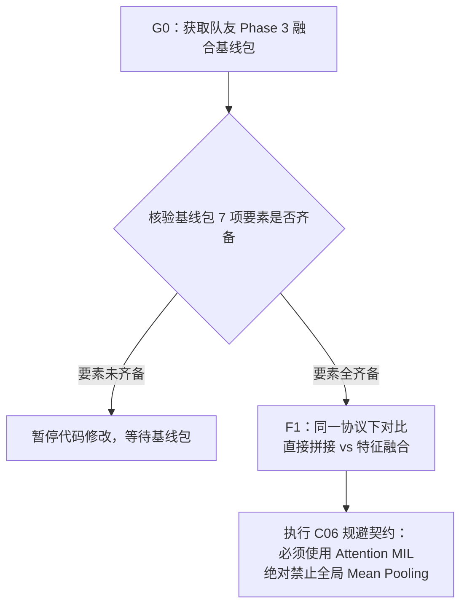
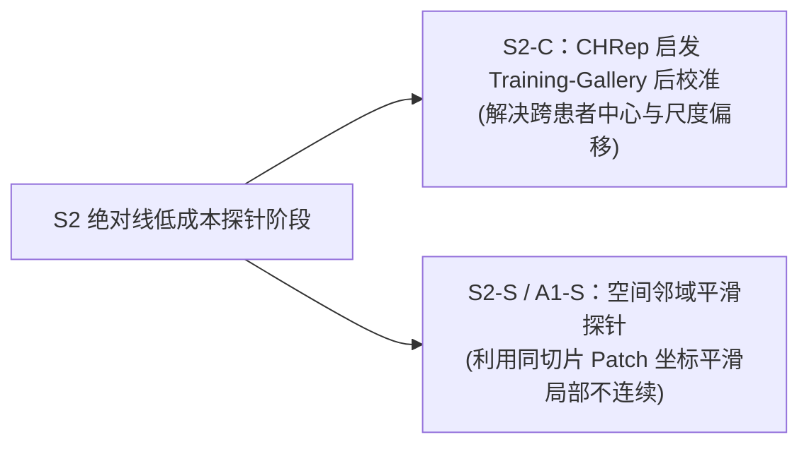

# PFMval MPP2 双线优化方案深度学习指南

> **日期**：2026-08-01  
> **文档角色**：面向科研入门者、团队成员与 Agent 的专有名词拆解、论文原文精读、技术思路迁移与代码级落地指南。  
> **最高裁决依据**：本文完全遵循 [MPP2后续实验重新排序与Phase3接入讨论稿_20260801.md](../分析报告/MPP2后续实验重新排序与Phase3接入讨论稿_20260801.md) 定义的实验顺序、门控方案与裁决标准。当与其他本地探索文档存在矛盾时，一律以该讨论稿表述为准。  
> **证据边界**：本文为技术原理学习与迁移指南，不是训练授权、正式实验合同或 accepted 性能证据。具体执行必须回到当前状态、实验注册表及后续用户批准。  
> **当前 Phase 3**：食管鳞癌新辅助治疗后的 pCR/MPR 治疗响应预测；已运行终点仅确认为 `pCR / non_pCR`。队列约 78 例，准确数目待 patient manifest 核验。

---

## 0. 科研入门者必读：全景方案编号词典与拓展说明

### 0.1 全景路径编号中文名称与含义备注表

为了方便科研入门者快速理清项目中的各类缩写与编号，下表详细列出了方案中出现的**所有路线编号、对应具体方案全称及其核心功能备注**：

| 路径编号 | 方案中文全称 | 核心含义与功能备注 |
|:---:|---|---|
| **G0** | **Phase 3 融合基线实验包核验阶段** | **前置硬门槛**：向队友获取并核验 Phase 3 准确患者清单、4 seeds × 5 folds 划分、直接拼接与特征融合代码及 OOF 预测包。 |
| **F1** | **直接拼接 vs 特征融合公平对比阶段** | **第 1 优先实验**：在固定同一 H&E + accepted raw MPP2 联合输入下，公平比较 `直接拼接` 与 `特征融合` 两种接入方式的 AUC。 |
| **S1** | **B1 患者内空间相对百分位接入阶段** | **第 2 优先（首个新 MPP2 候选）**：不重训 Phase 2，将 raw MPP2 按患者×通路转为 0~1 百分位，保留 `absolute + ordinal` 双视图接入 F1 选定的融合结构。 |
| **S2** | **路线 A 绝对线低成本探针阶段** | **第 3 优先**：包含 S2-C（CHRep 启发图库后校准）与 S2-S/A1-S（同切片空间邻域平滑）两个独立探针，先在 Phase 2 LOPO 中验证。 |
| **S2-C** | **CHRep 启发的 Training-Gallery 后校准** | 路线 A 探针之一：利用训练折图库 (Gallery) 动态进行 Test-Time 无监督仿射拉伸，矫正外部患者中心与尺度偏移。 |
| **S2-S / A1-S** | **同切片空间邻域平滑探针** | 路线 A 探针之二：利用同切片内相邻 Patch 的坐标连续性进行轻量平滑修饰，解决局部预测不连续。 |
| **S3** | **单一预注册 VPT 视觉提示调优探针** | **第 4 优先**：在线前向嵌入 Prompt Token 调优 UNI2-h，仅预注册极小配置，且需通过与等参数 Adapter 的对照硬门槛。 |
| **S4** | **SPIRAL / GW 最优传输空间结构对齐** | **第 5 优先（当前严格锁定）**：利用 Gromov-Wasserstein 距离无监督对齐图拓扑，属远期方法依据，需简单方案见效后解锁。 |
| **S5** | **条件升级扩展阶段** | **条件候选**：若 B1 或 A1-S 在 Phase 3 有稳定增量，解锁 B2（ordinal 端到端 MLP）、GraphSAGE、GAT 或 ConvSSM 等高级扩展。 |
| **A0** | **同架构 Patient-level LOPO 新基线** | 路线 A 起点：在 6 折留一患者 (LOPO) 划分下重新建立相较于原 manifest patch-level 验证的公平比较尺子。 |
| **A1-P** | **患者平衡固定原型残差修饰器** | 路线 A 候选：在训练患者中选出代表性形态 Medoid 作为原型，比较特征距离做小幅残差修正。 |
| **A1-A** | **零初始化残差 Adapter 适配器** | 路线 A 候选：在缓存的 1536 维特征后增加可训练小型残差模块，适配 30 通路任务。 |
| **B0** | **Phase 3 MIL 接入聚合器审计** | 路线 B 起点：审查 Phase 3 聚合器代码，确保使用 Attention MIL 逐 Patch 接入，彻底规避 Mean Pooling 抹平风险。 |
| **B1** | **患者内空间相对百分位 post-hoc 转换** | 路线 B 起点（`within-patient spatial percentile`）：按患者和通路单调重编码为 0~1 排名，免疫整体尺度漂移。 |
| **B2** | **患者内空间百分位端到端 Ordinal MLP** | 路线 B 升级：直接以患者内空间百分位为监督目标训练专门的 MLP 预测头（仅在 B1 有增量后解锁）。 |
| **B3** | **absolute + ordinal 双视图联合特征** | 路线 B 模式：同时保留 30 维绝对活性与 30 维相对百分位活性，使下游 MIL 兼顾全局水平与空间热点。 |
| **B4** | **相对活性高级空间扩展** | 路线 B 远期：在 B2 成功前提下，叠加 GraphSAGE 空间图或连续关系对齐。 |

---

### 0.2 对概述版指南的拓展补充

本文是对概述版学习指南 [PFMval_MPP2_双线优化方案体系化学习指南_20260801.md](./PFMval_MPP2_双线优化方案体系化学习指南_20260801.md) 的**面向科研入门者的深度解剖版本**：
- **概述版侧重**：解决“零散方案如何放回双线，以及高层执行顺序是什么”的问题；
- **本深度指南侧重**：面向科研入门者，拆解专有名词、原论文数学与网络逻辑、论文迁移假设差异，并给出落盘到我方 `Spot × 30` Schema 和 UNI2-h 1536维特征的代码级落地细则。

---

### 0.3 本地文件 8 大矛盾冲突裁决表（统一按 20260801 讨论稿标准执行）

所有本地参考文件间的矛盾冲突均统一按讨论稿口径闭环：

| 冲突序号 | 矛盾冲突主题 | 裁决后统一标准 (基于 20260801 讨论稿) | 指南执行细则 |
|:---:|---|---|---|
| **1** | **P1 消融验证门 (是否使用 MPP2)** | **彻底删除旧 P1**；确定采用 H&E 与 accepted 修复版冻结 MPP2 原始输出联合输入 | 不再设置“是否采用 MPP2”的 P1，核心转向比较 `直接拼接` 与 `特征融合` |
| **2** | **实验推进阶梯顺序** | **硬性阶梯**：`G0 (基线包)` $\rightarrow$ `F1 (融合比较)` $\rightarrow$ `S1 (B1相对百分位)` $\rightarrow$ `S2` $\rightarrow$ `S3` $\rightarrow$ `S4` | 必须先等待 G0 队友基线包并完成 F1 融合对比后，方可启动 S1 候选 |
| **3** | **UCell 与 Track B 关系** | UCell 排序轴在 spot 内基因间；B1 排序轴在患者内 patch 间。UCell 仅为理论启发 | 明确 B1 命名为 `within-patient spatial percentile`，不混淆为 UCell 实现 |
| **4** | **CHRep 方案 2 实现定义** | CHRep 校准参数只能来自**训练折与 training gallery** | 改名“CHRep 启发的 training-gallery 后校准”，严格隔离测试集中数据 |
| **5** | **VPT 与已缓存特征兼容性** | VPT **不能**挂在缓存向量后，Prompt 必须进入 UNI2-h 视觉 Token 序列 | 需重新构建在线前向管线，只能做极小配置预注册且需通过与等参数 Adapter 对照 |
| **6** | **SPIRAL / OT 最优传输适用边界** | SPIRAL 是 ST-to-ST 整合；迁移至本项目缺乏节点/代价/coupling 契约 | 明确将 SPIRAL 列为远期结构对齐理论依据，本轮**严格锁定 (S4)** |
| **7** | **CalibratedMPP2 归宿** | Ridge r003 XZY 验证失败且 `evidence_status=rejected` | **彻底排除** CalibratedMPP2，严禁进入 Phase 3、部署或同合同重试 |
| **8** | **数据与病例剔除规则** | 严禁因 AUC 低而擅自剔除病例或替换 low-AUC fold | 主分析保留全队列，剔除仅作为低优先级敏感性分析候选 |

---

## 1. 关联文献与项目文件链接索引

### 1.1 项目权威与参考文档
- 最高裁决标准文件：[MPP2后续实验重新排序与Phase3接入讨论稿_20260801.md](../分析报告/MPP2后续实验重新排序与Phase3接入讨论稿_20260801.md)
- 概述版学习指南：[PFMval_MPP2_双线优化方案体系化学习指南_20260801.md](./PFMval_MPP2_双线优化方案体系化学习指南_20260801.md)
- 独立审查与文献对比报告：[MPP2方案独立审查与网络对比调研报告_20260731.md](../分析报告/MPP2方案独立审查与网络对比调研报告_20260731.md)
- 执行扩展与冲突审查：[MPP2双线并行改进与Phase3快速接入方案_执行实现扩展与冲突审查_20260731.md](../分析报告/MPP2双线并行改进与Phase3快速接入方案_执行实现扩展与冲突审查_20260731.md)
- 当前项目状态：[CURRENT_STATE.md](../../CURRENT_STATE.md)

### 1.2 参考学术论文原文链接
1. **UCell**: [UCell: Robust and scalable single-cell gene signature scoring (CSBJ 2021)](https://pmc.ncbi.nlm.nih.gov/articles/PMC8271111/) | [PubMed](https://pubmed.ncbi.nlm.nih.gov/34285779/)
2. **CHRep**: [CHRep: Cross-modal Histology Representation and Post-hoc Calibration for Spatial Gene Expression Prediction (arXiv 2026)](https://arxiv.org/abs/2604.21573)
3. **Visual Prompt Tuning (VPT)**: [Visual Prompt Tuning (ECCV 2022 / arXiv 2022)](https://arxiv.org/abs/2203.12119)
4. **SPIRAL**: [SPIRAL: Integrating spatial transcriptomics data with optimal transport (Genome Biology 2023)](https://link.springer.com/article/10.1186/s13059-023-03078-6)
5. **SpaMIL**: [SpaMIL: Multiple instance learning with spatial transcriptomics for interpretable patient-level predictions (bioRxiv 2025)](https://doi.org/10.1101/2025.10.13.682206)
6. **CarHE**: [CarHE: Predicting Spatial Transcriptomics from H&E Image by Pretrained Contrastive Alignment Learning (bioRxiv 2025)](https://doi.org/10.1101/2025.06.15.659438)
7. **MCToGene**: [MCToGene: Many-Cell Interaction to Gene Expression Prediction from Histology (CVPR 2025)](https://openaccess.thecvf.com/)

---

## 2. 模块一：科研入门者必读——前置概念与专有名词全量词典

为了帮助初学者彻底消除阅读障碍，本模块对计算病理学、人工智能与空间转录组学交叉领域的专有名词进行通俗类比与严密数学解释：

### 2.1 生物学与空间组学测量词典
- **ssGSEA (Single-sample Gene Set Enrichment Analysis, 单样本基因集富集分析)**  
  *通俗类比*：假设一个细胞里有 20,000 个基因在工作，我们很难逐个去分析。ssGSEA 就像把这些基因按功能“分组”（比如把涉及“DNA 修复”的 50 个基因归为一组）。通过计算这 50 个基因在该样本里的整体活跃程度，直接给出一个“DNA 修复通路得分”。本项目 Phase 2 模型预测的目标就是 30 条固定的 ssGSEA 通路得分。
- **Drop-out 效应与测序深度 (Sequencing Depth)**  
  *通俗类比*：测序就像用网抓鱼。如果测序深度低（网眼大），很多表达量较低的基因就会漏掉，导致测出来是 0（ Drop-out 现象）。不同切片或患者因为仪器批次、样本保存质量不同，测序深度相差极大。这就导致：**哪怕两个患者同一个通路的真实活性完全相同，测出来的绝对数值也可能差了好几倍**。这是导致模型产生负 $R^2$ 标度偏移的根源。
- **Z-score (标准化得分 / 零均值标准化)**  
  *数学定义*：$z = \frac{x - \mu}{\sigma}$。把原始得分减去均值 $\mu$，再除以标准差 $\sigma$，使得标准化后的分布均值为 0，标准差为 1。  
  *注意规避*：必须严格在训练集上计算 $\mu, \sigma$，再套用到测试集；绝对不能用测试集自身或全队列来拟合 Z-score 参数，否则构成数据泄漏！

---

### 2.2 统计学、回归指标与损失函数词典
- **Mann-Whitney U 统计量与 Rank-based Scoring (基于排名的评分)**  
  *通俗类比*：考试成绩出来后，如果不看具体考了 95 分还是 60 分，只看全班“第 1 名”还是“第 50 名”。无论这次试卷难度如何（整体偏难或偏易），“第 1 名”的相对位置永远不变。利用排名 (Rank) 计算得分能在数学上完全免疫整体的数值拉伸与平移。
- **Scale and Center Shift (中心与尺度偏移)**  
  *现象解释*：
  - *Center Shift (中心偏移)*：模型的预测值整体比真实值偏高了 100 分（截距 $b$ 不对）；
  - *Scale Shift (尺度偏移)*：真实值从 0 到 1000 变动，模型预测值却只在 400 到 500 之间微小变动（斜率 $w$ 太小/变平）。
- **回归评估四大指标 (PCC, MAE, MSE, $R^2$) 物理意义**：
  - **PCC (Pearson Correlation Coefficient, 皮尔逊相关系数)**：衡量预测值与真实值之间的**线性趋势一致性**（范围 -1 到 +1）。PCC 高说明模型能分清高低顺序，但不管数值绝对大小对不对（比如真实值是 [1,2,3]，预测值是 [100,200,300]，PCC 是 1.0）。
  - **MAE (Mean Absolute Error, 平均绝对误差)**：衡量预测值与真实值之间的**平均绝对距离**（数值越小越好）。
  - **$R^2$ (Coefficient of Determination, 决定系数)**：衡量模型比“直接猜均值”好多少（最好为 1.0）。如果 $R^2$ 为负数（如 $-0.088$），说明预测值的中心/尺度偏得太离谱，直接猜均值的误差都比模型小！

---

### 2.3 计算病理与深度学习模型范式词典
- **WSI (Whole Slide Image, 全切片图像) & Patch / Spot**  
  *几何关系*：玻璃切片在显微扫描仪下生成的高清数字图像叫 WSI（体量极大，如 $40000 \times 40000$ 像素）。算法无法直接一次性输入整张 WSI，因此将其切成成千上万个小方格，每个小方格叫 Patch 或 Spot（如 $256 \times 256$ 像素）。
- **MIL (Multiple Instance Learning, 多实例学习)**  
  *通俗类比*：老师批改作业，只知道某个小组（包, Bag, 即整张 WSI）总分是及格还是不及格（pCR/non-pCR 标签），但不知道组里哪个同学（实例, Instance, 即 Patch）贡献最大。MIL 借助**注意力机制 (Attention)**，让模型自动学习给每个 Patch 打分，找出真正决定临床结局的“肿瘤关键区域”。
- **Post-hoc Calibration (测试期无监督后校准)**  
  *对比静态 Ridge 校准*：静态 Ridge 校准是在训练集上解方程算出固定的斜率和截距，遇到新测试集就生搬硬套（结果在 XZY 上失败）；而 Post-hoc 校准是在推理期读取测试切片自身的变异特征，动态无监督地缩放预测值，拉回中心与尺度。
- **Visual Prompt Tuning (VPT, 视觉提示调优)**  
  *通俗类比*：大语言模型（如 ChatGPT）不需要为你重训千亿参数，你只需要在输入最前面加上一句“*请扮演消化道病理专家：...*”（Prompt 提示词）。VPT 把这个思想搬到了图像大模型上，在输入 Patch 向量最前面拼接几个可学习的虚拟 Prompt Token，冻结大模型 1.5 亿参数，只训练不到 1% 的 Prompt 参数。
- **Gromov-Wasserstein OT (Gromov-Wasserstein 最优传输)**  
  *通俗类比*：假设 A 空间是 Patch 的图像形态分布，B 空间是 30 通路的基因表达分布。两个空间维度不同，也没有点对点坐标对应。GW 距离通过比较各自内部点与点之间的“相对拓扑矩阵”，无监督地把 A 空间弹性拉伸对齐到 B 空间。

---

## 3. 模块二：G0 & F1 接入协议——直接拼接 vs 特征融合公平对比契约

为了彻底规避 VS Code 等 Markdown 渲染器的语法兼容问题，本模块流程图采用标准兼容格式：



### 3.1 G0 (Phase 3 融合基线实验包核验) 硬性前置门槛

在启动任何新实验前，必须先取得并核验队友的 Phase 3 基线包，包含以下 7 项硬性事实：
1. 准确患者清单及 pCR/non-pCR 标签；
2. 4 seeds × 5 folds 每折患者 ID 与随机种子；
3. 直接拼接与特征融合的代码与配置；
4. 实际使用的 MIL 主干 (CLAM / DTFD-MIL / TransMIL)；
5. 每折 ROC-AUC 及未删改的全部结果；
6. 输入 MPP2 的 experiment ID 及 checkpoint 身份；
7. 运行环境与训练预算。

### 3.2 F1 (直接拼接 vs 特征融合公平对比) 原则

用户已决定采用 H&E 与 accepted raw MPP2 联合输入。F1 的任务是在相同患者划分、随机种子、MIL 主干和预算下，比较直接拼接与特征融合。探索均值差值 `+0.1030`（特征融合 `0.6299` vs 拼接 `0.5269`）需经正式验证。

### 3.3 C06 致命风险规避代码契约

为了防止 Phase 3 MIL 聚合器把 Track B 百分位特征（患者内均值恒为 0.5）抹平，代码必须强制采用 **Attention-based MIL**：

```python
import torch
import torch.nn as nn

class Phase3FusionMIL(nn.Module):
    """
    Phase 3 特征融合 MIL 聚合器代码契约
    严格规避全局 Mean Pooling，保障 Track B 相对百分位与 H&E 联合有效
    """
    def __init__(self, he_dim=1536, mpp_dim=30, hidden_dim=256):
        super().__init__()
        # 1. 投影层：将 H&E 特征与 30 维 MPP2 特征做联合表达
        self.he_proj = nn.Linear(he_dim, hidden_dim)
        self.mpp_proj = nn.Linear(mpp_dim, hidden_dim)
        
        # 2. 门控注意力机制 (Gated Attention)
        self.attention_V = nn.Linear(hidden_dim * 2, 128)
        self.attention_U = nn.Linear(hidden_dim * 2, 128)
        self.attention_w = nn.Linear(128, 1)
        
        # 3. 患者级 pCR 分类器
        self.classifier = nn.Linear(hidden_dim * 2, 2)

    def forward(self, x_he, x_mpp):
        # x_he: [B, N, 1536], x_mpp: [B, N, 30]
        h_he = torch.tanh(self.he_proj(x_he))
        h_mpp = torch.tanh(self.mpp_proj(x_mpp))
        h_combined = torch.cat([h_he, h_mpp], dim=-1) # [B, N, 512]
        
        # 计算逐 Patch 注意力权重 (Attention Weights)
        A_V = torch.tanh(self.attention_V(h_combined))
        A_U = torch.sigmoid(self.attention_U(h_combined))
        A = self.attention_w(A_V * A_U).squeeze(-1) # [B, N]
        A = torch.softmax(A, dim=-1).unsqueeze(-1)  # [B, N, 1]
        
        # 逐 Patch 注意力加权求和（绝对禁止 torch.mean(h_combined, dim=1)）
        patient_representation = torch.sum(A * h_combined, dim=1) # [B, 512]
        logits = self.classifier(patient_representation)
        return logits
```

---

## 4. 模块三：S1 阶段（路线 B）——UCell 秩评分精读与 B1 患者内空间相对百分位迁移

### 4.1 【论文精读 1】UCell: Robust and scalable single-cell gene signature scoring (CSBJ 2021)

#### 📖 1. 论文背景与要解决的核心痛点
在单细胞与空间转录组分析中，研究者常常想评估某个特定基因集（比如“T细胞杀伤功能基因集”）在单个细胞里的活性。传统做法是把这几十个基因的表达量加起来求平均或做 Z-score。但因为**测序深度不同和 Drop-out 噪声**，直接求和的得分在不同批次之间波动剧烈，极不稳定。

#### 💡 2. 原论文核心方法机制与数学公式解读
UCell 放弃看基因表达量的绝对大小，转而使用 **Mann-Whitney U 统计量（秩和检验）**。
算法步骤：
1. 在单个细胞 $j$ 内部，把该细胞测出的所有基因按表达量从高到低排序，得到每个基因的排名 $r_{g,j}$（最高表达的排第 1）；
2. 设置一个最大截断排名 $r_{\text{max}}$（如 1500 名），超过 1500 名的基因排名均视为 $r_{\text{max}} + 1$；
3. 对目标基因集 $S$（包含 $U$ 个基因）计算 U 统计量得分：
$$U_{S,j} = \sum_{g \in S} (r_{\text{max}} - r_{g,j}) + \frac{U(U + 1)}{2}$$
4. 归一化后得到 0 到 1 之间的签名得分。得分越高，说明该基因集里的基因在这个细胞里的排名越靠前。

#### 📚 3. 专有名词与前置知识拓展
- **U Statistic (U 统计量)**：用于比较两组独立样本大小关系的非参数统计量。其最大优点是不依赖数据的分布形式（不需要正态分布），也不受极值影响。
- **Gene Signature / Marker Set (基因签名/标记物集合)**：代表某种特定细胞类型或特定生物学过程的一组特征基因集合。

#### 🔍 4. 论文验证结论与局限性
在多个单细胞数据集上，UCell 评分对测序深度缩减（Down-sampling）展现出惊人的鲁主鲁棒性，且计算复杂度为 $O(N \log N)$，极为高效。其局限在于：它依赖单细胞内有上千个基因可供排序。

---

### 4.2 排序轴对比：UCell 排序轴 vs B1 (within-patient spatial percentile) 排序轴

必须向初学者强调 UCell 与本项目 B1 的根本区别：

```text
UCell 排序轴  ：[Spot j] ──> 对 10,000 个不同基因表达量排序 ──> 输出 Spot 分数 (空间轴不变)
本项目 B1 排序轴：[患者 p] ──> 对 N 个不同 Patch 的同一通路 k 排序 ──> 输出 0~1 空间 Percentile (基因轴不变)
```

UCell 证明了“利用 Rank 可以消除批次标度漂移”，但不能把 B1 直接称为 UCell 实现。指南中统一将其命名为 **`within-patient spatial percentile`**。

---

### 4.3 B1 迁移落地实现 Python 代码与接入细则

S1 阶段的 B1 post-hoc 转换完全不需要重训 Phase 2 模型，只需读取 accepted 原始预测，按患者和通路计算空间百分位：

```python
import numpy as np

def compute_within_patient_spatial_percentile(raw_pred_matrix):
    """
    B1 核心转换函数
    :param raw_pred_matrix: np.ndarray, 形状为 [N_patches, 30]，包含单个患者全切片的原始预测
    :return: np.ndarray, 形状为 [N_patches, 30]，取值范围 [0, 1] 的空间相对百分位
    """
    n_patches, n_pathways = raw_pred_matrix.shape
    percentile_matrix = np.zeros_like(raw_pred_matrix, dtype=np.float32)
    
    for k in range(n_pathways):
        pathway_scores = raw_pred_matrix[:, k]
        # 计算每个 Patch 该通路的 Rank (从 1 到 N)
        ranks = pathway_scores.argsort().argsort() + 1.0
        # 归一化为 0 ~ 1 的百分位
        percentile_matrix[:, k] = ranks / float(n_patches)
        
    return percentile_matrix
```

#### S1 接入双线细则：
1. **接入模式**：保存 `Spot × 30` 的 `absolute` 维与 `ordinal` 维；
2. **Phase 3 对比矩阵**：
   - 基线组：`H&E (1536维) + absolute (30维)`
   - 候选组：`H&E (1536维) + absolute (30维) + ordinal (30维)`
3. **止损规则**：若在 Phase 3 Patient-Level LOPO 中没有稳定 AUC 增量，终止 B2 端到端 Ordinal MLP 训练。

---

## 5. 模块四：S2 阶段（路线 A）——CHRep 试期后校准精读与 S2-C / A1-S 探针迁移

### 5.1 【论文精读 2】CHRep: Cross-modal Histology Representation and Post-hoc Calibration for Spatial Gene Expression Prediction (arXiv 2026)

#### 📖 1. 论文背景与要解决的核心痛点
用 H&E 图像预测空间基因表达时，模型经常遇到严重的**切片级外观偏移 (Slide-level Appearance Shift)**。不同医院制备的切片，染色深浅、扫描仪亮度不同，导致模型对新切片的预测值整体偏高或偏低（中心偏移），或者预测波动范围严重收缩（回归平滑）。

#### 💡 2. 原论文核心方法机制与数学公式解读
CHRep 提出了两阶段解决方案：
1. **训练阶段（表征学习）**：建立包含图像形态与表达特征的“参考图库 (Training Gallery)”；
2. **推断阶段（无监督后校准）**：对于一张新的测试切片，模型输出原始预测值 $\hat{y}$。校准模块在**不使用测试切片真实基因标签**的前提下，计算测试切片与训练图库特征的近邻相似度，并测量测试切片自身的均值 $\mu_{\text{test}}$ 与标准差 $\sigma_{\text{test}}$。然后通过无监督仿射变换公式纠正预测值：
$$\hat{y}_{\text{cal}} = \sigma_{\text{gal}} \cdot \frac{\hat{y} - \mu_{\text{test}}}{\sigma_{\text{test}}} + \mu_{\text{gal}}$$
其中 $\mu_{\text{gal}}, \sigma_{\text{gal}}$ 是由 Training Gallery 中近邻样本决定的目标均值和方差。

#### 📚 3. 专有名词与前置知识拓展
- **Appearance Shift (外观/域偏移)**：图像领域常见问题。如同一个人在阳光下和阴天照相，像素数值不同，但人脸结构不变。
- **Training Gallery (训练图库)**：在训练阶段离线保存的“标准参考特征库”。推理时新样本可以通过搜索图库找到最相似的“参照物”。

#### 🔍 4. 对比分析：为什么静态 Ridge 校准死穴失效，而 CHRep 动态后校准可行？
- **已失败 Ridge (`mpp2_pathway_ridge_calibration_v001_20260717`) 的死穴**：属于静态有监督校准。在训练集拟合固定截距 $b$，遇到外部患者 XZY 时，由于域偏移不同，固定截距 $b$ 外推彻底失效；
- **CHRep 启发后校准 (S2-C)**：属于动态无监督后校准。参数由训练折 Gallery 近邻与测试集自身的变异度共同决定，严禁读取测试集中真实的 ssGSEA 标签。

---

### 5.2 S2-C 与 A1-S 拆解与迁移细则

S2 包含两个独立的低成本探针，不得合并为一个实验：



#### S2-C 实施代码硬契约：
1. **Gallery 构造**：Gallery 向量与统计量只能由 Phase 2 当前训练折产生；
2. **严禁泄漏**：严禁读取测试患者真实标签，严禁使用全队列全局统计量；
3. **名称禁忌**：不得复用 `CalibratedMPP2` 名称。

---

## 6. 模块五：S3 阶段（路线 A）——VPT 视觉提示调优精读与在线前向迁移约束

### 6.1 【论文精读 3】Visual Prompt Tuning (ECCV 2022 / arXiv:2203.12119)

#### 📖 1. 论文背景与要解决的核心痛点
在深度学习中，全量微调 (Full Fine-Tuning) 动辄数亿参数的大模型（如 Vision Transformer）极其昂贵。更致命的是，当下游任务数据量极小（如只有 6 名患者）时，微调大模型会导致严重过拟合，甚至破坏大模型原本强大的泛化特征（灾难性遗忘）。

#### 💡 2. 原论文核心方法机制与数学公式解读
VPT 借鉴了 NLP 中 Prompt 的思想：
1. 保持庞大的 Vision Transformer 权重 $\Theta$ **完全冻结 (Frozen)**；
2. 在输入图像 Patch Token 序列 $[e_1, e_2, \dots, e_N]$ 的最前端，拼接少量可学习的“虚拟提示向量 (Prompt Tokens)” $P = [p_1, p_2, \dots, p_K]$；
3. 对于 Transformer 的第 $l$ 层，输入变为 $[P_{l-1}, Z_{l-1}]$，经过 Self-Attention 交互：
$$[x_l, Z_l] = \text{Transformer}_l([P_{l-1}, Z_{l-1}])$$
4. 训练时仅微调 Prompt 参数 $P$ 和预测 Head $\phi$，可训练参数量不及总参数量的 1%。

```text
[图像 Patch 序列] ──> [Patch Embedding (1536维)] 
                             │
 [可学习 Prompt Tokens (5个)] ──┴──> [进入 UNI2-h ViT 多层 Self-Attention 交互] ──> [预测 Head]
```

#### 📚 3. 专有名词与前置知识拓展
- **Full Fine-Tuning vs LoRA vs VPT**：
  - *Full Fine-Tuning*：更新 100% 的权重，极易过拟合；
  - *LoRA*：在 Transformer 矩阵旁增加低秩分解矩阵更新；
  - *VPT*：保持矩阵不变，只在输入序列插 Token，更适合极其微小的样本。
- **Catastrophic Forgetting (灾难性遗忘)**：大模型在小数据集上微调时，原本在数亿通用图像学到的通用表达能力被破坏的现象。

---

### 6.2 误区澄清与运行约束

#### ❌ 常见实施误区
VPT **不能**挂在已经缓存好的 1536 维 UNI2-h CLS 特征向量之后！因为 Prompt Tokens 必须进入 Transformer 的每一层 Self-Attention 矩阵参与交互。

#### ⚠️ 6 患者极小样本下的硬约束
1. **重新搭建管线**：必须建立 `在线 UNI2-h + Prompt + MPP Head` 的运行管线；
2. **禁止超参 Sweep**：预先锁定单一极小配置（如 Prompt Length=5, Shallow）；
3. **等参数 Adapter 对照硬门槛**：必须与相同可训练参数量的普通 Adapter 对照，只有 VPT 显性超越 Adapter 才算有效。

---

## 7. 模块六：S4 阶段（远期锁定）——SPIRAL 最优传输精读与 GW 拓扑流形对齐边界

### 7.1 【论文精读 4】SPIRAL: Integrating spatial transcriptomics data with optimal transport (Genome Biology 2023)

#### 📖 1. 论文背景与要解决的核心痛点
不同实验室、不同平台测得的空间转录组 (ST) 数据存在极强的批次效应。不同切片上的 Spot 坐标无法点对点对齐，基因表达量也无法直接相减。如何将不同切片的空间拓扑与基因表达做弹性点云对齐？

#### 💡 2. 原论文核心方法机制与数学公式解读
SPIRAL 引入了 **Gromov-Wasserstein 最优传输 (GW Optimal Transport)**：
1. *SPIRAL-integration*：使用 GraphSAGE 图神经网络提取包含空间几何的表达特征；
2. *SPIRAL-alignment*：计算空间 A 内点与点的距离矩阵 $C_1$，以及空间 B 内点与点的距离矩阵 $C_2$。GW 最优传输通过求解传输矩阵 $T$，使得两个空间内部的“相对距离差异”最小：
$$\min_{T} L_{GW}(C_1, C_2, T) = \sum_{i,j,i',j'} |C_1(i,i') - C_2(j,j')|^2 T_{i,j} T_{i',j'}$$
这样即便两个空间维度不同、坐标无法直接点对点映射，也能无监督地对齐它们的几何流形。

#### 📚 3. 专有名词与前置知识拓展
- **Optimal Transport (最优传输)**：数学中求解将一个概率分布（或点云）以最小搬运成本变身为另一个分布的方法。
- **Gromov-Wasserstein Distance (GW 距离)**：最优传输的高级变体，专门解决**两个点云处于完全不同空间、没有点对点坐标**时的无监督结构对齐。

---

### 7.2 从论文到 PFMval 的迁移差距与锁定声明

#### 🔍 迁移缺失的 5 大契约
将 SPIRAL 迁移至 H&E 到 30 通路面临重大缺口：
1. 图像 Patch 与 30 通路节点缺乏一对一映射；
2. 跨模态距离代价 $C_1, C_2$ 无法直接比较；
3. 缺少空间 Cluster 约束；
4. 无法防止形态相似但生物学不同的 Patch 发生错误 Coupling；
5. 学到的 Coupling 矩阵无法外推至无 ST 数据的 Phase 3 新患者。

#### 🔒 S4 状态锁定
**SPIRAL/GW 最优传输在此被严格锁定为 S4 远期探针**。只有当简单方案（B1、CHRep、A1-S）在 Phase 3 中展现出稳定增益，且完整建立图拓扑契约后，方可考虑解锁。

---

## 8. 模块七：辅助论文精读与 Phase 3 融合启发

### 8.1 【论文精读 5】SpaMIL (bioRxiv 2025)
- **核心思路**：训练时同时输入 ST 空间转录组和 H&E 图像，通过**多模态知识蒸馏 (Multimodal Distillation)** 把 ST 数据学到的高级分子表达教给 H&E 编码器；推断时仅靠 H&E 图像预测患者生存期。
- **项目启发**：证明了在病理 MIL 框架中引入 ST 分子特征能显著提升患者级临床结局预测 AUC。

### 8.2 【论文精读 6】CarHE (bioRxiv 2025)
- **核心思路**：利用 CLIP 式**跨模态对比学习 (Contrastive Learning)**，在特征空间中将同一位置的 H&E Patch 与 ST 基因表达向量拉近，实现了对 10,000+ 基因的高维预测与 3D 重建。
- **项目启发**：跨模态对比拉近可作为远期特征对齐的损失函数参考。

### 8.3 【论文精读 7】MCToGene (CVPR 2025)
- **核心思路**：指出以往模型只看单个 Patch 是不够的，生物组织中表达由**多个 Patch 群体协同 (Many-body Interaction)** 决定。设计了高阶多体注意力机制建模微环境。
- **项目启发**：启发后续在 Phase 3 MIL 中引入局部邻域多 Patch 拓扑交互。

---

## 9. 总结：下一步执行卡

遵循讨论稿与用户裁决，后续工作推进卡如下：

```text
[当前状态] ──> 等待队友交付 Phase 3 G0 基线包 ──> 执行 F1 (直接拼接 vs 特征融合)
                                                         │
                                               [F1 选定融合结构后]
                                                         │
                                                         ▼
                                            执行 S1 (B1 空间百分位 post-hoc)
                                                         │
                                             ┌───────────┴───────────┐
                                      [有增量]                       [无增量]
                                         │                              │
                                         ▼                              ▼
                               解锁 S2 (CHRep/A1-S)                停止 B2/B4
```

团队成员与 Agent 在开展后续工作时，必须严格遵守以上阶梯门槛，切勿跨阶段或盲目重训复杂模型。
