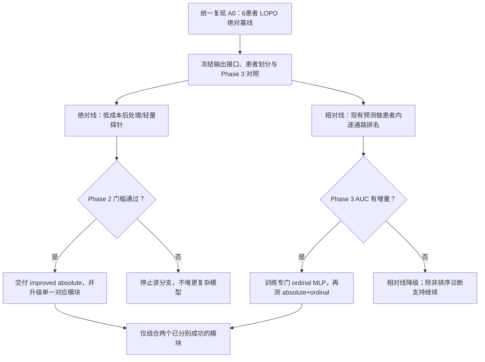

# PFMval MPP2 双线并行改进方案学习指南

> 用途：用户自学、组会预习、Phase 2 与 Phase 3 团队共享理解  
> 主题：绝对通路预测快速改进线 + 患者内相对通路活性探索线  
> 版本：学习指南版，2026-07-31  
> 说明：本文解释“为什么这样设计、先做什么、何时升级、何时停止”。文中的数值门槛属于建议预注册阈值，不是已经取得的实验结果。
> 项目边界：本文是教学解释与团队共享材料，不是训练授权、正式实验合同或当前事实单一来源。
> 2026-08-01 用户审核修正：Phase 3 是 pCR/MPR 治疗响应预测；当前已运行终点仅确认为 `pCR / non_pCR`。队列约 78 例，准确数目待 patient manifest 核验。方法名称统一为 CLAM、DTFD-MIL、TransMIL；团队探索结果与项目 accepted 实验结果必须分开。
> 2026-08-01 用户修订的 MPP2 输入边界：`CalibratedMPP2` 已因外部门失败被拒绝，不能进入 Phase 3。后续研究固定采用 H&E 与 accepted 修复版冻结基线原始输出联合输入；当前学习重点是直接拼接与特征融合的区别，以及方案 1 Track B、方案 2 CHRep 启发校准、方案 3 VPT/OT 的适用边界。

## 文档关系

- 结合最新排序和论文边界的更新版入口：[PFMval_MPP2_双线优化方案体系化学习指南_20260801.md](./PFMval_MPP2_双线优化方案体系化学习指南_20260801.md)
- 正式方案原文：[MPP2双线并行改进与Phase3快速接入方案_原文_20260731.md](../分析报告/MPP2双线并行改进与Phase3快速接入方案_原文_20260731.md)
- 仓库事实核对、实现扩展与冲突审查：[MPP2双线并行改进与Phase3快速接入方案_执行实现扩展与冲突审查_20260731.md](../分析报告/MPP2双线并行改进与Phase3快速接入方案_执行实现扩展与冲突审查_20260731.md)
- 阅读顺序：先用本文理解概念，再读方案原文，最后以冲突审查确认当前仓库的可执行边界。

---

## 0. 先看一页：这套方案到底要做什么

MPP2 当前用冻结的 UNI2-h 病理基础模型提取每个 spot 的 1536 维 CLS 特征，再用两层 MLP 输出 30 个固定基因集/通路的 ssGSEA 分数：

```text
H&E spot
   ↓
冻结 UNI2-h
   ↓
1536维 CLS 特征
   ↓
1536 → 1024 → 30 的 MLP
   ↓
30维虚拟通路分数
```

当前 accepted repaired frozen baseline 在外部患者 XZY 上表现为：

- pooled PCC = 0.6548958191；
- raw MAE = 1176.2114；
- raw R² = -0.0880；
- LoRA、逐通路 Ridge 校准以及配对 Huber 均未形成已接受的 PCC 增益。

这意味着：模型预测与真实值可能具有一定“同涨同跌”的趋势，但绝对数值的中心和尺度没有跨患者迁移好。继续只调 loss、Dropout 或线性校准，未必能解决任务定义和患者分布漂移之间的矛盾。

因此采用双线方案：

| 路线 | 核心问题 | 第一阶段交付 | 对 Phase 3 的影响 |
|---|---|---|---|
| A：绝对线 | 能否在保持原任务和接口不变的前提下，继续提高绝对通路预测？ | 仍为 spot × 30 的绝对分数文件 | 理论上只换文件 |
| B：相对线 | 若跨患者绝对标尺不稳定，患者内部的通路空间高低关系是否更稳、更有助于 pCR？ | 仍为 spot × 30 的 0～1 相对分数文件 | 逐 patch 融合时只换文件；若先求均值则需重审 |

最重要的执行顺序是：



一句话概括：

> 绝对线负责快速、低风险地给 Phase 3 提供可替换输入；相对线负责验证“患者内空间通路关系”这一新任务是否有临床增量。先保持接口稳定并验证核心假设，再增加 GraphSAGE、连续关系对齐或动态原型。

---

## 1. 项目背景：为什么现在需要“双线”，而不是继续单线调参

### 1.1 当前任务的特殊性

本项目并不是常见的“从 H&E 预测上千个基因表达”，而是：

- 输入：冻结 UNI2-h 预提取的 1536 维 CLS 特征；
- 训练来源：6 名 fit 患者；
- 外部挑战患者：XZY；
- 目标：每个 spot 的 30 维固定通路/基因集分数；
- 当前公开代码中的回归头为 `1536 → 1024 → 30`，GELU、Dropout=0.3；
- 公开数据集代码虽然读取的 manifest 含 `patient / patch_stem / x / y`，但 `__getitem__` 最终只返回 `feature, target`，因此现有模型没有显式使用患者身份、坐标或邻域。

可核对：

- [当前 MLP 训练脚本](https://github.com/qzs610038-star/AI-esophagus-cancer-basedon-HF-HT/blob/main/train_mpp_uni2h_mlp.py)
- [当前 manifest 数据集](https://github.com/qzs610038-star/AI-esophagus-cancer-basedon-HF-HT/blob/main/dataset_mpp_manifest.py)
- [历史 EGN/原型模型](https://github.com/qzs610038-star/AI-esophagus-cancer-basedon-HF-HT/blob/main/egnv2/model.py)
- [实验 Registry](https://github.com/qzs610038-star/AI-esophagus-cancer-basedon-HF-HT/blob/main/experiments/experiment_registry.json)

注意：公开 GitHub `main` 只是历史快照，本地项目领先较多提交。公开代码只能帮助理解结构，不能覆盖本地 accepted baseline、最新实验结论或治理状态。

### 1.2 团队现实约束

Phase 3 团队正在探索 CLAM、DTFD-MIL、TransMIL 等多实例学习方法，把：

```text
UNI2-h 的 H&E patch 特征
+
Phase 2 预测的 30 维虚拟通路分数
```

进行拼接或特征融合，再预测 pCR 二分类，主要指标为 AUC。

因此，Phase 2 的理想改进不只是“科学上合理”，还应满足：

1. 不阻塞 Phase 3；
2. 不轻易改变 30 维通路的名称、顺序和 patch 对齐规则；
3. 先让 Phase 3 只替换输入文件即可测试；
4. 复杂结构只有在低成本假设得到支持后才开发。

双线方案正是对“科研创新”和“团队工程成本”两个目标的折中。

---

## 2. 为什么会出现高 PCC，但 raw R² 为负

### 2.1 PCC 在看什么

Pearson correlation coefficient（PCC，皮尔逊相关系数）主要看两组数是否呈线性同涨同跌。它对整体平移和正比例缩放并不敏感。

假设真实值是：

```text
y = [1, 2, 3]
```

预测值是：

```text
ŷ = [101, 102, 103]
```

两者顺序和变化方向完全一致，所以 PCC 可以接近 1；但预测绝对值显然错得很远。

### 2.2 R² 在看什么

R² 比较模型误差与“永远预测真实均值”这个简单基线：

\[
R^2 = 1 - \frac{\sum_i (y_i-\hat y_i)^2}{\sum_i (y_i-\bar y)^2}
\]

- R² = 1：预测完全正确；
- R² = 0：与永远预测真实均值相当；
- R² < 0：还不如永远预测真实均值。

[scikit-learn 的 R² 文档](https://scikit-learn.org/stable/modules/generated/sklearn.metrics.r2_score.html)也明确说明 R² 可以为负，而且它不是“某个相关系数的平方”。

### 2.3 对本项目的含义

高 PCC、负 R² 最合理的第一层解释是：

> 模型可能学到了一部分形态—通路的相对变化趋势，但没有学到能跨患者迁移的绝对中心和尺度。

潜在来源不应简单写成“测序深度不同”，因为 ssGSEA 本身包含样本内基因排序。更完整的候选原因包括：

- 基因检出率、零值和并列排名不同；
- 测序或预处理导致分布形状变化；
- 通路基因覆盖不同；
- 训练折 z-score 参考分布与 XZY 不匹配；
- 患者间真实生物学基线不同；
- pooled PCC 混合 spot 和通路后，受到固定通路均值结构影响；
- 图像形态能够预测局部趋势，却无法推断患者级分子标尺。

[ssGSEA 官方模块说明](https://gsea-msigdb.github.io/ssGSEA-gpmodule/v10/)将 ssGSEA 定义为“对每个样本—基因集配对独立计算富集分数”。因此，需要用数据分解证明尺度失配来自哪里，而不能仅凭外部 R² 直接归因。

### 2.4 为什么不能只盯 pooled PCC

pooled PCC 把大量 spot 和 30 条通路混合在一起，可能得到一个表面很好的总体值，但不能保证：

- 每条通路都预测得好；
- 每名患者都预测得好；
- spot 内局部空间差异被正确恢复；
- 相同通路在不同患者中仍可比较；
- 绝对误差可接受。

因此必须同时报告：

- 每名患者 pooled PCC；
- 6 名 held-out patient 的宏平均；
- 30 条逐通路 PCC；
- raw MAE 与 raw R²；
- 去除通路均值后的 residual PCC；
- 固定通路均值预测器的 pooled PCC；
- 空间块 bootstrap。

---

## 3. 双线共同原则：为什么先做低成本后处理和接口稳定

### 3.1 先验证假设，再开发模型

复杂模型通常同时改变参数量、训练方式、数据组织和输出分布。如果一开始就加入：

```text
GraphSAGE + Adapter + 对比学习 + PCC loss + 动态原型
```

即使结果变好，也无法说明究竟是哪一部分有效；结果变差时也无法定位失败原因。

低成本实验的价值不是“最终一定最好”，而是快速回答：

- 空间邻域是否有信号？
- 去除患者尺度是否帮助 Phase 3？
- 原型检索是否真的提供预测信息？
- 轻量 Adapter 是否优于等参数 MLP？

### 3.2 保持接口稳定可以降低跨团队成本

第一阶段统一维持：

```text
每个 patch / spot → 固定顺序的 30 维通路值
```

建议输出 schema：

```text
patient
slide
patch_stem
x
y
pathway_01 ... pathway_30
score_type
model_version
checkpoint_hash
```

其中 `score_type` 区分：

```text
absolute_baseline
absolute_spatial_refined
absolute_prototype_refined
absolute_adapter
ordinal_posthoc
ordinal_trained
```

这样 Phase 3 可以先只改配置路径，而无需立即改写既定的多实例学习主体。

### 3.3 接口稳定不等于科学问题不变

绝对线与相对线都输出 30 维，但含义不同：

- absolute：尝试表示跨 spot、跨患者的绝对或训练尺度通路分数；
- ordinal：只表示某通路在该患者内部的相对空间位置。

因此必须用 `score_type` 和独立目录明确区分，禁止把两类文件混用或用相同指标解释。

---

## 4. 共同实验治理：什么结果才算可信

### 4.1 patient-level LOPO

LOPO（leave-one-patient-out）指每次完整留出 1 名患者验证，其余 5 名训练，共 6 折。

正式模型选择必须做到：

- 同一患者的所有切片和 spot 不跨训练/验证；
- 不用患者内随机 spot 划分代替 LOPO；
- 超参数、epoch 和停止规则只依据 6 折 LOPO；
- 以 held-out patient 指标的宏平均为主，避免 spot 多的患者支配结果。

### 4.2 XZY 的定位

XZY 已经帮助团队发现“高 PCC、负 R²”的问题，因此它已经影响研究问题的形成。后续应把它定位为 external challenge set：

- 结构和超参数在 LOPO 中冻结；
- 每个最终候选只对 XZY 做一次正式评估；
- 不根据 XZY 结果反复改权重、邻居数或 checkpoint；
- 最好由后续另一独立队列承担最终确认。

### 4.3 工程冒烟与科学通过分开

工程冒烟只证明：

- 能运行；
- 输出 30 维；
- patch 数和顺序正确；
- 无 NaN/Inf；
- Phase 3 能读取。

科学通过还需要：

- patient-level LOPO；
- 与同一基线配对比较；
- 多数患者同方向；
- 逐通路和 raw 指标不过度恶化；
- 结果不由单一患者或单一随机种子驱动。

---

## 5. 路线 A：绝对通路分数快速改进线

### 5.1 目标

路线 A 不改变任务含义，继续回答：

> 对这个 spot，30 条通路的绝对或训练尺度分数分别是多少？

它的主要价值是：

- 与当前 Phase 3 输入完全兼容；
- 若 Phase 2 指标稳定提升，可立即替换虚拟通路文件；
- 继续探索空间、原型和轻量表示适配是否有用；
- 为更复杂模型建立证据门。

### 5.2 A0：重新建立统一基线

固定：

```text
1536 → 1024 → 30
GELU
Dropout = 0.3
MSE
```

必须保存：

- 6 折 OOF 预测；
- 每折 checkpoint；
- 每患者 pooled PCC；
- 30 条逐通路 PCC；
- raw MAE、raw R²；
- 参数量、时间、显存；
- patch 级输出文件。

如果 A0 在新 LOPO 协议中不能稳定复现，就不能开始后续比较。

### 5.3 A1-S：预测后轻量邻域平滑

#### 原理

不重训模型。当前 spot 的预测保留大部分，再加入少量同切片近邻预测均值：

\[
\hat y_i^{new}=(1-\lambda)\hat y_i+
\lambda\sum_{j\in N(i)} w_{ij}\hat y_j
\]

- \(i\)：当前 spot；
- \(N(i)\)：同患者、同切片近邻；
- \(\lambda\)：邻域修正权重；
- \(w_{ij}\)：归一化邻居权重。

#### 为什么先做它

- 不改 UNI2-h；
- 不改训练；
- 不改 Phase 3 接口；
- 最低成本检验“邻居是否有剩余价值”；
- 若无效，可避免直接开发 GraphSAGE。

#### 初始配置

预先固定少量组合，例如：

- k = 4、8；
- \(\lambda = 0.10、0.20\)；
- 总配置不超过 4 个；
- 不能在 XZY 上挑参数。

#### 建议通过门槛

相对 A0：

1. 6 折患者宏平均 pooled PCC 提升至少 +0.005；
2. 至少 4/6 名患者正增益；
3. 逐通路 PCC 中位数下降不超过 0.003；
4. raw MAE 恶化不超过 1%；
5. raw R² 恶化不超过 0.02；
6. 单一患者对总增益的贡献不超过 50%。

#### 失败风险

- 肿瘤—间质边界被抹平；
- 小热点消失；
- 只降低预测方差而没有增加信息；
- pooled PCC 上升，但逐通路、MAE 或热点定位下降。

#### 通过后的递进

```text
预测后平滑
   ↓
1层零门控 GraphSAGE
   ↓
局部 Transformer 或 edge-aware GAT
   ↓
仅在前述空间证据充分后考虑 ConvSSM
```

GraphSAGE 首选一层，是为了最直接检验“邻居均值特征是否有用”，并降低过平滑和过拟合风险。

### 5.4 A1-P：固定患者平衡原型残差

#### 原理

在每个 LOPO 训练折内，只用 5 名训练患者建立 16 个固定真实 medoid 原型。每个原型包含：

- 一个真实训练 patch；
- 该簇的 30 维平均通路谱；
- 来源患者构成；
- 与新 spot 的匹配权重。

最终预测：

\[
\hat y_i^{new}=\hat y_i^{MLP}
+\alpha(\hat y_i^{proto}-\hat y_i^{MLP})
\]

这里 \(\alpha\) 是很小的修正强度，第一轮可固定为 0.10。

#### 为什么选择固定原型

- 可解释为“新区域像哪些训练区域”；
- 输出仍是 30 维；
- 比完整 EGN/EGGN 改动小；
- 真实 medoid 比自由漂移的动态向量更容易核验。

#### 建议通过门槛

除 A1-S 的性能门槛外，还需要：

- 原型不能普遍由单一患者占据；
- 真实原型通路谱优于标签置换原型；
- 修正权重不能等效为 0；
- 不同 LOPO 折的原型具有基本稳定性。

#### 失败风险

- 原型只是患者或染色风格；
- 少数原型把罕见形态平均掉；
- 原型让预测范围收缩；
- 图像展示漂亮，但预测价值不真实。

#### 通过后的递进

```text
16个固定 medoid
   ↓
16 vs 32 原型
   ↓
锚定式动态原型
   ↓
原型空间热图、跨患者稳定性、医生复核
```

固定原型不通过时，不应升级动态原型。

### 5.5 A1-A：零初始化残差 Adapter + MSE

#### 原理

Adapter（轻量特征适配层）在固定 UNI2-h 特征后做一个小修正：

```text
1536 → 64 → 1536
```

\[
f'=f+A(f)
\]

最后一层零初始化，使模型初始接近原 baseline。

#### 为什么只先加 Adapter，不加对比学习

这个实验只回答：

> 轻量调整 UNI2-h 表示本身，是否已经能够提高跨患者泛化？

如果一开始同时加入对比损失、相关性损失和通路图，就无法区分收益来源。

#### 建议通过门槛

相对“等参数非 Adapter MLP”：

- 宏平均 pooled PCC 至少 +0.005；
- 至少 4/6 患者正增益；
- MAE/R² 不明显恶化；
- 3 个固定随机种子的方向基本一致；
- 等参数 MLP 不能获得同样收益。

#### 通过后的递进

```text
Adapter + MSE
   ↓
标准一对一对比学习
   ↓
连续关系对齐
   ↓
仅在前项有效后，单独测试低权重相关性 loss
```

PEaRL 已使用 ssGSEA 通路表示进行病理—通路学习，但本项目固定 UNI2-h、只用 CLS 特征且目标只有 30 维，因此后续只能称“PEaRL 启发”，不能称复现。参考：[PEaRL, WACV 2026](https://openaccess.thecvf.com/content/WACV2026/papers/Majumder_PEaRL_Pathway-Enhanced_Representation_Learning_for_Gene_and_Pathway_Expression_Prediction_WACV_2026_paper.pdf)。

---

## 6. 路线 B：患者内相对通路活性探索线

### 6.1 它预测的到底是什么

路线 B 的推荐定义不是：

> 在同一个 spot 内，把 30 条 ssGSEA 通路从高到低排序。

而是：

> 对每一条通路分别判断：该 spot 在这名患者全部有效 spot 中处于相对低、中还是高活性位置。

定义：

\[
r_{pik}=
\frac{\operatorname{rank}_{i\in p}(y_{pik})-0.5}{N_p}
\]

- \(p\)：患者；
- \(i\)：spot；
- \(k\)：通路；
- \(N_p\)：该患者有效 spot 数；
- \(r_{pik}\)：0～1 的患者内百分位。

### 6.2 为什么不推荐同 spot 内 30 通路互排

不同基因集的 ssGSEA 分数可能受到基因集大小、组成和分布影响，不一定处于共同标尺。把它们直接互相排名，类似于把身高、速度和面积放在同一把尺上比较。

更严重的是，模型可能只记住一个几乎固定的全局通路顺序，不看 H&E 也能得到很高准确率。

因此，“同 spot 30 通路互排”最多作为诊断性对照，不应作为主任务。

### 6.3 相对线解决什么痛点

它主动放弃难以跨患者恢复的绝对中心和尺度，集中保留：

- 每条通路的空间热点；
- 低活性区；
- 热点边界；
- 局部异质性；
- 与病理形态区域的对应关系。

这与 pCR 的潜在空间特征更接近，例如：

- 免疫热点是否进入肿瘤；
- EMT 高活性区域是否集中在边缘；
- 免疫抑制热点是否碎片化；
- 多条通路热点是否共现。

但这是研究假设，不是既定事实，必须由 Phase 3 AUC 验证。

### 6.4 B0：先审计 Phase 3 接口

必须确认 30 维通路如何进入 CLAM、DTFD-MIL、TransMIL 等实际方法。

#### 情况 A：逐 patch 融合

```text
每个 patch：
[UNI特征] + [30维通路]
        ↓
MIL 聚合
        ↓
pCR
```

相对分数可直接接入，Phase 3 有机会利用“哪个位置高、哪个位置低”。

#### 情况 B：先对全患者求均值

患者内百分位的均值几乎恒定在 0.5，top-20% 比例也几乎恒定在 20%。简单平均会把相对信息消掉。

这时需要改用：

- 分位数；
- 热点面积与位置；
- 空间聚集度；
- 热点碎片化；
- 原型共现；
- 肿瘤—间质界面统计。

这已不是“只换文件”的低成本实验。

### 6.5 B1：现有绝对预测的 post-hoc ordinal

#### 原理

不重新训练 Phase 2。把 accepted baseline 对每名患者的预测，按“患者内、逐通路”转成百分位：

```text
absolute prediction
        ↓
patient-wise + pathway-wise rank
        ↓
ordinal_posthoc
```

#### 为什么它优先级最高

- 零训练成本；
- 输出仍为 30 维；
- Phase 3 只换文件；
- 最快验证“去除患者尺度后是否更适合 pCR”。

#### 它能证明什么

若 Phase 3 AUC 提升，说明相对表示方向值得继续。

#### 它不能证明什么

它没有提高 Phase 2 的真实排序能力，只是重新编码现有预测。因此不能说“Phase 2 模型变准了”。

#### 建议进入 B2 的门槛

在完全相同 patient-level CV、随机种子和 Phase 3 多实例学习配置下，满足以下任一项：

1. `HE + ordinal_posthoc` 相对 `HE + accepted_absolute` 的平均 AUC 至少 +0.01，且至少 70% 配对运行方向为正；
2. `HE + absolute + ordinal_posthoc` 相对 `HE + absolute` 的平均 AUC 至少 +0.01，且不是单一 fold 驱动。

这些是建议预注册阈值，应在看结果前冻结。

### 6.6 B2：同结构 ordinal MLP

#### 原理

模型结构完全不变：

```text
1536 → 1024 → 30
GELU
Dropout = 0.3
MSE
```

只把目标改为患者内、逐通路百分位。

#### 为什么先用 MSE

MSE 对 0～1 连续百分位最容易实现，也最便于和 B1 归因比较。只有 B2 有信号后，才值得测试 pairwise ranking loss。

#### 正确评估指标

相对任务不应继续以 pooled Pearson PCC 为主。建议：

- 每患者、每通路 Spearman；
- 6 名患者宏平均 Spearman；
- Kendall’s \(\tau_b\)；
- spot pair concordance；
- top-20% 热点 AUROC；
- top-20% 热点 Jaccard；
- 30 条逐通路结果；
- 患者/空间块 bootstrap。

#### 建议通过门槛

相对 B1：

1. LOPO 宏平均 Spearman 至少 +0.01；
2. 至少 4/6 患者正增益；
3. top-20% 热点 Jaccard 至少 +0.02；
4. 逐通路指标必须同步改善，不能只改善 pooled rank；
5. 3 个固定种子的方向基本一致。

通过后才对 XZY 做一次冻结评估，并向 Phase 3 交付 `ordinal_trained`。

### 6.7 B3：absolute + ordinal 双文件

第一轮不急于开发 Phase 2 双头网络，而是分别导出：

```text
virtual_pathway_absolute.csv
virtual_pathway_ordinal.csv
```

Phase 3 比较：

```text
HE only
HE + absolute
HE + ordinal
HE + absolute + ordinal
```

若 Phase 3 只需把通路维度从 30 扩为 60，这通常比修改 Phase 2 网络更简单，而且能清楚判断两种信息是否互补。

### 6.8 相对线通过后的递进

```text
post-hoc ordinal
   ↓
专门训练 ordinal MLP
   ↓
absolute + ordinal 双视图
   ↓
ordinal + 轻量邻域/GraphSAGE
   ↓
ordinal + 连续关系对齐
   ↓
ordinal 原型解释
```

只有上一层同时通过 Phase 2 和 Phase 3 证据门，才进入下一层。

---

## 7. 两条线如何与 Phase 3 多实例学习方法接入

### 7.1 Phase 3 的角色

CLAM 和 DTFD-MIL 一类方法属于多实例学习（MIL）：一名患者或一张切片视为一个 bag，多个 patch 是 instances，模型用患者/切片级标签训练。参考：

- [CLAM 论文与代码说明](https://www.nature.com/articles/s41551-020-00682-w)
- [DTFD-MIL, CVPR 2022](https://openaccess.thecvf.com/content/CVPR2022/papers/Zhang_DTFD-MIL_Double-Tier_Feature_Distillation_Multiple_Instance_Learning_for_Histopathology_Whole_CVPR_2022_paper.pdf)

项目方法名称统一使用 CLAM、DTFD-MIL、TransMIL；实际运行版本、代码路径和提交仍需由团队证据闭环。

### 7.2 最低成本 Phase 3 矩阵

| 编号 | 输入 | 回答的问题 |
|---|---|---|
| P0 | HE only | 图像基线是多少？ |
| P1 | HE + accepted absolute | 当前虚拟通路是否有增量？ |
| P2 | HE + improved absolute | 绝对线增益能否传递到 pCR？ |
| P3 | HE + ordinal post-hoc | 去除患者尺度是否有价值？ |
| P4 | HE + trained ordinal | 专门训练相对模型是否优于简单排名？ |
| P5 | HE + absolute + ordinal | 两种信息是否互补？ |
| P6 | HE + generic 30D compression | 增益是否只是“多了 30 维压缩特征”？ |

P6 很重要，因为虚拟通路也是由 UNI2-h 特征预测而来，而 Phase 3 已经使用 UNI2-h。可以用训练折 PCA、随机投影或无通路监督的 30 维 MLP 压缩作为低成本对照。

### 7.3 Phase 3 必须固定的条件

- patient-level folds；
- 同一患者多张切片不得跨 fold；
- 相同随机种子；
- 相同训练 epoch 和 early stopping；
- 相同优化器与超参数；
- 相同 patch 过滤；
- Phase 2 checkpoint 完全冻结；
- 所有标准化仅在 Phase 3 训练折拟合。

否则 AUC 差异无法归因于通路输入。

### 7.4 还必须讨论 pCR 标签合同

pCR 是病理完全缓解的临床结局，但项目内必须冻结：

- 阳性/阴性的确切定义；
- 病理报告字段；
- MPR 与 pCR 是否混用；
- 缺失、未标注和含糊自由文本如何处理；
- 谁完成标签复核；
- 是否存在治疗方案或中心差异。

未标注病例不能默认当阴性。标签合同不清楚时，AUC 再高也可能没有可靠临床含义。

---

## 8. 这套方案的创新点在哪里

### 8.1 不能过度声称的部分

以下概念本身并不新：

- 用排名减弱尺度变化；
- 用邻域平滑或图网络处理空间信息；
- 用原型做病理解释；
- 用对比学习对齐图像与分子特征；
- 用 MIL 从 WSI/patch 预测患者级结局。

例如 TSP（Top Scoring Pair）早已使用样本内基因表达相对顺序进行分类，并具有对单调变换较稳健的特点。参考：[Geman et al., 2004](https://pubmed.ncbi.nlm.nih.gov/16646797/)。

### 8.2 可能形成的方法创新

真正可能有价值的是完整、受约束的组合问题：

> 在固定病理基础模型、跨患者绝对通路标尺失配的条件下，将 H&E 到分子预测拆成“绝对通路回归”和“患者内逐通路空间序数映射”两条证据线，并验证哪一种或哪种组合能为 pCR 的图像 MIL 模型提供稳定增量。

创新可以来自：

1. 明确定义患者内、逐通路空间序数目标，而非同 spot 内通路互排；
2. 用 Phase 2 排序/热点指标和 Phase 3 pCR AUC 建立两级证据；
3. 保持 spot × 30 的统一接口，实现绝对、post-hoc ordinal、trained ordinal 的公平比较；
4. 用 generic 30D 压缩对照证明通路监督的增量；
5. 将空间邻域、连续关系对齐和真实 medoid 原型作为“通过门槛后”的递进模块；
6. 公开失败模式和停止规则，避免只报告偶然最好结果。

### 8.3 与相邻研究的区别

- [RankByGene](https://arxiv.org/abs/2411.15076)强调图像与基因表示之间的跨模态排序一致性；本方案的核心对象是“每条固定通路在单个患者空间内的相对位置”。
- [PEaRL](https://openaccess.thecvf.com/content/WACV2026/papers/Majumder_PEaRL_Pathway-Enhanced_Representation_Learning_for_Gene_and_Pathway_Expression_Prediction_WACV_2026_paper.pdf)使用 ssGSEA 通路表示进行病理—通路学习；本项目需验证的是冻结 UNI2-h CLS、30 通路和患者内序数目标。
- [空间表达预测 benchmark](https://pmc.ncbi.nlm.nih.gov/articles/PMC11814321/)说明外部验证、指标选择和转化价值评估都很重要；本项目不能只靠单一 pooled PCC。

因此，在完成系统检索和实验前，不应声称“首个”或“首次”。

---

## 9. 主要风险、原因与规避方式

| 风险 | 为什么发生 | 最低成本规避 |
|---|---|---|
| 高 PCC 来自固定通路均值结构 | pooled 计算混合了通路和 spot | 加固定30通路均值基线、逐通路 PCC、去均值 PCC |
| 空间平滑破坏边界 | 相邻不等于生物状态相同 | 小权重、同切片、边界分层评估、热点 Jaccard |
| 坐标成为捷径 | 模型记住切片方向或组织摆放 | coordinate-only、坐标打乱、切片内归一化 |
| 原型成为患者/染色聚类 | 患者间颜色和扫描差异大 | 患者平衡原型、患者纯度、置换对照、真实 medoid |
| Adapter 增益只是参数量 | 增加参数本身可提高拟合 | 等参数 MLP 对照、固定随机种子 |
| ordinal 丢失患者整体水平 | 每名患者都被压成同一排名分布 | 保留 absolute 和 HE 分支；优先双文件而非完全替代 |
| ordinal 丢失幅度 | 10/11/12 与 1/50/100 可有相同排名 | 保留绝对线；额外统计预测分布跨度，但不伪造绝对标尺 |
| ordinal 被患者均值聚合消掉 | 百分位均值约等于0.5 | 必须逐 patch 融合，或使用热点/空间统计 |
| 任务被改得“更容易” | 排名天然去掉尺度难题 | 必须验证真实 spot 排序、热点位置和 Phase 3 AUC |
| Phase 3 增益只是重复利用 UNI | 30维通路来自同一 UNI 特征 | generic 30D compression 对照 |
| 6患者造成过拟合 | spot 多不等于患者多 | patient-level LOPO、少量预注册配置、停止规则 |
| XZY 被间接调参 | 它已启发新任务定义 | XZY 只做冻结挑战评估，并披露其角色 |
| pCR 标签不可靠 | 自由文本、缺失或 MPR/pCR 混淆 | 冻结结构化标签字典和复核流程 |

---

## 10. 待团队讨论并冻结的问题

以下问题未解决前，不宜开始大规模实验。

### 10.1 Phase 3 数据流

1. 30 维通路是逐 patch 拼接，还是患者级先求均值？
2. 多张切片在 patient bag 中如何合并？
3. CLAM、DTFD-MIL、TransMIL 实际运行了哪些版本？对应代码路径和提交是什么？
4. Phase 3 当前使用哪些随机种子、fold 和 early stopping？

### 10.2 ordinal 的统计范围

1. 排名是每张切片内，还是同一患者全部切片合并？
2. 肿瘤区、间质区和全组织是否共同参与排名？
3. 背景、低质量 patch 和重复区域如何过滤？
4. 同值如何处理？建议使用 average rank，并报告 tie 比例。
5. 新患者有效 patch 太少时是否停止生成 ordinal？

建议默认：

> 同一患者所有纳入切片的全部有效 patch 统一排名，但必须固定 ROI、背景过滤、重复区域处理和最小 patch 数。

### 10.3 pCR 标签

1. pCR 阳性定义是否来自结构化病理字段？
2. MPR、pCR 和“completely success”等文本是否曾混用？
3. 未标注病例是排除、待复核还是未知？
4. 是否记录治疗方案、中心、时间和切片时点？

### 10.4 实验治理

1. +0.005 PCC、+0.01 AUC 等门槛是否在看结果前接受？
2. Phase 3 重复 CV 做多少次？
3. XZY 每个候选是否严格只评一次？
4. 哪些结果写入 Registry，哪些只算探索？
5. 失败实验如何归档，避免后续重复尝试？

---

## 11. 术语表

| 术语 | 中文解释 | 在本方案中的含义 |
|---|---|---|
| UNI2-h | 病理基础模型 | 固定不训练，只提供 1536 维 CLS 特征 |
| CLS 特征 | 单个 patch 的汇总向量 | MPP2 当前模型输入 |
| MLP | 多层感知机 | 当前 `1536→1024→30` 回归头 |
| pathway / gene set | 通路/基因集 | 固定的 30 个 ssGSEA 预测目标 |
| ssGSEA | 单样本基因集富集评分 | 每个样本—基因集配对的富集分数 |
| PCC | 皮尔逊相关系数 | 看线性同涨同跌，不保证绝对值正确 |
| R² | 决定系数 | 看是否优于永远预测真实均值 |
| MAE | 平均绝对误差 | 预测值与真实值的平均绝对差 |
| pooled PCC | 混池 PCC | 将多个 spot/通路元素混合计算，需谨慎解释 |
| LOPO | 留一患者验证 | 5名训练、1名整患者验证，共6折 |
| OOF | 折外预测 | 每名患者由未见过该患者的模型产生的预测 |
| ordinal | 序数/相对次序 | 本方案指患者内、逐通路空间百分位 |
| post-hoc ordinal | 预测后排名 | 不重训，直接对现有预测做患者内排名 |
| trained ordinal | 专门训练的相对模型 | 用真实百分位标签训练同结构 MLP |
| GraphSAGE | 图神经网络 | 聚合同切片空间邻居特征 |
| GAT | 图注意力网络 | 学习不同邻居的重要性 |
| Adapter | 轻量特征适配层 | 对固定 UNI 特征做小幅残差修正 |
| prototype / medoid | 原型/真实中心样本 | 用真实训练 patch 表示典型形态 |
| MIL | 多实例学习 | 从多个 patch 推断患者/切片级 pCR |
| CLAM | 注意力式 MIL 方法 | Phase 3 候选聚合框架 |
| DTFD-MIL | 双层特征蒸馏 MIL | 适合小 WSI 队列的 MIL 候选 |
| AUC | ROC 曲线下面积 | Phase 3 pCR 二分类主指标 |
| hotspot | 热点 | 某通路在患者内相对高活性的空间区域 |
| bootstrap | 自助法 | 本项目应按患者/空间块聚类重采样 |
| score_type | 分数类型标识 | 防止 absolute 与 ordinal 文件混用 |

---

## 12. 推荐会议讨论清单

### 会前必须准备

- [ ] A0 的 6 折 patient-level LOPO 是否已经复现？
- [ ] 30 条通路名称、顺序和标签版本是否冻结？
- [ ] Phase 3 当前究竟是逐 patch 融合还是患者级均值？
- [ ] pCR 标签定义和缺失值规则是否已有书面合同？
- [ ] patient-level folds 和随机种子是否能在所有输入方案中复用？

### 会议需要作出的决策

- [ ] 是否接受 A1-S 的固定 k 和 \(\lambda\) 搜索上限？
- [ ] 是否接受 Phase 2 的 +0.005 建议晋级门槛？
- [ ] 是否接受 Phase 3 的 +0.01 AUC 建议晋级门槛？
- [ ] ordinal 按单切片还是患者全部切片排名？
- [ ] B1 无增量时，什么证据允许继续 B2？
- [ ] 是否加入 generic 30D compression 对照？
- [ ] XZY 的一次性挑战评估由谁执行并记录？
- [ ] 哪些失败分支必须停止，不再通过更多超参数“救活”？

### 会后必须形成的文件

- [ ] 双线实验 Registry 条目；
- [ ] 统一输出 schema；
- [ ] Phase 2 与 Phase 3 配对 fold 文件；
- [ ] pCR 标签字典；
- [ ] 每个候选的配置冻结记录；
- [ ] 结果表与失败原因记录。

---

## 13. 一页式结论

### 当前问题

MPP2 已能在 XZY 上取得约 0.655 的 pooled PCC，但 raw R² 为负，说明“趋势相关”与“绝对数值可迁移”不是同一件事。绝对标尺失配可能来自测序、检出率、预处理、z-score 参考和患者真实基线差异，不能简单归因于单一因素。

### 为什么采用双线

- 绝对线保留当前任务和 Phase 3 接口，负责快速交付；
- 相对线研究患者内逐通路空间关系，负责验证新任务；
- 两线独立能减少归因混乱；
- 相对线失败不会阻塞绝对线；
- 只有单模块成功后才组合，降低 6 患者小样本下的偶然性。

### 最先做什么

1. 复现 A0：6 患者 patient-level LOPO；
2. 冻结 spot × 30 输出接口；
3. 确认 Phase 3 是否逐 patch 融合；
4. 绝对线做预测后轻量邻域平滑；
5. 相对线把 accepted absolute 预测转换为患者内逐通路百分位，直接交给 Phase 3；
6. 所有比较保持相同 folds、种子和 Phase 3 多实例学习配置。

### 什么结果允许升级

- 绝对线：宏平均 PCC 至少 +0.005、至少 4/6 患者正增益、raw 和逐通路指标不过度恶化；
- 相对线 B1：Phase 3 平均 AUC 至少 +0.01、至少 70% 配对运行正向、非单 fold 驱动；
- B2：相对 B1 的宏平均 Spearman 至少 +0.01、热点 Jaccard 至少 +0.02、至少 4/6 患者正增益。

这些门槛必须在看正式结果前冻结。

### 通过后怎么递进

- 空间平滑通过 → 一层 GraphSAGE → 局部 Transformer/GAT；
- 固定原型通过 → 32 原型 → 锚定动态原型；
- Adapter+MSE 通过 → 标准对比 → 连续关系对齐；
- post-hoc ordinal 有 AUC 增量 → trained ordinal → absolute+ordinal；
- 只有两个模块分别成功，才测试组合。

### 最大风险

- pooled PCC 误导；
- ordinal 删除患者整体水平和幅度；
- ordinal 被患者均值聚合消掉；
- 虚拟通路只是 UNI 的重复压缩；
- pCR 标签合同不清；
- 6 名患者不足以支持大规模模型与超参数搜索；
- XZY 被间接用作调参集。

### 最终判断

> 这套方案的重点不是同时做两套大模型，而是同时保留一条可快速交付的绝对路线和一条低成本验证的新任务路线。第一轮应尽量做到“只换文件、少改代码、清楚归因”；复杂空间模型、连续对齐和动态原型必须由前置实验决定，而不是预先假定有效。

---

## 14. 关键参考资料

### 项目代码

1. [PFMval 公开 GitHub 仓库](https://github.com/qzs610038-star/AI-esophagus-cancer-basedon-HF-HT)
2. [MPP2 UNI2-h MLP 训练脚本](https://github.com/qzs610038-star/AI-esophagus-cancer-basedon-HF-HT/blob/main/train_mpp_uni2h_mlp.py)
3. [MPP2 manifest 数据集](https://github.com/qzs610038-star/AI-esophagus-cancer-basedon-HF-HT/blob/main/dataset_mpp_manifest.py)
4. [历史 EGN/原型模型](https://github.com/qzs610038-star/AI-esophagus-cancer-basedon-HF-HT/blob/main/egnv2/model.py)
5. [实验 Registry](https://github.com/qzs610038-star/AI-esophagus-cancer-basedon-HF-HT/blob/main/experiments/experiment_registry.json)

### 指标与通路评分

6. [scikit-learn：R² 可以为负](https://scikit-learn.org/stable/modules/generated/sklearn.metrics.r2_score.html)
7. [GenePattern：ssGSEA 模块说明](https://gsea-msigdb.github.io/ssGSEA-gpmodule/v10/)
8. [singscore：单样本秩基因集评分](https://pmc.ncbi.nlm.nih.gov/articles/PMC6219008/)
9. [单样本基因集评分 benchmark](https://pmc.ncbi.nlm.nih.gov/articles/PMC12710473/)

### 相对排序与病理—分子学习

10. [Geman et al.：Top Scoring Pair](https://pubmed.ncbi.nlm.nih.gov/16646797/)
11. [Relative Expression Analysis 综述](https://pmc.ncbi.nlm.nih.gov/articles/PMC2921829/)
12. [RankByGene：跨模态排序一致性](https://arxiv.org/abs/2411.15076)
13. [PEaRL：pathway-enhanced representation learning](https://openaccess.thecvf.com/content/WACV2026/papers/Majumder_PEaRL_Pathway-Enhanced_Representation_Learning_for_Gene_and_Pathway_Expression_Prediction_WACV_2026_paper.pdf)
14. [空间基因表达病理预测 benchmark](https://pmc.ncbi.nlm.nih.gov/articles/PMC11814321/)

### Phase 3 多实例学习

15. [CLAM：弱监督计算病理](https://www.nature.com/articles/s41551-020-00682-w)
16. [CLAM GitHub](https://github.com/mahmoodlab/CLAM)
17. [DTFD-MIL：Double-Tier Feature Distillation MIL](https://openaccess.thecvf.com/content/CVPR2022/papers/Zhang_DTFD-MIL_Double-Tier_Feature_Distillation_Multiple_Instance_Learning_for_Histopathology_Whole_CVPR_2022_paper.pdf)

---

## 15. 自学检查题

1. 为什么高 PCC 不能证明绝对预测准确？
2. 为什么患者内 ordinal 不能简单在所有 patch 上求均值？
3. B1 的 post-hoc ordinal 为什么只能验证 Phase 3 表示价值，不能证明 Phase 2 学习能力提高？
4. 为什么固定原型失败后不应直接升级动态原型？
5. 为什么 `HE + virtual pathway` 必须和 `HE + generic 30D compression` 比较？
6. 为什么相对任务的主指标应换成 Spearman、Kendall 和热点重合，而不是 pooled Pearson？
7. 哪些条件满足后才允许组合 GraphSAGE 与 continuous alignment？

如果团队成员能够不看本文回答这 7 个问题，说明已经理解双线方案的核心逻辑。
