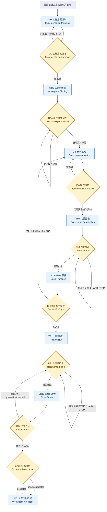

# PFMval：部署方案批准到 Gitee 训练、回传与登记全流程路线图

> 文档类型：理论学习指南 / 待用户审核参考  
> 编写日期：2026-08-10  
> 适用范围：用户已经明确批准最终部署方案之后的新实验  
> 重要边界：本指南解释现行治理顺序，不等于批准某个实验、创建工作树、推送 Gitee、操作服务器、启动训练或接纳结果。

## 1. 先理解三个对象

| 对象 | 作用 | 存放位置 | 批准含义 |
|---|---|---|---|
| 部署方案 | 解释为什么做、做什么、科学问题和部署边界 | `01_指南与解读/部署方案/` | 用户批准后，才允许创建实施方案 |
| 实施方案 | 把定版部署方案拆成 W###、目录、配置、代码、测试和证据任务 | `project_state/implementation_plans/W###-<工作树名>_实施方案.md` | 必须再次获得用户明确批准，才允许创建/绑定工作树 |
| Job/Result 信封 | 将一次服务器执行及其回传证据绑定到 experiment、W###、attempt、commit 和批准 | `automation/jobs/`、Gitee 单写者 ref、结果 inbox | Job 批准只授权精确 job/commit/run units；Result 存在不等于 accepted |

## 2. 全流程总图



## 3. 分阶段路线

### IP1 实施方案编制（Implementation Planning）

部署方案批准后，依据它创建唯一实施方案。实施方案至少写明：

- 来源部署方案路径和 revision；
- 目标 `experiment_id` 与拟用永久编号 `W###`；
- 本地/服务器代码目录和工作树外 run/return 目录；
- 修改前配置清单与保护资产边界；
- 每个实施条目、最简验证命令、预期证据路径；
- 初始进度和用户批准记录位置。

**HARD 门禁**：此时只创建实施方案文件，不得创建/绑定工作树，不得建立实验代码目录，不得修改代码或执行配置。

### IA2 实施方案批准（Implementation Approval）

用户必须对实施方案再次明确批准。批准范围需要能唯一指向实施方案文件、revision、目标 experiment 和拟用 W###。

**HARD 门禁**：没有第二次明确批准，后续所有写操作停止。

### WB3 工作树绑定（Workspace Binding）

实施方案获批后，才允许登记 experiment、分配永久不复用的 W###、创建本地工作树和本次代码/配置目录。服务器端同一 experiment 始终复用同一个持久 W###；job 和 attempt 不创建新源码工作树。

绑定回执必须核对：

- `workspace_id`、display name、experiment；
- 本地路径、服务器 path id、branch、完整 HEAD；
- tracked/untracked dirty 状态；
- workspace 生命周期、lease、active attempt；
- W005 为 `abandoned_reserved`，新实验只能使用 W006 或更高未占用编号。

**当前自动化缺口**：`experiment register` 仍同时要求工作树路径并分配 W###，尚未把“实验登记”和“工作树绑定”拆成两个机器命令。因此必须人工保证：只在 IA2 已通过后调用该命令。

### US4 用户显式切换（User Workspace Switch）

用户在新对话中明确给出：

```text
本对话工作树：W###
```

Agent 回执 experiment、路径、branch、HEAD、dirty 和绑定状态。未显式切换前只能只读检查，不得默认在 `main` 写实验代码。

### CI5 代码实现（Code Implementation）

只在绑定工作树内按照获批实施方案编辑。每完成一个实施条目，立即在同一实施方案追加：

- `completed_pending_user_review`；
- 对应 commit；
- 实际执行的最简测试及结果；
- 代码、配置和证据文件路径；
- 与部署方案的偏差；若偏差改变科学问题、数据、模型、训练协议或输出，必须停止并重新审批。

严禁用聊天总结代替实施方案进度回写。

### IR6 实现审核（Implementation Review）

训练前至少确认：

- 实施条目均有文件证据；
- 源码已经提交，工作树干净；
- 配置与 critical contract（关键合同）一致；
- train/internal validation/external test 固定，预处理只在 train 拟合；
- external XZY 不参与 checkpoint、超参数或标签标准化选择；
- 受保护 manifest、split、z-score 和 embargo 审计未被隐式重建。

### ER7 实验登记（Experiment Registration）

登记 active experiment、protocol revision、phase、正整数 `run_limit`、critical contract 和唯一 W###。一个独立拟合、seed 或校准器均按实际数量计入 `run_units`，不得用“一批”掩盖多次拟合。

不会消耗 run unit：preflight、dry-run、参数解析、环境/路径检查、未越过启动边界的兼容失败、相同结果重打包和幂等 import。

会消耗 run unit：通过关键检查并进入 `EXPERIMENT_STARTED` 后的每个独立拟合/正式评估；之后即使失败也消耗。

### JA8 作业批准（Job Approval）

每个服务器作业必须绑定：

- `job_id = W###-A###`、`experiment_id`、`workspace_id`、`attempt_id`；
- `approval_id`、protocol revision、phase、run units；
- 完整 40 位 `source_commit`；
- critical contract SHA-256；
- 注册 path ids、input binding、resolved argv；
- dispatch/result 单写者 ref；
- `return_profile`，明确原始 CSV/TXT 和预测表回传要求。

**HARD 门禁**：聊天中的泛化“可以训练”不能替代绑定 `job_id + source_commit + run_units` 的显式批准文件。合同变化、预算不足或 source commit 漂移必须重新批准。

### GT9 Gitee 下发（Gitee Transport）

只允许配置好的 `gitee` remote：

1. 本地 canonical writer 在绑定 W### 形成干净 commit。
2. 生成不可变 dispatch revision。
3. fast-forward push 到本地单写者 ref。
4. 使用 `git ls-remote` 或 fetch 后 `rev-parse` 核对远端完整 SHA。
5. 服务器只 fetch 精确 ref/commit，不执行 `git pull`、merge 或 rebase。

禁止 SSH、SCP、HTTP 远程命令、Tunnel、GitHub 服务器传输、force push 和两端同时改同一源码分支。

### SP10 服务器预检（Server Preflight）

服务器运行前必须核对：

- `agent start-check --strict` 对当前训练范围 `FAIL=0`；
- 治理 checkout 与 `server_experiment_worktrees/W###` 映射正确；
- experiment、branch、HEAD、source commit 和 workspace Registry 一致；
- 工作树干净，无未知 tracked diff；
- 外置 `server_experiment_runs/W###/A###`、return、diagnostic 等 path id 已现场核验；
- 无冲突 lease，run budget 足够；
- 数据 manifest、split、train-only z-score、checkpoint/base model 与合同一致；
- dry-run/参数解析通过，尚未写入 `EXPERIMENT_STARTED`。

预检失败属于 **HARD STOP**，但只要尚未越过 `EXPERIMENT_STARTED`，不消耗 run unit。

### TR11 训练执行（Training Run）

原子获得 lease 后写入 `EXPERIMENT_STARTED`，再启动 allowlisted command。所有日志、checkpoint、predictions 和中间产物写入工作树外的 attempt 目录，不能污染持久源码工作树。

训练中发生需要改变 loss、数据、split、超参数、模型结构、checkpoint、phase 或 evaluation policy 的问题时，立即停止；它不是“简单服务器适配”，必须回到方案/批准阶段。

### RP12 结果打包（Result Packaging）

每个 attempt 的终态矩阵：

| 状态 | 必传内容 |
|---|---|
| success | terminal JSON、`raw_training_csv`（原始训练 CSV）、`raw_training_txt`（原始训练 TXT）、每个 evaluated split 的逐样本预测表 |
| failed | terminal JSON、`raw_training_csv`、`raw_training_txt` |
| incomplete | terminal JSON、当前可获得的原始 CSV/TXT |

分层校验：

- critical：accepted 指标来源、选择证明、逐样本预测、受保护 manifest，使用 SHA-256；
- supporting：普通训练 CSV/TXT、摘要和辅助表，使用必传清单、精确大小和 Git tree 闭包；
- diagnostic：环境、stdout/stderr 和排障输出，使用 allowlist、路径、大小、UTF-8/LF 和 Git tree 闭包，不逐文件计算 SHA-256。

结果先在 `server_result_returns/<result_id>` 构建并验证闭包，再只对该精确 revision force-add，避免 `.gitignore` 漏掉必传 `.csv`、`.txt` 或 `.log`。force-add 文件不等于允许 force push。

### GR13 Gitee 回传（Gitee Return）

服务器只写 server-owned return ref；本地 fetch 到 quarantine inbox，不 merge 到实验分支或 `main`。同 result ID 同 bundle 身份可幂等重传；同 ID 不同内容为 HARD FAIL，禁止覆盖或重新训练掩盖冲突。

### RI14 结果导入（Result Import）

本地导入前验证：

- result 与原 job、experiment、W###、attempt、approval、source commit 一致；
- terminal 状态、run units 和事件链完整；
- return profile 闭包完整；
- 每个 evaluated split 都有对应原始预测；
- critical 哈希有效；supporting/diagnostic 清单、大小和 Git tree 闭包有效；
- 重复导入为 no-op（无副作用），不重复消耗次数。

校验失败留在 quarantine/rejected；禁止因“文件已经回来了”直接登记 accepted。

### EA15 证据接纳（Evidence Acceptance）

`result import` 通过只表示结果已被治理系统接收，不自动代表科学结论获准。只有满足预注册评价规则并完成用户/独立审核后，才能转为 accepted，再更新 Dashboard、排名或长期结论。

### WC16 工作树收尾（Workspace Closeout）

释放 lease，确认无未回传 attempt、未导入结果、未审查服务器 patch、未推送 commit 和 dirty 文件，再生成 close preview。未经用户对唯一 W### 和解析后物理路径的单独批准，不得移除工作树、branch、checkpoint、cache 或外置 run root。W### 永久不复用。

## 4. HARD 严格门禁总表

| 门禁 | 失败时处理 |
|---|---|
| active 状态/文档/Schema 门禁存在 FAIL | 停止，不生成 job、不训练 |
| 部署方案未明确批准 | 不创建实施方案 |
| 实施方案未二次批准 | 不登记/绑定 W###，不建代码目录 |
| 用户未显式切换 W### | 只读，不编辑实验代码 |
| workspace/experiment/path/branch/HEAD/dirty 不一致 | 停止并对账，不 reset/clean |
| W### 已弃用、关闭、占用或复用 | 拒绝；分配新永久编号 |
| 源码未提交或 source commit 不精确 | 不下发 |
| critical contract、数据、split、预处理或 phase 漂移 | 重新审批 |
| run limit 缺失、非正数或预算不足 | 重新询问用户 |
| job 未绑定 approval/job/source commit/run units | 不 dispatch |
| Gitee 远端 SHA 不一致或 ref 非 fast-forward | 停止、fetch、审计未知 commit；禁止 force push |
| 服务器工作树 dirty、lease 冲突或路径未核验 | 不训练 |
| 结果缺 terminal JSON、原始 CSV/TXT 或必需 prediction split | 不打包/不 import |
| result/job/experiment/W###/attempt/commit 不匹配 | quarantine/rejected |
| critical artifact 哈希不匹配 | HARD FAIL |
| import 未完成或结果仅 pending | 不更新 accepted 结论 |

## 5. 可记录后继续的 WARN

WARN 只在与本次执行无直接依赖时不阻断；一旦进入当前 job 的证据链，就可能升级为 HARD。

| WARN | 允许继续的边界 | 升级为 HARD 的条件 |
|---|---|---|
| 5 个 2026-07-06 accepted legacy 结果缺完整 envelope | 新实验不依赖它们作为当前合同或输入 | 新结论要求用其不可追溯字段作关键证据 |
| 历史 MPP 标准标签存在重复/冲突 barcode | 当前 job 明确绑定已验证修复 manifest，不重建旧资产 | job 读取旧冲突标签或试图隐式重建 |
| 非规范性学习指南、导航或 PROJECT_GUIDE 漂移 | 可先记录并用 `docs guide` 刷新 | active normative 文档或状态 Registry 漂移 |
| 与本实验无关的历史文档 missing/superseded | 不作为执行依据即可 | 被引用成当前方案、路径或合同 |
| 未回传可选 diagnostic 日志 | terminal、CSV/TXT、必需 predictions 均完整 | diagnostic 文件承担指标、选择或错误结论证据 |
| 大型 checkpoint/cache 未内联回传 | 已登记服务器路径、大小、critical 时的 SHA-256 和保留/复算策略 | 文件是 accepted 结论必需且无法复算/定位 |
| knowledge-only 检查发现无关 workspace HEAD 漂移 | 仅编写学习材料，不操作该 workspace | 准备在该 workspace 写代码、下发或训练 |
| 新服务器路径尚未现场确认 | 只做本地文档学习 | 实际 job/diagnostic 将使用该路径 |

当前严格门禁中的 6 个 WARN 是：5 个 legacy result envelope 不完整，以及历史 MPP 标签重复/冲突。它们不阻断本学习指南生成；实际新训练仍须按上表判断是否与 job 相关。

## 6. GTR1 Gitee 往返收尾演练（Gitee Transport Round-trip 1）

这是本次治理工作的推荐收尾演练。它只验证 Gitee 双向传输和受限诊断闭包，不训练、不登记 experiment/result、不消耗 run unit。

### 演练前置条件

1. 本次治理修改已经形成一个明确、干净的本地 commit。
2. 用户确认精确 source commit、source branch、return branch 和 diagnostic id。
3. `gitee` remote 可用，禁止使用 GitHub origin 替代。
4. 服务器治理 checkout 与 `server_diagnostics` 已现场确认。
5. 严格门禁 `FAIL=0`。
6. diagnostic id 使用 `diagnostic-YYYYMMDD-name`；当前唯一具备固定 runner 的 command id 是 `environment_probe`。

### GTR1-1 请求生成

以下是变量模板，不应在 dirty worktree 中直接执行：

```powershell
$DiagnosticId = 'diagnostic-20260810-governance-gitee-closure'
$SourceCommit = '<经用户确认的40位commit>'
$SourceBranch = '<包含该commit的本地单写者分支>'
$ReturnBranch = 'automation/diagnostics/diagnostic-20260810-governance-gitee-closure'

python deploy/pfmval_ops.py diagnostic request `
  --diagnostic-id $DiagnosticId `
  --source-commit $SourceCommit `
  --source-branch $SourceBranch `
  --return-branch $ReturnBranch `
  --command-id environment_probe
```

命令会生成 `request.json` 和按当前注册地址解析的 `operation_cards.md`。后续应逐卡执行生成的操作卡，不手写任意服务器 shell 替代。

### GTR1-2 本地下发

- 推送治理请求分支与精确 source branch 到 Gitee；
- 核对远端 source ref 的完整 SHA；
- 任一 push 失败、非 fast-forward 或 SHA 不一致即停止。

### GTR1-3 服务器受限执行

- 服务器从治理 checkout fetch 两个精确 ref；
- 校验 source SHA；
- 在 `server_diagnostics` 创建短期 detached source worktree；
- 运行 `agent start-check --task diagnostic --host-scope server`；
- 仅执行 `diagnostic run-allowlisted --diagnostic-id ...`；
- 输出 UTF-8 无 BOM、LF 结尾的 `environment_probe.json`；
- 服务器提交到唯一 return branch 并 push Gitee。

### GTR1-4 本地取回与登记

本地 fetch return ref 到远端跟踪引用，按生成操作卡恢复唯一输出，然后运行：

```powershell
python deploy/pfmval_ops.py diagnostic record `
  --diagnostic-id 'diagnostic-20260810-governance-gitee-closure' `
  --output 'automation/diagnostics/diagnostic-20260810-governance-gitee-closure/environment_probe.json'

python deploy/pfmval_ops.py agent start-check --strict
```

### GTR1-5 收尾验收

全部满足才算演练完成：

- Gitee source/return ref SHA 可复核；
- 服务器诊断门禁通过；
- `diagnostic record` 完成路径、大小、UTF-8/LF 和 Git tree 闭包登记；
- 最终严格门禁 `FAIL=0`；
- 没有创建 experiment、job/result envelope 或 `EXPERIMENT_STARTED`；
- 没有训练、没有 run unit 消耗、没有 accepted 结论变化；
- 诊断短期 worktree 的移除仍需按精确路径单独处理，不使用全局 prune/clean。

## 7. 当前机器实现边界

- workspace v2、持久 W###、run units、job v2 和 return profile 已有 Schema/CLI/测试覆盖，但编号协议文件仍标注 `code-pending`，应理解为“部分实现、不得跳过实时校验”。
- 部署方案批准与实施方案二次批准目前主要是文档 HARD 门，尚未完整绑定进 implementation-plan Schema 和 CLI。
- `experiment register` 目前仍同时分配工作树，执行者必须人工保证 IA2 已通过。
- Gitee push/fetch 仍以生成操作卡和 Git 命令完成；不能把“CLI 能生成请求”误写为“服务器已执行”。
- 学习指南本身是参考材料，不可替代 active 部署方案、实施方案批准、job approval 或 result import。

## 8. 权威来源

- [AGENTS.md](../../AGENTS.md)
- [CURRENT_STATE.md](../../CURRENT_STATE.md)
- [服务器维护机制](../../project_state/plans/server_maintenance.md)
- [编号工作树与 Gitee 往返协议](../../project_state/plans/gitee_numbered_workspace_protocol_v001_20260726.md)
- [服务器路径索引](../部署方案/服务器路径索引_20260701.md)
- [服务器路径机器配置](../../configs/server_paths.yaml)
- [Workspace Registry Schema](../../project_state/schemas/workspace_registry.schema.json)
- [Server Job v2 Schema](../../project_state/schemas/server_job_v2.schema.json)
- [Return Profile v1 Schema](../../project_state/schemas/return_profile_v1.schema.json)
- [实验 Registry](../../experiments/experiment_registry.json)
