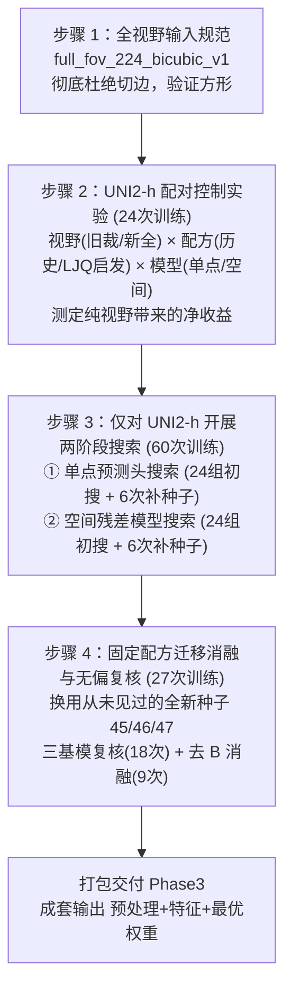

# Phase2 全视野修复与超参数重搜索：初学者通俗导读与学习指南

> 2026-09-19 时效标注：本导读保留建包前的教学叙述。对应代码已生成，实验已于9月18日接纳，独立模型交接包及首版资料已生成；“即将新建”等措辞不表示当前仍未实施。 当前状态查[机器源](../../project_state/current_state.json)，实验范围查[实验注册器](../../experiments/experiment_registry.json)。


> **文档定位**：面向科研初学者与项目成员的系统解读报告，旨在用深入浅出的通俗语言，透彻解析调整后的 [《部署与修复方案_20260916.md》](file:///D:/AI空间转录病理研究/PFMval_new/01_指南与解读/部署方案/Phase2全视野修复与超参数重搜索_部署与修复方案_20260916.md) 与 [《实施细则_20260916.md》](file:///D:/AI空间转录病理研究/PFMval_new/01_指南与解读/部署方案/Phase2全视野修复与超参数重搜索_实施细则_20260916.md)。
> **日期**：2026-09-16  
> **本轮重点调整**：根据最新决策，**仅对主选基模 UNI2-h 开展精细调优**，UNI 与 Virchow2 直接继承固定配方进行消融对比；首轮训练预算从原先的 237 次大幅收敛至 **111 次轻量头部训练**；深入剖析了任务 2 双真值标准与 ssGSEA 机制的本质差异；厘清了历史选模准则的真实演变脉络。

---

## 目录
- [一、背景速览：我们在做什么研究？](#一背景速览我们在做什么研究)
- [二、这份部署报告在解决什么问题？（核心痛点）](#二这份部署报告在解决什么问题核心痛点)
- [三、解决问题的依据是什么？（发现了哪些深层问题）](#三解决问题的依据是什么发现了哪些深层问题)
- [四、打算采取什么样的解决手段？开销如何？](#四打算采取什么样的解决手段开销如何)
- [五、用户（科研负责人）应重点审查把关的 4 个方面](#五用户科研负责人应重点审查把关的-4-个方面)
- [六、专业术语与形象比喻对照表（双向闭环映射）](#六专业术语与形象比喻对照表双向闭环映射)
- [七、最新决策总结与下一步行动](#七最新决策总结与下一步行动)

---

## 一、背景速览：我们在做什么研究？

为了看懂这两份技术文档，我们先用三句话梳理整个课题的底层逻辑：
1. **输入是什么**：患者食管癌手术切片在显微镜下拍摄的病理图像切块（称为 Patch，正方形小图）。
2. **阶段任务是什么（Phase2）**：训练一个 AI 模型，看着这些图像 Patch，精准预测对应点位上的 **30 条空间转录组生物通路的表达活性（打分值）**。
3. **最终目标是什么（Phase3）**：把 Phase2 预测出来的这 30 条生物通路活性特征送给下游临床模型，去预测晚期食管癌患者对免疫治疗/化疗到底能不能起效（临床疗效预测）。

---

## 二、这份部署报告在解决什么问题？（核心痛点）

在 2026 年 9 月中的代码复核与队友消融实验中，项目组发现了三大相互纠缠的历史遗留与混乱问题。这份方案的核心目的就是**“快刀斩乱麻，拨乱反正”**：

```
               【三大历史混乱与痛点】
  ┌───────────────────────┬───────────────────────┬───────────────────────┐
  │   1. 输入被偷偷切边   │   2. 队友实验变量污染 │   3. 基模缺乏适配配方 │
  │ (代码潜藏默认裁剪Bug) │ (超参/真值/选模齐变)  │ (沿用旧视野和默认超参)│
  └───────────┬───────────┴───────────┬───────────┴───────────┬───────────┘
              │                       │                       │
              └───────────────────────┼───────────────────────┘
                                      ▼
                        【最新部署方案的行动纲领】
           打造全新独立代码包 experiments/phase2_fullfov_hpo_v1
    ┌─────────────────────────────────────────────────────────────────┐
    │ ① 彻底修复图像视野：看全完整图像，消除隐性边缘切除 Bug          │
    │ ② 严格隔离实验变量：拆清性能到底来自视野、超参还是打分目标     │
    │ ③ 聚焦精调主基模 UNI2-h：111 次预算，其他基模固定配方迁移消融  │
    └─────────────────────────────────────────────────────────────────┘
```

1. **输入视野失真问题**：历史代码在加载病理图像时，触发了图像库的默认行为，把小方图硬生生切掉了一圈边缘（丢失了约 23.4% 的名义组织面积），导致模型一直在“管中窥豹”。
2. **实验变量严重污染**：队友 LJQ 在新实验（任务2）中跑出了外部测试集 PCC 0.5721 的较高成绩（历史基线为 0.5541），看似是“换了超参数立大功”，但深挖代码后发现，该实验**同时更换了打分真值标签、模型挑选标准和训练超参**。大家分不清这个高分到底是换考卷带来的，还是模型真的变聪明了。
3. **主基模需要最适配的成套配方**：团队明确以 UNI2-h 作为交付 Phase3 的主选基模。此前模型都是在旧裁剪视野、默认超参下运行，亟需在修好完整视野后，为 UNI2-h 寻找最适配的单点与空间残差结构，并将该配方固定迁移给其他基模做消融对照。

---

## 三、解决问题的依据是什么？（发现了哪些深层问题）

方案提出的每一个论断，都严格基于对真实源码、正式日志和原始预测的交叉核验，拒绝凭空揣测：

### 依据 1：代码确凿证实图像输入被偷偷切除了 23.44% 的面积
* **事实出处**：[《部署与修复方案_20260916.md》第 11、86–96 行](file:///D:/AI空间转录病理研究/PFMval_new/01_指南与解读/部署方案/Phase2全视野修复与超参数重搜索_部署与修复方案_20260916.md#L11)；[《实施细则_20260916.md》第 13 行](file:///D:/AI空间转录病理研究/PFMval_new/01_指南与解读/部署方案/Phase2全视野修复与超参数重搜索_实施细则_20260916.md#L13)。
* **底层机制剖析**：
  在原版 `uni2h/uni2h_utils.py` 本地加载逻辑中，调用图像变换工厂（`timm.data.create_transform`）时漏写了裁剪比例参数 `crop_pct`。系统默认执行了标准流水线：**“先把短边缩放到 256 像素，再从正中心裁剪出 224×224 像素”**。
  对于原本就是 224×224 的正方形病理图切块，名义保留的面积比例为：
  $$\left(\frac{224}{256}\right)^2 = \frac{50176}{65536} \approx 76.5625\%$$
  这意味着四周边缘有 **23.4375%（近四分之一）的几何面积未进入网络的名义视野**！对原图来说，模型实际上只看到了中心约 $196 \times 196$ 的局部区域。
* **潜在双重影响**：
  * **视野丢失**：可能丢掉了边缘间质、浸润淋巴细胞等重要上下文信息；
  * **伴生尺度拉伸**：中心 $196 \times 196$ 的内容被放大到 224×224，**导致输入网络里的细胞在视觉上被放大了约 1.143 倍**（物理分辨率 MPP 发生了隐性漂移）。

---

### 依据 2：LJQ 任务 2 的“超参数涨分”无法成立，实为“换考卷”导致的表象
* **事实出处**：[《部署与修复方案_20260916.md》第 11、21–68 行](file:///D:/AI空间转录病理研究/PFMval_new/01_指南与解读/部署方案/Phase2全视野修复与超参数重搜索_部署与修复方案_20260916.md#L21)；[《实施细则_20260916.md》第 37–45 行](file:///D:/AI空间转录病理研究/PFMval_new/01_指南与解读/部署方案/Phase2全视野修复与超参数重搜索_实施细则_20260916.md#L37)。
* **底层机制剖析**：
  LJQ 报告中虽然展现了外部 PCC 0.5721（历史 0.5541），但经代码与日志审计，证实其发生了三项重大变动：
  1. **打分目标彻底换了**：历史基线预测的是原始 30 条通路真值标签（`barcode-repair-v003`），而 LJQ 换成了“从 319 个真实基因表达量，利用 ssGSEA 算法重新合成重构的 30 通路”。经核实，两套真值在患者切片上的宏平均相关性仅约 **0.744（内部）与 0.752（外部）**！这就好比**期末考试被悄悄换了一套考卷，拿新卷子的得分去比旧卷子的基准，是不成立的**。
     * **交叉验证诊断**：如果把 LJQ 任务 2 直接臂预测的结果，强制拿到**原版 30 通路真值**上去打分，其宏平均 PCC 暴跌至 **0.433453（内部）/ 0.362761（外部）**！这清晰证明模型学到的是完全不同的另一套目标空间。
  2. **选模准则不同**：早期 MPP2 基线确实按内部验证 MSE 最小选模；9 月 7 日软连接升级方案及后来的 v2 代码改为宏平均 PCC 优先，9 月 8 日实际运行记录也如此。此前将后者统称“历史唯一标准”不够严密。LJQ 按 MSE 选中第 23 轮模型，但全量组实际跑完 50 轮，不能写成第 23 轮停训。
  3. **超参组合齐变**：优化器从 AdamW（lr=3e-4, batch=256）换成 Adam（lr=1e-4, batch=32, 无权重衰减），训练固定 14,800 更新。

#### 关键解惑：两套“真值漂移”到底是出现在哪个地方？是原始数据变了，还是模型预测变了？

这是科研初学者最容易感到困惑的核心问题。一句话给出明确结论：
> **核心事实：在模型还没开始训练、还没做任何预测之前，原始数据层面的“标准答案”（Ground Truth）就已经完全不一样了！**  
> 整个过程涉及“两层原始数据漂移”和“一层模型预测放大”，下面结合源码逐一拆解：

```
                              【三层真值与预测差异的发生位置】
┌─────────────────────────────────────────────────────────────────────────────────────────────┐
│ 【第一层：原始数据真值分歧】（发生于模型训练前，100%是原始数据问题）                       │
│  历史原版 30 通路 (barcode-repair-v003)  vs  LJQ 用真实 319 基因现场跑 ssGSEA 重构的 30 通路 │
│  👉 两套原始真值宏平均相关性仅 0.744（内部）/ 0.752（外部），绝对值相差数千倍！             │
└──────────────────────────────────────────────┬──────────────────────────────────────────────┘
                                               │
                                               ▼
┌─────────────────────────────────────────────────────────────────────────────────────────────┐
│ 【第二层：代码流程真值分歧】（发生于测试评估时，同样不经过模型预测）                         │
│  任务 2 直接臂保存的共同真值  vs  任务 2 基因臂因浮点/排序漂移重新导出的自身真值            │
│  👉 两份所谓的“真实真值”，在 32,340 个点位中有 31,437 个点数值不相等！                      │
└──────────────────────────────────────────────┬──────────────────────────────────────────────┘
                                               │
                                               ▼
┌─────────────────────────────────────────────────────────────────────────────────────────────┐
│ 【第三层：模型预测后的误差放大】（模型预测参与后的非线性失真）                               │
│  模型预测 319 个基因 ──(基因值微小误差)──> 排序位次颠倒 ──(ssGSEA阶梯算法)──> 通路分数暴跌   │
│  👉 基因臂预测重构出的通路 PCC 仅 0.4214 / 0.3040，远弱于直接预测通路的 0.6931 / 0.8084     │
└─────────────────────────────────────────────────────────────────────────────────────────────┘
```

##### 1. 第一层漂移：原始真值数据的不一致（模型完全未参与）
针对您的第一个疑问：“*哪怕对于训练集的原始数据，使用原始的 319 个基因通过 ssGSEA 聚合得到的 30 条通路，就已经和历史当前采用的 30 条通路不一样了吗？*”  
**答案是：千真万确！在模型一行代码都没跑之前，两套原始真值就已经彻底分道扬镳了！**
* **源码定位**：
  在 LJQ 的训练入口 [`src/main.py` 第 138–158 行](file:///D:/AI空间转录病理研究/PFMval_new/团队项目进度与结论/ljq/mpp2_task23_scratch_ablation_20260915/src/main.py#L138-L158) 中，任务 2 启动前调用了 [`src/pathway_reconstruction.py` 第 299–320 行](file:///D:/AI空间转录病理研究/PFMval_new/团队项目进度与结论/ljq/mpp2_task23_scratch_ablation_20260915/src/pathway_reconstruction.py#L299-L320) 的 `prepare_reconstructed_pathway_labels` 函数。该函数直接读取磁盘上真实患者点位的 319 基因原始表达矩阵，调用 `gseapy.ssgsea` 算法，在本地现场生成了一套崭新的 30 通路 CSV 标签文件。
* **纯真值对齐实测（零模型预测）**：
  在独立只读复算脚本 [`recompute_metrics.py` 第 141–160 行](file:///D:/AI空间转录病理研究/PFMval_new/work/ljq_metrics_review_20260916/recompute_metrics.py#L141-L160) 中，我们把“历史原版 30 通路标签（任务 3 全量组读取的真值）”与“LJQ 现场重构生成的 30 通路真值”按患者、点位、行号一对一对齐比对（见 [`recomputed_metrics.json` 第 345–350 行](file:///D:/AI空间转录病理研究/PFMval_new/work/ljq_metrics_review_20260916/recomputed_metrics.json#L345-L350)）：
  $$\text{内部验证集点位的两套原始真值宏平均相关性} = \mathbf{0.743795}$$
  $$\text{外部 XZY 点位的两套原始真值宏平均相关性} = \mathbf{0.751797}$$
  甚至两者的未标准化原始打分（`truth_raw`），点位绝对差异均值高达 **2582.28**（量纲完全不同）。
* **通俗结论**：**考卷从一开始就被替换了**。LJQ 模型学到的“高分”，是在这张相关性仅 0.74~0.75 的新考卷上的得分，绝不能拿来证明历史基模的超参数存在欠拟合。

##### 2. 第二层漂移：代码工程实现中的真值自相矛盾（模型依然未参与）
更隐蔽的是任务 2 内部直接臂与基因臂的真值分裂：
* **源码定位**：
  直接臂直接读取预先生成的标签（[`src/main.py` 第 158 行](file:///D:/AI空间转录病理研究/PFMval_new/团队项目进度与结论/ljq/mpp2_task23_scratch_ablation_20260915/src/main.py#L158)）；而基因臂在评估时，调用了 [`src/pathway_reconstruction.py` 第 198–221 行](file:///D:/AI空间转录病理研究/PFMval_new/团队项目进度与结论/ljq/mpp2_task23_scratch_ablation_20260915/src/pathway_reconstruction.py#L198-L221) 的 `reconstruct_prediction_table`。该函数把保存于预测表中的真实基因列反标准化后，**在内存中又跑了一遍 ssGSEA，生成了一套供基因臂自己使用的“真实真值”**。
* **分歧实证**（见 [`recomputed_metrics.json` 第 247–258 行](file:///D:/AI空间转录病理研究/PFMval_new/work/ljq_metrics_review_20260916/recomputed_metrics.json#L247-L258)）：
  由于单精度 32 位浮点转换、CSV 导出截断以及排序并列时的微小扰动，这两份理论上应该相同的“真实真值”，在内部验证集的 32,340 个数据点中，居然有 **31,437 个点不相等**！
  * 原始批次中基因臂用自己的漂移真值打分：内部宏平均 PCC 为 0.4401；
  * 一旦改用直接臂的共同真值进行对齐纠偏（预测结果纹丝不动）：内部宏平均 PCC 立即降至 **0.4214**（完全吻合 Word 报告呈现的数值）。

##### 3. 第三层差异：模型预测参与后的非线性误差放大
针对您的第二个疑问：“*还是说，是通过模型预测后的聚合效果不太一样？*”  
**答案是：模型预测参与后，由于 ssGSEA 算法的特殊性质，进一步发生了严重的非线性误差放大！**
* **模型输入与输出的铁律**：
  * **输入**：病理图像 Patch 提取出的特征向量；
  * **监督目标**：319 维真实基因表达值（仅作为 Loss 计算的 Target，**绝不是模型的输入**）；
  * **输出**：模型根据病理图预测出 319 个基因的表达量。
* **为什么模型预测后重构成通路会大跌？（ssGSEA 的排序放大效应）**：
  ssGSEA 并不是把基因表达值求和或加权平均，而是**在单个点位内，把 319 个基因按表达量从高到低强制排成一个榜单**，再看通路成员基因是否富集在榜首。
  AI 模型预测 319 个基因时，哪怕每个基因只有极其微小的连续数值误差，但在**离散排序**时，整个名次顺序就会被打乱！一旦榜单前列的几个关键基因位次发生颠倒，ssGSEA 阶梯累加算法算出来的通路富集分就会发生剧烈跳变。
* **实测对比**：
  * **直接预测通路（直接臂）**：模型直接端到端学习图像到 30 通路的映射，内部宏平均 PCC 高达 **0.6931**（整体展平 PCC 0.8084）；
  * **先预测基因再重构（基因臂）**：经过预测误差在排序阶段的剧烈放大，内部宏平均 PCC 暴跌至 **0.4214**（整体展平 PCC 暴跌至 **0.3040**）。

##### 4. 彻底破案需要向原作者核对的 5 项材料
为什么原版 `barcode-repair-v003` 30 通路和 LJQ 重新跑 ssGSEA 算出来的 30 通路会有 0.75 的鸿沟？
部署报告明确指出，后续应向原标签构建队员索取：
1. **原始打分代码与脚本**；
2. **原始全量表达矩阵及具体基因列表**；
3. **30 条通路的成员基因集合（Gene Sets）**；
4. **所使用的 ssGSEA 工具包、软件版本和确切运行参数**；
5. **预处理步骤与排序时采用的背景基因范围（Gene Universe）**。
在拿到这些原始凭据前，我们必须恪守实证边界：确认两套真值数值不同、不可混用，但不在缺乏依据的情况下猜测谁对谁错。

---

#### 关键实证：任务 3 全量组同目标复算，证实毫无超额调参增益
更有力的实证来自 LJQ 的**任务 3 全量组**，因为它恰恰使用了**原版 30 通路真值**。项目组对其预测结果进行了严格对齐复算：

| 评估指标 | 历史空间模型（3种子均值±标准差） | LJQ 任务 3 全量组（种子 42） | 实际净差异 |
|:---|:---:|:---:|:---:|
| **内部宏平均 PCC** | **0.666275 ± 0.000709** | **0.666247** | **−0.000028** |
| **外部宏平均 PCC (XZY)** | **0.558001 ± 0.005062** | **0.557396** | **−0.000606** |

**结论**：在完全相同的原目标下，新配方的成绩**完全落在历史随机波动范围之内**，没有任何证据表明这套超参数带来了性能突破。

---

### 依据 3：澄清选模历史与三大基模对比现状
* **事实出处**：[《部署与修复方案_20260916.md》第 19、51–60 行](file:///D:/AI空间转录病理研究/PFMval_new/01_指南与解读/部署方案/Phase2全视野修复与超参数重搜索_部署与修复方案_20260916.md#L19)。
* **历史选模演变澄清**：
  * 最早期的单点 MPP2 基线（`train_mpp_uni2h_mlp.py`）确实采用过 MSE 最小选模；
  * 但从 2026-09-07 的软连接 v2 方案起，空间模型正式写入了“内部宏平均 PCC 优先”选模规则。新方案保留 PCC 选模作为待审查设定，不擅自切回 MSE。
* **基模消融现状**：
  历史在种子 42/43/44 下对比三大模型（Virchow2 单点宏平均 PCC 0.658，UNI2-h 为 0.653，UNI 为 0.636），但那是在旧裁剪视野与单一默认配方下跑的。新方案调整为：**以 UNI2-h 为主选基模进行调优，调优完成后将最佳配方固定套给其他两款基模做消融**，明确回答“在该配方下换编码器会发生什么”。

---

## 四、打算采取什么样的解决手段？开销如何？

方案规划在 `experiments/phase2_fullfov_hpo_v1/` 目录下新建独立代码包，采用**“四步梯次推进”**策略：



### 1. 解决手段详解

#### 手段 1：制定严谨的全视野预处理新协议
* **新协议代号**：`full_fov_224_bicubic_v1`（[《部署与修复方案_20260916.md》第 91–96 行](file:///D:/AI空间转录病理研究/PFMval_new/01_指南与解读/部署方案/Phase2全视野修复与超参数重搜索_部署与修复方案_20260916.md#L91)）。
* **处理流水线**：
  $$\text{RGB图像} \longrightarrow \text{正方形校验} \longrightarrow \text{Resize}((224,224), \text{双三次插值}) \longrightarrow \text{转张量} \longrightarrow \text{ImageNet标准化}$$
* **双三次插值（Bicubic Interpolation）通俗释义**：
  图像缩放时，新像素落不到原像素的整格点上。双三次插值通过利用周围 16 个像素点进行三次多项式加权，平滑估算出新颜色，避免产生生硬的马赛克方块。方案保留既有插值方法，是为了实现纯粹的控制变量。
* **安全防线**：方形图像原样等比缩入 224；若遇到非正方形图像，代码**直接抛出异常中断**，严禁静默拉伸或粗暴裁切。

#### 手段 2：配对控制变量实验（24 次训练）
* **训练设计**：[《实施细则_20260916.md》第 27–31 行](file:///D:/AI空间转录病理研究/PFMval_new/01_指南与解读/部署方案/Phase2全视野修复与超参数重搜索_实施细则_20260916.md#L27)。
* 采用同一个新代码包，使用 UNI2-h 模型进行严密的控制变量配对：
  $$2(\text{视野：旧裁剪/新全视野}) \times 2(\text{模型：单点/空间}) \times 2(\text{配方：历史/LJQ启发}) \times 3(\text{种子：42/43/44}) = 24 \text{次头部训练}$$
* 先测出视野修复本身的净贡献，以及两套配方在新旧视野下的真实交互表现。

#### 手段 3：仅对主选基模 UNI2-h 开展两阶段贝叶斯搜索（60 次训练）
* **训练设计**：[《实施细则_20260916.md》第 69–73 行](file:///D:/AI空间转录病理研究/PFMval_new/01_指南与解读/部署方案/Phase2全视野修复与超参数重搜索_实施细则_20260916.md#L69)。
* **单点搜索（30 次）**：初搜 24 组配置（涵盖学习率、批大小、隐藏维数、失活率等），前 3 名补种子 43/44（共 30 次）；
* **空间搜索（30 次）**：初搜 24 组空间残差参数（图半径、邻居上限、距离衰减 $\sigma$、形态温度、残差项 $B$ 学习率倍数等），前 3 名补种子 43/44（共 30 次）。其中 18 组继承单点前三名，6 组做联合微调。
* **砍掉冗余**：UNI 与 Virchow2 不再各做 60 次独立搜索，直接节约 120 次训练开销！

#### 手段 4：锁定配置，全新独立种子复测与固定配方消融（27 次训练）
* **训练设计**：[《实施细则_20260916.md》第 87–93 行](file:///D:/AI空间转录病理研究/PFMval_new/01_指南与解读/部署方案/Phase2全视野修复与超参数重搜索_实施细则_20260916.md#L87)。
* 最优超参数一旦选定，**立即锁死，严禁反选**。
* 换用**从未参与过选模与调参的全新随机种子 45、46、47** 进行独立复验：
  * **三基模复核（18 次）**：UNI2-h、UNI、Virchow2 各自运行单点与空间模型（UNI 和 Virchow2 沿用 UNI2-h 的最优配方，仅调整输入维度重训）；
  * **去 B 消融（9 次）**：三基模在最优空间配方下，强行将空间残差项 $B$ 置零，严格测量空间图残差带来的真实净增益。

---

### 2. 算力与资源开销如何？

方案精简后的总训练预算为 **111 次轻量头部训练**（[《部署与修复方案_20260916.md》第 169–176 行](file:///D:/AI空间转录病理研究/PFMval_new/01_指南与解读/部署方案/Phase2全视野修复与超参数重搜索_部署与修复方案_20260916.md#L169)）：

| 实验阶段与任务 | 头部训练次数 | 算力与工程性质说明 |
|:---|---:|:---|
| **1. UNI2-h 视野与配方配对** | 24 | 验证输入视野与两套配方的净差异 |
| **2. UNI2-h 单点搜索 (24+6)** | 30 | 贝叶斯搜索单点最优超参并补种子 |
| **3. UNI2-h 空间搜索 (24+6)** | 30 | 搜索图结构与空间残差参数并补种子 |
| **4. 冻结后新种子复核 (3基模×2模型×3种子)** | 18 | 种子 45/46/47 独立泛化性验证 |
| **5. 冻结后去 B 对照 (3基模×3种子)** | 9 | 拔除空间项 $B$，测纯拓扑净增益 |
| **首轮预算总计** | **111 次** | **比旧版 237 次方案大幅削减 53% 的训练量！** |

#### 初学者必读：为什么 111 次训练开销完全可承受？
* **病理预训练大模型全程冻结（Freeze）**：数十亿参数的 UNI2-h、Virchow2 只做一次前向特征提取并持久化在服务器磁盘中（开发集仅 10,550 点，外部仅 1,039 点）。
* **被训练的仅是轻量预测头**：单点模型只是几层全连接 MLP，空间模型也只是单跳加权线性图残差。在单张 RTX 4080 GPU 上，一个轻量头部的单次训练耗时极短（LJQ 任务 3 完整 14,800 更新仅耗时约 125 秒），**111 次训练在工程上极其轻便快捷**。

---

## 五、用户（科研负责人）应重点审查把关的 4 个方面

作为项目的决策把关人，最新的方案已根据您的偏好收敛了架构，请重点核对以下 4 个关键事实与设计原则：

```
                    【四大核心审查与决策点】
  ┌───────────────────────┬───────────────────────┬───────────────────────┬───────────────────────┐
  │ 审查 1：打分考卷抉择  │ 审查 2：组织尺度效应  │ 审查 3：选模标准口径  │ 审查 4：单基模精调策略│
  │ 原版30通路 vs 重构真值│ 视野扩大 vs 细胞变小  │ PCC优先 vs MSE优先    │ 精调UNI2-h，余下做消融│
  └───────────────────────┴───────────────────────┴───────────────────────┴───────────────────────┘
```

### 审查 1：监督目标的选择 —— 坚持原版 30 通路 vs 采纳 LJQ 重构真值
* **冲突事实**：LJQ 任务 2 换用了 319 基因 ssGSEA 重构真值，两套真值相关性仅约 0.75；而本方案坚持把 `barcode-repair-v003` 的原版 30 通路作为主搜索目标（[《部署与修复方案_20260916.md》第 11、128 行](file:///D:/AI空间转录病理研究/PFMval_new/01_指南与解读/部署方案/Phase2全视野修复与超参数重搜索_部署与修复方案_20260916.md#L128)）。
* **潜在风险**：坚持原版 30 通路能保证与历史所有成果可比；但也意味着我们**不能指望直接复现 LJQ 报告中的 0.5721 高分**（因为那是另一张考卷的分数）。
* **把关建议**：**坚决支持方案设定**。科研中最忌讳随意更换评估真值，原版 30 通路是与 Phase3 临床指标一脉相承的标准金标准。

---

### 审查 2：视野修复带来的组织尺度伴生变化 —— 视野变大 vs 细胞视在缩小
* **物理机制**：[《部署与修复方案_20260916.md》第 90、100–111 行](file:///D:/AI空间转录病理研究/PFMval_new/01_指南与解读/部署方案/Phase2全视野修复与超参数重搜索_部署与修复方案_20260916.md#L100)深入分析道，从“裁切中心 196”改为“全幅 224 等比缩小”，不仅是多看了周边 23.4% 的边缘组织，**输入网络中的细胞在视觉线性尺寸上相对旧流程缩小了约 12.5%**。
* **潜在风险**：病理大模型对物理尺度敏感，如果后续模型性能有变化，我们**无法单独将功劳归为“边缘组织提供了信息”，其中也包含“细胞视在缩小”的影响**。
* **把关建议**：**批准全视野协议（`full_fov_224_bicubic_v1`）**。这是最符合图像学标准的修复方式，彻底扫清了隐性 bug；后续论文如实表述为“综合净效应”即可。

---

### 审查 3：区分历史选模事实与今后的选模标准 —— PCC 优先 vs MSE 优先
* **评判事实**：早期单点基线用 MSE 选模；9 月 7 日软连接 v2 改为“宏平均 PCC 优先，同分比 zMSE”选模（[《部署与修复方案_20260916.md》第 19 行](file:///D:/AI空间转录病理研究/PFMval_new/01_指南与解读/部署方案/Phase2全视野修复与超参数重搜索_部署与修复方案_20260916.md#L19)）。新方案暂保留 PCC 选模。
* **机制差异**：
  * **MSE 优先**：追求绝对数值逼近，容易倾向预测全图平缓的“均值”，往往很早就停止学习；
  * **PCC 优先**：追求空间起伏趋势的一致性，更契合空间转录组对微环境异质性（空间梯度）的刻画需求。
* **把关建议**：**维持现行“PCC 优先”选模**。下游 Phase3 预测疗效依赖的是通路间的相对变化模式，PCC 选模更具生物学意义。

---

### 审查 4：聚焦主基模的单线精调策略 —— 仅精调 UNI2-h 是否满足科研诉求
* **设计变更**：[《部署与修复方案_20260916.md》第 141–149 行](file:///D:/AI空间转录病理研究/PFMval_new/01_指南与解读/部署方案/Phase2全视野修复与超参数重搜索_部署与修复方案_20260916.md#L141)明确采纳了收窄范围的策略：只对 UNI2-h 搜索 60 次，将最佳配方直接固定迁移给 UNI 和 Virchow2 跑消融。
* **科学主张边界**：
  * **节约成本**：从 237 次压到 111 次，极大加速了迭代进度；
  * **结论范围**：我们回答的是**“在本项目选定的 UNI2-h 最优配方下，换用其他编码器会怎样”**，而**不再声称“三个编码器各自穷尽调优后的全局排名”**。
* **把关建议**：**全力支持本轮收敛**。UNI2-h 是团队既定交付 Phase3 的绝对主力，把有限的算力花在打磨主力模型上，兼顾工程落地与消融论证，是极具性价比的务实策略。

---

## 六、专业术语与形象比喻对照表（双向闭环映射）

| 序号 | 生活形象比喻 | 对应专业术语与代码概念 | 实际技术机制与边界说明 |
|:---:|:---|:---|:---|
| **1** | **被偷裁了一圈的“小相框”** | **中心裁剪失真** (`CenterCrop(224)`) | 旧预处理代码因缺省配置触发的 256 缩放与 224 中心截取，导致 23.4% 几何面积丢失。 |
| **2** | **显微镜焦距拉远** | **视在分辨率漂移** (MPP Shift) | 恢复全幅 224 后，细胞视觉尺寸相对旧流程缩小约 12.5%，产生伴生的尺度变化。 |
| **3** | **考试被悄悄换了考卷** | **监督标签空间变更** (Label Shift) | LJQ 实验将原版 30 通路换为 319 基因重构分数，两套真值相关性仅约 0.75，分数不可横向比较。 |
| **4** | **精调主力战车，僚机直接套用** | **主基模调优 + 固定配方消融** | 集中算力精调 UNI2-h，其他两款编码器（UNI、Virchow2）直接套用该配方做迁移消融。 |
| **5** | **看相对排名还是看绝对误差** | **PCC 选模 vs MSE 选模** | Checkpoint 保存准则：PCC 关注空间起伏与相对共表达，MSE 关注点位绝对数值差。 |
| **6** | **拔掉辅助轮测真实功夫** | **空间残差消融** (Ablation with $B=0$) | 在锁定最佳空间参数后，强行将空间残差矩阵 $B$ 置零，精准测算拓扑图带来的净收益。 |
| **7** | **换全新考官进行盲测** | **独立新随机种子复核** (Unseen Seeds 45-47) | 调参仅用种子 42/43/44；参数锁死后用新种子测试，检验对特定随机流是否存在过拟合。 |
| **8** | **大厨站着不动，只换调料碟** | **冻结基模特征微调** (Frozen Feature Tuning) | 数十亿参数的病理大模型仅前向提取一次特征存盘，后续调优只训练最后几层轻量网络。 |

---

## 七、最新决策总结与下一步行动

* **核心定性**：调整后的方案更加**求真务实、重点突出**。它不仅在技术上完全清除了历史切边缺陷，更在工程上果断舍弃了无谓的算力浪费，将资源聚焦于主选基模 UNI2-h。
* **下一步操作指引**：在您审阅并批准本指南所阐述的 4 项重点审查原则后，智能体将开始新建代码包 `experiments/phase2_fullfov_hpo_v1/`，正式落地执行首轮 111 次轻量调优流程。
