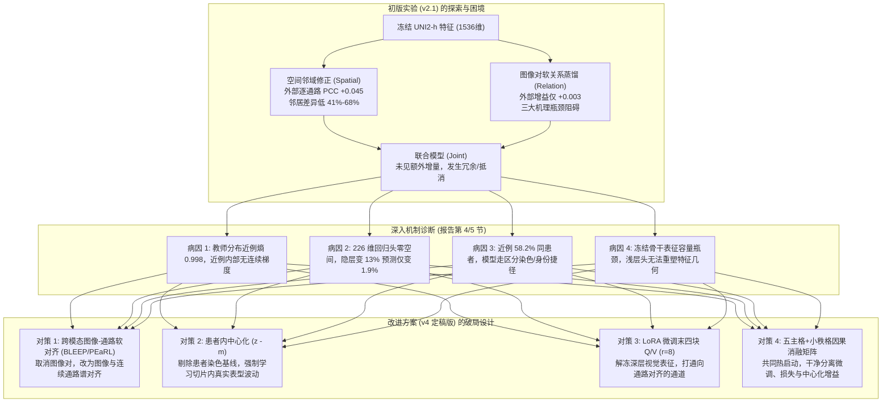
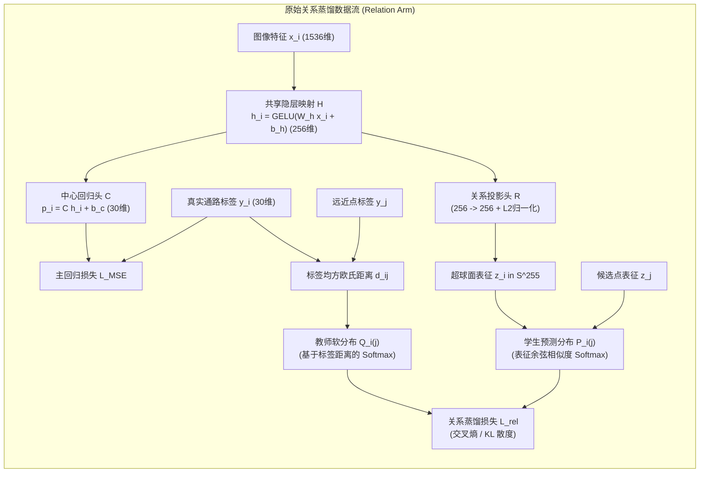
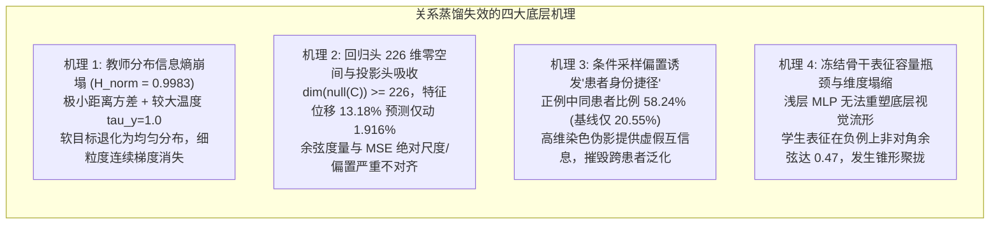
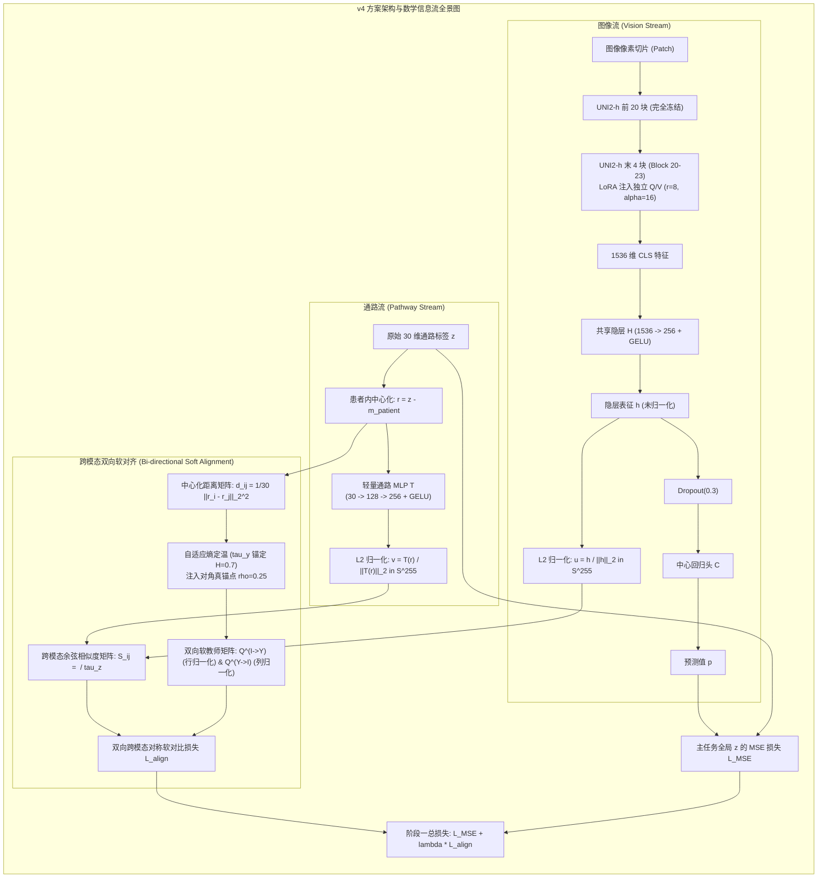
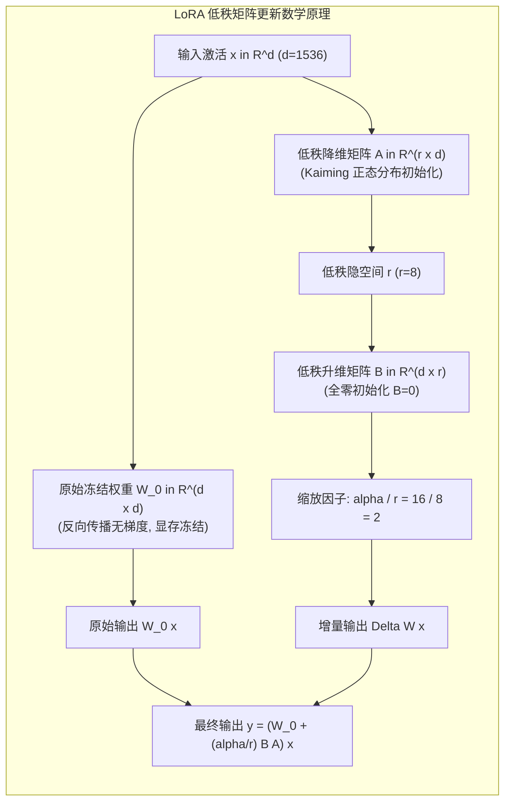
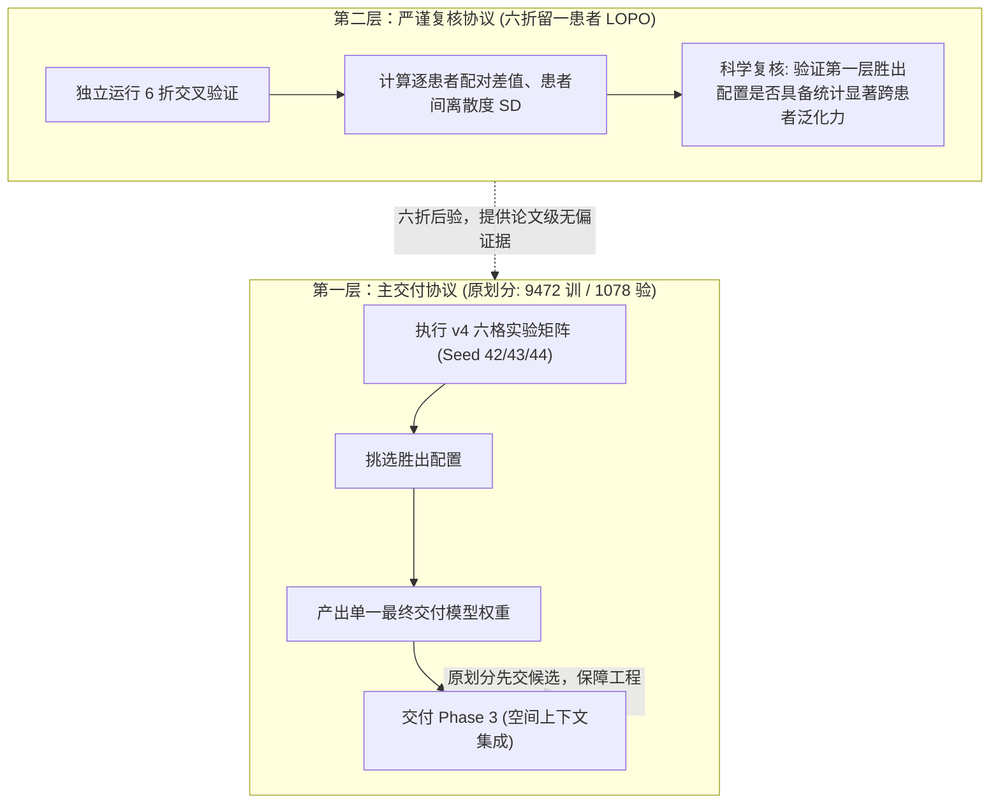

# Phase2 软连接：从初版困境到 v4 对比学习改进（进阶学习指南）

> **文档定位**：本指南紧密关联 [Phase2 软连接 v2.1 实验结果与机制分析报告](file:///D:/AI空间转录病理研究/PFMval_new/01_指南与解读/分析报告/Phase2软连接v2_1_实验结果与机制分析_20260908.md) 与 [Phase2 软连接对比学习改进实验方案 v4 最终建议版](file:///D:/AI空间转录病理研究/PFMval_new/01_指南与解读/部署方案/Phase2软连接_对比学习改进实验方案_v4_最终建议版_20260908.md)。旨在帮助研究人员与初学者清晰梳理：**初版实验测出了什么事实？遭遇了哪些隐蔽的技术与机制瓶颈？新定稿的 v4 方案究竟在尝试解决什么问题？又是按照怎样的逻辑链条完成因果闭环与实验设计的？**

---

## 目录

- [导言：空间转录组预测的“两座大山”与演进脉络](#导言空间转录组预测的两座大山与演进脉络)
- [第一篇：初版实验（v2.1）全景复盘——收获了什么？](#第一篇初版实验v21全景复盘收获了什么)
  - [1.1 初版对比学习（Relation 臂）的原始设计与数学原理](#11-初版对比学习relation-臂的原始设计与数学原理)
  - [1.2 四臂消融实验的完整结构对照](#12-四臂消融实验的完整结构对照)
  - [1.3 三大基本实证事实（数据结论）](#13-三大基本实证事实数据结论)
  - [1.4 评估尺度的必修课：两种 PCC 怎么读？](#14-评估尺度的必修课两种-pcc-怎么读)
  - [1.5 空间分支有效性的证据链](#15-空间分支有效性的证据链)
- [第二篇：初版实验（v2.1）深度剖析——遇到了什么问题？](#第二篇初版实验v21深度剖析遇到了什么问题)
  - [2.1 关系蒸馏模块为何“名存实亡”？——四大机理障碍的数学与实证实证](#21-关系蒸馏模块为何名存实亡四大机理障碍的数学与实证实证)
  - [2.2 空间分支暴露的暗礁与反面事实](#22-空间分支暴露的暗礁与反面事实)
  - [2.3 评估划分的局限：度数截断与空间自相关](#23-评估划分的局限度数截断与空间自相关)
- [第三篇：v4 改进方案的核心蜕变——在解决原来的什么问题？](#第三篇v4-改进方案的核心蜕变在解决原来的什么问题)
  - [3.1 对比学习的三大结构性重构与数学原理](#31-对比学习的三大结构性重构与数学原理)
  - [3.2 骨干微调（PEFT / LoRA）的数学机理与注意力重塑](#32-骨干微调peft--lora的数学机理与注意力重塑)
  - [3.3 两阶段训练（LP-FT）的理论与工程逻辑](#33-两阶段训练lp-ft的理论与工程逻辑)
  - [3.4 v4 改进方案专业术语与答辩汇报对照表](#34-v4-改进方案专业术语与答辩汇报对照表)
- [第四篇：v4 实验设计的逻辑框架——如何实现干净的因果归因？](#第四篇v4-实验设计的逻辑框架如何实现干净的因果归因)
  - [4.1 “五主格 + 一个容量诊断格”的因果减法矩阵](#41-五主格--一个容量诊断格的因果减法矩阵)
  - [4.2 为什么必须引入“微调全局对比”第五格？](#42-为什么必须引入微调全局对比第五格)
  - [4.3 学习率试点与位移监控：警惕“假性阴性”](#43-学习率试点与位移监控警惕假性阴性)
  - [4.4 收益到底进了骨干还是留在浅层？（重置 H 检查）](#44-收益到底进了骨干还是留在浅层重置-h-检查)
- [第五篇：双层验证协议与工程交付哲学](#第五篇双层验证协议与工程交付哲学)
  - [5.1 交叉验证选的是“决定”，不是“模型”](#51-交叉验证选的是决定不是模型)
  - [5.2 为什么“原划分先交，六折后验”兼顾了效率与严谨？](#52-为什么原划分先交六折后验兼顾了效率与严谨)
- [第六篇：核心概念速查与常见困惑 Q&A](#第六篇核心概念速查与常见困惑-qa)

---

## 导言：空间转录组预测的“两座大山”与演进脉络

在数字病理与空间转录组（Spatial Transcriptomics, ST）交叉研究中，我们的核心任务是：**输入一张高分辨率 H&E 染色病理图像切片及其空间点位（Spot），精准预测该点位上 30 条核心生物通路的连续表达活性（以 ssGSEA 打分的标准化 z-score 衡量）。**

在这个任务中，模型必须翻越“两座大山”：
1. **微环境上下文壁垒**：单个测序点的图像视野仅包含少量细胞，容易受到切片噪声、染色差异或细胞切面局部伪影的干扰。单独依赖单点图像极难准确判断组织功能状态，必须利用**空间邻域上下文（物理微环境）**。
2. **表型抽象与跨患者域迁移壁垒**：病理大模型（如 UNI2-h）提取的 1536 维视觉特征虽然蕴含通用视觉模式，但这些特征是自监督学习训练的，并不直接与癌症信号通路的连续活性对齐。不同患者切片之间存在巨大的染色色差、扫描仪批次效应和个体生物学异质性。

为了解决这两座大山，项目在 **Phase2 软连接** 阶段提出了引入“局部物理空间邻域修正”与“基于表型相似度的辅助关系蒸馏/对比学习”的构想。
- **初版实验（v2.1）**：在冻结 UNI2-h 特征的基础上，设计了四臂消融实验。结果发现**空间分支表现惊艳，但关系分支几乎无效**。
- **新版方案（v4）**：在对 v2.1 进行极度严苛的机制病因排查后，重构了对比学习目标，引入了 LoRA 编码器微调，并制定了缜密的因果消融与验证交付闭环。



---

## 第一篇：初版实验（v2.1）全景复盘——收获了什么？

### 1.1 初版对比学习（Relation 臂）的原始设计与数学原理

在初版 v2.1 实验中，对比学习模块以**关系蒸馏（Relation Distillation）**的形式作为辅助任务嵌入网络。其核心假设是：**如果两个病理切片点位在 30 维生物通路表达谱上高度相似，那么它们在特征隐空间中的表征距离也应当彼此靠拢；反之，若表达谱差异巨大，表征距离应当被推远。**

#### 1.1.1 严格数学定义与数据流

设当前训练批次大小为 $B$，每个测序点 $i$ 包含冻结的 UNI2-h 视觉特征 $x_i \in \mathbb{R}^{1536}$ 和真实通路活性标签 $y_i \in \mathbb{R}^{30}$（经过全局 $z$-score 标准化）。



1. **共享隐层与关系投影**：
   - 图像首先通过共享隐层：$h_i = \operatorname{GELU}(W_h x_i + b_h) \in \mathbb{R}^{256}$；
   - 关系分支通过独立的线性投影头 $R \in \mathbb{R}^{256 \times 256}$ 映射，并强制施加 $L_2$ 范数归一化，将表征约束在单位超球面 $\mathbb{S}^{255}$ 上：

$$
z_i = \frac{R h_i + b_r}{\|R h_i + b_r\|_2} \in \mathbb{S}^{255}
$$

2. **标签空间的真实生物距离度量**：
   - 任意两点 $i, j$ 之间的真实生物学表型差异，定义为 30 条通路标准化得分的均方误差（MSE）：

$$
d_{ij} = \frac{1}{30} \|y_i - y_j\|_2^2 = \frac{1}{30} \sum_{k=1}^{30} (y_{i,k} - y_{j,k})^2
$$

3. **支持集划分与硬阈值截断（Support Set Truncation）**：
   - 在训练集上离线抽取 200,000 个样本对，测算标签距离的经验分位数，确定近例阈值 $q_{10} = 0.7502$ 与远例阈值 $q_{50} = 1.8125$；
   - 在批次内为中心点 $i$ 构建两级候选集合：
     - **正例（近例）候选集** $\mathcal{P}_i = \{ j \mid j \ne i, d_{ij} \le q_{10} \}$，按距离升序截断保留最多 $K_{\text{pos}} = 8$ 个；
     - **负例（远例）候选集** $\mathcal{N}_i = \{ j \mid d_{ij} \ge q_{50} \}$，随机下采样保留最多 $K_{\text{neg}} = 32$ 个；
     - 处于过渡缓冲带 $d_{ij} \in (q_{10}, q_{50})$ 的样本被硬性丢弃。总候选支持集记为 $\mathcal{S}_i = \mathcal{P}_i \cup \mathcal{N}_i$。

4. **教师监督目标分布 $Q$（Teacher Target Distribution）**：
   - 教师只在近例集合 $\mathcal{P}_i$ 内部赋予基于距离的连续相对概率权重，远例直接赋 0：

$$
Q_i(j) = \begin{cases} \dfrac{\exp(-d_{ij} / \tau_y)}{\sum_{k \in \mathcal{P}_i} \exp(-d_{ik} / \tau_y)}, & j \in \mathcal{P}_i \\ 0, & j \in \mathcal{N}_i \end{cases}
$$

   - 其中 $\tau_y$ 为教师温度超参数，初版固定设为 $\tau_y = 1.0$。

5. **学生模型预测分布 $P$（Student Feature Distribution）**：
   - 学生模型通过余弦相似度（由于 $\|z\|=1$，即点积 $\langle z_i, z_j \rangle$）并经过学生温度 $\tau_z = 0.1$ 缩放，在**全部支持集 $\mathcal{S}_i$（含近例与远例）**上计算 Softmax：

$$
P_i(j) = \frac{\exp(\langle z_i, z_j \rangle / \tau_z)}{\sum_{k \in \mathcal{S}_i} \exp(\langle z_i, z_k \rangle / \tau_z)}
$$

6. **蒸馏损失函数与多任务总目标**：
   - 关系损失采用离散交叉熵（等价于最小化教师与学生分布的 KL 散度）：

$$
\mathcal{L}_{\text{rel}} = - \frac{1}{B} \sum_{i=1}^B \sum_{j \in \mathcal{P}_i} Q_i(j) \log P_i(j)
$$

   - 网络总损失为回归均方误差与关系损失的加权和：

$$
\mathcal{L}_{\text{total}} = \frac{1}{B} \sum_{i=1}^B \frac{1}{30} \|p_i - y_i\|_2^2 + \lambda \mathcal{L}_{\text{rel}}
$$

     权重 $\lambda$ 采用预热调度：第 1–5 轮为 0，第 6–15 轮线性升至 0.05，之后保持恒定。

---

#### 1.1.2 形象生活类比：画像师的“声音–容貌”匹配特训

> **通俗类比**：
> 假设你正在训练一位天才**画像师（深度神经网络）**。
> - **主任务（MSE 回归）**：给画像师一张嫌疑人的面部监控截图（病理切片图像），画像师必须在画板上精确画出嫌疑人的 30 处精确身体测量指标（身高、体脂、臂长等 30 维通路连续得分）。
> - **原始关系蒸馏（Relation 对比）**：教练（教师模型）手里有一份客观的体检档案。教练告诉画像师：“在这一批 256 个人里，A 和 B、C 的体型最接近（近例，标签距离 $d \le q_{10}$），而和 X、Y、Z 的体型差别十万八千里（远例，标签距离 $d \ge q_{50}$）。你在脑海中提取嫌疑人视觉特征时，必须把 A、B、C 归为同一个‘体型圈子’（超球面上余弦靠拢），同时把 X、Y、Z 踢得远远的（余弦推开）！”
> - **为什么推理时不需要关系头？**：因为画像师脑海中的空间表征在特训中已经受到了“体型几何先验”的雕刻；在实际办案（测试集推理）时，画像师只需要用右手直接画出 30 维指标即可，不需要现场再做一次对比。

---

#### 1.1.3 专业术语与数学映射表（掌握学术语言体系）

为了帮助您在向同行、导师或审稿人汇报时自如切换专业学术语言，以下是概念、直觉与专业术语的严密映射：

| 日常直觉 / 通俗描述 | 真实数学对象与符号 | 计算机视觉 / 深度学习专业术语 | 严谨学术汇报话术示例 |
| :--- | :--- | :--- | :--- |
| **体型圈子 / 相似图像聚拢** | 单位超球面上的内积 $\langle z_i, z_j \rangle$ | **流形度量学习（Metric Learning）/ 超球面嵌入（Hyperspherical Embedding）** | “我们在共享隐层上外挂了一个投影头，通过超球面度量学习约束特征流形的局部几何结构。” |
| **教练给出的体检打分表** | $Q_i(j) = \frac{\exp(-d_{ij}/\tau_y)}{\sum \exp(-d_{ik}/\tau_y)}$ | **基于连续标签先验的软教师目标分布（Soft Target Teacher Distribution）** | “教师分布利用 30 维连续通路表达谱的均方欧氏距离，构建了具有非刚性概率权重的软目标。” |
| **把远的踢开、挑出极近的** | $d_{ij} \le q_{10}$ 与 $d_{ij} \ge q_{50}$ 截断 | **分位数截断硬负例/正例挖掘（Quantile-based Mining & Truncation）** | “为了规避弱监督噪声，我们依据经验距离分布的 10% 与 50% 分位数对批次内支持集进行了非对称截断。” |
| **温度超参数 $\tau_y, \tau_z$** | $\exp(\cdot / \tau)$ 中的分母缩放因子 | **分布平滑度控制因子 / 熵调节标量（Temperature Hyperparameter）** | “温度超参控制了 Softmax 概率分布的峰锐程度（Peakiness）与信息熵，决定了梯度向困难样本的聚焦程度。” |
| **画画和找圈子一起学** | $\mathcal{L}_{\text{total}} = \mathcal{L}_{\text{MSE}} + \lambda \mathcal{L}_{\text{rel}}$ | **多任务正则化框架（Multi-task Regularization Framework）** | “关系蒸馏作为辅助正则化项与主回归任务联合优化，以归纳偏置的形式引导特征空间的解缠。” |

---

### 1.2 四臂消融实验的完整结构对照

初版实验严格遵循控制变量原则，在相同的输入数据划分、逐种子初始化（Seed 42, 43, 44）以及冻结的 UNI2-h 特征下，构建了四个对照臂：

1. **单点基线（Point）**：冻结 1536 维特征 $\to$ 共享隐藏层 $H$（1536 $\to$ 256 + GELU）$\to$ 中心回归头 $C$（256 $\to$ 30）$\to$ MSE 回归损失。
2. **关系蒸馏（Relation）**：在 Point 基础上引入上述 1.1 节的关系辅助损失（推理时丢弃关系头）。
3. **空间邻域（Spatial）**：在 Point 基础上，利用病理原生物理坐标（1.5 倍步长阈值，最多 8 邻居）与冻结特征相似度构建无标签空间图。中心点聚合邻居特征差：$u_i = \sum_j a_{ij}(h_j - h_i)$，再经零初始化的线性矩阵 $B$ 输出残差修正量 $\delta_i$，最终预测为 $\hat{y}_i = p_i + \delta_i$。
4. **联合模型（Joint）**：同时包含可学习空间分支修正量 $\delta$ 与辅助关系蒸馏损失。

---

### 1.3 三大基本实证事实（数据结论）

实验在 6 例内部患者（9472 个训练点，1078 个内部验证点）和 1 例完全独立的外部测试患者 XZY（1039 个点）上运行，测得了三项铁打的客观事实：

```
+---------------------------------------------------------------------------------------+
|                               初版实验三大核心事实                                     |
|                                                                                       |
|  1. 空间模块带来巨大且稳健的泛化收益 (Spatial >> Point)                                |
|     - 外部测试集逐通路平均 PCC 从 0.5131 大幅跃升至 0.5580 (+0.0449)                  |
|     - 外部测试集 30 条通路中有 28 条改善，26 条在 3 个种子上一致改善                    |
|     - 外部归一化误差 zRMSE 下降 4.18%，原始绝对误差 rawMAE 下降 4.61%                  |
|                                                                                       |
|  2. 关系模块单独带来的收益极其微弱 (Relation ≈ Point)                                 |
|     - 内部验证集 PCC 甚至略低于基线 (0.6530 vs 0.6533)                                |
|     - 外部测试集 PCC 仅微增 0.0033 (0.5164 vs 0.5131)，整体展平 PCC 反而微跌          |
|     - 30 条通路中仅 4 条在 3 个种子上稳定改善，且 CCC (一致性) 几乎零变化               |
|                                                                                       |
|  3. 联合模型相比纯空间模型没有明确额外增量 (Joint ≈ Spatial)                           |
|     - 外部测试集逐通路平均 PCC 仅高出 0.00015 (0.5582 vs 0.5580)                     |
|     - 平均池化 pooled PCC 反而落后 0.0024，误差指标 (zRMSE、rawMAE) 略逊于纯空间       |
+---------------------------------------------------------------------------------------+
```

### 1.3 评估尺度的必修课：两种 PCC 怎么读？

在空间转录组学研究中，如何计算皮尔逊相关系数（PCC）经常引发混淆与争议。初版报告建立了必须**并列报告**的两大主口径：

| 评估口径 | 统计学定义与计算方式 | 物理内涵与适用场景 | v2.1 外部 XZY 实测 (Point $\to$ Spatial) |
| :--- | :--- | :--- | :---: |
| **① 逐通路平均 PCC<br>(患者—通路等权平均 PCC)** | 先在每个患者内部，针对每条通路跨所有点位算 PCC，再在所有通路和所有患者之间取算术平均 | **项目主口径**。衡量模型在**单个患者内部、单条通路上刻画空间相对波动/变化趋势的能力**。对患者间的均值偏移和绝对缩放不敏感。 | 0.5131 $\to$ **0.5580**<br>(**+0.0449**) |
| **② 平均池化 pooled PCC<br>(整体展平 PCC)** | 将所有样本点 $\times$ 30 条通路的预测值和真实值分别展平成一条超长的一维向量，一次性算总 PCC | 衡量模型跨患者、跨通路重建**全样本宏观能量分布**的能力。把跨通路的基础丰度差异和跨患者的批次基线一并纳入考察。 | 0.6501 $\to$ **0.6783**<br>(**+0.0282**) |

> [!IMPORTANT]
> **关键科研认知**：
> 整体展平 PCC 的数值通常高于逐通路平均 PCC（例如 0.80 vs 0.66），但这绝不代表整体展平的性能更优！整体展平容易被通路间固有的高低表达基线（例如某通路普遍高表达、某通路普遍低表达）人为拉高相关性；而逐通路平均 PCC 剥离了跨通路基线，能够真正反映局部组织微环境的生物学预测能力。

### 1.4 空间分支有效性的证据链

为什么引入单跳物理邻域能取得如此稳健的提升？分析报告给出了严密的因果与诊断证据链：
1. **邻域客观存在目标相关信息**：在内部 6 名患者中，图上邻近测序点之间的真实通路得分差异，比同患者内随机挑选两点的差异**低了 41% ~ 68%**。这证明空间邻域绝非纯噪声，而是富含连续生物表型的“强先验”。
2. **误差代数分解的恒等式验证**：令单点基线预测误差为 $e = p - y$，空间模型的预测修正量为 $d = p_{\text{spatial}} - p$，则均方误差改变量恒等满足：

$$
\Delta \text{MSE} = \underbrace{2 \operatorname{mean}(e \cdot d)}_{\text{纠错项（负值代表有益）}} + \underbrace{\operatorname{mean}(d^2)}_{\text{变动能量代价（必为正）}}
$$

   实测结果表明：空间模型的纠错项达到 **-0.0304**，变动能量代价仅为 **+0.0175**，实现了 **-0.0129** 的净误差下降！而关系模型纠错项仅 -0.0034，完全被 +0.0033 的变动扰动抵消（净收益几乎为零）。

---

### 2.1 关系蒸馏模块为何“名存实亡”？——四大机理障碍的数学与实证实证

很多人直觉上认为：引入对比学习或关系蒸馏，“多一个正则化约束总归没坏处”。但在初版实验中，关系分支不仅没有带来额外收益，反而形成了冗余与冲突。通过结合训练动态监控（第 15 轮诊断）与数据预检统计，我们从数学本质上揭开了导致关系模块失效的四大底层障碍：



---

#### 2.1.1 障碍一：教师分布信息熵崩塌与局部保角梯度消失

##### 1. 数学推导与熵的计算
在初版设计中，近例候选集合由满足 $d_{ij} \le q_{10} = 0.7502$ 的样本构成，最多保留 8 个近邻。
预检诊断数据显示，在实际抽样的近例集合中，样本对之间的标签距离极差（Range）极小：

$$
\Delta d = \max_{j \in \mathcal{P}_i} d_{ij} - \min_{j \in \mathcal{P}_i} d_{ij} \approx 0.1808
$$

当教师温度固定设定为 $\tau_y = 1.0$ 时，指数衰减项的最大比值为：

$$
\frac{\exp(-\min d_{ij} / 1.0)}{\exp(-\max d_{ij} / 1.0)} = \exp(\Delta d) \approx \exp(0.1808) \approx 1.198
$$

这意味着，相似度最高的第 1 名近邻与第 8 名近邻，在 Softmax 未归一化权重上的差距仅有区区 **1.2 倍**！
经过 Softmax 归一化后，计算教师分布的归一化信息熵（Normalized Shannon Entropy）：

$$
H_{\text{norm}}(Q_i) = \frac{-\sum_{j \in \mathcal{P}_i} Q_i(j) \ln Q_i(j)}{\ln |\mathcal{P}_i|} = 0.998312
$$

*注：当分布完全均匀时，$H_{\text{norm}} = 1.0$。0.9983 意味着教师分布与完全平躺的均匀分布只有不到 0.17% 的细微差距！*

##### 2. 梯度动力学后果：为什么连续监督丧失？
计算关系损失对学生余弦相似度 $s_{ij} = \langle z_i, z_j \rangle$ 的偏导数：

$$
\frac{\partial \mathcal{L}_{\text{rel}}}{\partial s_{ij}} = \frac{1}{\tau_z} \left( P_i(j) - Q_i(j) \right)
$$

当 $Q_i(j) \approx \frac{1}{|\mathcal{P}_i|} = \frac{1}{8} = 0.125$ 时：
- 教师给网络传递的信号根本不是“点 $A$ 比点 $B$ 更像中心点，你要学习它们微细的表型距离”；
- 而是退化为**“把这 8 个正例以完全相同的拉力往中心靠拢，把所有负例以相同的推力往外推”**。
- **数学结论**：本意用来维持连续流形局部保角（Local Isometry）的软目标蒸馏，由于温度设置过高，**退化成了一个带有大量随机负样本的粗糙二分类任务**。

##### 3. 形象生活类比：平庸教练的“全员及格”打分制
> **通俗类比**：
> 射击教练（教师）指导学员瞄准靶心。靶心内环有 10 环、9.8 环、9.5 环之分。优秀的教练应该在打出 10 环时大加赞赏，打出 9.5 环时指出偏差。
> 但初版教师模型就像一位“佛系平庸教练”：只要子弹落入内环（$d \le q_{10}$），无论打中哪里，他都挥挥手给所有人打 90.001 分和 90.000 分。学员（学生网络）根本无法从平坦的分数中摸索出更精细的肌肉记忆，最终只能学个大概其。

---

#### 2.1.2 障碍二：回归头 226 维零空间吸收与度量任务不对齐

##### 1. 数学原理：秩-零度定理与零空间陷阱
中心回归头是一个从 256 维隐空间映射到 30 维通路的线性投影加偏置：

$$
p_i = C h_i + b_c, \quad C \in \mathbb{R}^{30 \times 256}
$$

根据线性代数著名的**秩-零度定理（Rank-Nullity Theorem）**：

$$
\dim(\mathbb{R}^{256}) = \operatorname{rank}(C) + \dim(\operatorname{null}(C))
$$

由于输出仅有 30 维，矩阵 $C$ 的秩最大为 30，因此回归头的**零空间（Null Space）维度至少为**：

$$
\dim(\operatorname{null}(C)) = 256 - \operatorname{rank}(C) \ge 256 - 30 = 226
$$

零空间的物理意义是：在隐空间 $\mathbb{R}^{256}$ 中，存在一个高达 **226 维的正交子空间 $\mathcal{V}_{\text{null}}$**。任何落在该子空间内的向量位移 $\Delta h \in \mathcal{V}_{\text{null}}$，经过回归头 $C$ 映射后，都会被**无情吞噬为零向量**：

$$
C (h + \Delta h) + b_c = C h + b_c + \underbrace{C \Delta h}_{= 0} = p
$$

##### 2. 投影头参数吸收与梯度引流
为什么关系分支无法撼动最终预测？
1. **参数自适应吸收**：关系投影头 $R \in \mathbb{R}^{256 \times 256}$ 拥有独立的 65,536 个参数。在反向传播中，优化器极易通过调整 $R$ 自身的权重来迎合对比损失，而无需强迫底层 $h$ 做出伤筋动骨的改变；
2. **零空间避障滑移**：回归损失 $\mathcal{L}_{\text{MSE}}$ 惩罚极严。为了最小化总损失，关系分支对 $h$ 施加的梯度位移，最廉价的宣泄途径就是顺着 $C$ 的 226 维零空间方向发生滑移——既降低了对比损失，又不会激怒 MSE 损失！
3. **实测铁证**：第 15 轮训练诊断实测数据显示：
   - 共享表征 $h$ 相对单点基线发生了 **13.18%** 的位移；
   - 但最终输出预测 $p$ 仅变动了 **1.916%**（输出变动仅为特征变动的 $\frac{1}{7}$）！
4. **度量维度的本质不对齐**：
   - 余弦相似度 $\langle z_i, z_j \rangle$ 约束的是超球面上的**角度（夹角）**，对特征范数 $\|h\|_2$、通道间相对比例和全局均值偏移完全不敏感；
   - 而均方误差 MSE 严密依赖特征的**绝对欧氏尺度、均值截距与各通道方差**。角度上的约束，根本无法自然转化为绝对数值精度的提升。

##### 3. 形象生活类比：消音室里的呐喊与隔靴搔痒
> **通俗类比**：
> 共享隐层 $h$ 就像一间大录音棚，中心回归头 $C$ 是录音机麦克风。由于麦克风频响范围有限（只有 30 个通道），录音棚里有高达 226 个频率属于“超声波盲区”。
> 关系模块拿着大喇叭在超声波频段拼命呐喊（特征位移 13.18%），而录音机磁带上的声音波形几乎纹丝不动（预测变动 1.916%）。你在消音盲区里做出再多几何调整，最终听众什么也听不到。

---

#### 2.1.3 障碍三：采样条件概率偏置诱发“患者身份捷径学习”

##### 1. 条件概率失衡与虚假互信息
在监督对比学习中，样本对的采样分布直接决定了模型学到的是“本质特征”还是“虚假捷径”。
定义指示变量 $E_{\text{same}} = \mathbb{I}(\operatorname{patient}(i) = \operatorname{patient}(j))$ 表示两点是否来自同一患者。
在训练集整体随机配对下，同患者样本的边缘概率基线为：

$$
P(E_{\text{same}}) \approx 20.55\%
$$

但在初版批次构建策略下，通过标签距离筛选后的条件概率发生了严重畸变：

$$
\begin{aligned}
P(E_{\text{same}} \mid j \in \mathcal{P}_i) &= \mathbf{58.24\%} \quad (\text{正例中同患者比例飙升近 3 倍！}) \\
P(E_{\text{same}} \mid j \in \mathcal{N}_i) &= \mathbf{7.61\%} \quad (\text{负例中同患者比例暴跌至基线的 } 1/3)
\end{aligned}
$$

##### 2. 为什么网络会走“捷径（Shortcut Learning）”？
病理切片在制作过程中存在强烈的**批次技术伪影**（切片薄厚、苏木精–伊红染料批号、曝光时间、扫描仪色彩校准）。在 1536 维的 UNI2-h 特征空间中，切片全局背景色差占据了极其显著的主成分方差。
- 对比损失的目标是：正例拉近，负例推开。
- 网络在反向传播中发现了一条走捷径的康庄大道：**“根本不需要分析复杂的细胞核极性、间质浸润或腺管形态；只要看背景是不是同一个颜色，我就能有 92.4% 的把握（$1 - 7.61\%$）把负例推开，有近 60% 的把握拉近正例！”**
- **致命后果**：模型把大量的表征容量用于构建“切片染色指纹分类器”。这种捷径在同患者的小块验证上看似如鱼得水，但一旦迁移到拥有全新扫描环境与染色特征的外部患者 XZY 上，学到的虚假关联瞬间失效，导致泛化增益几乎为零（外部 PCC 仅微增 0.0033）。

##### 3. 形象生活类比：偷看考卷纸张水印的投机考生
> **通俗类比**：
> 老师给学生出连线题，把“病因相同”的医学案例配对。
> 巧合的是，同一家医院印出来的考卷试卷纸都带有蓝底水印，不同医院的是白纸。学生发现：根本不用阅读复杂的病历文字，只要把“都是蓝底水印的试卷”连在一起，及格率就奇高。
> 到了真正的执业医师大考（外部独立切片测试），所有试卷换成了全国统一样式，没有了医院水印，这位投机考生立刻现出原形。

---

#### 2.1.4 障碍四：冻结骨干表征容量瓶颈与几何维度塌缩

1. **固定视觉流形的同胚束缚**：
   - 初版实验中，基础大模型 UNI2-h 处于完全冻结状态。输入特征 $x \in \mathbb{R}^{1536}$ 所在的几何流形被完全钉死。
   - 浅层的 40 万参数 MLP 无法打破输入空间的拓扑结构。当底层视觉表征本身没有将“不同患者但通路相似的斑块”在空间中靠拢时，仅靠顶层的一个简单仿射矩阵，数学上无法实现复杂的非线性空间扭转。
2. **表征锥形塌缩（Cone Collapse）**：
   - 训练动态实测显示：学生表征 $z$ 在批次内负样本对上的非对角余弦均值高达 **0.47**（在理想均匀分布的超球面上，负例余弦均值应趋近于 0）。
   - 这表明由于投影头容量不足与目标冲突，全部样本在超球面上被挤压在了一个狭窄的“圆锥体（Cone）”之内，发生了局部维度退化，失去了表达高维丰富表型的能力。

---

#### 2.1.5 问题剖析专业术语与答辩汇报对照表

| 直觉理解 / 诊断现象 | 严谨数学定义与机制 | 统计学 / 深度学习专业术语 | 学术汇报与论文标准表达 |
| :--- | :--- | :--- | :--- |
| **近例打分全一样，没梯度** | $\Delta d \ll \tau_y \implies H_{\text{norm}}(Q) \to 1.0$ | **教师分布过平滑（Over-smoothing）/ 信息熵崩塌（Entropy Saturation）** | “由于教师温度 $\tau_y$ 设定偏大，正例似然分布发生熵饱和，导致连续监督退化为粗粒度二值对比，丢失了局部保角梯度。” |
| **隐层动了 13%，输出只动 1.9%** | $\Delta h \in \operatorname{null}(C)$ 且 $\dim(\operatorname{null}(C)) \ge 226$ | **回归头零空间吸收（Null Space Absorption）/ 投影头参数缓冲** | “共享隐表征的位移主要投影在中心回归头的零空间正交补集上，加之投影头的自由度吸收，导致度量约束未向回归输出有效传递。” |
| **模型偷偷靠切片染色作弊** | $P(E_{\text{same}} \mid \mathcal{P}) = 58.24\% \gg P(E_{\text{same}})$ | **条件采样偏置（Sampling Bias）/ 虚假相关捷径学习（Spurious Correlation / Shortcut Learning）** | “正负例在患者身份上的先验分布严重倾斜，诱发了以患者染色伪影为特征的捷径学习，阻碍了域不变表型的提取。” |
| **余弦管夹角，MSE 管数值** | $\langle z_i, z_j \rangle$ 对 $\|h\|$、均值与方差不敏感 | **任务归纳偏置度量失配（Metric Misalignment）** | “超球面余弦度量无法对回归任务所需的绝对物理标度、截距偏移与通道方差提供刚性约束。” |
| **特征挤成一个甜筒尖** | 负例余弦均值 $\mathbb{E}_{j \in \mathcal{N}}[\langle z_i, z_j \rangle] = 0.47 \gg 0$ | **表征空间维度塌缩（Dimensional / Representation Collapse）** | “在冻结骨干表征容量受限与多任务冲突下，超球面特征流形发生了局部维数退化与圆锥塌缩。” |

---

### 2.2 空间分支暴露的暗礁与反面事实

空间分支虽然取得了显著成功，但在初版报告中，研究团队严格遵循事实诚实原则，揭露了四项亟待警惕的反面事实：

1. **与无参数固定图平滑的竞争谜题**：
   - 如果不对网络做任何训练，直接把单点模型的预测输出套用空间图权重进行加权平均（$\beta=1$ 的固定图平滑），其内部验证集逐通路 PCC 达到了 **0.6673**，甚至略高于端到端训练的可学习空间臂（**0.6663**）！
   - 数学推导显示：空间预测公式 $\hat{y} = p + B \sum a_{ij}(h_j - h_i)$，当可学习矩阵 $B$ 恰好等于回归头 $C$ 时，在代数上完全等价于固定平滑。可学习空间臂在 CCC（一致性：0.6286 vs 0.6148）上有优势，但说明**当前局部物理平滑贡献了大部分内部增益，可学习机制尚未展现出压倒性超越**。
2. **ZHZ 患者 mhc 通路的异常崩塌**：
   - 内部 6 位患者中，有 5 位的宏平均 $R^2$ 显著改善，但由于 ZHZ 患者的 mhc 通路 $R^2$ 从基线的 -41.26 恶化至 -48.55，直接把空间模型的全局宏平均 $R^2$ 从 0.1976 拉低到 0.1746。
   - 深入排查发现：该患者的 mhc 通路在样本内真实方差极小（近乎均质），而空间修正量在边缘过度放大，预测/真值标准差之比高达 6.94 倍。
3. **外部验证集的系统性幅度压缩与负偏置**：
   - 在外部 XZY 上，空间模型的平均标准化偏置 $\text{bias}_z = -0.279$，预测与真值的标准差之比仅为 0.594。换言之，**模型在全新患者上的预测被整体“压平、压扁”了**，这也是外部 CCC 仅 0.428、外部 $R^2$ 徘徊在 0 附近的根本原因。
4. **空间成团残差未除**：
   - 残差空间自相关 Moran's I 从 0.1509 上升到 0.1729，表明预测误差在物理空间上依然呈现局部成片聚类，尚未被完全消除。

### 2.3 评估划分的局限：度数截断与空间自相关

初版实验采用的每患者 90/10 划分是**空间局部小块切分（Spatial Block Split, 边长 672 坐标单位）**：
- **边界度数截断（Degree Shift）**：为了严防数据泄漏，建图规则强制“训练集与验证集点位互不连边”。这导致内部验证集小块边缘的大量点位失去了外部邻居，验证集平均节点度数仅为 **3.65**（而训练集为 **6.68**），造成了图拓扑结构的系统性偏移。
- **空间自相关残留（无隔离缓冲带）**：训练块与验证块紧密相邻，未设置物理隔离区（Embargo），同患者切片内的相似性仍可能渗透。

---

## 第三篇：v4 改进方案的核心蜕变——在解决原来的什么问题？

针对初版实验暴露的四大机理障碍（信息熵崩塌、零空间吸收、患者身份捷径、骨干容量天花板），**v4 最终建议版方案**进行了系统性推倒与数学重构。



---

### 3.1 对比学习的三大结构性重构与数学原理

#### 3.1.1 重构一：跨模态（图像–通路）双向软对齐取代图像–图像配对

##### 1. 数学形式与双向软交叉熵
旧方案在图像特征之间做成对距离比较，受制于局部批次内样本对不平衡与支持集截断。v4 彻底放弃图像–图像成对范式，转为**图像表征与连续通路表型之间的跨模态检索双向对齐**（遵循 BLEEP / PEaRL 的跨模态表征学习范式）：
1. **取消独立投影头，直接归一化 $h$**：
   - 图像表征直接取自共享隐层，做 $L_2$ 范数单位化：

$$
u_i = \frac{h_i}{\|h_i\|_2} \in \mathbb{S}^{255}
$$

   - **数学意义**：彻底扔掉旧方案拥有 6.5 万参数的独立关系投影头 $R$！直接归一化 $h$ 堵死了投影头“偷懒自适应吸收梯度”的借口，迫使表征塑形直接作用在回归头 $C$ 所读取的特征本身上。

2. **通路特征参数化编码器 $T$**：
   - 通路端通过一个极轻量的参数化网络 $T: \mathbb{R}^{30} \to \mathbb{R}^{128} \to \mathbb{R}^{256}$（仅 3.7 万参数），将连续通路谱映射为超球面单位向量：

$$
v_j = \frac{T(r_j)}{\|T(r_j)\|_2} \in \mathbb{S}^{255}
$$

3. **跨模态预测分布与双向对称 Softmax**：
   - 在大小为 $B$ 的当前批次中，计算 $B \times B$ 的跨模态相似度矩阵 $S_{ij} = \frac{\langle u_i, v_j \rangle}{\tau_z}$（学生温度 $\tau_z = 0.1$）；
   - 图像到通路（Image-to-Pathway）的检索概率分布（按行 Softmax）：

$$
P^{I \to Y}_{ij} = \frac{\exp(\langle u_i, v_j \rangle / \tau_z)}{\sum_{l=1}^B \exp(\langle u_i, v_l \rangle / \tau_z)}
$$

   - 通路到图像（Pathway-to-Image）的检索概率分布（按列 Softmax）：

$$
P^{Y \to I}_{ji} = \frac{\exp(\langle u_i, v_j \rangle / \tau_z)}{\sum_{l=1}^B \exp(\langle u_l, v_j \rangle / \tau_z)}
$$

4. **对角真锚点与双向软教师目标**：
   - 基于中心化标签距离 $d_{ij} = \frac{1}{30} \|r_i - r_j\|_2^2$，计算非对角高斯核权重 $w_{ij} = \exp(-d_{ij} / \tau_y) \cdot (1 - \delta_{ij})$；
   - 引入**对角真锚点概率质量 $\rho = 0.25$**，确保当前切片图像与自身对应的真实通路谱始终保留至少 25% 的非刚性极大似然先验：

$$
Q^{I \to Y}_{ij} = \rho \delta_{ij} + (1 - \rho) \frac{w_{ij}}{\sum_{l \ne i} w_{il}}, \qquad Q^{Y \to I}_{ji} = \rho \delta_{ij} + (1 - \rho) \frac{w_{ij}}{\sum_{l \ne j} w_{lj}}
$$

     *(注：教师矩阵严禁直接取转置，行归一化与列归一化必须针对各自候选集独立计算！)*

5. **双向对称交叉熵损失**：

$$
\mathcal{L}_{\text{align}} = \frac{1}{2 B} \sum_{i=1}^B \sum_{j=1}^B \left[ Q^{I \to Y}_{ij} \log \frac{Q^{I \to Y}_{ij}}{P^{I \to Y}_{ij}} + Q^{Y \to I}_{ji} \log \frac{Q^{Y \to I}_{ji}}{P^{Y \to I}_{ji}} \right]
$$

##### 2. 形象生活类比：跨国专案组的“中英双向大词典”
> **通俗类比**：
> 旧方案是让来自中国和英国的警察看照片互相对比（图像–图像），猜对方是不是同一宗案子，由于人种、服饰背景完全不同，警察全把精力放在了看皮肤颜色上。
> 新方案改成了**跨模态翻译对齐**：左边是犯罪现场监控照片（病理图像），右边是法医详尽的体检化学报告（30 维通路谱）。系统训练一本双向互译大词典：看到某种浸润形态，立刻能翻译出对应的通路特征；看到这组通路特征，也能检索出对应的组织病理图案。每个图像都拥有专属的绝对生物语义锚点！

---

#### 3.1.2 重构二：患者内中心化（$r = z - m$）的数学本质与正交去捷径

##### 1. 数学原理：方差的正交分解与批次伪影消除
定义每个测序点 $i$ 的标签向量可正交分解为：

$$
z_i = m_{p(i)} + \tilde{z}_i
$$

其中 $p(i)$ 为点 $i$ 所属的患者编号，$m_p = \mathbb{E}_{k \in \mathcal{D}_p}[z_k] \in \mathbb{R}^{30}$ 是该患者所有训练点的通路表达均值，$\tilde{z}_i$ 为切片局部的真实微环境生物学起伏。
根据全方差公式（Law of Total Variance）：

$$
\operatorname{Var}(z) = \underbrace{\operatorname{Var}_p(m_p)}_{\text{患者间均值方差 (约占 31%)}} + \underbrace{\mathbb{E}_p[\operatorname{Var}(\tilde{z} \mid p)]}_{\text{患者内局部方差 (约占 69%)}}
$$

- **患者间方差的危害**：不同患者切片在组织制备时的固定时间、染色浓度和光度差异，绝大部分被吸收在患者均值向量 $m_p$ 中。若直接使用全局 $z$ 计算标签距离 $d_{ij} = \frac{1}{30}\|z_i - z_j\|_2^2$，来自不同患者的样本对距离会天然叠加上一个巨大的常数偏移 $\|m_{p(i)} - m_{p(j)}\|^2$，导致跨患者样本被强行划为远例！
- **中心化正交消除**：
  定义中心化标签为：

$$
r_i = z_i - m_{p(i)}
$$

  此时，$\mathbb{E}[r \mid p] = 0$。中心化标签之间的距离：

$$
d_{ij}^{\text{centered}} = \frac{1}{30} \|(z_i - m_{p(i)}) - (z_j - m_{p(j)})\|_2^2 = \frac{1}{30} \|\tilde{z}_i - \tilde{z}_j\|_2^2
$$

  **数学结论**：中心化操作从几何上将患者宏观均值偏移严格投影为零，强制教师距离纯粹反映**细胞微环境在切片内部的相对表达波动**。网络再也无法通过“检测切片背景色调”来降低对比损失！

##### 2. 为什么 MSE 依然要保留全局 $z$？（双轨制的精妙平衡）
- **回归下游推断的刚性需求**：在外部测试集 XZY 上进行推理时，我们并不知道这位新患者未知的真实均值 $m_{\text{new}}$。如果训练时把回归目标也中心化，模型在外部测试集上将彻底丧失预测绝对浓度的能力；
- **度量内生对齐**：项目的主评估口径是**逐患者逐通路平均 PCC**。根据皮尔逊相关系数的数学定义，它本身天然具有平移不变量性质：

$$
\operatorname{PCC}(p_i, z_i) \equiv \operatorname{PCC}(p_i, z_i - m_p) = \operatorname{PCC}(p_i, r_i)
$$

  因此，对比学习在中心化空间塑形，与下游在逐患者 PCC 尺度上评估性能，**在度量几何上构成了完美的天然契合**！

##### 3. 形象生活类比：滤除“地方方言口音”，专心倾听“谈话思想”
> **通俗类比**：
> 两个人在讨论高深的微积分问题，一个操着浓重的四川口音，一个操着浓重的东北口音。
> 如果只凭音色和语调来分类（全局 $z$），算法会把所有四川人归为一类，东北人归为一类（患者身份捷径）。
> **患者内中心化**就相当于给音频加了一个智能滤波器，把每个人的基础音调和方言底噪全部滤除（减去 $m_p$），只留下他们说出的数学学术词汇（$\tilde{z}$）。这时候模型才真正被迫去理解数学知识本身！

---

#### 3.1.3 重构三：自适应熵驱动定温（Entropy-Driven Temperature Calibration）

##### 1. 数学算法流程与定温准则
为了彻底解决初版教师熵高达 0.9983 导致的梯度消失，v4 提出了**预注册熵驱动定温算法**：
1. **设定目标信息熵**：设定非对角分布的标准目标归一化熵为 $H_{\text{target}} = 0.70$。
   *(信息论物理意义：归一化熵 0.70 意味着在大小为 $B$ 的批次中，有效候选近邻数约为 $e^{0.7 \ln B} \approx B^{0.7}$。当 $B=64$ 时，有效近例数约为 18 个，既避免了单个极端负例主导梯度，又建立了平滑连续的细微梯度阶梯。)*
2. **离线网格扫描**：在正式训练前，固定随机种子抽取 20 个训练批次，在离散候选温度集 $\tau_{\text{candidates}} = \{0.03, 0.1, 0.3, 1.0, 3.0\}$ 中进行遍历；
3. **选温判定式**：

$$
\tau_y^* = \arg\min_{\tau \in \tau_{\text{candidates}}} \left| \frac{1}{20 B} \sum_{b=1}^{20} \sum_{i=1}^B H_{\text{norm}}(Q_i^{(b)}(\tau)) - 0.70 \right|
$$

   若存在多个温度距离 0.70 距离相同，则优先选取较大的 $\tau$（保持平滑）。
4. **冻结应用**：选定 $\tau_y^*$ 后，在整个训练生命周期内完全固定，严禁在看到验证集结果后反向调参。

##### 2. 形象生活类比：摄影大师的“黄金光圈调节”
> **通俗类比**：
> - 温度 $\tau_y$ 太小（如 0.03，极小光圈）：画面全黑，只有正中心的一个亮点曝光，教师只认完全一模一样的克隆点，丢失了所有近邻的连续渐变关系（过拟合噪声）；
> - 温度 $\tau_y$ 太大（初版的 1.0，极大光圈）：画面彻底过曝白茫茫一片，近处和远处全变成白色高光（信息熵 0.998），根本看不出层次；
> - 自适应定温（熵 0.70）：自动调节光圈，让主体轮廓边缘清晰呈现，同时背景虚化恰到好处，既看清主体，又保留层次丰富的景深过渡。

---

### 3.2 骨干微调（PEFT / LoRA）的数学机理与注意力重塑

在初版实验中，浅层 MLP 无法撼动冻结的基础模型。v4 方案正式引入了低秩适配器（Low-Rank Adaptation, LoRA）：



#### 1. 严格数学公式与初始化保障
对于 UNI2-h Transformer 末 4 块（Block 20–23）中的查询矩阵 $W_q$ 与数值矩阵 $W_v$（维度 $d = 1536$），引入参数分解：

$$
W = W_0 + \Delta W = W_0 + \frac{\alpha}{r} B A, \quad B \in \mathbb{R}^{d \times r}, \quad A \in \mathbb{R}^{r \times d}
$$

- **秩大小与缩放**：主推荐设定秩 $r = 8$，缩放系数 $\alpha = 16$，常数缩放因子 $\frac{\alpha}{r} = 2.0$；
- **初始化原则（Zero-Init）**：矩阵 $A$ 采用 Kaiming 均匀分布初始化，矩阵 $B$ **严格全零初始化（$B = 0$）**；
- **数学意义**：在训练启动瞬间（Epoch 0, Step 0），$\Delta W = \frac{\alpha}{r} \cdot 0 \cdot A = 0$，模型完全等价于原始冻结大模型，前向输出逐元素一致，消除了权重随机扰动对预训练特征的破坏。

#### 2. 注意力重构机理：为什么微调 $Q$ 和 $V$ 有效？
在多头自注意力机制中，注意力权重矩阵与输出特征为：

$$
\operatorname{Attention}(X) = \operatorname{softmax}\left( \frac{(X W_q) (X W_k)^T}{\sqrt{d_k}} \right) (X W_v)
$$

- 微调 $W_q$：重塑了图像 Patch 之间的注意力关联分布，让模型能够主动把注意力权重聚焦到具有特定病理表型（如免疫浸润细胞群、纤维基质）的区域；
- 微调 $W_v$：直接改变了被聚合特征的信息内容流向，使提取的 1536 维特征从通用自然视觉模式向癌症信号通路表型精准靠拢。

---

### 3.3 两阶段训练（LP-FT）的理论与工程逻辑

为什么不能在阶段一一把完成所有训练？学术界前沿的 **Linear-Probe then Fine-Tune (LP-FT)** 理论给出了严格证明：
1. **防止大梯度破坏底层特征（Feature Distortion）**：如果在一个未经充分训练的随机初始化线性回归头上直接微调大模型骨干，初期随机预测产生的巨大 MSE 误差梯度会反向倒灌进骨干网络，彻底摧毁基础模型在数千万病理切片上习得的底层视觉表征；
2. **两阶段权责隔离**：
   - **阶段一（共同热启动 + 表征微调）**：先在冻结特征上通过线性探针（Linear Probe）将 $H$ 和 $C$ 训练至收敛。以此作为稳定的共同起点，再开启微调。此阶段仅关注**“让特征流形具备良好的通路判别度”**；
   - **阶段二（下游预测与空间平滑）**：固定阶段一学习到的优良特征，重置回归头 $C$ 并零初始化空间矩阵 $B$，专心解决**“多通路数值回归校准与物理邻域平滑残差修正”**。

---

### 3.4 v4 改进方案专业术语与答辩汇报对照表

| 直觉理解 / 改进操作 | 严谨数学机制与定义 | 计算机视觉 / 生物信息专业术语 | 学术汇报与论文标准表达 |
| :--- | :--- | :--- | :--- |
| **让图像和通路标签直接对话** | 超球面余弦对称交叉熵 $\mathcal{L}_{\text{align}}(u, v)$ | **跨模态表征学习（Cross-modal Representation Learning）** | “我们采用跨模态对比学习范式，直接对齐病理视觉嵌入与基因表达谱的流形分布。” |
| **减去患者切片平均值** | $r_i = z_i - m_{p(i)}, \quad \mathbb{E}[r \mid p] = 0$ | **患者内均值正交投影（Intra-patient Mean Centering）** | “通过在先验指导中实施患者内均值中心化，正交切断了批次染色伪影与表型关联的伪互信息通道。” |
| **自己和自己的通路必须留 25%** | $Q_{ii} = \rho + (1-\rho) \dots, \quad \rho = 0.25$ | **对角真配对先验锚定（Diagonal Ground-truth Anchor）** | “我们在软教师目标中引入了对角狄拉克质量，确保自监督图景下严格保留实例级的拓扑刚性。” |
| **微调大模型末尾几层** | $W = W_0 + \frac{\alpha}{r}BA, \quad r=8$ | **参数高效微调（Parameter-Efficient Fine-Tuning, PEFT）/ 低秩适配（LoRA）** | “仅在基础编码器末 4 层的注意力投射层注入低秩自适应残差，以亚兆级参数量实现表型引导的表征迁移。” |
| **先热身后微调、阶段解耦** | 先冻结收敛再微调；阶段二冻结特征重训头 | **线性探针后微调范式（LP-FT Paradigm）/ 两阶段表征–推理分离架构** | “严格遵循 LP-FT 理论，规避表征畸变风险，并在阶段二实现特征提取与空间拓扑残差修正的解耦优化。” |

---

## 第四篇：v4 实验设计的逻辑框架——如何实现干净的因果归因？

### 4.1 “五主格 + 一个容量诊断格”的因果减法矩阵

很多算法方案失败的根源在于：**同时改变了多个变量，导致无法解释究竟是哪一个改动起了作用**。v4 方案构建了迄今为止最严密的对照矩阵：

| 格编号 | 运行名称 | 骨干配置 | 阶段一训练目标 | 核心使命与因果地位 |
| :---: | :--- | :--- | :--- | :--- |
| **格 1** | **冻结回归** | 冻结 UNI2 | 全局 $z$ 的 MSE | **基础基线对照组**（对标 v2.1 Point） |
| **格 2** | **冻结中心化对比** | 冻结 UNI2 | MSE + 中心化教师软对比 | **冻结对比复核组**（检验新对比损失在冻结骨干上是否仍无效） |
| **格 3** | **微调回归** | 末四块 LoRA ($r=8$) | 全局 $z$ 的 MSE | **纯微调对照组**（检验只做 LoRA 微调骨干能带来多少增益） |
| **格 4** | **微调全局对比** | 末四块 LoRA ($r=8$) | MSE + 全局 $z$ 教师软对比 | **【关键新增格】**（检验不去除患者捷径时的纯对比损失增益） |
| **格 5** | **微调中心化对比** | 末四块 LoRA ($r=8$) | MSE + 中心化教师软对比 | **【主推荐完整方案】**（检验 LoRA + 中心化跨模态对比的总增量） |
| **诊断格 6** | **小秩回归** | 末四块 LoRA ($r=2$) | 全局 $z$ 的 MSE | **容量敏感性诊断组**（只改秩 $r=8 \to 2$，测定容量记忆效应） |

通过这六个格子的严格差值，我们可以像外科手术一样精准拆解每一个改动的独立贡献：

```
+-----------------------------------------------------------------------------------------+
|                                  因果效应精确拆解公式                                   |
|                                                                                         |
|  1. 骨干微调本身的纯净增量  =  [格 3 (微调回归)]  -  [格 1 (冻结回归)]                   |
|  2. 对比损失形式的纯净增量  =  [格 4 (微调全局对比)]  -  [格 3 (微调回归)]               |
|  3. 教师中心化去捷径的增量  =  [格 5 (微调中心化对比)]  -  [格 4 (微调全局对比)]           |
|  4. 中心化对比方案总增量    =  [格 5 (微调中心化对比)]  -  [格 3 (微调回归)]               |
|  5. 冻结状态下的对比复核    =  [格 2 (冻结中心化对比)]  -  [格 1 (冻结回归)]               |
|  6. 模型容量敏感性(秩从2到8)=  [格 3 (微调回归 r=8)]  -  [诊断格 6 (微调回归 r=2)]       |
+-----------------------------------------------------------------------------------------+
```

### 4.2 为什么必须引入“微调全局对比”第五格？

在学术研讨和方案审查（Fable 审查第 8.8 节）中，出现过一个极其尖锐的科学质疑：
> *“如果只有【微调回归（格 3）】和【微调中心化对比（格 5）】，两者一相减，你既改了‘引入软对比损失’，又改了‘把教师做患者内中心化’。一旦有了提升，你凭什么证明是对比学习发挥了作用，还是仅仅因为中心化碰巧消除了批次差？”*

**这就是为什么必须加入“微调全局对比（格 4）”！**
格 4 同样采用跨模态软对比，但教师依然使用原始全局标签。这样：
- `(格 4 - 格 3)` 锁死了中心化这个变量，纯粹度量“跨模态软对比结构”本身的威力；
- `(格 5 - 格 4)` 锁死了对比损失结构，纯粹度量“患者内中心化（去捷径）”的威力。
这一设计彻底消除了任何审稿人挑刺的空间！

### 4.3 学习率试点与位移监控：警惕“假性阴性”

在大模型微调实验中，最可怕的不是失败，而是**“因为学习率太小模型根本没怎么动，导致误以为该方法在理论上无效”**（假性阴性，False Negative）。
- **预注册学习率试点**：在正式跑全套矩阵前，先用格 3（微调回归）在 Seed 42 上快速测试 LoRA 学习率 $\{1\times 10^{-5}, 3\times 10^{-5}, 1\times 10^{-4}\}$，通过内部验证集筛选出兼顾稳定与更新强度的最佳学习率。
- **权重与表征位移监控**：每轮逐层记录 LoRA 权重增量模长 $\|\Delta W\|_F / \|W\|_F$ 以及特征余弦相似度。如果特征位移量极低（例如小于 1%），报告必须明确标注“模型处于惰性微调状态”，严禁直接下结论“对比学习无效”。

### 4.4 收益到底进了骨干还是留在浅层？（重置 H 检查）

在完成阶段一微调后，我们得到了微调后的 UNI2-h 骨干和微调后的隐层映射 $H$。
如果阶段二下游预测表现很好，我们怎么证明这个好表现是因为 **UNI2-h 提取的视觉特征变聪明了**，还是仅仅因为 **浅层 MLP $H$ 学得更好了**？

v4 方案设计了极其巧妙的“**重置 $H$ 检查（Reset $H$ Check）**”：
- 取微调好的骨干特征，**把阶段一训练好的 $H$ 彻底扔掉**，用全新的随机初值重新训练一个 $H$ 和回归头 $C$。
- **判读逻辑**：
  - 如果重置 $H$ 之后，微调模型的优势依然稳固存在 $\to$ **铁证如山，生物表征增益真正沉淀进了病理视觉大模型的骨干中！**
  - 如果重置 $H$ 之后优势瞬间消失 $\to$ 增益仅仅停留在浅层 MLP 中，骨干并未真正获得可复用的表型表征。

---

## 第五篇：双层验证协议与工程交付哲学

### 5.1 交叉验证选的是“决定”，不是“模型”

在跨患者泛化评估中，很多初学者常有一个思维误区：
*“如果我们跑了六折留一患者交叉验证（Leave-One-Patient-Out, LOPO），最后我们得到了 6 个不同的模型权重，那我们到底把哪一个模型交给下游的 Phase3 呢？”*

v4 方案从科研方法论的高度澄清了这一概念：
> **交叉验证的产物是“配置决定（Decision）”，而不是“交付模型权重（Weights）”。**

六折交叉验证的唯一使命，是客观、无偏地回答哪一种超参数、哪一种结构配置（例如中心化对比是否显著好于回归）在统计上具有跨患者泛化能力。一旦胜出配置通过了六折检验，我们就在全部训练患者上**重新以该最佳配置训练一个最终模型**，将其交付给 Phase3。



### 5.2 为什么“原划分先交，六折后验”兼顾了效率与严谨？

在实际工程与科研推进中，追求一步到位的全量实验往往会导致项目陷入漫长的等待（六折完整运算耗时较长）。用户在 2026-09-08 已正式签署决策：
1. **原划分先交 Phase3 候选**：在原有的 6 患者空间块切分上快速完成五主格实验。一旦观察到候选增益，立即冻结检查点并交付 Phase3 开始后续集成，**确保下游开发流水线不被阻塞**。
2. **完整六折随后独立复核**：在服务器后台按计划跑完完整六折留一患者评估，逐患者计算配对差值与离散度，为论文撰写和正式结果登记提供无可挑剔的统计学证据。

这种“小步快跑、双层闭环”的工程哲学，既保证了科研交付的敏捷性，又坚守了学术严谨的底线。

---

## 第六篇：核心概念速查与常见困惑 Q&A

### Q1：为什么关系模块的近例教师熵高（0.998）是个大坏事？
> **解答**：信息熵衡量分布的不确定性。当归一化熵达到 0.998 时，意味着教师给出的概率分布几乎是一条水平直线（每个候选近例的概率几乎相等）。这相当于老师批改作业时，对前 8 名优秀学生全部打 90.0001 分，学生根本不知道谁更优秀、优秀在哪里。在对比学习中，这意味着损失函数无法引导网络学习微细的表型距离差异。

### Q2：患者内中心化会不会把真实的癌症生物学信号洗掉？
> **解答**：这是一个极具深度的思考。不同患者之间肿瘤通路活性的平均高低，确实同时包含“真实生物差异”与“切片染色批次技术差异”。
> v4 方案的精妙之处在于**双轨并行**：
> 1. 在下游回归主任务（MSE）中，**完全保留全局 $z$**，模型依然要学会预测每个点位的绝对真实活性；
> 2. 仅在对比学习的跨模态教师引导中，使用**中心化标签 $r = z - m$**。因为对比学习的本质是学习“形态表型与基因特征的变化关联”，切片内部从肿瘤核心到间质边缘的起伏才是最本质的生物学表型规律。通过中心化，我们拿掉了最容易被模型当成捷径的全局染色偏差，逼迫模型钻研局部组织形态！

### Q3：为什么说外部测试集 XZY 的负偏置（$\text{bias}_z = -0.279$）需要引起重视？
> **解答**：标准化的 $z$-score 理论均值为 0、标准差为 1。外部患者整体平均偏置达到 -0.279，且标准差被压缩至 0.594，说明模型在迁移到完全陌生的切片时，对未知形态产生了“退缩与保守倾向”（预测值整体偏小且不敢给出极端预测）。这提示我们在未来的模型校准阶段，可能需要结合切片的全局视觉先验进行自适应仿射缩放（Scale & Bias Calibration）。

---

## 关联阅读与文件导航

- 📊 **初版结果详细数据与图表**：[Phase2软连接v2_1_实验结果与机制分析_20260908.md](file:///D:/AI空间转录病理研究/PFMval_new/01_指南与解读/分析报告/Phase2软连接v2_1_实验结果与机制分析_20260908.md)
- 📋 **各通路指标明细附表**：[Phase2四臂逐通路指标附表_20260908.md](file:///D:/AI空间转录病理研究/PFMval_new/01_指南与解读/分析报告/Phase2四臂逐通路指标附表_20260908.md)
- 🛠️ **新改进方案部署实施细则**：[Phase2软连接_对比学习改进实验方案_v4_最终建议版_20260908.md](file:///D:/AI空间转录病理研究/PFMval_new/01_指南与解读/部署方案/Phase2软连接_对比学习改进实验方案_v4_最终建议版_20260908.md)
- 📐 **前置机制初学者指南**：[Phase2软连接升级_从数据流到设计判断_学习指南_v1_20260907.md](file:///D:/AI空间转录病理研究/PFMval_new/01_指南与解读/学习指南/Phase2软连接升级_从数据流到设计判断_学习指南_v1_20260907.md)
