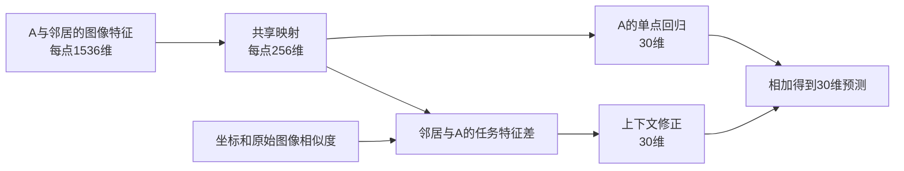

# Phase2软连接升级：从数据流到设计判断

2026-09-07，v1.1（首轮维度修订）。配套[实施方案](D:/AI空间转录病理研究/PFMval_new/01_指南与解读/部署方案/Phase2软连接升级_通路关系与局部空间联合方案_v1_20260907.md)。这是待实验检验的设计，尚无本轮性能结果。本文大纲与技术内容由Codex确定；指定Gemini模型的语言润色尚待完成。

## 一、先跟着一个点走完预测过程

假设我们要预测切片上的点A。原有模型先读取A的1536维UNI2-h特征，经一个隐藏层，输出30个ssGSEA通路分数。1536维是对图像形态的数字描述，30维才是我们要交给后续研究使用的预测对象。

新模型仍做这件事，只增加两种能力：训练时利用点与点之间的通路相似关系；预测时读取A附近的图像。可以先记住这个等式：

**A的最终预测＝A自身的预测＋附近图像提供的修正。**



“共享”表示A和其他点使用同一个映射函数，不表示所有点被混成一个向量。256维是中间表示的容量，不是256条通路，也不保证每一维都有单独生物学含义。

本轮先采用论文已有的256维作为起点：共享表征是256维，关系比较向量和空间消息也都是256维。共享表征与关系宽度参考[PEaRL的256维对齐和读出表征](https://arxiv.org/html/2510.03455v1#S3)及[DeepPathway的256维对齐配置](https://github.com/aahsan045/DeepPathway/blob/V1.0.2/config.py)；空间消息保持同宽属于本项目的工程安排，并不是论文已经证明这种空间模块用256维最好。

三个向量长度相同，但用途和映射参数不同。关系投影256→256仍会学习新的比较方式；它只对比较向量归一化，不要求最终通路分数归一化。原稿512维共享层、128维辅助层现已被本版取代。先完成统一256维的四臂实验，若内部结果显示不适合，再定位并调整相应位置；首轮不同时搜索多个宽度。输入1536维和输出30维不变，每批256个中心也不是“256维”的含义。

完整模型预测时需要图像特征和局部坐标关系，不需要测序标签，也不需要把训练患者数据库带到新切片上。若只输入一个孤立patch，邻域修正为零；这时只能得到该模型的单点分支输出。

## 二、训练时多出的那条线路在教什么

训练点除了图像，还有已知的30维通路分数。这份监督有两个用途。第一，比较A预测得多少、真实是多少，形成MSE，即均方误差。第二，比较A与其他训练点的通路状态，为图像表征建立关系目标。

```text
真实30维通路 ─→ 最终预测的数值误差 ─→ 训练预测线路
       │
       └─→ 点位之间的通路关系 ─→ 关系损失
                                    ↑
图像 ─→ 共享256维特征 ─→ 256维比较向量
```

关系损失沿着256维投影回到共享层。单点回归也使用这个共享层，所以关系学习才有机会影响最终预测。这里保留一个专用于比较的投影头，是为了不强迫最终30维分数归一化、丢掉高低幅度。

本轮没有可学习的通路编码器。因此，“对齐”指的是**图像中点与点的关系，尽量符合真实通路中点与点的关系**，并非将一个图像向量与另一个分子向量逐个坐标对齐。

例如，B来自另一名训练患者，但与A的30维通路状态接近，它可以参与A的关系监督。C就在A附近，可以向A提供空间图像信息。B和C的角色完全不同。把患者混合进一个训练批次，不妨碍先依据切片身份建立正确空间图。

## 三、软连接究竟连接谁，怎样避免乱分权重

本轮连接的是**点位与点位**。每个点都有30个通路分数，我们比较两点在这30个分数上的整体差异。通路之间是否共享基因，是另一个层次的问题，首版没有建立30×30的通路网络。

传统同点硬配对会把同位置的图像与分子数据当正对，其余位置视为不匹配。它尊重点位对应关系，却可能忽略两个不同点具有相似生物状态的情况。软关系允许多个相近点分享不同程度的权重。

但“给所有点一点正权重”也不是唯一选择。本方案将训练批中的候选分三组：通路距离足够近的至多8点用于拉近；足够远的至多32点用于区分；中间关系以及未被选中的近邻不参与这次成对约束。近与远的门槛来自训练数据，固定后不再根据外部成绩修改。

看一个只用于讲解的例子：

| A与谁比较 | 通路距离 | 本次角色 | 关系目标中的份额 |
|---|---:|---|---:|
| B | 0.1 | 近邻 | 约57.4% |
| C | 0.4 | 近邻 | 约42.6% |
| D | 0.9 | 不确定，忽略 | 不参与 |
| E | 3.0 | 远邻 | 正目标为0，参与区分 |

这里假设近邻门槛为0.5、远邻门槛为2；这些只是例子，不是本项目已经测得的阈值。两个近邻的比例来自 `exp(-距离)` 归一化，而非人工认定B有57.4%的生物学真实性。

**忽略和远邻不能混为一谈。**E仍在模型的比较范围中，模型需要降低与它的相似度；D则要同时退出目标权重和归一化分母。如果只把D的目标改成零，却让它留在分母，它仍会受到负样本作用。

没有符合条件的近邻或远邻时，A本批只做回归，不硬凑一组“可靠关系”。有效关系比例需要记录。否则辅助项大部分时间没启动，也可能被误读为“软连接已经充分训练但无效”。

这种方法能缓解哪些点被错误推开的风险，但不能保证30维标签距离完全代表生物学相似性。技术偏移、患者差异、通路之间的相关性，都可能影响这个距离。

## 四、空间模块到底看到了什么

空间模块先做一个简单决定：A附近哪些点可以参考。候选必须在同一张切片、同一个训练或评价集合中，且处于规定距离内。最多取8个，不足8个就使用已有邻居。

接着，它按照距离和冻结图像特征相似性分配权重。邻居越近、原始形态越相似，初版给予的参考权重越大。真正传递的内容则是经过共享映射、能被通路监督影响的256维消息。这就是“原始特征决定参考多少，任务特征提供参考内容”。

为了避免“邻居都不好也必须全盘接收”，分母里保留一份中心自身的权重。例如两个邻居的原始权重分别为0.5与0.25，加入中心的1后，中心份额约57.1%，两邻居约28.6%与14.3%。如果两个邻居权重都很小，邻域总影响也自然较小。

模型累加的是邻居消息与中心消息的差，再把这个差变成30维修正。它并非直接把邻居的真实通路或预测分数平均过来。没有邻居时没有消息差，修正为零。修正输出层初始为零，只保证初始状态与同权重单点分支一致，不保证训练后始终超过旧基线。

这里也有可能失效的地方：形态不同的邻居未必没有价值。肿瘤与免疫区的交界，恰好可能需要异质邻居。因此，要用相同结构的“只按距离”对照检查形态权重是否抑制了有用信息，不能把这种权重解释成已经识别出生物学边界。

### 已经固定MPP2，为什么仍然讨论步长

MPP2固定了使用哪些点、哪些点属于训练或验证，但现有文件中的原生坐标刻度并非全部一样：[划分说明](D:/AI空间转录病理研究/PFMval_new/mpp_standard_splits/group_2/split_info.json)记录HYZ、LMZ步长336，JFX为448，TGC、XSL、ZHZ为224。

这类似不同地图使用不同刻度；数字步长不同，本身不说明实际组织视野不同。新方案保持MPP2原划分，在每张切片上用1.5倍该切片步长确定邻域。这样比较的是相近的网格邻域阶数。是否同时覆盖相同微米范围，需要像素尺寸等元数据才能判断。

训练图只读训练节点，验证图只读验证节点，外部图只在外部切片内部建立。图先建好，再分批计算；不能把每个随机批次临时当成一张组织图。验证点较稀疏而部署可能使用完整切片，这种邻域密度差异也要报告。

## 五、三篇论文怎样映射到这个方案

| 论文 | 最值得理解的原思路 | 本项目吸收与修改 |
|---|---|---|
| DeepPathway | 直接预测通路，并利用连续软目标学习图像与分子关系 | 保留直接通路预测；沿用本项目ssGSEA，改用真实30维通路定义点对关系 |
| PEaRL | 用通路监督塑造图像表征，随后预测通路和基因 | 把关系梯度送入共享轻量层；冻结已有UNI2-h，不增加基因头或通路Transformer |
| Reg2ST | 图像先产生任务相关特征，再通过跨点交互预测基因表达 | 保留推理时的局部上下文，改用固定局部图和轻量修正，不套用基因计数损失 |

DeepPathway使用UCell通路目标，PEaRL使用ssGSEA并有额外基因任务，Reg2ST面向基因表达。预测对象和标签处理不同，所以不能直接比较它们报告的PCC来给方法排名。

“训练时用过空间关系”和“预测时真的读取附近图像”也不等价。前者可以让单点特征受空间监督影响；后者让同一个中心patch在周围图像变化时产生不同预测。本方案选择保留后者，因此部署输入需要局部上下文。

还有一个阅读论文时容易忽略的地方：DeepPathway正文描述软目标，但其[公开代码V1.0.2](https://github.com/aahsan045/DeepPathway/blob/V1.0.2/models.py)中，BLEEPOnly分支使用软目标，BLEEPWithOptimus分支使用硬对角目标，最终DeepPathway类加载后者。我们吸收的是正文中的连续关系思想，不把它等同于所有公开分支的实际行为，也没有复核其checkpoint训练历史。

原文核查入口：[DeepPathway预印本](https://www.biorxiv.org/content/10.1101/2025.07.21.665956v1)、[PEaRL正式论文](https://openaccess.thecvf.com/content/WACV2026/papers/Majumder_PEaRL_Pathway-Enhanced_Representation_Learning_for_Gene_and_Pathway_Expression_Prediction_WACV_2026_paper.pdf)、[Reg2ST全文](https://pmc.ncbi.nlm.nih.gov/articles/PMC12360703/)。

三篇论文并没有共同验证本文这个现成架构。三状态掩码、固定形态权重、自保留和消息差残差，都是针对本项目提出的具体组合。它们是否有效，要靠四臂和后续机制对照判断。

## 六、为什么先展示完整模型，再做四臂

把完整模型看成三个组成部分：点位回归、通路关系监督、局部空间输入。四臂就是从同一个总模型中逐一拿掉后两项：

| 实验名 | 有什么 | 最直接回答的问题 |
|---|---|---|
| 完整联合 | 回归＋关系＋空间 | 总方案有没有实际价值 |
| 仅空间 | 回归＋空间 | 没有关系监督时，邻域能提供多少帮助 |
| 仅关系 | 回归＋关系 | 不读邻居时，关系监督能提供多少帮助 |
| 匹配回归 | 只有同样256维的回归 | 新训练协议下的共同参照 |

完整联合减仅空间，才是“已有空间时再加入关系”的收益；完整联合减仅关系，才是“已有关系时再加入空间”的收益。完整联合只与旧1024维模型比较，无法分清容量、训练规则和新模块各自的影响。

四臂使用相同MPP2点集、30条通路、中心采样顺序、公共层初值、训练上限和选点规则。先完成种子42的四臂，再把43与44也四臂补齐，总计划12次，不取某个方法最好的一次对比另一个方法最差的一次。

回归先预热5轮，随后10轮逐渐加入关系损失；从第6轮起纳入正式模型选择，最多60轮。规则对四臂一致。这样不会把尚未启用关系项的预热模型误当成关系学习的证据；预热表现另外保存用于诊断。

第一轮也有解释限度：空间臂增加了参数。若空间有效，还需与参数量相近、只看中心的分支比较，才能加强“收益来自附近图像”的证据。若仅关系最好，可以选择更简单的候选；不必为保留完整组合而解释掉不利结果。

## 七、怎样读PCC，才能判断提升究竟是什么

我们关心某条通路在不同位置的高低变化是否被模型捕捉。因此，本轮内部选点先在每名患者内逐条计算PCC，再平均通路，最后六名患者等权平均。这样点位较多的患者不会仅凭数量主导选择。既有合并点位后的逐通路PCC和展平PCC仍单独保留，名称不能互换。

PCC反映变化方向与线性关系，不直接衡量绝对分数是否准确。例如真实值是1、2、3，预测为12、14、16，PCC仍为1，但预测尺度明显错误。这个例子只是说明指标性质。

所以，应在同一选中模型上一起看误差、原始尺度R²、CCC和空间指标。PCC提高但误差恶化，说明相关性可能进步，不能据此宣布交给Phase3的绝对通路分数已经全面改善。

再看三个层次的稳定性：30条通路是否普遍受益，是否只靠一名患者拉高平均，不同种子是否同向。三种子平均提高0.01可作为优先继续的参考，但不是显著性证明，更不是公认达标线。单个患者内大量相关点位，也不能被当作大量独立患者。

XZY属于当前训练之外的患者，但历史中已经反复报告过它的成绩。本轮只在内部方案、消融与模型固定之后集中评估，不用其结果调参数。当前MPP2内部区域验证仍不能代替未见患者泛化；固定MPP2和暂缓六折，并不妨碍先把机制问题研究清楚。

## 八、带着这些问题判断方案是否值得继续

读完后，可以用以下五个问题组织方案讨论：

1. **关系损失真的改善回归了吗？** 看仅关系与匹配回归、完整联合与仅空间的配对差，而不是只看关系损失下降。
2. **连续标签的对应关系有用吗？** 辅助标签打乱后，MSE真标签保持不动；比较真关系与打乱关系的差异。
3. **邻居带来了新信息吗？** 看仅空间与匹配回归，以及读取邻居和只读中心的同容量分支对照。
4. **新权重是否丢掉了有用信息？** 看三状态与稠密关系、形态加距离与仅距离的对照，结合有效近邻比例和组织边界上的变化。
5. **提升够稳定、尺度够可靠吗？** 同时看患者、通路、种子和误差，不挑更好看的PCC定义代替原来的判断。

最终要留下的是有数据支持的模块。方案规定怎样实施和检验，学习指南帮助解释为何这样做；二者都不提前给实验写好结论。

具体数学定义、参数、输入合同、代码落点和服务器复制路径，请查阅[实施方案](D:/AI空间转录病理研究/PFMval_new/01_指南与解读/部署方案/Phase2软连接升级_通路关系与局部空间联合方案_v1_20260907.md)。其中第十一节集中提供论文与项目证据的核查入口。
