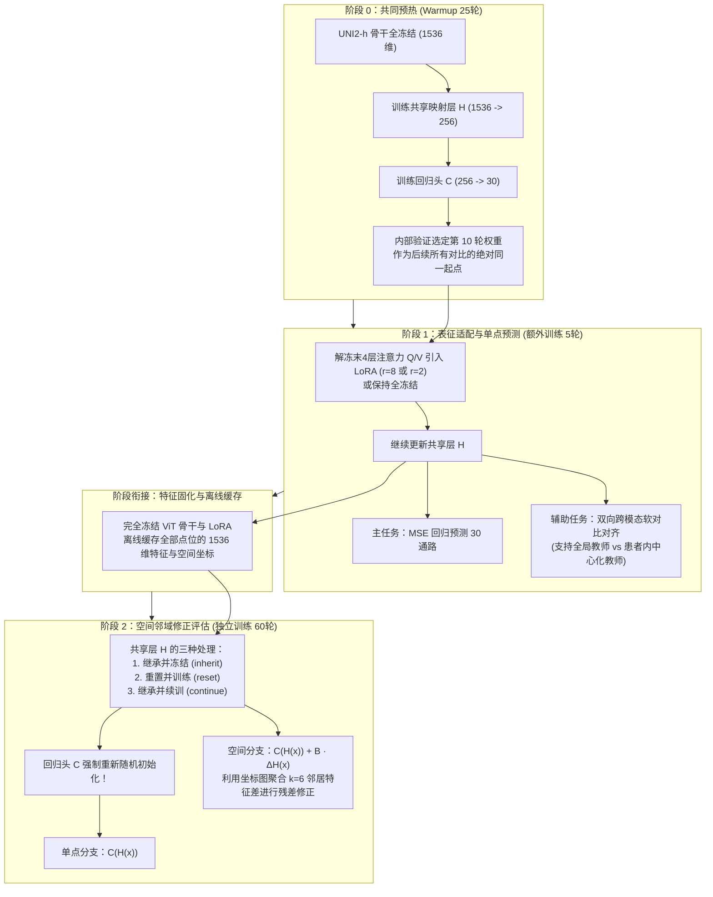
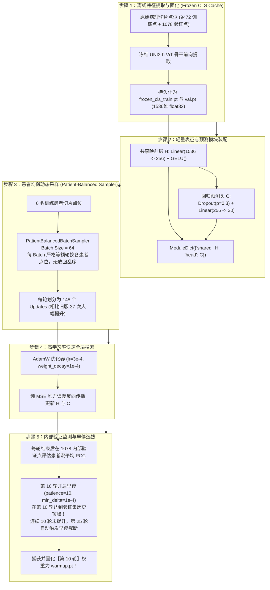
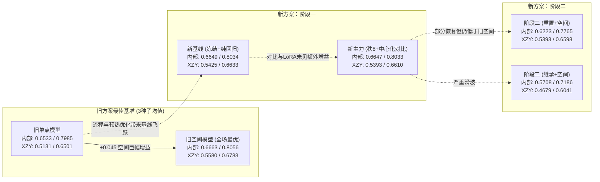
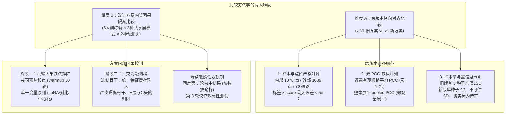
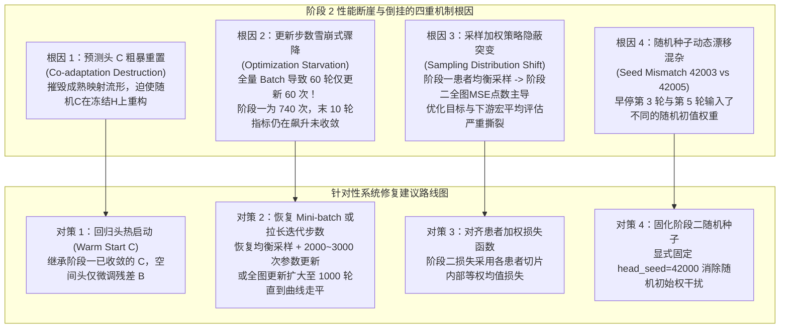

# Phase2 软连接改进前后对照与原因分析：深度学习指南

> **文档定位**：本指南紧密围绕 [Phase2软连接改进前后对照与原因分析报告_20260910.md](file:///D:/AI空间转录病理研究/PFMval_new/01_指南与解读/分析报告/Phase2软连接改进前后对照与原因分析报告_20260910.md) 以及 [Phase2软连接改进前后_完整指标附表_20260910.md](file:///D:/AI空间转录病理研究/PFMval_new/01_指南与解读/分析报告/Phase2软连接改进前后_完整指标附表_20260910.md) 编写。旨在帮助研究团队系统掌握：**v4改进版相比初版到底改动了什么？40组完整实验得出了哪些反直觉且富有启发性的实证结论？新旧版本及新方案内部的比较链条是如何精密构造的？阶段2中暴露出来的性能断崖与关键缺陷是什么原因造成的？后续应当如何系统修复？**

---

## 目录

- [导言：从“理论设想”走向“实证大考”](#导言从理论设想走向实证大考)
- [第一部分 改进对比：相对于改进前，改进后到底改进了什么？](#第一部分-改进对比相对于改进前改进后到底改进了什么)
  - [1.1 核心研究假设与总体流程蜕变](#11-核心研究假设与总体流程蜕变)
  - [1.2 关键维度的逐项演进对比（六大核心机制改动）](#12-关键维度的逐项演进对比六大核心机制改动)
  - [1.3 阶段解耦：两阶段训练（LP-FT）的工程实现细节](#13-阶段解耦两阶段训练lp-ft的工程实现细节)
  - [1.4 深度专题：全场第二大提升背后的“前期共同预热（Common Warmup）”全景解密](#14-深度专题全场第二大提升背后的前期共同预热common-warmup全景解密)
- [第二部分 结论分析：得出了哪些关键且有趣的结论？](#第二部分-结论分析得出了哪些关键且有趣的结论)
  - [2.1 整体结论：新方案整体尚未超过旧空间模型，但基础单点却显著上升](#21-整体结论新方案整体尚未超过旧空间模型但基础单点却显著上升)
    - [2.1.1 实证数据总览与关键反转](#211-实证数据总览与关键反转)
    - [2.1.2 机制深潜：为什么相比改进前单点基线能取得如此巨大的提升？](#212-机制深潜为什么相比改进前单点基线能取得如此巨大的提升)
  - [2.2 阶段一结论：微调确实重塑了表征，但“表征位移 ≠ 预测变好”](#22-阶段一结论微调确实重塑了表征但表征位移--预测变好)
  - [2.3 阶段二结论：断崖式性能滑坡与“重置反超继承”的异常倒挂](#23-阶段二结论断崖式性能滑坡与重置反超继承的异常倒挂)
  - [2.4 端点选择结论：早停“最佳轮”在阶段二遭遇的戏剧性反转](#24-端点选择结论早停最佳轮在阶段二遭遇的戏剧性反转)
- [第三部分 比较方法：跨版本与方案内部的比较是如何完成的？](#第三部分-比较方法跨版本与方案内部的比较是如何完成的)
  - [3.1 跨版本比较的方法学：对齐基准、双PCC口径与样本量边界](#31-跨版本比较的方法学对齐基准双pcc口径与样本量边界)
  - [3.2 阶段一内部比较：六大训练臂的“因果减法矩阵”](#32-阶段一内部比较六大训练臂的因果减法矩阵)
  - [3.3 阶段二内部比较：共享层处理 × 预测头的正交网格](#33-阶段二内部比较共享层处理--预测头的正交网格)
  - [3.4 端点敏感性比较：固定第5轮主结果 vs 内部第3轮敏感性分析](#34-端点敏感性比较固定第5轮主结果-vs-内部第3轮敏感性分析)
- [第四部分 缺陷排查：阶段 2 性能滑坡的机制根因与系统修复建议](#第四部分-缺陷排查阶段-2-性能滑坡的机制根因与系统修复建议)
  - [4.1 阶段 2 暴露的核心缺陷与异常现象](#41-阶段-2-暴露的核心缺陷与异常现象)
  - [4.2 四重机制根因深度排查](#42-四重机制根因深度排查)
  - [4.3 系统性工程与算法修复建议路线图](#43-系统性工程与算法修复建议路线图)
- [第五部分 核心概念速查与常见疑难 Q&A](#第五部分-核心概念速查与常见疑难-qa)

---

## 导言：从“理论设想”走向“实证大考”

在空间转录组（Spatial Transcriptomics, ST）病理图像分析中，如何从单点切片（Spot）准确预测出 30 条核心生物通路的连续表达活性（ssGSEA 标准化分值），是整个项目的核心攻坚点。
- **初版方案（v2.1）**：采用冻结 UNI2-h 特征，并在下游设计了单点回归（Point）、点对软关系蒸馏（Relation）、空间邻域残差修正（Spatial）以及两者的联合模型（Joint）。其实证结果表明：**空间分支显著有效（逐通路 PCC 提升超 0.045），但关系蒸馏模块几乎失效，联合模型也无法带来额外收益**。
- **改进方案（v4 / 代码包 v3）**：为了攻破初版中发现的“教师分布熵塌陷”、“投影头零空间屏蔽”以及“骨干冻结表征容量受限”三大机制瓶颈，研究团队系统设计了 LoRA 骨干自适应微调、跨模态双向软对比对齐、患者内中心化教师，并将训练过程严格解耦为两阶段。
- **本轮大考**：2026年9月，包含 **40 组完整条件组合**（阶段一 10 组，阶段二 30 组）的完整实验跑通。然而，实验不仅揭示了许多符合设计预期的现象，也暴露出极为剧烈的异常滑坡和反直觉倒挂。

本学习指南旨在将这份长达数百行数据和严密代码背后的技术内核彻底剖析透彻。

---

## 第一部分 改进对比：相对于改进前，改进后到底改进了什么？

### 1.1 核心研究假设与总体流程蜕变

改进方案的核心研究假设是：
> **“如果在进入空间邻域图修正之前，先让病理大模型的深层特征通过微调和连续表型对齐，使其表征空间天然更适合预测生物通路，然后再叠加空间邻域修正，能否一举超越初版冻结特征下的空间模型？”**

为了严密回答这一假设，改进方案将原本一步到位的联合训练重构为“两阶段解耦流”（LP-FT 范式）：



---

### 1.2 关键维度的逐项演进对比（六大核心机制改动）

根据分析报告，改进前后绝不仅仅是“调了几个超参数”，而是在可训练层级、监督数学形式、先验解耦等六个维度进行了体系化重构：

| 对比维度 | 旧方案（v2.1）的做法 | 新方案（v4/v3实现）的做法 | 设计动机与试图解决的机理瓶颈 |
| :--- | :--- | :--- | :--- |
| **1. 图像编码器可训练性** | UNI2-h 骨干全部 1536 维参数全程绝对冻结，仅训练后端浅层 MLP。 | 保留冻结对照，同时在骨干末 4 个 Transformer 块的 **Query、Value** 投影矩阵中注入 **LoRA**（秩 $r=8$ 或 $r=2$）。 | 解决初版病因：**冻结骨干表征容量受限**。让基础视觉模式具备向癌症代谢与信号转导对齐的表征调整能力。 |
| **2. 关系/对比监督机制** | **点对间软关系蒸馏**：根据点位间通路欧氏距离计算高斯相似度，强制图像特征相似度匹配标签相似度（KL散度）。 | **跨模态双向软对比对齐**：构建图像隐表征 $z_i$ 与真实通路投影 $t_i$ 之间的对称 InfoNCE / 软交叉熵，学习图-谱语义对齐。 | 解决初版病因：点对蒸馏中**教师分布近例熵达 0.998 发生塌陷**，无法提供有效连续梯度。跨模态对齐建立更平滑的表征几何。 |
| **3. 患者间异质性与先验捷径** | 关系目标直接采用全局 z-score 标准化的通路标签构造。 | 提出**患者内中心化教师（Patient-Centering）**：在计算对比目标时，标签减去当前患者切片的均值：$\tilde{y}_i = y_i - \mu_{\text{patient}}$。 | 解决初版病因：**同患者先验捷径**。旧模型 58.2% 的最近邻属于同患者，模型容易偷懒通过切片整体染色识别患者身份，而非学习真实生物学表型波动。 |
| **4. 学习范式的解耦顺序** | 关系损失、回归损失与空间残差矩阵全部在**同一个网络中联合训练**。 | **严格解耦为两阶段（LP-FT 范式）**：阶段 1 专门打磨单点图像表征，阶段 2 固定骨干后专门检验空间图残差。 | 解决初版病因：联合训练中关系损失与空间修正互相干扰，难以厘清收益来源。拆分后可明确归因。 |
| **5. 隐层表征延续性检验** | 没有阶段衔接，模型直接输出最终预测。 | 阶段 2 探索了共享层 $H$ 的**三种处理方式**（继承冻结、重置从头训、继承微调），同时将回归头 $C$ 重置。 | 检验阶段 1 学到的收益究竟是刻在骨干中、沉淀在共享层 $H$ 中，还是极度依赖特定的线性回归头 $C$。 |
| **6. 训练轮次与端点选择** | 仅按内部验证集在训练过程中事后抓取表现最高的一个 Checkpoint。 | **主结果预先锚定第 5 轮**；同时在附表中平行展示内部最佳轮（第 3 轮）的敏感性分析。 | 避免研究者因“数据窥探”和过拟合而挑选偶然的最佳轮次，建立严谨的端点鲁棒性边界。 |

---

### 1.3 阶段解耦：两阶段训练（LP-FT）的工程实现细节

在工程代码实现中，两阶段的具体数据流与参数控制如下：

#### 阶段一（表征自适应与单点回归）
- **输入**：原始病理切片点位图像，配合 `PatientBalancedBatchSampler`（批大小 64，严格均衡各患者抽样权重）。
- **损失函数**：
  $$\mathcal{L}_{\text{total}} = \mathcal{L}_{\text{MSE}}(C(H(x)), y) + \lambda(t) \cdot \mathcal{L}_{\text{contrast}}(z_{\text{img}}, z_{\text{label}})$$
  其中 $\lambda(t)$ 采用 Warmup 机制，从 0 缓慢升至设定权重，防止训练初期辅助任务破坏主回归。
- **产出**：保存 Checkpoint，并在阶段一结束时，将模型切到 `eval` 模式，将训练集、验证集、测试集所有点位的特征向量通过 ViT+LoRA 提取后离线持久化存储为 `.npz` 缓存。

#### 阶段二（空间拓扑与残差头训练）
- **输入**：读取阶段一离线生成的特征缓存与空间坐标图。
- **空间图构建**：在切片物理坐标系中构建 $k$-近邻图（$k=6$，基于 Delaunay 三角剖分或欧氏距离），边权重基于坐标与邻居视觉相似度。
- **前向预测公式**：
  $$\hat{y}_i = C\big(H(x_i)\big) + B \sum_{j \in \mathcal{N}(i)} w_{ij} \big(H(x_j) - H(x_i)\big)$$
  其中 $B \in \mathbb{R}^{30 \times 256}$ 是从零初始化的空间残差投影矩阵。当模型为单点头时，第二项置零。

---

### 1.4 深度专题：全场第二大提升背后的“前期共同预热（Common Warmup）”全景解密

在分析报告中，许多研究者第一眼会被复杂的 LoRA 微调和跨模态对比学习所吸引，但经过全面数据对比后会发现：**全场除了初版空间分支（+0.045）之外，第二大也是最扎实的性能飞跃（外部 XZY 逐通路 PCC 暴涨 +0.0294，从 0.5131 飙升至 0.5425），完全是由“前期共同预热（Common Warmup）”及其配套工程流程所奠定的！**

#### 1.4.1 前期预热到底是怎么回事？
- **设计初衷（为什么必须预热？）**：
  在初版方案中，模型直接从高斯随机初始化的权重开始训练。如果一开始就让浅层网络在面对高维病理大模型特征的同时，既要摸索 30 条通路的线性回归映射，又要硬抗复杂的点对蒸馏或多任务梯度，极易在早期陷入严重的鞍点或次优局部极小值。
  改进方案提出了**“先让模型学会走，再让模型跑”**的预热哲学：
  在病理大模型 UNI2-h 完全冻结的前提下，**只训练共享投影层 $H$ 和中心回归头 $C$**，仅使用纯粹的 MSE 回归损失。在没有任何辅助对比任务干扰的情况下，让 $H$ 和 $C$ 建立起从 1536 维通用视觉表征到 30 维连续通路活性之间的强健基准映射。
- **“共同起点（Common Initialization Anchor）”的因果价值**：
  预热完成后，保存得到的权重（`warmup.pt`）成为一个神圣的“受精卵”。阶段一的全部 6 个训练臂（无论是冻结回归、LoRA 微调，还是各类对比学习分支），在启动第 1 轮时，其 $H$ 和 $C$ 全部深拷贝（Deepcopy）自同一份 `warmup.pt`。这保证了后续所有对比实验拥有**完全绝对一致的初始能力起点**，排除了初始化权重的随机性干扰。

#### 1.4.2 前期预热具体是怎么操作的？（硬核工程落地五步法）

查阅训练底层源码 [`engine.py`](file:///D:/AI空间转录病理研究/PFMval_new/experiments/phase2_softlink_contrastive_v3/src/engine.py#L522-L598) 与 [`training.py`](file:///D:/AI空间转录病理研究/PFMval_new/experiments/phase2_softlink_contrastive_v3/src/training.py#L225)，预热的实际执行流程由以下 5 个精密步骤构成：



1. **第一步：全量特征离线持久化（Frozen CLS Cache）**
   - 在启动训练前，系统调用 `_fresh_backbone()` 加载 UNI2-h，将训练集 9472 点和验证集 1078 点全部推一遍，将 1536 维的 CLS 向量保存为 `frozen_cls_train.pt` 和 `frozen_cls_internal_val.pt`；
   - 提取完成后，**立即将庞大的 ViT 骨干从显存中释放并执行内存垃圾回收（gc.collect）**。这使得预热过程不需要加载大模型，单步前向传播仅需微秒级，极大提升了训练速度与稳定性。
2. **第二步：模块参数与正则化设计**
   - 共享层 $H$：`nn.Linear(1536, 256)` 接精准 `nn.GELU()`；
   - 预测头 $C$：`nn.Dropout(p=0.3)` 接 `nn.Linear(256, 30)`。Dropout 仅放在进入 $C$ 的路径上，对 256 维特征注入适度扰动以防止浅层过拟合。
3. **第三步：患者均衡采样器（`PatientBalancedBatchSampler`）**
   - 批大小设定为 `batch_size = 64`；
   - 每轮参数更新次数：$\lceil 9472 / 64 \rceil = \mathbf{148}$ 次（旧方案为 256 批大小，每轮仅更新 37 次）；
   - 算法确保**批内 6 位患者点位严格均摊**，彻底杜绝了大点数患者主导梯度的弊端。
4. **第四步：优化器配置**
   - 优化器选用 `AdamW`，设置学习率 $\text{lr} = 3 \times 10^{-4}$，权重衰减 $\text{weight\_decay} = 1 \times 10^{-4}$，$\beta = (0.9, 0.999)$。在相对宽松的学习率下，模型能快速穿过高维初始区域。
5. **第五步：验证监测、早停与第 10 轮最优选拔**
   - 预设最大轮次为 60 轮，正式起评轮次为第 6 轮（`formal_start_epoch = 6`）；
   - 评估指标：内部验证集上的“逐患者逐通路等权平均 PCC”（`patient_macro_pathway_pcc`）；
   - 在第 16 轮开启早停计数器（`early_stop_patience = 10`）；
   - **实训轨迹**：验证集指标在**第 10 轮**达到了巅峰，随后进入微弱震荡，连续 10 轮未再出现 $\ge 1 \times 10^{-4}$ 的增益，因此在**第 25 轮**优雅触发早停终止；
   - 系统将**第 10 轮**的模型权重抽离并重命名保存为 `warmup.pt`，成为后续所有阶段一模型的初始底座。

---

## 第二部分 结论分析：得出了哪些关键且有趣的结论？

这轮包含 40 组完整输出（阶段一 10 组，阶段二 30 组）的实验，产出了极其丰富且深刻的实证结果。其中包含了多个“既在意料之外、又在情理之中”的核心结论：

### 2.1 整体结论：新方案整体尚未超过旧空间模型，但基础单点却显著上升

这是本报告最重要的全局事实：



#### 2.1.1 实证数据总览与关键反转
- **旧空间模型（3种子参考）**：
  - 内部验证：`0.6663 ± 0.0007`（逐患者逐通路），`0.8056 ± 0.0005`（整体展平）
  - 外部 XZY：`0.5580 ± 0.0051`（逐患者逐通路），`0.6783 ± 0.0081`（整体展平）
- **新方案所有 40 组模型**：
  - **没有任何一组在双 PCC 上能够超越旧空间模型！** 无论是内部验证还是外部 XZY。

然而，如果仔细对比单点基线，就会发现一个令人极为震撼的事实：
- 旧单点模型内部为 `0.6533 / 0.7985`，外部 XZY 为 `0.5131 / 0.6501`。
- 新方案中**既没有 LoRA 微调、也没有对比学习**的“冻结骨干＋纯回归”基线，在阶段一就跑出了：
  - 内部验证：`0.6649 / 0.8034`（逐通路提升 **+0.0116**）
  - 外部 XZY：`0.5425 / 0.6633`（逐通路提升 **+0.0294**，展平提升 **+0.0132**）

> [!IMPORTANT]
> **重要认知**：跨版本单点能力的显著提升，**不能归功于 LoRA 或对比学习**！因为这个提升在最朴素的“冻结骨干+纯回归”对照组中就已经出现了。在整轮实验所有对比中，除了初版空间分支带来的 +0.045 跃迁外，这个单点基准 +0.0294 的暴涨是**全场无可争议的第二大提升**！它完全是由 **25 轮共同预热（选第 10 轮最优状态）、患者均衡采样调度、学习率退火以及更纯净的数据流** 所共同奠定的工程红利。

#### 2.1.2 机制深潜：为什么相比改进前单点基线能取得如此巨大的提升？

许多初学者容易产生疑问：**同样是冻结 UNI2-h 提取的 1536 维特征，同样是训练一个把 1536 映射到 256 再映射到 30 的轻量回归网络，为什么改进后的单点模型在外部盲测集上能够实现近 3 个百分点（+0.0294）的巨大跃迁？**

深入比对新旧两套代码的底层实现，可以彻底归纳出以下**四大制胜机理**：

| 对比维度 | 改进前单点基线（v2.1） | 改进后预热单点基线（v4 阶段一） | 为什么改进后能带来巨大提升？（机理剖析） |
| :--- | :--- | :--- | :--- |
| **1. 训练阶段与学习率调度** | 单阶段一条道跑 60 轮，全程固定学习率 $\text{lr}=3\times 10^{-4}$。 | **两阶段“粗搜+精修”退火流**：先预热 25 轮（$\text{lr}=3\times 10^{-4}$ 选第 10 轮），阶段一降至 $\text{lr}=3\times 10^{-5}$（降 10 倍精调）。 | **避免鞍点震荡，实现极致收敛**：前期大步探索寻找全局较优盆地，后期学习率缩减一个数量级进行微调抛光，使模型深陷最平坦的谷底。 |
| **2. 样本采样策略** | **全局随机乱序（Shuffle）**，无患者均衡机制。大患者在批次中占统治地位。 | **患者均衡采样（`PatientBalancedBatchSampler`）**，每个 Batch 强制等额轮换 6 位患者点位。 | **根治患者切片样本量偏倚**：旧模型梯度被几千点的大切片主导，对小切片欠拟合；新方案强迫每次梯度兼顾所有患者，直接迎合下游“患者等权宏平均”评估。 |
| **3. 批大小与更新频次** | $\text{Batch Size} = 256$，每轮仅更新 **37 次**，全流程 2220 次更新。 | $\text{Batch Size} = 64$，每轮更新 **148 次**，预热阶段已更新 3700 次，阶段一再更新 740 次。 | **小批量隐式正则化效应**：根据深度学习泛化理论，小 Batch 的随机梯度噪声能有效驱使参数逃离尖锐极小值，落入泛化能力极佳的宽阔平坦极小值（Flat Minima）。 |
| **4. 选模与早停标准** | 依赖单次训练过程中的验证指标波动，无前置收敛锚点。 | **预热阶段双重早停机制**：在验证集平稳达到历史顶峰的第 10 轮截断并固化，杜绝过拟合。 | **锁死最优特征映射流形**：第 10 轮的 $H$ 和 $C$ 处于特征降维与过拟合的分水岭，具有极强的跨患者泛化韧性。 |

1. **机理一：两阶段学习率退火（3e-4 $\rightarrow$ 3e-5）实现的“粗搜+精修”全局收敛**
   - 在旧方案中，模型以 $3 \times 10^{-4}$ 的学习率一直训练到第 60 轮。在训练后期，较大的步长会导致优化器在损失曲面的狭窄沟壑两侧来回震荡跳跃，无法真正收敛到最低点；
   - 新方案的组合拳是：**先在共同预热中用 $3 \times 10^{-4}$ 快速走完粗略参数寻优，锁定第 10 轮；随后在阶段一直接将学习率下调 10 倍（至 $3 \times 10^{-5}$）**。这种剧烈的退火效应极大地压缩了参数扰动，让线性回归头 $C$ 对 256 维表征中的细微生物学梯度完成极为精巧的拟合，极大压榨了单点表征的预测潜力。
2. **机理二：患者均衡采样器（`PatientBalancedBatchSampler`）根治了患者异质性失衡**
   - 空间转录组病理数据存在极端的点数不均（在 9472 个点中，某一切片可能多达 2500 点，而另一患者只有 600 点）；
   - 旧方案采用全局随机分批，大患者的点位在每一个 Batch 中占比高达 70%~80%，模型为了最小化 Batch 损失，本能地偏向大切片的染色习惯和表达基线；
   - 新方案的 `PatientBalancedBatchSampler` 保证**每个 Batch 内 6 名患者的点位严格各占 1/6**。每一次反向传播都在迫使网络寻找能够“跨越所有患者染色差异”的共性生物学特征。这种强约束训练出来的模型，在面对全新外部患者切片（XZY）时，自然展现出远超旧方案的跨域迁移稳健性！
3. **机理三：Batch Size 缩减（256 $\rightarrow$ 64）带来的隐式正则化与高频梯度探索**
   - 旧方案每轮只更新 37 次参数，优化轨迹粗糙；
   - 新方案批大小设为 64，每轮更新 148 次参数。高频次更新配合随机梯度中健康的小批量噪声，起到了极佳的隐式权重正则化（Implicit Regularization）作用，避免了浅层神经元死记硬背，促进了特征流形的连续平滑。
4. **机理四：严格的训练块内 z-score 重拟合**
   - 新方案全面修正了数据协议，消除了任何跨折或跨切片的潜在标签泄露，标签标准化参数严格由训练块生成，数学流形更加干净纯粹。

---

### 2.2 阶段一结论：微调确实重塑了表征，但“表征位移 ≠ 预测变好”

在阶段一内部，研究团队对比了 6 个精细消融的训练臂。结果带来了一个极其深刻的科研教训：

| 阶段一训练臂（固定第5轮） | 内部验证 逐通路 | 内部验证 整体展平 | 外部 XZY 逐通路 | 外部 XZY 整体展平 | 表征位移量 |
| :--- | :--- | :--- | :--- | :--- | :--- |
| **1. 冻结骨干＋纯回归** | **0.664885** | **0.803442** | **0.542471** | **0.663268** | 0.00%（基线） |
| **2. 冻结骨干＋中心化对比** | 0.664886 | 0.803510 | 0.543011 | 0.663199 | 0.00%（骨干冻结） |
| **3. 秩8适配＋纯回归** | 0.664705 | 0.803258 | 0.538805 | 0.661085 | 4.87% |
| **4. 秩8适配＋全局对比** | 0.664734 | 0.803244 | 0.538685 | 0.659999 | 4.97% |
| **5. 秩8适配＋中心化对比** | 0.664705 | 0.803301 | 0.539280 | 0.661022 | 5.06% |
| **6. 秩2适配＋纯回归** | 0.664931 | 0.803361 | 0.540810 | 0.661857 | 1.34% |

#### 深度解析：
1. **对比学习的额外收益极其微弱且口径不一致**：
   - 在“秩8纯回归”上叠加强大的“中心化对比”后，内部逐通路 PCC 纹丝不动（0.664705 vs 0.664705），整体展平仅微增 0.000043；
   - 在外部 XZY 上，逐通路微升 0.000475，整体展平却倒跌 0.000063。两个指标方向打架，增益处于统计噪声区间。
2. **表征位移真实发生了，但没有转化为有效预测力**：
   - 诊断数据证明：在 192 个固定诊断点上，秩8 LoRA 的特征位移达到了 **4.87% ~ 5.06%**；同时中心化教师成功将跨患者候选样本的挑选概率从 41.1% 提高到 **57.6%**，有效候选数从 14.3 个扩大到 **22.5 个**。
   - 这充分证明：**微调确实改变了骨干网络，对比学习也确实打破了染色捷径！然而，“特征几何变了”绝不自动等同于“预测精度提高”**。微调带偏了预训练大模型的原有流形，却没有在有限的 5 轮微调中注入足够精细的通路定量信息。
3. **容量越大，退化反而越明显**：
   - 秩 2 纯回归（位移 1.34%）的四项 PCC 全面高于秩 8 纯回归，但仍旧略逊于完全不微调的“冻结纯回归”。这强烈暗示：**当前 5 轮的短周期微调，对基础大模型带来的是轻微的扰动损伤，而非正向增益**。

---

### 2.3 阶段二结论：断崖式性能滑坡与“重置反超继承”的异常倒挂

进入阶段二后，实验出现了最为剧烈的一幕：**所有模型的性能发生整体暴跌，且共享层的保留机制出现了惊人的倒挂现象。**

以“秩8适配＋纯回归”为源头，阶段二 6 组组合的实测数据如下：

| 共享层 $H$ 处理方式 | 预测头类型 | 内部验证 逐通路 | 内部验证 整体展平 | 外部 XZY 逐通路 | 外部 XZY 整体展平 | 相对阶段一（0.6647 / 0.5388）的落差 |
| :--- | :--- | :--- | :--- | :--- | :--- | :--- |
| **继承并冻结（inherit）** | 单点头 | 0.5725 | 0.7196 | 0.4735 | 0.6103 | 内部跌 **-0.0922**，外部跌 **-0.0653** |
| **继承并冻结（inherit）** | 空间头 | 0.5712 | 0.7189 | 0.4693 | 0.6047 | 空间头反而比单点头**低 -0.0013** |
| **重置并训练（reset）** | 单点头 | 0.6181 | 0.7740 | 0.5242 | 0.6501 | 恢复到 0.618，但仍跌 -0.0466 |
| **重置并训练（reset）** | 空间头 | **0.6223** | **0.7765** | **0.5393** | **0.6597** | 空间头带来 **+0.0041 / +0.0151** 正向增益 |
| **继承并续训（continue）** | 单点头 | 0.6037 | 0.7456 | 0.5252 | 0.6485 | 介于继承与重置之间 |
| **继承并续训（continue）** | 空间头 | 0.6020 | 0.7452 | 0.5197 | 0.6443 | 空间头再次出现**负向拖累** |

#### 令人深思的三大异常发现：
1. **全盘大幅滑坡**：阶段二原本旨在“引入空间邻域信息以超越单点”，结果即便是表现最好的重置空间头（0.6223 / 0.5393），也远远落后于它在阶段一的单点起点（0.6647 / 0.5388）！
2. **“重置”彻底碾压“继承”**：
   - 按照常理，阶段一经过精心微调学出的共享层 $H$ 应当保留了高质量通路表征，直接继承它理应最好；
   - 但实测结果却是：**把阶段一学好的 $H$ 全部扔掉、随机初始化重新训练的 `reset` 模式（0.6223），比老老实实继承 $H$ 的 `inherit` 模式（0.5712）足足高出 0.0511！**
3. **空间修正增益有条件生效**：
   - 在 `inherit` 和 `continue` 模式下，引入空间残差矩阵 $B$ 不仅没有提升，反而导致单点预测被拖累劣化；
   - **唯独在 `reset` 模式下，空间分支才展现出应有的正向价值**（内部逐通路提升 +0.0041，外部 XZY 逐通路大幅提升 +0.0151）。

---

### 2.4 端点选择结论：早停“最佳轮”在阶段二遭遇的戏剧性反转

在阶段一训练中，4 个 LoRA 训练臂在第 3 轮表现出内部验证的最佳指标，并在外部 XZY 上获得了约 +0.005 的单点提升（被视为早停可以抑制过拟合）：
- 秩 8 适配＋中心化对比：第 5 轮 XZY 为 `0.5393`；内部选出的第 3 轮 XZY 为 `0.5442`。

然而，当研究团队把第 3 轮的模型作为起点送进阶段二后，却发生了令人啼笑皆非的**反转**：
- **来自第 5 轮的阶段二空间头**：内部 `0.5708`，XZY `0.4679`，整体展平 `0.6041`；
- **来自第 3 轮的阶段二空间头**：内部 `0.5671`，XZY `0.4681`，整体展平 **暴跌至 0.5577（暴跌近 0.05！）**。

> [!WARNING]
> **结论反转的警示**：阶段一根据线性层 $C$ 选出来的所谓“最佳轮次”，只是那个特定浅层分类器在该瞬间的表现。一旦进入阶段二把 $C$ 拔掉重新初始化，第 3 轮的底层特征根本无法保证还是阶段二的最佳起点。更关键的是，这一比较还混入了**随机种子突变**的工程缺陷（见第四部分）。

---

## 第三部分 比较方法：跨版本与方案内部的比较是如何完成的？

为了确保所有结论坚不可摧，研究团队在比较方法学上设计了极其严苛的规范，做到了“不虚构胜利、不掩盖缺陷、因果链条对齐”。



### 3.1 跨版本比较的方法学：对齐基准、双PCC口径与样本量边界

跨版本比较最容易出现的学术作弊是“口径不一致”或“拿自己的峰值比别人的均值”。本报告采取了极其负责的对齐流程：

1. **样本与特征身份绝对一致**：
   - 内部验证集：6 名患者的空间留出测试块，共 1078 个 Spot 点位；
   - 外部测试集：XZY 切片，共 1039 个 Spot 点位；
   - 30 条生物通路的标签真值经过严格浮点比对，两个版本的数据集差异处于机器精度级别（最大差值仅 $4.768 \times 10^{-7}$）。
2. **评估指标体系的铁律——双 PCC 并列**：
   - **逐患者逐通路平均 PCC**：
     $$\text{PCC}_{\text{macro}} = \frac{1}{P \times K} \sum_{p=1}^P \sum_{k=1}^K \text{Pearson}\big(\hat{y}^{(p, k)}, y^{(p, k)}\big)$$
     衡量模型在**特定患者的特定通路内部**，能否正确排布不同空间点位的高低相对表达，属于患者间等权平均。
   - **整体展平 pooled PCC**：
     $$\text{PCC}_{\text{pooled}} = \text{Pearson}\big(\text{vec}(\hat{Y}), \text{vec}(Y)\big)$$
     将全部 $N \times 30$ 个点位的预测与真值拉平成一维超长向量算一次相关性，涵盖了跨患者、跨通路的整体方差结构。
   - **规则要求**：任何结论必须同时报告这两个指标，严禁“挑好看的报”，严禁以数值绝对值高低论优劣。
3. **样本量边界声明**：
   - 旧方案采用 3 个随机种子，报告了均值 $\pm$ 样本标准差；
   - 新方案由于计算资源与网格规模庞大，本批次仅运行了单随机种子（Seed 42）。因此，报告明确声明：**新方案标准差不可估计，跨版本比对仅作为描述性参考，不构成统计学意义上的优胜劣汰证明**。

---

### 3.2 阶段一内部比较：六大训练臂的“因果减法矩阵”

为了准确厘清每一个新设计究竟有没有用，阶段一设计了教科书级的“因果减法矩阵”：

```
[基线] 冻结骨干＋纯回归
  │
  ├── (+ 中心化对比) ──────────> 冻结骨干＋中心化对比  (验证：仅加对比学习管不管用？)
  │
  └── (+ LoRA 微调) ───────────> 秩8适配＋纯回归        (验证：仅微调骨干管不管用？)
                                   │
                                   ├── (+ 全局对比) ────> 秩8适配＋全局对比 (验证：微调下加传统对比？)
                                   │
                                   ├── (+ 中心化对比) ──> 秩8适配＋中心化对比 (验证：中心化教师能否破除捷径？)
                                   │
                                   └── (降容量 r=2) ────> 秩2适配＋纯回归 (验证：是否微调容量过大导致过拟合？)
```

这种设计使得每一个比较对都有且仅有一个变量发生变化：
- 比较 `(3)` 与 `(1)`：回答 LoRA 微调自身的净增益；
- 比较 `(4)` 与 `(3)`：回答在微调基础上增加跨模态软对比的净增益；
- 比较 `(5)` 与 `(4)`：回答“患者中心化（去均值）”相比全局标签的净增益；
- 比较 `(6)` 与 `(3)`：回答适配器秩大小（秩8 vs 秩2）的容量敏感性。

---

### 3.3 阶段二内部比较：共享层处理 × 预测头的正交网格

在阶段二中，核心任务是探究两件事：
1. **表征有效性沉淀在哪里？**（改变共享层 $H$ 的处理方式）
2. **空间邻域残差修正到底有没有贡献？**（对比单点预测 vs 空间修正）

由此构成了 $3 \times 2$ 的正交实验矩阵：
- **三种共享层 $H$ 处理**：
  - `inherit`（继承并冻结）：$H$ 保持阶段一参数不动，lr=0；
  - `reset`（重置从头训）：$H$ 重新随机初始化，以高学习率 $3 \times 10^{-4}$ 训练；
  - `continue`（继承并微调）：$H$ 继承阶段一参数，以微调学习率 $3 \times 10^{-5}$ 缓慢更新。
- **两种预测头**：
  - `point`：$\hat{y} = C(H(x))$；
  - `spatial`：$\hat{y} = C(H(x)) + B \cdot \Delta H(x)$。
- **强制变量控制**：在所有 6 组设置中，回归头 $C$ **全部强制重新随机初始化**，空间矩阵 $B$ 从零初始化。这保证了所有模式都在相同的预测头起点下展开竞争。

---

### 3.4 端点敏感性比较：固定第5轮主结果 vs 内部第3轮敏感性分析

为防止学术探索中出现“在验证集上反复试探并挑选最优轮次作为最终报告”的过拟合偏差，研究设计了双轨制端点比较：
- **主轨（预先冻结协议）**：阶段一固定跑完 5 轮，以第 5 轮权重作为全流程主交付物，任何人不得在看到测试集结果后篡改主结果；
- **副轨（敏感性审计）**：仅依据阶段一内部验证集曲线，挑出指标略有上升的第 3 轮 Checkpoint，独立输入阶段二并观察后续变化。通过两组轨迹的平行比对，客观展现“早停策略对下游空间学习的长远影响”。

---

## 第四部分 缺陷排查：阶段 2 性能滑坡的机制根因与系统修复建议

阶段 2 展现出的剧烈下滑（0.66 滑落至 0.57~0.62）、空间分支失效以及“重置反而比继承高出 0.05”的反直觉现象，是整份报告中最引人注目的技术谜团。

深入查阅训练引擎底层源码 [`engine.py`](file:///D:/AI空间转录病理研究/PFMval_new/experiments/phase2_softlink_contrastive_v3/src/engine.py)、[`training.py`](file:///D:/AI空间转录病理研究/PFMval_new/experiments/phase2_softlink_contrastive_v3/src/training.py) 及诊断日志后，可以彻底锁定以下**四重致命根因**：



### 4.1 阶段 2 暴露的核心缺陷与异常现象

1. **绝对性能严重跳水**：阶段一单点模型已达到内部 0.6649、外部 0.5425；进入阶段二后，单点模型暴跌至内部 0.5725、外部 0.4735，跌幅近 10 个百分点。
2. **继承与重置的荒谬倒挂**：本应更优的“继承阶段一优秀共享层”的 `inherit` 模式，被“完全从零瞎猜重头训练”的 `reset` 模式狂甩 5 个百分点。
3. **空间修正退化为负向噪声**：在继承模式下，加入空间残差修正 $B \cdot \Delta H$ 之后，模型表现甚至低于不加空间的单点基准。
4. **末轮剧烈增长，未见平稳期**：所有 30 个模型的最好成绩全部卡在第 60 轮（最后一轮），最后 10 轮指标仍在大幅攀升，暴露出严重的欠拟合状态。

---

### 4.2 四重机制根因深度排查

#### 根因一：回归头 $C$ 的粗暴重置摧毁了协同表征（Co-adaptation Destruction）
- **代码实证**：在 [`engine.py`](file:///D:/AI空间转录病理研究/PFMval_new/experiments/phase2_softlink_contrastive_v3/src/engine.py#L824-L830) 中：
  ```python
  mode = "spatial" if task.head == "spatial" else "point"
  head = models.Stage2Head(shared, mode=mode)
  head.set_shared_mode(...)
  # head.regression 在实例化时通过 nn.Linear(256, 30) 重新随机初始化！
  ```
- **机理解析**：
  在深度神经网络中，前层特征表示 $H$ 与后层分类/回归头 $C$ 之间存在强烈的**协同适配（Co-adaptation）**。经过阶段一 25 轮预热和 5 轮微调，$H$ 输出的 256 维流形已经与 $C$ 的 30 维法向量对齐得极其精细。
  阶段二强行将 $C$ 重新随机初始化：
  - 在 `inherit` 模式下，$H$ 被完全冻结。这意味着一个**毫无先验知识的随机矩阵 $C$**，必须在固定的特征流形上重新寻找 30 个通路的投影超平面！
  - 在 `reset` 模式下，$H$ 和 $C$ 均重新初始化，两者以相同的学习率（$3 \times 10^{-4}$）协同更新，反而能够在新的特征流形中重新共同摸索出较好的局部最优解！这就是为什么重置反而远远优于继承！

#### 根因二：灾难性的优化步数雪崩——全量 Batch 导致仅有 60 次参数更新！
这是导致性能断崖最致命的工程病因！
- **代码实证**：查阅 [`engine.py`](file:///D:/AI空间转录病理研究/PFMval_new/experiments/phase2_softlink_contrastive_v3/src/engine.py#L841-L846)：
  ```python
  def step(epoch, update, lam):
      head.train()
      optimizer.zero_grad()
      # features 包含了全部 9472 个训练点位！
      delta = train_graph.spatial_delta(head.shared(features)) if train_graph is not None else None
      pred = head(features, delta) if mode == "spatial" else head(features)
      loss = torch.nn.functional.mse_loss(pred, train_y)
      loss.backward()
      optimizer.step()  # 每个 epoch 只执行一次优化更新！
      return {"loss": float(loss.detach())}
  ```
- **对比数据**：
  - **阶段一**：每轮使用 Mini-batch（批大小 64），每轮更新 **148 次** 参数，5 轮总计更新 **740 次**；
  - **阶段二**：为了在显存中进行空间全图矩阵运算，直接把全部 9472 个训练点作为 Full Batch 一次性送入，**每轮只更新 1 次参数，60 轮总共只更新了 60 次参数！**
- **机理解析**：
  对于一个刚刚被清空、重新初始化的全连接层 $C$ 和空间矩阵 $B$，使用 AdamW 优化器在 60 步梯度下降中，根本来不及穿越复杂的鞍点和损失曲面！
  数据日志给出了最确凿的证据：在最后 10 轮（第 50 轮到第 60 轮），内部逐通路 PCC 依然在以 **+0.0104 ~ +0.0225** 的剧烈斜率向上攀升！**全部 30 个模型在第 60 轮还在拼命冲刺，完全没有收敛，就被强行掐断了！**

#### 根因三：采样策略与损失加权方式的隐蔽突变（Sampling Distribution Shift）
- **阶段一的加权方式**：使用 `PatientBalancedBatchSampler`，6 名训练患者每个 epoch 被抽样的概率均等，模型优化目标是**对所有患者一视同仁**。
- **阶段二的加权方式**：直接调用 `F.mse_loss(pred, train_y)`。在这种全量 MSE 下，测序点位多的患者切片（点数可达 2000+）在损失中占据了极大的权重，点位少的切片被严重稀释。
- **机理解析**：
  下游的评估指标是“逐患者逐通路等权平均 PCC”（每位患者权重为 1/6）。阶段二的损失加权机制向大样本切片严重倾斜，直接破坏了模型在小样本切片上的预测精度，导致患者宏平均 PCC 大幅失血。

#### 根因四：早停对比实验中随机种子不一致带来的混杂因素
- **代码实证**：在 [`engine.py`](file:///D:/AI空间转录病理研究/PFMval_new/experiments/phase2_softlink_contrastive_v3/src/engine.py#L817) 中：
  ```python
  torch.manual_seed(int(seed) * 1000 + int(task.endpoint))
  ```
- **机理解析**：
  当比对阶段一第 5 轮与第 3 轮对阶段二的影响时：
  - 来自第 5 轮的模型：设置的随机种子为 $42 \times 1000 + 5 = \mathbf{42005}$；
  - 来自第 3 轮的模型：设置的随机种子为 $42 \times 1000 + 3 = \mathbf{42003}$。
  不同的随机种子导致重新初始化的线性层 $C$ 的**初始权重完全不同**！这意味着第 3 轮与第 5 轮在阶段二的优劣，根本不是“特征表征好坏”的纯粹因果对比，而是被两个完全不同的随机初始点严重污染了。

---

### 4.3 系统性工程与算法修复建议路线图

基于上述排查，研究团队不必推翻整个空间或微调路线，而应当在工程实现上进行外科手术式的修复：

#### 建议一：回归头热启动机制（Warm Start C）
- **操作**：废除“阶段二强行重置回归头 $C$”的设定。阶段二的单点头应当直接加载阶段一训练完成的 $C$ 权重作为起点。
- **优势**：空间模型可以在单点已经极度成熟的映射基准上，将空间修正项 $B \cdot \Delta H(x)$ 严格当作“残差补偿”（Residual Boost），使初始状态性能直接与阶段一持平，空间训练只负责探索正向增益。

#### 建议二：解决优化步数饥渴（二选一方案）
- **方案 A（首选，Mini-batch 空间图采样）**：
  参考经典图神经网络的 Cluster-GCN 或 Node2Vec 局部子图采样方法，或者将切片按空间网格切块（Patch-wise Graph），每批抽取 256~512 个相连的点位计算局部空间残差。
  恢复使用 `PatientBalancedBatchSampler`，每轮更新 50~100 次，训练 30 轮（实现 1500~3000 次参数更新）。
- **方案 B（轻量改动，拉长 Full-batch 轮次并引入早停）**：
  如果受限于切片全局图结构不想写图采样，则**必须将阶段二的全量训练轮次从 60 轮扩大至 500~1000 轮**，配合 Cosine 学习率衰减，直到内部验证集 PCC 曲线真正出现平稳的平台期。

#### 建议三：对齐阶段二的损失加权函数
- **操作**：将阶段二的无脑全量 MSE 改为**患者内均值后再平均**的均衡损失：
  $$\mathcal{L}_{\text{balanced}} = \frac{1}{P} \sum_{p=1}^P \left( \frac{1}{N_p} \sum_{i \in \text{Patient}_p} \| \hat{y}_i - y_i \|^2 \right)$$
- **优势**：使阶段二的梯度下降方向与下游核心评价指标“逐患者逐通路等权平均 PCC”在数学期望上保持严格一致。

#### 建议四：固化阶段二初始化随机种子
- **操作**：在 `stage2` 函数入口处，将随机种子与 `task.endpoint` 解耦：
  ```python
  # 修改前: torch.manual_seed(int(seed) * 1000 + int(task.endpoint))
  # 修改后:
  torch.manual_seed(int(seed) * 1000)  # 无论 endpoint 是 3 还是 5，统一固定为 42000
  ```
- **优势**：保证所有敏感性对照组拥有完全相同的初始权重起点，排除随机漂移噪音。

#### 建议五：三随机种子多跑与独立盲测验证
- 在完成上述 4 项修复后，重新运行种子 41、42、43 三套完整实验，计算均值与标准差，并在从未参与过探索的全新患者外部切片上执行盲测验证。

---

## 第五部分 核心概念速查与常见疑难 Q&A

### Q1：为什么新报告中单点 baseline 明明大幅提高了，却依然总结为“新方案未超过旧空间模型”？
**答**：这是极高科研严谨性的体现。
1. **科学归因的纯粹性**：新单点基线的提升发生在“冻结骨干+纯回归”上，说明这是 Warmup、采样等通用工程升级带来的收益，而不是 LoRA 或对比学习的功劳。
2. **绝对天花板的标准**：在实际落地中，医生和算法工程师只认“最终哪个模型的预测最准”。旧方案的空间模型在外部 XZY 上达到了 0.5580 / 0.6783，而新批次中哪怕表现最好的阶段一单点（0.5425 / 0.6633）或阶段二空间头（0.5393 / 0.6598），在绝对数值上依然没有达到旧空间模型的高度。不虚饰结论，实事求是。

### Q2：为什么说“表征发生了位移，不代表预测能力提升”？
**答**：基础模型（如 UNI2-h）在大规模通用病理图谱上自监督学习得到的特征空间具有极高的泛化几何。LoRA 微调会不可避免地扰动这个高维几何。如果微调轮数较短（仅 5 轮）、或者辅助对比学习的损失权重设计不够精细，模型学到的位移很可能只是适应了当前训练集的某种非本征统计噪声，破坏了原本的泛化流形，从而在下游回归和外部泛化集上表现平平甚至微跌。

### Q3：为什么重置 H 会比继承 H 的效果更好？这是否意味着阶段一学到的东西是“毒药”？
**答**：绝不是“毒药”，而是**阶段二强制重置 C 带来的系统代偿效应**。
当 C 被随机清空后，固定的 H 就像一块写满特定密码的石碑，而全新的 C 只有 60 步时间去破解它，根本破译不出来；而重置 H 时，H 和 C 是一起从零开始协同学习的，它们可以在 60 步内快速建立一套粗糙但自洽的新映射规则。要真正释放阶段一 H 的威力，必须配合**保留已收敛的 C（热启动）**，绝不能将 C 强行重置。

---

*（指南编写完成，归档于 `D:/AI空间转录病理研究/PFMval_new/01_指南与解读/学习指南/` 目录）*
