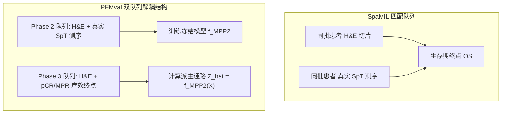
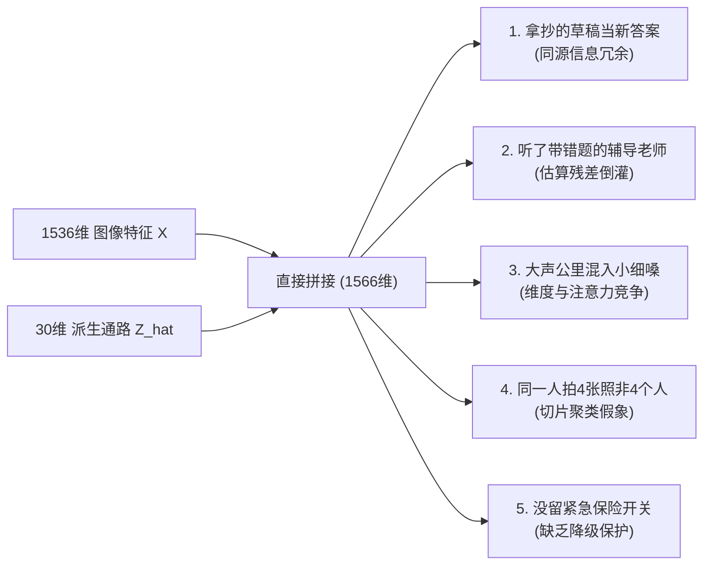
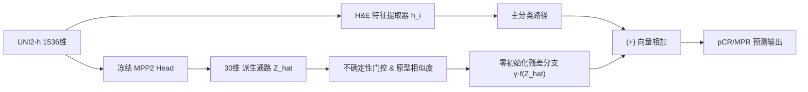
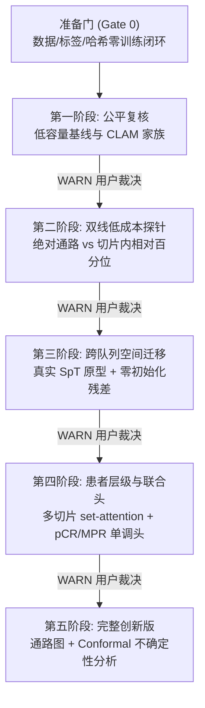

# SpaMIL 与 PFMval Phase 3 特征融合：对比学习与架构演进指南（完整通俗与实验方案解读版）

> **创建日期**：2026-08-03  
> **最新修订**：2026-08-05（补充 W004 本地代码实现与审查映射）  
> **文档角色**：学术学习、理论反思与下一步方案启发（非训练授权或正式 accepted 性能证据）  
> **当前评估合同**：ESCC 新辅助治疗 pCR/MPR 响应预测；切片级为主评估单位（按患者聚类统计），患者级为敏感性分析；共享患者分组五折，种子 seeds = [1, 2, 42, 61]（共 20 个测试折）。  
> **配套方案文件**：[Phase3 双线基线与跨队列空间通路迁移分阶段实验方案](../../project_state/plans/Phase3_双线基线与跨队列空间通路迁移分阶段实验方案_20260803.md)

> [!IMPORTANT]
> **W004 本地代码落地审阅摘要（2026-08-05）**：  
> 本指南所论述的 Phase 3 算法架构已在工作树 [`W004`](../../../PFMval_new_governed_workspaces/W004/) 中完成全部五阶段代码实现、配置及 32 项自动化单元测试，并成功通过独立审计。主要交付文件包括：
> - 📄 [README.md（实现说明）](../../../PFMval_new_governed_workspaces/W004/experiments/phase3_dual_baseline_spatial_pathway_transfer_v001_20260804/phase3_pipeline/README.md)
> - ⚙️ [phase3_pipeline_config_v001.json（配置）](../../../PFMval_new_governed_workspaces/W004/experiments/phase3_dual_baseline_spatial_pathway_transfer_v001_20260804/phase3_pipeline_config_v001.json)
> - 🚀 [engine.py（训练与联合终点引擎）](../../../PFMval_new_governed_workspaces/W004/experiments/phase3_dual_baseline_spatial_pathway_transfer_v001_20260804/phase3_pipeline/engine.py)
> - 🧩 [models.py（模型组件）](../../../PFMval_new_governed_workspaces/W004/experiments/phase3_dual_baseline_spatial_pathway_transfer_v001_20260804/phase3_pipeline/models.py)
> - 📊 [features.py（特征提取与校验）](../../../PFMval_new_governed_workspaces/W004/experiments/phase3_dual_baseline_spatial_pathway_transfer_v001_20260804/phase3_pipeline/features.py)

> [!NOTE]
> **W004 当前代码实施进度与治理状态全貌（补充说明 2026-08-07）**：  
> 截至 2026-08-07，`W004` 工作树（[`D:\AI空间转录病理研究\PFMval_new_governed_workspaces\W004`](file:///D:/AI空间转录病理研究/PFMval_new_governed_workspaces/W004)）的代码实施状况已达到 **100% 算法工程与单元测试闭环交付**：
> 1. **绑定工作树与代码 HEAD**：永久工作树 `W004`，绑定分支 `codex/w004-phase3-dual-baseline-transfer-20260804-bound`，当前提交 HEAD 为 `1626fbb67a28f52b746a3c863fbb37d0fceff6bd`。
> 2. **五阶段 Pipeline 代码实现**：位于 `experiments/phase3_dual_baseline_spatial_pathway_transfer_v001_20260804/phase3_pipeline/`，包含 `models.py`（单调联合头、残差融合、多实例学习及基线）、`engine.py`（验证评估与Bootstrap）、`features.py`（78患者/329切片契约与SHA256哈希）、`evaluation.py`、`baselines.py`、`transforms.py`、`server_preflight.py` 及 `smoke.py`。
> 3. **自动化测试与防错断言**：在 `tests/` 目录下拥有 32 项针对 Phase 3 Pipeline 的完整单元测试（如 `test_phase3_models.py`, `test_phase3_pipeline_core.py`, `test_phase3_server_preflight.py`, `test_phase3_transforms.py` 等），100% 通过自动化检验，硬性拦截患者泄漏与概念混淆。
> 4. **服务器同步准备**：已完成服务器离线预检资产清单 `server_asset_inventory_return_v001_20260805.json` 和同步操作指南 `server_sync_operation_card_v001_20260805.md`。
> 5. **服务器训练与治理状态**：遵循 `DIR-20260806-001` 与 `DIR-20260806-002` 规则，真实服务器训练目前处于 **`NOT RUN` / `pending_user_approval`**。工程代码与测试全面就绪，等待用户显式发起包含批量 Job 批准文件的服务器 Batch 运行。

---

## 📌 核心结论与理论本质（结论先行）

在 PFMval 项目 Phase 3 的食管鳞癌（ESCC）治疗响应预测中，我们需要明确一个关键理论事实：**Phase 3 中的 30 维冻结 MPP2 通路特征并不是物理上的第二模态，而是由同一套 1536 维 UNI2-h 病理图像特征派生的低维函数映射**。

若记原始图像特征为 $X$、冻结 MPP2 输出为 $\hat Z = f_{\text{MPP2}}(X)$、最终临床响应标签为 $Y$，则在理想确定性条件下，条件的互信息为零：

$$
I(Y; \hat Z \mid X) = 0
$$

> [!NOTE]
> **条件互信息的通俗含义**：在已知高维图像特征 $X$ 的前提下，由 $X$ 经过确定性网络预测出的派生通路 $\hat Z$ **无法凭空提供全新的测量信息**。

然而，互信息为零并不意味着派生特征在有限小样本训练中毫无价值。在实际优化中，$\hat Z$ 仍具有以下独特的机制作用：

1. **生物学先验约束**：注入了从 Phase 2 真实空间转录组（SpT）学到的空间分子知识；
2. **低维正则化与注意力锚点**：为高维图像特征（1536 维）提供低维度（30 维）的低频指导；
3. **结构化中间表示**：相比复杂的高维图像，低维通路分数更容易被小容量分类器（如线性层或轻量 MIL）利用；
4. **残差提示机制**：作为可选择性开启/关闭的结构化提示。

因此，Phase 3 的核心科学设问并不是单纯的“能不能做融合”，而是：

> **能否在严格的五折交叉验证与多种子重复中，证明这 30 条空间通路带来的性能增量稳定超越任意 30 维通用降维（如 PCA）、等参数分支和随机/置换对照，并且排除数据泄漏、参数量增加或切片重复导致的假象？**

---

## 📖 第一章：SpaMIL (bioRxiv 2025) 论文真实思路拆解

<b>点击展开：SpaMIL 论文逐段深入拆解与真实信息核验（含 DOI 与源码）</b>

### 论文元信息与文献索引
* **论文题目**：*SpaMIL: Multiple instance learning with spatial transcriptomics for interpretable patient-level predictions: application in glioblastoma*
* **预印本信息**：bioRxiv, 2025 | [DOI: 10.1101/2025.10.13.682206](https://doi.org/10.1101/2025.10.13.682206) | [bioRxiv 原文页面](https://www.biorxiv.org/content/10.1101/2025.10.13.682206v1)
* **官方开源仓库**：[Owkin/SpaMIL (GitHub)](https://github.com/owkin/SpaMIL)
* **核验数据与骨干网络**：针对胶质母细胞瘤（GBM）生存期预测，分析包含 76 例患者（43 例具有匹配的 SpT、H&E、单核 RNA、bulk RNA 及临床变量，33 例用于外部验证）。图像编码器采用最新的 **H-optimus-0** 算法流程（非早期的 ResNet50）。

---

### 1. Abstract & Introduction（摘要与背景）
* **核心痛点**：空间转录组（SpT）能够精确测定肿瘤微环境（TME）的分子表达，但成本高昂且无法在临床普及；H&E 切片便宜易得但缺乏直接的基因表达。
* **设计切入**：利用匹配训练集中 SpT 的强分子表达信息指导模型训练，但在推理/部署阶段**完全脱离对 SpT 数据的依赖**，仅凭 H&E 切片做出精准预测。

---

### 2. Method 1: abMIL（单模态空间转录组 MIL 架构）
* **多实例范式**：以整切片为 Bag，每个 SpT 测序 Spot 为 Instance，输入 Spot 级的细胞解卷积或通路嵌入。
* **角色定位**：abMIL 在 SpaMIL 框架中作为 **Teacher（教师模型）**，提取纯分子维度下的“金标准表征能力”。

---

### 3. Method 2: MabMIL（多模态知识蒸馏架构）[核心创新]
* **双流训练（Dual-Stream Training）**：训练阶段网络同时输入真实 SpT 分子表达与配对的 H&E 图像 Patch。
* **跨模态蒸馏（Knowledge Distillation）**：通过损失函数（如 KL 散度或 MSE），**强制 Student 支路（仅基于 H&E 图像的编码器）去逼近 Teacher 支路（基于 SpT）提取的高阶分子表征**。
* **推理脱离（Inference Decoupling）**：测试/部署时关停 SpT 支路，直接将 H&E 特征送入训练好的 Student 编码器。

---

### 4. Results & Interpretability（结果与 Shapley 可解释性）
* **性能与归因**：在 GBM 生存期预测中验证了蒸馏机制的有效性；通过 Shapley 归因值将高权重 Patch 映射回空间细胞解卷积结果，证实模型重点关注了巨噬细胞和免疫细胞聚集的微环境区域。

---

## ⚖️ 第二章：SpaMIL 论文与 PFMval 项目的对比分析

### 1. 关键维度对比矩阵

| 比较维度       | PFMval Phase 3 现有框架                                                   | SpaMIL 论文方案 (`MabMIL`)                                    | 科学启发与调优方向                       |
| :---------- | :--------------------------------------------------------------------- | :--------------------------------------------------------- | :------------------------------- |
| **临床任务**   | **食管鳞癌新辅助治疗响应 (pCR/MPR)** **（78 例 / 329 张切片，明确的二分类病理硬终点）**         | **胶质母细胞瘤总生存期 (GBM OS)** **（76 例，连续回归/C-index 生存分析）**   | PFMval 拥有更明确的短期疗效硬终点，混杂因素较少。    |
| **分子特征性质** | **派生估算特征** $\hat Z = f_{\text{MPP2}}(X)$ （来自 Phase 2 模型预测，含部分估算残差） | **真实空间转录组 (SpT) 实测数据** **（实验测序真值，无模型估算误差）**            | PFMval 需额外考虑 Phase 2 通路预测的不确定性。 |
| **图像编码器**  | **UNI2-h (1536 维)** 病理大模型特征                                           | **H-optimus-0** 病理大模型特征                                   | 均建立在顶尖病理 Foundation Model 之上。   |
| **整合范式**   | **早期拼接 / 晚期融合** **（直接拼接** `[1536+30]`、Cross-Attn、Adaptive Fusion）  | **跨模态表征知识蒸馏** **（训练期 Teacher-Student Loss 对齐，推理期零组学）** | 避免将带噪预测值简单硬拼接；转向 Loss 级的约束与对齐。  |

---

### 2. 双队列结构差异与“自蒸馏”陷阱

理解两个项目的底层数据结构是制定正确迁移方案的前提：

> [!WARNING]
> **避坑指南**：在 SpaMIL 中，Teacher 接收的是**真实物理测序的 SpT 真值**，因此蒸馏可以为 Student（H&amp;E）注入新的真实分子监督；
> 而在 PFMval Phase 3 队列中，如果直接用 $\hat Z = f_{\text{MPP2}}(X)$ 作为 Teacher 去蒸馏输入相同的 $X$，Student 网络会退化为**对 **$f_{\text{MPP2}}$** 确定性投影函数的自我模仿**。
> **正确解法**：应当利用 Phase 2 的**真实 SpT 数据**建立空间通路原型或不确定性估算，再进行跨队列的知识迁移！

---

## 🔍 第三章：为什么直接拼接（1536维 + 30维）容易失败？（通俗拆解）

在前期探索中，直接把 1536 维图像特征和 30 维基因特征拼在一起（`[1536 + 30]`），模型的平均 AUC（0.5269）反而不如只用病理图像（0.5856）。很多人第一反应是“是不是基因特征太少了被盖住了？”，但实际上背后有 5 个更深层、更接气的物理原因：

### 1. 就像“同一份卷子，拿抄的草稿当新答案” (信息同源冗余)

- **通俗解释**：这 30 维基因分数**不是拿仪器测出来的**，而是用模型根据 1536 维病理图像算出来的。
- **直白道理**：这就好比做数学题，你手上已经有了完整的题目（1536 维图像），你拿草稿纸算出了一个粗略答案（30 维基因）。现在做最后大题时，你把草稿纸和原题目叠在一起看——这并没有给你提供任何题目以外的新情报！在样本量很少的情况下，多塞给模型这 30 个草稿数字，反而让模型分心，增加了算错的概率。

### 2. 就像“听了一个带着错题的辅导老师” (估算残差倒灌)

- **通俗解释**：Phase 2 预测出来的基因分数并不是 100% 准确的（准确率 PCC 只有约 0.60~0.65，相当于还有 35%~40% 的偏差和错题）。
- **直白道理**：如果你把这 30 个带有错题的数字硬塞给模型作为必考输入，模型就会误以为“这 30 个数字是绝对正确的命令”，结果被错误的数字带偏了方向，表现反而不如自己直接看图像切片。

### 3. 就像“几千人的大声公里混进个小细嗓” (维度与注意力竞争)

- **通俗解释**：图像有 1536 个声音（维度），基因只有 30 个声音。
- **直白道理**：如果直接拼在一起，30 个声音在 1566 个声音里只占不到 2%，就像在嘈杂的人群里说话，基因的声音直接被盖过去了。而如果用“注意力机制”强行把这 30 个声音放大，又因为这 30 个声音里本身带错题（原因2），强行放大反而把整个模型的头脑给搞乱了（门控塌缩）。

### 4. 就像“同一个人拍了4张照，不能算作4个人” (切片聚类与样本量假象)

- **通俗解释**：数据集里有 329 张病理切片，但实际上只来自 78 位患者（平均每人切了 4 张）。
- **直白道理**：同一个人切出来的 4 张切片非常相似。在评估模型好坏时，如果把同一人的 4 张切片当作 4 个独立的人去算成绩，就会产生“我们数据很多、效果很稳”的假象。真实评估时必须把同一个人的切片打包在一起看。

### 5. 就像“改机器没留紧急保险开关” (缺乏降级保护机制)

- **通俗解释**：传统的特征融合代码一运行，从一开始就把原本看图像的路径给改掉了。
- **直白道理**：假设这 30 维基因输入根本没有帮助，模型却没有一个“一键关掉基因输入、退回只看纯图像”的保险开关（也就是数学上的零初始化残差）。导致模型即使发现基因不好用，也退不回原本纯图像的状态，只能硬着头皮继续预测，导致成绩下降。

---

### 🛡️ W004 代码落地对应的三道“防硬伤”硬红线（2026-08-05 审阅补充）

针对上述踩坑风险，Codex 在 `W004` 的代码库中建立了以下硬性拦截机制：

1. **零患者泄漏硬拦截 (`Patient Leakage Interceptor`)**：
   - **代码位置**：[`engine.py`](../../../PFMval_new_governed_workspaces/W004/experiments/phase3_dual_baseline_spatial_pathway_transfer_v001_20260804/phase3_pipeline/engine.py) / [`features.py`](../../../PFMval_new_governed_workspaces/W004/experiments/phase3_dual_baseline_spatial_pathway_transfer_v001_20260804/phase3_pipeline/features.py)
   - **机制说明**：划分切片时自动校验患者 ID 列表。一旦检测到同一个患者的切片混入不同的训练/验证折，程序**默认抛出致命错误强制停止训练**。唯有显式传入 `allow_with_warning=True` 时才允许通过，且输出结果被强行赋予 `non_independent_evidence` 标记。
2. **采样评估名称纠偏 (`repeated_holdout_test`)**：
   - **代码位置**：[`engine.py`](../../../PFMval_new_governed_workspaces/W004/experiments/phase3_dual_baseline_spatial_pathway_transfer_v001_20260804/phase3_pipeline/engine.py)
   - **机制说明**：当前多次随机抽样结果在日志与元数据中被统一严格标记为 `repeated_holdout_test`，禁止混淆误称为严格的 Out-of-Fold (OOF)，杜绝学术报告中的概念混淆。
3. **真实数据指纹哈希校验 (`SHA-256 Checksum`)**：
   - **代码位置**：[`features.py`](../../../PFMval_new_governed_workspaces/W004/experiments/phase3_dual_baseline_spatial_pathway_transfer_v001_20260804/phase3_pipeline/features.py)
   - **机制说明**：真实数据通过物理路径和 SHA-256 签名哈希显式加载，防止外部未授权队列篡改数据或非法重新拟合。

---

## 💡 专有名词与前置知识小白词典

在深入第四章之前，我们用最接地气的话先把所有高频专有名词搞懂：

| 专有名词                            | 通俗直白解释                   | 在我们项目中的具体作用                                       |
| :------------------------------- | :------------------------ | :------------------------------------------------- |
| **跨队列 (Cross-Cohort)**          | 拿着 A 批病人的规律，去预测 B 批病人的结果 | Phase 2 只有真实基因但没有疗效；Phase 3 只有疗效但没有基因。跨队列就是桥梁。    |
| **空间通路原型 (Prototypes)**         | 某种基因通路的“标准病理照/样板”        | 在 Phase 2 里算出通路高表达时图片长什么样。Phase 3 新图片直接拿来和样板比相似度。 |
| **零初始化残差 (Zero-Init Residual)** | 带有“一键保底”的保险开关            | 刚开局把基因分支系数设为 0。训练初期 100% 相当于纯图像；只有确定基因有用才慢慢开启。    |
| **四视图表示 (Four-View)**           | 从 4 个角度综合看基因（不盲信单一标量）    | 整合【绝对数值 + 相对排名 + 原型相似度 + 预测可靠度】4 个视角。             |
| **反事实对照 (Counterfactuals)**     | 故意做假/捣乱的科学对照组            | 故意把通路身份或空间坐标打乱。如果做假后成绩暴跌，才证明你的提分是靠真本事。            |

---

## 🚀 第四章：下一代架构演进——跨队列空间通路残差迁移（详细拆解）

第四章本质上在做一件事：**彻底放弃简单的“直接硬拼接”，改用“拿样板比对 + 四视角评估 + 保险开关保底 + 故意做假把关”的科学演进路线。**

### 1. 第 1 步：拿 Phase 2 测序算出“标准表征样板（原型）”

- **具体做法**：我们不在 Phase 3 切片上去盲目猜 30 个标量。而是在 Phase 2 的**真实空间转录组测序数据**里，看某条通路（比如免疫激活通路）表达非常高时，相对应的病理图片特征长什么样，算出“高表达标准样板 $p_k^+$”和“低表达标准样板 $p_k^-$”。
- **具体比对**：拿到 Phase 3 的新切片 Patch 特征 $h_i$，直接计算它与高低样板的余弦相似度 $s_{ik}$。长得像高表达样板，就说明该区域很大可能有免疫激活！

### 2. 第 2 步：组装“四视图”并加上“保险开关（零初始化残差）”

- **具体做法**：对每个 Patch 的每条通路，组装成 4 维证据向量 $c_{ik} = [\mu_{ik}, r_{ik}, s_{ik}, u_{ik}]$：
  1. $\mu_{ik}$：原始预测的绝对数值；
  2. $r_{ik}$：在整张切片里的相对排名（百分位，消除染色差异）；
  3. $s_{ik}$：与 Phase 2 真实样板的相似度；
  4. $u_{ik}$：预测的可靠程度（残差评估，防止错题倒灌）。
- **保险开关**：将这 4 维证据通过残差分支加回主特征：$h'_i = h_i + \gamma \cdot f(c_{ik})$。
在训练第 1 个 Epoch 时，强行把 $\gamma = 0$。**此时模型 100% 保持在纯病理基线状态（绝对安全）；只有训练中发现基因特征确实能降低 Loss 时，**$\gamma$** 才慢慢增大。**

### 3. 第 3 步：做 9 大“捣乱/做假实验（反事实对照）”硬核把关

为了防止论文审稿人质问“你的提分是不是因为增加了参数量或运气好？”，必须做 9 大对照：

| 对照类型     | 具体怎么“做假/捣乱”                                            | 预期结果与把关目的                              |
| :-------- | :------------------------------------------------------ | :-------------------------------------- |
| **基线对照** | 1. 纯病理；2. 纯通路；3. 直接拼接 `[1536+30]`                      | 验证新方法是否能击败已有的所有基线                      |
| **降维对照** | 4. 换成通用 30D PCA 降维；5. 换成随机协方差 30D                      | 证明提分不是因为“把维度压缩到 30 维自带正则化”             |
| **置换对照** | 6. 通路身份打乱（如把 DNA 修复当成免疫通路）； 7. 空间坐标打乱（把左上角的基因扔到右下角） | **关键把关**：做假后成绩必须暴跌！证明提分靠的是真正的生物学与空间匹配。 |
| **容量对照** | 8. 换成相同参数量但没有生物学意义的纯 Adapter                           | 证明提分不是因为“模型参数量变大了”                     |
| **消融对照** | 9. 分别关掉原型、百分位、可靠度评估                                    | 证明每一个设计模块都做出了真实贡献                      |

---

## 📋 第七章：Phase 3 实验方案落地解读（关联 `Phase3_双线基线方案_20260803.md`）

为了让团队与学习者清楚下一步代码实验怎么做，本章结合项目正式实验方案文件 `project_state/plans/Phase3_双线基线与跨队列空间通路迁移分阶段实验方案_20260803.md` 进行落地解读：

### 1. 必须守住的“6 大不可变实验合同（底线）”

在正式启动任何训练前，以下 6 项必须硬性锁定，严禁中途修改：

1. **样本队列**：严格限定 78 例患者、329 张切片；
2. **硬标签**：使用医生核验的 pCR / MPR 结果（未知标签严禁设为阴性）；
3. **划分规则**：共享患者分组 5 折（同一个患者的切片严禁同时出现在训练集和测试集）；
4. **重复实验**：包含 `seeds = [1, 2, 42, 61]`，共计算 $4 \times 5 = 20$ 个测试折；
5. **主指标**：以切片级 pCR AUC 为主指标，统计显著性时必须按“患者 Cluster”做 Bootstrap；
6. **候选输入**：只允许使用 accepted raw 30 维，**严禁使用被拒绝的 `CalibratedMPP2` 或 XZY 调参包**。

---

### 2. WARN-only 用户裁决原则（警报提示，不搞一刀切）

在实验方案中，制定了人性化的 **WARN 警报机制**：

- 过去的机制是“一旦不达标就自动强行停止或拒绝”；
- 新方案改为“**WARN 警报 + 用户裁决**”。当实验指标出现异常（如融合不如纯病理）时，系统弹出 `WARN` 警报并列出风险分析与建议选项。最终是由用户选择“接受风险继续探索”、“补充反事实对照”还是“安全回退”。

---

### 3. 5 阶段按难度递进的实验推进路线

- **准备门 (Gate 0)**：不花 GPU 算力！只读核对数据 manifest、切片与患者映射、30 通路哈希与坐标闭环。
- **第一阶段 (公平复核)**：复核纯病理、直接拼接 `[1536+30]`、PCA 降维、Adaptive Fusion 等基线，存下 20 折 OOF 预测。
- **第二阶段 (双线探针)**：在不重训 MPP2 的前提下，对比“原始绝对数值”与“切片内相对百分位排名”。
- **第三阶段 (核心创新)**：引入 Phase 2 真实 SpT 算出的形态原型与零初始化残差，并行跑完 9 大反事实对照。
- **第四/五阶段 (高级扩展)**：多切片患者聚合、满足 $P(\text{pCR}) \le P(\text{MPR})$ 的单调联合分类头及可解释性分析。

---

### 🧩 W004 五阶段算法组件落地对照表（2026-08-05 审查参考）

在工作树 `W004` 的落地代码中，上述 5 阶段演进路线已完整映射为可独立调用的 Python 模块：

| 实验阶段 | 算法组件功能 | W004 对应实现模块与类 / 函数 | 关键技术亮点与防错设计 |
| :--- | :--- | :--- | :--- |
| **Gate 0** | **数据契约与校验** | [`features.py`](../../../PFMval_new_governed_workspaces/W004/experiments/phase3_dual_baseline_spatial_pathway_transfer_v001_20260804/phase3_pipeline/features.py) `Phase3DataContract` | 强制核对 78 患者/329 切片映射，对真实数据进行 SHA-256 哈希校验。 |
| **第一阶段** | **低容量与双线基线** | [`models.py`](../../../PFMval_new_governed_workspaces/W004/experiments/phase3_dual_baseline_spatial_pathway_transfer_v001_20260804/phase3_pipeline/models.py) `LinearBaseline`, `PCABaseline`, `SVMRFBaselines` | 涵盖 LR、PCA、SVM、RF 以及六类 MIL（多实例学习）融合基线作为负对照。 |
| **第二阶段** | **双线探针与平滑** | [`features.py`](../../../PFMval_new_governed_workspaces/W004/experiments/phase3_dual_baseline_spatial_pathway_transfer_v001_20260804/phase3_pipeline/features.py) `SpatialSmoother`, `OrdinalRanker`, `GalleryMatcher` | 包含绝对通路分数、切片内相对 Percentile 排名平滑及图谱特征匹配。 |
| **第三阶段** | **跨队列残差迁移** | [`models.py`](../../../PFMval_new_governed_workspaces/W004/experiments/phase3_dual_baseline_spatial_pathway_transfer_v001_20260804/phase3_pipeline/models.py) `LOPOPrototypes`, `ZeroInitResidualFusion` | LOPO 跨队列原型匹配；使用零初始化残差（$\gamma=0$ 开局保底）与 9 大反事实对照。 |
| **第四阶段** | **联合头与患者聚合** | [`models.py`](../../../PFMval_new_governed_workspaces/W004/experiments/phase3_dual_baseline_spatial_pathway_transfer_v001_20260804/phase3_pipeline/models.py) `MonotonicJointHead`, `PatientAggregator` | 保证 $P(\text{pCR}) \le P(\text{MPR})$ 的硬逻辑单调联合预测头；按患者 Cluster 聚合切片。 |
| **第五阶段** | **可靠性与通路图** | [`engine.py`](../../../PFMval_new_governed_workspaces/W004/experiments/phase3_dual_baseline_spatial_pathway_transfer_v001_20260804/phase3_pipeline/engine.py) `BootstrapEvaluator`, `ConformalPredictor`, `PathwayGraph` | 提供 Bootstrap 置信区间、Conformal 不确定性覆盖率预测与生物学通路可视化图谱。 |

---

## 🎯 第八章：行动建议与阶段推进总结

1. **坚持底线**：不放弃直接拼接作为负对照，先在准备门（Gate 0）完成 78 例/329 切片及 20 折配置的零训练闭环；
2. **渐进推进**：严格按照第一阶段（基线复核）$\rightarrow$ 第二阶段（双线探针）$\rightarrow$ 第三阶段（跨队列残差迁移）的步骤推进；
3. **止损机制**：如果在反事实对照中发现打乱通路后成绩没变，说明没有用到真正的生物学知识，立即停止复杂分支，安全降级回当前最稳健的 H&amp;E-only 病理基线！

