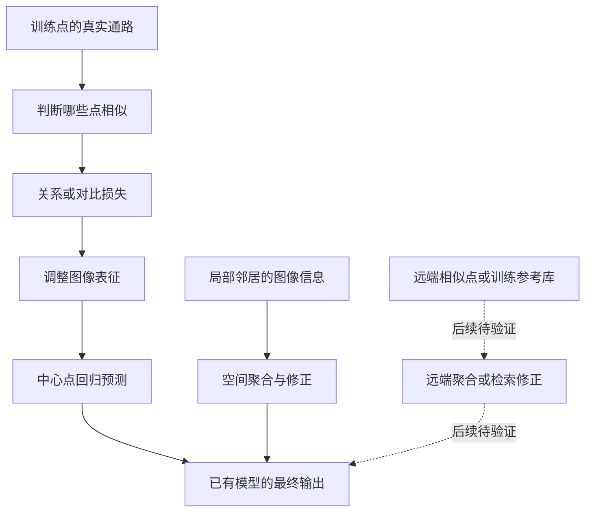
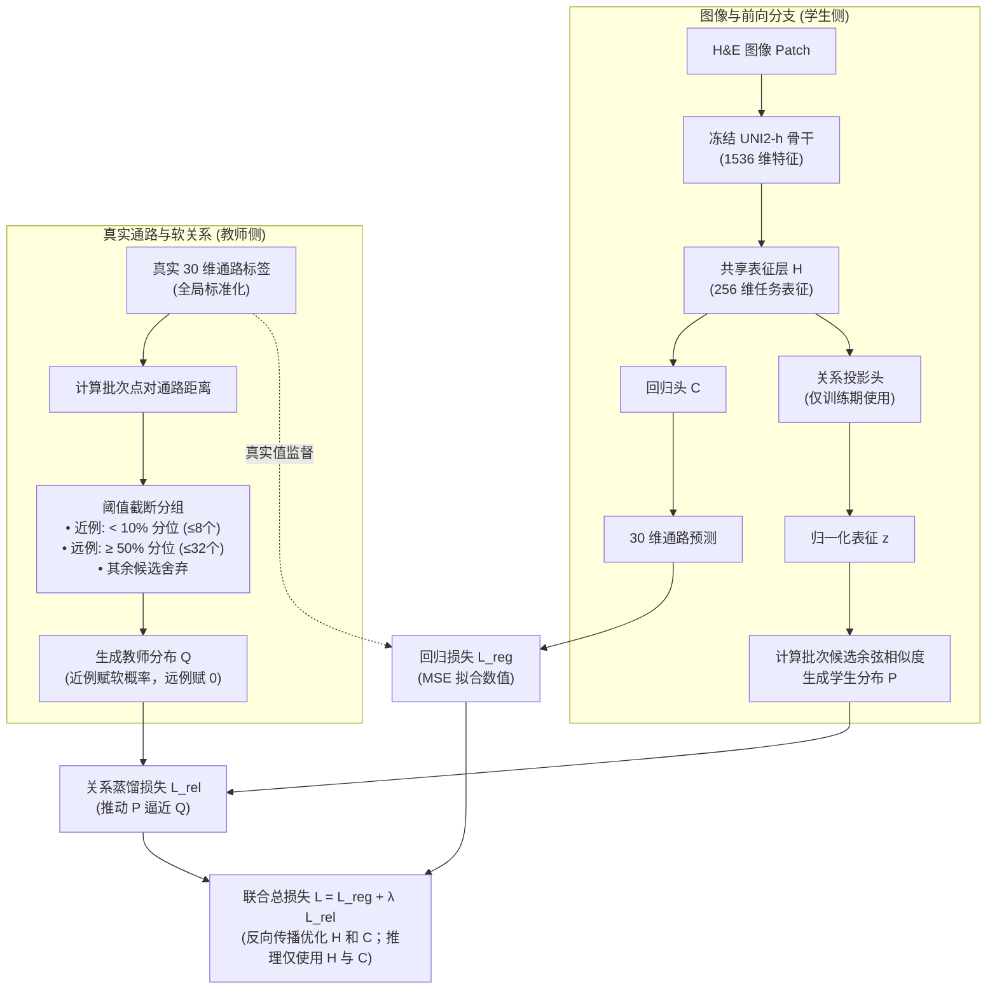
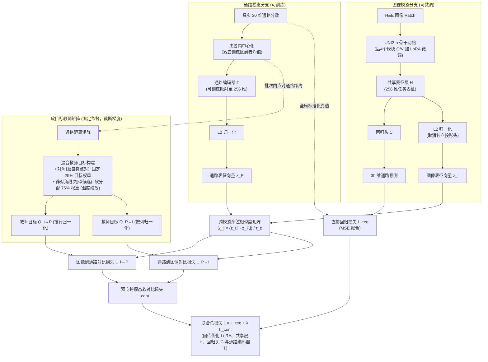

# 从“学会相似”到“借助相似点预测”

## 三轮软连接实验中的对比学习：设计、结果与下一步

2026 年 9 月 12 日｜学习报告

我们最初引入对比学习，是希望模型不只记住“这一张病理图对应多少通路分数”，还能够理解“哪些图像背后的生物学状态相近”。三轮实验之后，这个想法需要被拆成两个问题：**模型有没有学到有意义的相似关系？这些关系有没有被用来改善最终预测？**

现有结果显示，关系监督确实改变了表征，却没有带来清楚、稳定的额外预测收益；局部空间处理则多次获得改善。下一步值得优先验证的，是把相似关系接入实际预测，看看远端参考点能否提供局部邻域以外的帮助，再决定怎样加强对比学习。

本文结合[网页端三轮分析对话](chatgpt-conversation://6aa3aeab-dbb8-83ea-bd69-437b25707ba1)、本地实验代码和结果表，以及重新查阅的论文整理。数值来自已有回传分析，本次没有重跑训练或重新计算逐点预测。按最新[实验登记表][registry]，三轮运行结果均已接纳；接纳运行事实不等于确认所有机制解释。旧报告中“第一、二轮待审”的文字已经滞后。

## 一、先弄清楚：“软连接”到底连接了什么？

我们的基本任务，是输入一个点位的 H&E（苏木精—伊红染色）病理图像，预测这个点位的 30 条 ssGSEA（单样本基因集富集分析）通路分数。UNI2-h（病理图像基础编码器）先生成 1536 维图像特征，共享层 H 将它变成 256 维任务表征，回归头 C 再输出 30 个分数。[第一轮模型实现][model1]

这里有三种不同的学习或预测方式。

**直接回归教模型“答案是多少”。** 比如某个点的真实分数较高，预测却偏低，训练就把这个输出向上调整。每个点都有自己的数值答案。

**对比学习教模型“谁和谁应该相似”。** 假设切片上的甲、乙两点距离很远，却有相近的通路状态；另一个离甲很近的丙点，通路状态反而不同。关系监督可以要求甲、乙的表征更接近，而不因为甲、丙物理相邻就认定它们生物学上相似。这样做希望图像表征能够按任务相关的信息组织起来。

**邻域聚合让模型预测时“参考其他点”。** 预测甲点时，真的读取其他点的图像特征或预测分数，用来修正甲点。这一步改变了预测可使用的信息范围。

前两轮对比学习走的是上半条路：其他点参与训练监督，帮助调整参数；最终输出却没有直接读取这些远端点的内容。空间分支走的是另一条路：邻居的信息进入了预测计算。

还要特别区分两个“远”：**第一轮的“远例”，指通路分数差异大的样本，通常作为负例；你现在关心的“远端点”，指物理位置不相邻、但可能有参考价值的点。** 物理上很远的点完全可以是通路上的近例，不能把第一轮“用了远例”理解成已经实现远端信息聚合。

## 二、第一轮：让图像关系模仿通路关系

### 当初为什么这样设计？

一个自然的出发点是：如果两个点有相近的通路状态，它们的病理图像中可能存在可共同识别的线索。只逐点拟合分数，未必能充分利用这种样本之间的联系。

我们也不希望把“不是同一个点”的样本一律视为负例。通路是连续变量，没有清楚的类别边界，因此使用软关系：相似程度可以不同，而不只有“相同”和“不同”两个选项。

### 实际流程是怎样的？

第一轮冻结 UNI2-h，只训练后面的网络。在每个训练批次内，根据真实的 30 维标准化通路分数计算点对距离，并用训练集估计的距离阈值分组：距离低于第 10 百分位的候选属于近例，最多保留 8 个；距离达到第 50 百分位的候选作为远例，最多抽取 32 个；中间部分不参与该点的关系比较。这里的候选不受物理邻域限制。

教师分布 Q（根据真值给出的相似性目标）把概率分配给近例，近例越相似，目标权重越大；远例的目标概率为零。图像侧则把 H 的输出再经过一个关系投影头，得到归一化表征 z，以表征间的相似度生成学生分布 P。关系损失推动 P 接近 Q，同时直接回归继续拟合真实通路分数。[点对构造与损失实现][relation1]

所以，更精确地说，第一轮做的是**通路监督下的图像—图像关系蒸馏**：真实通路提供关系答案，图像表征模仿这种关系。它还不是第二轮那种图像编码与通路编码直接配对的跨模态对比。

### 核心对比学习公式：关系蒸馏损失

第一轮的对比学习本质上是软标签驱动的单模态关系蒸馏。设一个训练批次包含 $B$ 个样本点，关键计算步骤如下：

1. **真实通路距离与截断候选集**：
   计算批次内任意两点 $i, j$ 在 $D=30$ 维标准化通路真值下的均方距离：
   $$
   d_{ij} = \frac{1}{D} \sum_{d=1}^D (y_{i,d} - y_{j,d})^2
   $$
   根据训练集预估的分位数阈值 $q_{10}$（第 10 百分位）与 $q_{50}$（第 50 百分位）对候选点划分：
   - **近例集合 $\mathcal{N}_i$**：满足 $d_{ij} \le q_{10}$ 的点，按距离升序截取前 $K_{\text{near}} \le 8$ 个；
   - **远例集合 $\mathcal{F}_i$**：满足 $d_{ij} \ge q_{50}$ 的点，随机采样 $K_{\text{far}} \le 32$ 个；
   - 候选对比集合记为 $\mathcal{S}_i = \mathcal{N}_i \cup \mathcal{F}_i$（$|\mathcal{S}_i| \le 40$）。

2. **教师软相似度目标分布 $Q$**：
   教师分布将概率质量分配给近例，近例通路距离越小，目标权重越大；远例的目标概率强制赋 0：
   $$
   q_{ij} = \begin{cases}
   \frac{\exp(-d_{ij} / \tau_y)}{\sum_{k \in \mathcal{N}_i} \exp(-d_{ik} / \tau_y)}, & j \in \mathcal{N}_i \\
   0, & j \in \mathcal{F}_i
   \end{cases}
   $$
   其中 $\tau_y$ 为教师温度超参数。该分布截断梯度，作为固定的监督目标。

3. **学生图像表征分布 $P$**：
   图像特征经共享层 $H$ 和关系投影头映射为归一化向量 $z_i, z_j$（$\|z\|_2 = 1$），在候选集 $\mathcal{S}_i$ 内计算余弦相似度并经 Softmax 归一化：
   $$
   p_{ij} = \frac{\exp(z_i^\top z_j / \tau_z)}{\sum_{k \in \mathcal{S}_i} \exp(z_i^\top z_k / \tau_z)}, \quad j \in \mathcal{S}_i
   $$
   其中 $\tau_z$ 为学生相似度温度。

4. **关系蒸馏损失与联合训练总损失**：
   在所有同时具备有效近例与远例的样本集合 $\mathcal{B}_{\text{valid}}$ 上，计算教师目标对学生分布的交叉熵损失：
   $$
   \mathcal{L}_{\text{rel}} = - \frac{1}{|\mathcal{B}_{\text{valid}}|} \sum_{i \in \mathcal{B}_{\text{valid}}} \sum_{j \in \mathcal{N}_i} q_{ij} \log p_{ij}
   $$
   训练总目标由直接回归均方误差损失 $\mathcal{L}_{\text{reg}}$ 与加权关系损失 $\mathcal{L}_{\text{rel}}$ 组成：
   $$
   \mathcal{L}_{\text{total}} = \mathcal{L}_{\text{reg}} + \lambda \mathcal{L}_{\text{rel}} = \frac{1}{|\mathcal{B}|} \sum_{i \in \mathcal{B}} \frac{1}{D} \|\hat{y}_i - y_i\|_2^2 + \lambda \mathcal{L}_{\text{rel}}
   $$
   式中 $\hat{y}_i = C(H(x_i))$。反向传播时，$\mathcal{L}_{\text{rel}}$ 的梯度仅用于调整共享表征层 $H$ 和关系投影头；在测试推理时关系投影头丢弃，仅使用 $H$ 和回归头 $C$ 输出预测。

> **公式直观解读与设计权衡**：
> 1. **为什么用均方距离 $d_{ij}$ 与截断分位数？** 生物通路分数是连续实数，没有天然的离散正负类别。如果像经典对比学习那样把所有其他点一律当作负例，会导致“同属高表达肿瘤区的两个点被强行推开”的假负例风险。因此，第一轮用 $q_{10}$ 筛选真正的生物学近邻（近例），用 $q_{50}$ 筛选显著差异点（远例），丢弃中间模糊样本，试图在连续空间中建立更稳健的相对拓扑结构。
> 2. **教师温度 $\tau_y$ 带来的隐藏缺陷**：教师概率 $q_{ij} \propto \exp(-d_{ij} / \tau_y)$ 的本意是给“更相似的近例更多权重”。但诊断中发现近例教师的归一化熵高达 0.998（极接近代表全均匀的 1.0），说明在该温度下教师把这 8 个近例打成了几乎等权，退化成了“只要是近例就全数拉近”，丧失了细粒度区分度。
> 3. **表征改变为何未能转化为预测收益？** 损失函数 $\mathcal{L}_{\text{total}} = \mathcal{L}_{\text{reg}} + \lambda \mathcal{L}_{\text{rel}}$ 中，$\mathcal{L}_{\text{rel}}$ 是反传给共享层 $H$ 的隐式正则约束，测试时关系投影头被完全剥离。模型虽然学到了几何分布更紧凑的表征，但在最终预测分数时依然只靠单点输入进行回归，并没有真正“向近邻借力”的推理机制。
>
> **源码实现核对与链接映射**：
> - 通路均方距离函数严格计算各通路均方差：[`mean_squared_pathway_distance`](file:///D:/AI空间转录病理研究/PFMval_new/experiments/phase2_softlink_local_v2/src/relations.py#L49-L53)
> - 批次候选截断与边界筛选逻辑（排除自身 $j \neq i$、近例 $\le q_{10}$ 与远例 $\ge q_{50}$）：[`build_batch_support`](file:///D:/AI空间转录病理研究/PFMval_new/experiments/phase2_softlink_local_v2/src/relations.py#L134-L208)
> - 教师目标概率计算与远例置零截断：[`teacher_q_from_distances`](file:///D:/AI空间转录病理研究/PFMval_new/experiments/phase2_softlink_local_v2/src/relations.py#L215-L216) 及 [`relation_loss`](file:///D:/AI空间转录病理研究/PFMval_new/experiments/phase2_softlink_local_v2/src/relations.py#L244-L248)
> - 图像投影表征 $L_2$ 归一化与学生余弦匹配分布：[`SoftlinkModel.relation_z`](file:///D:/AI空间转录病理研究/PFMval_new/experiments/phase2_softlink_local_v2/src/model.py#L98-L103) 及 [`relation_loss:L249-L252`](file:///D:/AI空间转录病理研究/PFMval_new/experiments/phase2_softlink_local_v2/src/relations.py#L249-L252)
> - 单点均方回归损失与联合优化目标组合：[`regression_mse`](file:///D:/AI空间转录病理研究/PFMval_new/experiments/phase2_softlink_local_v2/src/train.py#L216-L228) 及训练主循环 [`train.py:L958-L981`](file:///D:/AI空间转录病理研究/PFMval_new/experiments/phase2_softlink_local_v2/src/train.py#L958-L981)

为了区分贡献，我们比较了单点回归、回归加关系、回归加空间、关系加空间四组，并各运行三个随机种子。关系头只用于训练，不参与最终分数计算；空间分支则在训练和预测时都参与。[第一轮设计与机制报告][report1]

### 结果让我们学到了什么？

以下统一并列两种 PCC（皮尔逊相关系数）：**逐通路 PCC**先在每名患者、每条通路内计算跨点位相关，再对患者与通路等权平均；**展平 PCC**即项目所称平均池化 pooled PCC，把全部点位×通路的训练标准化 z 分数展成一个向量计算一次相关。两者衡量的内容不同，不能用一个数值更高证明另一个口径更差。表中的“±”是三个种子的样本标准差。

| 第一轮模型 | 内部逐通路 PCC | 内部展平 PCC | XZY 逐通路 PCC | XZY 展平 PCC |
| --- | ---: | ---: | ---: | ---: |
| 单点回归 | 0.6533 ± 0.0009 | 0.7985 ± 0.0002 | 0.5131 ± 0.0115 | 0.6501 ± 0.0120 |
| 单点＋关系 | 0.6530 ± 0.0010 | 0.7986 ± 0.0000* | 0.5164 ± 0.0066 | 0.6496 ± 0.0085 |
| 单点＋空间 | 0.6663 ± 0.0007 | 0.8056 ± 0.0005 | 0.5580 ± 0.0051 | 0.6783 ± 0.0081 |
| 关系＋空间 | 0.6660 ± 0.0007 | 0.8056 ± 0.0004 | 0.5582 ± 0.0035 | 0.6759 ± 0.0060 |

*关系臂内部展平 PCC 的标准差约为 0.0000102，表中因四位小数显示为 0.0000，并非没有波动。来源：[统一口径指标表][metrics]。

这一轮支持了“局部邻域能帮助预测”，却没有支持“加上通路关系监督就会稳定进一步提高预测”。关系加空间与纯空间几乎持平，因此不能把联合模型的收益整体记到对比学习名下。

但关系任务并非没有工作。固定训练诊断中，加权关系梯度约为回归梯度的 20%–27%，学生也给近例分配了较高概率。真正值得追问的是，它学到的关系为什么没有转化成输出收益。

当时出现了三个线索。第一，近例教师的归一化熵为 0.998312，接近代表均匀分配的 1：教师更擅长告诉模型“这一群相似”，对群内谁更相似的区分很弱。第二，近例中同患者比例为 58.24%，远例中只有 7.61%，关系目标明显带有患者相关性。第三，同一训练诊断中，关系臂相对单点臂的共享表征变化约 13.18%，预测却只变化约 1.916%。[第一轮诊断分析][report1]

这些现象引出了第二轮的假设：**教师是否太粗？模型是否过多利用患者差异？独立关系头是否吸收了调整，却没有充分帮助回归？冻结图像骨干是否限制了任务适配？** 它们是待检验的解释，不能改写成“已经证实没有梯度”“只学到了染色”或“参数一定不够”。

## 三、第二轮：把关系监督直接接到图像—通路对齐上

第二轮代码包名为 `phase2_softlink_contrastive_v3`（对比学习实验包），实际执行的是 v4 设计。它围绕第一轮的疑点，做了四个重要调整。[第二轮最终方案][plan2]

### 先让两个模态真正对齐

这次取消独立的图像关系投影头，直接将共享表征 H 归一化后用于对比。另一侧新增一个可训练的通路编码器 T，把 30 维通路变成 256 维表征。于是比较对象从“图像甲与图像乙”，变成“图像甲与通路乙”，并同时计算图像到通路、通路到图像两个方向的损失。[第二轮模型][model2]

这里容易误解“教师”的含义：**由真实通路距离产生的目标概率是固定监督，不接受梯度；通路编码器 T 本身则参与训练。** 对比损失既影响图像任务表征，也训练通路编码器，而回归头仍负责预测数值。[第二轮损失][loss2]

### 再把“同点匹配”和“相似点匹配”放在一起

第二轮不再只在截取的近例内部给软权重，而是比较批次内所有不同点。目标概率中，25% 留给同一个点的图像—通路配对；剩下的 75% 按通路距离分配给其他候选。不同点只要状态相似，也可以得到较大的目标权重。

这个设计同时表达了两件事：“自己的真实通路是重要配对”，以及“与自己相似的其他点也不该被一律排斥”。温度参数控制权重的尖锐程度；本轮依据训练批次的分布选择教师温度，试图避免第一轮近例几乎等权的情况。图像到通路和反方向的概率分别归一化。[目标构造实现][loss2]

### 用患者内中心化，尝试减少整体水平差异的干扰

所谓患者内中心化，是用每个训练点的通路分数，减去该患者训练区域的平均通路分数。假设甲患者某通路整体较高，乙患者整体较低，中心化后比较的更接近“这个点相对自己患者平均水平高了多少”，而非只比较绝对水平。

这项操作用于关系教师及通路编码器的输入。**回归目标仍是原来的全局训练标准化通路分数，没有跟着改成患者内相对分数。** 患者均值也只由训练区域计算，不需要在预测新患者时读取其真实通路。

它能够改变关系监督偏好的相似性，但不能简单称为“去除染色影响”：患者均值也可能包含真实生物差异。去掉哪些差异有利、损失哪些差异有害，需要由任务结果判断。

### 核心对比学习公式：双向跨模态软对比损失

第二轮将单模态关系蒸馏升级为真正的双向跨模态对比学习，同时引入患者内中心化和软标签平滑机制。在一个大小为 $B$ 的训练批次中，完整计算步骤如下：

1. **患者内通路中心化**：
   对于批次内属于患者 $p$ 的样本点 $i$，计算其通路在患者内的相对偏差向量：
   $$
   \tilde{y}_i = y_i - \bar{y}_{\text{patient}(i)}
   $$
   其中 $\bar{y}_{\text{patient}(i)}$ 为训练集对应患者切片区域的通路均值。该处理仅作用于通路编码器 $T$ 的输入及教师相似度距离计算，回归头的拟合目标仍保留原始的全局标准化真值 $y_i$。

2. **混合教师软目标矩阵构建**：
   批次内任意两点 $i, j$ 之间的中心化通路均方距离为 $D_{ij} = \frac{1}{D} \|\tilde{y}_i - \tilde{y}_j\|_2^2$。
   针对非自身候选点（$j \neq i$），基于通路距离与温度参数 $\tau_y$ 分别计算行向（图像到通路）与列向（通路到图像）软相似度分布：
   $$
   \begin{aligned}
   \bar{q}_{I \to P}(i, j) &= \frac{\exp(-D_{ij} / \tau_y)}{\sum_{k \neq i} \exp(-D_{ik} / \tau_y)}, \quad (j \neq i) \\
   \bar{q}_{P \to I}(j, i) &= \frac{\exp(-D_{ij} / \tau_y)}{\sum_{k \neq j} \exp(-D_{kj} / \tau_y)}, \quad (i \neq j)
   \end{aligned}
   $$
   融合对角线自身匹配先验权重 $\rho = 0.25$ 与非自身相似点软权重 $1 - \rho = 0.75$，构造独立的双向教师概率目标矩阵：
   $$
   \begin{aligned}
   Q_{I \to P}(i, j) &= \rho \cdot \mathbb{I}(i = j) + (1 - \rho) \cdot \bar{q}_{I \to P}(i, j) \\
   Q_{P \to I}(j, i) &= \rho \cdot \mathbb{I}(i = j) + (1 - \rho) \cdot \bar{q}_{P \to I}(j, i)
   \end{aligned}
   $$
   两组目标矩阵均满足 $\sum_j Q_{I \to P}(i, j) = 1$ 和 $\sum_i Q_{P \to I}(j, i) = 1$，且在反向传播中完全截断梯度。

3. **双向跨模态预测概率与软对比损失**：
   图像表征经共享层 $H$ 并做 $L_2$ 归一化：$u_i = \frac{h_i}{\|h_i\|_2}$；通路表征经可训练编码器 $T$ 映射后归一化：$v_j = \frac{T(\tilde{y}_j)}{\|T(\tilde{y}_j)\|_2}$。两模态表征的点积构成余弦相似度矩阵，并按温度 $\tau_z$ 缩放：
   $$
   S_{ij} = \frac{u_i^\top v_j}{\tau_z}
   $$
   模型在图像到通路和通路到图像两个方向分别计算预测匹配分布：
   $$
   p_{I \to P}(i, j) = \frac{\exp(S_{ij})}{\sum_{k=1}^B \exp(S_{ik})}, \quad p_{P \to I}(j, i) = \frac{\exp(S_{ij})}{\sum_{k=1}^B \exp(S_{kj})}
   $$
   双向软对比损失定义为两个方向软交叉熵的等权平均：
   $$
   \begin{aligned}
   \mathcal{L}_{I \to P} &= - \frac{1}{B} \sum_{i=1}^B \sum_{j=1}^B Q_{I \to P}(i, j) \log p_{I \to P}(i, j) \\
   \mathcal{L}_{P \to I} &= - \frac{1}{B} \sum_{j=1}^B \sum_{i=1}^B Q_{P \to I}(j, i) \log p_{P \to I}(j, i) \\
   \mathcal{L}_{\text{cont}} &= \frac{1}{2} (\mathcal{L}_{I \to P} + \mathcal{L}_{P \to I})
   \end{aligned}
   $$

4. **阶段一联合训练总损失**：
   $$
   \mathcal{L}_{\text{total}} = \mathcal{L}_{\text{reg}} + \lambda \mathcal{L}_{\text{cont}} = \frac{1}{B} \sum_{i=1}^B \frac{1}{D} \|\hat{y}_i - y_i\|_2^2 + \lambda \mathcal{L}_{\text{cont}}
   $$
   其中 $\mathcal{L}_{\text{reg}}$ 负责保障单点回归的数值准确性，$\mathcal{L}_{\text{cont}}$ 联合优化图像骨干 LoRA、任务共享层 $H$ 与通路编码器 $T$。

> **公式直观解读与设计权衡**：
> 1. **为什么必须做患者内中心化 $\tilde{y}_i = y_i - \bar{y}_{\text{patient}(i)}$？** 如果直接用未中心化的通路真值计算距离，不同患者因切片染色、建库批次引起的全局上下平移，会成为极其显著的“伪特征”，导致模型走捷径——把同患者的所有点全部聚在一起（第一轮诊断中同患者近例占比高达 58.24%）。中心化消除了患者基线水平差异，迫使模型关注切片内部的微环境相对变化。但必须注意：**直接回归目标仍必须保留全局未中心化真值 $y_i$**，因为在未来部署面对未知外部测试患者时，无法预先得知未测患者的通路真实均值。
> 2. **自身匹配硬权重 $\rho = 0.25$ 与候选软权重 $1 - \rho = 0.75$ 的平衡**：跨模态对齐中，自身的病理图像与自身通路测量是天然配对（对角线硬匹配）。但如果像标准 CLIP 那样把所有非自身点一律视为负例（$\rho=1.0$），在组织切片中会带来严重错误——切片中大量具有相同生物学状态的点将被错误推开。混合目标设定了“25% 确信度保留给自身锚点，75% 概率空间按真实生物相似度分配给其他候选点”，兼顾了模态对应性与生物相似性。
> 3. **双向对称损失 $\mathcal{L}_{\text{cont}}$ 的约束逻辑**：$\mathcal{L}_{I \to P}$ 促使模型在给定图像时能在候选通路中检索出相符的生物状态；$\mathcal{L}_{P \to I}$ 反向要求给定通路时能挑出形态对应的病理切片。双向互验强化了共享表征 $H$ 的几何一致性。
> 4. **仍未带来显著预测增益的深层原因**：通路编码器 $T$ 输入的数据与回归真值来自同一批 30 维标签，并未引入新的测量模态。更关键的是，推理测试时通路编码器 $T$ 同样不参与，最终预测依然只由图像经 $H$ 和 $C$ 单路生成。如果表征层对齐的变化没有被转化为显式的信息借力机制，对比学习的收益就容易停留在表征流形重塑上，无法直接打破直接回归的精度瓶颈。
>
> **源码实现核对与链接映射**：
> - 患者内均值计算与中心化处理（减去训练区患者均值）：[`engine.py:L729-L731`](file:///D:/AI空间转录病理研究/PFMval_new/experiments/phase2_softlink_contrastive_v3/src/engine.py#L729-L731)
> - 教师均方距离矩阵计算与对角线屏蔽（`masked_fill(diagonal, -inf)`）：[`_off_diagonal_probabilities`](file:///D:/AI空间转录病理研究/PFMval_new/experiments/phase2_softlink_contrastive_v3/src/losses.py#L60-L79)
> - 混合教师目标矩阵构建（25% 对角线自身匹配 + 75% 非自身候选软概率）：[`build_teacher_targets`](file:///D:/AI空间转录病理研究/PFMval_new/experiments/phase2_softlink_contrastive_v3/src/losses.py#L82-L113)
> - 可训练通路编码器映射与双模态 $L_2$ 归一化：[`PathwayMLP`](file:///D:/AI空间转录病理研究/PFMval_new/experiments/phase2_softlink_contrastive_v3/src/models.py#L100) 及 [`losses.py:L139-L140`](file:///D:/AI空间转录病理研究/PFMval_new/experiments/phase2_softlink_contrastive_v3/src/losses.py#L139-L140)
> - 双向跨模态对称软对比损失计算：[`bidirectional_soft_contrastive_loss`](file:///D:/AI空间转录病理研究/PFMval_new/experiments/phase2_softlink_contrastive_v3/src/losses.py#L115-L150)
> - 单点回归 MSE（基于未中心化真值）与对比损失加权反向传播：[`engine.py:L735-L741`](file:///D:/AI空间转录病理研究/PFMval_new/experiments/phase2_softlink_contrastive_v3/src/engine.py#L735-L741)

### 最后允许图像骨干微调，并设置匹配对照

LoRA（低秩适配，以少量新增参数调整预训练模型）用于 UNI2-h 最后四个模块中的 Q/V（注意力查询和值映射）。主要采用秩 8，同时加入秩 2 的纯回归容量对照。这样才可以区分“微调本身有用”和“对比学习在相同微调条件下有用”。[实际配置][config2]

共同回归预热之后，阶段一额外训练五轮，比较六组：冻结纯回归、冻结加中心化对比、秩 8 纯回归、秩 8 加全局对比、秩 8 加中心化对比，以及秩 2 纯回归。下面是预设第 5 轮的结果；本轮只有种子 42，不能估计种子标准差。

| 第二轮阶段一 | 内部逐通路 PCC | 内部展平 PCC | XZY 逐通路 PCC | XZY 展平 PCC |
| --- | ---: | ---: | ---: | ---: |
| 冻结＋纯回归 | 0.664885 | 0.803442 | 0.542471 | 0.663268 |
| 冻结＋中心化对比 | 0.664886 | 0.803510 | 0.543011 | 0.663199 |
| 秩 8＋纯回归 | 0.664705 | 0.803258 | 0.538805 | 0.661085 |
| 秩 8＋全局对比 | 0.664734 | 0.803244 | 0.538685 | 0.659999 |
| 秩 8＋中心化对比 | 0.664705 | 0.803301 | 0.539280 | 0.661022 |
| 秩 2＋纯回归 | 0.664931 | 0.803361 | 0.540810 | 0.661857 |

来源：[第二轮直接指标表][metrics2]。

### 这轮究竟检验了哪些假设？

中心化确实改变了教师：分给跨患者候选的概率从约 0.411 增至 0.576。但冻结对照中加入中心化对比，XZY 逐通路 PCC 只增加约 0.00054，展平 PCC 略降；秩 8 的匹配对照也呈现相似现象。**“改变教师可以改变关系分布”得到支持，“这样就能显著提升预测”没有得到支持。**

LoRA 同样改变了图像表征，秩 8 几组在训练诊断点上的相对变化约为 4.9%–5.1%。但预测没有稳定超过冻结纯回归，因此“只是因为冻结骨干、放开微调就能恢复收益”的简单解释受到削弱。它并不能排除其他训练规模或微调方案的可能性。[第二轮机制分析][report2]

值得保留的正面发现是：**新版纯回归自身已经比第一轮单点基线更好。** 这个提高不能归给对比学习。预热、患者均衡采样、批大小、训练日程与输入处理共同变化，目前没有单独拆出谁贡献最多。

新的问题随之变得更具体：通路距离来自同一组已经用于回归的 30 维标签，它没有引入新的测量信息，可能主要提供正则约束；另一方面，即使相似关系有所改善，直接回归也未必能把这种改善充分利用起来。这两种解释值得继续区分。

## 四、第三轮：先保住预测能力，重新验证空间增量

第三轮不是“第三种更强对比损失”。它与对比学习探索有关，是因为第二轮还留下了一个干扰判断的问题：阶段一单点模型不错，阶段二接空间后却明显下降。

原因线索在训练衔接中。第二轮阶段二重新初始化了回归头 C，部分模式继承 H，但没有完整保留已经训练好的 H/C 预测器；同时改为全量训练，60 轮只有 60 次参数更新。阶段一每轮则有 148 次更新。阶段二各组最佳内部结果都在末端，不能据此认定已经充分收敛。全量每步仍看过全部训练点，所以也不能说它“少看了 148 倍数据”。[阶段衔接分析][report2]

第三轮改为完整继承第二轮的冻结纯回归 H/C，空间矩阵 B 从零开始，使起点保留原有预测能力。然后比较单点续训、固定 H/C 只学空间补偿、H/C 与空间分支共同续训。**没有 LoRA，也没有对比损失。** 第一轮的“联合”包含关系加空间；第三轮的“空间联合”只指预测器与空间分支一起训练。[第三轮模型实现][model3]

| 第三轮，种子 42 | 内部逐通路 PCC | 内部展平 PCC | XZY 逐通路 PCC | XZY 展平 PCC |
| --- | ---: | ---: | ---: | ---: |
| 来源单点／第 0 步 | 0.664881 | 0.803433 | 0.542471 | 0.663268 |
| 单点续训 | 0.666565 | 0.805146 | 未评估 | 未评估 |
| 只学空间补偿 | 0.671011 | 0.807281 | 未评估 | 未评估 |
| 空间联合续训 | 0.673404 | 0.809046 | 0.558218 | 0.672029 |
| 来源单点的固定平滑 | 0.675928 | 0.810232 | 0.577926 | 0.682147 |

来源：[第三轮内部对照][metrics3]、[三轮指标汇总][metrics]。第 0 步内部数值与第二轮略有不同，来自缓存和计算精度差异；来源 XZY 数值沿用第二轮记录。固定平滑是预设诊断，未参与本轮正式模型选择。

空间联合相对匹配的单点续训，内部逐通路 PCC 增加约 0.00684，展平 PCC 增加约 0.00390。它支持“保住可靠单点能力后，空间仍可增加收益”，削弱了“更强单点模型天然不能和空间协作”的解释。由于继承方式和训练预算一起改变，还不能分别量化二者对第二轮下降的贡献。

三轮的思路因此可以串起来：**先检验关系和空间各自有用没有；再围绕关系教师、共享表征和骨干容量改进；最后处理阶段衔接，确认已有预测能力与空间修正可以共存。** 第三轮没有重新检验改进后的对比学习，因此它既不能证明对比学习终于有效，也不能证明对比学习必须放弃。

## 五、为什么空间路线更容易看到收益？

### 它把相关信息直接带进了预测

当前空间图是一跳局部图：候选限制在 1.5 倍原生坐标步长以内，最多 8 个邻居，权重结合距离和冻结图像特征相似度。图像相似度只在这些局部候选之间发挥作用，没有进行全切片远端搜索。[第三轮空间实现][spatial3]

第一轮已有诊断显示，图上邻居的真实通路差异，比同患者随机点对低约 41%–68%。这支持邻域包含目标相关信息，却不能把相关性进一步解释成已证实的细胞通讯，也不能分离几何距离和形态加权的贡献。[邻域诊断][report1]

可以把平滑理解成多次相关预测之间的折中：同一组织区域的真实状态比较连续，而单点预测可能各自上下波动，适当平均有机会抵消部分误差。代价是边界和稀有区域也可能被抹平。因此“去掉局部波动”是合理解释，但究竟消除了哪类噪声，尚无确定答案。

### 简单平滑也是当前可学习空间模型能够表达的一种解

空间路线的核心在于直接在图结构上显式利用物理与形态近邻信息。其完整的数学形式化如下：

1. **几何与形态联合的空间邻域权重构建**：
   设同切片内样本点 $i$ 的坐标步长为 $\Delta$（原生点阵间距），在截断半径 $r \le 1.5\Delta$ 内筛选最多 $K_{\text{max}} = 8$ 个邻居记为集合 $\mathcal{N}_i$。样本间的相对几何物理距离为 $\rho_{ij} = \frac{d_{\text{euc}}(i, j)}{\Delta}$，对应冻结图像特征的余弦相似度为 $\cos(\theta_{ij}) = \frac{f_i^\top f_j}{\|f_i\|_2 \|f_j\|_2}$。
   未归一化边权重结合几何高斯衰减（空间尺度 $\sigma_{\text{dist}} = 1.0$）与形态特征加权（温度 $\tau_{\text{img}} = 0.2$）：
   $$
   w_{ij}^{\text{raw}} = \exp\left( - \frac{\rho_{ij}^2}{2 \sigma_{\text{dist}}^2} \right) \cdot \exp\left( \frac{\cos(\theta_{ij}) - 1}{\tau_{\text{img}}} \right)
   $$
   引入中心点自身单位保留权重 $w_{\text{self}} = 1.0$，归一化后的有向邻域权重为：
   $$
   a_{ij} = \frac{w_{ij}^{\text{raw}}}{w_{\text{self}} + \sum_{k \in \mathcal{N}_i} w_{ik}^{\text{raw}}}
   $$

2. **空间差分残差预测与联合训练损失**：
   设单点回归头的线性输出为 $p_i = C h_i + c$，空间模型通过一跳差分汇聚邻居隐藏表征，并经可学习空间矩阵 $B \in \mathbb{R}^{30 \times 256}$ 映射为残差增量：
   $$
   \hat{y}_i = p_i + B \sum_{j \in \mathcal{N}_i} a_{ij} (h_j - h_i)
   $$
   在第三轮空间联合续训时，损失函数直接以最终修正预测 $\hat{y}_i$ 拟合真实通路分数 $y_i$：
   $$
   \mathcal{L}_{\text{spatial}} = \frac{1}{|\mathcal{B}|} \sum_{i \in \mathcal{B}} \frac{1}{D} \|\hat{y}_i - y_i\|_2^2
   $$
   反向传播同时对空间投影矩阵 $B$、前序任务共享层 $H$ 和回归头 $C$ 进行端到端优化。

3. **固定平滑诊断及其代数等价关系**：
   相比之下，固定平滑是对单点预测分数直接进行的一跳凸平滑：
   $$
   \tilde{p}_i = p_i + \beta \sum_{j \in \mathcal{N}_i} a_{ij} (p_j - p_i)
   $$
   推理时回归头是线性读出，$p_i = C h_i + c$；两点相减后常数偏置 $c$ 抵消，即 $p_j - p_i = C(h_j - h_i)$。代入后可得：在同一预测器、同一图结构、关闭随机失活的条件下，**令可学习矩阵 $B = \beta C$，可学习空间模型就能在代数上完全表达相同的平滑输出**。这是由[模型][model3]和[平滑函数][spatial3]得到的代数关系，本次没有加载权重进行数值等价测试。

> **公式直观解读与设计权衡**：
> 1. **物理距离与形态相似度的双重约束**：边权重 $a_{ij}$ 不仅要求两点在切片物理坐标上必须处于 $1.5$ 倍原生步长内（截断空间远距离伪关联），还结合了高维形态余弦相似度进行二次调制。如果两点物理相邻但组织学形态完全不同（如基质与肿瘤上皮交界处），形态相似度项会显著拉低权重，从而在平滑噪声的同时尽可能保护组织边缘。
> 2. **差分残差形式对单点能力的无损继承**：公式设计为 $\hat{y}_i = p_i + B \sum a_{ij}(h_j - h_i)$，其优势在于当 $B=0$ 时严格退化为单点基线，为训练提供了平滑的安全起点。模型只需在已有单点预测的基础上学习邻域微调补偿，避免了多任务从头训练时破坏已有的优秀单点回归特征。
> 3. **$B = \beta C$ 等价性揭示的优化困境**：代数等价性证明了“可学习图残差”在解空间中完全包含“固定平滑解”。但实践中可学习模型难以稳定超越固定平滑，根源可能在于**优化损失与评价指标的不一致**：训练损失 $\mathcal{L}_{\text{spatial}}$ 优化的是逐点均方误差 MSE，它倾向于压低绝对偏差方差；而模型选择与评价使用的是两类 PCC（相关系数），更关注相对排序与变化趋势。可学习参数在极力压低局部数值残差时，可能反而削弱了全局相关的线性拉伸度。
>
> **源码实现核对与链接映射**：
> - 几何高斯与图像形态余弦相似度的联合邻域权重构建：[`build_spatial_graph`](file:///D:/AI空间转录病理研究/PFMval_new/experiments/phase2_spatial_warmstart_v1/src/spatial.py#L198-L215)
> - 一跳空间特征差分残差聚合实现：[`SpatialGraph.spatial_delta`](file:///D:/AI空间转录病理研究/PFMval_new/experiments/phase2_spatial_warmstart_v1/src/spatial.py#L84-L95)
> - 空间差分残差预测与零初始化矩阵 $B$ 结构：[`SpatialWarmstartModel.forward`](file:///D:/AI空间转录病理研究/PFMval_new/experiments/phase2_spatial_warmstart_v1/src/model.py#L107,L143-L150)
> - 固定空间平滑启发式实现（直接平滑单点预测）：[`SpatialGraph.smooth_predictions`](file:///D:/AI空间转录病理研究/PFMval_new/experiments/phase2_spatial_warmstart_v1/src/spatial.py#L96-L99)
> - 第三轮空间分支端到端均方误差优化损失：[`training.py:L431`](file:///D:/AI空间转录病理研究/PFMval_new/experiments/phase2_spatial_warmstart_v1/src/training.py#L431)

所以当前更具体的问题是：模型既然能表达平滑，为什么训练与选择没有稳定保留这个有效解？优化过程、参数约束以及 MSE（均方误差）训练目标与 PCC 选择指标之间的差异，都可能有关。当前空间模块也只是固定图上的一跳线性修正，不能把结果扩大解释为“复杂图神经网络普遍不行”。

固定平滑的 PCC 虽好，数值误差未必最好。例如第三轮 XZY 的 zMSE（标准化均方误差，越低越好），空间联合为 0.641845，固定平滑为 0.644739。相关性提高与分数更准确，需要同时考察。[指标汇总][metrics]

对比学习从这条路线最值得借鉴的，是**给关系一个明确的预测用途，并保留可靠的单点起点**。两种技术可以协作：对比学习帮助寻找合适的参考点，聚合模块决定如何使用参考点。

## 六、重新看论文：我们借鉴了什么，还缺什么？

本地[最初方案][plan1]记录了 DeepPathway、PEaRL 和 Reg2ST 的启发。我们选取了其中的思想，并结合自己的 30 条通路、冻结特征和空间修正重新组合，不能视为这些论文的严格复现。

**DeepPathway（通路预测模型）提供的是通路级跨模态学习的启发。** 作者仓库使用 UCell（基于基因排名的通路评分），并说明训练后可以直接预测，不必保留训练参考库。当前代码中，被 DeepPathway 类加载的变体采用同点匹配目标；另一变体才使用相似度软目标。因此，论文路线的成功不能直接证明我们按 30 维通路距离定义的软目标也会成功。[作者说明](https://github.com/aahsan045/DeepPathway)、[作者模型实现](https://raw.githubusercontent.com/aahsan045/DeepPathway/main/models.py)

**PEaRL（通路增强表征学习）提醒我们，两阶段训练的起点很重要。** 它先用同点匹配的双向对比训练表征，再冻结骨干训练预测头；分子编码器包含跨点注意力和位置编码，预处理还有八邻域平滑，通路数量为数百至上千。我们则在已有回归能力的基础上加辅助对比，再于第二阶段重置预测头。两者都叫“两阶段”，所保留与丢弃的能力却不同。它也不能证明“我们的对比收益为零，一定是容量不足”。[论文第 3.1–3.3、4.1 节](https://arxiv.org/html/2510.03455v1)

**Reg2ST（基于关系建模的空间转录组预测）对应网页对话提出的另一条线索：预测阶段仍然利用点间交互与动态图。** 它先由图像预测基因表征，再用增强图像特征与预测基因特征计算相似性，选取相似度最高的若干点建图并聚合。项目提取了图像产生消息和预测时保留上下文的思想，却将其简化为固定局部图，没有完整继承这段动态选点过程。本次通过 Europe PMC 的全文接口核对了特征融合与动态图两节；值得迁移的是“寻找相关点并用于预测”的机制，而非整套基因计数输出设计。[项目借鉴记录][plan1]、[Reg2ST 原文](https://pmc.ncbi.nlm.nih.gov/articles/PMC12360703/)

**BLEEP（双模态表达预测）和 GR2ST（图增强跨模态预测）更直接回答“学到相似之后怎么办”。** BLEEP 在共同表征空间中检索参考表达，再组合为查询点的预测。GR2ST 的预测模块同时保留直接预测和训练参考库检索，并将两者融合。这些工作说明，可以让对齐服务于实际信息读取，而不只作为回归旁边的一项辅助损失。迁移到本项目时，应研究这种机制，不照搬其基因任务的数值、损失或融合系数。[BLEEP 原文第 3 节](https://papers.neurips.cc/paper_files/paper/2023/file/df656d6ed77b565e8dcdfbf568aead0a-Paper-Conference.pdf)、[GR2ST 第 2.5 节](https://pmc.ncbi.nlm.nih.gov/articles/PMC13157223/)

**BioKERN（生物学核正则化）适合在确认检索值得做之后补读。** 这篇 2026 年 8 月的预印本把分子相似性与切片内空间关系结合成连续监督，重点评价生物学邻域检索，并用相同架构的对照区分监督与容量的贡献。它启发我们检查教师有没有教会“找到有用参考点”。但研究局限于两个单供体基准，不能作为跨患者通路 PCC 会提升的证据。[原文第 3 节及附录 I](https://arxiv.org/html/2608.24823v1)

建议阅读顺序是先看 GR2ST 的预测模块与 BLEEP 的参考库推断，再看 BioKERN 如何定义相似关系；回头读 PEaRL，则重点比较训练起点与分子信息，而非只比较网络宽度。

## 七、后续怎么做：先给远端关系一个可验证的用途

我的建议是优先验证远端信息利用，暂不把扩大 LoRA 或增强对比损失作为首要投入。这是基于现有证据提出的研究建议，尚未实施，也没有改写项目已登记的主线决定。

### 第一种尝试：同切片的远端语义邻居

先从空间上不相邻的点中，按图像或任务表征寻找相似点，聚合它们的预测，对当前已有的局部预测作小幅修正。这里的“语义”只是指任务相关的相似性，不是已知细胞类型或已证实的生物关系。

例如预测一个肿瘤点时，局部邻域告诉我们它周围是什么；同切片远处的相似肿瘤区域则可能提供另一组参考。两类信息可能互补，也可能只是重复相同的误差。我们需要直接测量哪一种情况发生。

开始时可以只做简单加权，不必立即训练深层 GNN（图神经网络）。按相似度选点并加权，已经是一种图上的消息聚合。先验证远端点有用，再增加可学习权重或复杂交互，实验结果会更容易解释。

### 第二种尝试：检索训练参考库

另一条路线是在训练集中保留图像与真实通路记录。新点根据图像找到相似训练点，将这些参考点的真实通路分数融合进自己的预测。它与上一种方法有本质不同：**同切片远端聚合使用的是其他点的预测或图像信息，训练库检索可以使用训练参考点的实测标签。**

这更贴近 BLEEP、GR2ST 的参考库思路，也更依赖训练库是否覆盖新患者的状态。参考点看起来相似，却存在患者间整体水平差异时，检索可能增加偏差。因此宜保留可靠的直接预测，让检索提供可控制的补充。

跨模态检索还要区分检索空间：原始 UNI 特征、纯回归 H、对比学习 H，可以统一做图像到图像的邻居比较；而用图像 H 去查询通路编码 T，是另一个跨模态检索实验。第二轮的跨模态对齐并不自动保证图像—图像距离也是最好的检索尺度，不能混在一个对照里解释。

### 关键比较：对比学习到底有没有帮助“找人”？

先固定同一个可靠的局部预测器，改变用于选择远端点的表征；候选范围、邻居数量、加权和融合方式保持一致。至少比较原始 UNI 特征、纯回归 H、对比学习 H 三种选择依据，并保留没有远端修正的结果。

还应加入一个同切片随机远端点对照：如果随机点平均也能获得类似收益，说明可能只是额外平均在发挥作用，尚不能归功于学习到的语义关系。

| 可能观察到的结果 | 对下一步的启发 |
| --- | --- |
| 原始或纯回归表征选出的远端点已能提高预测 | 远端信息值得利用，可以先保持简单聚合 |
| 相同聚合下，对比表征进一步提高预测 | 对比学习有了具体用途：帮助找到更有效的参考点 |
| 对比表征找到的点在真值上更相似，但预测没有提高 | 继续检查误差相关性、融合方式与分数校准 |
| 对比表征连参考点的相关性都没有改善 | 回头修改教师距离、温度、患者处理或训练方式 |
| 随机远端点也同样有效 | 相似性选择的必要性尚未得到支持 |

评价“找到的点是否在真值上更相似”，可以在内部验证结束后使用验证真值作诊断；**真值不能用于部署时选邻居，也不能回流到验证图的构造。** 同切片图只使用图像、坐标和模型预测；训练参考库只含训练标签。训练查询必须排除自身，跨患者能力则需要患者留出、按折建立参考库来检验。

参数和模型选择仍只使用训练及内部验证。XZY 只有一名患者，且已经被反复查看，不能继续根据它调整邻居数量或融合权重。现有六患者内部验证也是同患者空间块留出；同切片结果好，不自动等于新患者检索好。

如果这些比较支持对比学习有用，再强化它时目标就清楚了：让它更容易找到能纠正当前预测的参考点。可以研究按通路组定义相似性、全局水平与患者内相对变化的取舍，以及空间和分子关系怎样共同构成教师；每次仍要回到参考点质量和预测增量。对比损失下降、表征变化或参数量增加，都不能代替这两个结果。

## 八、读完后应形成的认识

第一轮让我们知道，通路关系确实能影响图像表征，但收益主要来自空间分支。第二轮对教师、共享表征和骨干适配做了实质修改，仍未显示清楚的额外预测收益。第三轮保住完整单点模型后重新获得空间增量，并进一步凸显固定平滑这个强对照。

这条路径并没有回答完“对比学习有没有价值”。它把问题推进到了更明确的位置：**我们已经试过让模型学会相似，接下来应检验模型能否借助这些相似点，作出更好的预测。** 远端聚合或训练库检索为这个问题提供了直接的检验方式；对比学习是否值得继续强化，应由它对这一过程的实际帮助来决定。

---

### 资料与后续润色说明

本文采用学习文章结构，代码链接用于核验设计，指标链接用于核验已有结果。网页对话的解释经过本地核对；论文借鉴、代码事实、结果观察与后续假设在正文中分别说明。后续可将本文交给 Gemini 3.8 Flash 做中文表达润色，本次未调用该模型。润色时请保留指标口径、结果数值、来源及“不代表机制已经证实”等判断边界，尤其保留“第三轮没有对比学习”和“远例不等于远端参考点”两个区别。

[registry]: D:/AI空间转录病理研究/PFMval_new/experiments/experiment_registry.json
[plan1]: D:/AI空间转录病理研究/PFMval_new/01_指南与解读/部署方案/Phase2软连接升级_通路关系与局部空间联合方案_v1_20260907.md
[report1]: D:/AI空间转录病理研究/PFMval_new/01_指南与解读/分析报告/Phase2软连接v2_1_实验结果与机制分析_20260908.md
[model1]: D:/AI空间转录病理研究/PFMval_new/experiments/phase2_softlink_local_v2/src/model.py
[relation1]: D:/AI空间转录病理研究/PFMval_new/experiments/phase2_softlink_local_v2/src/relations.py
[plan2]: D:/AI空间转录病理研究/PFMval_new/01_指南与解读/部署方案/Phase2软连接_对比学习改进实验方案_v4_最终建议版_20260908.md
[report2]: D:/AI空间转录病理研究/PFMval_new/01_指南与解读/分析报告/Phase2软连接改进前后对照与原因分析报告_20260910.md
[model2]: D:/AI空间转录病理研究/PFMval_new/experiments/phase2_softlink_contrastive_v3/src/models.py
[loss2]: D:/AI空间转录病理研究/PFMval_new/experiments/phase2_softlink_contrastive_v3/src/losses.py
[config2]: D:/AI空间转录病理研究/PFMval_new/experiments/phase2_softlink_contrastive_v3/config.json
[metrics2]: D:/AI空间转录病理研究/PFMval_new/experiments/results/phase2_softlink_contrastive_v3/20260909_101623_341_f0de1302/analysis/pcc_side_by_side.csv
[model3]: D:/AI空间转录病理研究/PFMval_new/experiments/phase2_spatial_warmstart_v1/src/model.py
[spatial3]: D:/AI空间转录病理研究/PFMval_new/experiments/phase2_spatial_warmstart_v1/src/spatial.py
[metrics3]: D:/AI空间转录病理研究/PFMval_new/experiments/results/phase2_spatial_warmstart_v1/warmstart_no_lora_v1/20260910_190620_252_10e4d946/analysis/arm_comparison.csv
[metrics]: D:/AI空间转录病理研究/PFMval_new/experiments/results/phase2_spatial_warmstart_v1/warmstart_no_lora_v1/20260910_190620_252_10e4d946/analysis/三轮综合分析_20260910/三轮统一口径指标.csv
