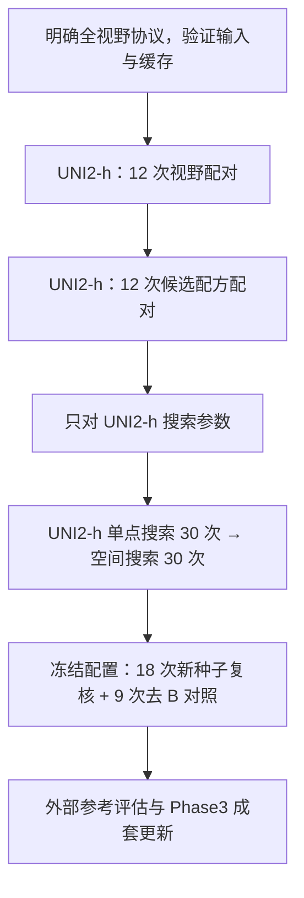

# Phase2 全视野修复与参数优化部署报告

更新日期：2026-09-16｜状态：待审查｜本轮仅核验与制定方案，未修改实验代码、重建缓存或训练模型。

本报告回答三个问题：LJQ 的新结果是否证明原模型调参不足；补回 patch（图像切块）边缘可能带来什么；下一轮应如何修复、验证和部署。参数表、文件修改位置和验收细节放在[实施细则](Phase2全视野修复与超参数重搜索_实施细则_20260916.md)，主文用于判断研究路线和工作量。

## 一、审查结论与建议

**输入边缘被额外裁去是已证实的实现行为，应建立完整视野的新输入协议；但修复不保证预测指标上升。LJQ 的结果目前也不能证明原基模因调参不足而明显受限。**

这次已找到并阅读 LJQ 的实际代码、正式批次日志和原始预测，复现了两项任务的报告数值。更有判断价值的是任务 3 全量组：它使用原通路目标，内部主指标为 **0.66625**，外部为 **0.55740**，与历史空间模型三种子均值 **0.66628 / 0.55800** 基本相当。相较之下，任务 2 的高分来自另一套通路真值，不能当作原任务的调参收益。

建议继续探索参数优化，但理由改为“在明确修复后的输入上寻找更合适的配方”，不再预设“已经发现明显性能瓶颈”。执行分批进行：**先用 12 次头部训练检查视野变化，再用 12 次检查候选配方，然后只对 UNI2-h 详细搜索，并将所选配方固定迁移给其他编码器做消融。** 按用户最新范围，完整首轮预算调整为 111 次头部训练，不是修复 bug（程序缺陷）的最低成本，也不需要一次性全部启动。

## 二、LJQ 到底使用了什么指标

### 训练选模与报告评分是两回事

选模历史补充：早期 MPP2 基线确实按内部验证 MSE 最小选模，见[旧训练入口](../../train_mpp_uni2h_mlp.py)。本报告所称“历史 PCC 基线”特指后来的软连接 v2 空间模型，不代表项目从一开始如此。2026-09-07 的[软连接 v2 方案](Phase2软连接升级_最终部署方案_v2_20260907.md)及[集中配置](Phase2软连接升级_集中配置_v2_1_20260907.json)已写入 PCC 优先；9 月 8 日[实际运行记录](../../experiments/results/phase2_softlink_local_v2/20260908_005325_810_8d306c10/train_42_spatial/metrics.json)也记录了该选择指标。现有证据可定位方案与实际行为的变化，尚未找到用户单独确认该指标切换的记录。训练回归损失仍是 MSE，不能把训练损失与保存哪轮模型混为一谈。新方案暂保留已写明的 PCC 规则，不将其称为用户本轮重新确认；本轮也不擅自切换回 MSE。

LJQ 所有臂都以内部验证的模型输出空间 MSE（均方误差）最小选择检查点。任务 2 直接预测臂的输出是 30 通路，基因臂的输出是 319 基因，因此两者虽都叫 MSE，优化和选模对象不同。训练日志中的 `val_PCC` 是模型输出整体展平的相关系数，**不是报告主指标，也不参与选模**。

| 环节或指标 | 实际计算方式 | 与历史基线的关系 |
|---|---|---|
| 报告主指标：患者—通路宏平均 PCC（皮尔逊相关系数） | 每名患者每条通路各算一次相关，再等权平均 | 聚合定义一致；内部 6×30＝180 项，外部 XZY 为 30 项，均有效 |
| 整体展平 PCC | 全部点位×通路的标准化数值展平，只算一次相关 | 定义一致，但只有目标及标准化一致才能解释数值差异 |
| 报告 zMSE | 全部点位×通路的标准化误差平方取平均 | 是点位加权的整体误差；不同于历史选模破同分使用的患者—通路等权 zMSE |
| 报告 raw MAE | 原始通路分数的绝对误差整体平均 | 不同目标量纲之间不能直接比较 |
| 检查点选择 | LJQ：内部模型输出 MSE 最小；历史：内部宏平均 PCC 最大，等权 zMSE 破同分 | 选择规则不同，可导致相关性与误差指标方向不一致 |

任务 3 的稀疏臂先用各自保留的训练点拟合模型标准化，再还原到原分数，最后以全量训练集的共同尺度计分。训练拟合与报告评价分开，不能因为模型尺度不同就说最终报告不可比。新方案也应保持这种区分。

### 为什么结果目录与 Word 报告有两套任务 2 数值

原始批次汇总中，基因重构臂使用了自己导出的重构真值；该真值与直接预测臂保存的共同真值实际不相同。两边虽然都标注“真实 319 基因经 ssGSEA（单样本基因集富集评分）生成”，标签名称一致没有保证数值一致。

代码路径不同：直接臂从原始基因值生成通路；基因臂的真值经过 32 位浮点标准化、CSV 保存和逆变换后，再按排序计算 ssGSEA。两者通路标准化参数相同，因此差异不来自两份通路均值/标准差。数值精度和并列排序变化是有代码依据的候选原因，但缺少原始 319 基因输入，尚未确认根因，不能把它写成已修复的浮点错误。

本轮按患者、点位、坐标及数据集合一对一对齐，保持基因臂预测不变，仅换成直接臂保存的共同真值，重现了 Word 报告中的校正结果。内部 1,078 点、外部 1,039 点均无重复或漏配。

| 任务 2 基因臂评估口径 | 内部宏平均 PCC | 内部整体展平 PCC | 外部宏平均 PCC | 外部整体展平 PCC | 说明 |
| :--- | :---: | :---: | :---: | :---: | :--- |
| **原始批次自身真值评分** | 0.440074 | 0.455300 | 0.385565 | 0.716662 | 原始目录归档数值，双真值未对齐 |
| **改用共同真值（本轮复算）** | **0.421372** | **0.304038** | **0.371696** | **0.693419** | 预测不变，评分真值对齐后复现报告 |
| **Word 报告呈现数值** | 0.4214 | 0.3040 | 0.3717 | 0.6934 | 四位小数四舍五入展示 |

校正后的内部 zMSE / raw MAE 为 **2.859069 / 45.291057**，外部为 **0.844057 / 22.712042**，也与报告吻合。直接臂的双 PCC 为内部 **0.693102 / 0.808387**、外部 **0.572133 / 0.729530**。

**校正有效，但没有重新训练、重新选择检查点或改变预测。** 当前复制的代码及批次汇总仍产生/保留旧计分结果；没有找到报告所述校正目录和脚本，所以从“执行现有包”到“生成最终 Word 数值”的复现链仍缺一步。本轮已提供独立[复算脚本](../../work/ljq_metrics_review_20260916/recompute_metrics.py)和[复算记录](../../work/ljq_metrics_review_20260916/recomputed_metrics.json)，不覆盖队友原始输出。应向原标签构建队员索取原始评分脚本、表达矩阵及基因列表、30条通路的成员基因集、ssGSEA工具/版本/参数、预处理和基因背景范围；同样叫ssGSEA且通路同名，仍不足以保证标签一致。先用少量同身份点位复现原标签，再统一两臂的评价目标。后续实现应把共同真值独立保存并让两个臂共同读取，防止再次出现同名真值不同值。

### 同目标比较：尚未发现明确调参增益

**任务 2 与原基线不是同一预测目标，不能用二者差值判断这两种解释。** 本轮按同一身份和通路对齐后，两套真值的宏平均相关性为内部 **0.743795**、外部 **0.751797**，并不相同。作为进一步诊断，任务 2 直接臂的预测改对原通路真值计分，宏平均 PCC 只有 **0.433453 / 0.362761**。这不说明模型训练失败，而是说明它学到的是另一套目标；该诊断仅计算逐通路相关，不混算不同目标的展平相关或误差。

更接近控制变量比较的是任务 3 全量组。其内部真值与历史结果按身份对齐的最大 z 分数差约 **5.63×10⁻⁷**；外部同目标复算也与历史指标记录一致。以下全部采用原通路目标。

| 比较对象 | 内部宏平均 PCC | 外部宏平均 PCC |
|---|---:|---:|
| 历史空间模型，种子 42 | 0.667002 | 0.554107 |
| 历史空间模型，种子 42/43/44 均值±标准差 | 0.666275±0.000709 | 0.558001±0.005062 |
| LJQ 任务 3 全量组，种子 42 | 0.666247 | 0.557396 |
| LJQ 减历史三种子均值 | −0.000028 | −0.000606 |

其补充指标也没有一致胜出：LJQ 内部展平 PCC / zMSE 为 **0.806105 / 0.360151**，相较历史种子 42 的 **0.805836 / 0.361678** 略好；外部为 **0.672884 / 0.624392**，历史种子 42 为 **0.671425 / 0.613327**，即相关性略高、误差反而增加。三种子双 PCC 与完整差值见[基线比较记录](../../work/ljq_baseline_review_20260916/baseline_comparison.json)及实施细则。

结论是：**同目标主指标与历史波动量级相容，没有发现明确的调参净增益。** 这不等于已经证明差异全是随机波动。LJQ 只有一个种子，而且学习率、优化器、批大小、训练预算、随机流和选模规则一起改变，无法从现有结果拆出各因素的因果贡献；也不能据三个历史种子的标准差做可靠的显著性判断。

两套实现同时改变了以下设置，不能把结果差值归到学习率一项：

| 设置 | 历史空间基线 | LJQ 任务 3 全量组 |
|---|---|---|
| 优化器 / 学习率 | AdamW / 3×10⁻⁴ | Adam / 1×10⁻⁴ |
| 批大小 / 权重衰减 | 256 / 1×10⁻⁴ | 32 / 0 |
| 训练预算 | 最多 60 轮；种子 42 实际 40 轮早停 | 固定 14,800 更新，即全量 50 轮 |
| 正式选模 | 内部宏平均 PCC；种子 42 选第 30 轮 | 内部模型输出 MSE；全量组选第 23 轮 |
| 随机流 | 中心采样与失活使用独立随机流 | DataLoader 独立生成器与普通全局失活随机流 |

代码虽接受 `patience`（耐心值），循环没有因它提前结束，实际日志也显示五个臂均完成 14,800 更新。全量组为 50 轮，稀疏组约 198 轮；不能将任务 3 写成等轮数对照。

任务 2/3 指标已能从现有预测核验，但实验登记表仍是计划状态。本报告使用“已复算、待登记”的表述，不代替用户确认或自动更新 Registry（实验登记表）。

## 三、patch 边缘到底丢了什么

### 已证实的是几何视野改变

旧 UNI2-h 本地加载器通过图像模型库 timm 构造预处理时，未显式提供裁剪比例，实际为：

**原始正方形图像 → 短边缩到/放大到 256 → 中心取 224×224 → 编码器**

对原本 224×224 的 patch，名义上只看原图中心约 196×196 的区域，再将它放大到网络的 224×224 输入。保留边长 87.5%、面积 76.5625%，每侧约少 14 个原图像素。**23.4375% 是几何面积比例，不能说丢掉了同样比例的通路信息或性能。** 插值边界会有少量像素混合，196×196 是名义视野。

拟修复为：**RGB 图像 → 确认正方形 → 全图缩放到 224×224 → 同样的双三次插值与归一化 → 编码器**。原图为 224×224 时，不再先放大再裁剪。较大的方图仍会下采样，完整视野不等于无分辨率损失。遇到非方图先列明身份核查，不静默裁切或拉伸。

新增 LJQ 回传已包含来源组映射及网格步长，不能再说“没有任何映射文件”；但表中明确这些编号不是物理切片条码，`patch_coverage_size`（切块覆盖尺寸）仍为空。因此，目前能确认点位对应与构图来源组，仍不能证明通路标签恰好覆盖完整 PNG，或完整视野一定满足训练/验证物理隔离。旧缓存也未逐批记录实际预处理，不能断言全部历史缓存都由同一裁剪路径生成。

不能只检查是否存在 `CenterCrop`（中心裁剪）这个算子：UNI 当前官方示例是 Resize224→CenterCrop224，对方图不额外缩小视野；本项目问题是 Resize256→CenterCrop224 的组合，以及旧缓存保留了它的输出。[UNI 官方示例](https://github.com/mahmoodlab/UNI)、[timm 变换源码](https://github.com/huggingface/pytorch-image-models/blob/v1.0.26/timm/data/transforms_factory.py)

### 修复的潜在收益与代价

| 变化 | 可能的有利影响 | 可能的负面影响及成立条件 |
|---|---|---|
| 补回四周组织 | 增加边界细胞、间质、免疫浸润等上下文；若标签依赖这些区域，预测证据可能更完整 | 若标签主要对应中心小区域，新增周边可能是无关组织或另一种组织成分，增加干扰 |
| 同样输入 224 像素，覆盖范围变大 | 网络可同时看到更完整的组织排列 | 旧链对中心内容放大约 1.143 倍；修复后微小结构相对变小，中心细节可辨性可能下降 |
| 新特征用于空间边权 | 边界与邻域形态关系可能更准确 | 更多上下文也可能让不同中心的特征更相似，增加跨组织边界的混合或过度平滑 |
| 全视野进入训练/验证 | 输入协议更明确，后续编码器比较可统一 | 若旧空间缓冲仅按裁后范围成立，完整 patch 可能引入重叠；须按真实物理范围核对，不能预判必然泄漏 |
| 新旧系统切换 | 可形成更易复现的特征与模型对应关系 | 必须重提缓存、重训预测头并更新 Phase3 输入；旧头直接读新特征可能性能下降，即便维度相同 |

这些都是需要配对实验区分的条件性影响。现有证据不足以证明 patch 边缘天然噪声更大、中心裁剪具有病理学优势，或此次裁剪就是过去空间方法收益有限的主要原因。历史空间臂相较单点仍有已确认增益，应保留这一事实。

如果只在固定 224 输入下比较裁剪与全视野，测到的是“视野与图像尺度共同改变”的净效应。要进一步拆分二者，需要额外的分辨率或多视图实验，涉及 token（图像标记向量）数、算力和预训练适配，不混入本次最低修复验证。

## 四、推荐的部署顺序

先检查每阶段的内部结果及运行完整性，再按已安排预算推进；图中没有预设性能必须提高的门槛。

### 第一步：建立新输入协议与最小验收

建立独立包 `experiments/phase2_fullfov_hpo_v1/`，不覆盖历史包。编码器权重继续冻结，主任务仍是原 30 通路标签、原数据划分和训练集拟合的标准化。用带四边标记的合成图片验证实际变换，再抽取少量可追踪真实样本核对物理范围、标签/坐标身份和缓存版本。

修复要贯穿“图像→缓存→模型→Phase3”，不是改一行缩放函数：新建全视野特征目录；重算依赖图像相似度的空间边权；从头训练 H/C/B（共享层、通路读出层、空间残差层）；旧缓存和旧权重成套保留。几何坐标邻接在划分/半径不变时可复用，形态权重不可直接沿用。

### 第二步：先用 UNI2-h 做 24 次配对训练

在同一新包、同一预训练权重与提取精度下，先固定历史配方，比较历史裁剪/全视野 × 单点/空间 × 三个种子（42、43、44），共 **12 次头部训练**。完成这组输入配对后，再在候选配方下补同样的 12 次，合计 **24 次**，即可分析视野与优化配方是否相互影响。

候选配方只借鉴 LJQ 的 Adam、1×10⁻⁴、批 32、零衰减；两套配方都使用原通路目标及同一历史训练上限和 PCC 选择规则。这样可分别回答“视野改变是否有益”“这组优化配方改动是否有益”“空间收益是否随视野变化”。它不是任务 2 原运行复现，也不能将配方整体差异归因到单一参数。

每个阶段都形成内部配对结果和缺项清单。性能没有提高也按实报告，不用外部 XZY 指标选择输入、参数或继续搜索方向。

### 第三步：只精调 UNI2-h，再固定配方做基础模型消融

按用户本轮明确决定，仅对已选定的 UNI2-h 做详细搜索。UNI 和 Virchow2 不进行独立参数搜索，也不根据它们的验证结果回头修改共享配方。

UNI2-h 先搜索单点预测头，再搜索空间模型；每阶段初搜24组，前3名补种子43、44，各30次，共60次。参数域和两阶段之间的衔接见实施细则。删除原方案中其他两编码器的120次搜索及前置6次历史配方比较。

冻结后，UNI 与 Virchow2 的单点臂使用 UNI2-h 最佳单点配方，空间臂使用 UNI2-h 最佳空间配方；去B臂保持最佳空间配方，仅去掉空间残差。只按编码器输出维度调整输入层形状，重新训练预测头，不复制 UNI2-h 的头部权重。

这项消融回答“在本项目选定的 UNI2-h 配方下，换编码器会怎样”，不回答“三个编码器各自调到最好时谁最强”。这是本轮接受的投入与结论范围取舍。Phase3 继续以 UNI2-h 为交付主模型，不借其他模型的消融成绩重新开展选型。

### 第四步：冻结新版，再更新消融和 Phase3

冻结 UNI2-h 最佳单点/空间配方，并固定迁移到三编码器，使用预先指定的种子 45、46、47 复核，共 **18 次**；再按最佳空间配方去掉 B，补 **9 次**，用于同配方衡量空间模块贡献。单点与空间使用各自配方时的模型差异，不全等于空间模块的净贡献。

这些新种子用于复核随机性，不解决反复使用同一内部验证集的选模偏差。当前内部是六患者内空间留出，XZY 也已被多次观察；本轮不把它们写成独立新患者验证或全新盲测。此前暂缓的患者级六折验证不自动恢复。

| 新版要支持的结论或交付 | 是否需要重做 |
|---|---|
| 基础模型替换后的新版排名 | 三编码器都用全视野和 UNI2-h 选出的配方，重训并比较；仅解释该配方下的表现 |
| 经典空间模块对新版基模的贡献 | 用同配方有/无 B 的配对结果确认 |
| 任务 2 的新版直接通路/基因重构结论 | 冻结输入后，两臂都重训，并以唯一共同真值计分；不挡住主基模先交付 |
| 任务 3 的新版稠密度结论 | 重跑全量、规律、患者内随机等量三臂；固定验证集，明确等更新或等轮数及图结构差异 |
| Phase3 切换新基模 | 成套更新图像特征、空间参数、预测头、通路顺序和标准化；重生成通路特征并重训下游模型 |
| 历史全部 MPP、关系学习、LoRA 实验 | 不自动重跑；再次提出新版对应主张时再补 |

Phase3 的当前包绑定旧 UNI2-h 特征和第一轮空间模型种子 42、第 30 轮检查点。不能只替换其中一个权重文件。UNI2-h 最终选定配置默认导出预先指定种子 45 的模型，其他种子一并登记，不按 XZY 表现挑种子；集成模型需另列验证。

## 五、工作量、审查重点与交付边界

| 阶段 | 头部训练次数 |
|---|---:|
| UNI2-h 视野与配方配对 | 24 |
| UNI2-h 单点初搜及候选补种子 | 24＋6 |
| UNI2-h 空间初搜及候选补种子 | 24＋6 |
| 冻结配置后的新种子及去 B 对照 | 18＋9 |
| **完整首轮合计** | **111** |

其中编码器特征只需按编码器/视野提取后复用，111 次不是 111 次大编码器训练。任务 2/3 后续消融另计。若追加搜索，仅扩展 UNI2-h 对应阶段，额度和触发条件见实施细则。

新增回传日志显示 LJQ 全量空间臂 14,800 更新的训练和导出阶段约 **125 秒**；这只是该批次、该设备、该实现的记录，不包含所有准备/提取/重构成本，不能线性换算本方案总天数。新包先测实际提取吞吐及典型单点/空间训练时间，再给服务器预算。

审查时重点检查四件事：**原 30 通路目标是否固定；全视野的物理/缓存身份是否一致；视野、配方与空间贡献是否分开比较；是否接受先 24 次验证、其余按阶段推进的预算。** 本方案没有把“性能必须提高”作为修复完成的判据；输入约定兑现与模型选择是两个验收结果。

后续代码包复制到 `D:\AIPatho\qzs\code\phase2_fullfov_hpo_v1`；运行、权重与新缓存分别进入服务器 `runs`、`weights`、`feature_caches` 对应实验子目录。回传包括原始预测、配置/选择记录、`model_weights.json`（权重路径登记）和 `feature_caches.json`（缓存路径登记），不常规复制权重/缓存本体。具体本地与服务器路径见实施细则。

本轮只更新部署材料并保存复算证据。代码包尚未实现，团队原始结果、既有权重和登记状态未修改。方案阶段已按项目 `pfmval-audit` 完成指标、输入/缓存、空间和历史复用的定向检查，实施时再验证新代码的实际行为。

## 证据入口

- [LJQ 正式批次汇总](../../团队项目进度与结论/ljq/result/mpp2_task23_scratch_ablation_20260915/full_20260915_105210_140_d7df166e/summary_metrics.csv)、[实际训练代码](../../团队项目进度与结论/ljq/mpp2_task23_scratch_ablation_20260915/src/train.py)、[报告指标代码](../../团队项目进度与结论/ljq/mpp2_task23_scratch_ablation_20260915/src/report_metrics.py)。
- [两份报告之一：实验报告](../../团队项目进度与结论/ljq/任务2和任务3消融实验报告_20260915.docx)、[基线差异说明](../../团队项目进度与结论/ljq/任务2对照组与历史基线差异说明_20260916.docx)。
- [原始预测独立复算](../../work/ljq_metrics_review_20260916/recomputed_metrics.json)、[同目标历史比较](../../work/ljq_baseline_review_20260916/baseline_comparison.json)、[实验登记表](../../experiments/experiment_registry.json)。
- [旧裁剪审计及追加补充](../../03审计报告/UNI2h_输入Patch视野裁剪与分辨率历史溯源_专项审计报告_20260915.md)、[实际加载器](../../uni2h/uni2h_utils.py)、[历史消融显式变换](../../experiments/phase2_backbone_point_ablation_20260914/src/transforms.py)。
- [Phase3 当前模型来源](../../团队项目进度与结论/qzs/Phase3_方案A经典空间残差_开箱包_20260912/assets/model_provenance.json)。
- [SciPy PCC 定义](https://docs.scipy.org/doc/scipy/reference/generated/scipy.stats.pearsonr.html)、[scikit-learn 选模与验证偏差说明](https://scikit-learn.org/stable/auto_examples/model_selection/plot_nested_cross_validation_iris.html)。后者用于界定证据，不构成自动增加交叉验证任务的指令。

修订说明：本版基于新增代码与原始预测重新核验；已交由 Gemini 3.8 Flash high 润色，并经主智能体逐项复核后采纳部分结构与排版建议。实施约定和结论以本版为准。

本轮范围修订：只精调 UNI2-h；其他两编码器固定迁移配方，首轮111次。指标历史已补充，原标签生成机制待原作者材料核对。
