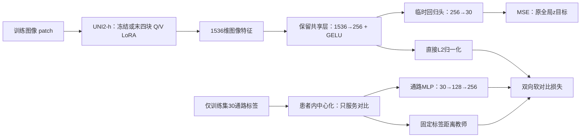
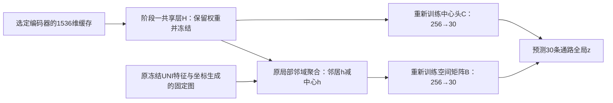

# Phase2 软连接：对比学习改进实验方案 v3

> 日期：2026-09-08。状态：**方案已制定，尚未编码、训练或产生新实验结果**。
> 本日调研修订：结合旧 LoRA 代码、SEAL 与 EVA 等一手资料，将主推荐容量调整为末四块 Q/V、r=8；初始化变体独立追加，详见 [LoRA 调研与方案补充](Phase2软连接_LoRA任务适配调研与方案补充_20260908.md)。这是方案建议更新，不代表实验已经实施或证明有效。
>
> 用户最新要求：重点改进对比学习；保留 1536→256 共享层、30 通路回归头和局部空间修正，允许分两阶段训练。**同一个独立代码包设置两个入口：先跑原 9472/1078 划分，允许先提供 Phase3 候选；另一个入口完整执行六折留一患者，后续单独复核。六折不是先行交付的前置条件。**

## 一、推荐采用什么方案

**采用融合方案：保留 GPT 的冻结对照与监督目标排查，采用 Fable 的分阶段微调、患者留出和 MSE 对照；不接受“冻结特征上的对比学习必然无效”这一推断。**

主要实验围绕一个问题：**对比损失是否能在控制其他条件后改善回归，尤其能否把收益写入 UNI2-h 的图像表征？**

执行路线如下：

1. **准备一致起点**：先在原划分、后续按需要在六折的每一折中，用冻结 UNI2-h 特征训练现有单点模型，得到本协议、本种子的共享层与回归头共同初始化。
2. **比较四种适配方式**：冻结骨干 / 小范围 LoRA × 仅 MSE / MSE 加软对比。四组采用相同图像增强、采样、步数和初始化。
3. **训练空间回归头**：冻结上一步的骨干和共享层，保留它们学到的内容；重新训练单点回归头与空间回归头。此时不再加入对比损失。
4. **检查收益落点**：LoRA 两组各自重新提取 1536 维缓存，重置共享层和回归头后再比较，判断收益是否真正进入了骨干。
5. **原划分先交付，六折后复核**：先依据原内部验证选出候选，必要时补种子，再提供 Phase3 使用材料；XZY 只在配置和端点固定后评估。六折由另一个入口单独运行，用于跨患者复核和问题定位，不占用原划分的训练数据，也不覆盖已交付模型。

首轮推荐 LoRA 为**最后 4 个 Transformer 块、独立 Q/V 适配、秩 r=8**。LoRA 是低秩适配：原权重冻结，只训练少量旁路参数。新增 **196,608** 个参数，阶段一最大可训练参数为 **634,782**；阶段二空间模型只训练 **15,390** 个参数。该容量让对比学习有更充分的调整空间，同时将骨干适配参数控制在约 20 万；它是待验证的工程选择，不是文献证明的最优层数。原末两块 r=2 保留为可选低容量对照。

冻结路线在旧缓存上可以先做低成本诊断；**冻结诊断没有提升，不自动否决 LoRA 试验**。反过来，LoRA 有提升也不自动证明对比学习有用，必须看“LoRA + 对比”相对“LoRA + MSE”的配对差值。

## 二、方案建立在哪些事实之上

### 2.1 已登记结果与证据状态

已核对 [实验注册表](../../experiments/experiment_registry.json) 中 `phase2_softlink_local_v2`：`status=done`、`registration_status=registered`、`evidence_status=pending`、`analysis_status=pending_user_review`。这表示运行与结果已登记，**不等于 accepted（已确认结果）**。

本批编号为 `20260908_005325_810_8d306c10`，训练 9472 点、内部验证 1078 点，来自 6 名患者；XZY 为 1 名外部患者、1039 点；30 条通路，种子 42、43、44。内部采用边长 672 原始坐标单位的空间块留出约 10%，不是逐点随机抽样，也不是患者独立验证。[划分记录](../../experiments/phase2_softlink_local_v2/inputs/mpp2/split_info.json)

| 数据集 | 模型 | 逐通路平均 PCC（即患者—通路等权平均 PCC） | 平均池化 pooled PCC（整体展平 PCC） |
|---|---|---:|---:|
| 内部验证 | 单点 point | 0.653263 ± 0.000864 | 0.798467 ± 0.000207 |
| 内部验证 | 关系 relation | 0.653046 ± 0.000958 | 0.798608 ± 0.000010 |
| 内部验证 | 空间 spatial | 0.666275 ± 0.000709 | 0.805644 ± 0.000505 |
| 内部验证 | 联合 joint | 0.665985 ± 0.000682 | 0.805648 ± 0.000373 |
| XZY | 单点 point | 0.513057 ± 0.011453 | 0.650099 ± 0.011962 |
| XZY | 关系 relation | 0.516391 ± 0.006645 | 0.649649 ± 0.008504 |
| XZY | 空间 spatial | 0.558001 ± 0.005062 | 0.678272 ± 0.008052 |
| XZY | 联合 joint | 0.558155 ± 0.003477 | 0.675879 ± 0.006030 |

表中 SD 是三个种子的样本标准差。两种 PCC 的计算方式不同，不能用数值高低互相证明优越。来源为注册表对应记录及 [双 PCC 明细](../../experiments/results/phase2_softlink_local_v2/20260908_005325_810_8d306c10/analysis/pcc_side_by_side.csv)。这些历史 XZY 数字只解释研究背景，不用于本轮参数选择。

可支持的判断是：**当前空间分支贡献了主要增量；当前关系目标没有显示稳定的额外回归收益。** 不能据此否定整个对比学习方向。

### 2.2 对比学习可能卡在哪里

当前流程由冻结的 UNI2-h 输出 1536 维特征，经可训练共享层变为 256 维，再分别进入回归头与独立关系投影头。关系教师由通路标签距离生成：近例取最相近的一部分，远例取差异较大的一部分，中间过渡区被丢弃。[模型源码](../../experiments/phase2_softlink_local_v2/src/model.py)、[关系损失源码](../../experiments/phase2_softlink_local_v2/src/relations.py)

| 线索 | 它支持什么 | 本轮如何检查 |
|---|---|---|
| 近例权重接近均匀，过渡区未进入损失 | 当前监督可能更偏“粗分组”，精细通路差异利用不足 | 全批连续软目标，记录教师熵和有效候选数 |
| 近例约 58.24% 来自同患者 | 同患者外观或患者通路均值可能成为捷径 | 患者均衡采样；患者中心化教师候选；整患者留出 |
| 独立关系投影头有 65,536 参数；表示变化未明显传到预测 | 辅助头可能吸收部分变化 | 直接在共享表示上跨模态对齐，取消这一个独立关系投影头 |
| 骨干没有梯度 | 无法调整骨干对病理形态的提取方式 | 与相同损失的末端 LoRA 配对比较 |
| 内部训练、验证共享患者 | 当前内部指标不足以判断新患者上的收益和风险 | 原划分先筛查；后续独立入口六折、每折留一患者 |

前两项比例来自 [分析报告第 4、7 节](../分析报告/Phase2软连接v2_1_实验结果与机制分析_20260908.md)。投影头吸收、患者捷径、任务冲突均仍需实验区分；损失下降、有效秩相似或一次梯度检查不能单独证明原因。

## 三、GPT 与最新 Fable 5.1 建议如何取舍

这里的 Fable 指 [报告第八节最新评审](../分析报告/Phase2软连接v2_1_实验结果与机制分析_20260908.md)，包括 8.5–8.7 的分阶段方案，而非只参考 9 月 7 日旧评审。第八节新增数字的计算脚本未入库，作者明确标记为探索／待登记；本方案未将其升级为确认事实。

| 建议或判断 | 本方案决定 | 理由与修正 |
|---|---|---|
| GPT：先查冻结路线的损失、采样与超参 | 保留，但限制诊断数量 | 成本低，且可训练共享层仍能改变泛化；不要求它成功后才允许试 LoRA |
| Fable：先适配编码器，再由空间头回归 | 作为主要结构 | 将形态适配与空间修正分阶段比较；中间共享层保留 |
| Fable：标签派生目标没有新信息，所以冻结对比应当无效 | 不采纳这条必然性判断 | 同一标签可通过不同约束改变有限样本下的归纳偏置；当前共享层也并非冻结。只能说当前实现没有显示增量 |
| Fable：约 31% 标签方差来自患者间偏移 | 作为待复核线索 | 该估计来自内部验证标签；不能直接代表训练集，更不能认定偏移都是技术噪声 |
| Fable：患者内中心化 | 仅用于对比教师的起始候选 | MSE 与最终输出仍为原全局 z；相对通路模式与绝对通路水平分别建模，不更换科研目标 |
| Fable：全批软目标，恢复过渡区 | 采用并加配对锚点 | 保留真正配对图像—通路，不把所有非配对样本硬当负例；两个方向分别归一化 |
| Fable：LoRA + MSE、中心化 MSE、纯对比三路 | 改为“有无 LoRA × 有无额外对比”四格 | 四格均保留同一个 MSE，避免同时改变回归目标和损失类型；中心化 MSE、纯对比暂缓 |
| GPT：小范围 LoRA、固定旧图 | 采用 | 控制参数量；图权重不随新表征一起变，便于归因 |
| Fable：患者不相交验证 | 采用，但作为可后续启动的六折入口 | 原划分先运行和交付候选；六折每次只留一人，不作为先行使用的门槛 |
| Fable：均值 ± 患者间 SD 是置信区间 | 修正 | SD 描述患者差异，不是置信区间；六折训练集还存在重叠 |
| Fable：可加性比值、空间收益保留率作为门槛 | 不作为主判据 | PCC 非线性，分母小会使比值不稳定；改用清晰的配对绝对差值 |
| Fable：新图、平滑先验、度数修正、校准 | 本轮暂缓 | 用户要求对比学习为重点；除数据接口与梯度隔离外，不更改空间建模 |

另外，患者均值之差不能作为任意点对距离的严格下界；训练与验证 MSE 相近也不能证明“完全不存在正则化或梯度冲突”。本轮不依赖这些过强解释制定路线。

文献借鉴限于方法结构：[PEaRL](https://arxiv.org/html/2510.03455v1) 采用图像—通路双向对齐及 UNI v1 末四层微调，原文未使用 LoRA；[BLEEP](https://arxiv.org/html/2306.01859) 已讨论相似点被错误推开的风险，并使用软目标变体。我们采用更小的通路 MLP 与独立设计的标签教师，不照搬其网络、预处理或评价结论。[SupCon](https://arxiv.org/abs/2004.11362) 提供多正例思路；它不证明本项目的冻结路线必然有效。

## 四、网络如何保留，两个阶段怎样衔接

### 4.1 阶段一：让对比信号约束可复用的表示



共享层记为 $H$，输出 $h=\operatorname{GELU}(Wx+b)$。这里的“直接”指直接归一化 $h$，不再接当前独立的 `256→256` 关系头 $R$。临时 MSE 头读取未归一化的 $h$，保留数值幅度信息；继续使用现有回归分支 dropout=0.3，对比输入不使用这层中心 dropout。

通路侧只用小型 MLP（多层感知机），不加入 Transformer、坐标编码、患者 ID 编码或外部标签。它仅在训练期间提供对齐目标，预测时不需要通路标签。

### 4.2 阶段二：冻结表征，训练原有回归结构



预测公式沿用原结构：

$$
\hat y_i=C h_i+c+B\sum_j a_{ij}(h_j-h_i).
$$

阶段二固定 UNI2-h、LoRA 和共享层 $H$，**重新初始化**中心头 $C,c$ 与空间矩阵 $B$。单点臂只训练 $C,c$；空间臂再训练零初始化的 $B$。两臂共享同种子的中心头初值、中心采样与 dropout 随机流。阶段一临时回归头和通路 MLP 不进入最终推断。

这是“保留结构、调整训练职责”，不是删除中间层。与 v2.1 相比，主要训练变化是阶段二不再更新共享层、不加关系损失，因此必须设置新流程的 MSE 对照，不能直接把旧 spatial 数值充当新流程的匹配基线。

**防止一个关键失误：冻结骨干分支的收益只能储存在共享层等头部中。阶段二若把这层也重置，冻结对比分支会丢掉学到的内容，形成假阴性。** 所以核心四格都保留并冻结各自的 $H$。只有第九节专门的骨干验证才重置 $H$，且清楚标为另一种比较。

## 五、对比损失、采样与超参数

下文的“当前训练部分”在原划分入口指 9472 个训练点，在六折入口指该折五名训练患者的训练块；“每折拟合”不表示原入口必须先执行患者留出。

### 5.1 保持回归目标，限定中心化范围

全局标准化目标仍为 $z_{ik}=(y_{ik}-\mu_k)/\sigma_k$，其中 $\mu_k,\sigma_k$ 只由当前折训练块拟合。最终预测与反标准化均保持这一口径。

对比教师起始采用 $r_{ik}=z_{ik}-m_{p(i),k}$：$m_{p,k}$ 只取当前折训练患者 $p$ 的**训练块**均值，不使用该患者内部验证块，更不使用留出患者或 XZY 的均值。这里仅去均值，不再除以患者内 SD，避免放大近常数通路噪声。

它的含义是对齐“相对本患者背景的通路模式”，不是已经完成去批次校正。患者均值可能包含真实生物学信息，故原全局 z 的 MSE 必须保留。未知患者推断不需要估计 $m_{p,k}$，也不允许借真实标签补回截距。

开跑前仅需在训练部分输出逐患者通路均值、SD、患者间／患者内方差描述，并核对可用的原始 ssGSEA、点位身份和 QC。若缺少测序质量信息，明确来源未明即可，不擅自认定患者偏移是噪声；ZHZ-mhc 保留原指标，低方差单元单独披露，不因其表现差而删除。

### 5.2 全批软目标：保留配对，不强迫不相似患者成为正例

对一个包含 $b$ 个配对样本的批次，定义标签距离：

$$
d_{ij}=\frac1{30}\sum_{k=1}^{30}(r_{ik}-r_{jk})^2,
\qquad w_{ij}=\mathbf1_{i\ne j}\exp(-d_{ij}/\tau_y).
$$

真实配对的图像和通路位于对角线。给它固定锚点质量 $\rho=0.25$，其余质量按非配对标签相似性分配：

$$
Q^{I\to Y}_{ij}=\rho\mathbf1_{i=j}+(1-\rho)\frac{w_{ij}}{\sum_{l\ne i}w_{il}},
$$
$$
Q^{Y\to I}_{ji}=\rho\mathbf1_{i=j}+(1-\rho)\frac{w_{ij}}{\sum_{l\ne j}w_{lj}}.
$$

分别沿各自候选轴归一化。**不要把一个行归一化矩阵直接转置后当作另一方向的概率分布。** 实现用带对角掩码的稳定 softmax，不先算可能下溢的指数再相除。教师由训练标签计算并停止梯度；不由当前模型相似性自行生成。

令 $u_i=\operatorname{normalize}(h_i)$，$v_i=\operatorname{normalize}(T(r_i))$，学生相似度 $s_{ij}=u_i^\top v_j/\tau_z$。定义：

$$
L_{\mathrm{con}}=-\frac1{2b}\left[\sum_{ij}Q^{I\to Y}_{ij}\log\operatorname{softmax}_j(s_{ij})+\sum_{ji}Q^{Y\to I}_{ji}\log\operatorname{softmax}_i(s_{ij})\right],
\qquad L=L_{\mathrm{MSE}}+\lambda L_{\mathrm{con}}.
$$

这里的软目标同时保留相近、过渡与远离的候选，不再设置 `q10/q50` 资格截断。跨患者点只有通路模式相似才获得较大权重；同患者但通路不同的点仍被区分。批次含约 $b^2$ 个相似度不等于 $b^2$ 个独立生物样本。

### 5.3 首轮固定配置

| 项目 | 首轮设置 | 作用与边界 |
|---|---|---|
| 对比学生温度 `tau_z` | 0.1，固定 | 调整余弦相似度的锐度；不增加可学习温度 |
| 教师温度 `tau_y` | 训练批次规则确定 | 在 {0.03, 0.1, 0.3, 1, 3} 中选非对角目标归一化熵最接近 0.7 的值；同距时取较大温度。0.6–0.8 为诊断参考，不是证明最优 |
| 温度计算范围 | 每折固定 20 个训练批次，采样种子 20260908 | 只用本折训练标签；在正式三种子训练前确定并记录，阶段中不重新调整。主划分最终重训按同一规则重新拟合 |
| 配对锚点 `rho` | 0.25 | 防止真实配对在大量软正例中完全淹没；为本项目待测设计 |
| 对比权重 `lambda` | 第 1 个适配 epoch 从 0 线性升至 0.05，此后 0.05 | 不能直接把旧交叉熵数值与新损失大小比较 |
| 实际对比批次 | 目标 64；资源测量后统一锁定 | 原划分六患者每批 10/11 点，六折中的五患者每批 12/13 点，轮换余数。不能用梯度累积冒充更大的候选集合 |
| 采样 | 患者均衡，批内同一点不重复 | 各患者独立打乱，不足时循环；每 epoch 固定 `ceil(n_train/b)` 个更新，记录抽样次数；四格复用同一身份序列 |
| 阶段一图像增强 | 每个点一次弱增强；水平/垂直翻转各 p=0.5，ColorJitter 亮度/对比度/饱和度 0.1、色相 0.02 | 四格相同；不裁掉原 patch 主体，不学习验证或外部染色模板；这些是起始设定，非已验证最优 |
| 共享层与临时 MSE 头学习率 | 3e-5 | 从共同预热权重小幅适配，减少破坏已有表征 |
| 通路 MLP 学习率 | 3e-4 | 新增的小型训练辅助网络 |
| LoRA 学习率 | 1e-5 | 只更新指定适配器 |
| 优化器 | AdamW；weight decay=1e-4 | 每个分支重置优化器状态；其余 Adam 参数沿用 v2.1 |
| 适配轮数 | 固定 5 epoch | 第 3 轮只作轨迹诊断；第 5 轮为预定端点，不从留出患者挑轮次 |
| 精度 | 阶段一 bf16 经服务器确认后使用；损失归一化/softmax 用 fp32 | 四格一致；不支持时统一改 fp32，并记录比较配置 |

“冻结旧缓存快速诊断”可以不使用像素增强，目的是检查教师分布和头部可训练性。**它不替代核心四格中采用相同增强的冻结对照。** 否则所谓 LoRA 增益会混入数据增强差异。

不默认开展超参笛卡尔积网格。若首轮不见收益，且训练诊断显示对比梯度很弱，最多追加一组 `lambda=0.2` 的冻结对照；若中心化有损失，再追加一组仅将教师与通路 MLP 输入改回全局 z 的对照。每次只改一项，先限种子 42 和原划分。它们是后续探索，不能回填首轮主表；如要推广新配置，必须补齐匹配对照和种子。

## 六、核心实验矩阵与过拟合控制

### 6.1 共用起点与四格比较

每个折、每个种子先训练**本折自己的**冻结单点模型，沿用 v2.1 的 1536→256→30 结构、AdamW 3e-4、dropout=0.3、最多 60 epoch 及原内部选择规则。它只用于共同初始化，不能使用在全部六名患者上监督训练过的旧共享层或旧 checkpoint。

预训练 UNI2-h 本身未用本项目标签训练，可跨折共用；无标签的原始 UNI 特征也可共用。**六折中必须分折的是监督预热的共享层、回归头、LoRA、标签统计和其他标签派生量。** 不要把“可复用预训练骨干”与“不可复用六患者监督模型”混为一谈。

四个分支复制同一折同一种子的共享层与临时回归头，重置优化器；LoRA 采用零增量初始化。所有分支采用相同配对身份、图像增强种子和 5 个适配 epoch。对比组新增的通路 MLP 不改变最终预测模型容量。

| 阶段一方案名称 | UNI2-h | 阶段一目标 | 阶段二输出 | 回答的问题 |
|---|---|---|---|---|
| 冻结回归 | 冻结 | MSE | 单点、空间 | 新两阶段流程的匹配基线 |
| 冻结对比 | 冻结 | MSE + 软对比 | 单点、空间 | 改进损失能否在共享层上产生有效收益 |
| 微调回归 | 末四块 Q/V LoRA | MSE | 单点、空间 | 不依靠对比，微调本身是否有效 |
| 微调对比 | 相同 LoRA | MSE + 相同软对比 | 单点、空间 | 对比在可调整骨干上是否提供额外收益 |

既有 point、spatial 作为历史参考；每折共同预热模型也保留单点预测与固定平滑预测，帮助发现新流程是否本身造成性能下降。现有 relation/joint 代码与结果保留，但不把无收益的旧关系头默认叠加回来。

### 6.2 参数预算

| 组件 | 参数量 | 计算方式 |
|---|---:|---|
| 共享层 1536→256 | 393,472 | 1536×256+256 |
| 临时或最终中心头 256→30 | 7,710 | 256×30+30 |
| 通路 MLP 30→128→256 | 36,992 | 30×128+128+128×256+256 |
| 空间矩阵 256→30 | 7,680 | 无偏置，零初始化 |
| 末四块独立 Q/V、r=8 LoRA | 196,608 | 4块×4×1536×8 |

| 阶段一方案 | 当阶段可训练参数 |
|---|---:|
| 冻结回归 | 401,182 |
| 冻结对比 | 438,174 |
| 微调回归 | 597,790 |
| 微调对比 | **634,782** |

阶段二的单点头训练 7,710 参数；空间模型训练 15,390 参数。微调空间模型最终保留的本项目学习参数为 LoRA + 共享层 + 新中心头 + 空间矩阵，共 **605,470**，不包含被丢弃的临时头与通路 MLP。不能把两个阶段参数量相加当成同时训练量。

原 v2.1 joint 为 474,398 参数；本方案最大单阶段可训练量更高，但低于旧 1536→1024→30 回归头的 1,604,638。不同位置的参数对表征影响不同，不能把旧头参数量当成骨干适配的安全额度。UNI2-h 仍约 6.81 亿冻结参数，显存与算时还受图像前向、最早适配块位置和激活影响。[既有参数核对](../../experiments/results/phase2_softlink_local_v2/20260908_005325_810_8d306c10/analysis/三问参数核对_20260908.json)、[UNI2-h 官方结构](https://huggingface.co/MahmoodLab/UNI2-h)

### 6.3 LoRA 范围与训练限制

LoRA 只注入第 21–24 个块（零起始索引 20–23）的 Q 与 V；Q、V 各自使用独立的两个低秩因子。`r=8`、`alpha=16`，即缩放 `alpha/r=2`；LoRA dropout=0.05。K、注意力输出投影、MLP、LayerNorm、偏置、位置和 register token 均冻结。LoRA 的低秩矩阵与空间修正矩阵 $B$ 是不同模块。[LoRA 原论文](https://arxiv.org/abs/2106.09685)

UNI2-h 使用融合 QKV，实现时只在 Q/V 对应输出切片加入增量。**完整融合 QKV 的单个 LoRA 与独立 Q/V LoRA，在相同 r 下恰好都可有每块 4dr 参数；参数量相同不能证明更新位置正确。** 必须核对 K 切片增量为零，以及 Q/V 的独立因子。前 20 块可不保存反向图，最后四块的对比梯度必须到达 LoRA；不能把整个骨干前向放入 `no_grad()`。

主四格先使用普通零增量初始化，保证“有无对比”的比较清楚。最优先的可选追加为相同末四块 r=8 的 EVA 初始化：只用本协议训练图像估计激活方向，关闭秩重分配，同样各跑 MSE、MSE+对比两组。完整六折若评估 EVA，初始化必须每折重算；它不构成原划分先行交付的条件。详见调研补充中的校准范围与运行增量。

若要单独研究多层覆盖，可比较末四块 r=8 与末八块 r=4：两者适配参数均为 196,608，缩放 alpha/r 均为 2。这是同预算下“层数与每层秩分配”的比较，不能把效果只归因于层数；末八块需要更长的反向传播路径。原末两块 r=2 为 24,576 参数、阶段一最大 462,750，仅作为可选容量对照，不额外塞进首轮四格。

## 七、同一代码包的两个独立训练入口

### 7.1 两个入口分别负责什么

| 入口脚本（编码时实现） | 数据协议 | 默认运行范围 | 用途与交付顺序 |
|---|---|---|---|
| `run_original_split.ps1` | 原六患者：9472 训练点 / 1078 内部验证点 | 种子 42、完整四格与单点/空间头；可独立补 43/44 | **优先运行**，快速看对比增量，形成 Phase3 候选，不等待六折 |
| `run_lopo6.ps1` | 完整六折，每折留一名患者，其余五名按原训练块/内部验证块训练与选端点 | 种子 42 遍历全部六折；可独立补 43/44 | **后续单独启动**，检验患者泛化、捷径和机制；不是先行交付的前置条件 |

两份脚本放在同一个 `phase2_softlink_contrastive_v3` 代码包根目录，调用同一训练实现与损失配置。默认只改变划分协议，不能一份悄悄改网络或温度规则。两个入口均执行共同预热、阶段一四格和阶段二单点/空间比较；不要求用户通过多份不同代码拼接流程。

脚本是本方案的**待实现文件名**，本轮未创建可执行训练入口。未来包结构约定为：

```text
phase2_softlink_contrastive_v3/
  run_original_split.ps1       原划分入口
  run_lopo6.ps1                完整六折入口
  config.json                 共享网络、损失与训练默认设置
  inputs/                     原划分与六折清单、小型标签统计元数据
  src/                        两入口共用的分阶段训练、提特征和预测实现
  README.md                   两入口运行、续跑与回传说明
```

每个运行记录 `protocol=original_split` 或 `protocol=lopo6`，六折另记录 `held_out_patient`；输出目录、权重、缓存和分析表按协议隔离。允许按协议、种子及已完成折独立续跑，但明确核对配置与来源，不自动覆盖旧运行。启动原划分入口不会触发六折，也不等待六折产物。

### 7.2 原划分入口：训练量保持不变

直接沿用当前六患者空间块划分：训练 9472 点、内部验证 1078 点，原修复版全局 z 参数只由这 9472 个训练点拟合。所有四格使用同一份划分和同一全局回归目标；对比教师的患者均值也只来自这些训练块。

先跑种子 42 的完整四格，以“微调对比 − 微调回归”及“冻结对比 − 冻结回归”判断有无初步增量。共同预热、阶段一和阶段二可训练部分均不使用 1078 个验证点更新参数；验证点只用于允许的内部模型选择。其空间图与训练图分开构建，沿用旧协议。

共同预热与阶段二沿用原选择指标 `patient_macro_pathway_pcc`，并列时使用 `patient_macro_z_mse_selection`。最多 60 轮，正式比较从第 6 轮开始，早停计数从第 16 轮开始，patience=10。阶段一固定 5 轮。原划分主表必须同时并列两种 PCC 和完整其他指标。

如果内部结果较好，**可直接把这个入口的模型作为“待患者独立验证的 Phase3 候选”交付**，不要求先完成六折。单种子交付就明确标单种子；用户时间允许时再补 43/44。它能支持当前同患者留出条件下的比较，暂不能证明跨患者泛化，也不把结果自动登记为 accepted。

交付至少应有：预训练骨干标识与固定预处理、LoRA 权重（如适用）、共享层 H、中心头 C、空间 B、训练集标准化参数、30 通路顺序、原冻结构图特征口径与空间配置，以及服务器权重路径登记。**微调模型不能直接继续使用旧 UNI2-h 最终特征缓存**；Phase3 侧需要按选定 LoRA 重提预测特征，并保留原冻结 UNI 特征用于固定图权重。空间预测还需要合法坐标与邻域，不能只交一个回归头文件就宣称可以复现。

本轮不自动给团队成员发送消息或替换其模型。上述是方案中的交付合同。后续完成六折后可补充证据或产生新版本，但不静默覆盖团队正在使用的候选。

### 7.3 六折入口：每次只留一名患者

完整运行六个留一患者折（LOPO：leave-one-patient-out）。每折保留五名训练患者，沿用这五名患者的原训练块和内部验证块；留出患者的全部点仅在端点冻结后评估。这样避免每折只用四名训练患者，但大患者被留出时训练点数仍会减少，必须如实列出。

| 留出患者 | 留出点数 | 其余五患者训练块点数 | 其余五患者内部验证块点数 |
|---|---:|---:|---:|
| HYZ15040 | 1,454 | 8,163 | 933 |
| JFX | 2,029 | 7,646 | 875 |
| LMZ12939 | 3,351 | 6,458 | 741 |
| TGC | 1,116 | 8,474 | 960 |
| XSL | 1,526 | 8,107 | 917 |
| ZHZ | 1,074 | 8,512 | 964 |

点数来源为既有 [split_info.json](../../experiments/phase2_softlink_local_v2/inputs/mpp2/split_info.json)。例如留出 LMZ12939 时剩余训练点最少，为 6458；六折也不能保证训练量与原入口完全相同。因此评价重点是**各自协议内的配对增量**，不能把六折分数与原划分分数的差全部解释为过拟合。

每折严格区分以下职责：

- **五名训练患者的训练块**：用于共同预热、阶段一、阶段二梯度更新，并重新拟合本折全局 z、训练患者均值、教师温度。
- **这五名患者的原内部验证块**：仅用于共同预热与阶段二逐轮选择，不进入梯度更新。阶段一固定 5 轮。
- **一名留出患者全部点**：只做冻结端点评估，其标签不进入标准化、配对池、温度、LoRA 或共享层训练、早停与逐轮选择。
- **XZY**：不进入任何六折开发操作；无需为每个折重复运行 XZY。

原始 ssGSEA 经身份对齐后，只用本折训练块重算标准化。不能沿用六患者拟合的 z 参数冒充折内拟合；更不能使用原划分入口已经在六患者标签上训练过的 H、C、LoRA 作为六折起点。可共用的是原始预训练骨干和未做本项目标签适配的冻结缓存。若只拿到已标准化文件，可用原精确均值/SD恢复原标度并核对，再重新拟合；缺少必要标签时报告具体缺口，不生成假数据。

训练图与内部验证图各自独立构建；留出患者只在本患者的图上推断，图仅用坐标与原冻结图像特征，不跨患者连边。整患者留出消除了该患者内部的训练/验证分块截断，但不同患者的图度数仍可能不同。

### 7.4 两个入口如何共同支持决策

原划分先解决“当前训练量下能否看到改进、能否先给 Phase3 试用”，六折后解决“换到未参与训练的患者是否仍有增量、是否只有头部吸收、哪些患者失败”。两份结果并列保留，各自附数据协议，不混成一个均值。

推荐六折先执行本方案预定义的完整四格、温度规则和比较顺序，不因原入口哪组胜出就只保留那一格。原入口与六折首轮共享同一预定配置；若用户之后根据原入口结果调整配置，记录其属于开发后的复验。六折可用于后续有限配置比较，但若根据它改配置，就应标为开发性选择，而非完全独立无偏验证。六名患者已参与本项目研发，不能把后续六折包装成全新外部队列。

原入口的候选可以在六折完成之前交付；六折模型不自动选“成绩最好的一折”给 Phase3。若六折提示应换配置，应回到原主划分重新训练一个明确版本，并由用户决定是否更新团队候选。最终种子优先预定 42，43/44用于稳定性报告，不按 XZY挑种子或临时集成。

XZY 只在本轮配置和端点固定后做一次参考评估，不据此返回调参。因历史报告已分析过 XZY，不能重新宣称它是从未看过的全新盲测。

## 八、空间部分本轮只做必要适配

空间超参保持 v2.1：单跳、半径为原生步长的 1.5 倍、最多 8 邻居、形态温度 0.2、中心原始权重 1、几何×形态权重、原归一化和有向图定义。**四格共用同一套原冻结 UNI2-h 图像相似度权重**，不同的是送入共享层的特征与该层参数。

必须在新包中区分两个输入：

| 输入 | 用途 | 本轮能否随 LoRA 改变 |
|---|---|---|
| 预测特征缓存 | 进入共享层 H 与回归头 | 可以；LoRA 组按自己的编码器重新提取 |
| 构图特征缓存 | 决定固定邻接权重 | 不变；统一使用原冻结 UNI2-h |

这是必要的数据接口适配，不能声称“整个旧代码无需修改”。空间公式本身不变。每份阶段二单点预测都做相同固定 β=1 平滑诊断；它不训练新参数，也不用于选择端点。保留旧空间头，不增加注意力层、图网络深度、门控、可学习邻接或预测校准。

“用微调特征重新建图”只列为后续候选；首轮即便空间增量变小，也先报告微调后的绝对性能和配对差值，不为了达到人为保留率而调整空间结构。

## 九、怎样判定对比学习发挥了作用

### 9.1 优先看配对差值

在同一折、同一种子、同一阶段二头类型下比较：

| 比较 | 能支持的结论 |
|---|---|
| 冻结对比 − 冻结回归 | 新对比目标是否在冻结骨干条件下带来回归增量 |
| 微调回归 − 冻结回归 | 同等流程下 LoRA 本身的增量 |
| **微调对比 − 微调回归** | **对比学习在 LoRA 条件下的边际收益，是本轮首要比较** |
| 同一种适配的空间 − 单点 | 已保留的空间模块还有多少额外收益 |

不能把“微调对比 − 历史单点”的全部差值归因到对比学习。也不要求空间与对比之和必须超可加。

### 9.2 骨干收益检查：共享层重置对照

对每折、每个种子的“微调回归”和“微调对比”，使用第 5 轮编码器，以无增强、固定预处理重新提取 **1536 维 CLS** 缓存；分别从相同随机初值重新训练原 `1536→256→30` 单点模型。此检查不继承阶段一 H/C，训练设置相同，只改变编码器缓存。

如果“微调对比 − 微调回归”的优势在这里仍出现，支持至少一部分收益已进入骨干表征；如果只有保留 H 的主流程有优势，说明当前证据主要支持共享层／整体训练流程收益，不能宣称成功改善基础模型表征。两组都失败也不能证明预训练 UNI 达到了信息上限。

为控制计算量，本轮这项检查只跑单点，不再扩展一套新空间消融。冻结对比分支在重置 H 后会失去自身学习信号，不能把这种预期现象当作它无效的证据。

### 9.3 指标、稳定性与保留建议

主指标始终为**逐通路平均 PCC（即患者—通路等权平均 PCC）**；同时并列**平均池化 pooled PCC（整体展平 PCC）**。继续完整保留既有可计算指标，至少展示 CCC、zRMSE、zMAE、rawMAE、R²、bias_z、预测／真值 SD 比、逐通路与逐患者明细；有图边时补残差 Moran's I。未计算项注明原因。

原划分入口按既有六患者等权方式汇总；六折入口中每个留出患者恰出现一次，先对每患者、每种子求 30 通路指标，再报告六患者等权均值、患者分布及种子分布。两个入口的统计不混合。六折 z 参数不同，**不把不同折的 z 分数直接拼接为一个整体展平 PCC**；分别报告每折双 PCC，并提供“六折平均的整体展平 PCC”作为明确命名的描述汇总，不伪装成一次统一展平结果。

可补充“逐患者去均值误差”作事后诊断：预测与真值各自去均值，明确这使用了评价标签，只用于拆解偏置，不是可部署校准，也不进入选择规则。保留未中心化的完整指标；不事后删掉低方差通路改善主表。

原入口首先报告内部配对差值、种子稳定性和误差代价，不以六折完成作为 Phase3 先行使用的条件。以下建议主要用于**后续六折复核**，均不是自动阻断用户实验或先行交付的门槛：

- 微调对比相对微调回归，六患者等权主 PCC 增量达到约 **+0.005**；这是预先提出的实用差异参考值，不是从 XZY 反推或统计显著阈值。
- 三个种子的六患者汇总方向一致，至少 4/6 患者的种子平均增量为正；同时披露最差患者，不能只选改善通路。
- zRMSE、CCC 与偏置是否出现明显代价：例如 zRMSE 相对恶化超过 1% 时单列警告，即使 PCC 上升也不宣称全指标改善。
- 如果收益小于该参考、患者方向不稳或仅损失下降，结论写“本预算下增量不明确”，不写“对比必然无效”。

最终保留建议：只有 LoRA-MSE 有效，则报告微调有效、对比证据不足；冻结对比已能达到相近效果，则优先考虑计算更低的配置；LoRA 对比有稳定增量且重置 H 后仍保留，则支持继续研究骨干对齐。空间分支按实测增量报告，不为制造协同而调参。

### 9.4 只采集有判别价值的训练诊断

在固定训练批次记录教师非对角熵、有效候选数、跨患者目标质量、学生分配、MSE 与对比项；在适配早期及末期抽样记录对比梯度相对 MSE 的范数，以及 H/LoRA 的梯度方向。梯度比为零、极小或过强分别用于排查断梯度、影响弱或强约束；不能用单批梯度夹角证明整段训练冲突。

由于 LoRA 零增量初始化，最初某一低秩因子梯度为零可能是正常现象，应在至少两次更新后再检查。比较训练／内部验证误差时使用一致的 eval 模式与指标聚合，避免把训练 dropout 或均衡采样带来的差异误判为过拟合程度。

## 十、运行数量、资源与部署安排

### 10.1 先运行原入口，后运行完整六折

| 步骤 | 工作内容 | 依赖 | 预计工作量 |
|---|---|---|---|
| 核对数据 | 原划分清单、训练标签统计、旧缓存与图像身份及 CLS 预处理核对；准备六折名单 | 无 | 半天量级准备估计，取决于服务器已有数据；不必等待六折计算 |
| 测量资源 | 训练数据上的小批前向/反向，锁定实际 batch、精度、吞吐和峰值显存 | 数据可读 | 一次短测，不是正式结果 |
| 原划分先跑 | 种子 42、四格、每格单点+空间 | 资源配置固定 | **1 次共同预热、4 次阶段一、8 次阶段二头训练** |
| 原划分先行交付 | 比较内部增量，形成 Phase3 候选；按时间补 43/44 | 原入口完成 | 不等待六折；三种子累计 3 次预热、12 次阶段一、24 次阶段二 |
| 六折后续启动 | 种子 42 遍历完整六折、每折同一四格 | 用户安排后续计算 | **6 次共同预热、24 次阶段一、48 次阶段二头训练** |
| 六折稳定性复核 | 在相同六折与配置下补 43/44 | 按时间与结果需要 | 三种子累计 18 次预热、72 次阶段一、144 次阶段二 |
| 骨干收益检查 | 两 LoRA 配置用缓存重置 H/C 的单点训练 | 对应缓存已产生 | 原入口每种子 2 次；完整六折每种子 12 次，均为轻量缓存训练 |

原入口单种子只需 4 次在线适配，其中 2 次更新 LoRA；六折单种子为 24 次在线适配，其中 12 次更新 LoRA。固定平滑不增加训练运行。原入口的骨干收益检查可随首次结果完成，六折的检查随相应折完成，不占用额外图像微调。

Fable 给出的每次 5 轮适配约 8–75 分钟只能作未实测粗估。若未来服务器实测每次在线适配耗时 t 分钟：原入口单种子约 4t，完整六折单种子约 24t。沿用该区间仅作预算参考，原入口单种子约 **0.5–5 小时**，六折单种子约 **3.2–30 小时**；六折三种子约 **9.6–90 小时**。这些不含缓存提取、数据读取与头训练；各折数据量不同，实施时应以实际点数和吞吐细化。

首轮保留完整四格，不只跑“LoRA+对比”一组。上表是主四格预算；可选 EVA 比较每个协议/折/种子另加 1 次训练图像校准、2 次阶段一、4 次阶段二及 2 次缓存上的重置 H/C 检查。时间紧时可只做一个种子并先交付，但如实标记探索性和未完成项；不把单种子写成稳定性证据。两个入口独立启动，已完成原入口不会自动占用六折计算预算。

### 10.2 服务器与缓存

仅以 [configs/server_paths.yaml](../../configs/server_paths.yaml) 为服务器路径事实源。其最近回传加载诊断记录为 RTX 4080、Python 3.13.5、torch 2.6.0+cu124，但不是本次在线微调实测；实际显存、吞吐、bf16 与依赖应在实施时验证。**不要把用户本机 RTX4060 8GB 或本地 Conda 环境当作服务器配置。**

阶段一冻结组在线图像前向也需要算力；可缓存相同弱增强视图以减少重复前向，但这属于后续实现优化，必须保证与 LoRA 组输入视图一致，不降低首轮公平性。首次不做中间 token 大缓存：它会固定像素视图，增加数据管理成本，且不能从现有最终 CLS 向量恢复末层 token。

最终缓存统一无增强、eval 模式、固定预处理与 CLS 提取口径；首轮正式比较建议统一 fp32 前向、TF32 关闭，保存 float32。bf16 训练后写成 float32 文件不等于使用了 fp32 提取，这两项分别登记。旧缓存若不能与新提取口径对应，就为全部新流程共同预热使用同一份新提取的冻结缓存，历史结果只保留参考身份。

按 11,589 点估算，单份 1536 维 float32 数组约 **71.2 MB**；不含文件、身份索引与日志。原入口两个 LoRA 配置×三个种子共 6 份全点数上限约 **0.43 GB**；六折两个 LoRA 配置×六折×三个种子共 36 份全点数上限约 **2.56 GB**，六折实际不抽取 XZY，容量略低。这些数值仅含普通初始化；若各自再追加 EVA-MSE、EVA-对比，缓存份数翻倍，原入口三种子上限约 **0.85 GB**、六折三种子上限约 **5.13 GB**。265 token×1536×float16 的同规模缓存约 **9.43 GB/份**，因此不是默认选项。所有缓存按折、种子、编码器版本区分，原缓存保留。

### 10.3 实施时的独立代码包与回传合同

建议实验名为 `phase2_softlink_contrastive_v3`。以下是**未来编码与手动部署位置**，本轮没有创建代码包或服务器目录：

| 内容 | 计划位置 |
|---|---|
| 本地独立代码包 | `D:\AI空间转录病理研究\PFMval_new\experiments\phase2_softlink_contrastive_v3` |
| 服务器代码 | `D:\AIPatho\qzs\code\phase2_softlink_contrastive_v3` |
| 服务器原始日志与结果 | `D:\AIPatho\qzs\runs\phase2_softlink_contrastive_v3\<批次>\<运行>` |
| 服务器 LoRA、头部权重 | `D:\AIPatho\qzs\weights\phase2_softlink_contrastive_v3\<批次>\<运行>` |
| 新派生特征缓存 | 同一运行目录内 `derived_features`，按阶段／折／种子分开；常规回传只登记路径 |
| 本地回传 | `D:\AI空间转录病理研究\PFMval_new\experiments\results\phase2_softlink_contrastive_v3\<运行编号>` |
| 本地派生分析 | 对应回传运行目录的 `analysis` |

从 [experiments/_template](../../experiments/_template/README.md) 创建新包，复制必要的 v2.1 数据读取、模型、构图和选择代码，保留来源，不依赖项目上级目录运行。增加两个独立入口、原/六折协议清单、图像读取与 LoRA、跨模态损失、分阶段冻结、特征提取和两类特征输入接口；原实验包不覆盖。

回传内容必须包括：实际配置、当前入口的患者与点位清单、每折标准化参数与训练患者均值、教师温度及分布摘要、每个阶段的选择规则、原始训练历史、身份对齐的预测和真值、固定图边与权重、必要训练诊断、运行时间和实际可训练参数明细。`model_weights.json` 逐运行登记服务器权重目录，以及 warmup/formal/last checkpoint 的绝对路径；不适用项明确注明原因，不能虚构文件。

为回传后核验基础模型对齐，另保存固定少量训练诊断点的 1536 维嵌入及点位身份；无需常规回传全量特征或权重。原始预测足以在本地补全指标、图表和登记，服务器仅计算训练、选择所必需指标。旧要求中的哈希、W### 或提交编号不作为本轮门槛。

由用户手动复制代码和结果文件夹。常规回传不复制权重与大缓存，不生成压缩包、不自动远端同步、提交或推送。未来实验登记为探索／待审，用户确认前不标 accepted。

## 十一、最小必要验证与本轮交付边界

本轮只有方案文件，因此不运行训练或为文档编写测试代码。实施阶段只安排直接关系科研正确性的检查：

1. **身份与隔离**：原划分训练块/内部验证块不混用；六折每折训练患者与留出患者互斥，每点身份对齐，六折所有拟合清单均排除留出患者；用小例核对两方向教师每行和为 1、对角锚点存在。
2. **梯度与参数**：实际列出可训练参数，确认仅末四块独立 Q/V LoRA、K 增量为零；阶段一对比梯度可达 LoRA，阶段二 E/H 均不更新，空间 B 保持正确零初始化。若追加 EVA，再核对校准点只来自当前训练集、初始化前后骨干输出一致。
3. **缓存与公平性**：在线与固定缓存的 CLS 提取口径相符；四格批次/图像视图一致、图边权重相同；保留 H 和重置 H 两种检查不混用。
4. **小规模贯通**：用训练数据做一次短运行，能产出原始预测、配置、参数统计和权重路径登记，再进入预定矩阵；不以短运行通过代替实验有效性结论。

本轮交付主方案与 LoRA 调研补充，不修改原分析报告、实验注册表、原始数据、旧缓存、checkpoint 或团队文档。后续是否实施、是否根据探索结果追加配置，由用户决定；阈值和资源估计只提供判断依据。

## 十二、主要复核入口

- [当前分析报告：第七节 GPT 建议与第八节 Fable 最新评审](../分析报告/Phase2软连接v2_1_实验结果与机制分析_20260908.md)
- [原任务：分析 phase2 软连接方案升级版实验结果](thread://01a07f5a-d8de-7f82-8c66-c4673fb573aa?hostId=local)；本轮已读取任务记录，再以本地报告新增第八节为最新建议源。
- [实验注册表](../../experiments/experiment_registry.json)，读取 `phase2_softlink_local_v2`，不是按报告措辞判断接受状态。
- [本批真实配置快照](../../experiments/results/phase2_softlink_local_v2/20260908_005325_810_8d306c10/config_snapshot.json)；本批为 v2.1.0，当前代码包配置已为 v2.1.1，两者不混用。
- [现有模型](../../experiments/phase2_softlink_local_v2/src/model.py)、[现有关系损失](../../experiments/phase2_softlink_local_v2/src/relations.py)、[参数核对](../../experiments/results/phase2_softlink_local_v2/20260908_005325_810_8d306c10/analysis/三问参数核对_20260908.json)、[划分](../../experiments/phase2_softlink_local_v2/inputs/mpp2/split_info.json)。
- [PEaRL 方法原文](https://arxiv.org/html/2510.03455v1)、[BLEEP 方法原文](https://arxiv.org/html/2306.01859)、[SupCon 原文](https://arxiv.org/abs/2004.11362)、[LoRA 原文](https://arxiv.org/abs/2106.09685)、[UNI2-h 官方模型说明](https://huggingface.co/MahmoodLab/UNI2-h)。
- [LoRA 任务适配调研与方案补充](Phase2软连接_LoRA任务适配调研与方案补充_20260908.md)：旧实验核对、SEAL/PEaRL/PEKA 对照、EVA 与梯度方法取舍、同预算分配及额外运行量。

方案由主对话核对事实与定稿；GPT-5.6 Terra high 完成只读方法审查，重点检查损失归因、阶段间表示保留、患者隔离和参数预算。最终按用户最新要求采用“原划分先行、完整六折后续”的双入口，不产生新实验结论。
