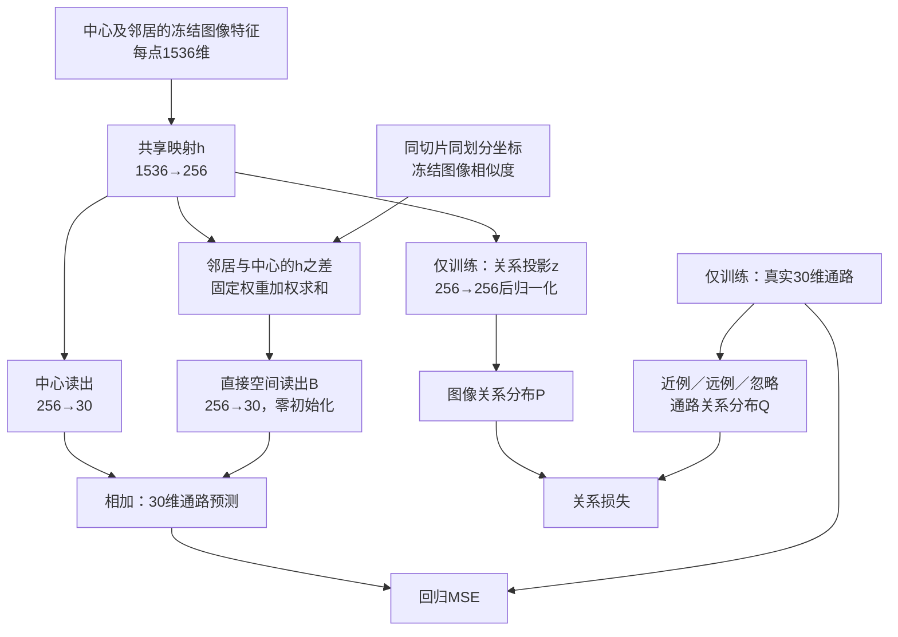

# Phase2软连接升级：最终部署方案

版本：v2.0，2026-09-07。状态：**本轮设计已收敛，等待用户审核下列三项关键决定；尚未实现代码、启动训练或取得本轮性能结果。**“最终”指本轮实施规格明确，不表示科学假设已被证实。

配套：[三项关键审核学习指南](D:/AI空间转录病理研究/PFMval_new/01_指南与解读/学习指南/Phase2软连接升级_三项关键审核_学习指南_v2_20260907.md)｜[决策与执行记录](D:/AI空间转录病理研究/PFMval_new/01_指南与解读/部署方案/Phase2软连接升级_决策与执行记录_v2_20260907.md)。

依据：[原部署方案v1.1](D:/AI空间转录病理研究/PFMval_new/01_指南与解读/部署方案/Phase2软连接升级_通路关系与局部空间联合方案_v1_20260907.md)与[扩展文献调研](D:/AI空间转录病理研究/PFMval_new/01_指南与解读/分析报告/Phase2软连接升级_扩展文献调研与改进方向_20260907.md)。三项获准后，后续新对话以本文件为实施入口；旧文档保留追溯，不将两版参数混用。

## 一、用户只需重点审核三件事

| 关键决定 | 本版明确选择 | 主要代价与结果判断 |
|---|---|---|
| **通路怎样指导图像学习** | 直接用真实30维通路构造训练点的近、远、忽略关系，约束256维图像关系表征；首轮不加通路编码器、不将图像相似度混入关系目标 | 通路距离与截断是待验证先验。用仅关系对匹配回归、联合对仅空间的PCC增量判断；关系覆盖率帮助解释失败 |
| **邻域怎样进入预测** | 同切片同划分的一跳局部图；坐标和冻结图像决定固定边权，任务表征差经一个无偏置256→30线性层产生修正 | 采用直接线性参数化，简化原两层空间映射；不保证与原版训练等价。用空间臂的增量、邻域覆盖和修正量判断 |
| **怎样判断值得继续** | 固定MPP2，四臂×42/43/44三个种子，共12次；内部患者等权逐通路PCC选模型，同时报告误差；冻结后统一外部评估 | 需要完成配对运行，不挑种子；同患者区域验证不等于新患者泛化，外部XZY不用于调参 |

256维、MPP2原划分、冻结UNI2-h及30维ssGSEA任务继续沿用用户已明确的方向，不重复要求批准。三项当前均为**待审核**，不是已通过。

其余参数在本方案和记录表中固定，由智能体负责实施与留痕，标为“智能体定值，未经逐项人工复核”。三项通过表示同意按既定规格开展下一步，并不把其他假设变成已证实结论。用户随后在新对话发出实施、训练指令；本次只交付文档。

## 二、本次整合的取舍

| 内容 | v2处理 | 原因 |
|---|---|---|
| 共享表征和关系投影 | 保持256维 | 已有PEaRL、DeepPathway维数先例；尚无本项目容量不足证据 |
| 截断软关系 | 保留原Q/P与近、远、忽略规则 | 首先检验已明确的机制，不同时更换监督语义 |
| 空间分支 | **采用直接B：256→30**，删除独立W_v | 两个连续线性映射可表达的函数范围可由B覆盖；选择更少参数的首轮候选，而非宣称优化等价 |
| 双相似度 | 首轮仍为“通路定义监督、图像与坐标定义消息权重” | 保留形态不同但通路相近的关系，避免学生同时改变自己的目标 |
| 稠密Q、距离蒸馏、排序损失 | 记入后续候选，首轮不开启 | 先根据关系覆盖和回归结果确定是否需要更换目标 |
| 双编码器、动态图、超图、交叉注意力、扩维 | 首轮不引入 | 防止改变多个机制后无法归因 |
| 人工审核与追溯 | 新增三项审核、已填默认值记录及执行记录合同 | 减少人工阅读负担，同时保留定位问题所需事实 |

原v1.1尚无本轮训练结果；v2的直接B是新首轮参数化。不能用之后的v2结果宣称它优于未运行的v1.1。训练后折叠两层只涉及推理计算；从零训练直接B则涉及优化变化，二者严格区分。

## 三、完整模型与数据流



预测＝中心图像预测＋邻域图像修正。训练时真实通路同时约束预测数值与表征关系；推理时只读取图像、切片身份和坐标/图。没有真实通路输入，也没有表达参考库。

关系监督可跨训练患者；消息边仅在同切片同划分内。这里对齐的是点位之间的关系，不是256个坐标对应30条通路，也不是通路内基因相互作用图。

## 四、数据合同与输入范围

### 4.1 必须对齐的对象

每点身份为 `(patient_id, slide_id, spot_id)`，并保存 `split`、原生坐标、1536维图像特征位置、固定顺序的30维标签。身份用于关联，禁止假设两个文件当前行序相同。

- 原MPP2六患者空间块划分：9,472训练点、1,078内部验证点，块长672，无隔离带；不重新划分、不沿用基线包的稀疏抽样开关。
- 标签与标准化参数使用活动barcode修复v003；原划分目录提供身份、坐标与split，不回退到旧标签。
- 标准化使用训练集已拟合的参数，不重新逐患者标准化，不使用内部验证或外部标签拟合尺度；关系使用实际训练的30维标准化标签。
- `pred_raw = pred_z × train_sd + train_mean`，只逆变换一次。记录既有标签裁剪方式；不额外裁剪预测。若训练z标签已裁剪，逆变换后的目标应注明“训练目标的原尺度值”，不能冒充未裁剪原始测量。另存可取得的原始实测目标及其指标口径。

现有MPP2表没有独立slide_id时，由原切片/裁patch来源建立 `inputs/slide_mapping.csv`；确认该患者表只有一张切片后才可填写同一slide_id，不能将patient_id自动当作slide_id。具体映射与修复参数文件位置是**实施待核实事实**，见记录表；无法核实就明确报告，不生成伪完整空间结果。

### 4.2 固定局部邻居

| 患者 | 原生步长s | 最大原生半径1.5s |
|---|---:|---:|
| HYZ15040、LMZ12939 | 336 | 504 |
| JFX | 448 | 672 |
| TGC、XSL、ZHZ | 224 | 336 |

同slide、同split内，对每个中心取欧氏距离不超过1.5s的最近8个不同点；并列按完整点位身份字典序。各中心独立选边，不对称化，不补远点，不额外加入自身边。完整允许点表先建图，再分批补取一跳邻居；一个随机batch不是一张组织图。

原生步长不同不自动说明物理视野不同。固定MPP2并不统一原始像素刻度；本版定义相同网格邻域阶数，不声称相同微米范围。保存 `inputs/slide_geometry.csv`：slide_id、s、坐标单位、patch覆盖尺寸、来源。

外部切片优先使用裁patch记录的步长；缺记录时，仅在来源确认完整的规则裁patch坐标表上分别统计去重x/y的相邻正差，众数并列取较小者。两轴一致且全部点落在该网格时可登记为观测步长；否则补取原裁patch记录。该推断不恢复遗漏网格、不推断微米单位，不从稀疏子集或batch估计。

### 4.3 划分边界

训练图只含训练点，内部验证图只含验证点，外部图只含同一外部切片的点。标签不进入建图或前向接口。中心与实际加载邻居的完整集合，不得跨split复用节点、连边或出现正面积patch重叠；按实际patch覆盖框核查，不能仅凭邻域外接矩形相交就判泄漏。

不静默删点、改split或以患者ID兜底。验证图可能比完整部署图稀疏，分别记录邻居数和孤立比例。无邻居时修正为零，但仍不等于该训练后模型恢复了旧基线参数。

## 五、模型与损失的实施定义

### 5.1 网络和参数

令x为冻结输入，`h = GELU(W_h x + b_h)`，维数256。

```text
中心预测 y_point = W_o Dropout(h, 0.3) + b_o
关系表征 z = L2Normalize(W_r h)
邻域差分 u_i = sum_j a_ij (h_j - h_i)
空间修正 delta_i = B u_i
最终预测 y_hat_i = y_point_i + delta_i
```

W_h为1536→256，W_o和B为256→30，W_r为256→256。W_h/W_o有偏置，W_r/B无偏置；B全零初始化。关系及空间分支读取Dropout前h；Dropout只作用于中心读出。使用GELU精确形式，不用BatchNorm、整批注意力或额外非线性空间层。

共享层梯度同时来自MSE和关系项，不能detach。z做L2归一化（epsilon=1e-12）；h和最终30维预测保留幅度。关系头只在训练和机制诊断中使用，部署预测移除。

原空间结构为 `W_delta sum a(W_v h_j−W_v h_i)`；边权为标量且两层之间没有非线性、归一化或Dropout时，等于 `(W_delta W_v) sum a(h_j−h_i)`。直接B可覆盖全部30×256矩阵。**本版从零训练B，不声称与分解式训练等价**；其初始化、权重衰减和梯度路径已改变。B零初始化时首步不会经该分支回传h，中心回归仍更新h；之后B非零可共同训练。

| 实验臂 | 训练参数量 | 预测参数量 |
|---|---:|---:|
| 匹配回归 | 401,182 | 401,182 |
| 仅关系 | 466,718 | 401,182 |
| 仅空间 | 408,862 | 408,862 |
| 完整联合 | 474,398 | 408,862 |

原完整结构训练539,934、预测474,398；新结构各减少65,536。只是结构计算，不是显存、速度或过拟合结论。每批256中心加至多2,048邻居，去重前最多2,304行输入；图为稀疏一跳，关系矩阵只覆盖中心。

### 5.2 通路距离及支持集

`D_ij = mean_p[(y_ip−y_jp)^2]`，p覆盖30通路；不再次平方，不改成余弦或按行PCC。阈值只用训练标签。

1. 按完整点位身份排序获得固定索引。用NumPy PCG64、种子20260907，均匀有放回抽200,000个非自身有序训练点对。实现可先抽i与0至n−2的j，再将j≥i者加1；固定生成顺序并保存点对索引。
2. 对D用线性插值分位数计算q10近阈值、q50远阈值。保存阈值、距离摘要、点对索引和生成设置；四臂三种子共用，不随训练变化。
3. 对批内中心i，从 `j≠i且D≤q10` 取最近至多8点为N_i；并列按固定索引。
4. 从 `D≥q50且D>q10` 无放回均匀抽至多32点为F_i。候选先按固定索引排序；使用独立PCG64随机流，SeedSequence输入 `[运行种子, 轮次, 批次序号, 中心固定索引]`；轮次从1、批次和索引从0开始。
5. 其余全部忽略，包括第9个起未选中的近例；自身排除。无近例或远例时，该中心仅计算回归；整批无有效中心时关系损失为0并记数。

N/F是工程定义，不保证生物学真假；不强行跨患者配对，不用邻居标签填充中心关系batch。

```text
tau_y = 1.0；tau_z = 0.1；S_i = N_i ∪ F_i
Q_ij = softmax(-D_ij/tau_y over N_i)    j∈N_i
Q_ij = 0                              j∈F_i
P_ij = softmax(cos(z_i,z_j)/tau_z over S_i)
L_rel = mean(有效中心i) [-sum(j∈N_i) Q_ij log P_ij]
```

用log-softmax实现，Q及支持集不求梯度；忽略点同时退出Q和P分母。正例概率过高也会受P−Q梯度下调，不能把软关系解释为无限拉近。报告有效中心比例、近/远数、跨患者近例比例和目标熵；辅助项失活与机制无效分开判断。

### 5.3 空间边权

对候选边定义 `rho=距离/s_slide`、`c=冻结原始1536维特征余弦`：

```text
b_ij = exp(-rho_ij²/2) × exp((c_ij−1)/0.2)
a_ij = b_ij / (1 + sum_j b_ij)
a_self = 1 / (1 + sum_j b_ij)
u_i = sum_j a_ij (h_j−h_i)
```

边权预先固定，不利用标签、h或预测通路动态更新。`a_self+sum a=1`，中心保留项使邻居原始权重都较小时总修正权重下降；这不是经过学习的可靠性概率，也不能保证不会放大修正。空邻域u严格为零。

形态不同的邻居可能提供界面信息，首轮形态权重是否有益仍待检验。“仅距离权重”保留为后续单项对照，不与本轮并行增加网络。

## 六、训练规则与四臂运行

### 6.1 固定训练配置

| 配置项 | 本轮固定值或算法 |
|---|---|
| 中心批次 | 每轮无放回打乱全部9,472点；batch=256，保留末批；只对中心计算MSE和关系项 |
| 初始化 | 每种子创建完整结构，Linear采用PyTorch默认初始化，B再置零；四臂复制公共W_h/W_o，两个关系臂复制同一W_r，两个空间臂复制同一B；保存初值，不加载旧监督基线 |
| 随机数 | 中心顺序、中心Dropout、关系远例采样独立随机流；同种子四臂中心顺序和公共Dropout掩码一致。邻居去重/载入不得额外消耗公共随机流 |
| 优化器 | AdamW：lr=3e-4，weight_decay=1e-4，betas=(0.9,0.999)，eps=1e-8；对当前有梯度的全部训练参数按同一衰减规则处理 |
| 精度与计算 | float32，不启用AMP、TF32、梯度裁剪或学习率调度；初版num_workers=0，CPU线程8；记录实际PyTorch/CUDA及确定性设置 |
| 回归项 | `L_MSE = sum_i sum_p (y_hat_ip−y_ip)^2/(当前中心数×30)`，点和通路等权；不是旧W007的患者等权MSE |
| 总损失 | `L = L_MSE + lambda(epoch) × L_rel`；无关系臂的关系项恒0 |
| 前5轮 | lambda=0，预测模块训练；关系头不参与损失，保持grad=None以免被优化器衰减 |
| 第6—15轮 | lambda依次0.005、0.010、…、0.050；之后固定0.050，不按梯度或PCC自动改权重 |
| 预算 | 每运行最多60轮，按下述内部规则早停；所有臂规则相同，不保证耗时或实际轮次相同 |

实现使用专用CPU随机生成器产生可保存的中心排列与Dropout掩码，再应用到当前中心h；中心Dropout不是邻居Dropout。非空间臂不加载邻居。共享层在所有唯一中心/邻居上计算，按中心顺序索引后应用同一Dropout协议。单独关闭模块不能改变共同初始化或随机采样。

### 6.2 checkpoint选择与早停分开记录

每轮内部前向使用完整固定验证图、eval模式。选择分数：每名患者分别计算各通路PCC，先平均该患者有效通路，再六患者等权平均，记为 `patient_macro_pathway_pcc`。平分时使用 `patient_macro_z_mse_selection`：在同一目标有效集合内先按患者、通路求点均方误差，再平均通路和六患者。普通全验证点z-MSE另外保存，不与这个平分值混名。

- 目标少于2点或方差为0的患者—通路组合，在统一目标有效集合中排除并记录原因。预测恒定时实测PCC为不可定义，**仅选择用惩罚值−1**代入该目标有效项，不把−1写成实测PCC。非有限输出记运行故障，不填假数。相关计算和常量判定用float64。
- 正式checkpoint从第6轮起参与比较。分数高于当前最佳超过1e-6时更新；相差不超过1e-6则取内部标准化MSE低者，再平取更早轮次。保存每次选择原因及当时lambda。
- 第1—5轮的最佳只作预热诊断，独立命名，不替代正式终点。
- 早停参考为第6—15轮最高选择分数；第16轮起，当前分数严格超过早停参考+1e-4才更新参考、计数归零，否则计数加1，累计10轮停止。早停参考与checkpoint平分规则彼此独立。
- 最后一次checkpoint保存模型、优化器、轮次和全部随机流状态；默认新运行从头开始，意外恢复必须单独记录来源和重复/缺失更新情况。

第6轮前中断或正式选择分数始终无效时，运行没有正式终点，不回退到最后轮次、预热最佳或外部指标填补。

若某患者没有任何有效目标或内部选择分数无法计算，报告数据/数值原因，不能静默删患者继续六患者等权排名。

### 6.3 唯一首轮运行清单

| 中文名称 | arm参数 | 通路关系 | 空间修正 |
|---|---|---:|---:|
| 匹配回归 | `point` | 关 | 关 |
| 仅关系 | `relation` | 开 | 关 |
| 仅空间 | `spatial` | 关 | 开 |
| 完整联合 | `joint` | 开 | 开 |

先种子42的四臂，再43四臂，再44四臂；每组按表顺序串行运行，共12次。不因42的表现不好而只取消某一臂，不另挑最好种子。若实际故障发生，修复后补齐受影响的配对组；不能把不同数学或数据版本混入同组。

首个42组可回传确认运行完整性；性能不佳本身不是自动改配置的理由。补充消融、扩大预算、换损失或改维数需带着内部证据再审，不在这12次内随意添加。

## 七、结果怎样分析和使用

### 7.1 配对比较

每种子分别计算：仅关系−匹配回归、仅空间−匹配回归、联合−匹配回归、联合−仅空间、联合−仅关系。再报告三种子的均值与标准差，不比较两种方法各自最好的一次。

`联合−仅关系−仅空间＋匹配回归`可作为交互描述量，不能直接宣布统计协同或因果机制成立。空间臂增加参数；四臂首先验证实用收益，额外中心分支对照才能进一步区分参数化与邻域输入作用。

首轮推荐候选按各臂三种子内部选择分数均值排序；差≤1e-6时取三种子 `patient_macro_z_mse_selection` 均值更低者（患者等权，不能换成pooled MSE），再平取预测参数更少者，仍平按匹配回归、仅关系、仅空间、联合的固定顺序。输出推荐及各项证据，不自动升级为科研accepted结论。三种子预测不默认做集成。

### 7.2 全部指标保留在本地

服务器只产训练、内部早停和选点必需指标及少量机制计数。回传后在同一checkpoint、同一点集计算：合并逐通路PCC、展平PCC、z-RMSE/z-MAE/z-MSE、原尺度MAE/R²、CCC、Spearman、残差Moran's I、masked SSIM、训练标准差归一化NRMSE、Top-k通路重叠及各层分布摘要。

按[当前指标政策](D:/AI空间转录病理研究/PFMval_new/project_state/current_state.json)保留已知定义和不适用状态。合并逐通路PCC、展平PCC、患者宏平均PCC三者分别命名；尺度和聚合层级不可互换。未明确的派生指标实现口径在本地分析记录中固定，不能看结果后选更漂亮的定义。

PCC提高而MSE、原尺度误差或CCC变差，只能称相关性改善。三种子平均PCC增量≥0.01、至少2/3种子同向，且检查是否4/6患者同向，可作继续投入的讨论参考；RMSE恶化超过5%单列提示。它们不等于统计显著性，也不自动决定停止或接受。

如需95%区间，本地按患者内原空间块成组、各臂使用相同抽样索引估计条件于这六患者的配对差区间；明确方法和抽样次数。不把相关spot当独立患者，三种子不等于三位新患者。不需要区间时保留“未计算”及原因，不伪造。

### 7.3 外部评价与Phase3

12次内部训练及所需内部检查完成后，保存候选排序、全部正式checkpoint和外测配置清单，再统一产生XZY预测。首轮外测对象预先固定为四臂×三种子的12个正式checkpoint，全部报告，推荐臂不根据XZY更改。外测是冻结协议后的一个评价批次，不是每轮检查XZY。若之后依据XZY改设计，必须披露该结果已用于开发。

XZY过去已有多轮报告，不称全新盲测。MPP2是同患者空间块验证，不证明新患者总体泛化；六折留一仍按既定决定暂缓。

Phase3输出保留pred_z、pred_raw、通路顺序、身份与坐标。新模型预测需要局部点表/图；不能假设现有只收单patch的消费者直接兼容。Phase3患者与Phase2训练患者重合时，训练内预测不当成未见患者预测；后续独立评价需另行规定折外预测或患者划分。现存旧zscore兼容合同仍需核对，本文不宣称已经完成替换。

## 八、代码包与最小验收

### 8.1 下一对话的实施目录

拟创建 `experiments/phase2_softlink_local_v2/`，从[独立模板](D:/AI空间转录病理研究/PFMval_new/experiments/_template/README.md)复制，当前尚未创建。本包相对封闭，代码和小型配置从包内读取，大缓存按配置引用；不能依赖工作目录在仓库根或通过上级目录导入项目代码。

| 包内位置 | 实施责任 |
|---|---|
| `src/data.py` | 标签/特征/身份对齐，活动修复参数与切片映射 |
| `src/graph.py` | 完整允许点表上的固定一跳邻接与边权 |
| `src/model.py` | h、点位头、关系投影、直接B；预测接口不接收标签 |
| `src/relations.py` | 固定训练阈值、N/F选择、Q/P与损失 |
| `src/train.py` | 配对初始化、独立随机流、训练、内部选择、原始记录 |
| `src/predict.py` | 冻结checkpoint预测与带身份的原始输出 |
| `src/analyze_local.py` | 本地派生指标、配对分析、问题定位和反馈 |
| `inputs/`、`configs/` | 小型划分/映射/参数、四臂配置；不复制大缓存 |

必要参考为现有[独立基线包](D:/AI空间转录病理研究/PFMval_new/experiments/mpp2_uni2h_mlp_baseline_20260906/)。复制代码记录源路径、日期和改动；不能照搬旧1024维、batch32、稀疏抽样、W007每患者5点的采样器或静默填零逻辑。采用人工递增code_version，不创建工作树、不计算哈希。

### 8.2 只做能发现关键错配的检查

1. **关系和梯度**：一个合成小批确认自身/忽略退出分母、Q行和为1、关系反传到h而不更新标签；无有效中心只保留MSE。
2. **图和前向**：同slide/split、空邻域和B零初始化为零修正；同一图换分批或排列并还原身份，eval预测在float32容差内一致；前向不接收标签。
3. **真实小输入与独立包**：30列、身份、修复参数及一次逆变换正确；从项目外目录导入与前向成功。只做前向/必要反向检查，不做优化器更新或性能试训。

对小型完整元数据一次核对集合、坐标和实际patch覆盖范围，记录计数及异常来源。关键数据缺失、错配或非有限输出须修正后再运行；一般提示不扩成额外流程门禁。未来训练仅在用户的新对话指令下执行。

## 九、部署、记录和问题反馈

### 9.1 手动复制的路径

拟交付本地代码文件夹：

```text
D:\AI空间转录病理研究\PFMval_new\experiments\phase2_softlink_local_v2
```

服务器代码与运行目录：

```text
D:\AIPatho\qzs\code\phase2_softlink_local_v2
D:\AIPatho\qzs\runs\phase2_softlink_local_v2\<运行编号>
```

仅使用[服务器路径配置](D:/AI空间转录病理研究/PFMval_new/configs/server_paths.yaml)生成服务器输入和解释器设置；当前记录解释器为 `C:\Users\AIPatho1\pfmval_env\Scripts\python.exe`，不是本地RTX4060环境。本次未现场核验服务器。

活动修复登记与基线包一致指向以下labels路径，当前server_paths尚缺该条目；实施阶段补登记已核实路径及同组标准化参数，再生成包配置，不让两个输入事实源长期分叉：

```text
D:\AIPatho\Patch\mpp_zscore_repair_staging\barcode-repair-20260711-d626ad8-v003\group_2\labels
```

包实现、验收并收到训练指令后，首个配置的预期启动方式为：

```powershell
Set-Location -LiteralPath 'D:\AIPatho\qzs\code\phase2_softlink_local_v2'
.\run.ps1 -Config '.\configs\point_seed42.json'
```

这是待实现入口，当前不可运行。每次启动新建运行目录；修复只替换对应代码目录，保留所有旧运行。用户手动上传/回传，不自动压缩、提交、推送或远端同步。

本地回传原始目录为 `experiments/phase2_softlink_local_v2/runs/<运行编号>/`；本地派生分析写到 `analysis/<运行编号>/`，不覆盖raw。

### 9.2 未逐项人工审核的部分如何留痕

[决策与执行记录](D:/AI空间转录病理研究/PFMval_new/01_指南与解读/部署方案/Phase2软连接升级_决策与执行记录_v2_20260907.md)已填写本轮选择、理由、主要风险、出处及审核状态。它不是只有空字段的日志模板。执行尚未发生的状态明确填“未执行”，不虚构时间、配置或结果。

实施包保存本方案/记录表副本、实际config和package版本、使用的源码小快照、输入映射与标准化参数、训练点对/中心顺序、图边权和运行日志。具体文件合同见记录表；只复制本实验必要源码和小文件，不把大数据/权重复制到每次run。

模型选择所需内部指标和少量机制统计随训练保存；各患者、通路、种子详细指标、空间指标和图表在本地重算。第6和15轮在固定训练诊断中心批保存Q/P支持与关系权重、h/z、修正量及共享层回归/关系梯度范数，诊断不执行优化更新，使用独立随机状态且恢复训练模式，不改变正式随机流。

### 9.3 什么时候处理，什么时候再请用户审核

- 路径定位、序列关联、按既定公式修复代码、输出格式等常规实现问题：智能体直接处理并记录版本、原因、影响范围和必要验证，不重复让用户批准相同动作。
- 数据身份/标签错配、跨划分使用、非有限输出等使结果不可信的问题：立即标记受影响运行并修复，不能等12次结束再隐藏或解释为性能问题。
- 需要改变数据集合、标签定义、256维、损失/权重/支持集、空间范围/参数化、选点指标或训练预算时：提炼为对应审核点下的一个具体变更，说明证据、收益预期和代价，等用户决定。OOM不自动减少batch，因为它会改变关系候选集合。
- 训练后按“观察事实→相关运行与版本→可排除/未排除解释→一个最小对照→需要用户决定什么”反馈，优先给2～3个影响最大的真实问题。性能不佳不自动添加所有备选模块。

三项通过后不用用户逐行审默认值，但默认值也不能随意变化。接受运行证据与接受性能解释分别记录；结果按项目Registry规则保留待登记/待审状态，不自行标accepted。

## 十、后续候选与来源

| 训练后出现的现象 | 首选后续问题 | 本轮是否自动执行 |
|---|---|---|
| 关系有效比例很低，或截断可能丢失信息 | 同结构截断Q对稠密Q，仅改变支持集及相应目标 | 否，先提交内部证据 |
| 概率关系无益，标签连续距离可信 | 用RKD式距离蒸馏替换关系项；不叠加，先固定归约和辅助强度口径 | 否 |
| 绝对距离不稳，顺序更可信 | 单视图RnC排序改编 | 否 |
| 图像与通路关系明显分歧 | 通路近例集合内有限冻结图像重权；不引入新正例 | 否 |
| 空间有收益但机制不清 | 仅距离权重，或同参数中心B h分支；每次一个问题 | 否 |
| 直接B效果不理想且有优化证据 | 直接B对原分解W_delta/W_v参数化 | 否 |

换损失的数值尺度不同，不能默认同一lambda代表同一辅助强度；若进入后续比较，先用训练批制定统一校准规则，不用XZY调系数。共享宽度、非线性投影、双编码器和复杂图更晚再按证据决定。

关键来源与可迁移范围：

- [PEaRL，WACV 2026](https://arxiv.org/html/2510.03455v1)：通路指导图像表征、256维投影及读出。本项目冻结UNI2-h，不复制骨干微调、基因任务和分子Transformer。
- [DeepPathway作者配置](https://github.com/aahsan045/DeepPathway/blob/V1.0.2/config.py)与[模型代码](https://github.com/aahsan045/DeepPathway/blob/V1.0.2/models.py)：提供通路预测和软关系思想参考；BLEEPOnly软目标与BLEEPWithOptimus硬目标分支不同，不把某类实现当全部checkpoint训练事实。
- [Reg2ST原文](https://pmc.ncbi.nlm.nih.gov/articles/PMC12360703/)：面向基因表达的跨点交互与动态图；本版只取图像派生任务信息参与上下文的思路，使用固定局部图。
- [RKD原文](https://arxiv.org/pdf/1904.05068)、[RnC原文](https://arxiv.org/html/2210.01189)：关系距离、连续排序的后续备选。将30维通路标签用作关系教师是项目改编，没有本项目实测结论。
- [扩展调研](D:/AI空间转录病理研究/PFMval_new/01_指南与解读/分析报告/Phase2软连接升级_扩展文献调研与改进方向_20260907.md)：完整图方法比较、双相似度推导与空间线性折叠依据。
- [MPP2划分](D:/AI空间转录病理研究/PFMval_new/mpp_standard_splits/group_2/split_info.json)、[活动修复登记](D:/AI空间转录病理研究/PFMval_new/project_state/mpp_repair_registry.json)、[实验登记](D:/AI空间转录病理研究/PFMval_new/experiments/experiment_registry.json)：数据及历史事实源。W007结果证据accepted但归因pending_user_review，不能当作“旧残差导致失败”的证明。

本版不新增训练证据、不比较跨论文PCC排名。首轮的目的仍是判断：在固定MPP2与256维共同参照下，通路关系、局部图像及其组合分别带来什么收益和代价。
