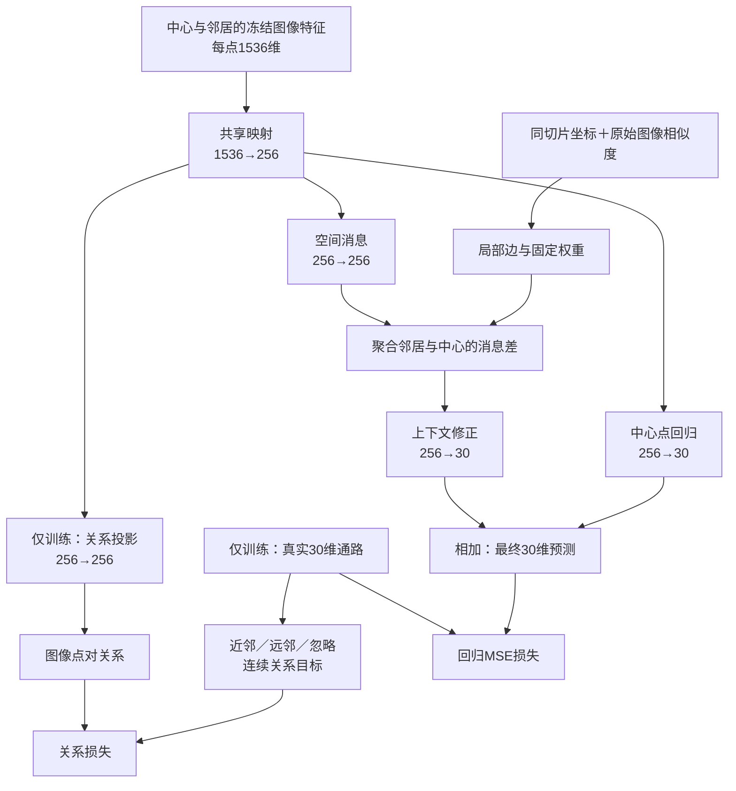

# Phase2 软连接升级：通路关系与局部空间联合方案

版本：v1.1，2026-09-07（按用户指令统一首轮256维；沿用原文件名）。状态：本轮实施规格；尚未编写实验代码、启动训练或确认性能提升。本文确定一个完整候选及其验证方法，实验赢家由后续结果决定。

配套阅读：[学习指南](D:/AI空间转录病理研究/PFMval_new/01_指南与解读/学习指南/Phase2软连接升级_从数据流到设计判断_学习指南_v1_20260907.md)。方案来源：[用户引用的完整讨论](chatgpt-conversation://6a9d918d-ad5c-83ea-bb46-18f1ec59907d)、[用户思考底稿](D:/AI空间转录病理研究/PFMval_new/软连接方案可改进方向思考.md)。本文以本地代码、修复标签和当前项目规则修正讨论中的开放参数及历史推断。

## 一、先确定总模型与研究问题

本轮采用**冻结 UNI2-h 特征＋256维共享表征＋通路软关系监督＋同切片局部邻域修正**。最终仍预测每个点位的30个连续 ssGSEA 通路分数。

要回答三个问题：通路关系监督能否提高通路预测的 PCC（皮尔逊相关系数）；邻域图像能否补充单点输入；两者一起使用是否比单独使用更好。先完整定义模型，再拆成四臂。首轮按已有论文采用过的256维开始检验，不并行开展维度搜索；256维不是已证明的最优宽度，空间修正也不预设有效。



两条线路职责不同：**通路关系在训练时教共享层如何组织特征；空间邻域在训练和预测时提供额外图像信息。**外部患者只参与图像与坐标的前向计算，真实通路标签不进入模型或建图过程。不同患者可以参与训练期语义比较；空间边只能出现在同一切片、同一数据划分内。

## 二、本地事实如何约束本轮设计

| 已核对的项目事实 | 本轮处理 |
|---|---|
| 基线为 `1536→1024→30`，GELU激活、Dropout 0.3；输入是冻结缓存 | 保留缓存，四个新实验臂统一256维并重新初始化；旧1024维模型单列历史参照 |
| 已有30维连续通路目标 | 不改评分方法、通路顺序或预测对象；不新增基因头，不使用基因计数分布损失 |
| MPP2为六名患者各自空间块划分后合并，9,472训练点、1,078验证点 | 使用原划分做机制探索，结论限于已见患者的留出区域；本轮不擅自启动六折留一 |
| 原划分块长672，未启用隔离带；坐标步长因患者而异 | 图需重新按切片与划分建邻接，检查完整输入节点集合的覆盖范围 |
| 当前标签有barcode修复版本；原始划分目录和有效标签目录职责不同 | 从有效修复标签读取分数及标准化参数，原划分目录只提供身份、坐标与集合归属 |
| W007原实现已在本地历史目录找到；结果核验已接受，归因仍待用户审阅 | “残差分支作用位置、软权重尾部、优化竞争”作为待验证假说，不写成已确认原因 |
| 当前交付为独立实验包、用户手动复制、服务器产原始输出 | 未来从模板建包，代码与运行目录分离，派生指标和结果登记在本地完成 |

事实入口：[基线代码](D:/AI空间转录病理研究/PFMval_new/train_mpp_uni2h_mlp.py)、[划分信息](D:/AI空间转录病理研究/PFMval_new/mpp_standard_splits/group_2/split_info.json)、[当前状态](D:/AI空间转录病理研究/PFMval_new/project_state/current_state.json)、[实验登记](D:/AI空间转录病理研究/PFMval_new/experiments/experiment_registry.json)、[独立实验包模板](D:/AI空间转录病理研究/PFMval_new/experiments/_template/README.md)。登记状态与历史结果的具体补充见第十一节。

## 三、论文来源与项目改造的边界

| 来源 | 原方法中与本任务有关的特点 | 吸收的优点 | 本轮具体调整 |
|---|---|---|---|
| DeepPathway | 附件正文直接预测UCell通路分数，并描述由图像/分子相似度生成软目标；公开代码另有硬目标分支，见下文 | 连续关系可以替代只认同点的匹配；直接输出通路 | 保留30维ssGSEA；关系直接由训练通路分数定义，不混入不断变化的图像目标；改为联合回归训练 |
| PEaRL，WACV 2026 | ssGSEA指导图像表征，另设基因预测；使用同点硬配对；分子侧引入空间处理 | 通路监督应进入预测实际使用的图像表征 | 冻结UNI2-h，只更新共享轻量层；不复制分子Transformer、标签预平滑、基础模型微调或基因头 |
| Reg2ST | 面向基因表达，先生成基因潜在特征，再经跨点交互和动态图输出表达 | 预测时保留上下文；聚合内容应能由图像生成 | 使用固定局部图及图像产生的消息，省去完整动态图和计数损失；邻居标签不能参与推理 |
| 本项目的组合设计 | 三状态点对掩码、冻结形态权重、自保留、消息差残差 | 为当前连续标签与已有缓存构造可检验模型 | 全部按待验证设计标注，不归为某篇论文已经证明的结论 |

这三篇论文的“阶段”不能等同：DeepPathway、PEaRL的表征训练与读出训练是训练安排；Reg2ST的中间特征预测与最终表达预测是网络内部流程。本轮采用回归预热后联合学习，不是三篇论文的直接复现。

空间利用也分层：DeepPathway附件在表征阶段加坐标位置编码，读出阶段去掉位置编码；PEaRL在表达预处理做八邻域平滑，分子编码器使用位置与注意力，图像读出不需该分子分支；Reg2ST推理仍有位置条件和跨点交互。本方案不平滑真实标签，而是在预测线路中显式读取同切片邻居。前两种空间监督不能直接等同于部署时的邻域输入。证据：[DeepPathway预印本](https://www.biorxiv.org/content/10.1101/2025.07.21.665956v1)、[PEaRL正式论文](https://openaccess.thecvf.com/content/WACV2026/papers/Majumder_PEaRL_Pathway-Enhanced_Representation_Learning_for_Gene_and_Pathway_Expression_Prediction_WACV_2026_paper.pdf)、[Reg2ST全文](https://pmc.ncbi.nlm.nih.gov/articles/PMC12360703/)。

## 四、输入、输出与空间范围

### 4.1 点位合同

每行至少包含 `patient_id`（患者）、`slide_id`（切片）、`spot_id`（点位）、`split`（数据集合）、坐标 `x,y`、1536维特征及固定顺序的30维训练标签。唯一身份为患者、切片、点位三者组合。现有MPP2文件没有独立切片字段时，实施阶段从切片/裁patch来源建立 `inputs/slide_mapping.csv`，列出patient、原始切片标识、slide_id和映射来源；确认当前患者表只对应一张切片后，才可为该表填写同一个slide_id。不能仅因patient字段相同就推断属于同切片。映射缺失影响空间臂的数据准备，不影响本轮文档交付或重新划分MPP2；不得悄悄以患者ID兜底输出完整空间结果。

空间前向函数为 `predict(features, coordinates, slide_ids, graph)`，不接收真实通路。回归标签只进入损失和评估函数。部署接口需接收一张切片的点表或足够的局部邻居，单个孤立patch只会得到零邻域修正。

有效标签与参数沿用当前barcode修复版本；标准化参数只来自训练集。关系距离使用这一版本的标准化标签，不另做每患者zscore或利用外部数据估计尺度。标签已有裁剪政策需要记录，预测值本轮不额外裁剪、不归一化为单位长度。

导出 `pred_z`（标准化预测）、`pred_raw`（原始ssGSEA尺度）、30条通路有序名称、点位身份和坐标；由 `pred_raw = pred_z × train_sd + train_mean` 逆变换一次。元数据记录参数来源、图设置、所选轮次和代码版本。Phase3患者若与Phase2训练患者重合，训练内预测不能混作未见患者预测；后续独立评价需折外预测或另行划分。

### 4.2 首版邻域用原生网格尺度

当前坐标来自patch命名及划分表，不直接认定为微米。MPP2记录如下：

| 患者 | 原生横纵步长s | 本轮最大半径1.5s |
|---|---:|---:|
| HYZ15040、LMZ12939 | 336 | 504 |
| JFX | 448 | 672 |
| TGC、XSL、ZHZ | 224 | 336 |

以上单位均为该切片的原生坐标单位。首版在同切片、同split内，找距离不超过1.5s的最近8个不同点；规则网格可覆盖水平、垂直和对角邻点。距离相同时按点位ID排序。每个中心独立选邻居，属于有向邻接；不自动对称化、不额外补反向边。缺几个就用几个，不扩大半径补齐。

这保证了相近的网格邻域阶数，**没有保证跨切片相同的组织微米范围**。固定MPP2划分与原生坐标数字不同并不矛盾：项目[坐标审计代码](D:/AI空间转录病理研究/PFMval_new/scripts/audit_mpp_coordinates.py:240)已指出不同患者原始扫描网格分辨率不同；这些数字不能独立证明组织物理尺度不一致。保持用户已固定的MPP2全部集合归属，不重新划分或稀疏抽点。

未来统一物理范围需要各切片的像素尺寸或倍率元数据。外部XZY和Phase3的数据准备规则固定如下：优先使用裁patch配置中的原生步长；无该记录时，仅在完整无标签坐标表上，分别对去重排序后的x、y计算相邻正差，取频率最高的差值，并列取较小值，作为观测步长候选。只有两轴一致、全部坐标落在该步长网格上、且输入来源确认是完整规则裁patch表时，才以该观测网格定义s并注明来源。该推断不能恢复遗漏网格或推断微米单位；条件不满足时补取原裁patch步长，不从稀疏子集或随机批次凑出s。保存 `inputs/slide_geometry.csv` 的slide_id、s、坐标单位和来源。上述规则在打开外部标签前固定；没有可信坐标、切片映射或s时，不生成“完整空间模型”的外测结果。

### 4.3 明确训练、验证与预测的信息范围

- 训练图：仅训练点连接训练点。内部验证图：仅验证点连接验证点。外部图：仅同一外部切片内部连接。模型不经过验证或测试节点向训练节点传消息。
- 图在完整的允许点表上建立；取批次时补取中心所需的一跳邻居。验证与推理分块只改变计算分批，不改变图，因此预测不应随批次顺序或大小变化。
- 原划分报告的零重叠点对不自动证明新输入协议无交叉。实施时检查每个集合实际使用的全部中心/邻居ID与patch覆盖框；两个集合不能复用节点或有图边穿越，也不能出现正面积图像重叠。发现坐标或覆盖证据矛盾要报告并修正数据范围，不能静默删点或沿用旧“零泄漏”结论。
- 不把两个集合的邻域外接矩形相交直接等同于像素复用：应检查实际使用的patch集合。即使无复用，同患者、邻近区域仍有空间依赖；这属于本轮机制验证的边界。
- 验证侧较稀疏、完整切片部署较稠密，分别报告邻居数、孤立比例、总邻居权重。不能用外部标签调半径弥补差异。

## 五、模型与软连接的精确计算

### 5.1 首轮维度选择与三个256维向量

| 位置 | 本版尺寸 | 依据及作用 |
|---|---|---|
| 共享表征h | 1536→256 | 参考PEaRL用256维图像表征承接后续预测的设置；作为首轮回归容量，替换原稿512维 |
| 关系投影z | 256→256，随后L2归一化 | PEaRL和DeepPathway公开配置均采用256维对齐空间；本轮采用这一宽度，但仍使用本项目的图像内关系损失 |
| 空间消息v | 256→256 | 与共享节点同宽，统一首版接口；这是本项目的工程选择，不声称三篇论文验证过相同空间模块的最优消息维度 |
| 单点输出与空间修正 | 各自256→30 | 输出维度由既有30条通路决定 |

来源：[PEaRL方法第3.2—3.3节](https://arxiv.org/html/2510.03455v1#S3)、[DeepPathway V1.0.2配置](https://github.com/aahsan045/DeepPathway/blob/V1.0.2/config.py)。PEaRL的256维表征同时用于对齐和下游读出；DeepPathway另有128维回归头隐藏层，不能把论文中的所有层统称为256维。本版借鉴已使用的表征/对齐宽度，没有复现其完整网络，也没有据此证明256维最适合本项目。

h、z、v虽同为256维，仍是三个职责不同的向量。256→256的可学习映射能够改变特征方向与相似度，并不等于原样复制；W_r与W_v保持独立，关系项只归一化z，回归与空间消息不因此丢掉数值幅度。空间同宽是统一实现的选择，不承诺比128维保存更多有效预测信息。输入1536、输出30由数据合同固定；batch=256是每批中心数量，与特征维度无关。

令 `x_i` 为冻结1536维输入，`h_i = GELU(W_h x_i + b_h)` 为256维共享特征。

中心预测：`y_point_i = W_o Dropout(h_i, 0.3) + b_o`。关系投影：`z_i = normalize(W_r h_i)`，256维，仅训练使用。空间消息：`v_i = W_v h_i`，256维，训练和预测都使用。`W_r`与`W_v`不共享，均不带偏置。关系与空间分支读取Dropout之前的h；不引入BatchNorm或整批注意力。

关系监督通过 `关系损失→W_r→共享层W_h` 反向传播。共享层不能detach（切断梯度）；UNI2-h缓存始终不更新。这里对齐的是**点位之间的关系**，不是256个特征坐标与30条通路逐项匹配，也不是30×30通路网络。

### 5.2 关系距离与三状态规则

用训练标准化标签计算 `D_ij = mean_p[(y_ip − y_jp)^2]`，平均覆盖全部30条通路，不再对D平方。

先按 `(patient_id, slide_id, spot_id)` 字符串元组排序，确定固定中心序号。预先仅从训练点有放回、均匀抽取200,000个非自身有序点对，固定随机种子20260907；允许同患者和跨患者点对。距离使用活动修复版本完成既定变换和裁剪后的训练z标签。计算D的10%分位数 `d_near` 和50%分位数 `d_far`，分位数用线性插值，保存数值和抽样设置。四臂及各训练种子共用 `relations_train.json` 中这一份训练阈值；阈值整个运行固定，不按验证或外部结果变化。此抽样不涉及文件哈希。

每个训练批次的中心点互相构成关系候选。对中心i：

1. **近邻**：仅在当前中心batch内，从 `j≠i 且 D_ij≤d_near` 中取距离最近的至多8点，距离并列按固定中心序号升序，记为 `N_i`。
2. **远邻**：仅在当前中心batch内，从 `D_ij≥d_far 且 D_ij>d_near` 中无放回均匀抽取至多32点，记为 `F_i`；专用随机流由本运行种子、轮次、批次序号和中心固定序号决定，与模型结构无关。
3. **忽略**：其他点全部记为忽略，包括第9个及以后仍然相近的点。自身永远排除。

“近”只是按这30条标签选出的候选，不是经生物学验证的真阳性；不强求跨患者近邻。无近邻或无远邻的中心本批不计算关系项，但照常计算回归。记录有效中心比例、近/远邻数、跨患者近邻比例及标签距离分布，避免把大量失活的辅助项解释为有效机制。

定义 `S_i = N_i ∪ F_i`，温度固定 `tau_y=1.0`、`tau_z=0.1`：

```text
Q_ij = exp(-D_ij/tau_y) / sum(k in N_i) exp(-D_ik/tau_y)   j in N_i
Q_ij = 0                                                   j in F_i

P_ij = exp(cos(z_i,z_j)/tau_z) / sum(k in S_i) exp(cos(z_i,z_k)/tau_z)
L_rel = mean(有效中心i) [-sum(j in N_i) Q_ij log(P_ij)]
```

整批无有效中心时 `L_rel=0`。实现用稳定的log-softmax计算；Q和掩码由无梯度标签产生。**忽略点同时退出Q支持集和P分母。**仅把Q置零而仍留在P分母，会继续把这些点当负样本；这不符合本方案。

这里的零目标远邻确实会被推远；被忽略点只是在这一项损失中没有直接成对约束，仍可能因共享参数和其他点对间接变化。稠密软目标及阈值截断谁更好，需要后续对照。30条通路有相关与基因重叠时，普通距离可能重复计权；首轮保持距离简单，协方差度量留作独立后续变量。

### 5.3 固定局部权重与自保留

对空间候选j，令 `rho_ij = distance(coord_i,coord_j)/s_slide`，`c_ij`为原始冻结特征的余弦相似度；只为边权计算归一化原始特征。

```text
b_ij = exp(-rho_ij²/2) × exp((c_ij - 1)/0.2)
a_ij = b_ij / (1 + sum(k in 空间邻居) b_ik)
a_self = 1 / (1 + sum(k in 空间邻居) b_ik)
m_i = sum(j in 空间邻居) a_ij × (v_j - v_i)
delta_i = W_delta m_i
y_hat_i = y_point_i + delta_i
```

`a_self + sum a_ij = 1`；邻域越不可靠，修正总权重越小。`W_delta`是无偏置256→30线性层，初始化为零。无邻居时m严格为零，修正也为零；初始前向与同权重的单点分支相同，但训练后不承诺维持旧基线性能。首个优化步骤中W_v因W_delta为零而无回传梯度，W_delta获得更新后再逐步训练消息映射，这是有意的暖启动；预热期间关系投影也不受关系项更新。

固定的是**候选边与权重**，由同一输入表的坐标和冻结图像特征预先计算；共享层、消息映射、修正输出与回归头均可训练。本轮只有一跳，不递归传播，不引入真实邻居通路，不把邻居最终分数直接求平均。

形态不同的邻居也可能携带肿瘤—免疫界面信息，所以该权重只是待验证先验。第九节设置“仅距离权重”对照检验是否误抑制有用邻居。

### 5.4 参数预算

按上述偏置设置计算，256维单点回归有401,182个可训练参数；关系投影增加65,536；空间消息与修正增加73,216。仅关系为466,718，仅空间为474,398；完整模型训练共539,934，推理移除关系投影后为474,398。旧1024维回归头约1,604,638。此处是结构计算，不是实测显存、速度或过拟合结论。

每批256个中心最多补取2,048个邻居，去重前共2,304行1536维输入；float32输入本身约13.5 MiB。关系矩阵只在256个中心上计算。完整图只保存稀疏邻接，不建立全切片可训练注意力矩阵；实际峰值显存与耗时仍以实现后的运行记录为准。

## 六、训练与选点规则一次写清

| 设置 | v1.1固定值或做法 |
|---|---|
| 初始化 | 每个种子初始化一份完整结构并保存各模块初值；对应臂复制共享层/单点头，relation与joint再共用W_r初值，spatial与joint共用W_v/W_delta初值；不加载旧B0监督权重 |
| 中心采样 | 每轮打乱全部训练中心一次，无放回；batch=256；四臂使用相同中心序列 |
| 邻居加载 | 只为有空间模块的臂补取一跳图像邻居；本批MSE和关系项只对中心计分 |
| 随机数 | 中心采样、Dropout、关系采样分别设随机流；公共Dropout只对相同顺序中心调用，同种子的relation与joint使用相同N/F支持；新增模块不得改变公共初值或消耗公共随机流 |
| 优化 | AdamW，学习率0.0003，weight_decay=0.0001；无学习率搜索，默认float32 |
| 总损失 | `L_MSE = sum_i sum_p (y_hat_ip-y_ip)^2 / (B×30)`，B为当前中心数，30条通路等权；再加 `lambda(epoch) L_rel`。标签须完整有限，不另设缺失标签掩码或静默填值 |
| 预热 | 第1—5轮lambda=0，预测模块加入优化器；零初始化带来的首步梯度行为按第5.3节处理 |
| 引入关系 | 第6—15轮lambda依次为0.005、0.010、…、0.050；其后保持0.050 |
| 最长预算 | 60轮；所有臂具有相同上限与选择规则 |
| 模型选择 | 从第6轮起按内部验证的“患者等权逐通路PCC”选checkpoint；第16轮前计数置0，早停参考分数设为第6—15轮最佳。此后仅当当前分数严格大于早停参考分数＋0.0001时更新参考并清零计数，否则加1，累计10轮停止；checkpoint另按下行平分规则保存 |
| 平分规则 | 选择分数差不超过0.000001时，取内部标准化MSE较低者；仍相同取更早轮次 |
| 预热记录 | 保存第1—5轮最佳点作诊断，不混作四臂正式终点；正式终点记录当时lambda |
| 种子 | 第一批42，共四臂；完成必要检查后43和44仍补齐全部四臂，总计划12次训练，不挑单一最佳种子 |

“同预算”指相同训练数据、上限和规则，不保证早停轮数或耗时相同。记录实际中心更新次数、轮数与时长。不用XZY改变早停、lambda、温度、阈值、维度或图结构。预热后才纳入正式选择是本轮协议选择，防止关系臂选中尚未启用关系项的模型；历史B0因此只是参照。

服务器每轮记录训练损失、内部选择指标及MSE；同时记录关系有效比例、邻域统计和修正量RMS/单点预测RMS。用一个固定训练批在第6、15轮观察共享层收到的回归与关系梯度范数，可帮助判断辅助信号是否失活或量级过大；不自动修改损失权重，也不凭两个范数宣布存在优化冲突。

## 七、四臂验证从完整候选拆出

| 中文实验名 | 配置中的arm名称 | 通路关系 | 局部空间 |
|---|---|---:|---:|
| 完整联合 | `joint` | 开 | 开 |
| 仅空间 | `spatial` | 关 | 开 |
| 仅关系 | `relation` | 开 | 关 |
| 匹配回归 | `point` | 关 | 关 |

这些英文名称只作程序参数，正文使用中文。四臂共享256维主干、初始化配对、MSE、预热、选择规则、数据与通路集合。四臂允许因模块而增加参数；因此第一轮可以判断组合的实用价值，但不能单靠它证明所有增益都来自额外空间信息。

逐种子计算：完整联合减匹配回归表示总收益；完整联合减仅空间表示已有空间时的关系增量；完整联合减仅关系表示已有关系时的空间增量；仅关系、仅空间各减匹配回归表示单独收益。再计算 `完整联合−仅关系−仅空间＋匹配回归`，作为交互的描述量，不当作已确证协同或因果检验。

完整模型即使不是第一名，也保留其结果；若仅关系更优，就支持精简部署候选。实施规格确定不等于提前确定优胜臂。

## 八、PCC、尺度和不确定性怎样判读

### 8.1 预先固定内部选择分数

先在每名患者的内部验证点上，逐条通路计算PCC，再平均该患者通路，最后六名患者等权平均。命名为 `patient_macro_pathway_pcc`，与旧“把所有患者点合并后逐通路平均”的 `mean_per_pathway_pcc` 分开保存。两种PCC都不能与展平PCC混写。

目标恒定而无法定义PCC的患者—通路组合，在四臂共同的目标有效集合中标记不可计算；固定集合及原因。目标有效但预测恒定时，报告PCC不可定义，选择分数对该项记−1，防止通过减少有效项虚增选择分数；这只是一条明确的选点惩罚，不把−1冒充实测PCC。非有限预测属于训练失败，不静默填零。

### 8.2 本地保留全部指标

所有指标在同一选中checkpoint、相同点集上计算，保存患者、通路和随机种子分层明细。既有的逐通路平均PCC、标准化展平PCC、RMSE、MAE、原始尺度R²、CCC（一致性相关系数）、空间Moran's I、masked SSIM（有效组织窗口结构相似度）、NRMSE及Top-k通路重叠等继续保留；按[当前指标政策](D:/AI空间转录病理研究/PFMval_new/project_state/current_state.json)明确缺失或不适用状态，不为凑齐指标填假数。展平PCC必须注明使用标准化还是原始尺度。

本轮**内部选型**以患者等权逐通路PCC为主，不替用户预定论文最终主指标。固定报告30条通路全部变化。PCC上升而原始误差或CCC变差，只能称为相关性改善，不能宣布绝对评分或Phase3全面受益。

### 8.3 晋级建议是提示，不是通用门禁

相对匹配回归，三种子平均PCC绝对提升≥0.01、至少2/3种子同向，可列为优先继续的候选；同时观察是否至少4/6患者同向。0.01是本轮用于讨论投入的实际增益参考，不是文献公认阈值，也不是统计显著性。标准化RMSE相对恶化超过5%时单列提醒，不隐藏结果、不自动否决用户继续。

先报告每个种子的配对差及均值/标准差。需要区间时，本地在患者内以原空间块成组、各臂共用抽样索引，估计条件于这六名患者的配对差95%区间；不把相关spot当独立样本。六名已见患者的区域验证、三个随机种子及一名XZY都不能支撑患者总体的强泛化置信区间。

XZY已经被历史实验反复报告，不能再称为从未查看过的全新外测。待本轮内部方案、补充消融、代码版本和checkpoint冻结后，集中做一次固定协议外部评估；之后如根据外部表现再改模型，必须披露该次结果成为开发信息。更强泛化需要另行保留患者或新外部队列，六折留一仍按当前决定暂缓。

## 九、首轮之后的最小机制对照

按内部结果定位问题后选择对应项，不将下面所有组合扩成网格搜索；新增对照仍使用相同种子、数据和选择规则。

| 需要回答的问题 | 对照只改变什么 | 能支持的有限结论 |
|---|---|---|
| 截断与忽略机制有无价值 | 三状态目标换成批内所有非自身点的稠密软目标，网络与温度不变 | 这一组关系目标/支持集策略是否更好，不能把差异全部归因于单个阈值 |
| 关系来自标签对应还是一般正则化 | 固定打乱辅助关系使用的训练标签对应；MSE真标签不动，阈值与规则相同 | 真实对应关系是否比打乱关系更有用 |
| 形态权重是否有益 | 将b中的形态因子设为1，候选图和其余结构不变 | 形态优先在当前数据上是帮助还是损害 |
| 自保留是否有益 | 非空邻域改成b/sum(b)，仍保留空邻域零消息 | 允许减小邻域总权重是否减少不可靠修正 |
| 空间收益是否只是参数增加 | 在匹配回归上加同尺寸中心分支 `W_delta W_v h_i`，不读邻居 | 额外邻域输入是否优于相近参数量的中心模型 |

如果后续要直接比较论文式硬配对与软配对，另设同结构轻量双编码器：图像1536→256→256，通路30→256→256，同一回归头与空间设置；两臂仅改跨模态匹配目标。该补充设想沿用256维，尚不属于首轮四臂。硬目标为同点；软目标必须保留同点并明确定义非同点权重。不能把本方案单侧图像关系Q直接换成单位矩阵，称作PEaRL复现。

首轮固定共享表征、关系投影、空间消息均为256维，先完成四臂检测，不增加维度扫描。只有内部验证显示当前设定不适合时，才结合问题所在调整：共享表征涉及回归容量，关系投影涉及相似度学习，空间消息涉及邻域分支；每次只改一处并保留对应匹配对照。512/1024等共享宽度、128等辅助宽度不属于首轮运行清单，也不能仅因完整联合未获益就归咎于维度。两阶段冻结读出、可学习图、超图、通路协方差距离仍留作后续独立问题。256维完整模型相对旧B0的变化同时含容量、训练协议与模块变化，不得拆不开便宣布旧残差位置导致失败。

## 十、实施落点、验收与服务器交付

### 10.1 本轮文档之后的代码任务

未来代码包名称定为 `phase2_softlink_local_v1`，从模板复制到本项目 `experiments/phase2_softlink_local_v1/`。本次仅交付方案与学习指南，该代码目录和下述命令入口尚未实现。

| 包内文件 | 责任 |
|---|---|
| `src/data.py` | 包内数据加载；正确拼接原划分与修复标签；返回身份、坐标与邻居索引 |
| `src/graph.py` | 按split和slide建一跳图；原生尺度、半径、固定边权 |
| `src/model.py` | 共享层、点位头、关系投影、空间消息与修正，提供不接收标签的预测接口 |
| `src/relations.py` | 训练阈值、三状态支持集、Q与关系损失 |
| `src/train.py` | 四臂开关、固定种子、训练与内部选点；接收模板的config和run-dir参数 |
| `src/predict.py` | 在冻结checkpoint上产生内部/外部预测及身份元数据 |
| `src/analyze_local.py` | 从回传原始文件生成所有派生指标、配对比较和图表 |
| `configs/`、`inputs/` | 四臂小配置、原划分、通路顺序及有效标准化参数；大缓存和权重用绝对路径引用 |

复制必要代码时记录来源路径和日期，移除对仓库上级目录的导入依赖；只保留本任务所需模块。优先参考已有独立包中的[MLP](D:/AI空间转录病理研究/PFMval_new/experiments/mpp2_uni2h_mlp_baseline_20260906/src/models/uni2h_mlp.py)和[manifest加载](D:/AI空间转录病理研究/PFMval_new/experiments/mpp2_uni2h_mlp_baseline_20260906/src/data/manifest.py)，以及W007中的活动修复标签解析函数。原包的spatial_stride是稀疏抽样，不是本轮的邻域图；原W007每患者5点、batch=30的采样器也不直接迁入新方案。新四臂统一使用本轮batch=256和普通点位MSE，因此与旧W007的患者等权MSE协议有差异，历史结果不作为严格配对比较。

沿用[模板启动器](D:/AI空间转录病理研究/PFMval_new/experiments/_template/run.ps1)，配置为明确实验后才取消demo标记。可以复用原代码读取规则，不应照抄把NaN静默补零、盲目裁剪预测或旧登记流程的行为。

### 10.2 只做必要验收

实施阶段用一个合成小批次完成三组联合检查：

1. **关系和梯度**：自身/忽略项确实不在分母，Q近邻权重和为1；关闭关系时损失回到回归；单独反传关系项能更新共享层，标签没有梯度。
2. **图和推理**：无跨slide/split边；空邻域与零初始化给零修正；同一完整图分不同批次、改变点顺序再还原ID，预测一致；推理不读取标签。
3. **输出和独立包**：一份小型真实输入核对30列、身份、有效修复参数与一次逆标准化；包从项目外工作目录导入/前向成功。此检查不做优化器更新，不作为训练或性能证据。

再对全部小型元数据做一次集合/坐标覆盖检查，输出计数与异常来源即可；不创建复杂治理框架、不默认计算哈希。缓存加载或依赖出现实际故障时针对故障处理，不安排无关测试矩阵。

### 10.3 上传、启动和回传

未来需要复制的本地**代码文件夹**：

```text
D:\AI空间转录病理研究\PFMval_new\experiments\phase2_softlink_local_v1
```

服务器代码与结果分别使用：

```text
D:\AIPatho\qzs\code\phase2_softlink_local_v1
D:\AIPatho\qzs\runs\phase2_softlink_local_v1\<运行编号>
```

路径、解释器及已有缓存以[本项目服务器配置](D:/AI空间转录病理研究/PFMval_new/configs/server_paths.yaml)为源；这里是配置记录，不是本次现场测试。不得把本机RTX4060或本机Conda解释器当服务器环境。

有效修复标签已由[活动修复登记](D:/AI空间转录病理研究/PFMval_new/project_state/mpp_repair_registry.json:4)和[现有独立基线配置](D:/AI空间转录病理研究/PFMval_new/experiments/mpp2_uni2h_mlp_baseline_20260906/config.json:7)交叉定位为：

```text
D:\AIPatho\Patch\mpp_zscore_repair_staging\barcode-repair-20260711-d626ad8-v003\group_2\labels
```

这是已有登记值，非本次服务器实测。`server_paths.yaml`目前缺这一输入条目；实施时将该值和同一修复group下的标准化参数补入服务器路径配置，再由它生成包的显式输入配置。本轮仅在方案中指出该缺口，不改写机器源，也不退回旧标签目录或启动哈希校验。

包实现并获训练指令之后，用户进入代码目录运行，例如首个完整联合种子42配置：

```powershell
Set-Location -LiteralPath 'D:\AIPatho\qzs\code\phase2_softlink_local_v1'
.\run.ps1 -Config '.\configs\joint_seed42.json'
```

上述配置文件是待实现命名，当前不可执行。每次启动由模板新建运行目录；首次计划按12次独立运行逐次组织，不默认并行占满服务器。修复只替换代码文件夹，保留全部旧运行。

每个运行保存 `run.json`、实际配置与版本、训练历史、最佳及最后checkpoint；`raw/`保存选中模型预测、必要真实标签、点位表、通路顺序、标准化参数、图参数及选择记录。服务器只计算训练、早停、选点需要的指标。内部结果先回传分析，外部预测在协议冻结后另行执行；不能每轮计算XZY用于观察调参。

用户将原始运行文件夹复制回：

```text
D:\AI空间转录病理研究\PFMval_new\experiments\phase2_softlink_local_v1\runs\<运行编号>
```

本地派生文件写入同一实验的 `analysis/<运行编号>/`，不覆盖raw。保留全部既定指标，并按当前登记方式标为待登记/待审；只有用户确认并在Registry中明确accepted才能称为已确认结果。本轮不创建压缩包、不提交推送、不远端同步。

## 十一、证据核查与引用

### 论文版本与公式定位

- **DeepPathway**：本轮详细核查版本为用户附件对应的[bioRxiv预印本](https://www.biorxiv.org/content/10.1101/2025.07.21.665956v1)，第3页式(1)为两模态内部相似度生成软目标，第4页式(3)为UCell，第7页图3与方法描述直接读出；另有[Bioinformatics出版入口](https://doi.org/10.1093/bioinformatics/btag643)，不能把预印本定位冒称为正式版逐字核验。主对话通过GitHub连接器进一步检查[V1.0.2的models.py](https://github.com/aahsan045/DeepPathway/blob/V1.0.2/models.py)：`BLEEPOnly`含软目标；`BLEEPWithOptimus`使用单位矩阵硬目标，而`DeepPathway`加载后者结构与权重。因此，正文软目标思想和该公开分支行为必须分开表述；本次没有重跑其训练或独立核验发布checkpoint的实际训练历史。
- **PEaRL**：[WACV 2026正式论文](https://openaccess.thecvf.com/content/WACV2026/papers/Majumder_PEaRL_Pathway-Enhanced_Representation_Learning_for_Gene_and_Pathway_Expression_Prediction_WACV_2026_paper.pdf)，第4页式(1)—(8)为ssGSEA及带位置的通路编码器，第5页式(9)—(13)为同点硬配对，式(14)—(18)为通路/基因预测头；同页预处理说明八邻域平滑。平滑发生在标签构造前，不是一个部署时的图网络。可复核[项目内PDF](D:/AI空间转录病理研究/PFMval_new/Ai病理项目文献汇总/01_HE映射空间转录组模型/Majumder_PEaRL_Pathway-Enhanced_Representation_Learning_for_Gene_and_Pathway_Expression_Prediction_WACV_2026_paper.pdf)。
- **Reg2ST**：[正式全文](https://pmc.ncbi.nlm.nih.gov/articles/PMC12360703/)，PDF第4页式(4)—(11)为位置条件、交叉注意力与动态邻域，第5页式(19)—(28)为硬同点对比及组合损失。其动态图依据增强图像与预测基因特征选择邻居，不等于物理半径图；基因分数经其预处理，不是本项目的30维连续通路。本文引用其上下文思路，并未复现其完整网络或性能。[作者代码](https://github.com/Holly-Wang/Reg2ST)。

### W007原实现与结果的本地补齐

引用对话曾报告远端未取回W007，本轮已找到[历史model.py](D:/AI空间转录病理研究/PFMval_new_governed_workspaces/W007/experiments/workspaces/W007/mpp2_cpgcr_probe/mpp2_cpgcr/model.py:102)、[losses.py](D:/AI空间转录病理研究/PFMval_new_governed_workspaces/W007/experiments/workspaces/W007/mpp2_cpgcr_probe/mpp2_cpgcr/losses.py:196)与[训练代码](D:/AI空间转录病理研究/PFMval_new_governed_workspaces/W007/experiments/workspaces/W007/mpp2_cpgcr_probe/mpp2_cpgcr/train_eval.py:551)。旧方案冻结B0，训练1536→256的图像投影和30维零初始化残差头；HCR/CPGCR还训练通路编码器。对比梯度能影响残差使用的图像投影，但不会更新冻结B0。这支持“本轮改变主要预测表征的训练位置”的描述，不能证明旧结构是失败原因。原四臂没有随机标签对照，不能把RCC解释成随机对照。

Registry对 `mpp2_cpgcr_probe_v001_20260811` 记录 `done`、`evidence_status=accepted`，同时 `analysis_status=pending_user_review`。含义是四臂运行/结果核验已经接受，深入归因尚待审阅；历史包README中的“实施中、未批准训练”是过时快照，不覆盖Registry。以下仅摘录已登记单种子42结果：

| 旧实验臂 | 内部患者等权z-MSE↓ | XZY标准化展平PCC↑ | XZY标准化MSE↓ |
|---|---:|---:|---:|
| FBR，冻结基线重放 | 0.380743 | 0.654896 | 0.662077 |
| RCC，仅残差回归 | 0.378252 | 0.653758 | 0.659534 |
| HCR，硬配对残差 | 0.379641 | 0.655982 | 0.658109 |
| CPGCR，软配对残差 | 0.378847 | 0.654932 | 0.656832 |

来源：[Registry对应记录](D:/AI空间转录病理研究/PFMval_new/experiments/experiment_registry.json:2017)。这里的展平PCC不是本轮的患者等权逐通路PCC。数值方向混合、差异小，与登记中“无明确残差赢家”的表述一致。本轮没有重新训练或根据这些数值挑超参数。

Phase3当前部分合同仍为 `legacy_zscore_compatibility`（旧标准化兼容输入）；本方案导出原始尺度及身份元数据，不等于已经完成对所有现存Phase3消费者的直接替换。衔接时仍需按实际消费者核对列序、坐标、尺度和患者归属。

### 项目事实源

- [当前方法、暂缓事项与全部指标政策](D:/AI空间转录病理研究/PFMval_new/project_state/current_state.json)：Phase2先改进软对比联合学习，六折留一暂缓。
- [实验登记](D:/AI空间转录病理研究/PFMval_new/experiments/experiment_registry.json)：W007及基线的状态以对应记录为准，文件存在不代表结论获确认。
- [MPP2划分表](D:/AI空间转录病理研究/PFMval_new/mpp_standard_splits/group_2/split_manifest.csv)与[划分说明](D:/AI空间转录病理研究/PFMval_new/mpp_standard_splits/group_2/split_info.json)：身份、坐标、split与原生步长。
- [加载器](D:/AI空间转录病理研究/PFMval_new/dataset_mpp_manifest.py)与[MLP基线](D:/AI空间转录病理研究/PFMval_new/train_mpp_uni2h_mlp.py)：特征读取和回归接口；有效标签目录需与原划分目录分别解析。
- [服务器路径](D:/AI空间转录病理研究/PFMval_new/configs/server_paths.yaml)与[手动交付规则](D:/AI空间转录病理研究/PFMval_new/project_state/governance/独立实验包与手动回传_20260905.md)：代码/运行目录与回传边界。

### 本版相对引用讨论的明确取舍

按用户本轮指令，将原稿的512维共享层及两个128维辅助分支统一调整为256维，首轮先检验这一设定；保留完整候选与四臂思路，补齐训练阈值、两层掩码、原生网格半径、边权公式、无邻居行为、模型选择和独立包合同。把“外部从未看过”“物理坐标尺度已统一”“旧软连接失败根因已确认”等过强说法收回。对于仅有论文思想支持、尚无本项目结果的模块，统一写为候选设计。
