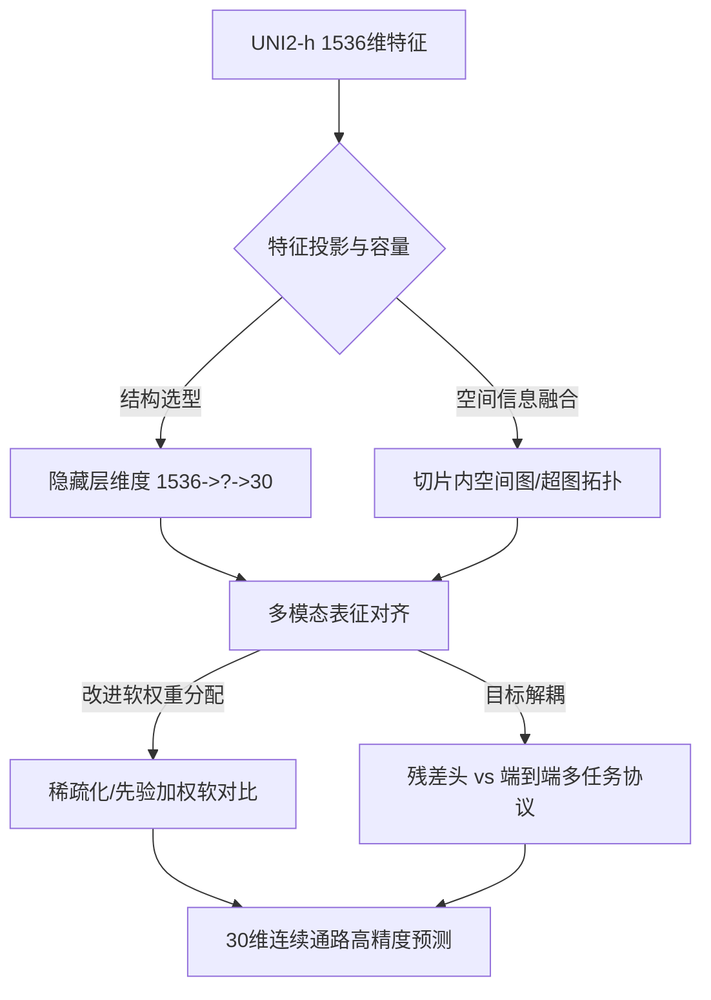

# Phase2 软连接改进与空间网络调研：GPT 网页端深度研究引导方案

> **文档性质**：开放式科研调研与 Prompt 引导框架（专为投喂 GPT 网页端 Deep Research / 思维链深度调研设计）  
> **创建日期**：2026-09-06  
> **关联思考底稿**：[软连接方案可改进方向思考.md](file:///D:/AI%E7%A9%BA%E9%97%B4%E8%BD%AC%E5%BD%95%E7%97%85%E7%90%86%E7%A0%94%E7%A9%B6/PFMval_new/%E8%BD%AF%E8%BF%9E%E6%8E%A5%E6%96%B9%E6%A1%88%E5%8F%AF%E6%94%B9%E8%BF%9B%E6%96%B9%E5%90%91%E6%80%9D%E8%80%83.md)  
> **基线实现参照**：[train_mpp_uni2h_mlp.py](file:///D:/AI%E7%A9%BA%E9%97%B4%E8%BD%AC%E5%BD%95%E7%97%85%E7%90%86%E7%A0%94%E7%A9%B6/PFMval_new/train_mpp_uni2h_mlp.py)  
> **历史软对比代码**：[model.py](file:///D:/AI%E7%A9%BA%E9%97%B4%E8%BD%AC%E5%BD%95%E7%97%85%E7%90%86%E7%A0%94%E7%A9%B6/PFMval_new_governed_workspaces/W007/experiments/workspaces/W007/mpp2_cpgcr_probe/mpp2_cpgcr/model.py)、[losses.py](file:///D:/AI%E7%A9%BA%E9%97%B4%E8%BD%AC%E5%BD%95%E7%97%85%E7%90%86%E7%A0%94%E7%A9%B6/PFMval_new_governed_workspaces/W007/experiments/workspaces/W007/mpp2_cpgcr_probe/mpp2_cpgcr/losses.py)

---

## 一、 背景基准与真实数据合同（供 GPT 理解上下文）

在将本方案输入大模型前，必须先锁定我们项目的核心工程事实与数据约束：

1. **输入特征**：
   - 组织病理 HE 染色全切片（WSI）局部 Patch 特征，提取自病理大模型 **UNI2-h（ViT-Large 变体）** 的 CLS Token，维度为 **$1536$ 维**，已离线冻结并缓存。
2. **预测目标**：
   - **$30$ 维连续 ssGSEA 通路活性评分**（经过训练集标准差与均值归一化的标准化连续数值，非离散分类标签）。
3. **数据规模与队列**：
   - 内部集：6 例食管鳞癌（ESCC）患者切片（约 10,000 个 spot）；
   - 外部独立测试集：1 例严格未见过的患者切片（XZY，1,039 个 spot）；
   - 关键物理属性：每个 spot 拥有精确的组织学物理坐标 $(x, y)$，且内部切片呈现显著的空间自相关性（Moran's I 约 0.27~0.3+）。
4. **现有对照与瓶颈（W007 历史经验）**：
   - **直接回归基线（B0）**：`Linear(1536, 1024) -> GELU -> Dropout(0.3) -> Linear(1024, 30)`，外部 XZY 逐通路平均 PCC 约为 0.5194。
   - **软对比残差方案（CPGCR）**：保留冻结 B0，增加 `1536 -> 256 -> 30` 残差分支，并在批内样本间使用基于 30 维真实通路欧氏距离的连续高斯软标签对齐。结果显示其相对基线提升微弱（外部 PCC 约为 0.5190），瓶颈主要在于：**小样本过拟合**、**辅助对比损失与回归 MSE 存在优化目标竞争**、以及**全样本 Softmax 带来了长尾噪声**。

---

## 二、 核心研究问题重塑与精炼表述

将草稿中的口语化思考提炼为科研层面的 5 个核心议题，供大模型进行针对性攻关：



### 议题 1：表征对齐（Alignment）与回归头（Regression Head）的解耦关系
- **概念澄清**：对齐应发生在**跨模态低维度量潜空间（Latent Space，如 256/512 维）**，而不是直接在 30 维物理预测输出上强行做对比。
- **调研核心**：参考 PEaRL、CLIP 或 ST-FM 等架构，对比学习最佳是在**特征提取器与下游回归头之间扮演“表征正则化器”**，还是采用“两阶段预训练—微调（Pretrain-Finetune）”？如何避免表征对齐的余弦相似度优化冲撞回归任务对绝对数值（Amplitude/Offset）的敏感性？

### 议题 2：隐藏层与模型容量（Capacity）的优秀配置范式
- **现状思考**：基线目前采用直接从 1536 压缩到 1024 再到 30。在只有 6 例患者、上万 spot 的空间转录组场景下，隐藏层过宽极易记住患者特异的组织染色背景。
- **调研核心**：在空间组学及病理视觉特征迁移任务中，主流顶会（如 Nature Methods、Bioinformatics、CVPR、NeurIPS）通常如何设计从病理基础模型到生物分子的 MLP/瓶颈层？是否采用瓶颈压缩结构（Bottleneck，如 1536 → 512 → 256 → 30）或轻量多尺度投影？

### 议题 3：软对比机制的权重分配精细化（消除长尾奇异权重）
- **痛点澄清**：当前代码通过 `softmax(-distance^2 / tau_y)` 为整个 batch 的所有 spot 对计算相似度，导致远距离不相关的 spot 也被分配了微小概率（Softmax 熵过大、负样本不纯粹）。
- **调研核心**：
  - **样本级（Spot-level）**：如何引入自适应截断、Top-K 软相似度、或最优传输（Optimal Transport / Sinkhorn）机制，避免向无关样本分配奇异权重？
  - **通路级（Pathway-level）**：30 条通路并非相互正交，某些通路间存在显著的基因重叠或生物学协同。是否可以利用通路协方差矩阵（Pathway Covariance）或生物学先验知识来指导距离度量？

### 议题 4：切片内物理空间拓扑的引入（图网络 vs 超图网络）
- **严格约束**：**跨患者切片绝无空间几何关系**，批量训练时不同患者样本打散混合，绝不可构建跨患者伪连边；空间建模必须严格限制在**同一患者切片的局部物理邻域**内。
- **调研核心（开放探索）**：
  - **图神经网络（GNN）路线**：切片内基于物理坐标 $(x, y)$ 构建局部 k-NN 或 Delaunay 三角剖分图，使用单层轻量 GCN/GAT/GraphSAGE 聚合局部微环境形态。
  - **超图神经网络（HGNN）路线**：肿瘤微环境中不仅存在点对点关系，还存在多点协同的组织学结构（如“肿瘤巢”、“间质免疫浸润带”）。能否将特定形态聚类或局部空间窗口定义为超边（Hyperedge），通过超图卷积捕获高阶微环境交互？
  - **空间平滑正则化（Loss-based）路线**：不改动前向推理网络，仅在训练损失中增加切片内局部空间连续性惩罚（如空间拉普拉斯平滑损失或局部 Moran's I 正则项）。

### 议题 5：残差头（Residual Head）与参数量膨胀的根本归因
- **取舍思辨**：
  - 若保留残差头：残差分支应该专门学习“基线未能捕捉的空间局部扰动”，还是学习“对比对齐后的纯净表征增量”？
  - 若移除残差头：转为端到端网络，如何保证初始化时具备 accepted 基线的性能兜底，防止直接端到端训练发散或破坏预训练基准？

---

## 三、 供大模型发散探索的开放建议方向

为避免思维被定势局限，可提示 GPT 重点围绕以下两个方向展开探索，并鼓励其提出创新的混合形态：

### 建议方向 1（表征与度量层面）：稀疏化/截断式连续几何软对比（Sparse / Top-K Soft Contrast）
- **核心设想**：不改变单点推理的极速特性，仅改造训练期对比损失。摒弃全局全连接 Softmax，对每个 Anchor spot 仅在其通路距离最近的 $K$ 个正样本（或具有统计显著相似度的动态半径内）保留连续软权重分配，对其余样本实施硬负样本截断或掩膜隔离。
- **衍生探索**：研究可学习温度系数 $\tau$、基于通路层次树（Pathway Hierarchy）的结构化度量学习。

### 建议方向 2（空间与拓扑层面）：切片内受限的空间图 / 超图拓扑建模（Intra-Patient Graph / Hypergraph Modeling）
- **核心设想**：针对不同患者打散批次的特点，在 DataLoader 端维护患者 ID 掩码。对于同一患者切片内的 spot，利用病理微环境局部聚合机制（如半径图、k-NN、或形态学聚类超边）；对不同患者之间的连接实施严格的拓扑截断（Block-diagonal 块对角拓扑矩阵）。
- **衍生探索**：探讨超图注意力（Hypergraph Attention）在空间病理学中的应用可行性；评估轻量图滤波（如 APPNP、Simple Graph Convolution）相比于重型 GNN 在小样本上的抗过拟合优势。

---

## 四、 即插即用的 GPT 网页端提问 Prompt 模板

你可以直接复制以下框内的 Prompt，粘贴到 ChatGPT / Claude / GPT-5 网页端开启深度调研：

```markdown
你是一名兼具计算病理学（Computational Pathology）与空间转录组学（Spatial Transcriptomics）深度学习专家的资深科研人员。

### 1. 任务背景与核心数据
我们正在进行一项基于组织病理 HE 图像预测空间微区通路活性的研究：
- 输入：从全切片病理大模型 UNI2-h（ViT-Large 架构）提取并离线冻结的 Patch 特征，维度为 1536 维。
- 目标：预测每个 Patch/Spot 对应的 30 维连续 ssGSEA 通路活性评分（z-score 连续变量）。
- 样本量：内部 6 例患者（共约 10,000 个 spot），外部 1 例未见过的独立患者（1,039 个 spot）。每个 spot 有真实的物理坐标 (x, y)，切片内存在显著的空间自相关性（Moran's I 约 0.27~0.3+）。
- 现有基线：冻结 UNI2-h -> 两层 MLP (1536 -> 1024 -> 30)。
- 当前探索尝试：我们曾尝试加入类似 PEaRL 的多模态对比学习（在冻结基线上挂载 1536->256->30 残差头，通过 30 维通路空间的高斯欧氏距离给批内样本赋予软对比标签）。但实验发现其相对直接回归提升微弱，且存在小样本过拟合、软对比给无关样本分配奇异尾部权重、以及对比目标与回归目标竞争等问题。

### 2. 请协助研究以下关键问题并给出文献支撑与建议：
1. 【表征对齐与回归关系】：在 PEaRL、DeepPathway、CLIP 等跨模态对齐工作中，如何优雅地将对比学习与连续回归任务结合？对齐应该设计在低维潜空间（如 256 维）还是别处？采用联合多任务学习（Joint Training）好，还是两阶段（对比预训练表征 -> 微调回归头）更优？
2. 【网络容量与隐藏层设计】：针对 1536 维特征映射到 30 维通路的轻量任务，在 6 例患者的小样本限制下，业界通常推荐怎样的 MLP / 投影头隐藏层架构（例如宽度是 1024、512 还是瓶颈结构）以抑制过拟合？
3. 【改进软对比权重分配】：针对当前连续软对比“哪怕两个点通路很像，Softmax 也把微弱奇异权重分给完全无关样本”的长尾噪声问题，如何设计更优的权重分配？请评估 Top-K 截断、自适应温度系数、基于最优传输（Sinkhorn）或利用 30 条通路本身生物学协方差/相关性矩阵加权的方案。
4. 【利用物理空间关系——图网络与超图网络】：
   - 极其关键的先验：不同患者切片之间绝对没有物理空间关联，但训练 Batch 会打散混杂多名患者。如何在工程实现上保证“只在同一患者切片内建图，绝不产生跨患者伪连边”？
   - 在图网络（GCN/GAT/GraphSAGE）和超图网络（Hypergraph Neural Networks，利用组织微环境结构构建超边）中，哪种更适合建模病理空间微环境的高阶协同？如何设计才能既利用局部平滑性，又避免在仅有 6 例切片的数据集上发生严重的拓扑过拟合？
5. 【残差架构的取舍】：在保证 accepted 简单基线性能下限的前提下，是否仍有必要保留“冻结主干 + 残差头”的设计？如果保留，残差头应该专注学习什么信息？

### 3. 输出要求
- 请保持逻辑严谨、富有创新性，但切忌空泛；
- 提供 2~3 个最具可行性的改进架构方案对比（包含数据流伪代码、损失函数公式设计）；
- 列出近 2~3 年可作为直接方法论借鉴的高水平论文（附论文标题、发表平台及核心借鉴点）。
```

---

## 五、 本方案与项目治理规范边界

1. **用途隔离**：本文档仅供本地分析、团队研讨及向大模型发起深度调研使用，**不代表**已正式修改项目代码或已启动新实验。
2. **科学真实性**：任何由大模型生成的设想或伪代码，在正式落地进入实验前，必须经过本地测试验证与项目登记流程，严禁将未经验证的推测直接作为正式结论。
