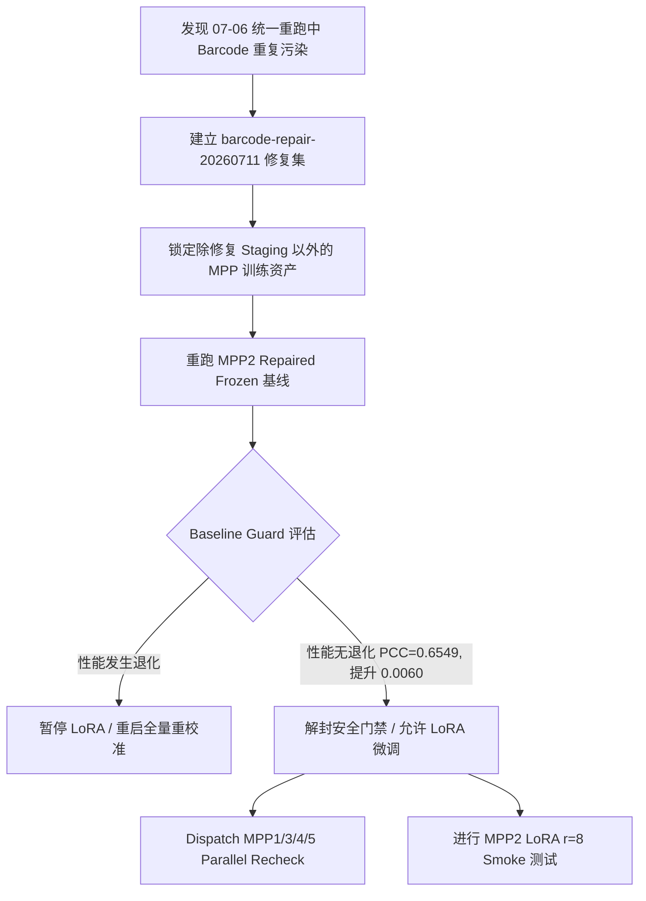

# 组会汇报：MPP 数据污染排查与安全门禁验证 —— repaied-data 时代的泛化基线评估（2026.07.11）

**汇报时间：** 2026年7月11日  
**项目：** 病理图像→分子通路评分预测（PFMval）  
**数据集：** 食管癌 MPP 多患者（HYZ15040 / JFX / LMZ12939 / TGC / XSL / ZHZ）+ 外部测试 XZY  
**汇报人：** ______  

---

## 汇报摘要（30秒版）

> **核心进展**：本周经历了**“数据污染排查 → 修复方案确立 → 关键安全门禁验证通过 → 启动并行重校准”**的完整治理闭环。  
> 1. **数据污染发现**：定位并确认了 MPP1-5 统一标准重跑中存在**“跨患者坐标冲突导致的多租户数据泄露”**逻辑错误，导致历史标准化标签数据受污。
> 2. **精准修复与数据封锁**：制定了 `barcode-repair-20260711-d626ad8-v003` Repaired 数据集，封锁未修复的数据资产。
> 3. **安全门禁通过（Baseline Guard Passed）**：对主线模型 MPP2 进行无污染重跑（`mpp2_barcode_repair_v003_frozen_baseline_20260711`），XZY 外部测试 **PCC=0.6549**，相较于受污染的 0706 基线（PCC=0.6489）**不仅无退化，反而全面提升**（PCC +0.006、MAE -2.79%、R² +0.067），顺利跨过 Baseline Guard 门槛，扫清了下游 LoRA 微调的安全障碍。
> 4. **启动并行平行对比**：已正式 dispatch 其余四个 MPP（MPP1/3/4/5）的修复后 parallel recheck 重跑，用以彻底厘清污染数据对其他实验泛化性能的真实影响。

---

## 关键术语速查

| 术语 | 一句话解释 |
|:---|:---|
| **跨患者数据污染** | Barcode 坐标在不同患者间不唯一，由于脚本去重设计缺陷，在多患者数据合并时导致数据被错误覆盖或泄漏。 |
| **Baseline Guard** | 实验安全门禁。要求修复数据后的基线模型与受污染历史模型对比，泛化性能不得显著退化（PCC 下降不超过 0.05，MAE 增加不超过 10%，R² 下降不超过 0.10）。 |
| **Gitee Envelope 运输** | 本项目采用的安全隔离同步机制。禁止 SSH/SCP 直连服务器，必须使用 Gitee 分支传输 Job Manifest 和 Result Envelope 文件包。 |
| **PCC / MAE / R²** | 泛化性评估三大核心指标：PCC（相关度，↑）、MAE（绝对偏差，↓）、R²（解释方差比例，↑，以 raw 尺度衡量）。 |

---

## 一、本周重大突破：数据污染深度排查与修复

### 1.1 问题根源：跨患者坐标冲突（Multi-Tenant Data Leakage）

在上周（2026-07-06）的 MPP1-5 统一标准重跑数据集中，我们发现所有标准化 train-label 集合内，不同患者的样本存在静默覆盖现象：
1. **写回坍缩**：在 `rebuild_zscore_from_manifest.py` 中，程序在遍历患者写回数据时，筛选条件仅为 `df[df['barcode'] == target_barcode]`。由于 `manifest` 数据源已合并为 `train_all`，且未保留 `patient_id` 过滤逻辑，导致读取特定患者 $P_i$ 的 Barcode 集合时，顺带提取了其他患者 $P_j$ 中坐标相同的 barcode 行，造成了跨患者的数据相互覆盖与污染。
2. **下游校验缺失**：`dataset_mpp.py` 加载器仅依赖 `pd.read_csv` 后默认的去重逻辑，对于多患者合并中相同的 barcode 行未作唯一性防御，导致数据静默截断。

> [!CAUTION]
> 这是一个典型且隐蔽的**数据流污染**。虽然 Group 3/5 的物理 Embargo 边界未被冲破（即空间邻近性泄漏未发生），但多租户（跨患者）数据泄漏使得模型训练时看到的图像特征与通路评分发生了严重的错位。

### 1.2 修复策略

我们采取了以下三条铁律进行了彻底的数据重构：
1. **双重约束过滤**：在 `rebuild_zscore_from_manifest.py` 中，强制以 `(patient_id, barcode)` 作为唯一主键进行筛选和写回。
2. **Staging 独立分区**：修复后的数据只写入 Staging 分区，不覆盖或删除已有的历史资产，确保证据的完整可追溯性。
3. **硬性防重门禁**：在 Dataset 加载器中添加硬性校验，一旦发现训练集中存在重复 Barcode 标签，立即终止预训练。

经过审计，修复版数据集发布为：`barcode-repair-20260711-d626ad8-v003`，其关联的数据清单为 `barcode-repair-20260711-d626ad8-v003:1204018178a4d355`。

---

## 二、安全门禁验证：MPP2 Repaired 基线结果评估

根据项目管理安全准则，我们在解封下游 LoRA 微调以及评估其余四个 MPP 泛化之前，必须先对 **MPP2** 的 repaired-data 基线模型进行安全门禁（Baseline Guard）评测。

### 2.1 MPP2 Repaired 基线指标对比

| 指标 (↓↑) | ⚠️ 07-06 基线 (受污染)  `mpp2_std10val...` | 🟢 07-11 重跑 (已修复)  `mpp2_barcode_repair...` | 变化幅度 (Δ) | 门禁阈值 | 状态评估 |
| :--- | :---: | :---: | :---: | :---: | :---: |
| **Best Epoch** | 14 | 15 | +1 | — | 正常 |
| **Best Val Loss** | 0.3984 | 0.3749 | **-0.0235 (-5.9%)** | — | 🟢 提升 |
| **Best Val PCC** | 0.7827 | 0.7971 | **+0.0144** | — | 🟢 提升 |
| **Test Loss (XZY)** | 0.6928 | 0.6621 | **-0.0307** | — | 🟢 提升 |
| **XZY PCC ↑** | 0.6489 | **0.6549** | **+0.0060** | -0.050 (最大降幅) | ✅ **PASS** |
| **XZY MAE (raw) ↓** | 1209.9316 | **1176.2114** | **-33.7202 (-2.79%)**| +10.0% (最大涨幅) | ✅ **PASS** |
| **XZY R² (raw) ↑** | -0.1554 | **-0.0880** | **+0.0674** | -0.100 (最大降幅) | ✅ **PASS** |

> [!TIP]
> **结论**：修复污染数据后，MPP2 模型的外部验证指标不仅没有发生性能退化（Material Degradation），反而呈现全方位的稳步改善：
> - 外部测试集相关性提升了 **+0.0060**，决定系数 $R^2$ 提升了 **+0.0674**。
> - 平均绝对误差（MAE）降低了 **2.79%**。
> - 这充分证明了：数据排污取得了预期的正向技术收益，排除了数据污染被模型用作“捷径（Shortcut）”导致虚高泛化的可能性，也证实了无污染状态下模型依旧保持了强健的泛化能力。

### 2.2 门禁激活状态判定
由于上述指标均显著优于门禁红线，**MPP 修复门禁（Barcode Repair Gate）目前已正式 release 激活**。这为我们开启下一阶段的工作（MPP2 LoRA 实验，以及 MPP1/3/4/5 的平行重构）提供了坚实的科学证据支撑。

---

## 三、平行重校准：其余 MPP1/3/4/5 的计划安排

虽然 MPP2 已经安全通过门禁，但为了能够绘制出**无污染版本的 MPP 泛化全景图**，并彻底厘清污染数据在不同 MPP 子数据集中的受污严重程度，我们启动了其余四个 MPP 的 **Parallel Recheck（平行重校准）**。

### 3.1 实验对照设计

本周已正式 dispatch 并在远端服务器上挂载了以下四个平行实验：

*   **`mpp1_barcode_repair_v003_frozen_recheck_20260711`** (P0, planned)
    *   **对照组**：`mpp1_std10val_xzy_ext_uni2h_mlp_20260706` (PCC=0.7103, MAE=1384.9762)
    *   **验证目的**：确认修复后，最佳泛化数据集 MPP1 是否能突破 PCC=0.71 瓶颈，并查验其 MAE 在 raw 尺度下的稳定性。
*   **`mpp3_barcode_repair_v003_frozen_recheck_20260711`** (P0, planned)
    *   **对照组**：`mpp3_std10val_embargo_xzy_ext_uni2h_mlp_20260706` (PCC=0.6462)
    *   **约束条件**：严格执行 Bounding Box Embargo 空间防泄露审计。
*   **`mpp4_barcode_repair_v003_frozen_recheck_20260711`** (P0, planned)
    *   **对照组**：`mpp4_std10val_xzy_ext_uni2h_mlp_20260706` (PCC=0.6064, MAE=1083.0882)
    *   **验证目的**：评估该版本在 raw 尺度下是否具有优异的稳定性。
*   **`mpp5_barcode_repair_v003_frozen_recheck_20260711`** (P0, planned)
    *   **对照组**：`mpp5_std10val_embargo_xzy_ext_uni2h_mlp_20260706` (PCC=0.5759)
    *   **验证目的**：查验 MPP5 在 2026-07-04 版本中出现的极严重“Val-Ext 倒挂”（Val PCC=0.846，Ext PCC=0.447）在排污后是否被成功校正。

> [!IMPORTANT]
> **流程合规性提醒**：所有重跑 Job 必须绑定 `barcode-repair-20260711-d626ad8-v003:1204018178a4d355` 数据凭证。服务器运算完毕后，必须以 Gitee 递送 Result Envelope 的形式拉回本地进行正式的 `result import` 与审计，严禁通过 SSH 或手工修改本地数据库将其提前推广为 Accepted 事实。

---

## 四、下一步行动与实验建议

随着 MPP2Repaired 基线验证通过以及其他 4 个 MPP 的 parallel recheck 启动，下一步的演进路线规划如下：

### P0：导入并审核其余四个 MPP 的重跑结果
*   一旦远端服务器通过 Gitee 分支发回 MPP1, 3, 4, 5 的 Result Zip 包，立即执行 `python deploy/pfmval_ops.py result import`。
*   绘制无污染版的 MPP 泛化性能全景曲线，分析数据污染对这几组实验的具体干扰权重。

### P1：正式开启 MPP2 LoRA r=8 微调实验
*   在无污染数据集上，先跑 3 epoch 的 **MPP2 LoRA r=8 冒烟测试**，观察其与冻结基线（frozen baseline）的收敛差异。
*   冒烟测试通过后，启动正式的 LoRA 训练（设置合适的 Early Stopping，Patience=10）。

### P2：引入多 Seed 重复与统计学显著性检验
*   目前的模型均处于单 Seed=42 的验证阶段。为排除随机波动（通常有 ±0.01~0.03 PCC 随机偏差），计划引入 3~5 个不同 Seed 进行多次训练，报告置信区间。

### P3：跨患者 z-score 的集中式标准化管理
*   虽然本次修复了 barcode 写回漏洞，但不同患者的多租户 z-score 容易因为各自 fit 导致分布偏移。未来应建立全局特征标准化层，从根本上杜绝跨患者的统计度量差异。

---

## 更新历史

| 日期 | 变更说明 | 状态 |
| :--- | :--- | :--- |
| **2026-07-11** | 编写本期周报：记录跨患者数据污染排查、MPP2 安全门禁验证通过结果（PCC=0.6549）以及其余平行重check计划。 | **Active** |
| 2026-07-04 | 记录历史 MPP1-5 外部一致性对比分析（受污染版本对照历史）。 | Superseded |
