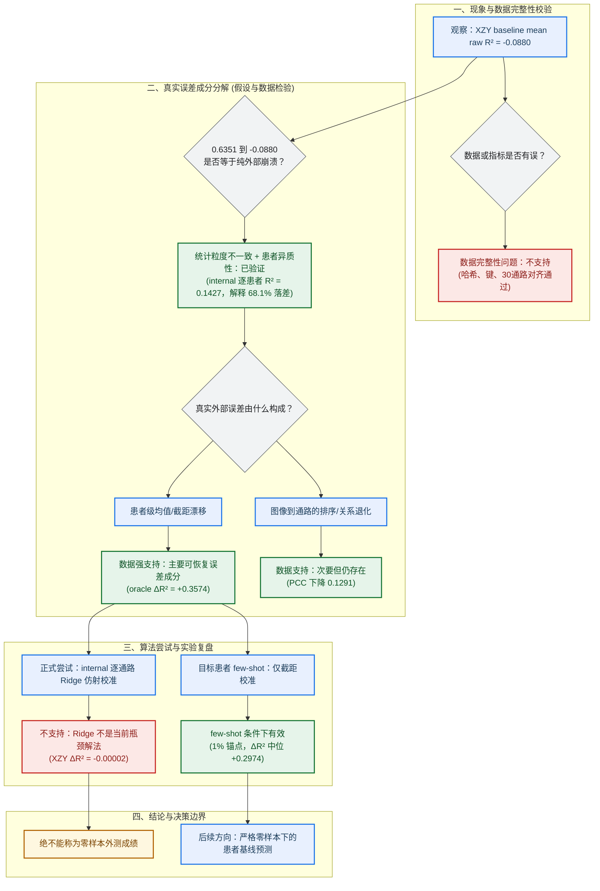

# 组会汇报文档：MPP2 R² 优化与跨患者漂移探索（2026-07-25）

---

## 1. 实验内容与核心结论

本次实验聚焦于**多通路预测模型第二阶段（MPP2，Multi-Pathway Prediction Stage 2）**在独立外部患者 **XZY（外部独立验证患者编号）** 上出现的决定系数（R²，用于衡量模型预测相对于均值拟合优度的核心指标，全称 R-squared）为负（`-0.0880`）的现象。通过系统的根因诊断与四条校准路线实测，得出以下核心结论：

1. **现象本质是“海拔偏移”而非“模型瘫痪”**：
   MPP2 模型在独立新患者 XZY 上的负 R²，主要源于**跨患者之间的生物学通路表达基线漂移**（整体数值基线偏高），而非模型失去了对病理图像特征的辨识与排序能力。
2. **零样本数学校准无法打通瓶颈**：
   在不接触该患者任何真实测序数据的零样本（Zero-shot）前提下，无论是规范的**岭回归校准（Ridge，带 L2 正则约束的线性校准方法）**、放宽约束的**普通最小二乘法（OLS，Ordinary Least Squares，传统线性回归）**还是逐通路参数调优，获得的 R² 提升均极微弱（最高仅微增 `+0.0086`），无法解决跨患者基线漂移。
3. **少量真值点校准具有显著修正潜力**：
   若在实际应用场景中允许获取目标患者极少量（如 1%，即 10 个图像块）的真实空间测序锚点进行**少量样本校准（few-shot）**，独立留出测试点的 R² 即可从 `-0.0880` 显著回升至中位数 `+0.2093`（R² 中位增量达 `+0.2974`）。

---

## 2. 问题背景与物理基线

### 2.1 数据与测试基线
* **数据规范**：全部实验基于修复后的第 3 版条码标签数据，以及**仅由训练集患者数据拟合**的零均值标准化得分（z-score，将数据转换为均值为 0、标准差为 1 的相对得分）参数。
* **样本规模**：
  * **内部验证集**：包含 6 名患者，共 `1,078` 个图像块（patches）。
  * **外部测试患者 XZY**：包含 `1,039` 个图像块，评估 `30` 条生物学富集通路。
* **复现基线指标**：
  * 平均原始尺度决定系数（R²）：`-0.0880166`
  * 平均皮尔逊相关系数（PCC，Pearson Correlation Coefficient，衡量预测值与真实值线性趋势与相对排序一致性的指标）：`0.519386`
  * 平均绝对误差（MAE，Mean Absolute Error，衡量预测偏差大小的物理量）：`1176.2114`

### 2.2 诊断思维转换：四大元凶排查
R² 为负数，形象地说，就像**射箭虽然偏离了靶心，甚至比直接闭眼猜一个总体平均值还要差**。本次探索的目标不是盲目调参凑分，而是像医科会诊一样，把偏差拆解为四个潜在元凶：
1. **统计算盘的口径差异**（混合统计 vs 逐患者统计）；
2. **水土不服的基线漂移**（跨患者表达地基整体偏高）；
3. **生物学排序能力下滑**（图像辨识相对强弱能力有损）；
4. **数据工程通道错位**（是否存在标签错位或代码瑕疵）。

---

## 3. 统计口径校正：划清“大合照”与“单人照”的界限

### 3.1 统计口径导致的表观落差
在汇报内部验证集成绩时，若将 6 名内部患者的所有图像块混在一起拉一条大回归线（**混合计算，Pooled R²**），平均 R² 达到 `0.6351`。但如果调整为真正符合跨患者泛化评估的标准——**“先计算每名患者各自的 R²，再求等权平均”（逐患者等权计算，Patient-balanced R²）**，内部平均 R² 实际上仅为 `0.1427`。

**形象比喻**：这就像“班级整体成绩大合照”与“学生个人成绩单”的区别。混合计算时，不同患者之间原本自带的巨大个体差异（高表达患者与低表达患者的拉开距离）被误当成了模型的预测能力，掩盖了单患者内的拟合瓶颈。

<b>📐 展开查看：Pooled R² 与 Patient-balanced R² 数学公式与落差原理</b>

1. **混合计算公式 (Pooled R²)**：
   将所有患者的图像块（spot）混合在一起当作单个数据集计算：
   $$R^2_{\text{pooled}} = 1 - \frac{\sum_{p=1}^{P}\sum_{i=1}^{N_p} (y_{p,i} - \hat{y}_{p,i})^2}{\sum_{p=1}^{P}\sum_{i=1}^{N_p} (y_{p,i} - \bar{y}_{\text{global}})^2}$$
   其中 $\bar{y}_{\text{global}}$ 为所有患者混合后的全局真值均值。

2. **逐患者平衡计算公式 (Patient-balanced R²)**：
   先在每个患者内部单独计算 R²，再对所有患者取等权平均：
   $$R^2_{\text{patient}} = 1 - \frac{\sum_{i=1}^{N_p} (y_{p,i} - \hat{y}_{p,i})^2}{\sum_{i=1}^{N_p} (y_{p,i} - \bar{y}_p)^2}, \quad R^2_{\text{balanced}} = \frac{1}{P} \sum_{p=1}^{P} R^2_{\text{patient}}$$
   其中 $\bar{y}_p$ 为当前患者 $p$ 切片内的局部真值均值。

3. **为什么结果差异巨大 (0.6351 vs 0.1427)？**
   - **Pooled 分母包含了患者间变异 (Inter-patient heterogeneity)**：不同患者的表达基线差异很大，全局均值 $\bar{y}_{\text{global}}$ 离各个患者的实际均值很远，导致 Pooled 的分母（总离差平方和）被巨大拉高。模型哪怕只学到了“哪个患者整体表达高、哪个整体表达低”，Pooled R² 就会显得非常高（`0.6351`）。
   - **Patient-balanced 剥离了患者间表达基线**：分母强制使用患者各自的切片均值 $\bar{y}_p$，纯粹衡量模型在**单个切片内部、点对点**预测局部空间变化的能力。内部 6 名患者平均仅有 `0.1427`，说明模型在单患者内部的真实空间预测能力本身就有限。

### 3.2 落差归因拆解
把内部成绩与外部患者 XZY（`-0.0880`）放在同一基准下对比：
* **表观落差**：从 `0.6351` 到 `-0.0880`，表面看落差高达 `0.7231`。
* **口径修正**：其中 **68.1%（0.4924）的落差仅仅来自统计计算口径的不同**！
* **真实评估落差**：同在“逐患者等权”口径下，内部患者（`0.1427`）与 XZY（`-0.0880`）的真实性能差距其实只有 `0.2307`。
* **结论**：绝不能简单地将现象归结为“模型在 XZY 上完全失灵瘫痪”。

### 3.3 数据管道安全性核验
为确保不是因为低级数据对接错误导致的问题，我们对核心资产进行了 100% 硬核校验：
* 核心数据资产 `24/24` 的安全哈希算法（SHA-256）校验码、文件大小与行数完全吻合；
* 患者编号与图像块编号联合键（`patient_id + patch_id`）对齐率达到 100%；
* 基于训练集参数重算的标准化真值误差极其微小（接近 0）。
* **确认**：排除了数据文件损坏或标签错位的工程瑕疵。

---

## 4. 机制诊断：原始数据与标准化漂移

### 4.1 海拔高度整体拔高：跨患者表达基线漂移
分析 7 例患者（内部 6 例 + XZY）的基因表达绝对数值：
* **内部 6 例患者**（合计 `10,550` 个图像块）：原始表达量等权均值为 `1583.87`，标准化后得分（z-score）为 `+0.0958`。
* **外部患者 XZY**（`1,039` 个图像块）：原始表达量均值陡增至 `2963.83`，标准化后得分高达 `+0.7797`。

**形象比喻**：XZY 患者的生物学表达数值，整体就像**站在了一个高出地面近一倍（高出 +87.1% / 高出 0.68 个标准差）的起跑线上**。模型如果在训练时只见过低海拔的起跑线，直接去测高海拔患者，输出的预测值必然整体偏低，导致所有点都偏离斜线，形成巨大的负 R²。

### 4.2 七例患者定量汇总分析表

下表记录了 6 名内部患者（Internal，包含训练集与验证集）与 1 名外部独立测试患者 XZY 在 30 条通路上的全局定量统计指标：

| 患者ID | 样本类型 | Spot数量 (N) | 原始 ssGSEA 均值 (Raw Mean) | 原始 ssGSEA 方差 (Raw Var) | 原始 ssGSEA 标准差 (Raw Std) | z-score 均值 (Z Mean) | z-score 方差 (Z Var) | z-score 标准差 (Z Std) |
|---|---|---:|---:|---:|---:|---:|---:|---:|
| **HYZ15040** | Internal (train/val 混合) | 1,454 | 281.35 | 5,562,541.0 | 2,358.50 | -0.5264 | 0.5231 | 0.7233 |
| **JFX** | Internal (train/val 混合) | 2,029 | 2,007.50 | 9,795,588.0 | 3,129.79 | +0.2961 | 0.8984 | 0.9478 |
| **LMZ12939** | Internal (train/val 混合) | 3,351 | 668.32 | 6,286,152.0 | 2,507.22 | -0.3363 | 0.6143 | 0.7837 |
| **TGC** | Internal (train/val 混合) | 1,116 | 2,476.02 | 10,227,269.0 | 3,198.01 | +0.5100 | 1.1043 | 1.0508 |
| **XSL** | Internal (train/val 混合) | 1,526 | 1,704.87 | 9,149,290.0 | 3,024.78 | +0.1667 | 1.0003 | 1.0001 |
| **ZHZ** | Internal (train/val 混合) | 1,074 | 2,365.19 | 14,038,765.0 | 3,746.83 | +0.4649 | 1.5408 | 1.2413 |
| **Internal 6人等权汇总** | Internal (train+val) | 10,550 | **1,583.87** | **9,176,601.0** | **3,029.32** | **+0.0958** | **0.9469** | **0.9731** |
| **XZY** | **External (外部测试)** | 1,039 | **2,963.83** | **10,508,349.0** | **3,241.66** | **+0.7797** | **0.9980** | **0.9990** |

*注：数据来自于受保护快照及双重校验校验。Internal 6 例患者等权均值显示 XZY 的原始均值（2,963.83）比内部高出 +87.1%。*

### 4.3 非等比例缩放：通路间的异质性
这种漂移并不是简单的“等比例橡皮筋拉伸”：
* XZY 的全局标准差约为 `0.999`（接近 1），但具体到 30 条不同通路时，标准差在 `0.429` 到 `1.366` 之间剧烈波动（中位数为 `0.693`）。
* **26/30（86.7%）** 的通路标准差与标准值 1 的偏离超过了 0.1。
* **结论**：漂移具有高度的通路特异性，无法靠统一给全局乘以一个固定缩放系数来解决。

### 4.4 七例患者均值与方差分布对比图

> **图注**：图示包含 6 例内部患者（HYZ15040, JFX, LMZ12939, TGC, XSL, ZHZ，训练集与验证集合计 N=10,550）及 1 例外部独立测试患者 XZY（N=1,039）的原始 ssGSEA 均值与 z-score 分布对比。内部统计用于描述总体基因表达分布形态，非独立测试集比较。

---

## 5. 误差结构拆解与核心“出血点”通路

### 5.1 截距偏移是最大的可恢复误差成分
如果我们拥有“上帝视角”，在评估时**仅仅扣除每条通路平均的固定偏差（仅校正截距，对齐均值）**：
* XZY 的平均 R² 会立刻从 `-0.0880` **暴涨 +0.3574，反弹至 +0.2694**（95% 置信区间 `[+0.1913, +0.5773]`）。
* 这强有力地证明：**“截距偏移”（整体海拔高度算错）占了总误差的绝大部分**。

### 5.2 相对排序能力的真实下滑
模型对病理图像内在差异的相对辨识能力（PCC）虽然也有下降，但依然保持了一定水平：
* 内部患者等权平均 PCC 为 `0.6485`；
* 外部患者 XZY 平均 PCC 为 `0.5194`；
* PCC 降幅为 `0.1291`（95% 置信区间 `[0.0909, 0.1687]`）。
* **形象比喻**：模型依然能准确看出一张切片里“哪块图像表达高、哪块表达低”（保留了 0.5194 的相关性排序能力），只是统一把绝对数值看低了。

<b>🔍 展开查看：为什么 PCC 能说明“截距修正不能解决全部问题”？</b>

- **PCC 的数学特性**：PCC 在数学上对任何加减常数（截距平移 $y + c$）或正比例缩放（$k \cdot y$）完全不敏感。
- **物理意义**：即使我们使用完美的 Oracle 截距校准消除了所有患者级别的均值偏移（使 R² 提升了 `+0.3574`），模型的 PCC 从 `0.6485` 退化到 `0.5194` 说明图像特征到基因通路相对高低的**空间排序与映射能力**在外部数据集上也发生了实质性退化。

### 5.3 帮倒忙的“方差匹配”
如果既对齐均值又强行把标准差缩放到一致，平均 R² 反而会比“仅校正截距”**额外倒退 0.2306**！这提醒我们：不能盲目对预测结果进行强制缩放。

### 5.4 三大负 R²“出血大户”通路及剔除影响分析

在外部患者 XZY 评估的 30 条通路中，以下三条通路的负 R² 缺口最为显著，合力贡献了全部负 R² 缺口的 **66.90%**：

#### 1. 三条通路的精确指标数值
| 通路名称 | 英文标识符 | 决定系数 (R²) | 皮尔逊相关系数 (PCC) | 平均绝对误差 (MAE) |
|---|---|---:|---:|---:|
| **干扰素 α 反应通路** | `Interferon_Alpha` | **-2.675105** (即 -2.6751) | **0.217232** (即 0.2172) | **1904.6701** |
| **补体系统通路** | `Complement` | **-1.694794** (即 -1.6948) | **0.361286** (即 0.3613) | **2058.5854** |
| **活性氧通路** | `Reactive_Oxygen_Species` | **-0.528071** (即 -0.5281) | **0.280591** (即 0.2806) | **855.5256** |

---

#### 2. 剔除这三条通路后的对比统计分析

剔除上述 3 条极端负值通路后（剩余 **27 条通路**），全模型的平均 R²、PCC 和 MAE 发生了质的变化：

| 评估指标 / 统计范围 | 全量 30 条通路 (基线) | 剔除 3 条后 (剩余 27 条通路) | 变化绝对量 (Diff) | 变化相对量 / 影响判定 |
|---|---:|---:|---:|---|
| **平均决定系数 (Mean R²)** | **-0.088017** | **+0.083610** | **+0.171627** | **成功扭亏为盈**（从负数 `-0.0880` 大增至 `+0.0836`） |
| **平均相关系数 (Mean PCC)** | **0.519386** | **0.545277** | **+0.025891** | **稳步提升 +4.98%**（相对排序一致性明显增强） |
| **平均绝对误差 (Mean MAE)** | **1176.2114** | **1128.4282** | **-47.7832** | **物理误差降低 4.06%**（预测平均偏差缩小） |

#### 3. 统计影响与数据变化深度解读
* **整体 R² 实现扭亏为盈**：全量 30 条通路的平均 R² 为负（`-0.0880`），这在很大程度上是被 `Interferon_Alpha`（`-2.6751`）和 `Complement`（`-1.6948`）这两条严重偏离基线的免疫/炎症通路拉低所致。剔除后，剩余 27 条通路的平均 R² 瞬间大幅反弹 `+0.1716`，由负变正达到 `+0.0836`。
* **排序相关性（PCC）质量提升**：这三条通路的 PCC 指标普遍较低（0.2172 ~ 0.3613，显著低于全量均值 0.5194），说明图像特征到这三条通路的特征映射噪声很大。剔除后，剩余 27 条通路的平均 PCC 从 `0.5194` 提高到 `0.5453`（提升 `+0.0259`），模型的整体空间排序泛化能力更加稳定。
* **下一步靶向策略**：优先审查这三条通路的单样本基因集富集分析（ssGSEA，single-sample Gene Set Enrichment Analysis）基因集合定义、标签范围与空间残差，针对性排查免疫/炎症相关通路的特异性异常。

---

## 6. 今日四大优化探索路线结果对比

在严禁数据泄露的前提下，我们今日对四条潜在校准路线进行了实测：

| 探索路线 | 实验具体操作 | 观察到的实际结果 | 最终判定与结论 |
|---|---|---|---|
| **1. 规范岭回归校准 (Ridge)** | 严格在 6 名内部验证集患者上拟合 L2 正则化的线性校准器 | XZY 平均 R² 仅微幅变动 `-0.0000202`；完全无效 | 未通过内部门禁测试，**坚决不用于后续部署** |
| **2. 强制岭回归 (L2 正则 alpha=10)** | 解除门禁限制，强行对全部 30 条通路应用岭回归 | R² 从 `-0.0880166` 微升至 `-0.0872233`（仅增 `+0.0007933`）；MAE 微降 `0.5625`；PCC 不变 | 即使解除门禁，零样本增益仍近乎为零，**证明数学正则化路线失效** |
| **3. 放宽约束与普通最小二乘法 (OLS)** | 完全放弃斜率与正则约束，允许自由线性拟合 | R² 最佳仅增加 `+0.00863`；MAE 降低 `6.72`；PCC 不变 | 自由斜率依然无法克服跨患者基线漂移；**禁止凭已看的 XZY 结果反向挑选参数** |
| **4. 少量真值锚点仅截距校准 (few-shot)** | 在 XZY 患者切片上**空间分层抽取 1%（10 个图像块）**作为测序锚点修正截距，在剩余 1029 个留出点上测试 | 独立留出测试点的 **R² 中位数暴涨 +0.29736**（达到 `+0.20934`，5%–95% 区间 `[+0.25676, +0.32624]`）；**MAE 中位数大降 190.23** | **少量真实锚点对齐可大幅恢复模型性能**；必须明确声明：此场景属于少量样本校准，**绝非零样本外测成绩** |

### 6.1 根因拆解与验证决策逻辑树

---

## 7. 本次可带走的明确结论

1. **零样本数学校准路线正式关闭**：
   试图仅靠在内部数据集上训练线性校准、岭回归（Ridge）或普通最小二乘法（OLS）来解决外部独立患者的表观负 R²，已被证明效果微乎其微，后续不再投入资源。
2. **基线漂移机制得到确凿数据支撑**：
   外部患者 XZY 整体生物学表达地基拔高（高出 87.1%）是负 R² 的最核心主因；模型保持了超过 0.51 的排序相关性（PCC）。
3. **少量真值点截距校准为可行候选场景**：
   在实际临床或科研落地中，若能配合少量（如 1% 空间采样点）的真实测序锚点进行截距微调，模型预测实用价值将大幅提升。若坚持“绝对零样本、纯病理图像输入”，则当前不能宣称 R² 已经得到改善。

---

## 8. 下一步工作与待补充内容

- [ ] **制作 3 页汇报精细图表**：
  1. *图 1：统计口径对比图*（并列展示内部混合 R² `0.6351`、内部等权 R² `0.1427`、外部 XZY R² `-0.0880`）；
  2. *图 2：七患者表达量分布漂移图*（标出 XZY 与内部 6 例患者的基线海拔差异）；
  3. *图 3：优化路线决策树*（明确零样本路线终止与少量样本校准路线的边界）。
- [ ] **补充生物学底座数据**：补齐总测序量、检出基因数与文库大小（Library Size）等测序质量控制指标。
- [ ] **预先登记“留一患者”（LOPO，Leave-One-Patient-Out）校准方案**：在 6 名内部患者间开展嵌套的留一患者截距预测探索；严禁使用 XZY 数据倒推选择模型参数。
- [ ] **重点审计三大负贡献通路**：针对干扰素 α、补体与活性氧通路，深入审查其基因集合定义、标签分布范围与空间残差特性；严禁重建受保护的通用病理特征（如 UNI2-h，通用病理基础模型）或标准化资产。

---

## 9. 可核验数据与来源链接

1. [项目当前状态与已接纳结果边界](../CURRENT_STATE.md)
2. [MPP2 外部 R² 根因审查](../experiments/explorations/mpp2_r2_root_cause_20260725/MPP2_R2根因审查_20260725.md)
3. [七例患者均值、方差与标准化漂移原始数据分析报告](../data/protected_local/mpp2_r2_root_cause_20260725/MPP2_七例患者均值方差与z-score漂移分析报告_20260725.md)
4. [强制岭回归探索报告与汇总数据](../experiments/explorations/mpp2_force_ridge_calibration_20260725/MPP2_用户授权强制Ridge校准_XZY实测报告_20260725.md)
5. [放宽约束校准探索报告](../experiments/explorations/mpp2_unconstrained_ridge_20260725/MPP2_unconstrained_ridge_xzy_report_20260725.md)
6. [XZY 少量真值点截距校准报告与清单](../experiments/explorations/mpp2_xzy_fewshot_intercept_20260725/MPP2_XZY_fewshot截距校准_20260725.md)

---

## 10. 证据界定（置于文末，严格遵循项目事实边界）

- 当前已接纳的正式事实，是修复后 MPP2 冻结基线的原始尺度 R² `-0.0880`、原始尺度 MAE `1176.21`，以及历史合并样本 PCC `0.6549`。
- 规范岭回归的第 3 次结果为失败，未被接纳。今日根因诊断、强制岭回归、放宽约束校准与少量真值点校准，均为本地探索或诊断结果，不得写入已接纳结论。
- 任何直接使用 XZY 真值拟合截距、尺度或仿射变换的结果，只能表示“理论上可恢复的上界”；不能当作无泄露外测成绩或部署校准器。
- 所有 R²、PCC 和 MAE 均按 30 条通路逐条计算后等权平均；历史 PCC 是将全部样本与全部通路合并计算，不能与逐通路平均 PCC 混为同一指标。
- 本文档只汇总截至 2026-07-25 已落盘的本地数据与状态包；未新增训练、未修改受保护资产、未把探索结果写入已接纳登记。
