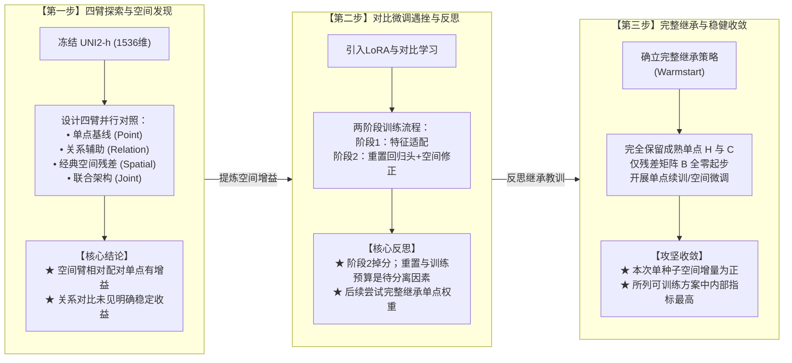
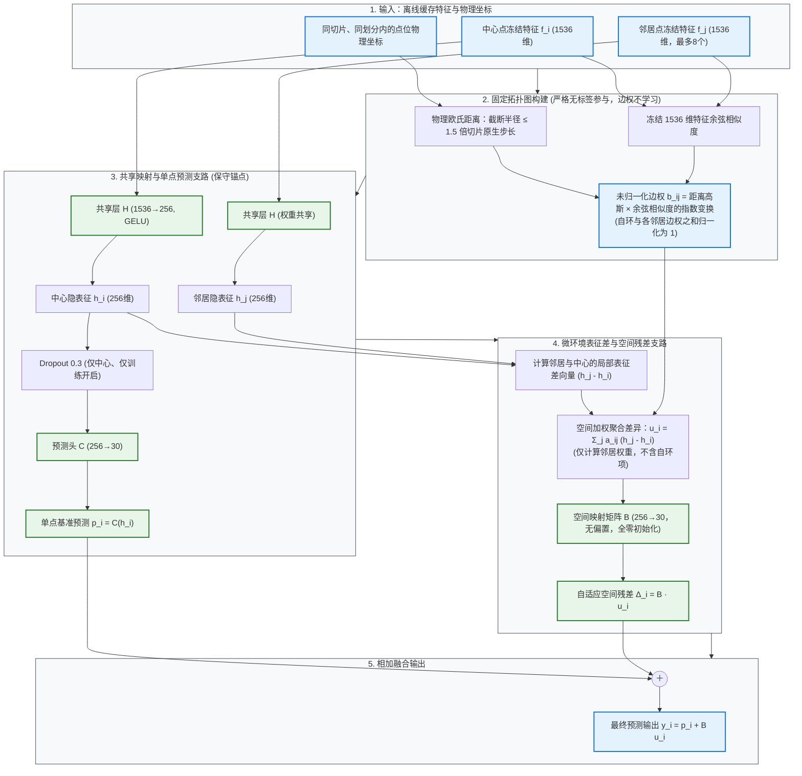
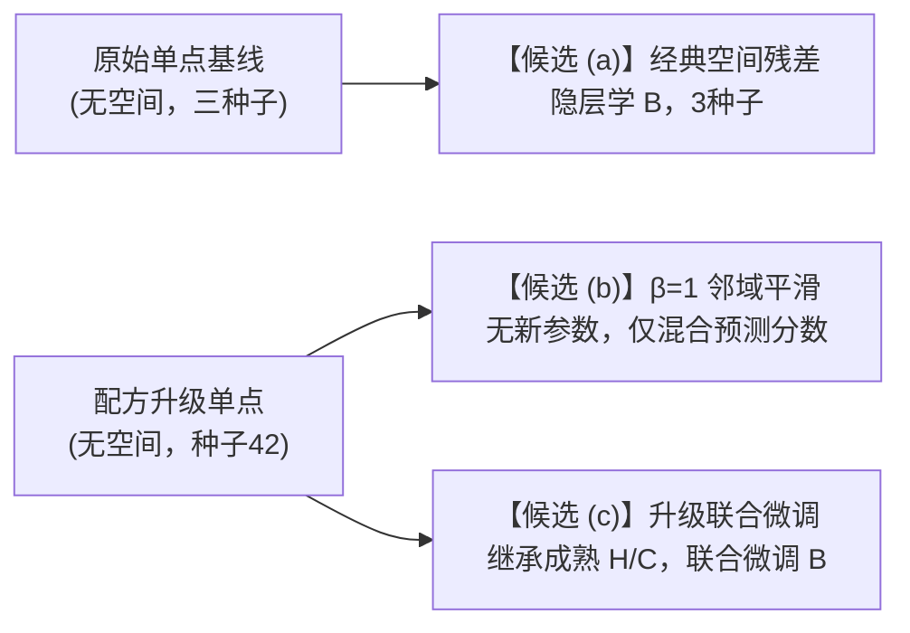
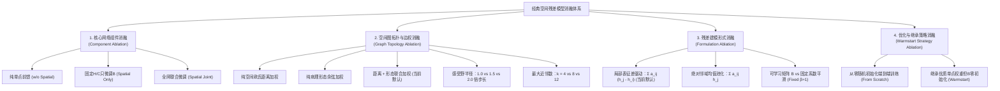
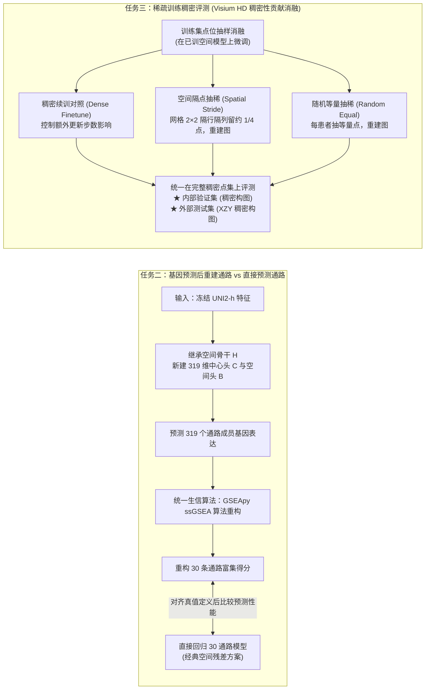
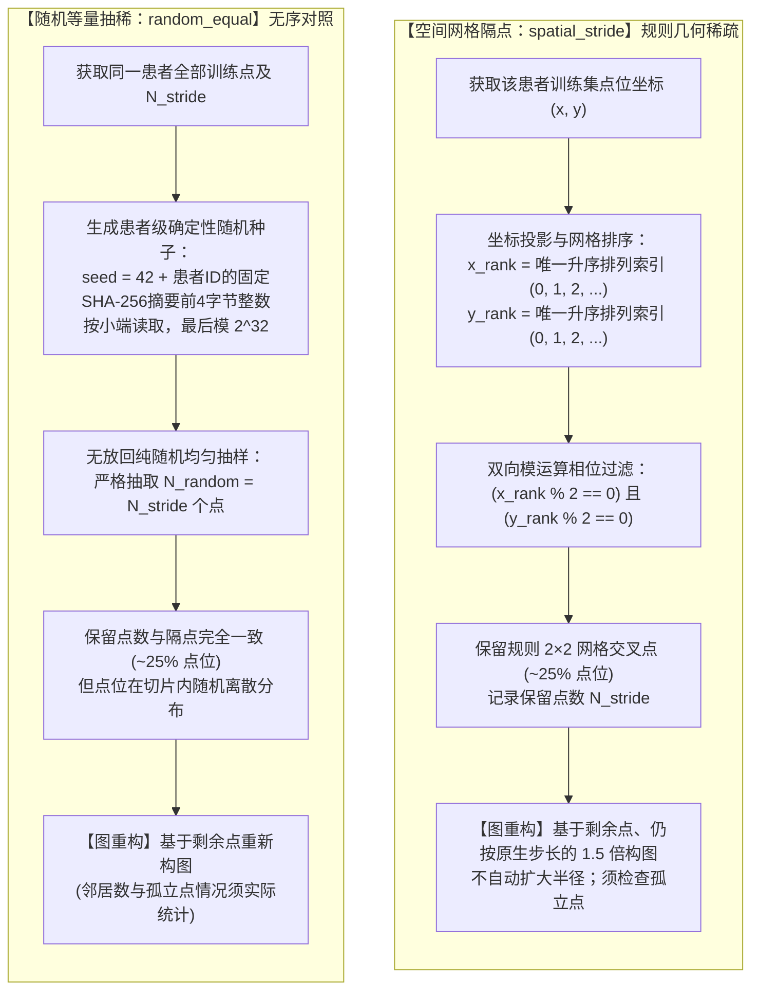

# Phase 2 新模型成果、三份空间候选与后续消融设计汇报

**汇报主题**：空间转录组通路预测 Phase 2 模型成果、经典空间残差方案详解、论文填写指南及团队消融整合  
**汇报日期**：2026 年 9 月 12 日  
**汇报组织**：AI 空间转录病理研究课题组  
**文档位置**：[组会汇报_Phase2新模型成果与空间残差方案汇报_20260912.md](file:///D:/AI%E7%A9%BA%E9%97%B4%E8%BD%AC%E5%BD%95%E7%97%85%E7%90%86%E7%A0%94%E7%A9%B6/PFMval_new/02_%E7%BB%84%E4%BC%9A%E6%B1%87%E6%8A%A5/%E7%BB%84%E4%BC%9A%E6%B1%87%E6%8A%A5_Phase2%E6%96%B0%E6%A8%A1%E5%9E%8B%E6%88%90%E6%9E%9C%E4%B8%8E%E7%A9%BA%E9%97%B4%E6%AE%8B%E5%B7%AE%E6%96%B9%E6%A1%88%E6%B1%87%E6%8A%A5_20260912.md)  
**对照与核验基准**：[Phase2基线与三份空间候选_论文填写说明_20260911.md](file:///D:/AI%E7%A9%BA%E9%97%B4%E8%BD%AC%E5%BD%95%E7%97%85%E7%90%86%E7%A0%94%E7%A9%B6/PFMval_new/%E5%9B%A2%E9%98%9F%E9%A1%B9%E7%9B%AE%E8%BF%9B%E5%BA%A6%E4%B8%8E%E7%BB%93%E8%AE%BA/qzs/Phase2%E5%9F%BA%E7%BA%BF%E4%B8%8E%E4%B8%89%E4%BB%BD%E7%A9%BA%E9%97%B4%E5%80%99%E9%80%89_%E8%AE%BA%E6%96%87%E5%A1%AB%E5%86%99%E8%AF%B4%E6%98%8E_20260911.md)

---

## 目录

- [本次组会核心目的](#本次组会核心目的)
- [一、软连接探索“三步走”：模型演进极简回顾](#一软连接探索三步走模型演进极简回顾)
- [二、共同设定与两份无空间基线](#二共同设定与两份无空间基线)
- [三、经典空间残差方案机制详解（简洁·高效·准确）](#三经典空间残差方案机制详解简洁高效准确)
- [四、核心方案横向对比（严格聚焦论文核心对照）](#四核心方案横向对比严格聚焦论文核心对照)
- [五、论文 Phase 2 写作与大纲填写指南](#五论文-phase-2-写作与大纲填写指南)
- [六、空间残差模型的体系化消融实验设计](#六空间残差模型的体系化消融实验设计)
- [七、团队共享成果整合：任务二与任务三空间消融设计](#七团队共享成果整合任务二与任务三空间消融设计)
- [八、组会研讨决策与消融状态全景看板](#八组会研讨决策与消融状态全景看板)

---

## 本次组会核心目的

> **当前决定（2026-09-12）**：已选定经典空间残差 (a)，暂停方法改进。下文“候选”为历史比较称呼；后续只准备任务二/三交接、单点基线基础模型替换，以及论文指标、代码和关键架构图。

1. **展现 Phase 2 最新成果**：汇报基于冻结病理大模型特征（UNI2-h 1536维）构建的经典空间残差方案及三份已比较的空间方案。
2. **剔除混杂干扰，精准聚焦选型**：不铺摊子、不罗列未完成根因分析的探索分支，严格围绕论文基线与三份空间候选，记录已选定的经典空间残差方案 (a)，保留 (b)(c) 作为比较与历史探索。
3. **梳理消融全景，协同团队推进**：明确当前消融中已完成部分、团队共享目录（`ljq` 目录）下已有代码、待对齐输入输出与操作的任务二/三部分，以及论文后续准备事项。

---

## 一、软连接探索“三步走”：

在探索病理图像预测空间转录组 30 条通路的历程中，课题组经历了清晰的“三步走”：核心始终聚焦在**“邻域信息有没有用 $\rightarrow$ 增加复杂微调是否更好 $\rightarrow$ 保住优质单点基础后再加空间残差能否稳定增益”**。



- **第一步（发现空间是关键）**：冻结病理底座后探索不同预测头，观察到空间臂相对同配方单点在 XZY 上有增益，支持**局部空间邻域残差**在当前设置下有效，辅助对比任务没有稳定增量。
- **第二步（踩坑与反思）**：尝试深入微调时，第二阶段出现掉分；预测头重置和训练预算是可能影响因素，尚未用独立消融确认原因。后续因此尝试**完整继承单点回归权重**。
- **第三步（保住基础，稳健收敛）**：采取“完整继承”策略，将训练成熟的单点特征层与预测头原样保留，只让空间残差从 0 开始微调，在本表可训练方案中取得最高内部指标，但这不等于综合最优，也不改变当前选用经典空间残差 (a) 的决定。

---

## 二、共同设定与两份无空间基线

### 1. 严格统一的共同实验设定

- **任务定义**：用 HE 点位图像预测 **30 条通路**的训练标准化 z 分数。底层病理编码器为冻结的 UNI2-h（1536 维），只训练下游轻量网络。
- **样本划分**：训练集 6 名患者（9472 点），内部验证集为同 6 名患者的空间留出块（1078 点）；外部参考患者 XZY（1039 点，历史已见的单患者外部参考，不参与本轮早停调参）。
- **指标口径**：
  - **局部逐通路 PCC**：每患者每通路内先算点位相关再等权平均（衡量**切片内相对空间轮廓与高低趋势**）。
  - **整体展平 PCC**：全部点位 × 30 通路拉直算一次相关（衡量**全局矩阵一致性**，两种 PCC 不可互相证明优劣）。
  - **zMSE / rawMAE**：标准化均方误差（越低越好）与还原原始尺度的绝对误差。
- **统一网络模块记号**：
  - **H**：`Linear(1536 → 256) + GELU`，特征共享映射层；
  - **C**：`Dropout(0.3)`（仅训练、仅中心）再经 `Linear(256 → 30)`，单点预测头；
  - **B**：无偏置 `Linear(256 → 30)`，全零起步，将邻域隐表征差映为 30 维空间残差。

整条链路中，单点预测与可学习空间输出的数学关系为：

$$
p = C(h)
$$

$$
y = p + B u
$$

邻域平滑对照（不使用矩阵 B）把同样的邻居权重直接作用在预测分数上：

$$
\hat{p}_i = a_{\mathrm{self},i}\,p_i + \sum_j a_{ij}\,p_j
$$

### 2. 两份无空间基线（结构完全相同，训练配方不同）

> [!IMPORTANT]
> **注意**：方案 (a) 接在原始基线上；方案 (b) 与 (c) 接在配方升级单点上。两份单点基线不可混淆为一条进度曲线。


| 基线方案                                | 训练配方细节                                                  | 内部局部逐通路PCC        | 内部整体展平PCC         | 内部 zMSE           | XZY 外部局部PCC       | XZY 外部展平PCC       | XZY 外部 zMSE       | XZY 外部 rawMAE     |
| :----------------------------------- | :------------------------------------------------------- | :-----------------: | :-----------------: | :-----------------: | :-----------------: | :-----------------: | :-----------------: | :-----------------: |
| **1. 原始单点基线**<br>***(3种子均值 ± SD)*** | 随机初始化 H/C，全局乱序，批大小 256，lr=3e-4 固定；不读坐标不建图。              | 0.6533<br>±0.0009 | 0.7985<br>±0.0002 | 0.3732<br>±0.0005 | 0.5131<br>±0.0115 | 0.6501<br>±0.0120 | 0.6637<br>±0.0213 | 1179.70<br>±27.11 |
| **2. 配方升级单点**<br>***(种子42)***       | 结构完全相同；改用患者均衡采样，批大小 64，lr=3e-4 预热锁第 10 轮 + 3e-5 精修 5 轮。 | **0.6649**        | **0.8034**        | **0.3646**        | **0.5425**        | **0.6633**        | 0.6639            | 1188.44           |


- 配方升级单点相对原始基线：内部 PCC 提升至 0.6649，外部 PCC 提升至 0.5425（+0.0294）。这是整套训练配方及不同运行间的描述性比较（单种子对三种子均值），未分离各配方因素的贡献，本身仍是无空间模型，也是后面 (b)(c) 的共同基座。

---

## 三、经典空间残差方案机制详解（目前选定了本方案）

本次组会已确定采用**经典空间残差方案**。其数学与前向逻辑严格遵循：以无标签物理-形态图为拓扑基底，以单点预测为锚，将局部隐表征差通过零初始化的矩阵 B 转化为自适应残差。

### 1. 机制前向流程图



### 2. 核心数学公式

最终输出预测方程：

$$
y_i = p_i + \Delta_i = C(h_i) + B \sum_{j \in \mathcal{N}(i)} a_{ij} (h_j - h_i)
$$

其中，中心单点基准预测为：

$$
p_i = C(h_i) = C\big(H(f_i)\big)
$$

微环境局部表征差分加权聚合项为：

$$
u_i = \sum_{j \in \mathcal{N}(i)} a_{ij} (h_j - h_i)
$$

自适应空间残差修正量为：

$$
\Delta_i = B u_i
$$

### 3. 关键逻辑准确性核验

边权更准确地写为：未归一化权重 = `exp(-ρ²/(2σ²)) × exp((cos−1)/τ)`，ρ 为距离/原生步长，σ=1、τ=0.2；再与自环权重1共同归一化。上文 H 已包含线性层偏置与 GELU（激活函数），公式不再重复激活。

- **邻域差分项 **$u_i$**：基于邻居与中心的隐表征差 **$(h_j - h_i)$**。若邻居与中心隐表征接近，差分项趋于 0；表征差异可以产生残差，但是否对应肿瘤侵袭边界或间质过渡带，尚需空间图像与病理标注核验。**
- **零初始化矩阵 **$B$**：初始时刻 **$B \equiv 0$** 且无偏置，模型初始输出等于同一初始化 H/C 的单点输出。经典方案 (a) 的 H/C 是配对随机初始化，并非继承成熟单点；完整继承属于方案 (c)，也不保证后续训练性能不下降。**
- **Dropout 作用范围**：仅作用于中心点进入预测头 $C$ 的单点通路，空间差分聚合路径不加 Dropout，避免引入额外方差干扰。

---

## 四、核心方案横向对比

按照最新审定的《论文填写说明》，我们剔除未完成根因分析的探索分支，仅对比**两份无空间基线**与**三份空间候选**：



### 1. 核心候选方案性能全景对比表

> “最高/最低”仅指本表所列指标；(a) 为三种子均值 ± 样本标准差，(b)(c) 为单种子，不能据此作统计显著性排名。外部仅 XZY 一人，三种子不增加独立患者数量。


| 方案类别与名称              | 空间机制接入点             | 新增参数       | 内部验证 逐通路PCC       | 内部验证 展平PCC        | 内部验证 zMSE         | XZY 外部 逐通路PCC     | XZY 外部 展平PCC              | XZY 外部 zMSE               | XZY 外部 rawMAE             | 证据属性与数据来源          |
| :-------------------- | :------------------- | :----------: | :-----------------: | :-----------------: | :-----------------: | :-----------------: | :-------------------------: | :-------------------------: | :-------------------------: | :------------------ |
| **思路一：原始单点基线**       | 无空间图                | 0          | 0.6533<br>±0.0009 | 0.7985<br>±0.0002 | 0.3732<br>±0.0005 | 0.5131<br>±0.0115 | 0.6501<br>±0.0120         | 0.6637<br>±0.0213         | 1179.70<br>±27.11         | 第一轮四臂登记汇总 (3种子)    |
| **思路一：配方升级单点**       | 无空间图                | 0          | 0.6649            | 0.8034            | 0.3646            | 0.5425            | 0.6633                    | 0.6639                    | 1188.44                   | 第二轮单点基座 (种子42)     |
| **【候选 (a)】经典空间残差**   | 256 维隐表征差，经矩阵 B     | 有 B (7680) | 0.6663<br>±0.0007 | 0.8056<br>±0.0005 | 0.3614<br>±0.0008 | 0.5580<br>±0.0051 | **0.6783**<br>**±0.0081** | **0.6178**<br>**±0.0149** | **1125.29**<br>**±20.17** | 第一轮空间臂（3种子） |
| **【候选 (b)】β=1 邻域平滑** | 已输出的 30 维预测分数上加权    | **无** (0)  | **0.6759**        | **0.8102**        | **0.3544**        | **0.5779**        | **0.6821**                | 0.6447                    | 1177.39                   | 预设诊断对照 (未正式选模)     |
| **【候选 (c)】升级联合微调**   | 继承成熟 H/C，联合微调 H/C/B | 有 B (7680) | **0.6734**        | 0.8090            | 0.3552            | 0.5582            | 0.6720                    | 0.6418                    | 1155.25                   | 第三轮选择记录 (单种子已接纳)   |


### 2. 三份空间方案简析与取舍

- **【主要候选 (a)】经典空间残差**：
  - **核心优势**：在本表三份空间方案中，只有 (a) 提供了**与同配方单点配对的 3 随机种子结果**；本表 XZY 的 zMSE 与 rawMAE 最低（zMSE 0.6178，rawMAE 1125.29，较基线降 4.6%）。
  - **定位**：当前选定的主方案；三种子支持本设置下的重复性，不等于多患者或多中心复现。
- **【候选 (b)】β=1 邻域平滑**：
  - **核心优势**：零参数，本表内部与外部两种 PCC 均最高（外部局部 PCC 达 0.5779）。
  - **取舍与定位**：表明固定邻域平滑在本设置下可提高相关性，尚不能确认为生物学机制或降噪因果解释；但外部绝对数值误差不如可学习模型 (a) 和 (c)。此前属于诊断，适合作为论文的零参数诊断对照。
- **【候选 (c)】升级联合微调**：
  - **核心优势**：本表可训练方案的内部双 PCC 最高、zMSE 最低（PCC 0.6734 / 0.8090，zMSE 0.3552）；外部局部 PCC 0.5582，与 (a) 基本持平。
  - **定位**：本表内部指标最好的可训练比较方案；保留历史结果，后续主方案仍为 (a)。

---

## 五、论文 Phase 2 写作与大纲填写指南（仅供参考，我也不确定这样表述是否妥当）

### 1. 共同填写的红线与避坑规范

- **模型主干**：统一描述为“冻结 UNI2-h，1536 → 256（GELU）→ 30”；**切勿再写旧大纲中的 1536→512→256**。
- **标准化范围**：z-score **严格仅在训练块内拟合，不含同患者验证块**。
- **历史数据隔离**：早期大纲里的切片内 90/10 划分、HistoGene 等结果**绝不能与当前 9472/1078 + XZY 混在同一主表**。
- **指标展示**：登记和分析继续并列两种 PCC，保留 zMSE 与 rawMAE 等完整指标；正文与补充材料的指标分工后续确定

### 2. 各方案主推时的论文大纲填写建议

> 以下保留原表结构：当前按 (a) 列准备，(b)(c) 列仅作历史写法参考，不是重新选主方案的建议。


| 论文大纲位置             | 若主推 (a) 经典空间残差                                                                     | 若主推 (b) β=1 邻域平滑                                                | 若主推 (c) 升级后的联合微调                                              |
| :------------------ | :---------------------------------------------------------------------------------- | :--------------------------------------------------------------- | :------------------------------------------------------------- |
| **Abstract「模型性能」** | 冻结单点上引入同切片物理空间残差后，外部参考局部 PCC 由 0.513 升至 0.558，rawMAE 降 4.6%；内部验证亦取得稳定增益（经 3 种子验证）。 | 获得稳健单点后，推理期引入固定邻域凸组合。内部与外部双 PCC 为候选中最高（外部局部 0.578）；但数值绝对误差并非最低。 | 先拟合无空间单点预测头，再接入残差矩阵联合微调。内部局部 PCC 达 0.673；外部局部达 0.558，与经典残差持平。 |
| **Methods「主要模型」**  | 主模型由单点预测头 + 固定图上的隐表征差分残差构成。邻居依物理坐标半径入选，矩阵 B 零初始化；推理输出 p + B u。                     | 分两步：① 单点预测网络（患者均衡、小批次、退火精修）；② 推理时用物理图边权混合预测，β 预设固定为 1。          | 明确两阶段训练：先训练成熟单点 H/C，再完整拷入并与零初始化 B 联合微调（分层学习率）。特征始终冻结。         |
| **Methods「比较模型」**  | 已有配对对照：无空间基线。平滑保留为诊断；后续补单点基线的基础模型替换及任务二、三                                       | 必须并列：配方升级来源单点、可学习残差模型，避免将单点配方进步误算入平滑。                           | 完整对照链：原始基线、升级单点、经典空间残差；固定平滑作为诊断对照。                            |
| **Results「表与图」**   | 核心对比为基线 vs 残差。热图对比真值/基线/残差，展示 XZY 上 30 条通路中 28 条的三种子平均 PCC 提升；浸润边界恢复尚无专门证据。                               | 增益相对来源单点 0.5425 汇报 +0.0355（不与原始基线连跳），说明 PCC 与绝对误差存在分离。          | 强调保留单点成熟能力后再加空间的增量；客观呈现外部表现，注明基于单种子已接纳事实。                     |
| **Discussion**     | 改写旧大纲中“复杂空间模型未优于 MLP”的表述：在当前规范划分下，空间残差在本设置中有配对数值增益（不据此宣称统计显著）。客观声明外部仅 1 人。                         | 提炼论点：当前数据下，固定平滑也能提高相关性，但尚未确认高频降噪是原因；保留诊断身份，不改写成预先选定的主方法。             | 总结为继承成熟单点先验 + 物理残差纠错。承认内部最优不等于外部绝对误差最优。                       |
| ⚠️ **绝对不宜写的内容**    | **不宜宣称对比学习有效；不宜断言多中心跨患者泛化已彻底解决。**                                                  | **不宜宣称学到了新的生物空间机制；不宜断言平滑全面超越可学习残差。**                            | **不宜宣称联合微调全面超越经典残差；不宜将提升归功于 LoRA 或对比学习。**                     |


---

## 六、空间残差模型的体系化消融实验设计（暂缓，不采取此消融设计，过于复杂，待补充消融实验为在纯单点预测基线方案上替换病理基础模型，以及任务二、任务三）

以下为历史消融构想，**本次不采纳、不安排执行**；四类改动也并非已验证的正交因素。当前仅准备单点基线基础模型替换，以及任务二、任务三的交接：



---

## 七、团队共享成果整合：任务二与任务三空间消融设计

> **任务2/3交接更正（2026-09-12）**：保留经典空间残差结构，但下游 H/C/B 重新训练；任务2用基因表达监督，任务3用各自稠密/稀疏训练子集，冻结 UNI2-h 可复用。既有微调包尚未改造，先核对[重新训练说明](../团队项目进度与结论/ljq/Phase2任务2与任务3_重新训练与交接更正说明_20260912.md)中的输入、标度、图尺度与操作。

以下流程图与采样说明保留用于解释**现有旧微调包**，不是更正后的执行方案。

在团队共享目录 `ljq` 中，已有**任务二与任务三**的专项代码包和设计说明；当前须先对齐输入、输出、操作及以下解释边界，不能仅据文件存在认定可直接正式运行：



### 1. 任务二：先预测 319 基因再重建通路，还是直接预测通路？

- **科学问题**：比较先预测当前包中的 319 个通路成员基因再重建通路，与直接预测通路的效果；基因预测精度和生物解释性尚待评估。
- **当前实现**：只继承空间主干 H，新建 319 维 C/B；仅用六名患者的训练行拟合基因标准化，预测后逆变换，经 GSEApy ssGSEA（单样本基因集富集分析）重建 30 通路。当前使用 319 基因背景，其重建真值与原直接通路标签定义不同；交接前须对齐比较口径，误差不能跨真值定义直接排名。

### 2. 任务三：稀疏训练与稠密评测（现有包为稀疏微调，待对齐）

- **核心科学问题**：当前项目点位采样密度对预测性能有什么影响？现有代码只能先回答：已用稠密数据训练的模型在较少点位上继续微调后是否稳健，规则隔点与随机等量有何差异？这不等同于从零仅用稀疏数据训练的密度贡献。
- **当前包的四层对照**：
  1. **历史全量稠密参考**（全量稠密训练集）；
  2. **稠密续训对照 (`dense_finetune`)**（按相同训练超参数全量续训；现代码按轮数和早停运行，抽样后每轮更新数不同，实际总更新数未严格匹配）；
  3. **空间网格隔点抽稀 (`spatial_stride`)**（网格步长 $2\times 2$ 隔行隔列规则抽点，点数降至约 $1/4$ 并重构训练图）；
  4. **随机等量抽稀 (`random_equal`)**（每位患者随机抽取与隔点**严格相同数量**的点并重构训练图）。
- **关键评估纪律**：**抽稀仅作用于训练集（Train Only）**！内部验证集与外部测试集（XZY）始终保持 100% 全量稠密点集构图评测。

#### 空间网格隔点 vs 随机等量抽样：具体抽取机制与直观几何对比

为解答组会成员关心的“具体怎么抽取点位、几何拓扑如何变化”，以下展示具体的点阵分布与算法逻辑对比：

##### (1) 几何点阵直观对比图

以下为理想完整网格示意。实际坐标秩不保证等物理间距；按当前代码的原生步长半径 1.5d，若抽稀后最近点距为 2d，规则子网格将无邻边，空间残差退化为零。此项须先与队友核对；是否调整半径属于后续协议选择，此次未改代码。

```text
【对照 A：原始全量稠密点阵 (100% 点位，原生步长 1d)】
  ●   ●   ●   ●   ●   ●
  ●   ●   ●   ●   ●   ●      ← 理想完整网格示意，横纵最近邻间距为 1d
  ●   ●   ●   ●   ●   ●      ← 实际邻居数受组织缺口、划分与半径限制
  ●   ●   ●   ●   ●   ●

【对照 B：空间网格隔点抽稀 (spatial_stride 2×2，规则保留 ~25% 点位)】
  ●   ○   ●   ○   ●   ○      ← 偶数行：仅保留偶数列点 (x_rank % 2 == 0)
  ○   ○   ○   ○   ○   ○      ← 奇数行：整行剔除 (y_rank % 2 == 1)
  ●   ○   ●   ○   ●   ○      ← 理想完整网格下保留规则子网格
  ○   ○   ○   ○   ○   ○      ← 理想点距为 2d；当前半径 1.5d 下可能无邻边

【对照 C：随机等量抽稀 (random_equal，严格相同数量 ~25%，无序散落)】
  ○   ●   ○   ○   ●   ●      ← 局部可能保留相邻点
  ○   ○   ○   ○   ○   ○      ← 局部可能出现较大空白
  ●   ○   ○   ○   ○   ○      ← 是否产生孤立点须读取实际图统计
  ○   ○   ●   ○   ○   ○      ← 抽样改变邻域分布，效果待实验评价
```

##### (2) 两种采样的底层算法逻辑对比



- **这组比较能说明什么？**
  - **已控制的变量**：$N_{\text{stride}} \equiv N_{\text{random}}$，两者的训练样本总量与训练点数完全一致；
  - **解释边界**：若 `spatial_stride` 优于 `random_equal`，只能先说明当前初始化、采样和构图设置下存在性能差异。还须考虑组织覆盖、邻居数、孤立点与实际更新数，不能直接证明空间连续性的因果贡献或 Visium HD 平台优越性。

---

## 八、组会研讨决策与消融状态全景看板

### 1. 消融实验状态全景三色看板

| 状态类别 | 模块 / 任务项 | 当前完成度与结论 | 对应资产依据 |
| :--- | :--- | :--- | :--- |
| 🟢 **已完成并登记** | **无空间单点基线与训练配方比较** | 已完成。两份单点外部 PCC 为 0.5131（三种子均值）与 0.5425（种子42）；未拆分配方因素。 | 登记表与配方基座分析表 |
| 🟢 **已完成并登记** | **经典空间残差方案 (a)** | 已完成（**3 随机种子**）。外部 PCC 提升至 0.5580，rawMAE 降 4.6%，本表 XZY 的 zMSE 与 rawMAE 最低。 | 第一轮四臂空间登记表 |
| 🟢 **已完成并登记** | **β=1 邻域固定图平滑 (b)** | 已完成（诊断对照）。本表双 PCC 最高（外部逐通路 0.5779）；支持平滑可提高相关性，不构成机制证明。 | 预设诊断分析表 |
| 🟢 **已完成并登记** | **升级后的联合微调模型 (c)** | 已完成（种子42已接纳）。本表可训练方案内部双PCC最高（PCC 0.6734 / 0.8090），外部 PCC 0.5582。 | 第三轮选择记录与复核报告 |
| 🟡 **已有代码，待交接对齐** | **任务二：319 基因预测后重建通路** | 已有实现；须对齐基因标签、319基因背景与原通路真值、输出和操作，再由队友实践。 | 共享目录 `ljq` 任务包 |
| 🟡 **已有代码，待交接对齐** | **任务三：空间 1/4 隔点 vs 随机等量稀疏消融** | 已有稀疏微调实现；须对齐初始化、原生半径、训练预算和稀疏训练问题的对应关系。 | 共享目录 `ljq` 任务包 |
| 🟢 **组会已确定** | **交付主方案** | 采用第一轮经典空间残差 (a)，暂停方法改进；(b)(c) 保留为诊断与历史比较。 | 2026-09-12 组会决策 |
| 🟡 **待准备** | **单点基线的基础模型替换** | 在第一轮 point（单点预测）基线上比较 UNI2-h 与另外2至3个病理模型，Virchow2 为候选；不替换空间残差方案，名单与协议待定。 | 2026-09-12 组会决策 |
| 🔴 **提请组会讨论决策** | **Phase 3 下游疗效预测接口规范** | 明确交付 30 维训练集标准化 z 分数，确认下游是否需要切片内物理坐标做空间聚合。 | 需与 Phase 3 同学对齐 |

### 2. 组会提请决策重点提要

> [!IMPORTANT]
> **已定决策一：主模型交付选择**  
> **确定方案**：采用第一轮**经典空间残差模型 (a)**，暂停进一步改进。第三轮 (c) 的已有结果保留，不再推荐为替换主线；三种子结果不是多中心复现。

> [!TIP]
> **决策建议二：任务二与任务三执行排期**  
> 共享目录 `ljq` 已有任务二、三代码。下一步按重新训练方向准确描述任务，对齐输入、输出、具体操作和验收，再交另一位团队成员实践；当前不写成可立即批量执行或已有因果证据。

> [!NOTE]
> **决策建议三：与 Phase 3 团队的接口对齐**  
> 模型输出均为 30 维训练集标准化 z 分数。若下游需原始尺度只能通过训练集参数逆变换；通路筛选与选模只能在 Phase 3 内部进行，严禁利用 XZY 测试集反向调优。(a) 与 (c) 的构图实现存在差异，下游使用时不可混用代码包。

> **后续重点四：基础模型消融与论文准备**  
> 在第一轮单点基线上补2至3个其他病理基础模型的对比；“UNI2-h最好”须待结果支持。继续整理正文/补充指标、代码和关键架构图，不预定比较胜者。

核对来源：[实验登记](../experiments/experiment_registry.json)、[本次组会决策](../project_state/governance/Phase2组会决策与论文后续任务_20260912.md)、[经典方案构图源码](../experiments/phase2_softlink_local_v2/src/graph.py)、[队友任务包说明](../团队项目进度与结论/ljq/Phase2_任务2与任务3_空间消融设计报告_20260912.md)。

---

*汇报整理人：AI 空间转录病理研究课题组*  
*核验状态（2026-09-12）：主要性能表已对照实验登记；模型公式及任务二、三描述已对照本地源码修订。本次未运行队友任务包、未核验服务器环境；待交接项目不记为完成。*

