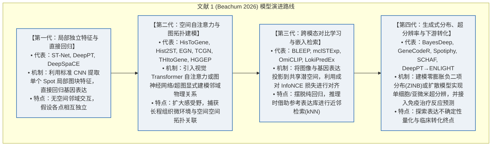
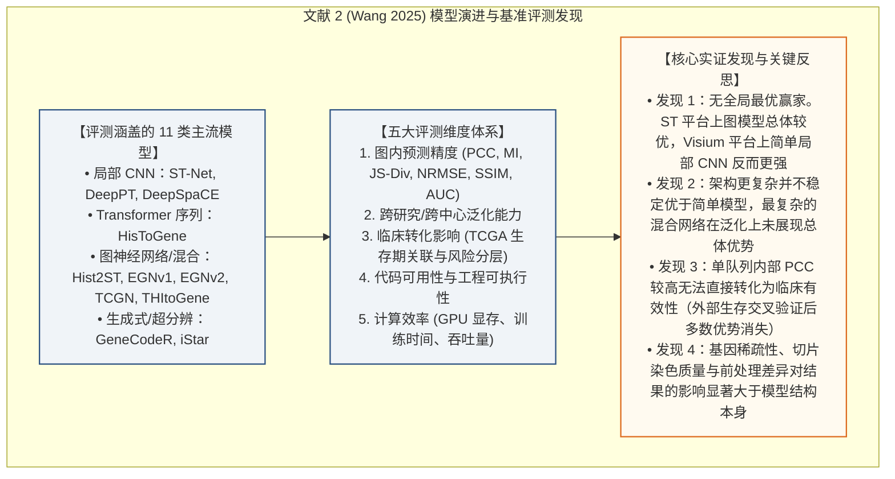
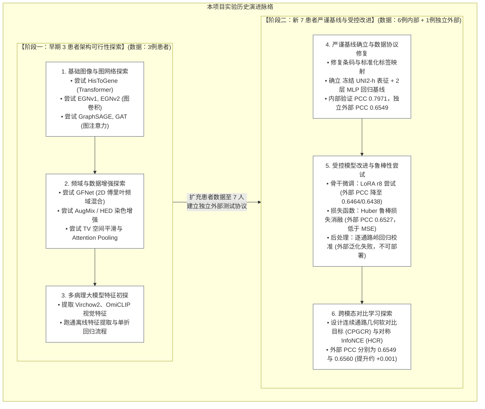
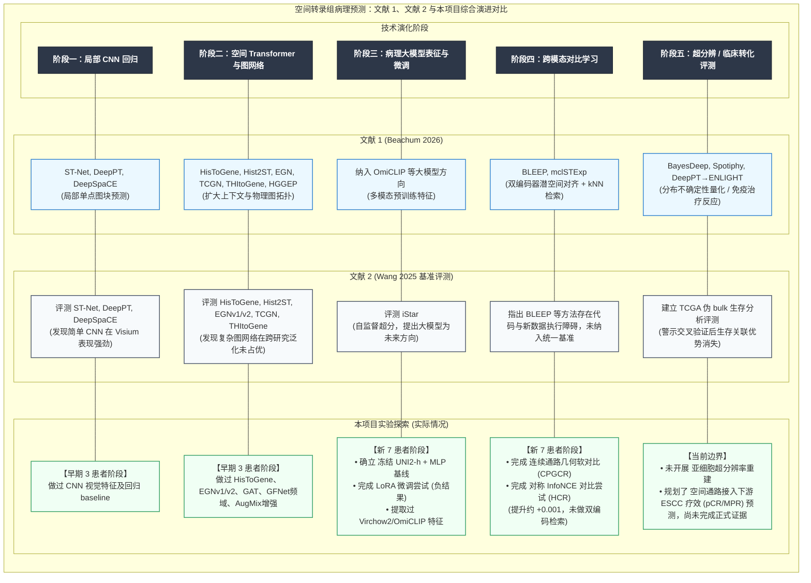

# 空间转录组病理预测（Phase 2）模型演化与实验进展对比汇报

> **汇报主题**：从病理图像预测空间转录组表达：前沿模型演化路线、实战难点与项目实验对比  
> **理论事实源**：
> 1. *Beachum et al. (2026, Briefings in Bioinformatics)*：《Advances in predicting omics profiles from imaging data: a review of methods and applications》  
> 2. *Wang et al. (2025, Nature Communications)*：《Benchmarking the translational potential of spatial gene expression prediction from histology》  
> **汇报定位**：面向导师与课题组的组会讨论文档。旨在客观梳理领域发展脉络，详细呈现两篇综述总结的演进路线，并如实汇报我们项目在两代数据下的实验历程、实测数据、遇到的具体瓶颈与改进尝试的效果。

---

# 第一部分：文献与项目的四重演进路线对比分析

为系统理清从病理图像预测空间表达的技术发展脉络，本节分别梳理两篇文献综述所呈现的演化路线、本项目实际经历的实验演进，并最终给出一幅三方综合对比图。

---

## 1.1 文献综述 1 (Beachum et al., 2026) 提出的模型历史演进路线

Beachum 2026 是一篇覆盖范围较宽的方法学综述。在由 H&E 图像预测空间表达的任务上，该文呈现出从**局部单模态回归**逐步拓展至**空间图拓扑**、**跨模态对比学习**与**亚细胞/多模态基础模型**的演进路径：



---

## 1.2 文献综述 2 (Wang et al., 2025) 提出的演进路线与基准评测发现

Wang 2025 (发表于 Nature Communications) 聚焦于对 **11 类代表性可执行模型** 在统一数据集与预处理协议下的系统基准评测（HEtoSGEBench），建立了 5 大评估维度（图内预测、跨研究泛化、临床影响、可用性、计算效率），给出了更为严格的演进梳理与客观评测结论：



---

## 1.3 本项目实际经历的实验演进历程

本项目在推进过程中，经历了从“**早期 3 患者探索**”到“**新 7 患者严谨基线及受控改进**”两个阶段，具体演化脉络如下：



---

## 1.4 综合对比演进图：文献 1、文献 2 与本项目实验的横向对齐

下表与综合对比图将 **文献综述 1 (Beachum 2026)**、**文献综述 2 (Wang 2025)** 与 **本项目实验演进** 进行横向对齐，客观展示三者在各个技术阶段的对应关系与本项目实际覆盖情况：



---

# 第二部分：本项目实验进展与客观数据盘点

## 2.1 两个数据时代的样本构成与评估协议

| 数据时代 | 样本构成 | 评估协议 | 证据属性与使用原则 |
|---|---|---|---|
| **早期 3 患者阶段** | 3 例患者切片<br>(HYZ15040, JFX0729, LMZ12939) | 单患者训练、3 患者联合训练、或 3 折留一患者交叉验证 | **历史探索证据**。由于切片数量少、标签协议未完全统一定版，其实验数值仅用于证明曾探索过该架构可行性，**不可与新基线直接横向比较数值高低**。 |
| **新 7 患者基线阶段** | 6 例内部训练验证患者 (1,078 spots) + 1 例完全独立外部测试患者 (1,039 spots)<br>(内部: HYZ15040, JFX, LMZ12939, TGC, XSL, ZHZ; 外部: XZY) | 6 名内部患者进行固定划分交叉验证；1 名独立外部患者仅用于测试最终泛化，不参与任何调参 | **正式受控证据**。基于严格的数据切分、统一 30 维 ssGSEA 标签与受治理流程，构成当前汇报的核心客观证据。 |

---

## 2.2 新 7 患者基线阶段实验明细与实测数据

下表客观汇总了我们在新 7 患者统一基线方案下完成的各项实验、实测数值与对应结论（注：`pooled PCC` 为所有 spot 展开后的皮尔逊相关系数，`raw MAE` 为原始通路表达绝对误差，`mean pathway raw R²` 为逐通路计算后平均的决定系数）：

| 实验方向与具体配置 | 对应学术路线 | 内部验证指标 | 独立外部患者测试指标 (XZY) | 实测客观结论与状态 |
|---|---|---|---|---|
| **冻结病理大模型表征 + 2层 MLP 回归**<br>(UNI2-h 冻结特征 1536维，MSE 损失) | 基础大模型特征<br>+ 局部直接回归 | pooled PCC = **0.7971**<br>raw MAE = **884.95**<br>raw $R^2$ = **0.6351** | • pooled PCC = **0.6549** (0.654896)<br>• raw MAE = **1176.21**<br>• mean raw $R^2$ = **-0.0880** | **当前受控基准锚点**。参数量小（仅两层 MLP 顶层参数），训练稳定，是目前跨患者泛化表现最稳健的基线。外部 $R^2$ 为负表明存在绝对值系统性偏移。 |
| **骨干网络参数高效微调 (LoRA)**<br>(UNI2-h 注入 LoRA r=8 微调) | 大模型参数高效微调 | 内部 PCC = **0.7930** (未提升) | • 外部 PCC (Run 1) = **0.6464**<br>• 外部 PCC (Run 2) = **0.6438**<br>• raw MAE = **1206.83** / **1210.09** | **负向结论，路线关闭**。外部测试表现低于冻结基线（0.6549），证实小样本下微调大模型骨干极易破坏通用表征并加剧过拟合。 |
| **Huber 鲁棒回归损失严格消融**<br>(替代 MSE 损失，$\delta=1$) | 损失函数鲁棒性优化 | 内部指标与 MSE 接近 | • pooled PCC = **0.6527** (0.652691，低于 MSE)<br>• 30 条通路中有 17 条显示描述性改善 | **负向结论**。虽然局部单通路有轻微抗噪表现，但在总体综合相关性上未优于标准 MSE 损失。 |
| **逐通路岭回归后处理校准**<br>(对回归预测值进行外部线性校准) | 预测值后校准 | 内部验证无直接增益 | • 外部测试正式门控未通过，误差发散<br>• mean pathway PCC 保持 0.5194 不变 | **路线关闭**。后处理校准在外部独立患者上极易造成分布漂移与样本过拟合，不具备实际部署可行性。 |
| **跨模态对比学习探索 (CPGCR)**<br>(基于 30 维通路几何距离构建连续软对比目标) | 连续几何跨模态对比 | 内部 PCC = **0.7980**<br>raw MAE = **882.27** | • pooled PCC = **0.6549** (0.654932，持平)<br>• raw MAE = **1173.90** (较基线略降 2.31)<br>• mean raw $R^2$ = **-0.0801** (略微改善) | **路线验证完成**。完成了软对比正则化在通路回归任务上的可行性验证，绝对误差略微下降，但整体相关性未见显著提升。 |
| **跨模态对比学习探索 (HCR)**<br>(对称硬样本对 InfoNCE 损失) | 经典 InfoNCE 跨模态对比 | 内部 PCC = **0.7977**<br>raw MAE = **882.23** | • pooled PCC = **0.6560** (0.655982，+0.0011)<br>• raw MAE = **1174.60**<br>• mean raw $R^2$ = **-0.0827** | **路线验证完成**。PCC 仅有约 0.001 的微弱变动，未能打破泛化上限。 |

---

## 2.3 早期 3 患者阶段历史探索实验记录

以下为早期在 3 例患者数据上开展的探索性实验记录（属历史证据）：

1. **图神经网络 (GNN / GAT / EGNv1 / EGNv2)**：
   - 尝试了通过物理欧氏距离建立局部图邻域。实测历史结果显示：EGNv2 三患者联合 PCC 约为 0.4245，EGNv1 约为 0.2460；单折 GAT PCC 约为 0.4068。图拓扑显式平滑未能带来相对于序列模型的稳定优势。
2. **视觉 Transformer (HisToGene / 空间自注意力)**：
   - 尝试了标准 HisToGene 架构。历史单患者/联合测试 PCC 约在 0.5385~0.6114 之间，但训练集与验证集存在明显性能差距（Train-Val Gap），模型在小样本上对超参数敏感。
3. **频域全局特征混合 (GFNet 频域算子)**：
   - 尝试利用 2D 傅里叶变换进行频域全局特征交互。历史消融数据显示其 PCC 约为 0.3785，低于同期的空域基线（0.3967），未能捕捉生物微环境的关键局部非线性信号。
4. **染色增强与空间平滑 (AugMix / HED / TV 正则)**：
   - 尝试了色彩空间扰动与总变差（TV）平滑。静态 HED 色彩扰动未显示出可信的性能增益，且与病理基础大模型自带的颜色不变性特征重叠。
5. **多大模型特征提取 (Virchow2 / OmiCLIP)**：
   - 完成了特征提取与下游预测流程的工程跑通，留存有单折预测结果文件，但早期未在统一受控协议下完成多模型横向大比武。

---

## 2.4 尚未开展或暂不适用的文献方法说明

为向导师客观汇报工作边界，明确以下文献方向尚未在本项目中开展：
- **空间超分辨率与单细胞表达重建（如 iStar, Spotiphy, SCHAF）**：本项目当前以 30 维生物功能通路（ssGSEA）为预测目标，服务于宏观微环境与临床分型，暂未进入亚微米单细胞去卷积任务。
- **基于大规模表达参考库的双编码器近邻检索（如完整版 BLEEP）**：完整 BLEEP 依赖大规模成对图像-表达库进行 kNN 检索推断。受限于当前空间配对样本规模，本项目采用的是在单模态图像输入下的直接回归与对比正则化。

---

# 第三部分：领域共性难点与实战瓶颈对齐

本节将两篇文献综述总结的 **9 大核心难点** 与本项目两代实验中 **实际遇到的具体瓶颈** 进行逐一客观对齐：

| 难点序号 | 领域共性难点（文献依据） | 本项目实战中遇到的具体瓶颈与实测现象 | 客观反思与现状判断 |
|:---:|---|---|---|
| **D1** | **配对组学样本极度受限**<br>*(Beachum p.6, Wang p.2)* | 从早期 3 例扩展到新阶段 6+1 例，样本量依然极小。单患者内 spot 虽多，但本质上独立生物学实体（患者数）严重不足。 | 极小样本量从根本上制约了深层大模型的端到端微调，极易引发样本级过拟合。 |
| **D2** | **跨患者泛化出现显著落差**<br>*(Beachum p.2, Wang p.7)* | **实测内部验证与外部测试落差明显**：冻结基线内部 PCC 为 **0.7971**，但在独立外部患者 XZY 上降至 **0.6549**，且外部 raw $R^2$ 为 **-0.0880**（负值）。 | 说明预测值与真实值在空间趋势上保持了相关性（PCC > 0.65），但在绝对表达尺度和偏置上存在系统性偏差。 |
| **D3** | **切片染色与图像质量干扰**<br>*(Wang p.7, Beachum p.8)* | 探索过 AugMix 与 HED 染色增强，但未带来可信收益；不同批次切片的组织折叠、气泡与染色深浅构成了明显的非生物学噪声。 | 简单的启发式数据增强无法本质解决跨中心染色差异，亟需严格的切片质控与标准化。 |
| **D4** | **通路间可预测性异质性强**<br>*(Beachum p.3, Wang p.11)* | 采用 30 维连续通路规避了单基因零膨胀，但 30 条通路表现严重分化：部分通路预测相关性极高，部分通路几乎无法预测。 | 不能仅凭 30 条通路的平均 PCC 评判整体性能，需要对高置信通路与不可预测通路进行分层。 |
| **D5** | **空间邻域拓扑的双刃剑效应**<br>*(Wang p.7)* | 早期尝试 GNN、GAT 等显式空间图网络，实测表现并未稳定超越无图结构的模型。 | 与 Wang 2025 结论一致：当组织内部异质性显著时，强行图平滑可能混淆细胞边界与微环境。 |
| **D6** | **模型复杂度陷阱（复杂度 ≠ 性能）**<br>*(Wang p.10)* | **实测表明：越复杂的模型改进越难超越简单基线**。从 GNN、Transformer、GFNet 到 LoRA 微调、Huber 损失、对比学习，均未能显著超越简单的“冻结大模型特征 + MLP”。 | 高度印证了顶刊结论：在小样本下，盲目增加网络参数或改变结构极易增加模型方差。 |
| **D7** | **单一评价指标容易产生矛盾**<br>*(Beachum p.3, Wang p.2)* | 在对比学习四臂实验中：HCR 在 PCC 上略微领先 (+0.001)，而 CPGCR 在 MAE (1173.90) 和 $R^2$ (-0.0801) 上略优。不同指标指向不同结论。 | 单一 PCC 无法全面反映模型优劣，必须结合 MAE、空间自相关性等多维指标综合研判。 |
| **D8** | **代码复现与工程落地门槛**<br>*(Beachum p.5, Wang p.9)* | 早期部署了大量文献模型代码，但许多外部方法依赖特定环境与复杂格式，导致前期“部署多、统一定量实验少”。 | 通过建立统一的实验 Registry 与数据合同，规范了证据链，避免了代码存在等同于实验完成的误区。 |
| **D9** | **从表达预测到临床转化的断层**<br>*(Beachum p.9, Wang p.9)* | 目前仅完成了空间通路表达的预测，尚未完成空间特征到食管癌免疫/化疗疗效（pCR/MPR）预测的正式受治理闭环。 | 空间转录组预测仅是中间特征，其真正的临床转化价值仍需在下游临床任务上进行严格验证。 |

---

# 第四部分：已尝试的应对方案与实际效果客观复盘

针对上述瓶颈，我们在两代数据下尝试了 4 类具体应对方案。以下为各方案的实际执行情况与客观效果复盘：

## 4.1 四类应对方案的实证效果复盘

```
┌───────────────────────────────────────────────────────────────────────────────────────────┐
│                                四类应对方案实证复盘总结表                                 │
├───────────────────┬───────────────────────────────────┬───────────────────────────────────┤
│     尝试方向      │             具体做法              │             实测效果              │
├───────────────────┼───────────────────────────────────┼───────────────────────────────────┤
│ 1. 特征表征方案   │ 冻结前沿病理大模型(UNI2-h)底层，  │ • 确立了当前最稳健基准            │
│    (化繁为简)     │ 仅训练2层轻量 MLP 回归头          │ • 内部 PCC 0.7971，外部 PCC 0.6549│
├───────────────────┼───────────────────────────────────┼───────────────────────────────────┤
│ 2. 泛化评估方案   │ 确立“6人内部 + 1人独立外部”协议，  │ • 成功暴露真实泛化落差            │
│    (严防过拟合)   │ 坚决不用外部测试集进行调参挑选    │ • 避免了将过拟合配置误判为有效    │
├───────────────────┼───────────────────────────────────┼───────────────────────────────────┤
│ 3. 目标定义方案   │ 采用 30 维 ssGSEA 连续生物通路    │ • 成功规避单基因 80%+ 零膨胀问题  │
│    (目标降噪)     │ 评分替代高稀疏单基因表达          │ • 但通路间可预测性差异依然显著    │
├───────────────────┼───────────────────────────────────┼───────────────────────────────────┤
│ 4. 损失/正则优化  │ • 尝试 LoRA 微调大模型骨干        │ • LoRA：外部 PCC 降至 0.6464(失效)│
│    (表征与约束)   │ • 尝试 Huber 鲁棒回归损失         │ • Huber：外部 PCC 0.6527(未胜出)  │
│                   │ • 尝试连续通路几何软对比学习      │ • 软对比：外部 PCC 0.6549(提升微弱)│
└───────────────────┴───────────────────────────────────┴───────────────────────────────────┘
```

### 详细客观分析：

1. **冻结大模型通用特征方案（有效确立基准，但存在跨域衰减）**：
   - *做法*：借助数千万病理图像预训练的通用先验，锁定底层编码器权重，仅学习顶层映射。
   - *实测效果*：相比早期端到端训练的 GNN 与 Transformer，该方案极大压缩了可学习参数量，消除了小样本训练崩溃风险。但独立外部患者测试显示其绝对 $R^2$ 仍为负（-0.088），表明跨中心图像的域偏移（Domain Shift）依然存在。
2. **严格双层验证体系（有效阻断虚假增益，守住科研底线）**：
   - *做法*：严格隔离 1 例独立外部患者数据，仅用于只读测试，不参与任何学习率、层数、损失权重的调优。
   - *实测效果*：该机制成功“拦截”了在内部表现尚可但在外部失效的改进（如 LoRA 微调在外部下降约 0.01 PCC；逐通路岭回归校准在外部发散），确保了项目不会在无效方向上产生沉没成本。
3. **30 维功能通路聚合（有效平滑标签，但未解决通路异质性）**：
   - *做法*：将数万维离散、高稀疏的单基因表达聚合为 30 条具有明确生物学功能的通路评分。
   - *实测效果*：将任务转化为连续回归，降低了建模难度。然而，实测发现免疫相关通路与代谢相关通路的可预测性存在天然差异，部分通路相关性达 0.8 以上，部分通路接近 0。
4. **模型微调、鲁棒损失与对比学习尝试（边际收益递减，未能打破性能瓶颈）**：
   - *做法*：先后尝试了参数高效微调（LoRA）、抗异常值损失（Huber）以及基于连续通路流形的对比学习约束（CPGCR / InfoNCE）。
   - *实测效果*：各实验结果均显示出极其微弱的变动（PCC 变动在 -0.01 到 +0.001 之间）。这客观证实：**在小样本配对数据限制下，单纯在算法结构或损失项上做微小调整，已进入边际收益递减区间**。

---

## 4.2 当前主要技术瓶颈与客观反思

通过文献对标与实验复盘，我们向课题组总结以下三项客观反思：

1. **结构改进已触及小样本瓶颈**：
   - 无论是在早期 3 患者阶段尝试的图网络、Transformer、频域混合，还是在新 7 患者阶段尝试的 LoRA、Huber、软对比学习，实测均未展现出相对于“冻结大模型特征 + MLP”的系统性优势。这与 *Wang et al. (2025)* 的基准评测结论高度契合——**小样本场景下，精巧的网络结构难以对抗数据本身的异质性**。
2. **跨患者泛化受制于数据分布与切片质量**：
   - 当前模型的主要误差来源并非网络容量不足，而是切片质量差异（模糊度、组织占比）、染色批次偏移以及不同患者间表达基线的系统性漂移。
3. **单靠平均 PCC 指标不足以支撑转化**：
   - 平均相关性（PCC ~0.65）掩盖了不同通路间的表现分化与绝对误差偏移；且推断出的空间通路表达是否真正对下游食管癌临床疗效预测有实质增益，仍缺乏端到端的临床证据支撑。

---

*（汇报文档结束）*
