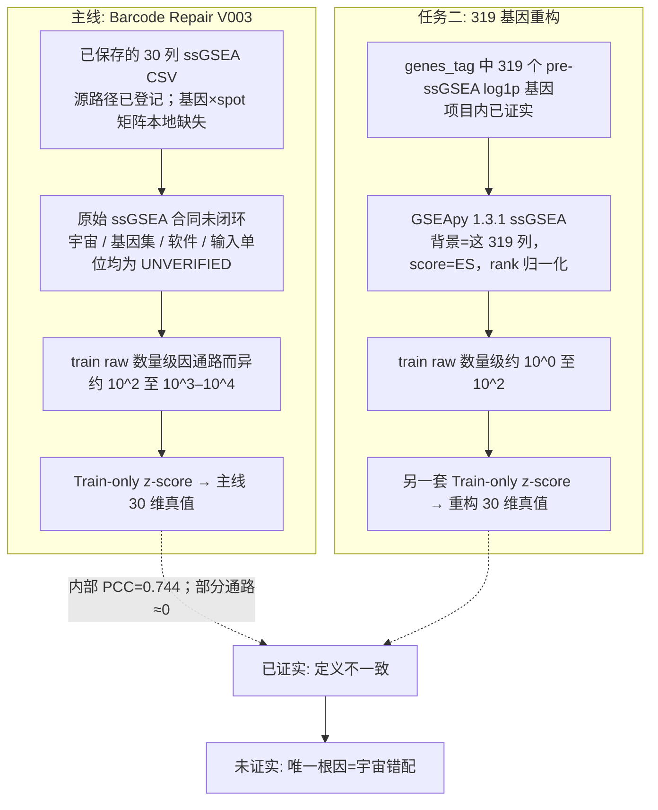

# Phase 2 任务二：319 基因 ssGSEA 重构通路与 Barcode Repair V003 标签差异专项审计报告

- **审计任务**：独立专项审计 —— 核验 Phase 2 任务二（319 基因经 GSEApy ssGSEA 得到的 30 维通路分数）与主线 Barcode Repair V003 / 任务三稠密对照 30 维通路标签之间的差异事实，并区分“已证实差异”与“未证实根因”
- **报告日期**：2026-09-19（同日二次事实复核修订）
- **审计角色**：PFMval 独立审计智能体
- **依据规范**：[`.agents/skills/pfmval-audit/SKILL.md`](../.agents/skills/pfmval-audit/SKILL.md) 专项审计模式；证据分类见 [`references/evidence-boundaries.md`](../.agents/skills/pfmval-audit/references/evidence-boundaries.md)
- **修订说明**：初稿把若干外部规格、生信常识和机制假说写成了项目内已存在的事实。本次按仓库可核对文件回源，只保留能锚定的数字；其余一律标为推论或未核实。初稿中的“约 20,000 / 18,085 基因宇宙”“Hallmark 161/200/113 即主线基因集”“点位排名 160–319”等表述，**不得再当作项目实测**。

---

## 一、待查声明与裁决诉求

- **待查声明**：
  在 `mpp2_task23_scratch_ablation_20260915` 任务二中，由 319 个 pre-ssGSEA 基因经服务器 GSEApy ssGSEA 得到的 30 维通路分数，与主线监督标签（`barcode-repair-20260711-d626ad8-v003`，任务三稠密对照沿用的同一套 30 维通路标签）在已对齐点位上数值不同、相关结构也不完整重合。
- **用户核心疑问**：
  > “是我们的当初这个标签有问题，还是说是确实是任务二使用的 SSGSEA 算法有所问题？”
- **可裁决的范围**：
  1. 差异是否真实存在，以及能否用点位错配、列名错位来解释；
  2. 任务二代码包是否兑现了“两臂共享同一份重构真值”的自我声明；
  3. 现有证据能否把根因唯一归到“主线标签 bug”或“任务二 GSEApy 公式写错”，或唯一归到“基因背景宇宙错配”。
- **不能裁决的范围**：主线 ssGSEA 的原始基因全集、基因集成员、软件/参数和输入矩阵单位。这些合同在 2026-07-15 扫描中即登记为未闭环，本次仓库内仍缺失。

---

## 二、审查证据源清单

下列“能证明什么”只写该文件直接支持的内容。`accepted` 仅用于 Registry / 受保护资产本身；本地复算与分析表标为 `diagnostic_only`，不因其存在而升格为已确认实验结论。

| 证据源 | 路径 | 生命周期 | 本次实际能证明的事实 |
|---|---|---|---|
| 主线修复资产清单 | [`project_state/evidence/mpp/barcode-repair-20260711-d626ad8-v003/server_asset_audit_manifest.json`](../project_state/evidence/mpp/barcode-repair-20260711-d626ad8-v003/server_asset_audit_manifest.json) | 受保护历史资产；MPP2 现用 manifest 为 `barcode-repair-20260711-d626ad8-v003:1204018178a4d355` | MPP2 标签源文件是各患者 `*_ssGSEA.csv`（`D:\AIPatho\Patch\visiumhd_patch\2\<patient>\<patient>_ssGSEA.csv` 等）。清单证明的是**已经算好的通路分数文件路径**，**不能**证明这些 CSV“覆盖全转录组测序矩阵”。 |
| 主线 train-only z-score | [`mpp_standard_splits/group_2/zscore_params_from_train.json`](../mpp_standard_splits/group_2/zscore_params_from_train.json) | 当前冻结参数 | 6 名训练患者、9,472 点；raw 均值/标准差因通路而异。例如 `tls` 均值 −2331.71（std 1581.27），`tgfb` +3915.86（std 1693.71），`mhc` +7961.58（std 2208.94）。**不是**“所有通路均值与标准差都在 1,000–8,000”：`Inflammatory_Response` 均值仅 −98.42，`TNF_Signaling` 均值仅 +123.95，`Coagulation` 均值 −637.60。 |
| 任务二重构代码 | [`团队项目进度与结论/ljq/mpp2_task23_scratch_ablation_20260915/src/pathway_reconstruction.py`](../团队项目进度与结论/ljq/mpp2_task23_scratch_ablation_20260915/src/pathway_reconstruction.py) | 实验包源码 | 调用 `gseapy.ssgsea`，`data=expression.T`，`sample_norm_method="rank"`，`min_size=1`，读取返回的 `ES`。背景基因即传入矩阵的基因列。 |
| 任务二输入约定 | [`.../src/targets/gene_expression.py`](../团队项目进度与结论/ljq/mpp2_task23_scratch_ablation_20260915/src/targets/gene_expression.py)、[`configs/01_task2_direct_common.json`](../团队项目进度与结论/ljq/mpp2_task23_scratch_ablation_20260915/configs/01_task2_direct_common.json)、[`preflight.py`](../团队项目进度与结论/ljq/mpp2_task23_scratch_ablation_20260915/preflight.py) | 实验包源码 | 基因标签根目录配置为 `D:\AIPatho\Patch\genes_tag`；文件名 `*_genes_pre_ssgsea.csv`；preflight 打印“319 pre-ssGSEA log1p features”。 |
| 任务二重构标度 | [`.../common_task2_pathway_scale.json`](../团队项目进度与结论/ljq/result/mpp2_task23_scratch_ablation_20260915/full_20260915_105210_140_d7df166e/task2_direct_reconstructed_common_truth/raw/common_task2_pathway_scale.json) | 已回传运行产物 | 训练集 9,472 点上 GSEApy ES 的均值/标准差。例如 `tls` 均值 −147.27（std 25.41），`tgfb` −44.90（std 76.85），`mhc` +103.02（std 109.19）。`IL6_JAK_STAT3` 均值仅 −6.31，不能写成“全部在 10–150”。 |
| 任务二方法登记 | [`.../pathway_reconstruction_metrics.json`](../团队项目进度与结论/ljq/result/mpp2_task23_scratch_ablation_20260915/full_20260915_105210_140_d7df166e/task2_gene_then_reconstruct/raw/pathway_reconstruction_metrics.json) | 已回传运行产物 | `software=gseapy`，`version=1.3.1`，`score=ES`，`n_outputs` 对应 319 基因；`input_scale=pre_ssgsea_log1p_after_inverse_train_gene_zscore`；基因集映射路径为服务器 `D:\AIPatho\Patch\genes_tag\gene_to_pathway_mapping.csv`。本地仓库**没有**这份 mapping 副本，因此**不能**在本次核出每条通路的成员数。 |
| 本地独立复算 | [`work/ljq_metrics_review_20260916/recomputed_metrics.json`](../work/ljq_metrics_review_20260916/recomputed_metrics.json) | `diagnostic_only` | 内部 1,078 点：任务二重构真值 vs 任务三主线真值的患者—通路等权 PCC = 0.743795；外部 1,039 点同一口径 = 0.751797。任务二两臂真值 z 的 MAE = 0.213954，最大绝对差 1.218035；raw MAE = 2582.28 是**两套不同合同 raw 的描述性差**，不能当成算法误差。 |
| 逐通路汇总表 | [`experiments/phase2_task3_fullfov_density_ablation_v1/analysis/task2_true_label_comparison_30_pathways.csv`](../experiments/phase2_task3_fullfov_density_ablation_v1/analysis/task2_true_label_comparison_30_pathways.csv) | `diagnostic_only` | **30 行通路级汇总**（中位数、四分位、PCC、\|Δz\|、同号率），**不是** 2,117 点的逐点位明细。内部 PCC 最高 `Fibrosis` 0.9827，最低 `Apoptosis` 0.0158；外部 `Apoptosis` −0.1048、`mTOR_Signaling` −0.1038。 |
| 对齐与范围说明 | [`.../task2_true_label_comparison_summary.json`](../experiments/phase2_task3_fullfov_density_ablation_v1/analysis/task2_true_label_comparison_summary.json)、[`docs/task2_ssgsea_truth_gap.md`](../experiments/phase2_task3_fullfov_density_ablation_v1/docs/task2_ssgsea_truth_gap.md)、[`src/label_audit.py`](../experiments/phase2_task3_fullfov_density_ablation_v1/src/label_audit.py) | 实验包分析 | 内部 1,078 + 外部 1,039 = 2,117 点；连接键为 `patient_id, patch_id, x, y, split, slide_id`。该包已写明：结果证明差异存在，**单独不能证明由哪一环节造成**。本地没有训练集两套原始标签。 |
| 2026-07-15 扫描 | [`01_指南与解读/分析报告/AI预测食管癌性能评估_项目扫描回答_20260715.md`](../01_指南与解读/分析报告/AI预测食管癌性能评估_项目扫描回答_20260715.md) 的 **P0-5（约 L239–L295）** 与 **U8** | `historical` | 30 个目标列名已确认。当时**尚未证明**：完整 gene list、数据库来源、ssGSEA 输入单位、软件（GSVA / GSEApy / 其他）、逐患者还是合并计算。文档曾提到“MSigDB Hallmark 30 条子集”，但扫描明确说**未闭环验证**。初稿引用的 L187–L215 实际是 bin/spot 与 224×224 patch 对应关系，**不是**基因集合同。 |
| 原始表达矩阵缺失 | [`01_指南与解读/分析报告/MPP2原始基因集分数空间连续性与患者内排名分析方案_20260801.md`](../01_指南与解读/分析报告/MPP2原始基因集分数空间连续性与患者内排名分析方案_20260801.md) L47–L51 | `historical` | 当时保护数据根下“没有基因 × spot 的原始计数矩阵，只有 30 条通路的 ssGSEA 分数”。本次工作区仍未找到该矩阵。 |
| 外部平台规格（非项目数据） | 10x Genomics《Visium Human Transcriptome Probe Set v2.0》公开说明 | 项目外技术文档 | v2.0 过滤后输出 **18,085** 个目标基因；v2.1 过滤后为 **18,132**。这只说明该试剂盒的设计容量。**项目未登记用的是 v2.0 还是 v2.1，也未证明主线 ssGSEA 跑在未过滤全探针矩阵上。** |

---

## 三、核验项

| 序号 | 核验项 | 结果 | 实测与出处 | 边界 |
|---|---|---|---|---|
| **C1** | 已保存表能否按身份键 1:1 对齐 | **PASS** | `label_audit.py` 要求两侧行数分别为 1,078 / 1,039，且 `patient_id, patch_id, x, y, split, slide_id` 完全匹配；summary 记录 `n_total_aligned=2117`。 | 这只证明**两份已保存预测表**对得上，不能外推 Visium 原始 barcode 配准无误，也不能说“坐标物理上不可能错”。 |
| **C2** | 30 通路名称与冻结顺序 | **PASS** | 任务二 `common_task2_pathway_scale.json` 的 `names` 与主线 `zscore_params_from_train.json` 的 `pathways` 键顺序一致，均为 `tls, tgfb, ..., ECM_Organization`。 | 名称一致不等于基因集成员一致。 |
| **C3** | 未标准化 raw 的数量级 | **PASS**（差异存在） | 主线 train raw 均值绝对值从约 98（`Inflammatory_Response`）到约 7962（`mhc`）；任务二 train raw 均值绝对值从约 6.3（`IL6_JAK_STAT3`）到约 147（`tls`）。内部验证两套 raw 的平均绝对差 2582.28（`recomputed_metrics.json`）。同一通路可出现 train 均值异号，例如 `tgfb` 主线 +3915.86、任务二 −44.90。 | raw 差是**不同生成合同、不同单位**的描述，不能解释为“算法算错了 2582 分”。分析包已警告勿把 raw MAE 当误差。 |
| **C4** | z-score 后相关结构 | **PASS**（不是单纯尺度变换） | 内部患者—通路等权 PCC = **0.7438**；外部同一口径 **0.7518**。若两套分数只差正仿射变换，通路内 z-score PCC 应接近 1。实测通路异质：内部 `Fibrosis` 0.9827、`ifng` 0.9791、`Wound_Healing` 0.9684、`mhc` 0.9586；`Apoptosis` 0.0158、`mTOR_Signaling` 0.0240、`Unfolded_Protein_Response` 0.1842。外部 `Apoptosis`、`mTOR_Signaling` 为负。内部总体同号率 0.756，外部 0.726。 | “不是整体按比例缩放”成立。把异质性写成“319 基因微宇宙把凋亡基因挤到 160–319 名”则**没有排名数据**，属于机制假说。 |
| **C5** | 任务二是否共享静态真值 | **FAIL**（相对其自我声明） | 配置写 `task2_common_truth = ssgsea_from_true_319_genes`，但 `task2_direct` 预生成标签，`task2_gene` 在评估时对逆变换后的真值基因再跑 GSEApy。内部 32,340 个点位×通路单元中 31,437 个 z 值不完全相同，MAE 0.2140，最大 1.2180；外部 MAE 0.0863，最大 1.1921。 | 这是任务二包内工程非幂等，是与主线差异**并列的第二层问题**，不能解释 0.74 的跨定义断层。初稿把原因写成“数据块划分、浮点或逆变换”，仍是候选，未做消融。 |
| **C6** | 主线 ssGSEA 基因宇宙是否为 ~20,000 / 18,085 | **UNVERIFIED** | 仓库与本次工作区没有基因 × spot 原始矩阵。10x v2.0 的 18,085 是**平台规格**，不是本项目抽出的矩阵行数。任务二侧宇宙为 319 基因，有代码和 `target_spec.json` 证明。 | 不得把平台规格写成主线已使用的背景。v2.1 为 18,132，试剂版本也未在项目内闭合。 |
| **C7** | 主线基因集是否为 Hallmark 全量（161/200/113） | **UNVERIFIED** | 2026-07-15 扫描已声明完整 gene list 与数据库来源未证明。历史方案稿写过“Hallmark 30 条子集、每条 30–200 基因”，同一扫描将其标为未闭环文档描述。通路名含 `tls` / `mhc` / `icp` / `toxic`，本身不是 Hallmark 标准名。本地没有 `gene_to_pathway_mapping.csv`，319/30≈10.6 只是**不重复并集的算术平均**，未计入通路重叠，也不能代表主线原始成员数。 | 初稿“用 10 个基因重构原本 150–200 个基因、信息丢失 90%”把外部数据库规模当成了项目主线合同。 |
| **C8** | 主线软件是否为 R/GSVA，任务二公式是否“标准且无误” | **UNVERIFIED** | 扫描列出 GSVA、GSEApy、Seurat、Scanpy、自定义等可能性，**没有**选定 R/GSVA。任务二使用 gseapy 1.3.1、`rank` 归一化、输出 `ES`（不是 NES）。这套调用能跑完并写出完整 30 列，**不等于**与未知主线实现一致，也不等于 Barbie/GSVA 默认公式的逐参数复现。文中简化 ES 求和式只是教学示意，不是 GSEApy 实现。 | “没写崩”≠“与主线同一算法”。 |

补充描述（不作因果）：内部验证中主线 `mhc` raw 中位约 9022、IQR 仅 197，接近饱和；任务二 `tls` 重构 raw 中位 −159.5、IQR 仅 9.4，接近塌缩。这些是分布形态事实，不能单独证明“免疫基因霸占前 50–100 名”。

---

## 四、裁决

### 总体裁决

**`CONDITIONAL GO`** —— 就“两套 30 维标签能否当作同一监督目标来比模型”：**不能**。就“根因已经唯一确定为基因宇宙错配”：**不能写进结论**。

针对用户原问：

> 是当初标签有问题，还是任务二 SSGSEA 有问题？

**现有证据支持的回答：**

1. **已排除的低级错误**：在已保存的内部 1,078 点与外部 1,039 点上，不是点位对不齐，也不是 30 列名称/顺序反了。
2. **已证实的目标定义不一致**：z-score 后宏观 PCC 只有约 0.74，且部分通路接近 0 或为负，所以不是“同一生物学量换了单位”。任务二自己的工程实现还有一份应共享却重算的真值漂移（z MAE 0.214），但这不是跨主线断层的主解释。
3. **不能宣布的责任归属**：
   - 没有源码或复现实验证明主线 V003 的 *ssGSEA 生成脚本* 算错；V003 修复的是切片/barcode 错配，不能据此说“通路分数生物学完全自洽”。
   - 没有对照实验证明任务二把 GSEApy 公式写错；它按包内设定跑完了 319 基因宇宙上的 ES。
   - **基因背景宇宙错配、基因集截断、软件/参数不同、输入是 log1p 还是 counts、后处理不同**，都仍是候选解释。其中宇宙错配与截断在生物信息学上合理，但**项目里没有主线宇宙、没有主线基因集文件、也没有点位基因排名**，不能从“合理”升级为“已证实根因”。

初稿的总判词——“既不是主线 bug，也不是任务二脚本写错，而是 Universe Mismatch & Gene Set Truncation”——**前半句的“不是 bug”过强，后半句把假说写成了事实**。应改为：

> 两套标签不是同一生成合同下的同一物理量；差异真实且不能用对齐错误解释。根因在原始 ssGSEA 合同补齐并复算之前保持未决。宇宙受限是优先候选，不是已关闭的因果证明。

---

## 五、哪些话是事实、哪些是推论、哪些应删除

### 1. 可以保留的项目事实

- 任务二 GSEApy 输入矩阵只有 319 个基因，背景宇宙被代码写成这 319 列。
- 主线训练标签的 raw 尺度与任务二重构 raw 尺度不在同一数量级；z 后仍非高相关。
- 任务二两臂未只读同一份冻结重构真值。
- 主线当前使用的是 V003 修复后的 `*_ssGSEA.csv` + train-only z-score，不是任务二现场算出来的 ES。

### 2. 可以保留、但必须标明“推论 / 外部规格”的句子

- 若主线确实在近全转录组背景上做 rank-based ssGSEA，而任务二只在 319 个通路成员上做，则两套 ES **在定义上**不是同一富集分数。这是方法学推论，**前提尚未在项目内核实**。
- 10x Visium HD Human Transcriptome Probe Set **v2.0** 过滤后 18,085 基因、**v2.1** 过滤后 18,132 基因，是厂商公开规格。它**不能**填补缺失的项目矩阵，也不能推出“其余 17,000–19,000 个基因都是非特异/低表达背景”。
- 把 raw 从数千降到数十，**有可能**与背景长度变短有关，但实测缩放倍数通路间差很多（例如 `|mhc|` 约 7962/103≈77 倍，`|tls|` 约 2332/147≈16 倍），**不能**写成“缩小约 60 倍、完全符合 N=18085/319 的数学尺度”。

### 3. 初稿中应视为越界或编造、本次删除或降级的表述

| 原表述 | 问题 |
|---|---|
| 主线 CSV“覆盖全转录组测序结果” | 清单里是 30 列通路分数，不是表达矩阵。 |
| 通路成员“进入全基因组前 5%–10%”“排前 2,000 名”“被挤到 160–319 名”“免疫基因霸占前 50–100 席” | 项目内没有点位基因排名表。 |
| “零和博弈导致部分通路彻底脱轨，这确凿解释了 PCC” | 机制故事；分析包已列为待确认解释。通路基因集重叠，也不是严格零和。 |
| `HALLMARK_APOPTOSIS` 161 等即主线基因集；“平均每条通路约 10 个基因、丢失 90%” | 外部库规模 + 319/30 算术，不是主线合同。 |
| 主线使用“R/GSVA 脚本” | 扫描里只是未知软件列表中的一个选项。 |
| 简化 ES 公式即 ssGSEA 数学本质 | 教学示意，不是 gseapy 1.3.1 的实现。 |
| 主线“无结构性错误”“数学和生物学完全自洽”“唯一受保护基准故生成过程正确” | V003 证明的是修复后的标签资产被后续实验使用，不是原始 ssGSEA 可复现。 |
| 引用 2026-07-15 报告 L187–L215 证明基因集合同缺失 | 行号指错章节；正确位置是 P0-5。 |
| 30 通路 CSV 是“逐点位对比数据” | 实为 30 行汇总。 |
| 证据生命周期写成 `verified` / 复算即正式结论 | 本地诊断，Registry 未把该差异分析标为 `accepted`。 |

### 4. 任务二输入单位（初稿未强调）

任务二在逆基因 z-score 之后，对 **pre-ssGSEA log1p** 特征跑 ssGSEA。主线原始输入是 counts、normalized、log 还是其他，2026-07-15 起就未证明。即便宇宙相同，**输入标度不同也会改 rank**。这与宇宙错配是并列候选，不是已被宇宙假说吸收的细节。

---

## 六、责任定性（按证据强度）

| 关注对象 | 能说什么 | 不能说什么 |
|---|---|---|
| **主线标签 V003** | 是当前 MPP2 已启用的修复标签资产；后续 UNI2-h / Virchow2 / 空间臂 / 全视野等沿用这套 30 维分数做监督。barcode/切片错配修复有独立证据链。 | 不能因“正在用”就断言原始 ssGSEA 无科学问题。生成脚本、基因宇宙、基因集成员仍缺失。 |
| **任务二 GSEApy 实现** | 按包内合同在 319 基因、log1p、rank、ES 上跑通；与主线分数不可互换。两臂未共享冻结真值，相对自身声明为工程缺陷。 | 不能说“公式写错”或“无代码问题到可以当作主线复现”。也还不能说“科学前提错配已被实验证实”，只能说“任务二明确使用了与未知主线宇宙不同的、已被记录的 319 基因宇宙”。 |

---

## 七、建议（不依赖未证实根因）

下列建议只依赖 **C1–C5 已证实的定义不一致**，不需要先接受宇宙错配假说。

1. **不要跨定义比模型**：任务二重构通路的 PCC/MSE 不得与主线 30 维通路模型的指标放进同一优劣表。目标不同，数值高低不表示算法更强或更弱。
2. **论文与交接**：
   - **方案 A（负担最小）**：任务二只报告 319 基因表达预测；不再把重构 30 通路拿去和主线通路比。
   - **方案 B（若仍展示重构通路）**：只允许任务二内部自洽比较（直接学重构通路 vs 先预测基因再重构）；正文必须写明这是 **319 基因 + GSEApy ES** 的重构分数，**未证明**等于 V003 主线通路标签；两臂只读同一份预先生成的重构真值，消除 0.214 的包内漂移。
3. **若要关闭根因**：需要主线原始合同，而不是更多叙述。最低复现材料是：原始基因全集、30 条通路成员与版本、软件及全部非默认参数、输入矩阵单位、以及可抽查的基因 × spot 矩阵（或等价冻结件）。在此之前保持 `UNVERIFIED`，不把候选机制写进论文因果句。
4. **本文档位置**：结论留在本报告。按用户指示，暂不合入 [`01_指南与解读/部署方案/Phase2实验汇总交接与论文准备_部署方案_20260919.md`](../01_指南与解读/部署方案/Phase2实验汇总交接与论文准备_部署方案_20260919.md)。

---

## 八、剩余事项

- **Blocking（若宣称“根因已查明”或恢复把任务二通路与主线通路混比）**：主线 ssGSEA 合同仍缺；跨定义比较应停止。
- **Non-blocking**：宇宙错配假说可以保留为待验机制；包内真值非幂等可在下次任务二代码修复中处理；Hallmark 外部条目数可作对照假设，但必须标明不是项目基因集。
- **Next authorized action**：等待用户决定是否补原始合同、是否按方案 A/B 改论文口径；本次未授权训练、缓存重建或改 `团队项目进度与结论/`。
