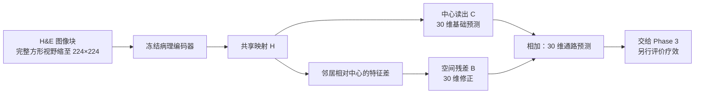

# PFMval_new — 食管癌病理图像预测空间通路活性

<!-- project-state:start -->
## 当前项目状态（自动生成）

- 状态版本：`265`；完整入口：[CURRENT_STATE.md](CURRENT_STATE.md)。
- 项目导航：[PROJECT_GUIDE.md](PROJECT_GUIDE.md)；实验进度：[experiments/experiment_progress.md](experiments/experiment_progress.md)。
- 数据方案固定为 **MPP2**。固定经典空间残差，暂停方法改进；推进补充实验合同、团队交接与论文准备。
- 两种 PCC 并列保留；实验是否接纳以 [实验注册器](experiments/experiment_registry.json) 为准。文件存在或代码验证不等于科研结论成立。

<!-- project-state:end -->

本仓库现在先开放给团队成员，方便查阅已经整理出来的 Phase 2 结果与分析。完整的 Phase 2 探索路径、方法取舍说明和正式交接材料会另作整理后再发给大家。下面的数字只来自已登记并接纳的实验；未接纳、待审或早期三患者结果不能当作当前结论。

GitHub 里主要是文档、实验代码包和登记表。原始病理图像、特征缓存、模型权重和大部分原始预测文件不在本仓库中。克隆后不能直接复现训练或推理。

## 建议阅读顺序

1. 本页：问题、当前方法和已接纳结果的范围。
2. [2026-09-19 组会汇报](02_组会汇报/组会汇报_全视野修复_超参搜索_基础模型消融与任务二奇异性研讨_20260919.md)：全视野交付检查点、三编码器消融，以及任务 2 待核对事项。
3. [全视野通俗导读](01_指南与解读/学习指南/Phase2_全视野修复与超参数重搜索_通俗导读与学习指南_20260916.md)：为什么改输入视野、怎样读本轮实验。
4. [软连接三轮分析与模型选择建议](01_指南与解读/分析报告/Phase2软连接三轮实验综合分析与Phase3模型选择建议_20260910.md)：为什么固定经典空间残差。
5. 需要核验接纳范围或逐项指标时，再打开 [实验总览](experiments/experiment_dashboard.md) 或 [实验注册器](experiments/experiment_registry.json)。

仓库中另有一份 9 月 19 日首版阅读材料：[Phase2完整交接包_20260919_首版](团队项目进度与结论/方案共享/Phase2完整交接包_20260919_首版/00_从这里开始.md)。它可以帮助理解现有证据，但还不是后续会单独整理的完整探索路径与正式交接文件。

## 我们在解决什么问题

Phase 2 用食管癌 H&E 病理图像块，预测每个空间点位上 30 条基因通路的 ssGSEA 活性（用训练集拟合的 z-score）。训练时一个图像块对应一个空间点位及其通路标签；推理时还可以使用同一切片上邻居点的**图像**信息，不能把验证或外部真值当作邻域输入。

Phase 3 再研究这些通路预测能否帮助疗效预测。Phase 2 的相关性本身不能证明疗效预测有效。

当前数据方案是 **MPP2**：开发集六名患者（HYZ15040、JFX、LMZ12939、TGC、XSL、ZHZ），外部参考患者 XZY。标签版本为 barcode-repair-v003。早期三患者探索以及 MPP1 / MPP3 / MPP4 / MPP5 只作历史背景，不再作为正式证据。

## 当前方法

冻结的病理编码器把完整正方形图像块缩到 224×224（协议 `full_fov_224_bicubic_v1`），不再使用历史上默认的中心裁剪。共享映射 H 把图像特征整理到 256 维；中心读出 C 给出 30 维基础预测；空间残差 B 用邻居相对中心的特征差给出修正。最终输出为 **C + B**。



向 Phase 3 交付的检查点是 **UNI2-h 空间臂、预先指定种子 45、正式第 28 轮**。种子不是按外部 XZY 分数事后挑选的。编码器消融里 Virchow2 在部分内部指标上略高，不自动改变这一交付选择。运行接口见 [当前模型交接说明](团队项目进度与结论/qzs/Phase2最终模型_Phase3交接包_20260918/README.md)；权重文件不在 GitHub 中。

## 目前可以先看的结果

下列为已接纳批次 `phase2_fullfov_hpo_v1` / `20260916_231813_101_7b1b9a79` 中，全视野最终消融、三种子（45/46/47）均值。主指标 PCC 是患者—通路等权平均；展平 PCC 是全部点位×通路 z 分数拉直后算一次相关。两种口径回答不同问题，不能互相证明优劣。

| 编码器 | 空间臂 内部主指标 / 展平 PCC | 空间臂 外部 XZY 主指标 / 展平 PCC |
|--------|------------------------------|-----------------------------------|
| UNI | 0.661765 / 0.801208 | 0.559422 / 0.656756 |
| UNI2-h | 0.676986 / 0.810549 | 0.571073 / 0.683748 |
| Virchow2 | 0.679243 / 0.811346 | 0.577756 / 0.678311 |

相对同配方的去 B 臂，三个编码器的空间臂在内部和外部主指标上都有描述性提高。外部只有 XZY 一名患者，且不是全新盲测，不能写成广泛跨患者泛化已经解决。三种子标准差只描述本批种子波动。

实际交给 Phase 3 的是 UNI2-h 空间臂 **seed 45** 这一份检查点，不是上表三种子均值，也不是按 XZY 另选的最优种子。更完整的对照表、去 B / 单点结果和读数边界见：

- [已接纳全视野三模型结果](团队项目进度与结论/方案共享/Phase2完整交接包_20260919_首版/02_实验档案/已接纳全视野三模型结果.md)
- [2026-09-19 组会汇报](02_组会汇报/组会汇报_全视野修复_超参搜索_基础模型消融与任务二奇异性研讨_20260919.md)
- [实验总览](experiments/experiment_dashboard.md)

空间方法是在第一轮四臂比较后固定的，不是用全视野消融事后倒推出来的。四臂已接纳结果（旧裁剪协议、种子 42/43/44）见 [软连接 v2.1 实验分析](01_指南与解读/分析报告/Phase2软连接v2_1_实验结果与机制分析_20260908.md)。

## 怎样读这些数字

- **患者—通路等权 PCC**：每位患者、每条通路分别算点位相关，再等权平均。这是本批内部选模用的主指标。
- **整体展平 PCC**：把全部点位×通路的 z 分数拉直后算一次相关。数值通常更高，但口径不同。
- **内部验证**：来自同一批六名开发患者的留出点，不是新的跨患者验证。
- **外部 XZY**：一名患者的固定评估；未用于选配方或选种子。
- 是否“已确认”以 [实验注册器](experiments/experiment_registry.json) 的 `accepted` 为准。文件存在、代码能跑或 Dashboard 有数字，都不自动等于科研结论成立。

任务 2（基因预测后重建通路）和任务 3（稀疏训练、稠密测试）目前只有接口和部分待审材料，没有与主线全视野协议对齐的已接纳结论。任务 2 标签合同仍待负责同学核对。

## 仓库里有什么，没有什么

| 在 GitHub 里 | 不在 GitHub 里 |
|--------------|----------------|
| 分析报告、学习指南、组会汇报、审计记录 | 原始病理图像与标签大数据 |
| 实验登记表、进度和总览 | 特征缓存、模型权重、大部分原始预测 |
| 部分实验代码包和团队 Markdown 材料 | 服务器上的 runs / weights / feature_caches 实体 |

本地完整工作树里，原始回传通常在 `experiments/results/<实验名>/<运行编号>/`；那部分默认不同步到 GitHub。

## 目录导览

```text
PFMval_new/
├── README.md                          # 本页，团队阅读入口
├── CURRENT_STATE.md                   # 当前状态概览
├── PROJECT_GUIDE.md                   # 按问题找文档
├── 01_指南与解读/                     # 分析报告、学习指南、部署方案
├── 02_组会汇报/                       # 组会材料
├── 03审计报告/                        # 审计记录（待审不等于已接纳）
├── 团队项目进度与结论/                # 成员材料与交接草稿
├── experiments/                       # 实验包、登记表、总览
├── project_state/                     # 状态、指令与文档登记
└── configs/                           # 服务器路径等配置
```

根目录里仍可能看到 `histogene/`、`train_histogene_uni_tokens_augmix.py` 等早期入口。它们属于三患者探索阶段，**不是**当前 MPP2 训练或评估入口。

## 后续交接

完整的 Phase 2 探索路径（含成功、未改善和停止的路线）以及面向队友的正式交接文件，会在这次 GitHub 共享之后另行整理。收到那份材料前，请以本页、已接纳结果表和组会汇报为准，不要把早期 HisToGene / LoRA / OmiCLIP 数字写进当前结论。

需要核验当前状态、文档用途或实验接纳时：

- [CURRENT_STATE.md](CURRENT_STATE.md) / [current_state.json](project_state/current_state.json)
- [PROJECT_GUIDE.md](PROJECT_GUIDE.md)
- [实验注册器](experiments/experiment_registry.json)
- [文档注册器](project_state/document_registry.json)
- [AGENTS.md](AGENTS.md)（仓库维护边界，不是科研结论）
