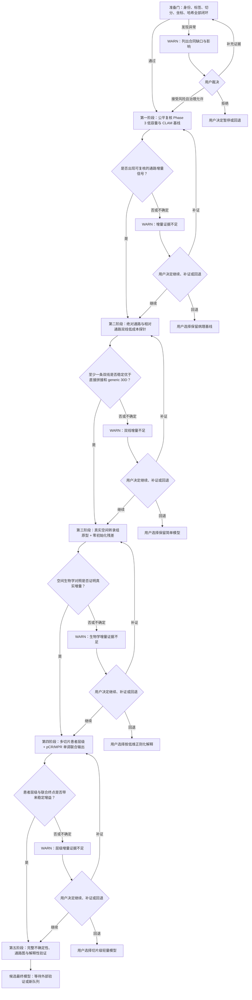

# Phase 3 双线基线与跨队列空间通路迁移分阶段实验方案

> 日期：2026-08-03  
> 状态：`draft / reference / pending experiment registration`  
> 作用：融合既有 MPP2 绝对/相对双线、Phase 3 CLAM 新基线与跨队列空间通路创新方案，形成按难度递进、以 WARN 提示并由用户裁决的实验路线。  
> 安全边界：本文不登记 experiment、不创建 job、不消耗 run unit、不授权训练或服务器操作。正式运行前必须绑定用户指定的 `W###` 工作树、experiment id、source commit、run budget 和显式批准文件。  
> 当前主评估口径：切片级；患者级仅作次要/敏感性分析。所有 fold 仍必须按患者分组。

## 1. 总体目标与核心假设

### 1.1 最终研究问题

本方案不把 30 维虚拟通路当作独立第二模态，而要检验：

> Phase 2 真实空间转录组所定义的局部通路形态知识，能否以低容量、可关闭、受不确定性控制的方式迁移到 Phase 3，并在 pCR/MPR 响应预测中提供超出普通图像压缩的稳定增量？

### 1.2 三层假设

1. **基线假设**：历史“特征融合高于直接拼接”的方向在同协议复核后仍存在。
2. **表示假设**：MPP2 绝对分数与患者/切片内相对活性提供不同但互补的归纳偏置。
3. **创新假设**：真实 SpT 支持的通路原型与不确定性残差，能够超过 generic 30D、等参数和置换对照。

若前一层证据不足，系统只记录 `WARN`，说明风险、建议和可能后果；是否进入后一层由用户显式决定。

### 1.3 WARN-only 用户裁决原则

本方案中的科学表现、模型选择、分支晋级和退出条件全部是提示条件，不再自动产生停止、拒绝、回退或关闭分支的动作。每次触发条件后统一输出：

1. `WARN` 名称与触发证据；
2. 对结果可信度、资源消耗和论文主张的影响；
3. Agent 的建议选项及理由；
4. 用户可选择“接受风险并继续”“补充证据后再决定”“拒绝并回退/暂停”。

用户未明确选择前，不自动推进也不自动终止相关分支。该原则不改变患者分组、防泄漏、受保护资产、正式训练批准、`W###` 绑定、Gitee 传输和结果 import/accept 等现行治理边界；即使用户选择继续，也必须按治理允许的证据等级如实标注结果。

## 2. 不可变实验合同

正式登记前，以下字段必须写入 experiment protocol 并冻结：

| 合同项 | 固定要求 |
|---|---|
| 队列 | 78 名患者、329 张切片；若数字变化必须产生新 manifest 与审计说明 |
| 标签 | 当前医生核验的 pCR/MPR 映射；未知不得编码为阴性 |
| 划分 | 共享患者分组五折；患者不得跨 train/val/test |
| 重复 | seeds 1、2、42、61，每个 seed 5 folds |
| 主指标 | 切片级 pCR AUC；保持当前指令口径 |
| 次指标 | 切片级 MPR AUC、患者级聚合 AUC、AUPRC、灵敏度/特异度、校准 |
| 不确定性 | 以患者为 cluster 的 bootstrap 或等价患者聚类方法，不能按切片独立重采样 |
| 输入 | UNI2-h 1536 维 + accepted repaired frozen MPP2 raw 30 维 |
| 禁止输入 | rejected `CalibratedMPP2`、XZY 调参结果、未审计的旧 z-score 转换包 |
| 预处理 | 只在训练折拟合，再应用到验证/测试折 |
| 选择 | 验证折选模型；测试折只做冻结后评估 |
| 输出 | 逐切片 OOF、`case_id`、`slide_id`、标签、预测、seed、fold、配置与哈希 |
| 排除 | 不得按 AUC 排除病例/fold；质量排除仅作为预注册敏感性分析 |

### 2.1 关键变量中文解释

- `case_id`：患者唯一标识；用于患者分组和聚类统计。
- `slide_id`：切片唯一标识；当前主预测单位。
- `seed`：随机种子；控制初始化与采样的可复现性。
- `fold`：交叉验证折号；每折具有独立训练、验证和测试患者集合。
- `OOF prediction`：折外预测；某样本只能由未见过该样本患者的模型产生。
- `source_commit`：产生实验代码的 Git 提交；用于锁定实现版本。
- `run budget`：允许的正式运行次数；防止在测试结果上反复试错。

## 3. 总路线图

## 4. 准备门：零训练证据闭环

### 4.1 明确操作

1. 固化 78 患者/329 切片的 manifest，并记录文件 SHA-256。
2. 核对每个 `slide_id` 只映射一个 `case_id`，每位患者的 pCR/MPR 标签一致。
3. 核对 4 seeds × 5 folds 中患者不跨集合，且每折类别分布可计算。
4. 核对每张切片的病理 `.pt` 与通路 `.pt` patch 数、顺序和坐标一一对应。
5. 固化 30 条通路名称、顺序、MPP2 checkpoint、原始输出合同与特征哈希。
6. 明确切片取材时点。若尚不能证明全部为治疗前材料，算法实验可按当前指令继续，但论文不得写成“治疗前临床预测已验证”。

### 4.2 输出

- 数据 manifest；
- split 审计表；
- patch 对齐审计表；
- 标签与类别分布表；
- 特征/checkpoint/hash 清单；
- 缺失字段清单。

### 4.3 WARN 提示与用户裁决

若发现患者交叉、标签冲突、patch 数不一致、坐标错位、30 列顺序漂移、NaN/Inf 或输入无法追溯，统一记录为高严重度 `WARN`，列出受影响对象、证据范围和继续运行的后果，并交由用户决定补证、拒绝或在现行治理允许范围内接受风险继续。系统不得静默忽略异常；若继续，结果必须降级标注其证据边界，且不能绕过已有数据完整性、训练批准和结果接纳规则。

## 5. 第一阶段：公平复核新增 Phase 3 基线

### 5.1 第一组：低容量统计基线

按训练折拟合所有变换，分别运行：

1. 病理均值池化 + Logistic Regression；
2. 通路均值池化 + Logistic Regression；
3. 病理与通路均值池化后直接拼接 + Logistic Regression；
4. 病理 PCA 30 维 + Logistic Regression；
5. 病理 PCA 30 维与 MPP2 30 维的等维比较；
6. 现有简单基线支持的 SVM/RF 仅作为同预算补充，不做无限网格搜索。

这组实验回答“增益是否只来自低维压缩或线性边界”。

### 5.2 第二组：CLAM 家族公平基线

固定 CLAM 主干、优化器、epoch、early stopping 和实例损失，仅改变输入整合方式：

1. H&E-only CLAM；
2. pathway-only CLAM；
3. 1536+30 直接拼接 CLAM；
4. 图像/通路双分支线性投影；
5. 当前 Adaptive Fusion；
6. 仅在同预算下复核一个现有复杂候选，例如 Low-Rank Fusion；其余 External Attention、FiLM、双注意力先锁定。

### 5.3 必须保存的数据

- 每个 seed/fold 的切片级 OOF；
- 20 个测试折 AUC 与配对差值；
- 患者聚类 bootstrap 置信区间；
- 门控权重分布、模态塌缩诊断与参数量；
- 训练时间、显存和失败日志；
- 患者级均值/注意力聚合作为敏感性分析。

### 5.4 第一阶段候选 WARN 评价条件

在正式登记时预先选择唯一规则。推荐候选规则为：

- 与 H&E-only 及直接拼接相比，配对 AUC 差值中位数为正；
- 20 个测试折中至少 12 折不劣；
- 患者聚类 bootstrap 的方向不与主结论相反；
- 不存在单一患者删除后方向完全翻转；
- 增益不能被 generic 30D PCA 完全复制。

这些数值仅用于触发 `WARN` 和辅助用户判断，不自动决定晋级或退出，也不因本文落盘自动成为正式阈值。

### 5.5 WARN 提示与用户裁决

- 若 H&E-only 无法在固定合同下复现到合理运行状态：提示 `WARN-基线不可复现`，建议优先排查数据/实现，由用户决定排查、接受风险继续或暂停。
- 若直接拼接和全部低容量/CLAM 融合均无正向趋势：提示 `WARN-融合增量不足`，建议保留阴性结果，由用户决定是否继续通路融合主线。
- 若复杂融合只比拼接好、但不比 H&E-only 或 generic 30D 好：提示 `WARN-未证明生物学增量`，由用户决定是否进入创新模型；无论是否继续，当前证据只能支持“融合形式可能改善优化”。

## 6. 第二阶段：绝对通路与相对通路双线低成本探针

第二阶段沿用之前的双线，但先做无需重训 MPP2 的变换。

### 6.1 绝对通路线：保留跨患者量纲

#### 绝对探针一：轻量空间邻域修正

对同一切片内具有有效坐标的 patch，使用固定邻域对 MPP2 raw 30 维作轻度平滑：

$$
z'_i=(1-\lambda)z_i+\lambda\cdot \operatorname{mean}_{j\in N(i)}z_j
$$

其中：

- $z_i$：第 $i$ 个 patch 的 30 维原始 MPP2 输出；
- $N(i)$：该 patch 的空间邻居集合；
- $\lambda$：平滑强度，只能在训练/验证折选择。

必须包含恒等对照（$\lambda=0$）、坐标打乱对照和边界 patch 诊断。

#### 绝对探针二：训练折 gallery 后校准

借鉴 CHRep 的 gallery 思想，只使用训练折建立近邻参考库，对验证/测试作冻结残差修正。不得读取测试切片均值/方差来拟合变换，不得把该探针称作 CHRep 原方法复现。

#### 绝对线 WARN 提示

若空间修正不优于恒等/坐标打乱，提示 `WARN-空间分支无稳定增量`；若 gallery 修正不优于等容量 MLP，提示 `WARN-gallery 分支无稳定增量`。系统给出停止、补证或继续升级 GraphSAGE/GAT/Transformer 的风险说明，由用户选择，不自动关闭分支。

### 6.2 相对通路线：患者/切片内空间活性

对每条通路分别计算 patch 百分位：

$$
r_{ik}=\operatorname{PercentileRank}(z_{ik})
$$

其中 $r_{ik}$ 表示第 $i$ 个 patch 在第 $k$ 条通路上的相对活性位置。

为匹配当前切片级主任务，必须并行区分两种合同：

1. **切片内百分位**：只使用本张切片，部署依赖最小，作为主探针；
2. **患者内百分位**：联合该患者全部可用切片，作为患者上下文敏感性分析。

不得把“在同一 patch 内对 30 条通路排序”误称为患者内通路百分位。

### 6.3 双线输入矩阵

| 输入 | 中文含义 | 目的 |
|---|---|---|
| H&E + absolute | 病理 + 原始绝对通路 | 当前正式输入基线 |
| H&E + ordinal | 病理 + 相对通路活性 | 检验尺度漂移假设 |
| H&E + absolute + ordinal | 病理 + 绝对/相对双视图 | 检验互补性 |
| H&E + smoothed absolute | 病理 + 空间修正绝对通路 | 检验局部连续性 |
| H&E + generic rank | 病理 + 无通路语义的秩变换对照 | 排除“任何 rank 都有用” |

### 6.4 第二阶段 WARN 评价与用户裁决

若没有任何通路表示稳定优于直接拼接并超过 generic 30D/等参数对照，提示 `WARN-双线增量证据不足`，建议保留第一阶段最佳模型并暂缓 ordinal MLP、VPT、GraphSAGE 和 OT。是否仍进入第三阶段或继续复杂模型由用户显式决定。

## 7. 第三阶段：跨队列真实空间通路迁移（轻量创新版）

### 7.1 Phase 2 构建患者平衡的高/低通路原型

对每条通路 $k$：

1. 在每位 Phase 2 患者内部，根据真实 SpT 通路分数选择高活性与低活性 patch；
2. 每位患者先独立计算代表向量，避免 patch 多的患者支配原型；
3. 再跨患者平衡聚合，得到高/低形态原型 $p_k^+$ 和 $p_k^-$；
4. 使用 Phase 2 留一患者验证原型的跨患者稳定性。

对任意 Phase 3 patch 图像特征 $h_i$，计算：

$$
s_{ik}=\cos(h_i,p_k^+)-\cos(h_i,p_k^-)
$$

$s_{ik}$ 表示该 patch 更接近真实 SpT 高活性还是低活性形态区域。

### 7.2 四视图通路证据

每个 patch、每条通路形成：

$$
c_{ik}=[\mu_{ik}, r_{ik}, s_{ik}, u_{ik}]
$$

- $\mu_{ik}$：accepted frozen MPP2 绝对预测；
- $r_{ik}$：切片内或患者内相对百分位；
- $s_{ik}$：真实 SpT 原型相似度；
- $u_{ik}$：不确定性，先用 Phase 2 留一患者误差与 $\mu/s$ 分歧的轻量估计。

### 7.3 零初始化通路残差

将通路证据编码为小残差：

$$
h'_i=h_i+\epsilon\sum_{k=1}^{30}g_{ik}W t_{ik}
$$

- $t_{ik}$：第 $k$ 条通路的轻量 token，包含数值、身份和原型信息；
- $g_{ik}$：通路置信度门控，随不确定性升高而减小；
- $W$：共享低容量映射；
- $\epsilon$：零初始化系数，使初始 $h'_i=h_i$。

先接回同一个 CLAM 主干，不更换更大 MIL 模型。

### 7.4 必须成组运行的反事实对照

1. 真实通路原型；
2. 随机协方差匹配 30D；
3. pathway identity 打乱；
4. patch–pathway 空间配对打乱；
5. 等参数无生物语义零初始化 Adapter；
6. 去掉 absolute、ordinal、prototype、uncertainty 的单项消融。

### 7.5 第三阶段 WARN 评价条件

以下条件用于判断空间生物学迁移主张的证据强度：

- 优于 H&E-only、直接拼接与当前最佳简单融合；
- 优于 generic 30D 和等参数 Adapter；
- identity/空间打乱后性能下降或解释性一致性被破坏；
- Phase 2 LOPO 原型不是由单个患者驱动；
- 增益在 20 个测试折与患者聚类统计下方向一致。

若只优于直接拼接但不优于 generic 30D，提示 `WARN-生物学特异性不足`。用户可以决定继续、补充反事实对照或回退；在补证前，文档必须如实表述为“低维正则化可能有效”，不能把尚未出现的证据写成已证明的空间生物学增量。

## 8. 第四阶段：多切片患者层级与 pCR/MPR 单调联合输出

推荐在第三阶段证据较充分后开展本阶段；若证据不足则触发 `WARN`，由用户决定是否提前开展。切片级主结果仍按当前指令保留，不被患者级结果自动替换。

### 8.1 切片到患者的轻量聚合

同一患者的切片表示为 $z_{j,1},\ldots,z_{j,m}$，用小型 set attention 聚合为患者表示 $z_j^{patient}$。训练时同时输出切片级和患者级预测；切片损失按患者切片数倒数加权，避免 11 张切片患者的贡献远高于 2 张切片患者。

### 8.2 pCR/MPR 单调联合头

利用 pCR 属于 MPR 的嵌套关系：

$$
P(MPR)=\sigma(a),\qquad
P(pCR)=P(MPR)\cdot\sigma(b)
$$

从结构上保证：

$$
P(pCR)\le P(MPR)
$$

### 8.3 第四阶段 WARN 提示

若患者层级只改善患者级敏感性分析却降低切片级主指标，提示 `WARN-主次指标方向冲突`；若单调联合头不优于两个独立头，提示 `WARN-联合头无性能增量`。系统建议保留第三阶段切片模型或把联合头作为一致性约束消融，但最终接受、回退或继续由用户决定；性能主张仍须与实际证据一致。

## 9. 第五阶段：完整创新版与锁定项

推荐在前四阶段提供较稳定证据后考虑；若提前开展，系统提示资源与解释风险，由用户决定：

- Phase 2 多模型/LOPO 集成不确定性；
- 根据 30 条通路基因集合重叠构建固定通路图；
- 患者共同表示与切片异质性残差分解；
- 空间邻域原型而非单 patch 原型；
- 通路干预热图和病理专家盲评；
- conformal risk–coverage 分析；
- 外部 ESCC 队列验证。

在当前 78 名患者条件下，端到端 UNI2-h 微调、大型 pathway Transformer、多层 GraphSAGE/GAT、复杂 OT/SPIRAL、同时搜索多个 MIL 主干均标记为高风险 `WARN`。系统应提示过拟合、资源和归因混杂风险；是否提前尝试由用户决定，但仍不能绕过正式训练批准和预算约束。

## 10. 统一 WARN 与用户裁决表

| WARN 触发条件 | 系统提示/建议 | 用户可选决策 |
|---|---|---|
| 所有融合不优于 H&E-only | `WARN-融合无稳定增量`；建议保留病理基线 | 接受并继续、补证、回退/暂停 |
| 融合优于拼接但不优于 generic 30D | `WARN-生物学特异性不足`；只能暂述低维正则化可能有效 | 继续创新线、补反事实对照、回退 |
| ordinal 优于 absolute | `WARN-绝对线相对较弱`；建议优先相对线 | 两线并行、只做相对线、补证 |
| absolute 优于 ordinal | `WARN-相对线相对较弱`；建议优先绝对线 | 两线并行、只做绝对线、补证 |
| 两者互补 | 提示双视图残差具有候选价值 | 继续、先补复核、暂缓 |
| 原型不优于 identity/空间打乱 | `WARN-SpT 原型语义未证实` | 继续原型线、补证、回退 |
| 零初始化残差稳定优于全部对照 | 提示患者层级具有候选价值 | 继续、先补复核、暂缓 |
| 患者层级无增益 | `WARN-患者层级无稳定增量`；建议保留切片模型 | 继续层级线、补证、回退 |
| 内部交叉验证通过但无外部队列 | `WARN-外部泛化未验证` | 继续内部探索、等待外部队列；不得把缺失证据写成已验证 |

## 11. 每阶段交付清单

每个获批阶段必须交付：

1. experiment id、工作树 `W###`、branch、source commit、批准文件和 run budget；
2. 输入 manifest、特征/checkpoint/hash、split/hash；
3. 完整配置、环境、随机种子和命令；
4. 每折逐切片 OOF 与患者映射；
5. 主结果、患者聚类不确定性、患者级敏感性分析；
6. 对照、消融、失败运行、WARN 记录和用户裁决；
7. 结果 bundle 经验证/import 后才可成为 accepted 证据。

## 12. 推荐的最小实施顺序

1. **先做准备门**：只读核对身份、标签、fold、坐标与哈希。
2. **再做第一阶段**：低容量基线 + H&E-only/concat/Adaptive Fusion 成对复核。
3. **再做第二阶段**：切片内 ordinal、患者内 ordinal 敏感性、轻空间修正；证据不足时提示 WARN 并等待用户裁决。
4. **再做第三阶段**：Phase 2 真实 SpT 原型 + 零初始化残差 + 反事实对照。
5. **建议最后做第四/五阶段**：患者层级、pCR/MPR 单调联合、不确定性和解释性；用户可在知晓 WARN 后调整顺序。

这条顺序保证每增加一层复杂度，都有一个明确问题、可复核对照、WARN 提示和用户裁决节点。

## 13. 参考资料

### 项目内

- [SpaMIL 与 Phase 3 纠偏版学习指南](../../01_指南与解读/学习指南/SpaMIL_vs_Phase3_对比学习指南_20260803.md)
- [MPP2 双线并行改进与 Phase 3 快速接入方案原文](../../01_指南与解读/分析报告/MPP2双线并行改进与Phase3快速接入方案_原文_20260731.md)
- [双线执行扩展与冲突审查](../../01_指南与解读/分析报告/MPP2双线并行改进与Phase3快速接入方案_执行实现扩展与冲突审查_20260731.md)
- [Phase 3 CLAM 基线方案审查](../../01_指南与解读/分析报告/Phase3_CLAM基线方案审查与文献注册_20260803.md)
- [双线优化方案体系化学习指南](../../01_指南与解读/学习指南/PFMval_MPP2_双线优化方案体系化学习指南_20260801.md)

### 外部论文

- [SpaMIL](https://doi.org/10.1101/2025.10.13.682206)
- [SpaMIL 官方代码](https://github.com/owkin/SpaMIL)
- [SurvPath, CVPR 2024](https://openaccess.thecvf.com/content/CVPR2024/html/Jaume_Modeling_Dense_Multimodal_Interactions_Between_Biological_Pathways_and_Histology_for_CVPR_2024_paper.html)
- [BLEEP](https://arxiv.org/abs/2306.01859)
- [PathGen, Nature Communications 2025](https://www.nature.com/articles/s41467-025-66961-9)
- [G-HANet](https://arxiv.org/abs/2403.10040)
