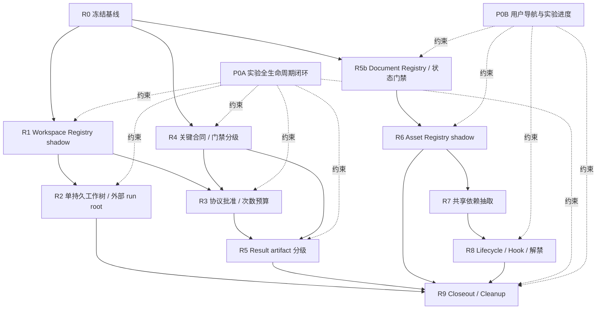

# PFMval 治理 v3 结构性重构审查包

> document role: `refactor-framework-and-index`
> review package revision: `003`
> lifecycle: `pending_review`
> state scope: `workflow_governance_v3_refactor_review`
> authorization: `DIR-20260726-002`, `DIR-20260726-003`, `DIR-20260726-004`, `DIR-20260726-005`
> implementation status: `framework_landed_modules_pending_review_code_pending`
> audit baseline: code `main@a96bac88`
> prohibition: 本审查包及其模块不是服务器执行、训练、结果接纳、资产迁移、目录解禁或清理批准。

## 0. 本文件的职责

本文件是结构性重构的唯一总控审查包，只维护：

- 重构目标、架构、固定边界和统一流程；
- P0 横向验收合同；
- 各大环节的依赖、顺序、状态和入口；
- 统一阶段模板、变更协议和总体验收；
- 跨模块已决事项与仍需用户判断的事项。

具体 schema 字段、影响面、实施步骤、风险、测试、退出条件和回退必须维护在
对应独立模块中，不再堆回本文件。

后续用户需求可以：

1. 补充现有模块并提升其 `module revision`；
2. 新增横向验收模块；
3. 新增 R10、R11 等大环节。

已有 P0/R 编号永久保留，不因插入新需求而重排。每次补充都必须更新本文件
的模块索引与依赖关系，并通过 Directive、Document Registry 和状态校验。

## 1. 审查目标

本轮重构需要最终解决：

1. 实验注册、代码、校验、Gitee 同步、排障、训练、回传、登记和关闭使用
   一套可执行闭环，Agent 不再每次自行设计。
2. 一个 experiment 在服务器只保留一个永久 W 工作树；attempt 不新建
   worktree，输出位于工作树外。
3. 正式批准前默认询问实际结果性执行次数；E1 简单工程适配可在关键合同
   不变、留痕和测试条件下免重复批准。
4. 只对关键实验合同、实际输入和结论承载结果严格校验。
5. 建立 Workspace/Asset Registry，逐步完成 pre-MPP 退役、共享依赖抽取和
   分级解禁。
6. Agent 规则、用户审阅学习材料和共享证据层清楚分区，但只使用一套事实源。
7. 用户拥有 tracked 仓库导航和与 Experiment Registry 绑定的简洁实验进度表。

## 2. 固定架构

### 2.1 三层职责

| 层 | 负责 | 不得负责 |
|---|---|---|
| Skill | 识别任务、读取事实、询问用户、路由、解释 | 直接批准、写 Registry、删除资产 |
| CLI | schema、状态机、Registry/manifest 写入、可审计副作用 | 任意 shell、隐式科研决策 |
| Hook | 毫秒级确定性提醒和路径/命令防护 | 接纳结果、写状态、迁移 lifecycle、清理 |

### 2.2 事实与视图

```text
Machine-readable sources
├─ Current State / Directives
├─ Experiment / Document / Workspace / Asset Registry
├─ job / approval / result / manifest
└─ Git + registered external asset evidence
        │
        ├─ Agent full operational views
        └─ User navigation / concise progress / reports
```

派生视图不得反向覆盖事实源。用户视图与 Agent 视图可以使用不同展示粒度，
但必须指向同一 ID、状态和结果。

### 2.3 身份边界

| 身份 | 含义 |
|---|---|
| `experiment_id` | 一个科研问题/大实验的稳定身份 |
| `workspace_id` | `W###`，永久不复用 |
| `protocol_revision` | 关键实验合同 revision |
| `attempt_id` / `job_id` | 协议内的一次具体执行 |
| `run_units` | 一次 job 内真实独立拟合数量 |
| `result_id` | 一次 attempt 的回传与导入身份 |

这些身份不得互相替代。

## 3. P0 横向硬验收

P0 是贯穿多个 R 阶段的验收合同，不是第三套实现入口。

| ID | 审查模块 | 必须解决 | 功能验收 |
|---|---|---|---|
| P0A | [实验全生命周期可执行闭环](workflow_governance_v3_refactor/P0A_experiment_lifecycle_closure.md) | Agent 无需临时拼装实验流程 | 注册到 close preview 的 CLI happy path、异常恢复与幂等测试 |
| P0B | [用户仓库导航与实验进度双视图](workflow_governance_v3_refactor/P0B_user_views_and_navigation.md) | 用户能快速定位文件、看懂实验进展 | tracked 导航、Registry 生成的简洁进度、current/history 分区与一致性测试 |

门禁规则：

- 在任何 R 阶段从 `pending_review` 转入实际实现前，P0A/P0B 中与该阶段有关
  的接口、输出和测试必须已审查。
- 单个 R 阶段通过，不代表 P0A/P0B 完成。
- 整套结构性重构不得在 P0A/P0B 功能验收未通过时宣称完成。

## 4. 分阶段模块与依赖



### 4.1 模块索引

| 模块 | 独立步骤文件 | 当前状态 | 核心输出 |
|---|---|---|---|
| R0 | [冻结基线与兼容样本](workflow_governance_v3_refactor/R0_baseline_and_compatibility.md) | pending_review | v1 fixture、inventory、已知 WARN |
| R1 | [Workspace Registry 只读 Shadow](workflow_governance_v3_refactor/R1_workspace_registry_shadow.md) | pending_review | W###、scan/status、locus guard |
| R2 | [实验级单持久工作树](workflow_governance_v3_refactor/R2_persistent_experiment_workspace.md) | pending_review | 外部 run root、单 worktree、lease |
| R3 | [协议批准与次数预算](workflow_governance_v3_refactor/R3_protocol_approval_and_run_budget.md) | pending_review | register、approval v2、run units、E1 |
| R4 | [关键合同与门禁分级](workflow_governance_v3_refactor/R4_critical_contract_and_gate_tiering.md) | pending_review | critical digest、E0–E3 |
| R5 | [结果 Artifact 分级](workflow_governance_v3_refactor/R5_result_artifact_tiering.md) | pending_review | envelope v2、quarantine、事务 import |
| R5b | [Document Registry 与状态门禁](workflow_governance_v3_refactor/R5b_document_registry_and_state_gates.md) | pending_review；已观测 verified_at churn | 父子审查关系、稳定生成、多写者收敛 |
| R6 | [Asset Registry 只读 Shadow](workflow_governance_v3_refactor/R6_asset_registry_shadow.md) | pending_review | asset schema、血缘候选 |
| R7 | [共享依赖抽取](workflow_governance_v3_refactor/R7_shared_dependency_extraction.md) | pending_review | 中性核心、兼容 shim |
| R8 | [生命周期迁移与分级解禁](workflow_governance_v3_refactor/R8_lifecycle_migration_and_unprotection.md) | pending_review | asset policy、shadow Hook、用户导航刷新 |
| R9 | [正式关闭与 Cleanup](workflow_governance_v3_refactor/R9_closeout_and_cleanup.md) | pending_review | close preview、精确批准、tombstone |

## 5. 高层影响面

| 区域 | 目标变化 | 主要模块 | 最高风险 |
|---|---|---|---|
| `deploy/pfmval_ops.py` | 唯一实验生命周期 CLI | P0A、R1–R5、R9 | 多写者、任意命令、状态竞态 |
| job/result schema | v1 双读、新写 v2 | R3–R5 | 兼容破坏、批准放宽 |
| 工作树/launcher | per-job → per-experiment W | R1–R2 | dirty 污染、并发、路径漂移 |
| Gitee 往返 | exact ref/SHA、单写者、quarantine | P0A、R2、R5 | 覆盖 ref、重复训练 |
| 状态/文档生成 | 原子 Registry + 双视图 | P0B、R5、R5b | 用户视图与事实分叉 |
| 资产与路径 | shadow inventory → policy | R6–R8 | 误分类、误解禁 |
| protected dirs | 依赖抽取后分级维护 | R7–R8 | 数值漂移、提前解禁 |
| closeout | preview 与 execute 分离 | R9 | 误删工作树或外部资产 |

详细符号、字段、步骤和测试只在对应模块维护。

## 6. 统一重构流程

每个模块必须经过以下状态，不得跨越：

```text
pending_review
→ approved_design
→ implementation_authorized
→ tests_red
→ implementation
→ tests_green
→ shadow_or_compatibility
→ independent_audit
→ accepted / rejected / superseded
```

说明：

- `approved_design` 只批准设计，不等于代码实施授权。
- `tests_red` 证明测试能捕获目标缺口。
- `tests_green` 只证明被测试行为，不等于服务器或实验成功。
- 涉及服务器、训练、结果接纳、资产迁移、目录解禁或删除时，仍需精确独立
  用户批准。

### 6.1 每个模块固定模板

独立模块至少包含：

1. module metadata、revision、status、dependencies；
2. 目标、范围和明确不包含事项；
3. 当前实现证据与影响面；
4. 分步修改，每一步紧跟检验和通过条件；
5. 兼容迁移策略；
6. 风险与逐步回退；
7. 产生的证据和最终验收；
8. 用户待决项；
9. append-only 补充记录。

## 7. 推荐审批与实施顺序

1. 审查 P0A、P0B 的接口和验收，不实施服务器行为。
2. 实施并审查 R0。
3. 实施 R1 shadow；不得创建/删除 worktree。
4. 先完成 R2 的外部 run root，再启用单持久工作树。
5. R4 extractor 可与 R3 schema 设计并行，但 R3 enforcement 必须等待 R4。
6. 实施 R5 与 R5b，先保证事务和生成视图一致。
7. 实施 R6 shadow；至少观察一轮。
8. 实施 R7，确认现役依赖迁出。
9. 经用户逐项批准后实施 R8。
10. 最后审查 R9；preview 和 execute 分别批准。

任何阶段失败或用户未审查，停止在该阶段，不为“完成整套重构”跨越门禁。

## 8. 需求补充协议

后续新增需求按以下方式落盘：

1. 判断是跨阶段验收、现有阶段补充还是新大环节。
2. 用户改变方案、优先级或安全边界时先追加 directive。
3. 跨阶段要求新增/修订 P 模块；现有环节只修订对应 R 文件；新环节追加
   R10+。
4. 在模块“补充记录”追加日期、directive、原因、影响步骤和新验证。
5. 更新本文件的模块索引、依赖图和状态。
6. 将新模块登记为 `pending_plan_reviews`，运行 `docs scan --write` 和
   `state sync`。
7. pending review 不得自动升级为 active/normative。
8. 不通过聊天摘要、README 或 Dashboard 代替上述记录。

## 9. 全局不可变量

- Gitee 是本地与服务器唯一 active 同步通道。
- 禁止 SSH、SCP、HTTP 远程命令和 Tunnel。
- 一个 experiment 对应一个永久 W；W 编号不复用。
- 本地是 canonical code writer；服务器只返回 adaptation/result。
- 不自动 pull、merge、rebase、force push 或全局 worktree prune。
- attempt 输出位于注册的工作树外。
- 正式训练必须有显式批准和剩余次数预算。
- 关键合同变化必须重新批准。
- result 返回不等于 import，import 不等于不同协议的接纳。
- historical 不等于 deleted。
- Hook 不写 Registry、不批准、不接纳、不删除。
- 本审查包不授权真实服务器、训练、结果、迁移、解禁或 cleanup。

## 10. Agent、用户与共享资产框架

### Agent / 项目板块

- `AGENTS.md`
- `.agents/skills/`
- `project_state/`
- `configs/`
- `automation/`
- `deploy/`
- `scripts/`
- `tests/`

保存固定规则、schema、CLI、Registry、manifest、测试和生成逻辑。

### 用户板块

- tracked 仓库导航；
- `01_指南与解读/` 中 active 方案、学习卡、分析与维护手册；
- `02_组会汇报/`。

### 共享证据层

- `experiments/`
- `automation/results/`
- MPP manifests；
- 经验证结果包与受控服务器资产记录。

用户和 Agent 视图只引用共享事实，不复制新的实验事实。

## 11. 已决事项

1. `.agents/skills/` 是 canonical Skill 源。
2. `.claude/skills/` 保留同名 tracked 薄 adapter。
3. W 编号永久不复用；新对话显式绑定。
4. 一个 experiment 一个服务器持久工作树。
5. 默认询问实际结果性执行次数。
6. 严格限定 E1 适配可免重复批准。
7. 关键合同、实际输入和结论结果保持严格指纹。
8. 总控包只维护框架；每个大环节维护独立文件。
9. P0A/P0B 是整套重构硬验收。

## 12. 暂缓与待用户审查

暂缓：

- workspace/job/result/asset schema 的真实代码改造；
- 现有 worktree 自动编号、收养、迁移或删除；
- asset registry 实际扫描；
- pre-MPP lifecycle 迁移；
- protected dirs 解禁；
- 真实服务器实验、结果接纳和 cleanup。

跨模块待审查：

- [ ] `EXPERIMENT_STARTED` 机器事件和 E1 allowlist。
- [ ] 用户根导航与简洁实验进度文件的最终名称/路径。
- [ ] parent review `module_paths` schema，或继续使用独立 pending review ID。
- [ ] 2026-07-06 pre-repair MPP1–5 legacy accepted 结果的长期分类。
- [ ] ignored checkpoint 的 hash 策略。
- [ ] `histogene/egnv1/egnv2` 依赖抽取后的维护权限。
- [ ] 任何物理归档/删除仍须单独批准。

## 13. 总体验收

只有全部满足才能把整套重构提交为用户验收候选：

- P0A 端到端闭环通过，Agent 正常路径无需临时设计命令。
- P0B tracked 导航与 Registry 生成进度表通过一致性测试。
- R0–R9 各自退出条件满足或被明确标记为不适用。
- v1 job/result 可只读验证和 import。
- Workspace/Asset/Document/Experiment Registry 不复制职责。
- local/server 单写者和 Gitee-only 边界保持。
- 无未授权服务器操作、训练、结果接纳、资产迁移、解禁或删除。
- 独立 `pfmval-audit` 给出相应阶段的有界结论。

## 14. 变更记录

| 日期 | Revision | Directive | 变化 |
|---|---:|---|---|
| 2026-07-26 | 001 | DIR-20260726-002/003 | 初版影响面、R0–R9 步骤与编号工作树协议 |
| 2026-07-26 | 002 | DIR-20260726-004 | 改为总控框架；新增 P0A/P0B；R0–R9 拆为独立可扩展模块 |
| 2026-07-26 | 003 | DIR-20260726-005 | 补充科研灵活性审查、五类后续工作流和“优先适配成熟开源方案”策略 |

详细服务器状态机、单写者、冲突恢复和 W 编号规则继续以
`project_state/plans/gitee_numbered_workspace_protocol_v001_20260726.md`
作为已批准设计基线；实现仍须遵守各模块门禁。

## 15. 科研灵活性审查补充

### 15.1 有界结论

结论为 **CONDITIONAL GO**：现有审查包可以继续供用户审查，但不宜原样进入
代码重构。正式训练、服务器往返、结果接纳和受保护资产必须保持严格治理；
假设形成、本地复算、低成本探索、结果解释和日常项目事实不应套用同等重量
的批准、Registry 和关闭流程，否则会增加科研试错摩擦。

P0A 已覆盖实验执行与证据链的主要骨架，但尚未完整覆盖：

```text
问题/假设
→ 低成本探索或复算
→ 是否晋级为候选实验
→ 正式实验
→ 结果解释
→ 后继假设 / 追加验证 / 停止
```

因此后续设计必须采用“渐进式形式化”：想法与解释只做轻记录；本地非证据
探索留最小可复现记录；候选实验明确晋级理由；只有可产生项目结论的正式实验
进入完整批准、执行、导入和关闭闭环。

### 15.2 后续待设计的五类工作流

1. **非实验项目事实维护**：目标、分工、任务、队友成果和沟通结论由用户口述，
   Agent 做冲突检查、变更预览和准确更新；不得写入 Experiment Registry。
2. **长期文档沉淀**：组会材料控制为 500 字以内正文、2–3 张图和关键数据表；
   另维护每周重要结论与探索路径文档。飞书 CLI 后续只作为可校验备份出口，
   本轮不实施。
3. **学习指南接口**：本轮仅保留生成、更新、关联源码/实验事实、校验链接和
   未来云备份的接口；不开展内容体系重构。
4. **文档与约束生命周期**：单独建立 review 工作流，并与实验事件挂钩；
   区分内容是否过时（freshness）和是否仍适用（lifecycle），修复或显式弃置，
   不自动删除。
5. **工作流发现与演化**：用户主动触发常用操作检索，候选工作流必须经过
   `candidate → review → active → revise/merge/deprecate`；高风险流程不得自动启用。

候选落点为 P0C“科研推理闭环”以及 R10–R13，但编号、边界和依赖须在外部方案
调研后再定，不在本补充中提前固化。

### 15.3 方案复用原则与当前边界

- 优先检索、比较和适配成熟开源科研工作流、实验追踪、可复现文档与研究对象
  元数据方案；仅对缺失能力做本地补充。
- 外部方案只作为设计输入，不因列入调研而自动成为依赖或事实源。
- 引入任何框架前必须比较：维护活跃度、Windows/本地优先适配、与 Git/Gitee
  及现有 Registry 的职责重叠、迁移成本、离线可用性和退出成本。
- 本次落盘只记录审查结论与调研策略，不批准新增模块实施、服务器操作、训练、
  结果接纳、资产迁移、目录解禁或清理。
