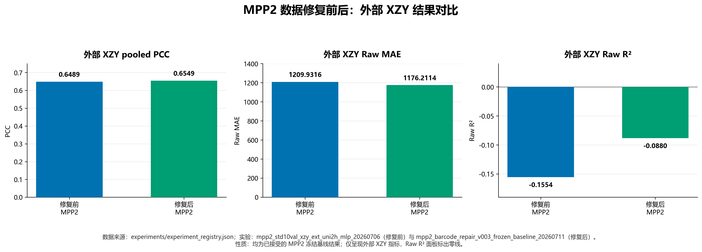
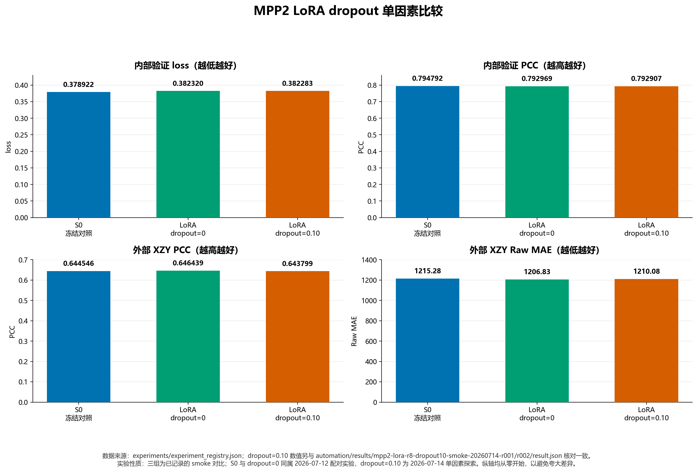
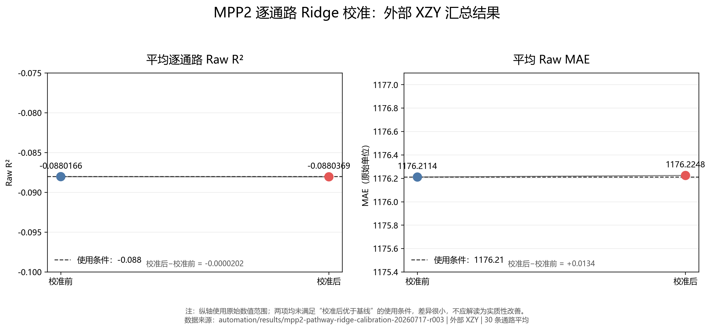
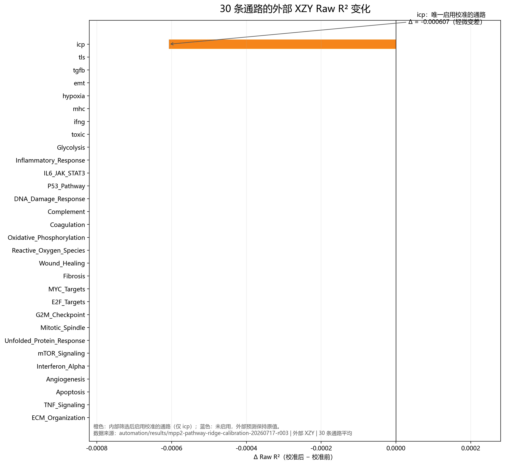
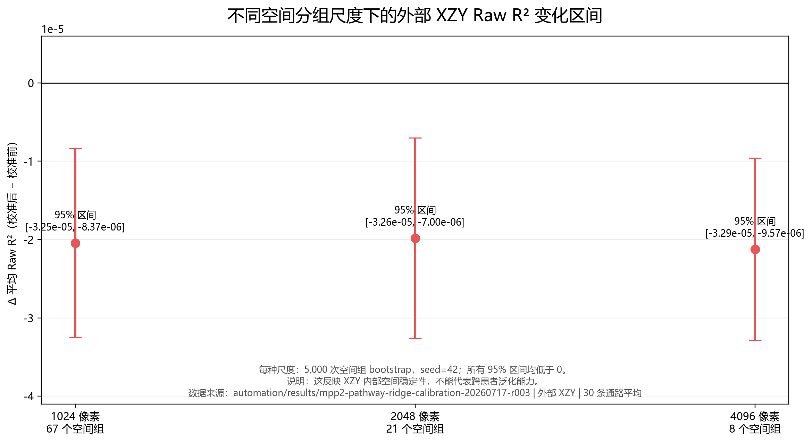
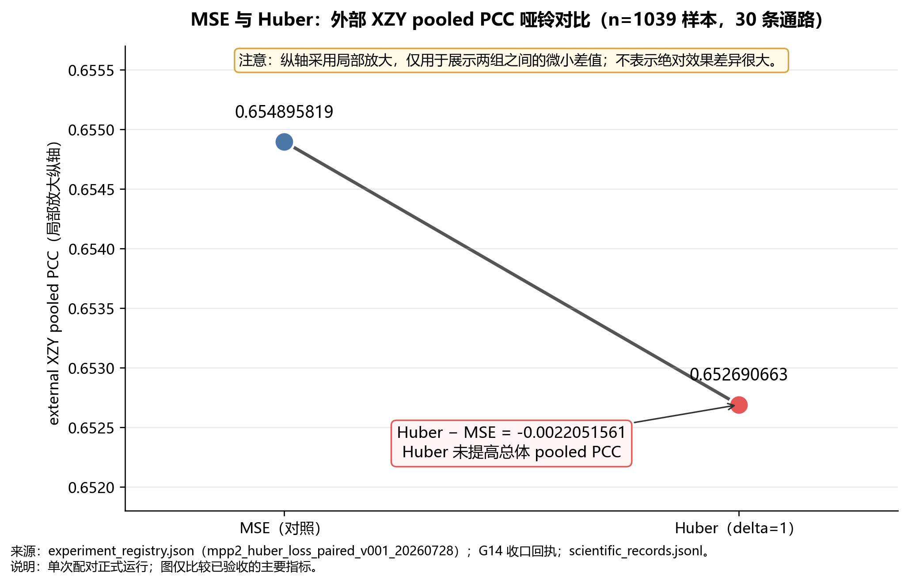
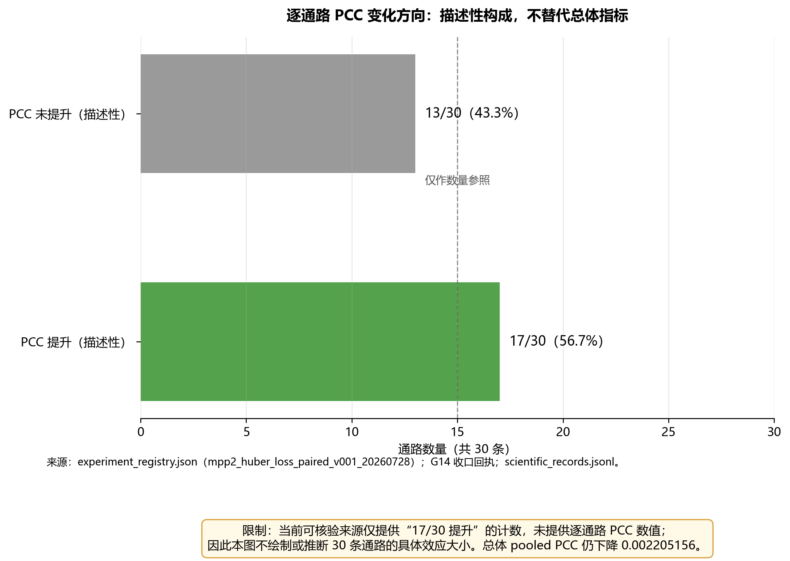
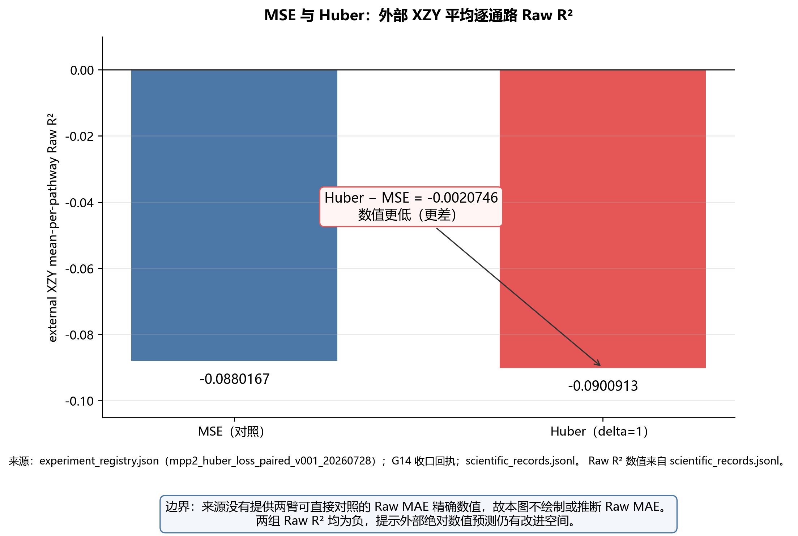

# qzs：MPP2 基线修复与后续实验进展

> 负责人：qzs  
> 所属板块：Phase 2 / Phase 3 接口准备 / 训练数据  
> 审核状态：用户已明确批准  
> 批准日期：2026-07-31  
> 内容范围：MPP2 数据修复、冻结基线、LoRA、LoRA dropout、Ridge 校准、MSE/Huber 损失比较

## 一、当前总体结论

目前可以作为后续比较依据的是修复数据后的 MPP2 冻结模型。LoRA rank=8、LoRA dropout=0.10、逐通路 Ridge 校准和 Huber 损失均完成了相应实验，但没有证明其效果优于这一基线，因此没有继续扩大相同方案的训练规模，也没有把这些方案作为 Phase 3 的正式输入模型。

| 项目 | 主要目的 | 实际结果 | 后续处理 |
|---|---|---|---|
| MPP2 修复基线 | 消除跨患者标签错配并重新建立基线 | 外部 XZY 的 PCC、MAE、R² 均优于修复前结果 | 作为当前比较基线 |
| LoRA rank=8 | 判断轻量微调是否值得正式训练 | 工程运行正常，但提升幅度不足且内部验证变差 | 不开展相同配置的正式训练 |
| LoRA dropout=0.10 | 判断增加 dropout 能否缓解过拟合 | 内部验证没有优于冻结对照 | 不继续调整该配置 |
| 逐通路 Ridge 校准 | 改善通路分数的绝对数值准确度 | 内部数据改善，但外部 XZY 的 R² 和 MAE 轻微变差 | 不提供给 Phase 3 |
| Huber 损失 | 判断降低极端误差影响能否提升外部相关性 | 外部 PCC 低于 MSE | 保留 MSE 基线，不重复相同实验 |

---

## 二、MPP2 数据修复与冻结基线

**实验完成日期：2026年7月11日。** 以最终一次成功结果生成时间为准；[结果证据](../../automation/results/mpp2-repair-v003-frozen-20260711-r002/attempt-003/result.json)。

<details>
<summary><strong>1. 采用的方案</strong></summary>

早期标准化标签中存在跨患者 barcode 对应关系混淆的风险。同一个 barcode 必须与正确患者、正确 patch 一一对应，否则图像特征可能与其他患者的通路标签错误配对，导致训练和评估结果失真。

本次修复按以下顺序处理：

1. 逐患者读取原始 ssGSEA 通路分数。
2. 检查每名患者内部是否存在空 barcode 或重复 barcode。
3. 检查数据划分表中的“患者＋patch”组合是否唯一。
4. 只使用训练集计算各通路的均值和标准差。
5. 使用同一组训练集参数转换训练集、内部验证集和外部 XZY。
6. 重新训练冻结 UNI2-h 特征加两层 MLP 的 MPP2 基线。

</details>

<details>
<summary><strong>2. 比较条件、实际结果与下一步</strong></summary>

在继续开展 LoRA 前，事先要求修复后的 MPP2 基线不能相对旧结果明显恶化：

- 外部 PCC 下降不能达到 `0.05`；
- Raw MAE 增加不能达到 `10%`；
- Raw R² 下降不能达到 `0.10`。

实际结果不仅没有恶化，三项指标均有所改善：

| 指标 | 修复前 MPP2 | 修复后 MPP2 | 变化 |
|---|---:|---:|---:|
| 外部 XZY pooled PCC | 0.6489 | 0.6549 | +0.0060 |
| 外部 XZY Raw MAE | 1209.9316 | 1176.2114 | -33.7202 |
| 外部 XZY Raw R² | -0.1554 | -0.0880 | +0.0674 |

因此，修复后的模型满足“数据对应关系正确，并且模型表现没有因修复而明显下降”的条件。后续 LoRA、Ridge 和 Huber 实验均以该模型及其数据版本作为比较依据。

限制：外部 Raw R² 仍为负值，说明绝对数值预测仍存在明显改进空间，不能把该基线表述为已经解决外部泛化问题。

</details>

<details>
<summary><strong>3. 实现代码与中英文对照伪代码</strong></summary>

实现代码：

- [患者与 barcode 一一对应检查](../../scripts/rebuild_zscore_from_manifest.py#L97)
- [只在训练集上计算 z-score 参数](../../scripts/rebuild_zscore_from_manifest.py#L233)
- [将训练集参数应用到其他数据](../../scripts/rebuild_zscore_from_manifest.py#L254)
- [MPP2 两层 MLP 预测头](../../train_mpp_uni2h_mlp.py#L106)
- [模型单轮训练过程](../../train_mpp_uni2h_mlp.py#L124)

中文逻辑伪代码：

```text
读取数据划分表

对于每名患者：
    读取原始 ssGSEA 标签
    统一 barcode 格式
    如果存在空 barcode 或重复 barcode：
        停止处理并报告患者和冲突记录

检查数据划分表中的“患者 + patch”组合是否唯一

只用训练数据计算每条通路的均值和标准差
使用相同参数转换训练集、内部验证集和外部 XZY

冻结 UNI2-h 图像特征
建立 1536 → 1024 → 30 的 MLP 预测头
在内部验证集上选择最佳轮次
选择完成后评估一次外部 XZY
```

English pseudocode（函数名和变量名与实现一致）：

```python
manifest = pd.read_csv(manifest_path)
validate_split_manifest(manifest, manifest_path)

for patient in TRAIN_PATIENTS:
    df, p_cols = load_raw_label(label_csv, patient)
    validate_patient_barcode_one_to_one(df, patient, label_csv)

zscore_params = fit_zscore_on_train(train_all, pathway_cols)
train_z = apply_zscore(train_all, pathway_cols, zscore_params)
val_z = {
    patient: apply_zscore(frame, pathway_cols, zscore_params)
    for patient, frame in per_patient_val_raw.items()
}
ext_z = apply_zscore(ext_df, pathway_cols, zscore_params)

model = MPPMLPHead(in_dim=1536, hidden=1024, out_dim=30, dropout=0.3)
criterion = nn.MSELoss()

for features, targets in loader:
    preds = model(features)
    loss = criterion(preds, targets)
    optimizer.zero_grad()
    loss.backward()
    optimizer.step()
```

</details>

<details>
<summary><strong>4. 图表与数据来源</strong></summary>



图表同时展示 PCC、Raw MAE 和 Raw R²，避免只看相关性而忽略绝对数值误差。

数据来源：

- [实验结果登记表](../../experiments/experiment_registry.json)
- [修复后基线指标](../../automation/results/mpp2-repair-v003-frozen-20260711-r002/attempt-003/metrics.json)

</details>

---

## 三、LoRA rank=8 配对冒烟实验

**实验完成日期：2026年7月12日。** 以成功结果生成时间为准；[结果证据](../../automation/results/mpp2-paired-s1-lora-r8-smoke-20260712-r002/r001/result.json)。

<details>
<summary><strong>1. 采用的方案</strong></summary>

本实验比较两组：

- S0：冻结 UNI2-h，只继续训练原有 MLP 预测头；
- S1：在相同 MLP 预测头基础上，为 UNI2-h 注意力层加入 LoRA rank=8、alpha=16 的低秩参数。

两组使用相同数据、相同初始预测头、相同随机种子和相同训练轮数，目的是减少无关因素对比较结果的影响。

LoRA 共增加 `1,769,472` 个低秩参数，总可训练参数为 `3,374,110`。峰值显存约 `4.24 GiB`，说明该方案能够在现有服务器上正常运行。

</details>

<details>
<summary><strong>2. 比较条件、实际结果与下一步</strong></summary>

事先约定：只有 LoRA 的外部 XZY pooled PCC 达到 `0.6749`，即至少比修复基线 `0.6549` 提高 `0.02`，才值得开展相同配置的正式训练。同时检查内部验证结果是否与外部结果方向一致。

| 指标 | S0 冻结对照 | S1 LoRA rank=8 | S1 相对 S0 |
|---|---:|---:|---:|
| 内部验证 loss | 0.378922 | 0.382320 | LoRA 更差 |
| 内部验证 PCC | 0.794792 | 0.792969 | LoRA 更差 |
| 外部 XZY PCC | 0.644546 | 0.646439 | +0.001893 |
| 外部 Raw MAE | 1215.284 | 1206.826 | -8.458 |
| 外部 Raw R² | -0.144913 | -0.135891 | +0.009022 |

虽然 LoRA 相对同期冻结对照的外部 PCC 增加了 `0.001893`，但：

- `0.646439` 没有达到 `0.6749`；
- 两组都没有超过修复基线 `0.6549`；
- LoRA 的内部验证 loss 更高、PCC 更低；
- 内部验证的 6 名患者中，6/6 患者的 MAE 均变差；
- 外部 30 条通路中只有 4 条 PCC 改善，26 条下降。

因此，该配置证明了 LoRA 可以正常训练，但没有证明它能稳定提高预测效果。下一步没有开展相同配置的正式训练、多随机种子训练或大规模参数搜索。

</details>

<details>
<summary><strong>3. 实现代码与中英文对照伪代码</strong></summary>

实现代码：

- [LoRA 参数注入](../../model_mpp_uni2h_lora.py#L67)
- [限定优化器只更新 MLP 与 LoRA 参数](../../model_mpp_uni2h_lora.py#L93)
- [构建冻结对照和 LoRA 模型](../../train_mpp_uni2h_lora.py#L347)
- [根据内部验证 loss 选择最佳轮次](../../train_mpp_uni2h_lora.py#L407)
- [完成内部选择后再评估 XZY](../../train_mpp_uni2h_lora.py#L455)

中文逻辑伪代码：

```text
加载同一个修复数据版本和同一个 MPP2 epoch-15 预测头

S0：冻结 UNI2-h，只允许 MLP 预测头更新
S1：冻结 UNI2-h 原始参数，在注意力层加入 LoRA

两组都使用随机种子 42，最多训练 3 轮
每轮计算内部验证 loss，保存内部验证 loss 最低的模型
内部模型选择完成后，各评估一次外部 XZY

如果 LoRA 外部 PCC 未达到 0.6749：
    不开展相同配置的正式训练
```

English pseudocode（函数名和变量名与实现一致）：

```python
if args.mode == "lora":
    lora_parameter_count = configure_p0_lora(
        backbone,
        rank=args.lora_rank,
        alpha=args.lora_alpha,
        dropout=args.lora_dropout,
    )
else:
    freeze_all_parameters(backbone)
    lora_parameter_count = 0

model = OnlineMPPModel(
    backbone=backbone,
    feature_dim=feature_dim,
    hidden_dim=args.hidden_dim,
    output_dim=len(target_cols),
    dropout=args.dropout,
).to(device)

optimizer = build_paired_optimizer(
    model,
    mode=args.mode,
    head_lr=args.head_lr,
    lora_lr=args.lora_lr,
    weight_decay=args.weight_decay,
)

best_val_loss = float("inf")
for epoch in range(1, args.num_epochs + 1):
    train_loss, train_metrics = train_one_epoch(...)
    val_loss, val_metrics, _, _ = evaluate(...)
    is_best = val_loss < best_val_loss - args.min_delta
    if is_best:
        best_val_loss = val_loss
        best_epoch = epoch
        best_state = {key: value.detach().cpu().clone() for key, value in model.state_dict().items() if key in trainable_names}

model.load_state_dict(best_state, strict=False)
external_loss, external_metrics, external_predictions, external_labels = evaluate(
    model, external_loader, criterion, device, amp_enabled
)
```

</details>

<details>
<summary><strong>4. 图表与数据来源</strong></summary>


数据来源：

- [配对实验复核记录](../../automation/logs/mpp2_paired_smoke_review_20260712.md)
- [绘图数据汇总](可视化图表/02_LoRA配对/plot_data_summary.csv)

</details>

---

## 四、LoRA dropout=0.10 单因素实验

**实验完成日期：2026年7月14日。** 以成功结果生成时间为准；[结果证据](../../automation/results/mpp2-lora-r8-dropout10-smoke-20260714-r001/r002/result.json)。

<details>
<summary><strong>1. 采用的方案</strong></summary>

LoRA rank=8 的训练在第 1 个 epoch 达到最佳内部验证结果，随后训练误差继续下降、验证误差上升，出现早期过拟合迹象。

因此单独测试把 LoRA dropout 从 `0.0` 增加到 `0.10`。其余设置保持不变：LoRA rank=8、alpha=16、随机种子=42、相同数据、相同预测头、最多 3 个 epoch，且外部 XZY 不参与模型轮次选择。

</details>

<details>
<summary><strong>2. 比较条件、实际结果与下一步</strong></summary>

本实验首先比较内部验证结果。只有 dropout=0.10 至少不比同期冻结对照差，才有理由继续研究。

| 指标 | S0 冻结对照 | LoRA dropout=0.10 | 结果 |
|---|---:|---:|---|
| 内部验证 loss | 0.378922 | 0.382283 | dropout=0.10 更差 |
| 内部验证 PCC | 0.794792 | 0.792907 | dropout=0.10 更差 |
| 外部 XZY PCC | 0.644546 | 0.643799 | dropout=0.10 更差 |

增加 dropout 后，内部验证 loss 和 PCC 均未超过冻结对照，外部 PCC 也没有改善。因此没有继续重复该实验，也没有进一步调整 rank、学习率、epoch 或 dropout 数值。

</details>

<details>
<summary><strong>3. 实现代码与中英文对照伪代码</strong></summary>

实现代码：

- [LoRA dropout 参数入口](../../train_mpp_uni2h_lora.py#L86)
- [将 dropout 传入 LoRA 层](../../train_mpp_uni2h_lora.py#L347)
- [LoRA 层实际注入实现](../../model_mpp_uni2h_lora.py#L67)
- [dropout=0.10 实验结果](../../automation/results/mpp2-lora-r8-dropout10-smoke-20260714-r001/r002/result.json)

中文逻辑伪代码：

```text
固定数据、划分、模型、预测头、rank、alpha、随机种子和训练轮数
唯一改变：LoRA dropout 从 0.0 增加到 0.10

只根据内部验证 loss 保存最佳模型
比较 dropout=0.10 与冻结对照的内部验证 loss 和 PCC

如果内部验证没有改善：
    停止该配置
    不根据外部 XZY 继续选择 dropout
```

English pseudocode（参数名和变量名与实现一致）：

```python
args.lora_rank = 8
args.lora_alpha = 16.0
args.lora_dropout = 0.10
args.seed = 42
args.num_epochs = 3

lora_parameter_count = configure_p0_lora(
    backbone,
    rank=args.lora_rank,
    alpha=args.lora_alpha,
    dropout=args.lora_dropout,
)

best_val_loss = float("inf")
for epoch in range(1, args.num_epochs + 1):
    train_loss, train_metrics = train_one_epoch(...)
    val_loss, val_metrics, _, _ = evaluate(...)
    is_best = val_loss < best_val_loss - args.min_delta
    if is_best:
        best_val_loss = val_loss
        best_epoch = epoch
        best_state = {key: value.detach().cpu().clone() for key, value in model.state_dict().items() if key in trainable_names}

model.load_state_dict(best_state, strict=False)
external_loss, external_metrics, external_predictions, external_labels = evaluate(...)
```

</details>

<details>
<summary><strong>4. 图表与数据来源</strong></summary>



图中比较内部验证 loss、内部验证 PCC、外部 PCC 和 Raw MAE。内部验证指标用于决定是否继续研究，外部 XZY 仅用于完成固定方案后的描述性评估。

数据来源：

- [S0/S1 实验登记](../../experiments/experiment_registry.json)
- [dropout=0.10 实验结果](../../automation/results/mpp2-lora-r8-dropout10-smoke-20260714-r001/r002/result.json)

</details>

---

## 五、MPP2 逐通路 Ridge 校准

**实验完成日期：2026年7月18日（北京时间）。** 结果文件记录的生成时间为 `2026-07-17T16:05:16+00:00`，换算为北京时间是 2026年7月18日 00:05；[结果证据](../../automation/results/mpp2-pathway-ridge-calibration-20260717-r003/result.json)。

<details>
<summary><strong>1. 采用的方案</strong></summary>

该方案不重新训练 UNI2-h，而是在已有 MPP2 输出之后，对每条通路拟合一个正斜率仿射变换：

```text
校准后结果 = 原预测值 × 斜率 k + 截距 b
```

先使用 6 名内部验证患者进行患者留一验证，为每条通路判断校准是否改善内部表现。随后固定全部通路的 `k`、`b` 和启用列表并保存校准器。只有在这些内容固定后才读取外部 XZY，并且只评估一次。

</details>

<details>
<summary><strong>2. 比较条件、实际结果与下一步</strong></summary>

内部数据方面：

- 6 次患者留一验证都选择 `lambda=10`；
- 患者平衡 z-MSE 没有变差；
- 平均逐通路 Raw R² 有改善；
- 最终只有 `icp` 一条通路被启用。

这些结果说明校准方法可以继续进行一次外部评估。

外部 XZY 需要同时满足：

1. 平均逐通路 Raw R² 大于 `-0.088`；
2. 平均 Raw MAE 小于 `1176.2114`；
3. 校准不能人为改变 PCC；
4. 至少 18/30 条通路的 Raw R² 不得变差。

| 条件 | 实际值 | 是否满足 |
|---|---:|---|
| Raw R² > -0.088 | -0.0880369 | 未满足 |
| Raw MAE < 1176.2114 | 1176.2248 | 未满足 |
| PCC 保持不变 | 最大差约 `1.11×10⁻¹⁶` | 已满足 |
| 至少18条通路R²不变差 | 29/30 | 已满足 |

最关键的 Raw R² 和 Raw MAE 都轻微向错误方向变化，空间重采样分析也没有发现稳定改善。因此没有生成供 Phase 3 使用的正式校准模型包。该实验被保留为“已完成，但效果不满足使用条件”的负面结果。

</details>

<details>
<summary><strong>3. 实现代码与中英文对照伪代码</strong></summary>

实现代码：

- [Ridge 校准主流程](../../scripts/fit_mpp2_pathway_ridge_calibration.py#L176)
- [只读取内部验证患者](../../scripts/fit_mpp2_pathway_ridge_calibration.py#L199)
- [患者留一验证与最终校准器拟合](../../scripts/fit_mpp2_pathway_ridge_calibration.py#L246)
- [固定校准器后首次读取 XZY](../../scripts/fit_mpp2_pathway_ridge_calibration.py#L316)
- [外部结果判断与模型包生成条件](../../scripts/fit_mpp2_pathway_ridge_calibration.py#L350)

中文逻辑伪代码：

```text
加载 MPP2 冻结基线，只读取 6 名内部验证患者

对每条通路进行患者留一验证并选择 lambda
根据内部结果决定启用校准，或保持原预测不变
固定最终 lambda、每条通路的 k/b、启用列表和校准器校验值

固定完成后才读取 XZY
计算 Raw R²、Raw MAE、PCC、逐通路变化和空间区间

只有四项外部条件同时满足才生成 Phase 3 模型包
否则不生成模型包，并保留未满足的具体条件
```

English pseudocode（变量名与实现一致）：

```python
nested = nested_lopo(truth, base_prediction, patients)
mask, decisions = pathway_decisions(
    truth,
    base_prediction,
    nested["oof_prediction"],
    patients,
    means,
    stds,
    nested["slopes"],
)

final_lambda, final_selection = choose_lambda_one_se(...)
final_k, final_b, final_reasons = fit_all_pathways(
    truth,
    base_prediction,
    patients,
    final_lambda,
)
final_k[~mask] = 1.0
final_b[~mask] = 0.0

calibrator = {
    "final_lambda": final_lambda,
    "k": final_k.tolist(),
    "b": final_b.tolist(),
    "pathway_enabled_mask": mask.tolist(),
}
write_json(output / "calibrator.json", calibrator)
provenance["calibrator_sha256"] = sha256_file(output / "calibrator.json")

# The external dataset is created only after calibrator.json is frozen.
external = build_manifest_external(...)
external_prediction, external_truth, external_rows = predict_dataset(...)
calibrated_external = external_prediction * final_k + final_b

external_gate = {
    "mean_raw_r2_gt_minus_0_088": external_cal["mean_per_pathway_raw_r2"] > -0.088,
    "raw_mae_lt_1176_2114": external_cal["mean_raw_mae"] < 1176.2114,
    "mean_per_pathway_pcc_invariant": float(np.nanmax(np.abs(pcc_external_delta))) < 1e-10,
    "at_least_18_r2_nonworse": r2_nonworse >= 18,
}
external_gate["passed"] = bool(
    external_gate["mean_raw_r2_gt_minus_0_088"]
    and external_gate["raw_mae_lt_1176_2114"]
    and external_gate["mean_per_pathway_pcc_invariant"]
    and external_gate["at_least_18_r2_nonworse"]
)

if external_gate["passed"]:
    package = output / "mpp2_calibrated_raw_v001"
    package.mkdir()
```

注：`external_gate` 是真实代码中的变量名；正文已把其中每一项展开为具体可读条件。

</details>

<details>
<summary><strong>4. 图表与数据来源</strong></summary>







数据来源：[Ridge r003 完整结果目录](../../automation/results/mpp2-pathway-ridge-calibration-20260717-r003/)

</details>

---

## 六、MSE 与 Huber 损失比较

**实验完成日期：2026年7月29日。** 以配对实验科学结论关闭记录日期为准；[关闭记录](../../project_state/governance/G14_W001_paired_scientific_closeout_receipt_20260729.md)。

<details>
<summary><strong>1. 采用的方案</strong></summary>

本实验只改变训练损失函数：对照组使用 MSE，实验组使用 `Huber(delta=1)`。

两组保持相同的修复数据版本、训练和验证划分、随机种子、MLP 结构、学习率、batch size、epoch 上限、early stopping 和外部 XZY 评估方式。

Huber 的作用是减弱极端误差对训练梯度的影响。只有 Huber 的外部 XZY pooled PCC 高于 MSE，才能说明本次更换损失函数改善了主要评价指标。

</details>

<details>
<summary><strong>2. 比较条件、实际结果与下一步</strong></summary>

| 损失函数 | 外部 XZY pooled PCC |
|---|---:|
| MSE | 0.6548958191 |
| Huber(delta=1) | 0.6526906630 |
| Huber−MSE | -0.0022051561 |

Huber 的 PCC 比 MSE 低 `0.0022051561`，因此没有满足“更换损失函数后外部 PCC 应提高”的条件。

虽然 30 条通路中有 17 条的 PCC 上升，但这只是逐通路方向计数，不能抵消总体 pooled PCC 下降的结果。

当前预测文件还缺少可靠的 `sample_id` 和 `spatial_cluster_id`，因此不能按空间区域完成原计划的重复抽样分析。现有结果能够说明 Huber 没有提高总体 PCC，但不能给出完整的空间不确定性范围。

因此保留 MSE 作为当前基线，不重复相同 MSE/Huber 实验。如要尝试新的损失函数，需要提出不同的研究假设并重新设计实验。

</details>

<details>
<summary><strong>3. 实现代码与中英文对照伪代码</strong></summary>

实现代码：

- [MSE 与 Huber 损失函数选择](../../train_mpp_uni2h_mlp.py#L86)
- [训练时应用所选损失函数](../../train_mpp_uni2h_mlp.py#L124)
- [MSE 实验配置](../../automation/jobs/W001-A003/job.json)
- [Huber 实验配置](../../automation/jobs/W001-A004/job.json)
- [最终结果复核记录](../../project_state/governance/G14_W001_paired_scientific_closeout_receipt_20260729.md)

中文逻辑伪代码：

```text
固定数据、划分、模型、初始化、随机种子、优化器和评估方法

对照组使用 MSE 训练
实验组使用 delta=1 的 Huber 损失训练
两组分别根据内部验证选择最佳模型
选择完成后分别评估一次外部 XZY

如果 Huber pooled PCC 高于 MSE：
    说明 Huber 改善主要指标
否则：
    保留 MSE，不重复完全相同的实验
```

English pseudocode（函数名和变量名与实现一致）：

```python
metadata = resolve_loss_metadata(loss_type, huber_delta)
if metadata["loss_type"] == "mse":
    criterion = nn.MSELoss()
else:
    criterion = nn.HuberLoss(
        delta=float(metadata["delta"]),
        reduction="mean",
    )

for features, targets in loader:
    features = features.to(device, non_blocking=True)
    targets = targets.to(device, non_blocking=True)
    preds = model(features)
    loss = criterion(preds, targets)
    optimizer.zero_grad()
    loss.backward()
    optimizer.step()

control_value = 0.6548958191047396
treatment_value = 0.6526906629745176
delta = treatment_value - control_value

if delta > 0:
    conclusion = "Huber improved external XZY pooled PCC"
else:
    conclusion = "Keep MSE; do not repeat the identical comparison"
```

</details>

<details>
<summary><strong>4. 图表与数据来源</strong></summary>





第二张图只表示 17/30 与 13/30 的方向计数，不表示总体性能提高，也不表示统计显著。



第三张图只绘制项目中可核验的平均逐通路 Raw R²；由于没有同等证据边界下的两臂 Raw MAE 精确值，未绘制或推断 Raw MAE。

数据来源：

- [实验结果登记表](../../experiments/experiment_registry.json)
- [G14 最终结果复核](../../project_state/governance/G14_W001_paired_scientific_closeout_receipt_20260729.md)
- [科学结论记录](../../project_state/scientific_records.jsonl)

</details>

---

## 七、阅读时需要注意的结论边界

1. 修复后的 MPP2 是当前稳定比较基线，但外部 Raw R² 仍为负值，说明绝对数值预测仍有明显改进空间。
2. LoRA 已证明工程上可以运行，但没有证明当前配置能够稳定提高模型效果。
3. dropout=0.10 没有改善内部验证，因此没有继续围绕外部 XZY 调参。
4. Ridge 校准只在内部数据上表现较好，外部数据没有满足使用条件，因此不能交付 Phase 3。
5. Huber 损失没有提高总体外部 PCC，因此没有替代 MSE。
6. 2026-07-25 开展的强制 Ridge、无约束 Ridge、OLS 和少量 XZY 校准属于本地探索材料，目前没有作为长期稳定结论写入本记录。
