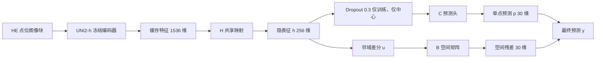
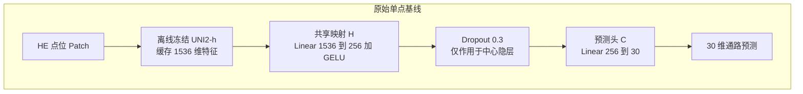
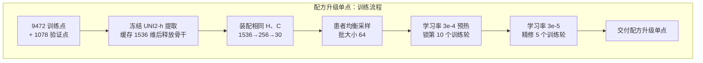
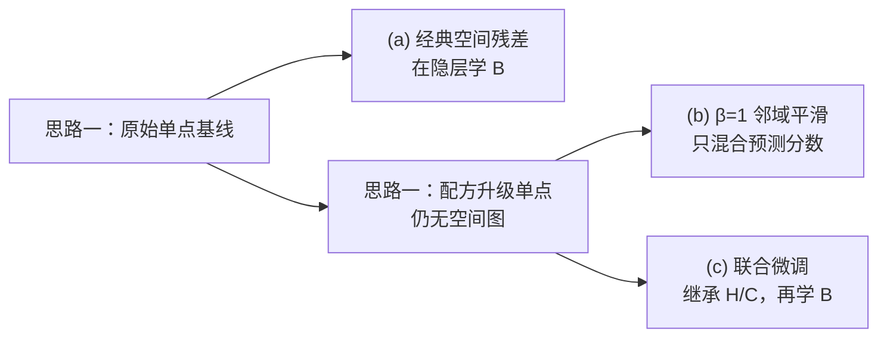
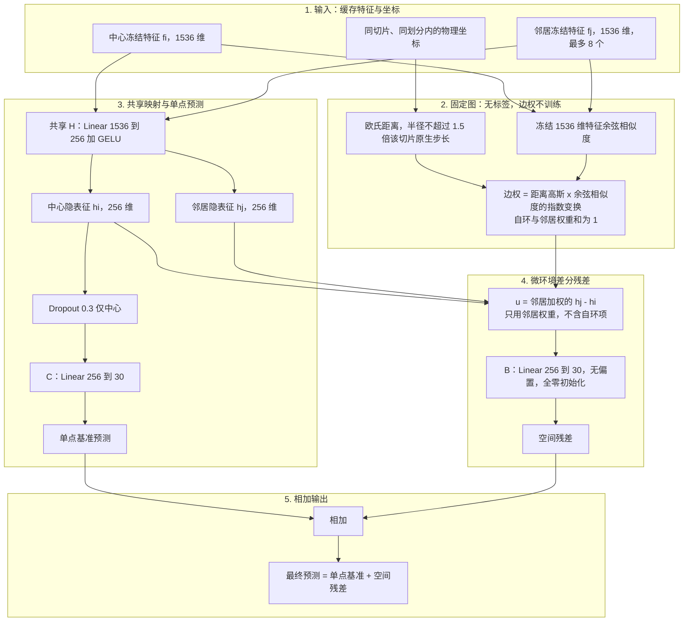
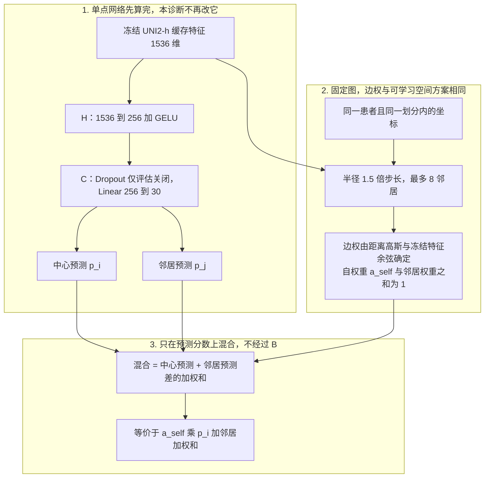
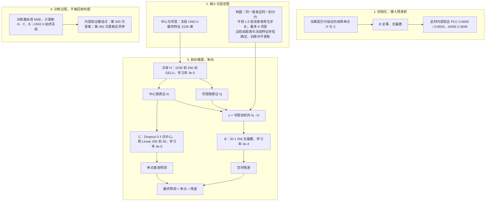

# Phase 2：基线、三份空间候选与论文大纲填写

> **文档性质**：给课题组看的模型比较与论文填写说明，不是终稿论文。  
> **对应原文**：同目录《Phase 2 空间微环境模型选型决策与技术演进总结》；论文结构对齐 `团队项目进度与结论/lzd/基于HE图像的空间通路活性重建用于增强食管鳞癌新辅助免疫治疗疗效预测.md`。  
> **审核状态**：原稿记录为用户已审核；2026-09-12按当前实验登记与组会决定定向核对，本次修订不等于论文结论已终审。  
> **阅读目的**：先看无空间基线与三份空间方案，再按已选定的经典空间残差 (a) 准备论文 Phase 2；(b)(c) 保留历史比较。

> **当前决定（2026-09-12）**：固定经典空间残差 (a)，暂停进一步改进；下一步为任务2/3输入输出与操作交接、第一轮单点基线替换2至3个其他病理基础模型（Virchow2为候选），以及论文指标、代码和关键架构图准备。“UNI2-h最好”须待新比较结果验证。

---

## 共同设定（所列两份基线与三份空间方案）

Phase 2 做的是：用 HE 点位图像预测 **30 条通路**的训练标准化 z 分数。图像编码器是冻结的 UNI2-h（1536 维），训练时只更新后面的小网络。

| 项目 | 口径 |
| :--- | :--- |
| 训练 / 内部验证 | 6 名患者空间块留出：9472 / 1078 点。这是**同一批患者的留出块**，不是 6 名新患者。 |
| 外部参考 | 患者 XZY，1039 点，历史已见的单患者外部参考，不是全新盲测队列。 |
| 局部逐通路 PCC | 每名患者、每条通路内先算点位相关，再等权平均。看切片里高低趋势对不对。 |
| 整体展平 PCC（平均池化 PCC） | 全部点位 × 30 通路的 z 分数拉直后算一次相关。看整体矩阵是否同向。两种 PCC 不能互相证明谁更好。 |
| 误差 | zMSE 越低越好；rawMAE 用**仅训练集**均值/标准差逆变换一次后再算。 |

下游模块统一记为：

- **H**：1536 → 256 + GELU
- **C**：Dropout 0.3（仅训练、仅中心）再 256 → 30
- **B**：无偏置 256 → 30，全零起步，把邻域隐表征差映成 30 维残差

整条链路如下。基线走到单点预测 $p$ 就结束；可学习空间方案再加残差；邻域平滑不经过 $B$，只混合已经算出的 $p$。

单点预测与可学习空间输出：

$$
p = C(h),\qquad y = p + Bu
$$

邻域平滑（不使用 $B$）把同样的邻居权重作用在预测分数上：

$$
\hat{p}_i = a_{\mathrm{self},i}\,p_i + \sum_j a_{ij}\,p_j
$$

---

## 思路一：基线（无空间）

无空间基线有两份，**网络结构相同**，只是训练配方不同。后面 (a) 接在原始基线上；(b)(c) 接在配方升级后的单点上。不要把两份单点的分数混成一条进步曲线。

### 1. 原始单点基线

把每个点位当成孤立样本：冻结 UNI2-h → H → C，**不读坐标、不构图**。随机初始化 H/C，学习率固定 $3\times10^{-4}$，全局乱序，批大小 256，三种子。这就是论文里“病理基础模型 + 轻量回归头、尚未使用组织邻域”的参照线。

| 划分 | 局部逐通路 PCC ↑ | 展平 PCC ↑ | zMSE ↓ | rawMAE ↓ |
| :--- | :---: | :---: | :---: | :---: |
| 内部验证 | 0.6533 ± 0.0009 | 0.7985 ± 0.0002 | 0.3732 ± 0.0005 | 884.90 ± 1.18 |
| 外部参考 XZY | 0.5131 ± 0.0115 | 0.6501 ± 0.0120 | 0.6637 ± 0.0213 | 1179.70 ± 27.11 |

### 2. 配方升级的单点预测基线

网络仍是上一张图的 H → C，**没有空间图，也没有 LoRA / 对比学习**。改的是怎么训：先用冻结 UNI2-h 把 9472 / 1078 点提成 1536 维并缓存；患者均衡采样、批大小 64（每轮约 148 次更新，原先约 37 次）；学习率仍先用 $3\times10^{-4}$ 做纯 MSE 预热，按内部验证锁住峰值（本次为第 10 个训练轮，0.6646 / 0.8024 / 0.3665），再把学习率降 10 倍到 $3\times10^{-5}$ 固定精修 5 个训练轮。交付的是这份精修后的 H/C，不是“多训了 25 个训练轮”的最后一刻。仅种子 42。

| 划分 | 局部逐通路 PCC ↑ | 展平 PCC ↑ | zMSE ↓ | rawMAE ↓ |
| :--- | :---: | :---: | :---: | :---: |
| 内部验证 | 0.6649 | 0.8034 | 0.3646 | — |
| 外部参考 XZY | **0.5425** | 0.6633 | 0.6639 | 1188.44 |

相对原始单点：内部局部 PCC 0.6533→0.6649，XZY 0.5131→0.5425（约 +0.029）。这是不同训练配方及运行的比较（单种子对三种子均值），没有把学习率、采样、批大小拆开消融；后面带 LoRA / 对比的臂未显示超出这一份的明确稳定增量。它是 (b)(c) 的共同来源，本身仍是无空间保底。

---

## 思路二：三份空间方案及结果

三份候选回答的是同一句话：**邻域信息怎么接到基线上。** 它们不是三种互不相关的新网络。

配方升级单点的做法与指标见思路一第 2 小节。它是 (b)(c) 的共同来源；**不能**把 0.5131→0.5779 整段都算成平滑的功劳。对比学习、LoRA **没有**进入这三份候选。

### (a) 经典空间残差

在与基线**同一套训练配方**上，按同切片、同划分构图（半径 1.5 倍原生步长，最多 8 邻居）。边权由距离高斯 × 冻结特征余弦的指数变换一次算定，不学习。中心与邻居共用 H；最终预测为

$$
y_i = p_i + B\sum_j a_{ij}(h_j-h_i)
$$

三种子。H/C 与单点臂采用配对随机初始化，B 全零；(a) 不继承成熟单点权重。准确边权为 `exp(-ρ²/(2σ²)) × exp((cos−1)/τ)`，ρ 为距离/原生步长，σ=1、τ=0.2，再与自环权重1共同归一化。

| 划分 | 局部逐通路 PCC ↑ | 展平 PCC ↑ | zMSE ↓ | rawMAE ↓ |
| :--- | :---: | :---: | :---: | :---: |
| 内部验证 | 0.6663 ± 0.0007 | 0.8056 ± 0.0005 | 0.3614 ± 0.0008 | 862.93 ± 2.55 |
| 外部参考 XZY | 0.5580 ± 0.0051 | 0.6783 ± 0.0081 | **0.6178 ± 0.0149** | **1125.29 ± 20.17** |

相对同配方基线：XZY 局部 PCC **+0.0449**，rawMAE 约降 4.6%；外部 30 条通路中 28 条平均 PCC 上升。这是本表三份空间方案中唯一提供**与同配方单点配对的三种子结果**的方案；第一轮 joint 等臂也有三种子，故不泛称全部空间证据中的唯一。

### (b) β=1 邻域平滑

**不是新网络。** 先用配方升级后的单点算出每个点的 30 维 $p$，再在同一张无标签物理图上做固定强度混合：

$$
\hat{p}_i = a_{\mathrm{self}}\,p_i + \sum_j a_{ij}\,p_j
$$

不训练 $B$，也不更新 H/C。预设诊断，**没有进入正式选模**。

| 划分 | 来源单点 | 平滑后 | 平滑相对来源 |
| :--- | :---: | :---: | :---: |
| 内部验证局部 / 展平 PCC | 0.6649 / 0.8034 | **0.6759 / 0.8102** | +0.0110 / +0.0068 |
| 内部验证 zMSE ↓ | 0.3646 | **0.3544** | −0.0101 |
| XZY 局部 / 展平 PCC | 0.5425 / 0.6633 | **0.5779 / 0.6821** | **+0.0355** / +0.0189 |
| XZY zMSE / rawMAE ↓ | 0.6639 / 1188.44 | 0.6447 / 1177.39 | 当前误差高于 (a)，来源基线不同 |

表中两种 PCC 是所列方案里最高的。XZY 误差仍不如 (a)，也不如 (c)。它表明固定邻域平滑在本设置下可提高相关性；不证明其生物学机制，也不证明必须学习 $B$。

### (c) 升级后的联合微调（继承单点后接入空间残差）

这份检查点实际采用了以下配置；它们的各自贡献尚未通过独立消融逐一证明：

1. 配方升级后的成熟单点 H/C（完整拷入，不重置预测头）；
2. 与 (a) 同类的物理邻域残差 $B$（全零起步）；
3. 分层学习率联合更新：H/C 为 $3\times10^{-5}$，$B$ 为 $3\times10^{-4}$。

**没有**放进去：LoRA、对比学习、关系蒸馏。种子 42，按内部验证保存的最佳检查点对应第 300 次更新。

| 划分 | 局部逐通路 PCC ↑ | 展平 PCC ↑ | zMSE ↓ | rawMAE ↓ |
| :--- | :---: | :---: | :---: | :---: |
| 内部验证 | **0.6734**（本表可训练方案里最高） | 0.8090 | 0.3552 | — |
| 外部参考 XZY | 0.5582 | 0.6720 | 0.6418 | 1155.25 |

相对同一来源单点，内部局部 PCC 约 +0.0085，XZY 约 +0.0157。外部局部 PCC 与 (a) 的 0.5580 基本持平；展平 PCC 与误差不如 (a)。单次运行，没有三种子标准差。

### 三份候选怎么读

| 问题 | (a) 经典空间残差 | (b) β=1 平滑 | (c) 联合微调 |
| :--- | :--- | :--- | :--- |
| 空间加在哪 | 256 维隐表征差，再经 $B$ | 已经输出的 30 维预测 | 与 (a) 相同，但 H/C 先成熟再一起微调 |
| 额外参数 | 有 $B$ | 无 | 有 $B$ |
| 相对谁涨分 | 同配方基线 0.5131 | 升级单点 0.5425 | 同一份升级单点 |
| 最强的一项 | 外部误差、三种子 | 两种 PCC | 内部可训练指标 |
| 证据身份 | 三种子描述性结果已接纳 | 诊断结果已接纳，未正式选模 | 单次运行已接纳 |
| 适合写进论文的主句 | 物理邻域残差相对无空间基线有配对增益 | 固定邻域平滑在本设置下可抬高相关性 | 继承单点后学残差，本表内部指标最好的可训练比较方案 |

本表 (b) 的 PCC 最高，(c) 的内部可训练指标最好，(a) 的 XZY 误差最低且有三种子；这些是不同配方与种子数量下的描述性比较。组会已选 (a) 为后续主方案，(b)(c) 保留为诊断与历史比较，不改写其原有选模记录，也不按 XZY 成绩追加调参。

核验图（内部 / 外部，双 PCC 与 zMSE）。图本身沿用旧共享报告的批次标签，未改绘：

**图注（名称对照）**：图中「第×轮」是旧共享报告的实验批次写法，对应本报告前面的定义如下。圆点为三种子均值（误差线为样本标准差），菱形为单种子；固定 $\beta=1$ 是诊断对照，未用于选型。

| 图中纵轴写法 | 本报告称呼 |
| :--- | :--- |
| 第一轮单点对照（n=3） | 思路一 · 原始单点基线 |
| 第二轮单点回归基座（n=1） | 思路一 · 配方升级的单点预测基线 |
| 第一轮空间残差（n=3） | 思路二 (a) 经典空间残差 |
| 固定 β=1 平滑（诊断）（n=1） | 思路二 (b) β=1 邻域平滑 |
| 第三轮联合模型（n=1） | 思路二 (c) 升级后的联合微调 |

---

## 思路三：按已选方案 (a)，论文 Phase 2 大概怎么写

保留 (b)(c) 的原表便于查阅，但它们不是当前主线建议。下表论文句子只是待完善的写作参考；三种子改善不等于多中心复现或统计显著。

对齐论文大纲里这些格子：Abstract 的「模型性能」、Result「病理基础模型能够重建空间通路活性」与表 2 / Figure 2、Methods「主要模型 / 比较模型 / 评价指标」、Discussion 关于“简单头 vs 空间模型”的判断。

**可以先填、且不要混用旧表的内容：**

- 任务写成：HE patch → 30 条通路 z 分数，再按需还原 ssGSEA。z-score **只在训练块内拟合**。
- 主干写成：冻结 UNI2-h，1536 → 256（GELU）→ 30；**不要**再写旧大纲里的 1536→512→256。
- 登记和分析并列两种 PCC，保留 zMSE / MAE 等完整指标；论文正文和补充材料的指标分工仍待确定。
- 大纲里 HYZ / LMZ / JFX 的切片内 90/10、HistoGene、EGN-v2 是**另一套划分与早期架构筛选**，不能和本文 9472/1078 + XZY 混进同一张主表。
- Phase 3 仍按患者划分；Phase 2 选哪份只决定交给下游的通路图怎么来，不自动证明 pCR 会更好。

### 当前主推 (a) 经典空间残差

| 大纲位置 | 建议填写 |
| :--- | :--- |
| Abstract「模型性能」 | 在冻结 UNI2-h 单点回归上加入同切片物理邻域残差后，外部参考局部 PCC 由 0.513 升至 0.558，rawMAE 约降 4.6%；内部亦有稳定增益（三种子）。 |
| Methods 主要模型 | 主模型 = 基线头 + 固定图上的隐表征差分残差。写清：邻居由坐标入选，图像余弦只参与边权；$B$ 全零起步；推理输出 $p+Bu$。 |
| Methods 比较模型 | 已有配对对照：无空间基线。平滑保留诊断；后续补单点基线基础模型替换和任务2、3，不追加复杂消融。 |
| Result 表 2 / Figure 2 | 主对比是基线 vs 残差。热图用同一通路的真值 / 基线 / 残差。可补充 XZY 上28/30通路三种子平均PCC上升（不表示28条均统计显著），并点名氧化磷酸化、ECM、E2F、DNA 损伤等。 |
| Discussion | 改写大纲里“复杂空间模型并未稳定优于 UNI2-h + MLP”这一句：在**当前划分**上，邻域残差相对同配方基线有配对增益。同时写明：内部验证不是新患者，外部仅 1 人。 |

**不宜写**：对比学习有效；这是跨患者交叉验证后的最终泛化。

### 历史写法参考：(b) β=1 邻域平滑

| 大纲位置 | 建议填写 |
| :--- | :--- |
| Abstract「模型性能」 | 先得到更稳的单点回归，再对预测做固定邻域凸组合（无新参数）。内部 / 外部两种 PCC 为候选中最高（外部局部 0.578）；误差不是最低。 |
| Methods 主要模型 | 分两句：① 单点网络（配方：患者均衡、小批次、预热后按既定较低学习率精修）；② 推理时用与空间图相同的边权混合预测。$\beta$ 预先固定为 1，不在验证或 XZY 上搜索。 |
| Methods 比较模型 | 必须放：来源单点、可学习残差。否则读者会把单点配方进步算进平滑。 |
| Result | 增益相对**来源单点 0.5425** 写 +0.0355，不要对基线 0.5131 连成一条大跳跃。说明 PCC 与误差可能分家。 |
| Discussion | 当前数据上固定平滑也提高相关性，但降噪机制尚未确认。它保留诊断身份，不能事后写成预先选定的主方法。 |

**不宜写**：学到了新的空间生物学机制；平滑全面优于可学习残差。

### 历史写法参考：(c) 联合微调

| 大纲位置 | 建议填写 |
| :--- | :--- |
| Abstract「模型性能」 | 先充分拟合无空间单点头，再接入邻域残差并联合微调。内部局部 PCC 0.673；外部局部 0.558，与经典残差基本持平。 |
| Methods 主要模型 | 明确两段训练：先只训 H/C，再拷入 H/C、$B$ 从零开始、分层学习率一起更新。UNI2-h 始终冻结。 |
| Methods 比较模型 | 三个对照都要在：无空间基线、来源单点、经典残差；平滑作诊断。不要把未进入检查点的 LoRA / 对比写成主模型组件。 |
| Result | 强调“完整保留单点能力后再加空间”相对来源单点的增量；外部不要宣称超过 (a)。种子只有 42。 |
| Discussion | 该比较方案写成：继承成熟单点 + 物理残差。承认内部最优不等于外部误差最优，也不等于平滑可被取代。 |

**不宜写**：联合微调已经全面超过经典空间残差；升级来自对比学习。

---

> **任务2/3交接更正（2026-09-12）**：保留经典空间残差结构，但下游 H/C/B 重新训练；任务2用基因表达监督，任务3用各自稠密/稀疏训练子集，冻结 UNI2-h 可复用。既有微调包尚未改造，先核对[重新训练说明](../ljq/Phase2任务2与任务3_重新训练与交接更正说明_20260912.md)中的输入、标度、图尺度与操作。

## 给 Phase 3 的一句交接

当前向 Phase 3 交接的是 (a) 经典空间残差。三份方案输出的都是 30 维训练 z 分数。还原原始尺度只能用训练集均值/标准差，一次逆变换。通路筛选和下游选模只能在 Phase 3 训练患者及内部验证里做，不能用 XZY 调权。高 PCC 通路（如氧化磷酸化、ECM）更适合作为重建质量分层，不自动等于疗效预测更有用。

工程路径与构图细节仍以同目录长文第 4 节为准：平滑没有独立权重，需加载来源单点后再混合；(c) 的检查点同时含 H、C、$B$；(a) 与 (c) 的构图分组假设不同，推理时不可混用代码包。

核对来源：[实验登记](../../experiments/experiment_registry.json)、[组会后续决定](../../project_state/governance/Phase2组会决策与论文后续任务_20260912.md)、[经典方案模型源码](../../experiments/phase2_softlink_local_v2/src/model.py)。主要表格数值保留；当前只对结论边界、公式与建议作定向修订。
