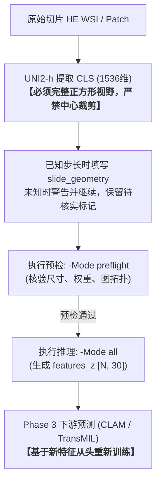

# 给队友：Phase 2 最终模型怎么接到 Phase 3

请先读这一份，弄清我们在做什么、结论是什么、依据在哪。当前交接版本 **1.1.0**；本次修复输入校验，模型权重与配方未变。  
真正点命令、改路径时，以同目录 [`README.md`](README.md) 为准。  
如果你把这份材料交给智能体，请同时发给它 [`给智能体的交接合同.md`](给智能体的交接合同.md)。

> \[!IMPORTANT\]
> **交接要点速览（TL;DR）**：
>
> 1. **职责边界**：本包**只生成通路特征**（每 patch 输出 30 维通路 z 分数），不训练疗效模型，也不再改动 Phase 2。
> 2. **输入与权重对应**：2026-09-12 开箱包（方案 A、种子 42、历史中心裁剪）保留作历史基线，不与本包的新 Phase 3 跑数混用。
> 3. **特征协议**：输入特征**必须是全视野协议重新提取的 1536 维 UNI2-h CLS**，绝不能复用旧裁剪缓存。
> 4. **阅读导引**：跑数实操查阅 [第 4 节](#4-怎样接到-phase-3) 与 [`README.md`](README.md)；报告/论文查阅 [第 2 节](#2-交给你们的是哪一个模型) 与 [第 3 节](#3-结论是什么依据是什么)；上线前核对 [第 5 节](#5-队友跑数与汇报自检清单do--dont-checklist)。

---

## 1. 我们在做什么

项目要回答的问题可以分成两段：

1. **Phase 2（已经做到这里）**：只看病理 HE 图像，能不能重建每个点上 30 条通路的活性？这些通路来自空间转录，训练时用过真值；以后很多临床切片没有空转，所以需要一个从图像到通路的模型。
2. **Phase 3（你们接下来做）**：用 Phase 2 预测出来的通路特征（可以再和原病理特征拼接），去做新辅助免疫治疗的疗效预测，并在厦门外部队列等数据上验证。

数据关系请记住这三句话：

- 训练 Phase 2 时，标签是 **MPP2 / group\_2** 上 6 名患者的通路 z 分数；外部试过的只有 **XZY 一名患者**。
- Phase 3 的切片通常**没有**这套空转真值。本包的作用，就是把每张 HE 切片上的 patch 变成 30 维通路分数。
- 本包输出的是**模型预测的通路 z 分数**，不是实验室测到的 ssGSEA。

旧的 2026-09-12 开箱包（方案 A，种子 42，历史中心裁剪，图半径 1.5 / 8 个邻居）**不要再用于新的 Phase 3 跑数**。接口目录形状还眼熟，但图像协议、图参数和权重都换了。

---

## 2. 交给你们的是哪一个模型


| 项目       | 内容                                                           |
| -------- | ------------------------------------------------------------ |
| 图像编码器    | UNI2-h，每个 patch 取第 0 个 CLS，**1536 维**                        |
| 图像怎么进编码器 | 完整正方形 patch，不中心裁剪，双三次缩到 224×224，再按 ImageNet 均值方差归一化          |
| 下游结构     | 经典空间残差：先有中心预测，再加上邻居相对中心的修正                                   |
| 随机种子     | **45**                                                       |
| 正式权重     | `weights/formal_best.pt`，第 **28** 轮                          |
| 输出       | 30 维通路 **z-score 分数**，通路名和顺序见 `assets/pathway_manifest.json` |


结构可以记成：

```text
UNI2-h CLS (1536)
  → H：线性层 1536→256，再 GELU
  → C：256→30，得到中心预测
  → B：用「加权邻居 H − 中心 H」得到 30 维修正（无偏置）
  → 输出 = C + B
```

构图只在**同一张切片**内进行：半径 = **2 个原生网格步长**，最多 **12** 个最近邻，边有向、不强制对称。边权同时看距离和图像余弦相似度。

#### 与 2026-09-12 旧包关键超参对照

两套配置与权重完全不同，切勿混用特征与参数：


| 超参项                 | 2026-09-12 旧方案 A（历史基线） | 2026-09-18 最终交付模型（本包）  | 为什么重要 / 影响                         |
| :------------------- | :--------------------- | :---------------------- | :---------------------------------- |
| **图像视野协议**          | 中心裁剪（短边 256 裁 224）    | **完整正方形视野**（直接缩放 224）  | 本包须使用匹配新协议的特征；旧缓存保留作历史基线 |
| **图搜索半径**           | 1.5 个步长               | **2.0 个步长**            | 空间邻域覆盖更广                           |
| **最大近邻数**           | 8 个                   | **12 个**               | 局部图拓扑更密集                           |
| **距离平滑参数** $\sigma$ | 1.0                   | **0.5**                | 按原生步长归一化后的距离衰减更陡峭 |
| **图像温度** $\tau$     | 0.2                   | **0.7716396069760084** | 语义余弦相似度平滑度显著不同                     |
| **自身原始权重**          | 1.0                   | **0.5**                | 中心点自身残差权重配比调整                      |
| **训练随机种子**          | 种子 42                 | **种子 45**              | 对应 `weights/formal_best.pt` 第 28 轮 |


---

## 3. 结论是什么，依据是什么

登记实验：`phase2_fullfov_hpo_v1`，批次 `20260916_231813_101_7b1b9a79`。

本包这一个权重的数字（种子 45，内部 6 人 / 1078 点，外部 XZY / 1039 点）：

内部训练和验证是相同六名患者的不同空间点位，不是六名未见患者验证。三种子 45/46/47 的来源与双 PCC 汇总见 `assets/seed_sources.json` 和 `README.md`。


| 划分     | 逐患者逐通路等权平均 PCC | 整体展平 （平均池化）PCC | 整体展平 z-MSE |
| ------ | --------------: | --------------: | ----------: |
| 内部验证   | 0.677195       | 0.810774       | 0.352305   |
| 外部 XZY | 0.568833       | 0.685507       | 0.638409   |


> \[!IMPORTANT\]
> **汇报口径与学术事实红线**：
>
> - **样本量客观**：外部验证仅覆盖 **XZY 1 名患者（1039 点）**，绝对不能在汇报、PPT 或论文中包装成“多中心验证”或“全新独立盲测队列证明泛化”。

对照（同一种子、同一全视野空间配方，仅关掉 B）：内部等权 PCC 0.664500，XZY 0.538711。这支持「B 有贡献」，不是 Phase 3 的疗效数字。

---

## 4. 怎样接到 Phase 3

#### 端到端交接工作流速览



### 4.1 先准备对的图像特征

输入必须是 **完整视野协议** 抽出的 UNI2-h CLS，形状 `[N, 1536]`，并带上与训练一致的切片坐标系坐标。坐标是切片原始像素网格，不是 0–1 归一化坐标。不同切片不能拼成一张图。

> \[!CAUTION\]
> **致命陷阱：严禁复用 2026-09-12 包的旧特征缓存！**  
> 旧特征是按「短边缩到 256 再中心裁 224」提取的，视野偏小，与本模型权重完全不匹配。  
> **注意**：程序无法从普通的 H5 数组反推当初是否裁切过。旧裁剪特征与本模型输入协议不一致，即使可以读取，也不能按本交付模型解释结果。请核对实际提取过程。

> \[!WARNING\]
> **步长信息：有表就提供，缺失则警告并继续**  
>
> - 训练时的步长参考：HYZ15040 / LMZ12939 为 336；JFX 为 448；TGC / XSL / ZHZ / XZY 为 224。  
> - 示例配置里的步长为空；程序尝试按坐标推断，无法稳定推断则回退为配置值（默认 224）。两条路径都会明确警告并记录实际数值，严格模式也不会因此暂停。
> - 稀疏点位可能使推断步长偏大。可以先生成特征，但须报告几何信息待核实，不能把“处理完成”写成“原生步长已验证”。以后补得可靠步长时，用新运行重新生成受影响切片。

### 4.2 三种喂数据的方式（和上次开箱包一样）

1. **每切片 H5**（最常见）：`features=[N,1536]`，`coords=[N,2]`。
2. **逐 patch 清单**：CSV 里写切片、坐标、特征文件路径。
3. **自定义适配器**：格式对不上时只改 `examples/custom_adapter.py`。

把 `configs/*.example.json` 复制一份，只改路径、列名和步长表。然后在包根目录：

```powershell
.\run.ps1 -Config .\configs\你的配置.json -Mode preflight
.\run.ps1 -Config .\configs\你的配置.json -Mode all
```

`preflight` 会加载权重并检查切片，**不写预测**。通过后再跑 `all`。每次运行都新建目录，不会覆盖旧结果。

患者与切片身份冲突会被拒绝处理。切片编号须全局唯一；不要让不同患者都叫 `slide1`。坏行会单独记录并剔除，剩余特征、坐标和身份保持对应。运行状态 `partial` 表示输入有缺项，保留的有效输出可以检查，但不能当作完整队列。

### 4.3 下游应该读哪些文件

```text
<run>/
├─ features_z/{pt_files,h5_files}/   ← 推荐：每切片 [N,30] 通路 z 分数
├─ fused_z/{pt_files,h5_files}/      ← 可选：前 1536 病理 + 后 30 通路 = [N,1566]
├─ predictions/                      ← 逐点 CSV，同时带 z 和一次逆变换后的原始量纲
├─ run_manifest.json
└─ warnings.jsonl
```

Phase 3 默认推荐直接使用 `features_z` 或 `fused_z` 里的 **z 分数**。

> \[!WARNING\]
> **标准化陷阱**：  
> 只有当下游模型明确需要原始 ssGSEA 量纲时，才允许使用包内**训练集**的均值与标准差（`assets/zscore_params_from_train.json`）做逆变换。**严禁**使用外部验证集（如厦门队列）或 Phase 3 队列的均值方差重新估计标准化！

通路列顺序必须和 [`assets/pathway_manifest.json`](assets/pathway_manifest.json) 完全一致（从 `tls` 到 `ECM_Organization`）。列顺序若打乱，等同于特征语义被彻底篡改。

### 4.4 疗效模型怎么训

1. **替换特征目录**：用本包生成的新特征，替换你们原先读取「旧 MPP2 / 旧方案 A 通路特征」的目录。
2. **下游必须从头重新训练**：按原下游划分重新训练 Phase 3 疗效模型。旧的疗效 checkpoint 是在另一套特征上训练的，不能直接载入接着用。
3. **消融实验规范**：消融（纯病理、纯通路、错配对照、病理+通路融合）都建立在这套新 30 维（或 1566 维）上。做错配实验时请打乱患者级通路特征，严禁通过改动 Phase 2 权重来“凑效果”。
4. **分类器不能混用权重**：不要把 `formal_best.pt` 载入 CLAM / TransMIL 当作网络初始化。它是图像→通路的冻结回归头，不是疗效预测分类器。

> \[!NOTE\]
> 运行产物中的 `run_manifest.json` 若标记 `contract_variant=true`，说明固定构图参数被改动。`false` 也不代表步长已核实；请同时看 `geometry_status`、`geometry_unverified_slides` 和 `input_complete`。

---

## 5. 队友跑数与汇报自检清单（Do &amp; Don't Checklist）

在启动正式训练或撰写汇报前，请逐项核对确认：

- [ ] **特征协议合规**：输入特征确认由全视野协议提取，绝无混用 2026-09-12 旧包的历史裁剪特征。
- [ ] **切片步长有记录**：已知时填步长表；未知时记录推断/回退值及待核实切片，允许警告后继续。
- [ ] **预检先行**：已运行 `-Mode preflight` 并读取报告；步长警告不暂停，身份冲突和缺项另行处理。
- [ ] **队列完整性明确**：检查 `input_complete`、跳片及剔除点清单；`partial` 不作为完整队列使用。
- [ ] **图参未被篡改**：未擅自改动图半径（2.0）、最大邻居数（12）、温度等超参；`run_manifest.json` 中无 `contract_variant=true`。
- [ ] **标度未被重估**：使用输出的标准 z 分数，未用内部验证集或外部队列重估 30 通路的均值和标准差。
- [ ] **下游重新训练**：Phase 3 疗效模型基于新特征从头重新训练，未将 Phase 2 权重当作分类头初始化，也未微调 Phase 2 头。
- [ ] **学术汇报客观**：汇报时必须同时并列逐患者等权 PCC 与整体展平 PCC；严格注明外部仅有 XZY 1 名患者，不把单患者结果包装为“换患者也稳定”或“多中心验证”。

---

## 6. 服务器上的原件（只读）

解释器：`C:\Users\AIPatho1\pfmval_env\Scripts\python.exe`


| 用途        | 路径                                                                                                                                                                                                                            |
| --------- | ----------------------------------------------------------------------------------------------------------------------------------------------------------------------------------------------------------------------------- |
| 训练代码      | `D:\AIPatho\qzs\code\phase2_fullfov_hpo_v1`                                                                                                                                                                                   |
| 本模型正式权重原件 | `D:\AIPatho\qzs\weights\phase2_fullfov_hpo_v1\20260916_231813_101_7b1b9a79\final-ablation_20260918_002437_956_adc7bf35\final-ablation__uni2h__full_fov_224_bicubic_v1__spatial__45__frozen_spatial__attempt01\formal_best.pt` |
| 该次运行记录    | `D:\AIPatho\qzs\runs\phase2_fullfov_hpo_v1\20260916_231813_101_7b1b9a79\final-ablation_20260918_002437_956_adc7bf35\raw\final-ablation__uni2h__full_fov_224_bicubic_v1__spatial__45__frozen_spatial__attempt01`               |
| 全视野特征缓存根  | `D:\AIPatho\qzs\feature_caches\phase2_fullfov_hpo_v1`                                                                                                                                                                         |


不要改这些目录。你们的 Phase 3 代码和运行请放自己的新目录。

---
