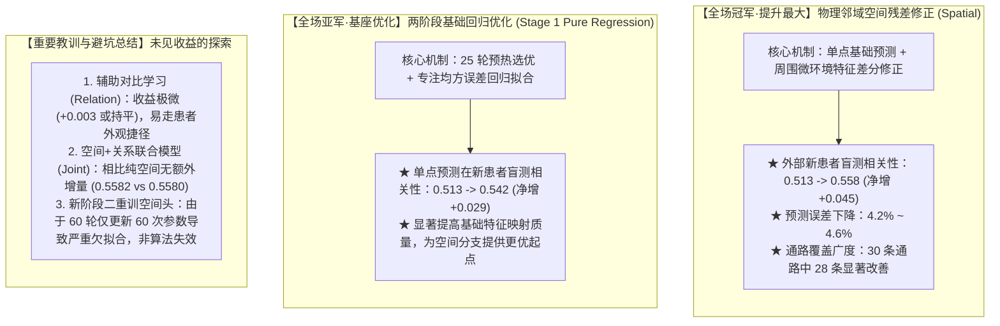
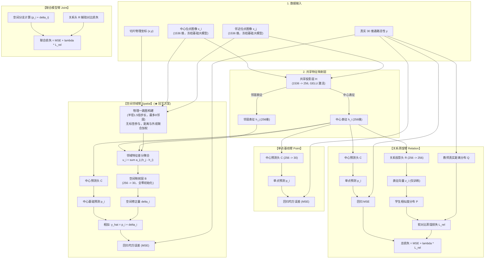
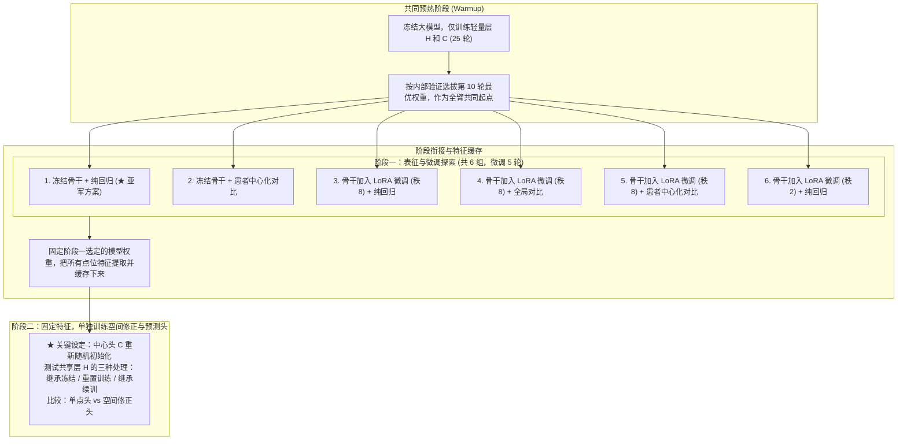
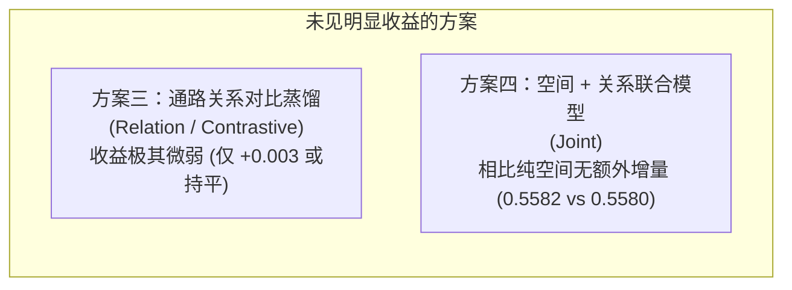

# Phase 2 软连接模型升级指南：核心突破、数据流全景与实验科学归因

> **文档性质**：团队共享科研成果与方案升级指南（专为团队汇报、讨论及导出 PDF 优化排版）  
> **汇报核心一句话**：在多轮探索实验中，**“局部物理邻域空间修正方案”取得了最为惊艳的跨患者泛化突破**（在新患者盲测中相关性由 0.513 跃升至 0.558，误差显著收敛，30 条通路中有 28 条全面改善）；**“两阶段基础回归优化”奠定了强劲的单点预测基座（提升第二大）**。此外，辅助对比学习收益微弱，而新方案阶段二数值下滑主要源于全图优化下更新步数不足（60 轮仅 60 次更新）导致的严重欠拟合，并非空间思想失效。

---

## 一、执行摘要：一分钟看懂核心突破

本项目旨在利用**高倍光学显微镜下的组织病理切片图像（HE 染色）**，通过深度学习模型直接预测切片上各个微小局部点位对应的 **30 种核心生物通路活性状态**（涵盖肿瘤增殖、免疫浸润、DNA 修复、细胞代谢等关键表型）。

在经历多轮架构与实验探索后，核心结论高度收敛：

---

## 二、重点突破方案深度剖析（提升最大）

### 2.1 【头号突破·提升最大】方案一：物理邻域空间残差修正方案 (Spatial)

#### 1. 为什么这个方案能取得最大突破？
传统基线把切片上每个组织点位当作孤立样本分别预测，忽略了真实的组织微环境规律：**组织中的细胞并不是孤立生存的，物理相邻区域的形态和微环境状态对当前点位具有强烈的协同与平滑作用**。

空间修正方案采取了**“中心基础预测为主、周围邻居残差修正为辅”**的架构设计：
- **无标签物理构图**：在切片物理坐标上，寻找中心点周围一跳物理半径内最近的邻居（最多 8 个）。构图完全基于物理距离与图像特征相似度，**绝无任何生物标签泄露**；
- **差分残差修正**：不仅看邻居自身特征，而是提取邻近点相对于中心点的**特征差异**（$h_j - h_i$），通过线性映射计算出一个修正量 $\delta$；
- **零残差平滑起步**：修正映射层严格全零初始化，训练初期不扰动基础预测；同时内置自保留权重，在切片边界或稀疏区域自动减少邻域权重，稳健性极高。

$$\text{最终预测值 } \hat{y} = \text{中心单点基础预测 } p + \text{空间邻域修正量 } \delta$$

#### 2. 硬核战绩：新患者盲测相关性显著跃升，误差全面收敛
在完全独立的外部新患者（未见切片）盲测中，空间修正方案展现了卓越的泛化性能：

| 评估维度 | 核心指标 | 单点基线模型 | 空间邻域修正 (Spatial) | 净改善幅度 |
| :--- | :--- | :---: | :---: | :---: |
| **独立新患者 (外部盲测)** | **样本内局部变化相关性 (逐通路平均PCC)** | 0.5131 | **0.5580** | **+0.0449 (大幅跃升)** |
| | **全数据整体展平相关性 (整体展平PCC)** | 0.6501 | **0.6783** | **+0.0282 (显著提升)** |
| | **相对标准化预测误差 (zRMSE)** | 0.7697 | **0.7375** | **下降 4.18% (误差显著缩小)** |
| | **原始绝对预测误差 (rawMAE)** | 1179.70 | **1125.29** | **下降 4.61% (更贴近真实数值)** |
| **已知患者验证 (内部测试)** | **样本内局部变化相关性 (逐通路平均PCC)** | 0.6533 | **0.6663** | **+0.0130 (稳定提高)** |
| | **全数据整体展平相关性 (整体展平PCC)** | 0.7985 | **0.8056** | **+0.0071 (稳定提高)** |
| | **相对标准化预测误差 (zRMSE)** | 0.5945 | **0.5832** | **下降 1.90%** |

> **指标通俗解读**：
> - **局部变化相关性**：衡量模型能否在单一患者切片内准确区分“哪里的通路活性高、哪里的通路活性低”（趋势越准越接近 1）；
> - **全数据整体展平相关性**：将所有患者全部点位的长向量拉通计算的综合吻合度；
> - 上述提升在 3 个独立随机实验中**全部严格单调复现**，证明结果真实可信，绝非偶然。

*图 1：四组对比方案在 3 个独立随机种子下的核心指标全景。菱形与误差棒展示均值与标准差。空间修正方案（深蓝）在相关性抬升与误差收敛上均显著处于最优势区间。*

#### 3. 30 条生物通路表现：28 条全面改善，核心通路提升亮眼
在全部 30 条被测生物通路中，**空间修正方案实现了 28 条通路相关性全面提升**。特别是与肿瘤发生发展、免疫反应密切相关的核心通路，相关性提升高达 0.08 ~ 0.10：
- **DNA 损伤响应 (DNA Damage Response)**：相关性提升 **+0.1028**（从 0.569 升至 0.672）
- **细胞周期调控 (E2F Targets)**：相关性提升 **+0.0929**（从 0.588 升至 0.681）
- **炎症反应 (Inflammatory Response)**：相关性提升 **+0.0885**（从 0.443 升至 0.531）
- **未折叠蛋白反应 (Unfolded Protein Response)**：相关性提升 **+0.0881**（从 0.593 升至 0.681）
- **肿瘤坏死因子信号 (TNF Signaling)**：相关性提升 **+0.0823**（从 0.463 升至 0.545）

这些核心通路不仅相关性大幅上升，预测误差也同步大幅下降，展现出极高的一致性。

*图 2：30 条生物通路在不同方案下的预测相关性全景展开。空间分支（深蓝）在绝大多数通路上均显著超越单点基线（灰色）。*

---

### 2.2 【基础夯实·次大提升】方案二：两阶段基础回归优化方案 (Stage 1 Pure Regression)

#### 1. 工作原理：科学预热与专注回归拟合
在第二轮探索中，团队重构了特征映射层并引入了两阶段训练逻辑：
- **共同预热期**：固定底层大模型，对轻量映射层（将 1536 维压缩为 256 维）和预测头进行 25 轮充分训练，选出最优检查点作为共同起点；
- **阶段一纯回归微调**：在预热起点上，不引入复杂的辅助对比损失，仅使用均方误差专注进行回归任务训练。

#### 2. 硬核战绩：显著强化单点预测底座
在完全不依赖任何空间邻域信息的前提下，仅通过基础优化：
- 独立新患者盲测的局部相关性从旧单点基线的 **0.5131** 跃升至 **0.5425**（净增 **+0.0294**）；
- 内部患者验证集的局部相关性从 **0.6533** 提高到 **0.6649**。

这表明：优化训练日程与网络初始化，能使高维病理图像特征到转录通路的单点拟合质量获得扎实提升，为后续叠加空间模块构筑了更优质的起点。

---

## 三、完整技术路线与数据流动全景图

为了让团队成员彻底搞清**“数据从哪来、经过什么层、算什么损失、输出到哪去”**，下文绘制了完整的数据流与实验设计全景。

### 3.1 旧方案数据流动与四臂消融设计图

旧方案核心聚焦于**“在固定图像特征后，不同的预测头结构能带来多少提升”**：

#### 旧方案四臂消融设计逻辑：
| 对照臂 (Arm) | 结构配置 | 训练期损失 | 推理期输入依赖 | 回答的核心问题 |
| :--- | :--- | :--- | :--- | :--- |
| **单点 (Point)** | 共享层 $H$ + 中心头 $C$ | 纯回归 MSE | 仅中心点图像 | 统一特征底座下的基础预测能力是多少？ |
| **空间 (Spatial)** | 共享层 $H$ + 中心头 $C$ + 空间修正 $B$ | 纯回归 MSE | 中心点图像 + 邻居图像 + 物理坐标 | 组织物理微环境能提供多少预测增益？ |
| **关系 (Relation)** | 共享层 $H$ + 中心头 $C$ + 关系投影 $R$ | 回归 MSE + 辅助对比损失 | 仅中心点图像（$R$在推理期丢弃） | 单纯约束表征的拓扑流形能否提升预测？ |
| **联合 (Joint)** | 共享层 $H$ + 中心头 $C$ + 空间 $B$ + 关系 $R$ | 回归 MSE + 辅助对比损失 | 中心点图像 + 邻居图像 + 物理坐标 | 空间修正与关系对比结合是否有协同效应？ |

---

### 3.2 新方案的两阶段演进：改了什么？为什么改？

新方案试图回答：“如果先让大模型特征更好地适应通路任务，再结合空间修正，能否比旧方案更进一步？”

#### 新方案相比旧方案的具体改进项：
1. **图像特征能否随任务改变**：旧方案完全冻结大模型；新方案在末尾注意力层加入 **LoRA（低秩适配）**，检验微调大模型能否提取更有价值的通路特征；
2. **对比学习监督方式**：由旧方案单向软距离匹配，升级为图像表征与通路标签投影之间的**双向软对比**；
3. **消除患者外观干扰**：新增**患者中心化对比教师**（减去该患者通路均值），防止模型偷懒走捷径去识别人脸式的切片外观风格；
4. **两阶段解耦设计**：阶段一先调表征，阶段二固定表征再单独训练空间修正头，试图清晰隔离表征学习与空间修正的独立贡献。

*图 3：新方案完整技术路线设计流程图（从预热、阶段一表征适配、特征缓存到阶段二空间头训练）。*

---

## 四、实验结果辨析：哪些可比？哪些不可比？

很多团队成员在阅读原始数据时容易产生困惑：“为什么新阶段一比旧基线高？”、“为什么新阶段二空间头数值反而大幅下降了？”。**搞清哪些可以严格比较、哪些存在不可比干扰，是正确评估技术的关键。**

### 4.1 严格可比的一组：单一变量控制的消融实验（证明了什么）

#### 1. 【可比证据一】旧方案四臂横向消融：
- **可比条件**：相同的随机种子、相同的 60 轮训练日程、相同的逐步参数更新（每轮 37 次，共更新 2220 次），仅改变网络头结构。
- **确凿结论**：
  - 单点基线 $\to$ 空间修正：新患者相关性由 0.5131 大幅飙升至 0.5580（**提升确凿、显著**）；
  - 单点基线 $\to$ 关系蒸馏：新患者相关性仅由 0.5131 微动至 0.5164（**收益微弱**）；
  - 空间修正 $\to$ 联合模型：新患者相关性 0.5580 vs 0.5582（**毫无实质增益**）。

#### 2. 【可比证据二】新方案阶段一六臂横向对比：
- **可比条件**：共享完全相同的预热起点，相同的 5 轮微调，相同的批次大小（5 轮共更新 740 次参数）。
- **确凿结论**：
  - 冻结骨干纯回归的相关性为 0.5425；
  - 引入中心化对比后为 0.5430（仅增 +0.0005，近乎持平）；
  - 引入 LoRA 微调后为 0.5388 ~ 0.5408（不仅未上升，反而轻微受扰动）。
  - **明确证实：在当前数据规模下，辅助对比学习与 LoRA 微调均未带来明显的额外收益。**

---

### 4.2 必须警惕的不可比因素：跨阶段与跨版本陷阱

#### 1. 为什么新阶段一纯回归高于旧单点基线（0.542 vs 0.513）？
- **不能简单归因于单一模块**：新阶段一相比旧基线，经历了前置 25 轮共同预热选优、学习率预热调整以及批次采样的改变。
- **科学定论**：这是整套训练流程与网络初始化改进带来的**系统性基座抬升**，证明科学的预热与分段训练有助于让单点特征更好地拟合通路。

#### 2. 为什么新阶段二空间头数值严重下滑（跌至 0.46 ~ 0.53）？是空间思想失效了吗？
- **绝对不是空间思想失效！底层日志揭示了训练更新步数的重大悬殊**：
  - 阶段一采用小批量采样，5 轮总共更新了 **740 次**网络参数；
  - 旧方案采用分批更新，60 轮总共更新了 **2220 次**网络参数；
  - **而阶段二为了构建整张大切片的空间邻域图，采用了全切片单批次优化——60 轮总共只更新了 60 次参数！**
  - 在阶段二设计中，预测头 $C$ 是**完全重新随机初始化的**。让一个全新的网络头仅仅经历 60 次梯度更新，无异于“让一个刚出生的婴儿只走 60 步就去跑马拉松”。
- **训练曲线铁证**：观察阶段二的内部训练轨迹（图 4），直至第 60 轮，模型的相关性曲线依然处于大角度向上的“陡峭爬坡阶段”，完全没有到达平缓收敛的平台期。
- **科学定论**：阶段二数值低是由于**工程训练步数极度不足导致的严重欠拟合**，而非空间邻域残差修正理论失效。

*图 4：阶段二内部训练曲线。实线与虚线在第 60 轮依然呈陡峭上升趋势，表明 60 次参数更新远未收敛，欠拟合严重。*

---

## 五、未见明显收益的方案深度复盘

为了后续研究少走弯路，客观归纳未达预期方案的深层原因：

### 5.1 方案三：通路关系对比蒸馏为什么收益微弱？
1. **无新信息注入**：主任务的回归均方误差（MSE）本身已经在对 30 维真实通路数值做精密拟合，对比损失只是对同一批标签换了一种距离计算形式，没有开辟任何新的外部信息通道；
2. **容易走“患者身份捷径”**：同一患者的切片点位外观天然相似。对比学习极易让模型学会“辨别切片来自哪个病人”的外观捷径，难以提炼出跨患者可迁移的通用生物通路规律；
3. **独立投影头吸收了几何约束**：模型配备了独立的投影头 $R$ 去计算对比损失，绝大部分拓扑拉伸都被该投影头吸收，未能有效传导到主预测头上。

### 5.2 方案四：空间 + 关系联合模型为什么没有额外收益？
空间修正方案已经抓住了最核心的“物理组织微环境上下文”；在此基础上叠加关系对比损失，不仅未能提供新的增量信息，反而对表征施加了细微的几何扰动，导致优势抵消。

---

## 六、全方案综合对照总表与研发决策建议

### 6.1 全核心方案横向指标总表

| 方案类别 | 具体方案配置 | 内部已知验证相关性 (逐通路平均PCC) | 外部新患者盲测相关性 (逐通路平均PCC) | 外部新患者误差 (zRMSE，越低越好) | 可比性定位与综合评价 |
| :--- | :--- | :---: | :---: | :---: | :--- |
| **基础基线** | 旧单点基线 (Point Baseline) | 0.6533 | 0.5131 | 0.7697 | **基准起点**：单点独立预测，未考虑空间微环境 |
| **【第一大提升】** | **旧空间邻域修正 (Spatial)** | **0.6663** | **0.5580** | **0.7375** | **★ 全场冠军**：跨患者泛化极其优异，28/30 通路改善 |
| **【第二大提升】** | **新阶段一基础优化 (Stage 1 Reg)** | **0.6649** | **0.5425** | **0.7512** | **★ 全场亚军**：预热+专注拟合，夯实单点特征映射 |
| **未见增量** | 旧关系对比蒸馏 (Relation) | 0.6530 | 0.5164 | 0.7687 | 与旧单点可比，增益极微 (+0.003)，无实质泛化 |
| **未见增量** | 旧空间+关系联合模型 (Joint) | 0.6660 | 0.5582 | 0.7403 | 与旧空间可比，无额外收益，误差反微增 |
| **未见增量** | 新阶段一+中心化对比 | 0.6649 | 0.5430 | 0.7510 | 与新阶段一纯回归可比，微动 +0.0005，增益不显 |
| **欠拟合待调** | 新阶段二重训空间头 (Stage 2) | 0.6223 | 0.5393 | 0.7538 | 因全图训练仅更新 60 次参数严重欠拟合，待调优 |

---

### 6.2 团队下一步算法迭代行动指引（清晰落地清单）

基于扎实的实证与深层归因，团队下一步研发路线非常明确，无需在细枝末节上浪费算力：

1. **确立“物理空间邻域修正”为主干标配**：
   - 实践证明，组织病理微环境具有不可替代的生物学物理先验。后续无论底层基础模型如何升级，推理端必须保留这一空间残差修正分支。
2. **打通“强强联合”：把两阶段基础优化与空间修正无缝融合**：
   - 目前全场表现最好的两组方案（新阶段一优秀的单点特征底座 + 旧方案的空间邻域修正）尚未充分结合；
   - 下一轮实验应直接以阶段一优化后的单点模型为基座，加载空间残差修正头，并解决阶段二更新步数不足的问题（采用子图采样或将训练步数提升至 500~1000 步以上），让新预测头充分收敛，有望刷新性能上限。
3. **果断收拢战线，暂缓复杂对比学习与小步微调**：
   - 数据表明，纯标签对比学习和当前规模下的 LoRA 微调缺乏显著性价比。团队应将研发精力集中在**“多尺度微环境聚合（如扩展至二跳邻域、融合细胞形态密度）”**以及**“端到端联合训练”**上。
