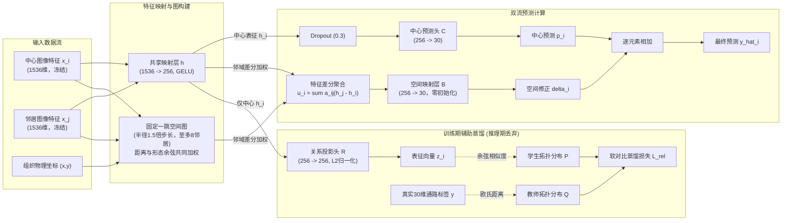
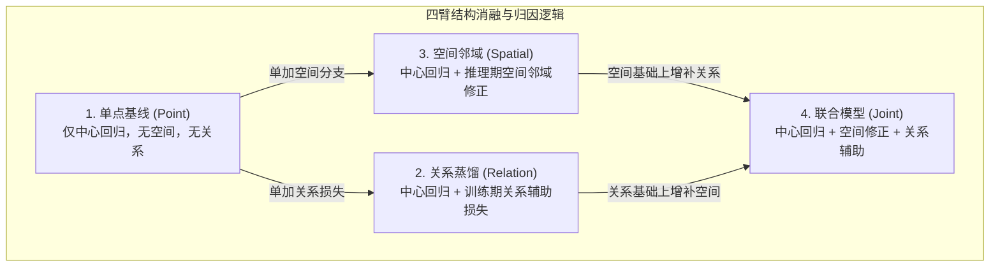
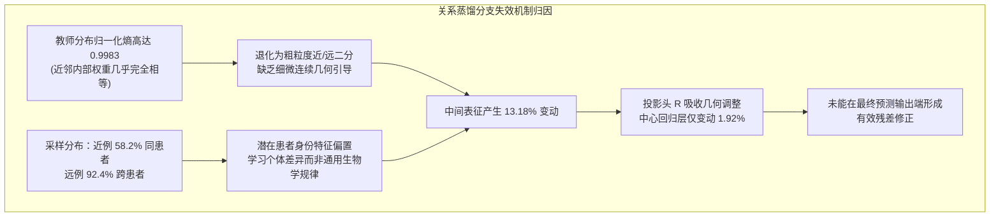

# Phase 2 软连接方案升级指南：架构设计、实验原理与结果分析

> **文档性质**：团队共享技术指南与阶段成果总结  
> **面向对象**：课题组全体科研与算法合作成员（外部说明视角，无需内部流程背景）  
> **阶段核心结论**：在冻结病理基础模型特征的前提下，**引入物理空间邻域加权修正分支**带来了显著且稳健的通路预测提升；而**基于通路标签距离的关系对比蒸馏分支**单独收益微弱，与空间分支联合时未见明确额外增量。

---

## 一、一句话说明与整体背景

### 1.1 我们在解决什么问题？
在基于高分辨率 HE 染色病理切片预测空间转录组（Spatial Transcriptomics）多通路活性的任务中，早期的基线模型多采用**单点独立回归**范式：即仅输入某一个局部组织位点（spot）的图像特征，直接通过多层感知机（MLP）预测其对应的 30 条关键生物通路得分（如免疫浸润、代谢及肿瘤相关通路）。

然而，这种单点范式存在两个显著的理论与现实瓶颈：
1. **忽略组织微环境的空间上下文**：组织学切片中的细胞并非孤立存在，相邻位点的形态结构与微环境基质对该位点的转录状态具有极强的生物学制约。单点模型“闭目塞听”，无法利用空间邻域信息。
2. **缺乏多任务表征约束**：生物通路状态是连续平滑变化的复杂流形。单纯依靠均方误差（MSE）对 30 个连续数值做点对点回归，容易陷入局部过拟合，未能充分利用样本之间“生物学状态相似性”的拓扑关系。

### 1.2 本次升级的核心思路
本次“软连接”升级方案探索了两种互补的信息增强机制：
* **在输入/推理端引入物理空间邻域修正**：读取切片物理空间相邻位点的图像形态与特征差异，以残差形式修正中心位点的预测；
* **在训练端引入连续通路关系辅助蒸馏**：打破传统对比学习非黑即白的“正负样本”二分类假设，根据真实的 30 维通路欧氏距离构建连续相似度分布，指导中间特征学习样本间的拓扑关系（推理阶段完全移除，零额外推理开销）。

---

## 二、方案的架构设计 (Architecture Design)

整个模型基于“中心为主、邻域修正、关系塑形”的设计哲学，输入统一使用预先冻结的前沿病理大模型（UNI2-h，1536维）提取的切片局部图像表征。

### 2.1 核心预测公式与模块分解

对于切片上的任意中心位点 $i$，模型的最终通路活性预测 $\hat{y}_i$ 严格拆解为两部分相加：
$$\hat{y}_i = p_i + \delta_i$$

* **$p_i \in \mathbb{R}^{30}$（中心基础预测）**：仅由位点 $i$ 自身的图像特征通过共享层与中心回归头生成；
* **$\delta_i \in \mathbb{R}^{30}$（空间邻域残差修正）**：聚合位点 $i$ 周围物理邻近位点的表征差异，经过直接线性映射输出的连续修正量。

### 2.2 四大关键子模块技术规格

#### 1. 统一共享特征层 ($h$)
输入 1536 维图像特征经过单层线性映射与 GELU 激活函数：
$$h = \text{GELU}(W_h x + b_h) \in \mathbb{R}^{256}$$
共享层使中心预测、邻域修正以及训练期的关系对齐工作在完全一致的 256 维任务潜在空间中。

#### 2. 中心回归分支 ($C$)
从中心表征 $h_i$ 出发，经过 Dropout (失活率 0.3) 抑制过拟合，通过线性层直接读出 30 维基础通路预测：
$$p_i = W_o \cdot \text{Dropout}(h_i, 0.3) + b_o \in \mathbb{R}^{30}$$

#### 3. 物理空间邻域修正分支 ($B$)
* **固定物理一跳图构建**：在同一切片内，以每个位点原生点距步长 $s$ 的 1.5 倍为截断半径，严格选取欧氏距离最近的至多 8 个有效邻近位点。建图过程**完全无监督、无标签参与**。
* **形态与距离联合边权**：综合物理欧氏距离衰减与原始图像特征余弦相似度，计算邻接权重 $b_{ij}$：
  $$b_{ij} = \exp\left(-\frac{(d_{ij}/s)^2}{2}\right) \times \exp\left(\frac{\cos(x_i, x_j) - 1}{0.2}\right)$$
* **自保留归一化机制**：引入中心位点自保留项（权重固定为 1），防止在孤立或微环境边缘区域强行放大不可靠邻域信号：
  $$a_{ij} = \frac{b_{ij}}{1 + \sum_{k \in \mathcal{N}_i} b_{ik}}, \quad a_{\text{self}} = \frac{1}{1 + \sum_{k \in \mathcal{N}_i} b_{ik}}$$
* **特征差分聚合与直接映射**：空间分支不直接汇聚绝对数值，而是聚合周围表征与中心表征的**变化量**：
  $$u_i = \sum_{j \in \mathcal{N}_i} a_{ij} (h_j - h_i) \in \mathbb{R}^{256}$$
  随后经由无偏置线性层 $B \in \mathbb{R}^{30 \times 256}$ 直接输出修正量 $\delta_i = B u_i$。
* **零残差平滑起步**：权重矩阵 $B$ 严格进行**全零初始化**。这意味着在训练第 0 步，空间修正量 $\delta_i \equiv 0$，模型初始状态完全等同于中心基线网络，确保训练起点平滑稳定。

#### 4. 连续通路关系蒸馏分支 ($R$，仅训练期生效)
传统对比学习把同位点样本视为唯一的正样本，其余全视为负样本，这违背了生物组织的连续渐变规律。本方案采用“连续软对比蒸馏”：
* **支持集筛选**：基于全训练集 30 维标准化通路真实距离分布，划分近阈值（分位数 $q_{10}$）与远阈值（分位数 $q_{50}$）。批次内针对中心 $i$，筛选最多 8 个近邻例与最多 32 个远例，其余中间模糊样本严格排除（同时退出分子与分母）。
* **教师与学生分布对齐**：
  * **教师分布 $Q$**：由真实通路标签欧氏距离通过带温度参数的 Softmax 计算得到连续软分布权重；
  * **学生分布 $P$**：由共享表征经线性投影头 $R$ 并做 L2 归一化后的比较向量 $z$，基于余弦相似度计算概率分布；
  * **辅助损失**：最小化软交叉熵 $\mathcal{L}_{\text{rel}} = -\sum_{j} Q_{ij} \log P_{ij}$。
* **零推理开销**：在实际测试与部署推理阶段，该分支及投影头 $R$ 被彻底剥离，预测完全依靠图像特征与坐标图。

---

## 三、实验的设计原理 (Experimental Methodology)

为了严谨排查各个模块的独立贡献、交互效应及失效机制，实验遵循严格的控制变量与防泄漏准则。

### 3.1 四个对照实验臂的严格消融设计

我们设立了四个边界清晰的实验臂，使每次比较都仅对应一个明确的科学问题：

| 实验臂代号 | 架构组成 | 训练期损失 | 推理期输入依赖 | 核心回答的问题 |
| :--- | :--- | :--- | :--- | :--- |
| **Point (单点基线)** | 共享层 + 中心回归头 $C$ | 回归 MSE | 仅中心图像特征 | 新统一框架下的基准性能如何？ |
| **Relation (关系蒸馏)** | 共享层 + 中心头 $C$ + 投影头 $R$ | 回归 MSE + 软对比损失 $\mathcal{L}_{\text{rel}}$ | 仅中心图像特征 | 不引入邻域时，拓扑关系先验能否单独优化图像表征？ |
| **Spatial (物理空间)** | 共享层 + 中心头 $C$ + 空间修正 $B$ | 回归 MSE | 中心与邻近位点图像特征 + 局部坐标 | 不引入关系监督时，局部物理邻域能提供多少增益？ |
| **Joint (联合模型)** | 共享层 + 中心头 $C$ + 空间 $B$ + 投影 $R$ | 回归 MSE + 软对比损失 $\mathcal{L}_{\text{rel}}$ | 中心与邻近位点图像特征 + 局部坐标 | 两项技术组合是否存在正向协同或相互干扰？ |

### 3.2 严密的防泄漏与公平评估准则

1. **同基准严控变量**：
   * 所有实验臂使用完全一致的样本划分（6 例患者切片共 9,472 个训练点位，内部留出 1,078 个验证点位；1 例完全独立的外部未见患者 XZY 共 1,039 个测试点位）；
   * 采用相同的 3 个独立随机种子（42、43、44）；
   * 各臂共享完全相同的骨干网络初始化参数与数据采样随机流；
   * 主任务损失函数严格统一为点位与通路的均方误差（MSE）。
2. **渐进式训练调度**：
   * 前 5 轮设为预热期（关系权重 $\lambda=0$），仅训练回归主干；
   * 第 6–15 轮将 $\lambda$ 逐步线性退火升至 0.05，之后保持恒定，避免早期未成熟特征扰乱关系对齐。
3. **独立验证集决策与外部盲测保护**：
   * 训练早停与最优模型检查点（Checkpoint）的选择，**严格仅基于内部验证集**的“患者等权宏平均相关系数（PCC）”；
   * **外部独立测试集（XZY）全程处于冻结盲测状态**，不参与任何学习率调整、早停决策、超参数搜索或结构选择，彻底杜绝数据泄漏。

### 3.3 深入机制诊断的科学设计

为了防止只看数字涨跌产生误判，实验同步内置了四项深层次机制检验：
* **邻域标签相关性诊断**：在不依赖模型的前提下，直接计算图上相邻位点的真实通路方差，与切片内随机点对的基准方差对比，从数据源头上验证物理邻域是否天然富集目标生物学信息。
* **误差分解恒等式检验**：对于空间模型相对于基线的预测改变向量 $d = p_{\text{spatial}} - p_{\text{point}}$，将均方误差的变化精确拆解为：
  $$\Delta \text{MSE} = 2 \operatorname{mean}(e \cdot d) + \operatorname{mean}(d^2)$$
  其中 $2 \operatorname{mean}(e \cdot d)$ 为**纠错项**（负值代表预测调整方向有效削减了原有残差 $e$），$\operatorname{mean}(d^2)$ 为**扰动代价**（调整带来的能量开销）。借此分析预测变化究竟是“定向纠偏”还是“盲目抖动”。
* **固定图平滑无参基准**：在单点模型输出上直接执行无参数的局部图卷积平滑（权重与空间分支一致），探讨空间收益究竟主要来自局部统计平均（平滑降噪），还是源于神经网络的可学习映射。
* **训练动力学与梯度对齐诊断**：记录表征层特征变动幅度、预测层输出变动幅度、以及学生网络在近邻例上的注意力概率质量，排查关系损失是否真正有效回传。

---

## 四、实验结论以及机制分析 (Findings & Analysis)

### 4.1 核心定量表现总览

在完成 3 个独立随机种子的全流程训练与评估后，内部验证集（6 例患者等权平均）与外部未见测试集（XZY，跨患者泛化评估）的核心统计结果如下：

#### 表 1：两种主相关性（PCC）统计对比（种子均值 ± 标准差）
| 评估数据集 | 结构分支 (Arm) | 宏平均 PCC (`pcc`)  *(主口径一：先患者内算PCC再平均)* | 整体展平 PCC (`flattened_pcc`)  *(主口径二：所有点位通路展开单次计算)* |
| :--- | :--- | :---: | :---: |
| **内部验证集** *(6 例患者等权)* | Point (单点基线) | 0.6533 ± 0.0009 | 0.7985 ± 0.0002 |
| | Relation (关系蒸馏) | 0.6530 ± 0.0010 | 0.7986 ± 0.0000 |
| | **Spatial (物理空间)** | **0.6663 ± 0.0007** | **0.8056 ± 0.0005** |
| | Joint (联合模型) | 0.6660 ± 0.0007 | 0.8056 ± 0.0004 |
| **外部独立测试集** *(患者 XZY，n=1)* | Point (单点基线) | 0.5131 ± 0.0115 | 0.6501 ± 0.0120 |
| | Relation (关系蒸馏) | 0.5164 ± 0.0066 | 0.6496 ± 0.0085 |
| | **Spatial (物理空间)** | **0.5580 ± 0.0051** | **0.6783 ± 0.0081** |
| | Joint (联合模型) | 0.5582 ± 0.0035 | 0.6759 ± 0.0060 |

> **【读表提示：两种 PCC 口径的本质区别】**
> * **宏平均 PCC**：先在每名患者切片内部、针对每条通路分别计算点位间的皮尔逊相关系数，再进行跨通路与跨患者的算术平均。它最真实地反映了模型在**单一组织切片局部空间微环境内捕捉通路相对起伏**的能力。
> * **整体展平 PCC**：将所有患者、所有点位、30 条通路的标准化得分拼接为一个超长向量，计算一次全局相关系数。它将跨患者的宏观基线差异与跨通路的数值分布混合在一起，数值通常偏高，回答的是全集大样本向量重建能力。两者侧重点不同，并列呈现。

#### 表 2：多维综合指标对照表（种子均值）
| 数据集 | 实验臂 | 宏平均 PCC ↑ | 一致性相关 CCC ↑ | 秩相关 Spearman ↑ | 相对误差 zRMSE ↓ | 原始绝对误差 rawMAE ↓ |
| :--- | :--- | :---: | :---: | :---: | :---: | :---: |
| **内部验证集** | Point | 0.6533 | 0.6125 | 0.6133 | 0.5945 | 884.90 |
| | Relation | 0.6530 | 0.6109 | 0.6121 | 0.5945 | 885.51 |
| | **Spatial** | **0.6663** | **0.6286** | **0.6289** | **0.5832** | **862.93** |
| | Joint | 0.6660 | 0.6279 | 0.6287 | 0.5833 | 863.23 |
| **外部测试集** | Point | 0.5131 | 0.3970 | 0.4228 | 0.7697 | 1179.70 |
| | Relation | 0.5164 | 0.3969 | 0.4248 | 0.7687 | 1179.13 |
| | **Spatial** | **0.5580** | **0.4278** | **0.4551** | **0.7375** | **1125.29** |
| | Joint | 0.5582 | 0.4268 | 0.4562 | 0.7403 | 1130.87 |

---

### 4.2 核心结论一：物理空间邻域模块贡献了主要且稳健的预测收益

从数据对比中可以清晰发现，**物理空间邻域修正分支是本次升级取得性能突破的关键**：

1. **跨患者泛化能力显著提高**：
   在完全未见的外部测试集 XZY 上，空间模型相比单点基线，宏平均 PCC 绝对值提升高达 **+0.0449**（从 0.5131 攀升至 0.5580，3 个种子分别提升 +0.0420、+0.0541、+0.0388，均呈单调正向提升）；相对误差 zRMSE 下降 **4.18%**，原始尺度绝对误差 rawMAE 下降 **4.61%**。
2. **广泛的通路普适性**：
   在全部 30 条生物通路中，空间模型实现了 **28 条通路 PCC 上升、22 条 CCC 上升、25 条 RMSE 下降**。这一全面改善证实收益具有全局性，而非由个别极端通路拉动。
3. **机制归因证据链**：
   * **数据基础**：对训练切片的直接统计显示，物理邻近位点之间的真实通路差异比全切片随机点对**低 41% 至 68%**。这证实切片物理邻域天然具备极高信息相干性。
   * **代数纠错证实**：误差分解显示，空间模型的纠错项 $2 \operatorname{mean}(e \cdot d)$ 达到了 **-0.0304**，远超扰动代价项（+0.0175），实现了稳定的负向净变化（MSE 净降低 -0.0129）。这证明空间分支学到的预测改变量在方向上是精准的残差对冲，而非随机扩散。
   * **超越单纯空间平滑**：若在单点模型输出上直接进行无参数的固定图平滑，内部 PCC 虽可达 0.6673，但其反映预测与真值绝对数值吻合度的一致性相关系数（CCC）仅为 0.6148，显著低于可学习空间模型的 **0.6286**。这说明可学习的线性映射 $B$ 在实现去噪的同时，更好地保留了生物通路的极值动态范围。

---

### 4.3 核心结论二：关系辅助蒸馏任务单独收益微弱

实验表明，基于当前标签距离构建的关系蒸馏分支，未能转化为实质性的预测增益：
1. **指标几乎原地踏步**：在内部验证集上，关系分支的 PCC 相比基线甚至微降了 0.0003；在外部测试集上，PCC 仅微弱上升 0.0033，绝对误差降幅不足 0.2%。
2. **机制深度排查**（为什么设计精巧的关系蒸馏未能奏效？）：
   * **学生网络并不缺乏梯度**：训练第 15 轮诊断显示，学生分布在近邻例上分配了高达 89.5% 的注意力概率质量（远超均匀基准的 17.6%），关系项反向传播的梯度范数占回归梯度的 20%~27%。这排除了“代码未收敛”或“梯度消失”的表层猜想。
   * **核心症结一：教师分布过于平坦，缺乏连续细粒度监督**。数据审计发现，教师分布 $Q$ 在近邻集合内部的归一化信息熵高达 **0.9983**（理论最大值为 1.0）。这意味着在近邻池内部，教师几乎将所有近邻等权视之。关系分支实际上退化成了粗糙的“二值分类（区分近还是远）”，原设计中期望通过连续距离传递的精细流形几何结构基本未被激活。
   * **核心症结二：表征层约束未能有效穿透至回归层**。在特征提取层，关系分支使共享隐藏向量发生了 **13.18%** 的显著位移，但最终中心预测头输出的变化仅有 **1.92%**。独立的投影头 $R$ 吸收了绝大部分对比几何调整，中心回归头对这种拓扑重塑缺乏足够的利用机制。
   * **核心症结三：采样偏置引发患者身份捷径**。统计显示，近邻样本中有 58.2% 来自同一患者，而远例样本中有 92.4% 来自跨患者。模型极易借由对比损失走捷径——即学会识别“这是否为同一患者/同一切片的组织”，而非真正理解通路的连续生物学演化规律。

---

### 4.4 核心结论三：联合模型未见明确额外增量

将空间邻域修正与关系对比蒸馏同时启用的联合模型（Joint），**并没有展现出超越纯空间模型的宏观增量**：
* 外部测试集宏平均 PCC 仅比纯空间模型多出 0.00015（0.558155 vs 0.558001），几乎完全重合；
* 在相对误差 zRMSE（0.7403 vs 0.7375）和原始绝对误差 rawMAE（1130.87 vs 1125.29）上，联合模型甚至略逊于纯空间模型。
* **原因分析**：空间物理邻域已经在局部提供了强有力的同质性与差异性上下文，关系蒸馏所带来的粗粒度表征调整与空间分支存在重叠（信息冗余）；同时，关系损失施加在表征层上的额外扰动（使预测改变量能量升高至 +0.0183），抵消了微弱的正向纠偏效果。

---

## 五、反面事实与技术局限 (Limitations & Caveats)

为了保证科研事实的严肃性与透明度，本报告客观记录实验中暴露出的反面事实与技术边界，避免过度宣称：

### 5.1 低方差通路的局部敏感性异常
在内部验证集的 6 名患者中，空间模型在 5 名患者上的平均决定系数 $R^2$ 均有稳步改善，但在患者 **ZHZ** 的 **mhc 通路**上出现剧烈恶化：
* 单点基线在该患者-通路上的 $R^2$ 为 -41.26，空间模型进一步恶化为 **-48.55**；
* 深入探查发现，该患者切片内 mhc 通路的**真实表达极其均质，方差极小**。由于 $R^2$ 指标的分母为真实方差，极小波动即会导致比值发散；空间分支由于聚合了邻域微小扰动，预测方差相对真实方差扩大了 6.94 倍，从而放大了数值惩罚。这提示我们在面对超均质低表达通路时，需考虑残差增益的自适应抑制机制。

### 5.2 跨患者泛化的预测幅度压缩
在完全独立的外部测试集 XZY 上，所有模型的宏平均 $R^2$ 均在 0 附近，一致性相关系数 CCC 约在 0.42 左右。排查发现，模型在外部测试集上的标准化预测存在系统性偏置（$\text{bias}_z = -0.279$），且**预测值的离散程度被大幅压缩**（逐通路预测标准差仅为真实标准差的 0.594）。这表明模型能较好地给出“高低起伏趋势”（PCC 0.558），但对于“绝对数值的高低界限”仍偏保守，未来需要配合轻量标度后校准技术。

### 5.3 残差的空间自相关性依然存在
计算切片预测残差的 Moran's I 空间自相关系数发现，空间模型残差的 Moran's I 从基线的 0.1509 微升至 0.1729。这表明预测错误在空间物理切片上依然呈成团成片分布，物理一跳邻域模型尚不足以完全建模复杂的跨区域异质性边界。

---

## 六、下一阶段研发建议与团队讨论要点

结合本次升级取得的明确证据，建议团队在下一阶段聚焦以下四个方向：

1. **架构主线聚焦与精简（优先执行）**：
   * **建议以纯空间模型（Spatial）作为当前最优主干**。在后续迭代与下游任务（如空间特征与预后分型关联）对接中，暂缓或裁剪复杂的联合蒸馏模块，既降低了训练与推理复杂度，又维持了最佳预测性能。
2. **空间增益来源的单因素严格消融**：
   * 当前空间图同时融合了“欧氏物理距离”与“基础模型图像形态余弦”。建议下一步设计两组极简消融：
     * ① **纯几何距离图 vs 几何+形态联合图**：确认图像形态相似度权重是否提供了额外特异性；
     * ② **邻域拓扑打乱对照（Shuffle Test）**：在同患者切片内随机重连邻居，确认收益是否高度依赖真实的物理相邻拓扑。
3. **关系蒸馏任务的纠偏或裁撤**：
   * 若课题仍希望深挖连续流形表征，必须先解决教师分布过平（可尝试调低教师温度参数 $\tau_y$）与同患者采样偏置问题（强制患者平衡采样）。若调整后内部仍无增益，则坚决剔除关系分支。
4. **轻量绝对数值校准试验**：
   * 针对跨切片预测幅度压缩与偏置问题，探索仅利用训练集统计量对输出进行轻量仿射缩放（Scale & Shift），提高输出在下游转录组分析中的绝对可比性。

---

## 附录：参考资料与内部文档索引（仅供项目维护者自查核对，不对外分发）

*注：本索引仅供报告作者与内部代码维护者在复核数据时追溯定位原始记录，外部交流时可直接忽略。*

1. **原始实验分析报告**：`01_指南与解读/分析报告/Phase2软连接v2_1_实验结果与机制分析_20260908.md`
2. **最终部署与技术规格**：`01_指南与解读/部署方案/Phase2软连接升级_最终部署方案_v2_1_20260907.md`
3. **数据流与架构学习指南**：`01_指南与解读/学习指南/Phase2软连接升级_从数据流到设计判断_学习指南_v1_20260907.md`
4. **三项关键机制审核指南**：`01_指南与解读/学习指南/Phase2软连接升级_三项关键审核_学习指南_v2_20260907.md`
5. **本地实验运行结果批次目录**：`experiments/results/phase2_softlink_local_v2/20260908_005325_810_8d306c10/`
6. **核心结果总览图源码与资源**：`01_指南与解读/分析报告/report_figures/phase2_softlink_v21_20260908/`
