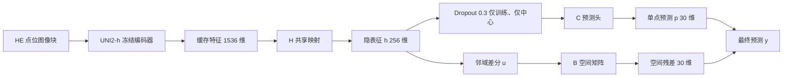
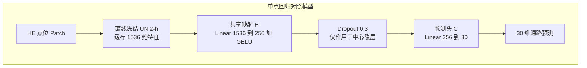
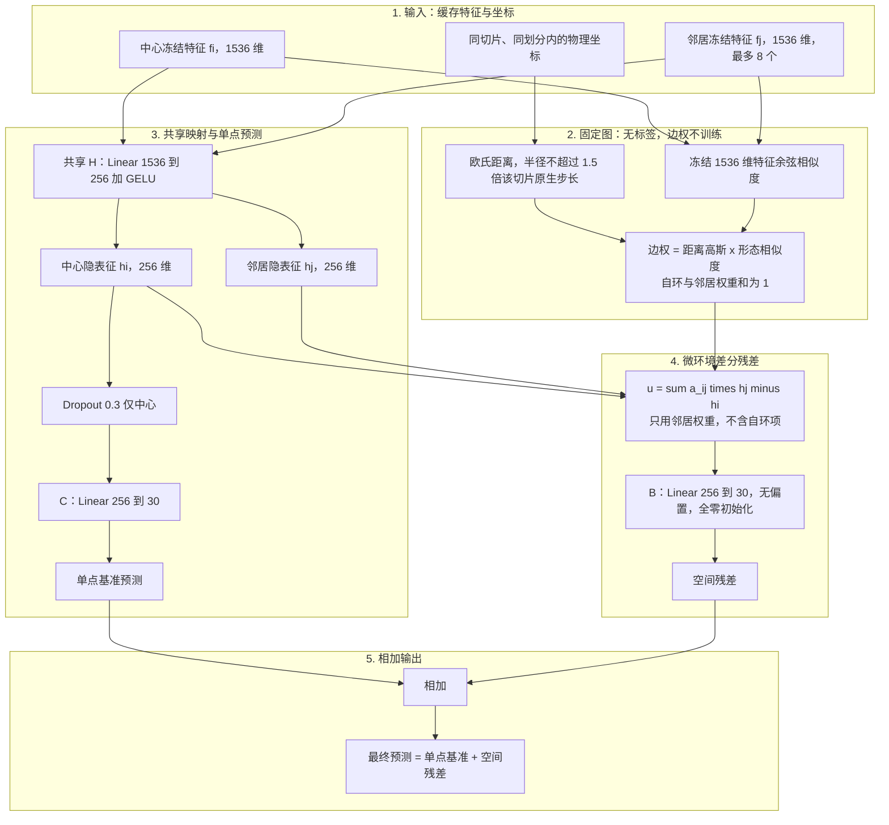
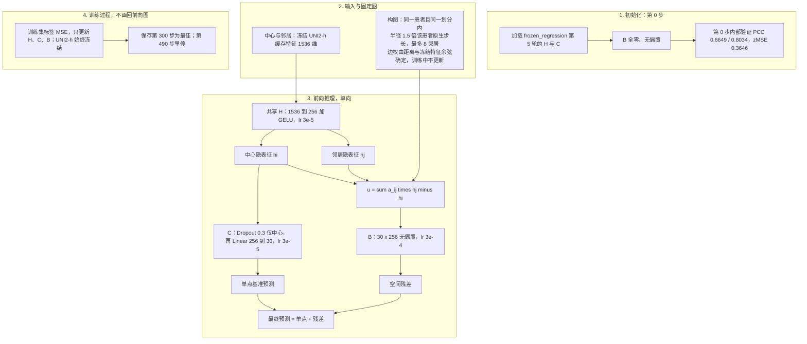
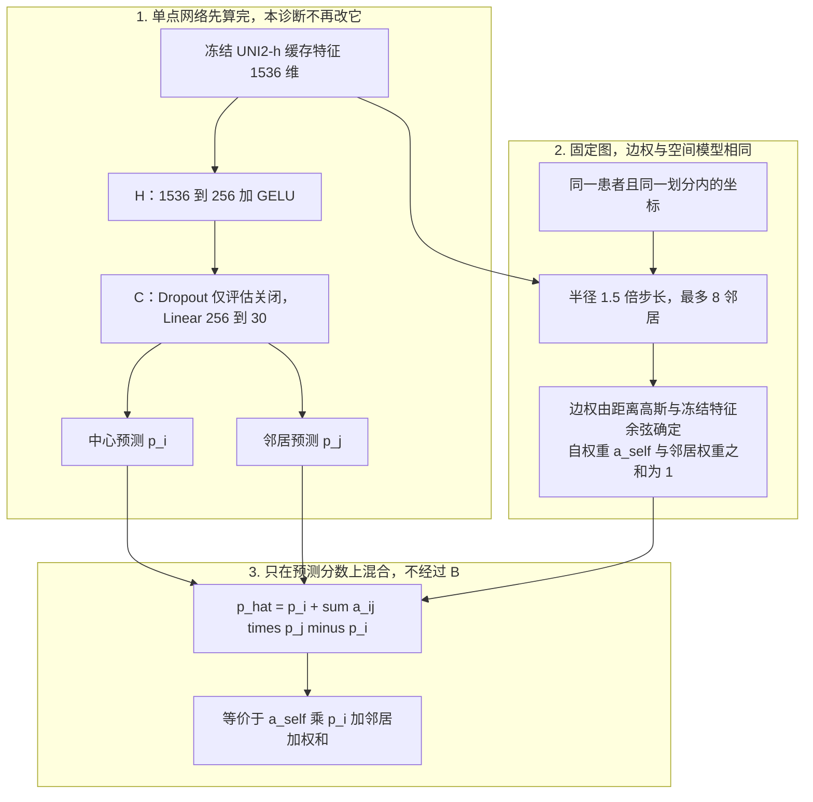

# Phase 2 空间微环境模型选型决策与技术演进总结（团队共享）

> **文档性质**：课题组团队决策、模型选型指南与指标全景解析（2026-09-10 核验；2026-09-11 按原始预测与训练集 z-score 参数复核并修订）  
> **面向对象**：Phase 3 下游疗效建模同学及课题组全体研究人员  
> **核心导引**：本文系统呈现 Phase 2（从 HE 组织病理切片图像预测 30 种核心生物通路活性）从单点映射到空间微环境建模的完整架构演进与实测指标；文首先用同一套符号说明 H、C、B、Dropout 与空间图各自做什么、何时更新；随后展示推荐顺序、各方案架构与实测指标，并解释为何免训练平滑会在相关性上显得提升很大；并列内部验证与外部参考患者 XZY 的双 PCC 及误差指标，辅助团队选型。  
> **证据范围**：训练集 9472 点、内部验证 1078 点来自同一批 6 位患者的空间块留出划分，不能解释成对 6 名新患者的验证。XZY 为 1 位外部患者、1039 点，历史分析中已多次查看，本文称**外部参考评估**，不称全新盲测队列。实验登记中第一、二轮结果仍待审阅，第三轮单次运行已接纳。固定 $\beta=1$ 平滑是预设诊断，**未用于正式模型选择**。

---

## 目录

- [阅读前：H、C、B 等层如何定义与使用](#阅读前hc-b-等层如何定义与使用)
- [一、团队模型选型决策：指标表现与适用场景](#一团队模型选型决策指标表现与适用场景)
  - [1.1 候选模型定位与选型推荐指南](#11-候选模型定位与选型推荐指南)
  - [1.2 全景核心指标综合对比表（内部验证与外部参考）](#12-全景核心指标综合对比表内部验证与外部参考)
- [二、模型架构、数据流动与各数据集指标详解](#二模型架构数据流动与各数据集指标详解)
  - [2.1 单点回归对照模型：架构、数据流动与指标](#21-单点回归对照模型架构数据流动与指标)
  - [2.2 经典物理微环境残差修正模型：架构、数据流动与指标](#22-经典物理微环境残差修正模型架构数据流动与指标)
  - [2.3 预热继承联合微调空间模型：架构、数据流动与指标](#23-预热继承联合微调空间模型架构数据流动与指标)
  - [2.4 固定 β=1 预测平滑诊断：架构、数据流动与指标](#24-固定-β1-预测平滑诊断架构数据流动与指标)
  - [2.5 四类架构关键对照与 β=1 增益原因](#25-四类架构关键对照与-β1-增益原因)
  - [2.6 核心指标直观对比图（核验修订版图表）](#26-核心指标直观对比图核验修订版图表)
- [三、细分生物通路预测表现与 Phase 3 建议](#三细分生物通路预测表现与-phase-3-建议)
  - [3.1 核心肿瘤与微环境通路的相关性跃升](#31-核心肿瘤与微环境通路的相关性跃升)
  - [3.2 通路特异性对 Phase 3 下游建模的指导建议](#32-通路特异性对-phase-3-下游建模的指导建议)
- [四、Phase 3 下游交付与工程对接规范](#四phase-3-下游交付与工程对接规范)
  - [4.1 模型权重与代码包路径](#41-模型权重与代码包路径)
  - [4.2 输入特征提取与切片物理构图规范](#42-输入特征提取与切片物理构图规范)
  - [4.3 输出通路分数标度与还原说明](#43-输出通路分数标度与还原说明)
- [五、技术方案演进脉络、工程反思与直接结论](#五技术方案演进脉络工程反思与直接结论)
  - [5.1 空间微环境建模的三阶段演化全景](#51-空间微环境建模的三阶段演化全景)
  - [5.2 探索中积累的关键工程认知与反思](#52-探索中积累的关键工程认知与反思)
  - [5.3 当前确立的直接科研结论](#53-当前确立的直接科研结论)
- [附录：核验来源与复现索引](#附录核验来源与复现索引)

---

## 阅读前：H、C、B 等层如何定义与使用

后文反复出现 H、C、B。它们不是 UNI2-h 里的 Transformer 层，而是接在**已缓存图像特征之后**的三块可训练下游模块。第一轮代码里分别叫 `shared`、`point_head`、`spatial_head`；第二、三轮叫 `SharedProjection`、`RegressionHead` 与参数矩阵 `B`。本文统一写成 H、C、B。

### 整条链路在做什么

每个空间点位先被切成 HE 图像块，离线送入冻结的病理视觉大模型 **UNI2-h**，得到固定的 **1536 维**特征向量并缓存。训练循环不再运行 UNI2-h，也不更新它的权重。H、C、B 只吃这些缓存向量（空间模型另外还吃坐标构图）。输出是该点 **30 条通路**的 z 分数预测，不是原始 ssGSEA 分数。



单点模型走到 $p$ 就结束。可学习空间模型再加 $y = p + Bu$。固定 $\beta=1$ 平滑不经过 B，只对已经算出的 $p$ 做邻域混合。

### 各层定义（与代码一致）

| 本文符号 | 代码中的模块 | 输入 → 输出 | 有无偏置 | 训练时做什么 | 评估 / 推理时做什么 |
| :--- | :--- | :--- | :---: | :--- | :--- |
| **UNI2-h** | 官方病理视觉大模型 | 图像块 → 1536 维特征 | — | **始终冻结**；本实验只读缓存 | 同样只读缓存，不现场实例化 |
| **H** | `SharedProjection` / `shared` | 1536 → 256 | 有 | `Linear + 精确 GELU`（`approximate=none`）。中心点与邻居**共用同一套 H** | 同样前向；无 Dropout |
| **Dropout** | `RegressionHead.dropout` | 只作用在**中心**的 256 维 $h$ | — | 概率 0.3 的 inverted dropout，再送入 C | **关闭**，中心 $h$ 原样进 C |
| **C** | `RegressionHead` 的线性层 / `point_head` | 256 → 30 | 有 | 把（可能已 dropout 的）中心 $h$ 读成 30 维通路分数 $p$ | 线性读出，得到 $p$ |
| **B** | 第三轮 `nn.Parameter`；第一轮 `spatial_head` | 256 → 30 | **无** | 把邻域差分 $u$ 映成 30 维残差；**全零初始化**，第 0 步 $y=p$ | $y = p + Bu$ |
| **空间图** | `SpatialGraph` | 坐标 + 冻结 1536 维特征 → 边权 | — | **不训练**。边权构图时一次算定 | 复用同一套边权 |

第三轮 B 的张量形状是 $(30,\ 256)$，前向为 `F.linear(u, B)`，即 $Bu$ 而不是带偏置的 `Linear`。第一轮 `spatial_head` 是 `Linear(256→30, bias=False)`，权重同样全零起步，作用相同。

### 前向公式（按点 $i$ 书写）

对缓存特征 $f_i\in\mathbb{R}^{1536}$：

$$
h_i = \mathrm{GELU}(W_H f_i + b_H),\qquad
p_i = W_C\,\mathrm{Dropout}(h_i) + b_C
$$

评估时 Dropout 关闭，$p_i = W_C h_i + b_C$。H 对邻居同样计算得到 $h_j$。空间残差用的邻域差分**不含自环**：

$$
u_i = \sum_j a_{ij}(h_j - h_i),\qquad
y_i = p_i + B u_i
$$

边权 $a_{ij}$ 由距离高斯核与冻结 1536 维特征的余弦相似度确定，并与自权重 $a_{\mathrm{self},i}$ 一起归一化为 1。残差求和只用邻居项；自权重出现在图的归一化里，不单独再乘一次 $h_i$。

固定 $\beta=1$ **不使用 B**，也不改 H/C。它把同样的邻居权重作用在已经得到的预测上：

$$
\hat p_i = p_i + \sum_j a_{ij}(p_j - p_i) = a_{\mathrm{self},i}\,p_i + \sum_j a_{ij}\,p_j
$$

### 使用时容易混的三点

1. **H 不是 UNI2-h。** UNI2-h 是 1536 维特征的来源；H 只是把这 1536 维压到 256 维的小线性层。说“冻结主干”指 UNI2-h，不指 H。
2. **Dropout 不作用在邻居，也不作用在 B。** 邻居的 $h_j$ 始终完整参与 $u_i$；只有中心点进 C 之前可能被丢掉 30% 维度。
3. **“继承 H/C”只拷四组张量**：`shared.linear` 的 weight/bias，以及 `regression.linear` / `point_head` 的 weight/bias。Dropout 没有权重。B 不从单点检查点里读入，新模型里保持全零。

后文第 2.1–2.4 节按单点 → 经典空间 → 联合微调 → $\beta=1$ 展开；选型表见第 1.1 节。

---

## 一、团队模型选型决策：指标表现与适用场景

在本项目中，**Phase 2** 的任务是利用高倍光学显微镜下的病理组织切片图像（HE 染色），通过深度学习模型预测切片上各个空间点位对应的 **30 种核心生物通路活性状态**（如肿瘤增殖、代谢重编程、间质基质与免疫微环境状态）；**Phase 3** 则承接这些通路特征，构建下游模型预测肿瘤患者的免疫治疗/新辅助化疗响应与生存预后。

经过三阶段探索与数据核验，团队主要在**两款可训练空间微环境模型**之间进行工程交接选择，同时必须把固定 $\beta=1$ 预测平滑与单点基座并列阅读：前者没有新参数，却在相关性上经常不低于可学习空间分支。要理解“为什么平滑看起来提升很大”，应先看第 2.4–2.5 节的架构对照，而不是只看总表里的绝对分数。

### 1.1 候选模型定位与选型推荐指南

| 推荐顺序 | 候选模型 | 模型学术命名与来源 | 核心机制与架构特点 | 选型推荐建议与适用场景 |
| :--- | :--- | :--- | :--- | :--- |
| **1** | **【预测相关性最优】** | **固定 $\beta=1$ 预测平滑**<br/>(免训练空间滤波；作用在第二轮单点基座上) | **无参数邻域加权平均**：<br/>不训练 B，也不更新 H/C。先由单点网络得到 30 维预测，再在同一张物理图上做 $\hat p_i=p_i+\sum_j a_{ij}(p_j-p_i)$，等价于用自权重与邻居权重对**预测分数**做凸组合。架构见第 2.4 节。 | **【本表按预测性能排第一】** 内部局部 / 展平 PCC 与 zMSE 为 **0.6759 / 0.8102 / 0.3544**；XZY 局部 / 展平 PCC 为 **0.5779 / 0.6821**，均为所列方案最高。相对来源单点 XZY 局部 PCC **+0.0355**。无独立权重，推理时对来源单点输出做同图平滑即可。原协议未将其纳入正式选模；XZY 误差不如经典空间模型。 |
| **2** | **【可训练方案内部最优】** | **预热继承联合微调空间模型**<br/>(`spatial_joint`, 种子 42)<br/>第 300 步最佳检查点 | **成熟单点基座继承 + 端到端联合微调**：<br/>加载前置打磨好的单点降维映射层与预测头参数；叠加全零起步、无偏置的空间微环境差分矩阵；H/C 学习率 3e-5，B 学习率 3e-4。保存的最佳状态在第 300 步，训练继续至第 490 步后早停。 | **【可学习模型中内部指标最高】** 内部验证 **0.6734 / 0.8090 / 0.3552**，XZY 局部 PCC **0.5582**（与经典空间三种子均值 0.5580 基本持平）。第三轮按内部规则选出的可训练检查点；XZY 展平 PCC 与误差不如第 3 档。 |
| **3** | **【外部误差最优】** | **经典物理微环境残差修正模型**<br/>(`spatial`, 3 种子均值 / 种子 42)<br/>第 30 轮正式最佳 | **冻结主干 + 物理微环境差分补偿**：<br/>在冻结病理大模型特征上接入降维映射与单点预测头，按同切片、同划分构图，用周围点相对中心的隐表征差分做线性补偿。 | **【XZY 误差最低·三种子】** XZY zMSE **0.6178 ± 0.0149**、rawMAE **1125.29 ± 20.17** 为全表最低。展平 PCC **0.6783 ± 0.0081** 高于联合模型，低于第 1 档平滑。局部 PCC 0.5580，与联合模型 0.5582 基本持平。适合更关心绝对误差与多种子复现的对照。 |
| **4** | **【无空间保底】** | **高质量单点纯回归基座模型**<br/>(无空间依赖单点基准) | **专注回归拟合的高性能单点**：<br/>第二轮共同预热（跑到第 25 轮早停，沿用内部选出的第 10 轮）后，对该单点回归任务固定再训练 5 轮；完全不依赖空间坐标与邻域构图。第三轮继承的是 `frozen_regression` 第 5 轮检查点。操作细节见第 2.3 节。 | **【无坐标场景】** XZY 局部 PCC **0.5425**（高于第一轮单点 0.5131）。无法构图时使用；也是第 1 档平滑与第 2 档联合模型的共同来源。 |

---

### 1.2 全景核心指标综合对比表（内部验证与外部参考）

> **评估口径与指标定义说明**：
> - **数据划分规模**：训练集 9472 个点位、内部验证集 1078 个点位，均来自相同的 6 位患者的组织空间块留出划分；外部参考集 XZY 为 1 位外部患者的完整点表，共 1039 个点位。
> - **局部逐通路平均 PCC**：每位患者、每条通路内部先跨空间点位计算点位相关性，再对患者与 30 条通路等权算术平均。回答：*“在切片局部区域，各点位的通路活性高低趋势是否预测准确？”*
> - **全局整体展平 PCC**：将所有点位 $\times$ 30 条通路的标准化 z 分数展平成一条一维长向量，计算一次皮尔逊相关。回答：*“在宏观全局尺度上，跨点位、跨患者的整体数值波动是否吻合？”* 两种 PCC 聚合不同，不能以数值高低互证优越。
> - **zMSE**：全部点位 $\times$ 通路上预测与标签 z 分数的均方误差，越低越好。
> - **rawMAE**：用**仅来自训练集**的通路均值/标准差做一次逆变换 `raw = z × Std_train + Mean_train`（不再裁剪），再取绝对误差。第一轮登记表的 `raw_mae` 为逐患者逐通路等权；XZY 仅 1 名患者且各通路点数相同，该口径与全部点位×通路池化口径数值相同。本次复核用同一套训练集 z-score 参数，从第三轮逐点预测与逐通路 zMAE 还原 XZY rawMAE。
> - 表中“±”为 3 个独立随机种子的样本标准差；单种子实验展示单次核验数值。
> - 行顺序按 **XZY 局部逐通路 PCC** 从高到低（与第 1.1 节推荐顺序一致）；同模型多种子均值排在单种子之前。
> - **加粗**表示该列在表中全体方案里最优（含固定 $\beta=1$）。

#### 核心指标综合对比总表

| 推荐顺序 | 模型方案类别 | 模型学术命名与运行版本 | 种子数 | 内部验证集：<br/>局部逐通路 PCC ↑ | 内部验证集：<br/>全局整体展平 PCC ↑ | 内部验证集：<br/>标准化误差 zMSE ↓ | 外部参考 (XZY)：<br/>局部逐通路 PCC ↑ | 外部参考 (XZY)：<br/>全局整体展平 PCC ↑ | 外部参考 (XZY)：<br/>标准化误差 zMSE ↓ | 外部参考 (XZY)：<br/>原始绝对误差 rawMAE ↓ |
| :---: | :--- | :--- | :---: | :---: | :---: | :---: | :---: | :---: | :---: | :---: |
| **1** | **预测相关性最优** | **固定 $\beta=1$ 预测平滑** | 1 | **0.6759** | **0.8102** | **0.3544** | **0.5779** | **0.6821** | 0.6447 | 1177.39 |
| **2** | **可训练内部最优** | **预热继承联合微调空间模型**<br/>*(种子 42，第 300 步最佳检查点)* | 1 | 0.6734 | 0.8090 | 0.3552 | 0.5582 | 0.6720 | 0.6418 | 1155.25 |
| **3** | **外部误差最优** | **经典物理微环境残差修正模型**<br/>*(3 种子均值 ± 标准差)* | 3 | 0.6663 ± 0.0007 | 0.8056 ± 0.0005 | 0.3614 ± 0.0008 | 0.5580 ± 0.0051 | 0.6783 ± 0.0081 | **0.6178 ± 0.0149** | **1125.29 ± 20.17** |
| | | *经典微环境残差模型 (种子 42)* | 1 | 0.6670 | 0.8058 | 0.3617 | 0.5541 | 0.6714 | 0.6133 | 1126.77 |
| **4** | **无空间保底** | **第二轮单点回归基座 (frozen)** | 1 | 0.6649 | 0.8034 | 0.3646 | 0.5425 | 0.6633 | 0.6639 | 1188.44 |
| — | **历史单点对照** | **第一轮单点对照模型 (point)** | 3 | 0.6533 ± 0.0009 | 0.7985 ± 0.0002 | 0.3732 ± 0.0005 | 0.5131 ± 0.0115 | 0.6501 ± 0.0120 | 0.6637 ± 0.0213 | 1179.70 ± 27.11 |

上表按预测性能排序，不是按训练轮次。第 1 档平滑在内部三项与 XZY 两种 PCC 上最高；第 3 档经典空间在 XZY zMSE / rawMAE 上最高。第三轮内部规则选出的是第 2 档联合模型，与本表性能名次不同，二者需同时保留。$\beta=1$ 的 XZY 局部 PCC +0.0355 相对第二轮单点来源，不能与第一轮单点 0.5131 直接相减。架构对照仍见第 2.4–2.5 节。

---

## 二、模型架构、数据流动与各数据集指标详解

### 2.1 单点回归对照模型：架构、数据流动与指标

单点对照模型为冻结病理视觉大模型特征上的轻量回归网络，为整个系列研究提供无空间微环境拓扑时的基准参照线。训练与评估使用**已缓存**的 1536 维特征，不在训练循环中现场运行 UNI2-h。



- **数据流动过程**：
  1. 输入切片点位图像，预先用冻结的 UNI2-h 提取 **1536 维形态特征向量**并缓存；
  2. 缓存特征经 H 压缩为 256 维，再经 Dropout 与 C 输出 30 维通路分数；
  3. 该模型不读取邻居坐标，也不构建空间图。

> [!NOTE]
> **问：当前参数量还需要 Dropout 吗？它的目的是什么？做与不做有何区别？**
>
> 单点模型可训练部分只有 H 与 C，合计 **401,182** 个参数（H：\(1536\times256+256=393{,}472\)；C：\(256\times30+30=7{,}710\)）。UNI2-h 约 6.81 亿参数全程冻结，Dropout **本身没有权重**。因此它不是因为“骨干太大才必须加”，也不是为了压缩推理计算。
>
> **设计目的**：只在训练时对**中心** 256 维隐层做概率 0.3 的 inverted dropout，再送入 C。意图是减轻隐单元与预测头的共适应，给这条浅回归头加一层噪声正则。邻居的 \(h_j\) 与矩阵 B **从不经过** Dropout。评估、选模与推理一律关闭 Dropout，表中 PCC / zMSE / rawMAE 都是 dropout-off 的前向结果。
>
> **做与不做的实际差别**：
> - **推理数值**：同一套已训权重，开/关 Dropout 会改变前向；正式指标用关。
> - **学到的权重**：训练时打开会改变梯度，因而改变最终 H/C；这与“同一权重推理时关 Dropout”不是一件事。
> - **本系列没有 dropout=0 对照**。三轮都固定 0.3，不能根据参数量断定“现在可以去掉”或“去掉一定掉点”。历史 LoRA 实验里的 dropout=0.10 是适配器上的另一处 Dropout，不能拿来回答这里的 C 前 Dropout。
> - 已知副作用：第三轮“只训 B、冻结 H/C”时必须让 C 保持评估模式；若外层 `model.train()` 把 Dropout 重新打开，所谓固定单点预测就不成立。联合微调与纯空间补偿的差别里，也混有 Dropout 是否生效，不能把两者差值只写成 H/C 是否更新。

#### 本模型各数据集具体实测指标

| 数据集划分 | 评估样本规模 | 局部逐通路平均 PCC ↑ | 全局整体展平 PCC ↑ | 整体标准化误差 zMSE ↓ | 原始尺度绝对误差 rawMAE ↓ |
| :--- | :--- | :---: | :---: | :---: | :---: |
| **内部验证集 (Val)** | 6 位患者留出块，1078 点位 | 0.6533 ± 0.0009 | 0.7985 ± 0.0002 | 0.3732 ± 0.0005 | 884.90 ± 1.18 |
| **外部参考 (XZY)** | 1 位外部患者，1039 点位 | 0.5131 ± 0.0115 | 0.6501 ± 0.0120 | 0.6637 ± 0.0213 | 1179.70 ± 27.11 |

---

### 2.2 经典物理微环境残差修正模型：架构、数据流动与指标

该模型在单点回归之外增加**同切片、同划分**的物理邻域图，并用隐表征差分残差修正单点预测。边权由坐标与冻结特征在构图时一次算定，**不通过梯度学习**。



- **数据流动详解**：
  1. **无标签物理构图**：在同一 `slide_id` 来源组、同一划分内，半径 1.5 倍原生步长、最多 8 个邻居；边权由距离高斯核与冻结特征余弦确定；
  2. **主干单点预测**：中心与邻居共用 H；Dropout 只加在中心隐层进入 C 之前，不作用于邻居，也不作用于 B；
  3. **微环境差分残差**：残差向量为邻居相对中心的隐表征差的加权和，再经无偏置矩阵 B 映射为 30 维；
  4. **融合输出**：最终预测 = 单点基准 + 空间残差。B 全零初始化，使训练起点与单点输出一致。

> [!NOTE]
> **问：这里的筛选原理是什么？邻居是空间坐标上的邻居吗？**
>
> **是。** 邻居首先是切片平面上的**物理坐标邻居**，用点位 \((x,y)\) 的欧氏距离衡量，**不用通路标签**，也不按图像相似度决定“谁算邻居”。图像余弦只参与**已经入选之后**的边权，不参与入选。
>
> 筛选按固定顺序，不是可学习的注意力：
> 1. **候选池**：第一轮（本图）只在同一 `slide_id` 来源组、同一划分（train / val / XZY 各自成图）内找邻居，禁止跨切片来源组、跨划分。第三轮联合模型改为同一患者且同一划分；两套构图假设不能混用。
> 2. **距离门**：去掉自身；只保留距离 \(\le 1.5\times\) 该组**原生采样步长** \(s\) 的点。\(s\) 是该切片（第一轮）或该患者（第三轮）点阵上最常见的相邻格距，半径因此是“大约 1.5 个点距”，不是像素半径，也不是跨患者的统一毫米阈值。
> 3. **人数上限**：门内点按距离从近到远排序，并列时用点位身份字符串打破平局，**最多留 8 个**。半径内不足 8 个就全用；一个都没有则度数为 0，空间残差为 0，退回单点预测。
> 4. **边权（不是筛选）**：对入选邻居算 \(a_{ij}\propto \exp(-\rho^2/2)\times\exp((\cos(f_i,f_j)-1)/0.2)\)，其中 \(\rho=d_{ij}/s\)，\(f\) 是冻结 1536 维特征；再与自权重 1 一起归一化，使 \(a_{\mathrm{self}}+\sum_j a_{ij}=1\)。残差公式只用邻居项 \(\sum_j a_{ij}(h_j-h_i)\)，不含自环。
>
> 因此：形态很像但距离超过 1.5 步的点**进不了邻居表**；形态不像但空间很近的点可以进表，只是边权较小。图在训练前一次算定，梯度不更新边权。

#### 本模型各数据集具体实测指标

| 数据集划分 | 评估样本规模 | 局部逐通路平均 PCC ↑ | 全局整体展平 PCC ↑ | 整体标准化误差 zMSE ↓ | 原始尺度绝对误差 rawMAE ↓ |
| :--- | :--- | :---: | :---: | :---: | :---: |
| **内部验证集 (Val)** | 6 位患者留出块，1078 点位 | 0.6663 ± 0.0007<br/>*(种子42: 0.6670)* | 0.8056 ± 0.0005<br/>*(种子42: 0.8058)* | 0.3614 ± 0.0008<br/>*(种子42: 0.3617)* | 862.93 ± 2.55<br/>*(种子42: 865.73)* |
| **外部参考 (XZY)** | 1 位外部患者，1039 点位 | 0.5580 ± 0.0051<br/>*(种子42: 0.5541)* | **0.6783 ± 0.0081**<br/>*(种子42: 0.6714)* | **0.6178 ± 0.0149**<br/>*(种子42: 0.6133)* | **1125.29 ± 20.17**<br/>*(种子42: 1126.77)* |

---

### 2.3 预热继承联合微调空间模型：架构、数据流动与指标

> [!NOTE]
> ### 【概念解析】什么是“单点预测基座”？它经历了怎样的构建与权重继承过程？
> 为了让团队成员清晰理解该模型的设计脉络，在此对单点基座的结构、来源及继承机制做说明：
>
> 1. **单点基座的网络结构**：
>    - **【病理特征降维映射层 H】**：`Linear(1536→256, 有偏置) + 精确 GELU`；
>    - **【30 通路单点预测回归头 C】**：先对**中心**隐层做 Dropout(0.3)，再 `Linear(256→30, 有偏置)`。
>
> 2. **基座权重的构建过程（前置预训练）**：
>    在引入空间邻域差分之前，第二轮先做**共同预热**（代码名 `common_warmup`；训练过程跑到第 25 轮早停，**交给后续臂的是内部验证选出的第 10 轮**），再在冻结骨干上做纯回归阶段一，**固定跑满 5 轮**。第三轮加载的是 `frozen_regression` **第 5 轮**检查点，不是“从 25 轮中另选一个最佳检查点再接 5 轮”，也不是直接加载第 10 轮预热权重。
>    - **该基座本身的外部参考表现**：XZY 局部逐通路 PCC **0.5425**，高于第一轮单点 0.5131。
>
>    **问：25 轮共同监督预训练是怎么回事？怎么操作的？和没有这段预热的单点差在哪？**
>
>    名称需要改准：方案与代码写的是 **Common Warmup（共同预热）**，意思是“后面所有阶段一训练臂共用同一个 H/C 起点”，**不是**回归+对比的多任务共同监督。预热损失只有通路 z 分数上的 **MSE**；教师网络 T、LoRA、对比学习都在预热之后的其他臂里，**不在**这份被第三轮继承的 `frozen_regression` 路线中。
>
>    **实际操作（种子 42，有运行记录）**：
>    1. 用冻结 UNI2-h 把训练 9472 点、内部验证 1078 点提成 1536 维并缓存，随后释放骨干；
>    2. 随机初始化 H/C，AdamW，学习率 \(3\times10^{-4}\)，患者均衡采样，批大小 64，每轮 148 次更新（第一轮单点批大小 256，每轮更新次数更少）；
>    3. 预热最多 60 轮，从第 6 轮起按内部局部 PCC 选模，第 16 轮起 patience=10 早停。本次在**第 25 轮截断**；内部局部 PCC 峰值在**第 10 轮**（0.6646 / 展平 0.8024 / zMSE 0.3665），该状态写入 `warmup.pt` / `formal.pt`，供全部阶段一臂复制；
>    4. `frozen_regression` 拷入上述 H/C，骨干仍冻结，再固定 5 轮纯 MSE，H/C 学习率降到 \(3\times10^{-5}\)。第 5 轮内部 0.6649 / 0.8034，XZY **0.5425 / 0.6633**。第三轮继承的是这一份 `epoch_5.pt`。
>
>    **和第一轮单点（没有这段共同预热）的差距**：两边都是冻结 UNI2-h + 同一套 H/C + Dropout 0.3 + 通路 MSE，**不是换了网络结构**。可复核的差别主要是训练配方：第一轮从随机初始化单阶段训练（学习率一直 \(3\times10^{-4}\)，三种子），第二轮是“预热选第 10 轮 + 低学习率再跑满 5 轮”、患者均衡小批次、仅种子 42。XZY 局部 PCC 0.5131→0.5425（约 +0.029），内部 0.6533→0.6649。同一轮里带 LoRA 或对比的阶段一臂并没有再高出这份纯回归基座，因此 **不能把 +0.029 写成对比学习或 LoRA 的功劳**，也不能写成“多训了 25 轮监督”这么一句——预热真正沿用的是第 10 轮，后面固定 5 轮几乎走平。两边都不是多种子交叉验证后的同一口径，后一轮还改变了采样与学习率日程，差距应读作整套配方差异，而不是单一因子消融。
>
> 3. **所谓“参数继承”在工程上如何实现**：
>    - 构建联合模型时，把上述 H 与 C 的四组张量完整拷入，作为第 0 步参数；
>    - 新加入的 B 为形状 `(30, 256)` 的无偏置参数，全零初始化，使第 0 步输出与成熟单点预测一致。第 0 步**内部验证**双 PCC 为 0.6649 / 0.8034（zMSE 0.3646）；**不要把 XZY 的 0.5425 画成第 0 步前向图的当前状态**，0.5425 是来源单点模型在 XZY 上的评估，不是本轮内部选型用的第 0 步指标；
>    - 联合微调：H/C 学习率 **3e-5**，B 学习率 **3e-4**，损失为通路 z 分数上的 MSE。最佳检查点在第 **300** 步，训练在第 **490** 步早停；早停点不等于最佳点。

#### 1. 架构与数据流动过程



#### 2. 本模型各数据集具体实测指标（种子 42，第 300 步最佳检查点）

| 数据集划分 | 评估样本规模 | 局部逐通路平均 PCC ↑ | 全局整体展平 PCC ↑ | 整体标准化误差 zMSE ↓ | 整体标准化绝对误差 zMAE ↓ |
| :--- | :--- | :---: | :---: | :---: | :---: |
| **训练集 (Train)** | 6 位患者，9472 个点位 | 0.7633 | 0.8562 | 0.2681 | **0.3769** |
| **内部验证集 (Val)** | 6 位患者留出块，1078 点位 | 0.6734 | 0.8090 | 0.3552 | 0.4390 |
| **外部参考 (XZY)** | 1 位外部患者，1039 点位 | 0.5582 | 0.6720 | 0.6418 | 0.6099 |

*(注：训练集与内部验证指标由保存的逐点预测复算。zMAE 为全部点位×通路的平均绝对误差。训练集 zMAE 0.3769 与 `predictions.npz` 复算 0.376872 一致，予以保留。XZY rawMAE 见上表 1.2 的 1155.25，由同一逆变换得到。)*

在本轮三个可训练臂中，联合模型内部指标最高；固定 $\beta=1$ 诊断的内部 PCC / zMSE 更好，但不参与选型。XZY 上联合模型局部 PCC 与第一轮空间三种子均值基本持平（0.5582 对 0.5580），展平 PCC 与 zMSE 则不如第一轮空间模型。

---

### 2.4 固定 $\beta=1$ 预测平滑诊断：架构、数据流动与指标

固定 $\beta=1$ **不是第三套需要训练的网络**。它没有独立的权重文件，也不更新 H、C、B。做法是：先用已经训练好的单点网络得到每个点位的 30 维预测 $p$，再在与空间模型**同一张无标签物理图**上，对预测分数做一次固定强度的邻域混合。第三轮诊断用的输入是第 0 步来源（第二轮 `frozen_regression` 第 5 轮）的单点预测，不是联合模型训练后再平滑。

#### 1. 与两款推荐模型并列的数据流



- **数据流动**：
  1. 构图规则与第三轮空间模型相同：同一患者且同一划分、半径 1.5 倍原生步长、最多 8 邻居；边权 = 距离高斯 × 冻结 1536 维特征余弦。训练中不更新边权，$\beta$ 固定为 1，不在验证集或 XZY 上搜索。
  2. 单点网络按 2.1 / 2.3 的 H→C 前向一次，得到 $p$。孤立点没有邻居时，空间差分为 0，输出等于原预测。
  3. 平滑发生在 **30 维通路预测**上，而不是 256 维隐表征上。代码实现为 `p + β * sum_j a_ij (p_j − p_i)`，且**计入中心自权重**。

#### 2. 和两款可学习空间模型差在哪

两款推荐模型的残差写在隐空间：

$$\hat y_i = p_i + B\sum_j a_{ij}(h_j-h_i)$$

$\beta=1$ 的残差写在预测空间：

$$\hat p_i = p_i + \sum_j a_{ij}(p_j-p_i)$$

因为构图时 $a_{\mathrm{self},i}+\sum_j a_{ij}=1$，上式就是凸组合：

$$\hat p_i = a_{\mathrm{self},i}\,p_i + \sum_j a_{ij}\,p_j$$

若评估时 C 为线性层（Dropout 关闭），并且人为令 $B$ 等于 C 的权重矩阵，则“先对 $h$ 做同样加权、再经过 C”与“先经过 C、再对 $p$ 做同样加权”代数上相同。可学习 B 没有被约束成 C，因此它可以比简单平滑更强，也完全可能学不到连平滑这一步。现有结果更接近后者：联合模型在 XZY 局部 PCC 上没有追上 $\beta=1$。

| 对照维度 | 经典物理微环境残差 | 预热继承联合微调 | 固定 $\beta=1$ 预测平滑 |
| :--- | :--- | :--- | :--- |
| 是否训练空间参数 | 训练 B，同时训练 H/C | 训练 B，同时微调已继承的 H/C | 不训练；H/C 冻结在来源单点 |
| 混合发生在哪一层 | 256 维隐表征差，再经 B | 同左 | 已经输出的 30 维预测 |
| 图与边权 | 固定，不学习 | 固定，不学习 | **同一套图与边权** |
| 中心自权重 | 残差求和只用邻居项；自权重在图归一化里 | 同左 | 公式显式包含 $a_{\mathrm{self}}p_i$ |
| 第三轮真正对照的输入 | 随机初始化后从头训练 | 第 0 步单点来源 | **同一份第 0 步单点预测** |

#### 3. 本诊断各数据集实测指标

第三轮数字必须和来源单点放在一起读。表中“相对来源”才是平滑模块自己的贡献。

| 数据集划分 | 来源单点第 0 步 | 固定 $\beta=1$ 平滑 | 相对来源 | 联合模型第 300 步 | 平滑减联合 |
| :--- | :---: | :---: | :---: | :---: | :---: |
| **内部验证局部 PCC ↑** | 0.6649 | 0.6759 | **+0.0110** | 0.6734 | +0.0025 |
| **内部验证展平 PCC ↑** | 0.8034 | 0.8102 | +0.0068 | 0.8090 | +0.0012 |
| **内部验证 zMSE ↓** | 0.3646 | 0.3544 | −0.0101 | 0.3552 | −0.0008 |
| **XZY 局部 PCC ↑** | 0.5425 | 0.5779 | **+0.0355** | 0.5582 | +0.0197 |
| **XZY 展平 PCC ↑** | 0.6633 | 0.6821 | +0.0189 | 0.6720 | +0.0101 |
| **XZY zMSE ↓** | 0.6639 | 0.6447 | −0.0192 | **0.6418** | +0.0029 |
| **XZY rawMAE ↓** | 1188.44 | 1177.39 | −11.05 | **1155.25** | +22.14 |
| **XZY zMAE ↓** | 0.6271 | 0.6211 | −0.0060 | **0.6099** | +0.0112 |

XZY 上 $\beta=1$ 相对来源有 25 条通路 PCC 上升、5 条下降；相对联合模型有 22 条更高、8 条更低。第一轮内部验证已经出现同一模式：对当时的单点预测做 $\beta=1$ 平滑，局部 PCC 为 **0.6673 ± 0.0008**，略高于同轮可学习空间臂 **0.6663 ± 0.0007**。因此这不是第三轮偶然现象。

---

### 2.5 四类架构关键对照与 $\beta=1$ 增益原因

| 架构机制维度 | 单点回归 | 经典物理微环境残差 | 预热继承联合微调 | 固定 $\beta=1$ 预测平滑 |
| :--- | :--- | :--- | :--- | :--- |
| **图像特征编码器** | 冻结 UNI2-h 缓存特征 | 同左 | 同左 | 同左，只用来点预测和构图 |
| **空间图** | 无 | 同切片、同划分 | 同一患者且同一划分 | 与联合模型同一张图 |
| **空间修正** | 无 | $B\sum a_{ij}(h_j-h_i)$ | 同左 | $\sum a_{ij}(p_j-p_i)$，无 B |
| **单点基座** | 随机初始化下游网络 | 随机初始化后与 B 同训 | 继承 frozen_regression 第 5 轮 | 冻结该来源，只做后处理 |
| **边权是否学习** | 无图 | 否 | 否 | 否 |
| **是否参与选型** | 对照 | 第一轮正式臂 | 第三轮正式选中 | 否，预设诊断 |
| **XZY 局部 PCC** | 0.5131 / 来源 0.5425 | 0.5580 | 0.5582 | **0.5779**（相对来源 +0.0355） |
| **内部局部 PCC** | 0.6533 / 来源 0.6649 | 0.6663 | 0.6734 | **0.6759**（相对来源 +0.0110） |

#### 为什么相关性会看起来提升很大

1. **先把对照对象对齐，否则会把两代单点进步算进平滑里。**  
   XZY 局部 PCC 从第一轮单点 0.5131 到 $\beta=1$ 的 0.5779，差值为 +0.0648。其中约 +0.0294 来自第二轮单点基座本身（0.5131→0.5425），只有 **+0.0355** 来自 $\beta=1$。联合模型相对同一来源只有 +0.0157。讨论“平滑为什么这么强”，应使用 +0.0355 这一档，而不是 +0.065。

2. **通路标签本身是空间连续的，单点误差更像局部噪声。**  
   构图半径只有 1.5 步、最多 8 邻居，边权还乘了形态余弦，因此这不是把整张切片糊成一个常数。相邻点的真值往往接近；单点网络在相邻点上的误差却不必同向。对 $p$ 做凸组合，相当于把这部分近乎白的点预测噪声平均掉，高低排序（PCC）会明显变好。第一轮内部平滑已经能把 0.6533 提到 0.6673，说明邻域降噪本身就能解释很大一块“空间增益”，不一定需要学到复杂的 $B$。

3. **PCC 只奖励相对变化，不奖励绝对幅度。**  
   局部平均会把预测往邻域均值拉，方差往往变小。皮尔逊相关可以对整体缩放免疫，所以 PCC 可以升，而 zMSE / rawMAE 不必同等改善。XZY 上恰恰如此：$\beta=1$ 的局部/展平 PCC 高于联合模型，但 zMSE 0.6447、rawMAE 1177.39、zMAE 0.6211 都差于联合模型的 0.6418 / 1155.25 / 0.6099，更差于第一轮空间模型的 0.6178 / 1125.29。

4. **可学习 B 并不自动包含“先做 β=1 平滑”这一特解。**  
   训练目标是点级 MSE，B 从 0 起步，学习率高于 H/C。它可以学成近似 $C$ 的平滑，也可以学成别的线性修正。内部验证上联合模型已经非常接近平滑（0.6734 对 0.6759），到 XZY 却拉开到 0.5582 对 0.5779。更合理的读法是：当前学到的残差在原患者留出块上有效，但没有把“预测空间的局部平均”稳定迁移到新患者；不是平滑用了测试标签，也不是 $\beta$ 被调过。

5. **因此不能把 β=1 写成更强的第三套主模型，也不能据此否定空间图。**  
   平滑证明的是**邻域信息有用**，而且很大一部分内部/外部相关性增益用零参数后处理就能拿到。它没有证明学习式 B 无价值：联合模型在 XZY 误差上更好，第一轮空间模型的误差更好且有三种子。后续若要把平滑纳入正式候选，需要事先写进选择规则，并同时看 PCC 与误差；不能因为这次 XZY 相关性更高就改写已经完成的内部选型。

---

### 2.6 核心指标直观对比图（核验修订版图表）

下图按内部验证与 XZY 外部参考分行，并列两种 PCC 与 zMSE。横轴为局部范围；圆点为三种子均值（误差线为样本标准差），菱形为单种子。固定 $\beta=1$ 列为诊断对照。


#### 图像核心发现解读：
1. **内部验证集**：联合模型在已训练候选中位于右侧高相关、左侧低 zMSE；固定 $\beta=1$ 诊断仍略优于联合模型（0.6759 / 0.8102 / 0.3544 对 0.6734 / 0.8090 / 0.3552）。相对同一来源第 0 步，平滑自身只贡献约 +0.011 局部 PCC，与联合模型的 +0.0085 同一量级。
2. **XZY 外部参考**：不要把 $\beta=1$ 的 0.5779 直接和第一轮单点 0.5131 连成一条“巨大跃升”。对齐来源后，平滑是 0.5425→0.5779，联合模型是 0.5425→0.5582。XZY 两种 PCC 以平滑为最高（0.5779 / 0.6821）；zMSE 与 rawMAE 仍以第一轮空间模型为最低（0.6178 / 1125.29）。图中 zMSE 是标准化均方误差，不是原始尺度的绝对误差。详细架构对照见第 2.4–2.5 节。

---

## 三、细分生物通路预测表现与 Phase 3 建议

### 3.1 核心肿瘤与微环境通路的相关性跃升

通路升降计数必须标明对照对象，不能混用：

- **第一轮空间模型相对同轮单点对照**，在 XZY 的 30 条通路中有 **28 条**平均 PCC 上升，2 条下降（`icp`、`ifng`）。这不是显著性检验结果。
- **第三轮联合模型相对其继承来源**（第二轮 `frozen_regression` 第 5 轮 / 本轮第 0 步），XZY 上 **21 条上升、9 条下降**。
- **固定 $\beta=1$ 相对同一来源**：XZY 上 **25 条上升、5 条下降**；相对联合模型则有 **22 条更高、8 条更低**。
- 联合模型相对第一轮空间三种子均值：XZY 上 **14 条上升、16 条下降**。

因此，不能把“28/30 提升”写成联合模型相对其单点来源或相对第一轮空间模型的结果。下表 8 条代表性通路的数值已经核对；后两列差值都以**第一轮单点三种子均值**为参照，便于跨轮描述，但会把第二轮单点已经取得的增益算进“联合相对单点”一列。

| 代表性核心通路名称 | 第一轮单点对照<br/>(3 种子均值) | 经典物理微环境残差<br/>(3 种子均值) | 预热继承联合微调<br/>(种子 42，第 300 步) | 经典残差相比单点<br/>相关性净提升 | 联合模型相比第一轮单点<br/>相关性净提升 | 说明 |
| :--- | :---: | :---: | :---: | :---: | :---: | :--- |
| **氧化磷酸化** (*Oxidative Phosphorylation*) | 0.7667 | 0.8254 | 0.8340 | +0.0587 | +0.0673 | 能量代谢通路相关性高；机制解释（边缘识别等）超出本次实验直接证据 |
| **细胞外基质组织** (*ECM Organization*) | 0.7357 | 0.7506 | 0.7785 | +0.0149 | +0.0428 | 间质相关通路相关性高 |
| **E2F 靶基因** (*E2F Targets*) | 0.6150 | **0.7079** | 0.6996 | +0.0929 | +0.0846 | 第一轮空间高于联合模型 |
| **G2M 检查点** (*G2M Checkpoint*) | 0.6603 | 0.7292 | 0.7298 | +0.0689 | +0.0694 | 两款空间模型接近 |
| **DNA 损伤响应** (*DNA Damage Response*) | 0.4945 | **0.5973** | 0.5850 | +0.1028 | +0.0905 | 第一轮空间高于联合模型 |
| **未折叠蛋白反应** (*UPR*) | 0.5798 | 0.6679 | 0.6799 | +0.0881 | +0.1001 | 联合模型高于第一轮空间 |
| **炎症反应** (*Inflammatory Response*) | 0.4228 | **0.5112** | 0.5059 | +0.0885 | +0.0831 | 第一轮空间略高于联合模型 |
| **TNF 信号通路** (*TNF Signaling*) | 0.2773 | 0.3596 | 0.3676 | +0.0823 | +0.0903 | 相关性仍明显低于代谢/基质通路 |

---

### 3.2 通路特异性对 Phase 3 下游建模的指导建议

> [!IMPORTANT]
> **对 Phase 3 下游疗效预测同学的关键建议**：
> 1. **关注通路重建难度分层**：氧化磷酸化约 0.8340、ECM 约 0.7785、G2M 约 0.7298，相关性明显高于 TNF 约 0.36。高 PCC 不等于已验证的生物学保真度、逐样本置信度或更高疗效预测价值。
> 2. **特征筛选应在 Phase 3 内部完成**：建议保留完整 30 维作为可比较方案；通路筛选、加权与下游模型选择只能使用 Phase 3 训练集及患者级内部验证，不得用 XZY 标签拟合权重、选择检查点或调参。当前结果不能预先保证疗效预测或生存分析收益。

---

## 四、Phase 3 下游交付与工程对接规范

### 4.1 模型权重与代码包路径

已在服务器与本地环境完成模型检查点固化。下列路径按第 1.1 节**预测性能顺序**排列；第 1 档没有单独的空间权重文件。

- **【第 1 档 · 预测相关性最优】** 固定 $\beta=1$ 平滑：无独立 `pt`。推理时加载第 4 档单点来源，再在第三轮同一张图上对预测分数做凸组合。
  - 来源单点权重（服务器）：
    ```text
    D:\AIPatho\qzs\weights\phase2_softlink_contrastive_v3\v4_full_diagnostic\20260909_101623_341_f0de1302\original\original\seed_42\frozen_regression\epoch_5\epoch_5.pt
    ```
  - 平滑实现与构图代码：[phase2_spatial_warmstart_v1](file:///D:/AI空间转录病理研究/PFMval_new/experiments/phase2_spatial_warmstart_v1)
- **【第 2 档 · 可训练内部最优】** 联合微调检查点（第三轮按内部规则选出）：
  ```text
  D:\AIPatho\qzs\weights\phase2_spatial_warmstart_v1\warmstart_no_lora_v1\20260910_190620_252_10e4d946\spatial_joint\seed_42\model_bundle.pt
  ```
  *(注：该权重包封装第 300 步状态下的 H、C 与 B。不含完整 UNI2-h 编码器，也不内嵌可用于审计的训练集均值/标准差；交接时需一并核对接力特征、通路顺序与构图参数。)*
- **【第 3 档 · 外部误差最优】** 第一轮空间模型本地历史最佳检查点：
  [formal_best.pt (第一轮种子 42 第 30 轮)](file:///D:/AI空间转录病理研究/PFMval_new/experiments/results/phase2_softlink_local_v2/20260908_005325_810_8d306c10/train_42_spatial/checkpoints/formal_best.pt)
- **【第 4 档 · 无空间保底】** 与第 1 档共用同一单点来源 `epoch_5.pt`；不构图、不做平滑时直接输出该检查点预测。

### 4.2 输入特征提取与切片物理构图规范

1. **图像特征提取**：使用官方冻结 UNI2-h 的 **1536 维**缓存特征，预处理须与本实验一致；推理代码不现场实例化 UNI2-h。
2. **第 1–2 档共用构图（第三轮：平滑与联合模型）**：
   - 按 **同一患者且同一划分（partition）** 分组构图，不是按已核实的物理切片条码；`slide_id` 映射状态仍为未核实，**不能把 `patient_id` 当作物理切片 ID**；
   - 若同一患者、同一划分内混入多张切片的坐标，当前实现会把它们连在同一张图里。应用到 Phase 3 前应明确真实切片标识；
   - 构图参数：半径 $R \le 1.5 \times$ 该**患者**原生采样步长，最多 8 个邻居；边权 = 距离高斯核 × 冻结特征余弦相似度，推理时复用同一算法。
3. **第 3 档第一轮空间模型**：构图按同一切片来源组（`slide_id`）且同一划分，几何步长按切片来源组读取。两套代码包不可混用构图假设。

### 4.3 输出通路分数标度与还原说明

- **默认输出格式**：模型输出的 30 维数值为**训练标签标准化后的 z 分数**，不保证均值为 0、方差为 1；
- **原始尺度还原公式**：若 Phase 3 需要原始 ssGSEA 量级，必须使用原训练集各通路统计量，且只逆变换一次：
  $$\mathrm{Raw\_Score} = \hat{y} \times \mathrm{Std}_{train} + \mathrm{Mean}_{train}$$
  不能用外部患者或 Phase 3 测试集重新估计这些还原参数。

---

## 五、技术方案演进脉络、工程反思与直接结论

### 5.1 空间微环境建模的三阶段演化全景

#### 📌 第一阶段：物理微环境邻域建模与空间残差验证
- **核心探索目标**：检验引入组织切片物理微环境邻域信息能否突破单点预测瓶颈。
- **实验设计**：基于切片物理坐标构建无标签空间图（1.5 倍原生步长半径，最多 8 邻居），提取周围点相对中心点的表征差分向量进行残差补偿。同步设计辅助关系蒸馏任务作为对照（设置单点、关系、空间、联合四臂，包含 3 个独立随机种子）。结果已登记，仍待审阅。
- **主要科研发现**：物理空间差分残差机制表现出增益，XZY 局部相关性由 0.5131 升至 **0.5580**，rawMAE 由 1179.70 降至 **1125.29**（约 4.6%）；相对同轮单点，30 条通路中 28 条平均 PCC 上升。辅助关系任务增益微弱。
- **阶段沉淀结论**：确立以“物理空间微环境差分建模”作为后续核心技术主线。

---

#### 📌 第二阶段：表征微调与两阶段训练探索
- **核心探索目标**：探索底层特征编码器微调（LoRA）与跨患者对比学习对通路预测的潜力。
- **实验设计**：引入秩 8 的 LoRA 与中心化对比学习；采用两阶段训练（阶段一单点训练，阶段二接入空间邻域修正）。结果已登记，仍待审阅。
- **主要经验沉淀**：
  1. **正面收获**：共同预热实际跑到第 25 轮早停、沿用内部选出的第 10 轮，再冻结骨干纯回归固定 5 轮，得到可继承的单点基座，XZY 局部 PCC **0.5425**（操作见第 2.3 节）；
  2. **工程认知**：阶段二接入空间分支时重置了顶层预测头，且全图参数更新次数有限，出现掉分；后续第三轮改为完整保留成熟预测头，并保证更充足的更新步数。现有结果不能把掉分单一归因于“代码错误”。
- **阶段沉淀结论**：收获了优质单点基座，确立基座完整继承的后续路线。

---

#### 📌 第三阶段：基座完整继承与空间联合微调闭环
- **核心探索目标**：在完整保留优质单点预测能力的前提下，开展空间联合微调。
- **实验设计**：保持底层大模型冻结，剔除冗余辅助任务；100% 加载成熟单点 H/C；空间矩阵全零起步，分层学习率（3e-5 / 3e-4）联合微调，按内部验证规则选模。单次运行结果已接纳。
- **主要科研发现**：在成熟基座上引入空间残差后，相对第 0 步与单点续训臂均有内部增量；第 300 步检查点刷新了本轮内部记录（局部 PCC **0.6734**，展平 PCC **0.8090**，zMSE **0.3552**）。XZY 上并非全面超过第一轮空间模型或固定平滑诊断。
- **阶段沉淀结论**：得到按既定内部规则选出的推荐主推模型 (`spatial_joint`)。

---

### 5.2 探索中积累的关键工程认知与反思

1. **预测基座继承的工程价值**：  
   将前置打磨好的单点 H/C 完整继承作为微调起点，相对重置预测头，能稳住训练初期输出，使后续更新更专注于空间增量。
2. **病理高维表征上的任务适配**：  
   在当前数据设定下，保持 UNI2-h 冻结、专注下游回归与物理拓扑，比同时加入跨患者对比任务更稳；这不证明 LoRA 或对比学习普遍无效。
3. **空间参数化修正与平滑滤波的对照**：  
   固定 $\beta=1$ 是在同一张图上对单点预测做凸组合，没有新参数。它对齐来源后的 XZY 局部 PCC 增益（+0.0355）大于联合模型（+0.0157），但 XZY 误差不如联合模型，更不如第一轮空间模型。这说明邻域降噪能解释很大一块相关性收益，不等于学习式 B 已经过时。架构与原因见第 2.4–2.5 节。
4. **跨患者泛化能力的边界**：  
   近万点位不能替代独立患者数量。内部验证是原患者留出块；外部仅 1 位历史已查看患者；后两轮为单种子。下游仍需患者级内部验证。

---

### 5.3 当前确立的直接科研结论

基于三阶段实验数据与本次复核，当前可以支持以下结论（不是已发表论文的最终主张）：

1. **物理空间微环境修正带来可复核的指标增益**：在冻结 UNI2-h 特征的前提下，引入基于物理坐标的局部微环境差分残差，能将 XZY 局部 PCC 由第一轮单点 0.5131 提升至约 **0.558**，第一轮空间模型 rawMAE 约降 4.6%。这是当前最直接的空间分支证据。
2. **基座完整继承加空间联合微调，是按内部规则选出的工程范式**：内部综合指标在可训练候选中最高（局部 PCC 0.6734，展平 PCC 0.8090）。它不是外部参考上的全面最优，也不自动成为论文唯一主方法。
3. **选型必须同时看相关与误差、内部与外部**：按预测性能，第 1 档是固定平滑，第 2 档是联合模型，第 3 档是第一轮空间模型。不能用这次 XZY 相关性事后改写已经完成的内部选型；第一轮空间模型应保留为外部误差对照。
4. **按预测性能选用，并标明有无独立权重**：相关性优先用第 1 档平滑（无独立空间权重，来源为第二轮 `epoch_5.pt`）；可训练检查点优先用第 2 档联合模型；绝对误差与多种子对照用第 3 档经典空间模型。若后续把 $\beta=1$ 纳入正式候选，必须预先规定选择指标，并同时检查误差是否可接受。Phase 3 是否受益，只能由下游患者级内部验证回答。

---

## 附录：核验来源与复现索引

- **课题组实验登记总表**：[experiment_registry.json](file:///D:/AI空间转录病理研究/PFMval_new/experiments/experiment_registry.json)
- **第 1–2 档代码工程（平滑实现与联合微调）**：[phase2_spatial_warmstart_v1](file:///D:/AI空间转录病理研究/PFMval_new/experiments/phase2_spatial_warmstart_v1)
- **第一轮逐种子与逐通路指标**：[registration_metrics_by_seed.csv](file:///D:/AI空间转录病理研究/PFMval_new/experiments/results/phase2_softlink_local_v2/20260908_005325_810_8d306c10/analysis/registration_metrics_by_seed.csv)、[pathway_summary_20260908.csv](file:///D:/AI空间转录病理研究/PFMval_new/experiments/results/phase2_softlink_local_v2/20260908_005325_810_8d306c10/analysis/pathway_summary_20260908.csv)
- **第二轮双 PCC 核验表**：[pcc_side_by_side.csv](file:///D:/AI空间转录病理研究/PFMval_new/experiments/results/phase2_softlink_contrastive_v3/20260909_101623_341_f0de1302/analysis/pcc_side_by_side.csv)
- **第二轮冻结回归 XZY 原始尺度**：[frozen_regression_e5.json](file:///D:/AI空间转录病理研究/PFMval_new/experiments/results/phase2_softlink_contrastive_v3/20260909_101623_341_f0de1302/external_xzy/stage1_fixed_e5/frozen_regression_e5.json)
- **第三轮选型记录与核验数据**：[selection.json](file:///D:/AI空间转录病理研究/PFMval_new/experiments/results/phase2_spatial_warmstart_v1/warmstart_no_lora_v1/20260910_190620_252_10e4d946/selection.json)、[arm_comparison.csv](file:///D:/AI空间转录病理研究/PFMval_new/experiments/results/phase2_spatial_warmstart_v1/warmstart_no_lora_v1/20260910_190620_252_10e4d946/analysis/arm_comparison.csv)、[fixed_smoothing.json](file:///D:/AI空间转录病理研究/PFMval_new/experiments/results/phase2_spatial_warmstart_v1/warmstart_no_lora_v1/20260910_190620_252_10e4d946/analysis/fixed_smoothing.json)、[external_xzy_review.md](file:///D:/AI空间转录病理研究/PFMval_new/experiments/results/phase2_spatial_warmstart_v1/warmstart_no_lora_v1/20260910_190620_252_10e4d946/analysis/external_xzy_review.md)
- **本次补算的 XZY rawMAE（训练集 z-score 一次逆变换）**：[xzy_rawmae_inverse_from_train_zscore.json](file:///D:/AI空间转录病理研究/PFMval_new/experiments/results/phase2_spatial_warmstart_v1/warmstart_no_lora_v1/20260910_190620_252_10e4d946/analysis/xzy_rawmae_inverse_from_train_zscore.json)
- **核验后绘图数据与对比图**：[rebuild_verified_report.py](file:///D:/AI空间转录病理研究/PFMval_new/团队项目进度与结论/qzs/phase2_figures/rebuild_verified_report.py)、[核验后绘图数据.csv](file:///D:/AI空间转录病理研究/PFMval_new/团队项目进度与结论/qzs/phase2_figures/核验后绘图数据.csv)、[各模型核心指标直观对比图_核验修订.png](file:///D:/AI空间转录病理研究/PFMval_new/团队项目进度与结论/qzs/phase2_figures/各模型核心指标直观对比图_核验修订.png)
