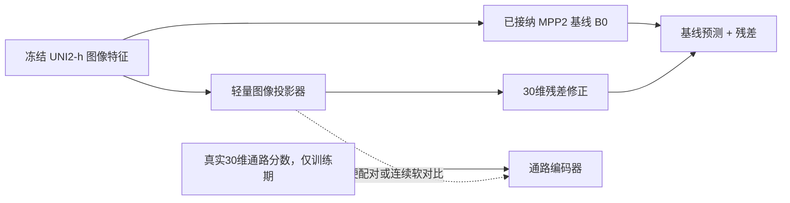

# MPP2 连续通路几何软对比残差四臂探针（W007）：实验设计与当前进度团队共享说明

> 更新日期：2026-08-12  
> 审核状态：**待用户审核的团队共享草稿**  
> 当前结论：实验设计与工程实现已经完成；正式训练尚未真正开始，暂无四臂性能结果。  
> 阅读建议：先看“核心思路”“四臂比较”和“当前进度”，约 5 分钟。

## 1. 一句话说明

W007 想验证：在不重新训练病理图像主干模型的前提下，能否用一个轻量残差修正器改善 MPP2 的 30 维通路分数预测；进一步判断普通对比学习和更符合连续生物状态的软对比学习，是否能在相同模型容量下带来额外收益。

> 原文定位：[部署方案：一句话决策摘要](01_部署方案原文_带导航锚点.md#dp-summary)｜[学习指南：实验真正要回答什么](02_学习指南原文_带导航锚点.md#lg-overview)

## 2. 为什么开展这个实验

当前已接纳的 MPP2 冻结基线在外部 XZY 数据上的 pooled PCC（整体皮尔逊相关系数）为 `0.6549`，说明预测能跟随总体升降趋势；但 raw MAE（原始尺度平均绝对误差）为 `1176.21`，mean raw R² 为 `-0.088`，说明绝对数值仍存在明显偏差。

已有 LoRA、Huber 损失和逐通路 Ridge 校准没有形成稳定改进。因此，W007 不再继续简单调参，而是把问题拆成三个可验证的假设：

1. 只加轻量残差修正器，能否改善绝对误差？
2. 图像与通路之间的普通硬配对对比学习，是否提供额外收益？
3. 把通路状态视为连续相似关系，而不是“相同/不同”二分类，是否更符合生物学结构？

> 原文定位：[部署方案：事实、动机与证据边界](01_部署方案原文_带导航锚点.md#dp-background)｜[学习指南：为什么 PCC 尚好仍不够](02_学习指南原文_带导航锚点.md#lg-metric-problem)

## 3. 核心模型思路

```text
最终预测 = 冻结的 MPP2 基线预测 + 新学习的轻量残差
```

- 基线模型完全冻结，作为稳定锚点。
- 新分支从零残差开始，训练起点严格等于原基线。
- 通路编码器只在训练时提供监督；实际推理仍只需要病理图像特征。
- 首轮不微调 UNI2-h，不重算 ssGSEA、数据划分或 z-score 参数。



> 原文定位：[部署方案：核心模型设计](01_部署方案原文_带导航锚点.md#dp-model)｜[学习指南：统一模型架构](02_学习指南原文_带导航锚点.md#lg-model)

## 4. 为什么需要四个实验臂

| 实验臂 | 中文解释 | 与前一层相比新增什么 | 回答的问题 |
|---|---|---|---|
| FBR | Frozen Baseline Replay，冻结基线复放 | 不训练新模型 | 当前批次能否忠实复现已接纳基线？ |
| RCC | Residual Capacity Control，残差容量对照 | 增加轻量残差分支 | 残差结构本身是否有效？ |
| HCR | Hard-Pair Contrastive Residual，硬配对对比残差 | 在 RCC 上增加一对一硬配对对比损失 | 普通对比学习是否提供额外收益？ |
| CPGCR | Continuous Pathway-Geometry Contrastive Residual，连续通路几何软对比残差 | 把硬配对改为连续通路相似度软目标 | 连续生物几何是否优于硬负样本假设？ |

这套设计的关键不是“同时试四个模型”，而是让每次比较只回答一个问题：

- RCC 对 FBR：残差修正有没有用；
- HCR 对 RCC：普通对比学习有没有额外作用；
- CPGCR 对 HCR：连续软目标是否比硬配对更合适。

> 原文定位：[部署方案：四臂实验合同](01_部署方案原文_带导航锚点.md#dp-arms)｜[学习指南：四臂定义](02_学习指南原文_带导航锚点.md#lg-arms)｜[学习指南：四臂因果逻辑](02_学习指南原文_带导航锚点.md#lg-arm-logic)

## 5. CPGCR 的直观含义

普通硬配对对比学习把“同一个 spot”视为正样本，把其他 spot 都视为负样本。但通路状态通常是连续变化的：两个不同 spot 可能具有非常接近的生物状态，不应被强行当作完全相反的样本。

CPGCR 根据训练折内真实的 30 维通路距离生成连续相似度：

- 通路状态越接近，目标相似度越高；
- 状态差异越大，目标相似度越低；
- 相似度尺度只用训练折估计，不读取内部验证集或 XZY。

它的目标是让图像表示保留连续通路结构，同时继续由绝对预测损失约束最终数值。它是待验证的候选机制，并不预设一定优于 HCR。

> 原文定位：[部署方案：CPGCR 连续几何软对比损失](01_部署方案原文_带导航锚点.md#dp-cpgcr)｜[学习指南：连续软标签](02_学习指南原文_带导航锚点.md#lg-soft-target)｜[学习指南：CPGCR 损失](02_学习指南原文_带导航锚点.md#lg-cpgcr)

## 6. 公平比较和数据边界

四臂比较固定以下条件：

- 使用相同数据、患者划分、随机种子和训练预算；
- RCC、HCR、CPGCR 使用相同图像端参数量和残差结构；
- HCR 与 CPGCR 使用相同批次候选集合，只改变对比目标；
- 每批对 6 名训练患者等量采样，减少大样本患者主导训练；
- checkpoint（训练检查点）只根据内部验证集选择并冻结；
- 每臂冻结后仅在 XZY 上评估一次；XZY 不参与调参、重选 checkpoint 或触发重跑；
- Phase 3 的 pCR/MPR 结果只提供研究动机，不参与 W007 模型选择。

> 原文定位：[部署方案：数据与防泄漏合同](01_部署方案原文_带导航锚点.md#dp-data)｜[学习指南：什么是数据泄漏](02_学习指南原文_带导航锚点.md#lg-leakage)｜[学习指南：XZY 使用边界](02_学习指南原文_带导航锚点.md#lg-xzy-boundary)

## 7. 如何评价结果

内部选择优先关注 patient-balanced z-MSE，即先在每名患者内计算标准化均方误差，再让患者等权汇总。

最终同时报告：

- raw MAE：绝对预测误差；
- raw R²：绝对数值解释能力；
- PCC：总体升降趋势是否一致；
- CCC：预测与真实值在趋势和数值一致性上的综合表现；
- 患者级、通路级结果：检查收益是否只来自少数患者或少数通路；
- 表示诊断：检查模型是否只学习患者身份、是否发生表示塌缩。

性能未提升时不会自动继续或停止。项目会先报告现象、风险和证据缺口，再由用户决定下一步。

> 原文定位：[部署方案：指标、选择与诊断](01_部署方案原文_带导航锚点.md#dp-evaluation)｜[部署方案：用户决策矩阵](01_部署方案原文_带导航锚点.md#dp-decision)｜[学习指南：指标为何存在](02_学习指南原文_带导航锚点.md#lg-metrics)

## 8. 当前实际进度

截至 2026-08-12：

### 已完成

- W007 工作树、实验身份和四臂协议已经绑定；
- 冻结基线、残差模型、HCR、CPGCR、患者均衡批次与训练折温度计算已经实现；
- 内部验证与 XZY 评估入口已经隔离；
- 一键测试、训练控制、失败即停和结果回传已经实现；
- 本地最简测试及服务器就绪检查已经完成过；
- 正式批次的三次训练预算已经预留，分别对应 RCC、HCR、CPGCR；FBR 只复放，不消耗训练次数。

### 预检发现并已修复

- 首次正式预检发现标签路径错误，可能读取旧标签；已改为按冻结数据清单读取 active repaired labels（当前修复版标签）。
- 失败结果回传曾因暂存区续接问题受阻；已增加“只恢复并回传既有失败日志、不重新训练”的修复。

这些故障都发生在真正模型拟合之前，未出现 `EXPERIMENT_STARTED`，因此没有消耗三次训练预算，也没有产生可比较的性能结果。

### 当前等待

- 使用修复后的源码重新完成服务器预检和失败日志回传核验；
- 核验通过后，再按 FBR → RCC → HCR → CPGCR 的固定顺序启动正式批次；
- 四臂全部完成并回传原始预测后，再做统一比较。

> 设计阶段原文定位：[部署方案：实施步骤与停止点](01_部署方案原文_带导航锚点.md#dp-execution)｜[学习指南：完整回传后统一判读](02_学习指南原文_带导航锚点.md#lg-evaluation)。本节实时进度晚于两份原文，以本共享说明日期为准。

## 9. 现在还不能得出的结论

- 不能说残差修正已经优于基线；
- 不能说对比学习已经有效；
- 不能说 CPGCR 已经优于 HCR；
- 不能说该组合已经证明具有全球创新性；
- 不能根据预检通过或代码测试通过推断模型性能。

目前可以确认的是：实验问题、对照关系、评估边界和工程实现已经准备到位，但科学有效性仍必须等待四臂结果。

> 原文定位：[部署方案：风险与解释边界](01_部署方案原文_带导航锚点.md#dp-risks)｜[学习指南：风险登记](02_学习指南原文_带导航锚点.md#lg-risks)｜[学习指南：最终边界声明](02_学习指南原文_带导航锚点.md#lg-boundary)

## 10. 希望团队重点反馈什么

1. FBR → RCC → HCR → CPGCR 是否足以区分残差容量、普通对比和连续软目标的贡献？
2. patient-balanced z-MSE、raw MAE、raw R²、PCC、CCC 是否覆盖了团队关心的主要表现？
3. CPGCR 的“连续通路相似度”是否具有合理的生物学解释？
4. 是否还存在可能影响公平比较的数据、患者或批次混杂因素？
5. 四臂冻结后，哪些输出最值得作为后续 Phase 3 的独立输入？

> 原文定位：[部署方案：用户已批准的核心决定](01_部署方案原文_带导航锚点.md#dp-approved-decisions)｜[学习指南：用户审核清单](02_学习指南原文_带导航锚点.md#lg-review)

## 11. 分享包内原始资料

- [部署方案原文副本](01_部署方案原文_带导航锚点.md)
- [实验设计学习指南原文副本](02_学习指南原文_带导航锚点.md)
- [返回分享包入口](README_从这里开始.md)

本文只用于帮助团队快速理解，不替代正式实验 Registry 或后续结果报告。
